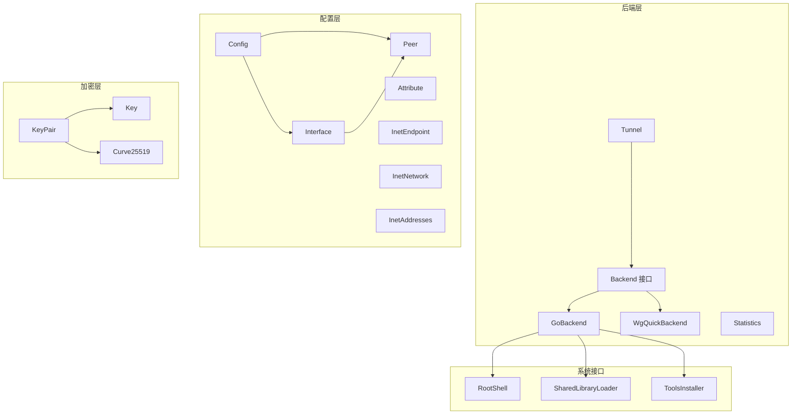
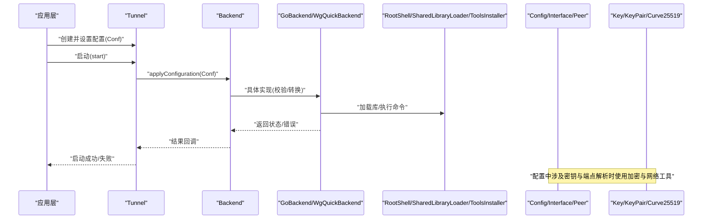
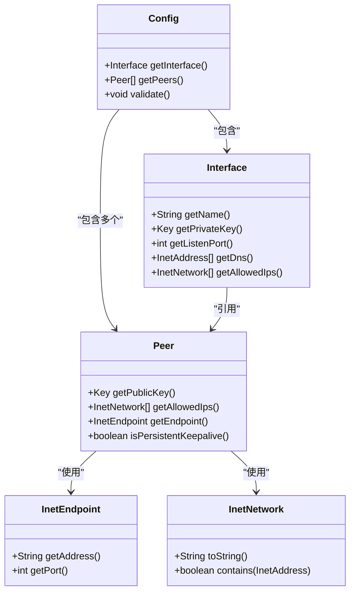
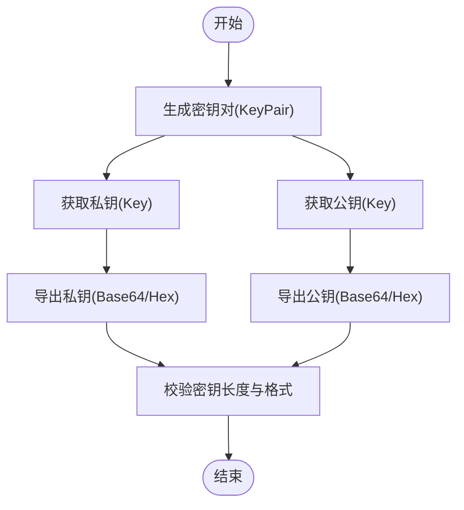
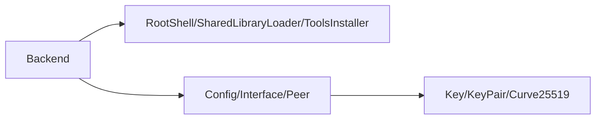

# API 参考文档

<cite>
**本文档引用的文件**
- [Backend.java](file://tunnel/src/main/java/com/wireguard/android/backend/Backend.java)
- [BackendException.java](file://tunnel/src/main/java/com/wireguard/android/backend/BackendException.java)
- [GoBackend.java](file://tunnel/src/main/java/com/wireguard/android/backend/GoBackend.java)
- [Statistics.java](file://tunnel/src/main/java/com/wireguard/android/backend/Statistics.java)
- [Tunnel.java](file://tunnel/src/main/java/com/wireguard/android/backend/Tunnel.java)
- [WgQuickBackend.java](file://tunnel/src/main/java/com/wireguard/android/backend/WgQuickBackend.java)
- [RootShell.java](file://tunnel/src/main/java/com/wireguard/android/util/RootShell.java)
- [SharedLibraryLoader.java](file://tunnel/src/main/java/com/wireguard/android/util/SharedLibraryLoader.java)
- [ToolsInstaller.java](file://tunnel/src/main/java/com/wireguard/android/util/ToolsInstaller.java)
- [Config.java](file://tunnel/src/main/java/com/wireguard/config/Config.java)
- [Interface.java](file://tunnel/src/main/java/com/wireguard/config/Interface.java)
- [Peer.java](file://tunnel/src/main/java/com/wireguard/config/Peer.java)
- [Attribute.java](file://tunnel/src/main/java/com/wireguard/config/Attribute.java)
- [BadConfigException.java](file://tunnel/src/main/java/com/wireguard/config/BadConfigException.java)
- [InetAddresses.java](file://tunnel/src/main/java/com/wireguard/config/InetAddresses.java)
- [InetEndpoint.java](file://tunnel/src/main/java/com/wireguard/config/InetEndpoint.java)
- [InetNetwork.java](file://tunnel/src/main/java/com/wireguard/config/InetNetwork.java)
- [ParseException.java](file://tunnel/src/main/java/com/wireguard/config/ParseException.java)
- [Curve25519.java](file://tunnel/src/main/java/com/wireguard/crypto/Curve25519.java)
- [Key.java](file://tunnel/src/main/java/com/wireguard/crypto/Key.java)
- [KeyPair.java](file://tunnel/src/main/java/com/wireguard/crypto/KeyPair.java)
- [KeyFormatException.java](file://tunnel/src/main/java/com/wireguard/crypto/KeyFormatException.java)
</cite>

## 目录
1. [简介](#简介)
2. [项目结构](#项目结构)
3. [核心组件](#核心组件)
4. [架构总览](#架构总览)
5. [详细组件分析](#详细组件分析)
6. [依赖关系分析](#依赖关系分析)
7. [性能注意事项](#性能注意事项)
8. [故障排查指南](#故障排查指南)
9. [结论](#结论)
10. [附录](#附录)

## 简介
本 API 参考文档面向 WireGuard Android 项目的开发者，聚焦于 tunnel 模块中的核心接口与类，包括：
- Backend 接口及其实现（GoBackend、WgQuickBackend）
- Config、Interface、Peer 配置模型
- 加密相关 API：Curve25519、Key、KeyPair
- 系统接口：RootShell、SharedLibraryLoader、ToolsInstaller

文档提供方法签名说明、参数与返回值类型、异常处理、线程安全建议以及常见用法示例路径，帮助读者快速集成与正确使用。

## 项目结构
tunnel 模块采用按功能域划分的包结构：
- com.wireguard.android.backend：隧道后端抽象与实现、统计信息、隧道封装
- com.wireguard.config：WireGuard 配置文件解析与模型
- com.wireguard.crypto：曲线与密钥工具
- com.wireguard.util：系统级工具（RootShell、库加载、工具安装）

图表来源
- [Backend.java](file://tunnel/src/main/java/com/wireguard/android/backend/Backend.java)
- [GoBackend.java](file://tunnel/src/main/java/com/wireguard/android/backend/GoBackend.java)
- [WgQuickBackend.java](file://tunnel/src/main/java/com/wireguard/android/backend/WgQuickBackend.java)
- [Tunnel.java](file://tunnel/src/main/java/com/wireguard/android/backend/Tunnel.java)
- [Statistics.java](file://tunnel/src/main/java/com/wireguard/android/backend/Statistics.java)
- [Config.java](file://tunnel/src/main/java/com/wireguard/config/Config.java)
- [Interface.java](file://tunnel/src/main/java/com/wireguard/config/Interface.java)
- [Peer.java](file://tunnel/src/main/java/com/wireguard/config/Peer.java)
- [Attribute.java](file://tunnel/src/main/java/com/wireguard/config/Attribute.java)
- [InetEndpoint.java](file://tunnel/src/main/java/com/wireguard/config/InetEndpoint.java)
- [InetNetwork.java](file://tunnel/src/main/java/com/wireguard/config/InetNetwork.java)
- [InetAddresses.java](file://tunnel/src/main/java/com/wireguard/config/InetAddresses.java)
- [Key.java](file://tunnel/src/main/java/com/wireguard/crypto/Key.java)
- [KeyPair.java](file://tunnel/src/main/java/com/wireguard/crypto/KeyPair.java)
- [Curve25519.java](file://tunnel/src/main/java/com/wireguard/crypto/Curve25519.java)
- [RootShell.java](file://tunnel/src/main/java/com/wireguard/android/util/RootShell.java)
- [SharedLibraryLoader.java](file://tunnel/src/main/java/com/wireguard/android/util/SharedLibraryLoader.java)
- [ToolsInstaller.java](file://tunnel/src/main/java/com/wireguard/android/util/ToolsInstaller.java)

章节来源
- [Backend.java](file://tunnel/src/main/java/com/wireguard/android/backend/Backend.java)
- [Config.java](file://tunnel/src/main/java/com/wireguard/config/Config.java)
- [Key.java](file://tunnel/src/main/java/com/wireguard/crypto/Key.java)
- [RootShell.java](file://tunnel/src/main/java/com/wireguard/android/util/RootShell.java)

## 核心组件
本节概述关键接口与类的职责与交互方式，为后续详细分析奠定基础。

- Backend：定义隧道生命周期管理、配置应用、状态查询等核心操作。
- GoBackend/WgQuickBackend：具体后端实现，分别对接 Go 内核模块或 wg-quick 脚本。
- Tunnel：对单个隧道的封装，持有配置与后端句柄，暴露启停、统计等方法。
- Statistics：描述连接统计信息（如字节数、时间戳等）。
- Config/Interface/Peer：WireGuard 配置的顶层对象与子对象，用于构建和验证配置。
- Key/KeyPair/Curve25519：提供椭圆曲线与密钥生成、序列化/反序列化工具。
- RootShell/SharedLibraryLoader/ToolsInstaller：系统权限、动态库加载与工具安装辅助。

章节来源
- [Backend.java](file://tunnel/src/main/java/com/wireguard/android/backend/Backend.java)
- [GoBackend.java](file://tunnel/src/main/java/com/wireguard/android/backend/GoBackend.java)
- [WgQuickBackend.java](file://tunnel/src/main/java/com/wireguard/android/backend/WgQuickBackend.java)
- [Tunnel.java](file://tunnel/src/main/java/com/wireguard/android/backend/Tunnel.java)
- [Statistics.java](file://tunnel/src/main/java/com/wireguard/android/backend/Statistics.java)
- [Config.java](file://tunnel/src/main/java/com/wireguard/config/Config.java)
- [Interface.java](file://tunnel/src/main/java/com/wireguard/config/Interface.java)
- [Peer.java](file://tunnel/src/main/java/com/wireguard/config/Peer.java)
- [Key.java](file://tunnel/src/main/java/com/wireguard/crypto/Key.java)
- [KeyPair.java](file://tunnel/src/main/java/com/wireguard/crypto/KeyPair.java)
- [Curve25519.java](file://tunnel/src/main/java/com/wireguard/crypto/Curve25519.java)
- [RootShell.java](file://tunnel/src/main/java/com/wireguard/android/util/RootShell.java)
- [SharedLibraryLoader.java](file://tunnel/src/main/java/com/wireguard/android/util/SharedLibraryLoader.java)
- [ToolsInstaller.java](file://tunnel/src/main/java/com/wireguard/android/util/ToolsInstaller.java)

## 架构总览
下图展示从上层调用到后端实现的典型流程，以及配置与加密对象的参与点。

图表来源
- [Tunnel.java](file://tunnel/src/main/java/com/wireguard/android/backend/Tunnel.java)
- [Backend.java](file://tunnel/src/main/java/com/wireguard/android/backend/Backend.java)
- [GoBackend.java](file://tunnel/src/main/java/com/wireguard/android/backend/GoBackend.java)
- [WgQuickBackend.java](file://tunnel/src/main/java/com/wireguard/android/backend/WgQuickBackend.java)
- [RootShell.java](file://tunnel/src/main/java/com/wireguard/android/util/RootShell.java)
- [SharedLibraryLoader.java](file://tunnel/src/main/java/com/wireguard/android/util/SharedLibraryLoader.java)
- [ToolsInstaller.java](file://tunnel/src/main/java/com/wireguard/android/util/ToolsInstaller.java)
- [Config.java](file://tunnel/src/main/java/com/wireguard/config/Config.java)
- [Interface.java](file://tunnel/src/main/java/com/wireguard/config/Interface.java)
- [Peer.java](file://tunnel/src/main/java/com/wireguard/config/Peer.java)
- [Key.java](file://tunnel/src/main/java/com/wireguard/crypto/Key.java)
- [KeyPair.java](file://tunnel/src/main/java/com/wireguard/crypto/KeyPair.java)
- [Curve25519.java](file://tunnel/src/main/java/com/wireguard/crypto/Curve25519.java)

## 详细组件分析

### Backend 接口
- 职责：定义隧道生命周期与配置应用的核心方法，供上层通过统一接口调用不同后端实现。
- 主要方法类别：
  - 配置应用：将 Config 对象转换为后端可识别格式并下发。
  - 状态查询：获取隧道状态、统计信息等。
  - 生命周期：初始化、销毁、重启等。
- 异常：可能抛出 BackendException 表示后端不可用或操作失败。
- 线程安全：建议在调用前确保单例或加锁；避免并发重复 applyConfiguration。

章节来源
- [Backend.java](file://tunnel/src/main/java/com/wireguard/android/backend/Backend.java)
- [BackendException.java](file://tunnel/src/main/java/com/wireguard/android/backend/BackendException.java)

### GoBackend 与 WgQuickBackend
- GoBackend：通过 JNI 调用 Go 实现的 WireGuard 内核模块，适合高性能场景。
- WgQuickBackend：基于 wg-quick 脚本进行配置与应用，便于兼容现有工具链。
- 共同点：均实现 Backend 接口，对外行为一致。
- 差异点：底层依赖不同（JNI vs 脚本），错误码与日志输出有差异。

章节来源
- [GoBackend.java](file://tunnel/src/main/java/com/wireguard/android/backend/GoBackend.java)
- [WgQuickBackend.java](file://tunnel/src/main/java/com/wireguard/android/backend/WgQuickBackend.java)

### Tunnel 与 Statistics
- Tunnel：封装单个隧道的配置与后端句柄，提供 start/stop/status/stats 等方法。
- Statistics：包含流量计数、时间戳等字段，用于监控与展示。
- 使用建议：在 UI 线程更新界面数据时，注意后台线程回调的线程切换。

章节来源
- [Tunnel.java](file://tunnel/src/main/java/com/wireguard/android/backend/Tunnel.java)
- [Statistics.java](file://tunnel/src/main/java/com/wireguard/android/backend/Statistics.java)

### Config、Interface、Peer 配置模型
- Config：顶层配置对象，包含 Interface 与多个 Peer。
- Interface：本地接口配置（名称、私钥、监听端口、DNS、路由等）。
- Peer：远端对等体配置（公钥、允许 IP、端点、持久保持等）。
- 属性与方法：
  - 创建：通过 Builder 或工厂方法构造对象。
  - 修改：setter 方法更新属性。
  - 验证：validate() 检查必填项、格式合法性。
- 异常：BadConfigException、ParseException 用于表达配置错误。

图表来源
- [Config.java](file://tunnel/src/main/java/com/wireguard/config/Config.java)
- [Interface.java](file://tunnel/src/main/java/com/wireguard/config/Interface.java)
- [Peer.java](file://tunnel/src/main/java/com/wireguard/config/Peer.java)
- [InetEndpoint.java](file://tunnel/src/main/java/com/wireguard/config/InetEndpoint.java)
- [InetNetwork.java](file://tunnel/src/main/java/com/wireguard/config/InetNetwork.java)

章节来源
- [Config.java](file://tunnel/src/main/java/com/wireguard/config/Config.java)
- [Interface.java](file://tunnel/src/main/java/com/wireguard/config/Interface.java)
- [Peer.java](file://tunnel/src/main/java/com/wireguard/config/Peer.java)
- [Attribute.java](file://tunnel/src/main/java/com/wireguard/config/Attribute.java)
- [BadConfigException.java](file://tunnel/src/main/java/com/wireguard/config/BadConfigException.java)
- [ParseException.java](file://tunnel/src/main/java/com/wireguard/config/ParseException.java)

### 加密相关 API：Curve25519、Key、KeyPair
- Curve25519：提供曲线运算能力（如标量乘法），通常由底层库实现。
- Key：表示 32 字节的密钥，支持 Base64/Hex 编解码与校验。
- KeyPair：包含私钥与公钥，支持生成、导出、导入。
- 常用流程：
  - 生成密钥对：KeyPair.generate()
  - 私钥转公钥：KeyPair.getPublicKey()
  - 字符串导入：Key.fromBase64()/fromHex()
  - 导出字符串：Key.toBase64()/toHex()
- 异常：KeyFormatException 表示密钥格式不正确。

图表来源
- [KeyPair.java](file://tunnel/src/main/java/com/wireguard/crypto/KeyPair.java)
- [Key.java](file://tunnel/src/main/java/com/wireguard/crypto/Key.java)
- [Curve25519.java](file://tunnel/src/main/java/com/wireguard/crypto/Curve25519.java)
- [KeyFormatException.java](file://tunnel/src/main/java/com/wireguard/crypto/KeyFormatException.java)

章节来源
- [Key.java](file://tunnel/src/main/java/com/wireguard/crypto/Key.java)
- [KeyPair.java](file://tunnel/src/main/java/com/wireguard/crypto/KeyPair.java)
- [Curve25519.java](file://tunnel/src/main/java/com/wireguard/crypto/Curve25519.java)
- [KeyFormatException.java](file://tunnel/src/main/java/com/wireguard/crypto/KeyFormatException.java)

### 系统接口：RootShell、SharedLibraryLoader、ToolsInstaller
- RootShell：以 root 权限执行命令，适用于需要系统级操作的场景。
- SharedLibraryLoader：负责加载 .so 动态库，常用于 JNI 调用。
- ToolsInstaller：安装或更新必要的系统工具（如 wg-quick）。
- 调用方式：
  - 先加载库：SharedLibraryLoader.load()
  - 再执行命令：RootShell.exec(command)
  - 必要时安装工具：ToolsInstaller.installIfNeeded()
- 异常与权限：需处理权限不足、命令执行失败等情况。

章节来源
- [RootShell.java](file://tunnel/src/main/java/com/wireguard/android/util/RootShell.java)
- [SharedLibraryLoader.java](file://tunnel/src/main/java/com/wireguard/android/util/SharedLibraryLoader.java)
- [ToolsInstaller.java](file://tunnel/src/main/java/com/wireguard/android/util/ToolsInstaller.java)

## 依赖关系分析
- Backend 实现依赖系统接口（RootShell、SharedLibraryLoader、ToolsInstaller）完成底层操作。
- Config/Interface/Peer 作为纯数据模型，被 Backend 用于配置下发。
- 加密模块独立于配置与后端，供配置与密钥管理使用。

图表来源
- [Backend.java](file://tunnel/src/main/java/com/wireguard/android/backend/Backend.java)
- [RootShell.java](file://tunnel/src/main/java/com/wireguard/android/util/RootShell.java)
- [SharedLibraryLoader.java](file://tunnel/src/main/java/com/wireguard/android/util/SharedLibraryLoader.java)
- [ToolsInstaller.java](file://tunnel/src/main/java/com/wireguard/android/util/ToolsInstaller.java)
- [Config.java](file://tunnel/src/main/java/com/wireguard/config/Config.java)
- [Interface.java](file://tunnel/src/main/java/com/wireguard/config/Interface.java)
- [Peer.java](file://tunnel/src/main/java/com/wireguard/config/Peer.java)
- [Key.java](file://tunnel/src/main/java/com/wireguard/crypto/Key.java)
- [KeyPair.java](file://tunnel/src/main/java/com/wireguard/crypto/KeyPair.java)
- [Curve25519.java](file://tunnel/src/main/java/com/wireguard/crypto/Curve25519.java)

章节来源
- [Backend.java](file://tunnel/src/main/java/com/wireguard/android/backend/Backend.java)
- [Config.java](file://tunnel/src/main/java/com/wireguard/config/Config.java)
- [Key.java](file://tunnel/src/main/java/com/wireguard/crypto/Key.java)

## 性能注意事项
- 避免频繁重建配置对象：复用 Config/Interface/Peer 实例，减少 GC 压力。
- 批量操作：合并多次 applyConfiguration 调用，降低系统调用开销。
- 异步回调：统计与状态更新应在后台线程执行，UI 更新切换到主线程。
- 密钥操作：KeyPair 生成与编解码属于 CPU 密集操作，应放在后台线程。

[本节为通用指导，不直接分析具体文件]

## 故障排查指南
- 配置错误：捕获 BadConfigException/ParseException，检查必填字段与格式。
- 后端不可用：检查 BackendException，确认库加载与权限。
- 命令执行失败：查看 RootShell 返回码与日志，确认命令可用性与权限。
- 密钥格式错误：捕获 KeyFormatException，核对 Base64/Hex 编码与长度。

章节来源
- [BadConfigException.java](file://tunnel/src/main/java/com/wireguard/config/BadConfigException.java)
- [ParseException.java](file://tunnel/src/main/java/com/wireguard/config/ParseException.java)
- [BackendException.java](file://tunnel/src/main/java/com/wireguard/android/backend/BackendException.java)
- [KeyFormatException.java](file://tunnel/src/main/java/com/wireguard/crypto/KeyFormatException.java)

## 结论
本文档系统化梳理了 WireGuard Android 项目中 Backend、配置模型、加密与系统接口的 API 设计与使用方法。通过统一的接口与清晰的职责划分，开发者可以灵活选择后端实现，正确构建与验证配置，安全地处理密钥，并在需要时调用系统级能力。遵循线程安全与性能建议，有助于提升稳定性与用户体验。

[本节为总结性内容，不直接分析具体文件]

## 附录
- 版本兼容性：
  - 若后端实现升级（如 GoBackend 新增方法），建议通过适配器模式保持向后兼容。
  - 配置模型变更（新增字段）应默认值兼容旧版客户端。
- 迁移指南：
  - 从 WgQuickBackend 迁移到 GoBackend：仅需替换后端实例，无需改动配置与调用逻辑。
  - 密钥格式迁移：统一使用 Base64 或 Hex，避免混用导致解析失败。
- 线程安全：
  - Backend 与 Tunnel 的启停与配置应用应避免并发调用。
  - 统计与状态回调需明确线程上下文，UI 更新在主线程。

[本节为补充说明，不直接分析具体文件]