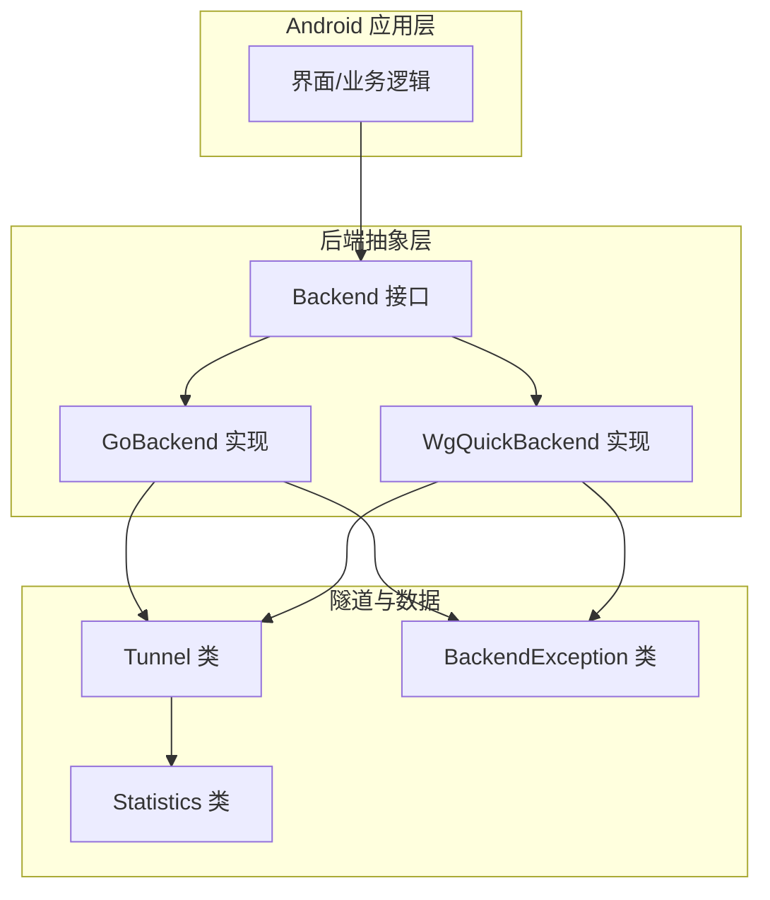
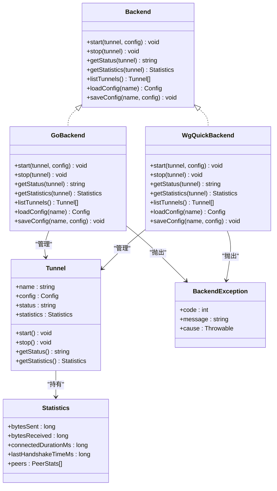
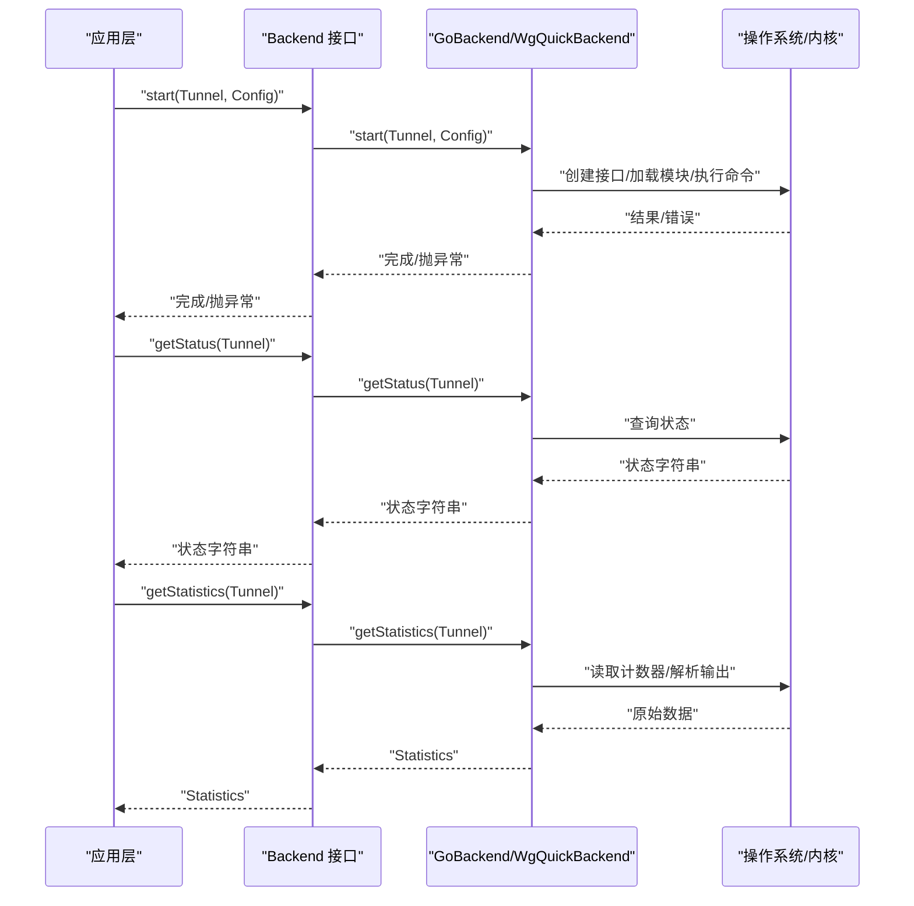

# Backend 接口 API

<cite>
**本文引用的文件**   
- [Backend.java](file://tunnel/src/main/java/com/wireguard/android/backend/Backend.java)
- [GoBackend.java](file://tunnel/src/main/java/com/wireguard/android/backend/GoBackend.java)
- [WgQuickBackend.java](file://tunnel/src/main/java/com/wireguard/android/backend/WgQuickBackend.java)
- [Tunnel.java](file://tunnel/src/main/java/com/wireguard/android/backend/Tunnel.java)
- [Statistics.java](file://tunnel/src/main/java/com/wireguard/android/backend/Statistics.java)
- [BackendException.java](file://tunnel/src/main/java/com/wireguard/android/backend/BackendException.java)
</cite>

## 目录
1. [简介](#简介)
2. [项目结构](#项目结构)
3. [核心组件](#核心组件)
4. [架构总览](#架构总览)
5. [详细组件分析](#详细组件分析)
6. [依赖关系分析](#依赖关系分析)
7. [性能考虑](#性能考虑)
8. [故障排查指南](#故障排查指南)
9. [结论](#结论)
10. [附录](#附录)

## 简介
本文件为 wireguard-android 项目中 Backend 接口的完整 API 文档，聚焦以下目标：
- 记录 Backend 接口的所有方法（如 start、stop、getStatus、getStatistics 等）的参数说明、返回值类型与使用示例。
- 详细说明 Tunnel 类的属性与方法，包括隧道状态管理、配置操作与统计信息获取。
- 记录 Statistics 类的数据结构，包含传输字节数、连接时间等统计字段。
- 提供完整的代码示例展示如何调用这些 API 进行隧道管理。
- 说明异常处理机制与错误码含义。
- 给出线程安全与并发访问的最佳实践。

## 项目结构
Backend 相关代码位于 tunnel 模块的 android.backend 包中，核心文件如下：
- Backend.java：后端抽象接口，定义启动、停止、状态查询、统计等能力。
- GoBackend.java：基于 Go 实现的 Backend 具体实现。
- WgQuickBackend.java：基于 wg-quick 脚本的后端实现。
- Tunnel.java：隧道对象，封装单个隧道的生命周期与配置。
- Statistics.java：统计数据载体，包含流量、时延、连接时长等指标。
- BackendException.java：后端异常，用于统一错误传播。

图表来源
- [Backend.java](file://tunnel/src/main/java/com/wireguard/android/backend/Backend.java)
- [GoBackend.java](file://tunnel/src/main/java/com/wireguard/android/backend/GoBackend.java)
- [WgQuickBackend.java](file://tunnel/src/main/java/com/wireguard/android/backend/WgQuickBackend.java)
- [Tunnel.java](file://tunnel/src/main/java/com/wireguard/android/backend/Tunnel.java)
- [Statistics.java](file://tunnel/src/main/java/com/wireguard/android/backend/Statistics.java)
- [BackendException.java](file://tunnel/src/main/java/com/wireguard/android/backend/BackendException.java)

章节来源
- [Backend.java](file://tunnel/src/main/java/com/wireguard/android/backend/Backend.java)
- [GoBackend.java](file://tunnel/src/main/java/com/wireguard/android/backend/GoBackend.java)
- [WgQuickBackend.java](file://tunnel/src/main/java/com/wireguard/android/backend/WgQuickBackend.java)
- [Tunnel.java](file://tunnel/src/main/java/com/wireguard/android/backend/Tunnel.java)
- [Statistics.java](file://tunnel/src/main/java/com/wireguard/android/backend/Statistics.java)
- [BackendException.java](file://tunnel/src/main/java/com/wireguard/android/backend/BackendException.java)

## 核心组件
- Backend 接口：定义后端能力，包括启动/停止隧道、查询状态、获取统计、列出隧道、加载/保存配置等。
- GoBackend：通过 JNI 调用 Go 实现的 WireGuard 内核模块或用户态实现。
- WgQuickBackend：通过系统命令执行 wg-quick 脚本管理隧道。
- Tunnel：表示一个具体的 WireGuard 隧道实例，持有名称、配置、状态与统计。
- Statistics：承载隧道运行时的统计信息，如发送/接收字节、连接时长、最近握手时间等。
- BackendException：封装后端操作失败的原因与错误码，便于上层统一处理。

章节来源
- [Backend.java](file://tunnel/src/main/java/com/wireguard/android/backend/Backend.java)
- [GoBackend.java](file://tunnel/src/main/java/com/wireguard/android/backend/GoBackend.java)
- [WgQuickBackend.java](file://tunnel/src/main/java/com/wireguard/android/backend/WgQuickBackend.java)
- [Tunnel.java](file://tunnel/src/main/java/com/wireguard/android/backend/Tunnel.java)
- [Statistics.java](file://tunnel/src/main/java/com/wireguard/android/backend/Statistics.java)
- [BackendException.java](file://tunnel/src/main/java/com/wireguard/android/backend/BackendException.java)

## 架构总览
Backend 作为抽象层，屏蔽底层实现差异（Go 或 wg-quick），向上提供统一的隧道管理能力。Tunnel 是业务侧对单个隧道的封装，Statistics 提供运行时指标，BackendException 统一错误传播。

图表来源
- [Backend.java](file://tunnel/src/main/java/com/wireguard/android/backend/Backend.java)
- [GoBackend.java](file://tunnel/src/main/java/com/wireguard/android/backend/GoBackend.java)
- [WgQuickBackend.java](file://tunnel/src/main/java/com/wireguard/android/backend/WgQuickBackend.java)
- [Tunnel.java](file://tunnel/src/main/java/com/wireguard/android/backend/Tunnel.java)
- [Statistics.java](file://tunnel/src/main/java/com/wireguard/android/backend/Statistics.java)
- [BackendException.java](file://tunnel/src/main/java/com/wireguard/android/backend/BackendException.java)

## 详细组件分析

### Backend 接口
- 作用：定义后端抽象，供上层以统一方式管理隧道生命周期与统计。
- 关键方法
  - start：启动指定隧道，参数通常为隧道标识与配置对象；无返回值。
  - stop：停止指定隧道；无返回值。
  - getStatus：返回当前隧道状态字符串（如“已连接”、“未连接”、“错误”）。
  - getStatistics：返回 Statistics 对象，包含流量与时延等指标。
  - listTunnels：返回系统中已配置的隧道列表。
  - loadConfig/saveConfig：读取/保存配置文件。
- 异常：可能抛出 BackendException，携带错误码与消息。

章节来源
- [Backend.java](file://tunnel/src/main/java/com/wireguard/android/backend/Backend.java)

### GoBackend 实现
- 作用：通过 JNI 调用 Go 实现的 WireGuard 后端，提供高性能与稳定性的隧道管理。
- 行为特征
  - 启动/停止：直接调用底层 Go 函数，负责创建/销毁内核或用户态接口。
  - 状态查询：从底层状态机读取并映射为字符串状态。
  - 统计信息：从底层计数器聚合得到 bytesSent、bytesReceived、连接时长、最近握手时间等。
- 异常：将底层错误包装为 BackendException 返回给上层。

章节来源
- [GoBackend.java](file://tunnel/src/main/java/com/wireguard/android/backend/GoBackend.java)

### WgQuickBackend 实现
- 作用：通过系统命令执行 wg-quick 脚本管理隧道，适用于不支持直接内核模块的场景。
- 行为特征
  - 启动/停止：调用 shell 命令执行 wg-quick up/down。
  - 状态查询：解析 ip/link 或 wg show 输出获取状态。
  - 统计信息：解析 wg show 输出计算流量与连接时长。
- 异常：命令执行失败或解析异常时抛出 BackendException。

章节来源
- [WgQuickBackend.java](file://tunnel/src/main/java/com/wireguard/android/backend/WgQuickBackend.java)

### Tunnel 类
- 作用：封装单个隧道的名称、配置、状态与统计，并提供便捷的生命周期方法。
- 属性
  - name：隧道名称。
  - config：配置对象（Interface、Peer 等）。
  - status：当前状态字符串。
  - statistics：Statistics 对象。
- 方法
  - start：委托 Backend.start 启动。
  - stop：委托 Backend.stop 停止。
  - getStatus：委托 Backend.getStatus 获取状态。
  - getStatistics：委托 Backend.getStatistics 获取统计。
- 注意事项
  - 多线程环境下建议外部加锁或使用单线程调度器保证一致性。
  - 配置变更需先 stop，再更新配置后重新 start。

章节来源
- [Tunnel.java](file://tunnel/src/main/java/com/wireguard/android/backend/Tunnel.java)

### Statistics 类
- 作用：承载隧道运行时的统计信息。
- 字段（典型）
  - bytesSent：累计发送字节数。
  - bytesReceived：累计接收字节数。
  - connectedDurationMs：自上次连接建立以来的持续时间（毫秒）。
  - lastHandshakeTimeMs：最近一次成功握手的时间戳（毫秒）。
  - peers：对端统计列表（每个对端可包含收发字节、最后握手时间等）。
- 用途
  - 监控面板展示实时流量与连接质量。
  - 日志与诊断收集。

章节来源
- [Statistics.java](file://tunnel/src/main/java/com/wireguard/android/backend/Statistics.java)

### BackendException 类
- 作用：统一后端异常，包含错误码、消息与原因。
- 常见错误码（示例）
  - 权限不足：需要 root 或特定系统权限。
  - 配置错误：配置文件语法错误或密钥无效。
  - 资源不可用：内核模块未加载或命令不可用。
  - 网络错误：无法绑定端口或路由冲突。
- 使用建议
  - 捕获 BackendException 并根据 code 分支处理。
  - 向用户展示友好提示，同时保留原始 message 用于调试。

章节来源
- [BackendException.java](file://tunnel/src/main/java/com/wireguard/android/backend/BackendException.java)

## 依赖关系分析
- Backend 接口被 GoBackend 与 WgQuickBackend 实现，形成策略模式，便于切换后端。
- Tunnel 依赖 Backend 完成实际工作，Statistics 作为数据载体被 Tunnel 持有。
- 异常由后端实现抛出，统一由 BackendException 承载。

图表来源
- [Backend.java](file://tunnel/src/main/java/com/wireguard/android/backend/Backend.java)
- [GoBackend.java](file://tunnel/src/main/java/com/wireguard/android/backend/GoBackend.java)
- [WgQuickBackend.java](file://tunnel/src/main/java/com/wireguard/android/backend/WgQuickBackend.java)
- [Tunnel.java](file://tunnel/src/main/java/com/wireguard/android/backend/Tunnel.java)
- [Statistics.java](file://tunnel/src/main/java/com/wireguard/android/backend/Statistics.java)

## 性能考虑
- 启动/停止操作可能涉及内核或进程间通信，应避免频繁调用，必要时合并批量操作。
- 统计信息获取应控制频率，避免高频率轮询导致 CPU 占用过高。
- 在 UI 线程外执行后端操作，使用后台线程或协程，防止阻塞主线程。
- 对于 WgQuickBackend，减少 shell 命令调用次数，缓存必要状态。

[本节为通用指导，不直接分析具体文件]

## 故障排查指南
- 常见问题
  - 启动失败：检查权限、内核模块是否可用、配置文件是否正确。
  - 状态异常：确认网络接口是否存在、路由是否冲突、DNS 设置是否合理。
  - 统计为 0：确认隧道是否真正建立连接，或对端是否活跃。
- 定位步骤
  - 捕获 BackendException，打印错误码与消息。
  - 使用 getStatus 与 getStatistics 辅助判断。
  - 查看系统日志与 wg 命令输出（若使用 WgQuickBackend）。
- 恢复策略
  - 重试机制：对临时性错误（如资源忙）进行有限次重试。
  - 降级策略：当 GoBackend 不可用时回退到 WgQuickBackend。

章节来源
- [BackendException.java](file://tunnel/src/main/java/com/wireguard/android/backend/BackendException.java)

## 结论
Backend 接口为 wireguard-android 提供了统一的隧道管理能力，GoBackend 与 WgQuickBackend 两种实现覆盖不同运行环境。Tunnel 与 Statistics 分别封装了生命周期与统计信息，BackendException 统一错误传播。遵循本文档的用法与最佳实践，可实现稳定、高效的隧道管理与监控。

[本节为总结，不直接分析具体文件]

## 附录

### API 使用示例（概念流程）
- 初始化后端
  - 选择 GoBackend 或 WgQuickBackend 实例。
- 创建隧道
  - 构造 Tunnel，设置名称与配置。
- 启动隧道
  - 调用 Backend.start(Tunnel, Config)。
- 查询状态
  - 调用 Backend.getStatus(Tunnel) 或 Tunnel.getStatus()。
- 获取统计
  - 调用 Backend.getStatistics(Tunnel) 或 Tunnel.getStatistics()。
- 停止隧道
  - 调用 Backend.stop(Tunnel) 或 Tunnel.stop()。
- 异常处理
  - 捕获 BackendException，根据 code 分支处理。

[本节为概念流程，不直接分析具体文件]

### 线程安全与并发最佳实践
- 单例后端：确保全局只有一个 Backend 实例，避免竞态条件。
- 串行化操作：对同一 Tunnel 的 start/stop/status/statistics 调用应在同一线程或加锁保护。
- 异步回调：UI 更新应在主线程，后端操作在后台线程执行。
- 幂等设计：重复调用 start/stop 时应具备幂等性或明确的状态校验。

[本节为通用指导，不直接分析具体文件]