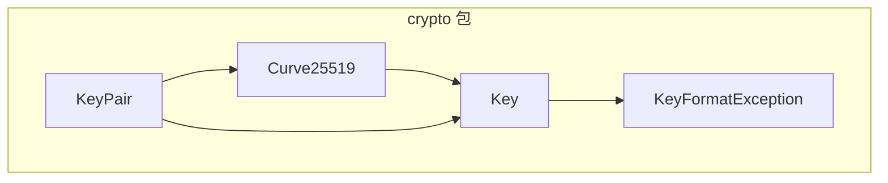
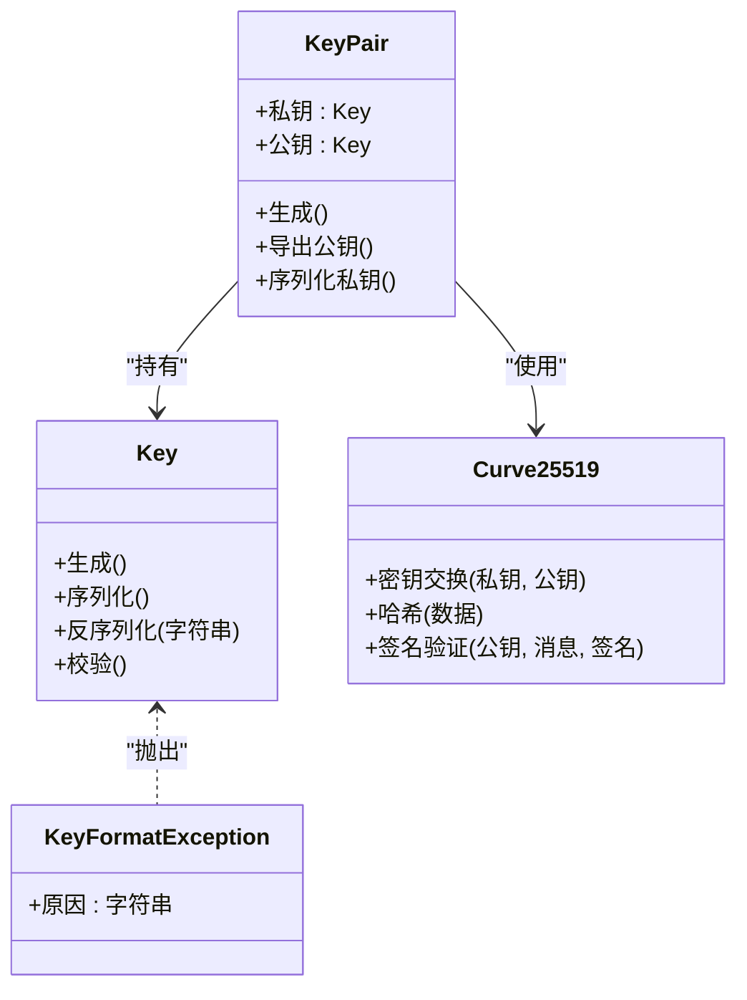
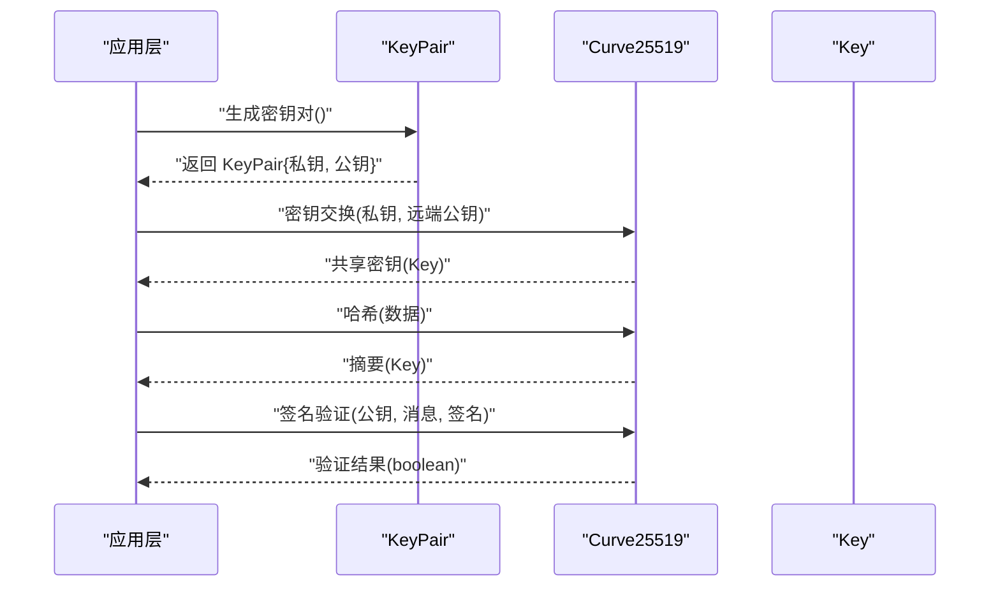
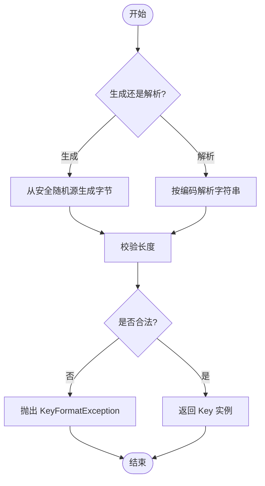
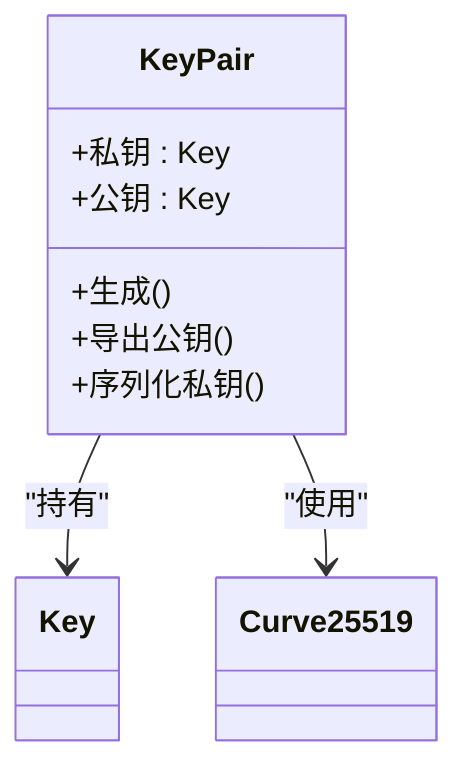
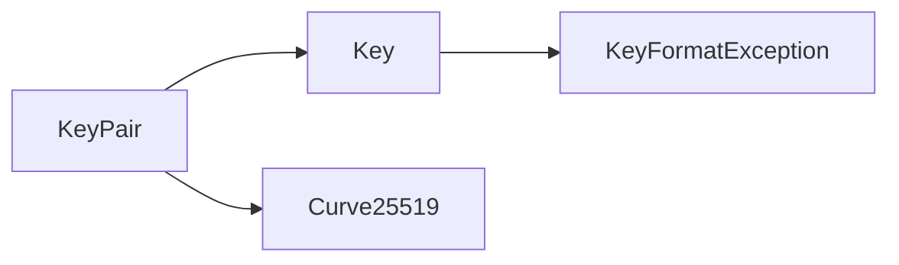
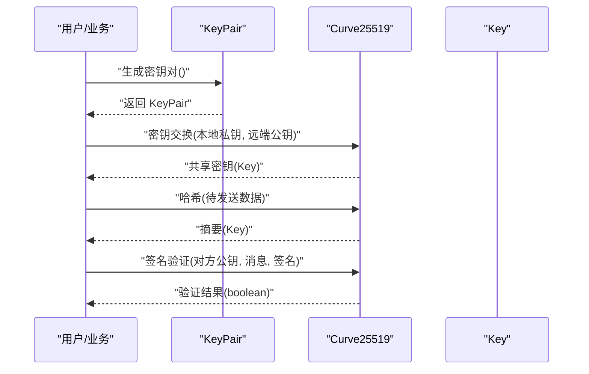

# 加密安全 API

<cite>
**本文引用的文件**   
- [Curve25519.java](file://tunnel/src/main/java/com/wireguard/crypto/Curve25519.java)
- [Key.java](file://tunnel/src/main/java/com/wireguard/crypto/Key.java)
- [KeyPair.java](file://tunnel/src/main/java/com/wireguard/crypto/KeyPair.java)
- [KeyFormatException.java](file://tunnel/src/main/java/com/wireguard/crypto/KeyFormatException.java)
</cite>

## 目录
1. [简介](#简介)
2. [项目结构](#项目结构)
3. [核心组件](#核心组件)
4. [架构总览](#架构总览)
5. [详细组件分析](#详细组件分析)
6. [依赖关系分析](#依赖关系分析)
7. [性能考虑](#性能考虑)
8. [故障排查指南](#故障排查指南)
9. [结论](#结论)
10. [附录：使用示例与最佳实践](#附录使用示例与最佳实践)

## 简介
本文件面向 WireGuard Android 中的加密安全相关 API，重点覆盖以下能力：
- Curve25519 椭圆曲线加密方法：密钥交换、签名验证与哈希计算
- Key 类的密钥操作方法：生成、序列化与校验
- KeyPair 类的密钥对管理：公私钥对的创建与操作
- KeyFormatException 异常处理策略
- 完整加密操作示例：密钥生成、数据加解密与签名验证
- 安全最佳实践与性能考量
- 与 WireGuard 协议的兼容性说明

## 项目结构
加密安全相关代码位于 tunnel 模块的 com.wireguard.crypto 包中，包含四个核心类：
- Curve25519：提供基于 Curve25519 的密码学原语（如 ECDH、哈希等）
- Key：表示固定长度的密钥字节序列，并提供生成、序列化与校验方法
- KeyPair：封装私钥与公钥，便于成对管理与转换
- KeyFormatException：用于描述密钥格式不合法时的异常

图表来源
- [Curve25519.java](file://tunnel/src/main/java/com/wireguard/crypto/Curve25519.java)
- [Key.java](file://tunnel/src/main/java/com/wireguard/crypto/Key.java)
- [KeyPair.java](file://tunnel/src/main/java/com/wireguard/crypto/KeyPair.java)
- [KeyFormatException.java](file://tunnel/src/main/java/com/wireguard/crypto/KeyFormatException.java)

章节来源
- [Curve25519.java](file://tunnel/src/main/java/com/wireguard/crypto/Curve25519.java)
- [Key.java](file://tunnel/src/main/java/com/wireguard/crypto/Key.java)
- [KeyPair.java](file://tunnel/src/main/java/com/wireguard/crypto/KeyPair.java)
- [KeyFormatException.java](file://tunnel/src/main/java/com/wireguard/crypto/KeyFormatException.java)

## 核心组件
- Curve25519
  - 职责：实现基于 Curve25519 的密码学运算，包括密钥交换（ECDH）、哈希计算以及可能的签名验证接口。
  - 典型用法：通过公钥与私钥进行共享密钥推导；对消息或数据进行哈希摘要；在需要时参与签名验证流程。
- Key
  - 职责：表示固定长度（通常为 32 字节）的密钥字节序列，提供从随机源生成、Base64/Base58 序列化/反序列化、以及基本合法性校验的方法。
  - 典型用法：作为 Curve25519 操作的输入输出载体；在配置解析与持久化过程中进行编解码。
- KeyPair
  - 职责：封装私钥与公钥，支持从随机源生成密钥对、将私钥导出为公钥、以及将私钥序列化为字符串（通常用于配置文件）。
  - 典型用法：在隧道建立前准备本地密钥对；将公钥暴露给远端；在握手阶段参与密钥交换。
- KeyFormatException
  - 职责：当密钥字符串无法被正确解析（长度不符、字符非法、编码错误等）时抛出，供上层捕获并给出明确错误提示。

章节来源
- [Curve25519.java](file://tunnel/src/main/java/com/wireguard/crypto/Curve25519.java)
- [Key.java](file://tunnel/src/main/java/com/wireguard/crypto/Key.java)
- [KeyPair.java](file://tunnel/src/main/java/com/wireguard/crypto/KeyPair.java)
- [KeyFormatException.java](file://tunnel/src/main/java/com/wireguard/crypto/KeyFormatException.java)

## 架构总览
下图展示了关键类之间的依赖关系与交互方式：
- KeyPair 依赖 Key 来持有私钥与公钥，并可调用 Curve25519 进行必要的派生或验证操作。
- Key 负责统一的密钥表示与序列化，是配置与网络传输的桥梁。
- Curve25519 作为底层密码学原语提供者，被 KeyPair 和上层业务逻辑共同使用。

图表来源
- [Curve25519.java](file://tunnel/src/main/java/com/wireguard/crypto/Curve25519.java)
- [Key.java](file://tunnel/src/main/java/com/wireguard/crypto/Key.java)
- [KeyPair.java](file://tunnel/src/main/java/com/wireguard/crypto/KeyPair.java)
- [KeyFormatException.java](file://tunnel/src/main/java/com/wireguard/crypto/KeyFormatException.java)

## 详细组件分析

### Curve25519 组件分析
- 功能要点
  - 密钥交换：给定本地私钥与远端公钥，计算共享密钥（ECDH），用于后续对称加密或密钥派生。
  - 哈希计算：对任意输入数据进行哈希摘要，常用于消息完整性校验或密钥派生。
  - 签名验证：在需要时，使用公钥验证消息与签名的匹配性（若实现包含该能力）。
- 复杂度与性能
  - 密钥交换与哈希均为常数时间操作（输入长度固定或线性），适合高频调用。
  - 建议避免重复分配临时对象，尽量复用缓冲区以降低 GC 压力。
- 错误处理
  - 输入参数为空或长度非法时应抛出明确的异常（例如 KeyFormatException 或运行时异常）。
  - 对无效公钥点或边界值应进行严格校验，防止侧信道攻击。

图表来源
- [Curve25519.java](file://tunnel/src/main/java/com/wireguard/crypto/Curve25519.java)
- [KeyPair.java](file://tunnel/src/main/java/com/wireguard/crypto/KeyPair.java)
- [Key.java](file://tunnel/src/main/java/com/wireguard/crypto/Key.java)

章节来源
- [Curve25519.java](file://tunnel/src/main/java/com/wireguard/crypto/Curve25519.java)

### Key 组件分析
- 功能要点
  - 生成：从安全的随机源生成固定长度的密钥字节序列。
  - 序列化/反序列化：支持 Base64 或 Base58 等编码格式，便于存储与传输。
  - 校验：检查长度、字符集与编码是否正确，必要时进行数值范围校验。
- 数据结构与复杂度
  - 内部以固定长度字节数组表示，所有操作的时间复杂度为 O(n)，n 为密钥长度（常量）。
- 错误处理
  - 反序列化失败时抛出 KeyFormatException，包含具体原因以便上层定位问题。

图表来源
- [Key.java](file://tunnel/src/main/java/com/wireguard/crypto/Key.java)
- [KeyFormatException.java](file://tunnel/src/main/java/com/wireguard/crypto/KeyFormatException.java)

章节来源
- [Key.java](file://tunnel/src/main/java/com/wireguard/crypto/Key.java)
- [KeyFormatException.java](file://tunnel/src/main/java/com/wireguard/crypto/KeyFormatException.java)

### KeyPair 组件分析
- 功能要点
  - 生成：从安全随机源生成私钥，并据此推导出公钥。
  - 导出公钥：由私钥计算公钥，确保一致性。
  - 序列化私钥：将私钥转换为可存储/传输的字符串格式（如 Base58）。
- 依赖关系
  - 依赖 Key 表示私钥与公钥。
  - 可能依赖 Curve25519 进行公钥推导或辅助校验。

图表来源
- [KeyPair.java](file://tunnel/src/main/java/com/wireguard/crypto/KeyPair.java)
- [Key.java](file://tunnel/src/main/java/com/wireguard/crypto/Key.java)
- [Curve25519.java](file://tunnel/src/main/java/com/wireguard/crypto/Curve25519.java)

章节来源
- [KeyPair.java](file://tunnel/src/main/java/com/wireguard/crypto/KeyPair.java)

### KeyFormatException 异常处理
- 触发场景
  - 密钥字符串长度不符合预期
  - 包含非法字符或编码不正确
  - 数值超出允许范围（如非标准基数的位串）
- 处理建议
  - 在反序列化入口统一捕获，记录详细上下文（字段名、原始字符串片段）。
  - 向用户展示友好错误信息，同时保留原始异常链以便调试。
  - 在单元测试中覆盖常见非法输入，确保健壮性。

章节来源
- [KeyFormatException.java](file://tunnel/src/main/java/com/wireguard/crypto/KeyFormatException.java)

## 依赖关系分析
- 耦合度
  - KeyPair 对 Key 的耦合较高（直接持有实例），对 Curve25519 的耦合较低（仅调用必要方法）。
  - Key 与 KeyFormatException 的耦合体现在解析与校验路径。
- 内聚性
  - 每个类职责单一：Key 专注表示与编解码，KeyPair 专注密钥对管理，Curve25519 专注密码学原语。
- 外部依赖
  - 安全随机源（系统级 CSPRNG）
  - 编码库（Base64/Base58）
  - 可选：签名库（若 Curve25519 提供签名验证）

图表来源
- [KeyPair.java](file://tunnel/src/main/java/com/wireguard/crypto/KeyPair.java)
- [Key.java](file://tunnel/src/main/java/com/wireguard/crypto/Key.java)
- [Curve25519.java](file://tunnel/src/main/java/com/wireguard/crypto/Curve25519.java)
- [KeyFormatException.java](file://tunnel/src/main/java/com/wireguard/crypto/KeyFormatException.java)

章节来源
- [KeyPair.java](file://tunnel/src/main/java/com/wireguard/crypto/KeyPair.java)
- [Key.java](file://tunnel/src/main/java/com/wireguard/crypto/Key.java)
- [Curve25519.java](file://tunnel/src/main/java/com/wireguard/crypto/Curve25519.java)
- [KeyFormatException.java](file://tunnel/src/main/java/com/wireguard/crypto/KeyFormatException.java)

## 性能考虑
- 内存分配
  - 避免在热点路径频繁创建临时字节数组；必要时复用缓冲区。
- 算法选择
  - 优先使用硬件加速的椭圆曲线实现（若平台支持）。
  - 哈希与密钥交换应为常数时间，避免分支泄露时序信息。
- I/O 与编码
  - Base58/Base64 编解码开销较小，但应避免在循环中重复解析同一字符串。
- 并发
  - 保证线程安全：Key 与 KeyPair 应为不可变或具备合适的同步策略。

[本节为通用指导，无需特定文件引用]

## 故障排查指南
- 常见问题
  - 密钥解析失败：检查字符串长度、字符集与编码格式。
  - 密钥交换失败：确认私钥与公钥配对一致，且未发生越界或非法点。
  - 签名验证失败：核对消息内容、签名顺序与编码格式。
- 定位步骤
  - 捕获 KeyFormatException，打印原始字符串与字段名。
  - 使用最小复现用例，逐步缩小问题范围。
  - 对比 WireGuard 参考实现的输入输出，确保兼容。

章节来源
- [KeyFormatException.java](file://tunnel/src/main/java/com/wireguard/crypto/KeyFormatException.java)

## 结论
WireGuard Android 的加密安全 API 围绕 Curve25519、Key、KeyPair 与 KeyFormatException 构建，提供了清晰的职责划分与稳定的接口设计。遵循本文的最佳实践与性能建议，可在保证安全性的前提下获得良好的运行效率与可维护性。

[本节为总结性内容，无需特定文件引用]

## 附录：使用示例与最佳实践

### 完整操作流程（概念性序列图）

图表来源
- [Curve25519.java](file://tunnel/src/main/java/com/wireguard/crypto/Curve25519.java)
- [KeyPair.java](file://tunnel/src/main/java/com/wireguard/crypto/KeyPair.java)
- [Key.java](file://tunnel/src/main/java/com/wireguard/crypto/Key.java)

### 安全最佳实践
- 始终使用安全随机源生成密钥，禁止硬编码或弱随机数。
- 对输入进行严格校验，拒绝非法长度与字符。
- 避免在日志中输出敏感信息（私钥、共享密钥、签名）。
- 使用恒定时间比较函数进行密钥或摘要比较，防止时序攻击。
- 定期轮换密钥，限制密钥生命周期。

[本节为通用指导，无需特定文件引用]

### 性能优化建议
- 缓存可重用的常量与缓冲区，减少 GC 压力。
- 批量处理哈希与加密任务，降低函数调用开销。
- 在 Android 上启用 NDK/JNI 加速（若可用），提升曲线运算速度。

[本节为通用指导，无需特定文件引用]

### 与 WireGuard 协议的兼容性说明
- 密钥长度与编码
  - 私钥/公钥长度为 32 字节，常用 Base58 编码用于配置文件与分享。
- 密钥交换
  - 使用 Curve25519 进行 ECDH 共享密钥推导，符合 WireGuard 规范。
- 哈希与派生
  - 采用标准哈希算法进行密钥派生与消息完整性校验。
- 签名与验证
  - 若涉及签名，需遵循 WireGuard 的签名方案与编码约定。
- 互操作性
  - 确保与官方 WireGuard 实现在输入输出、编码与大小端处理上保持一致。

[本节为通用指导，无需特定文件引用]