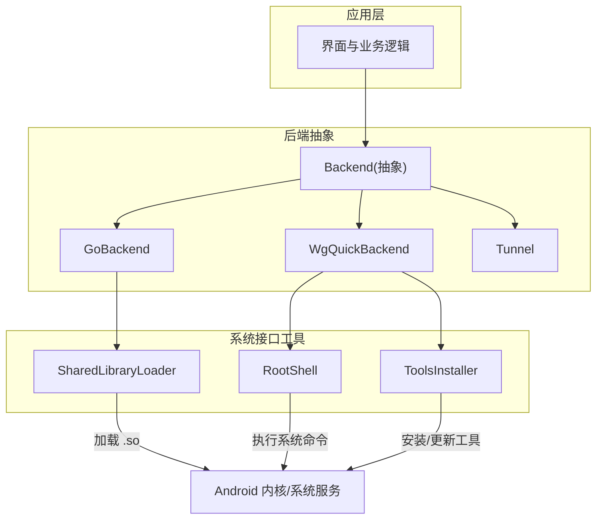
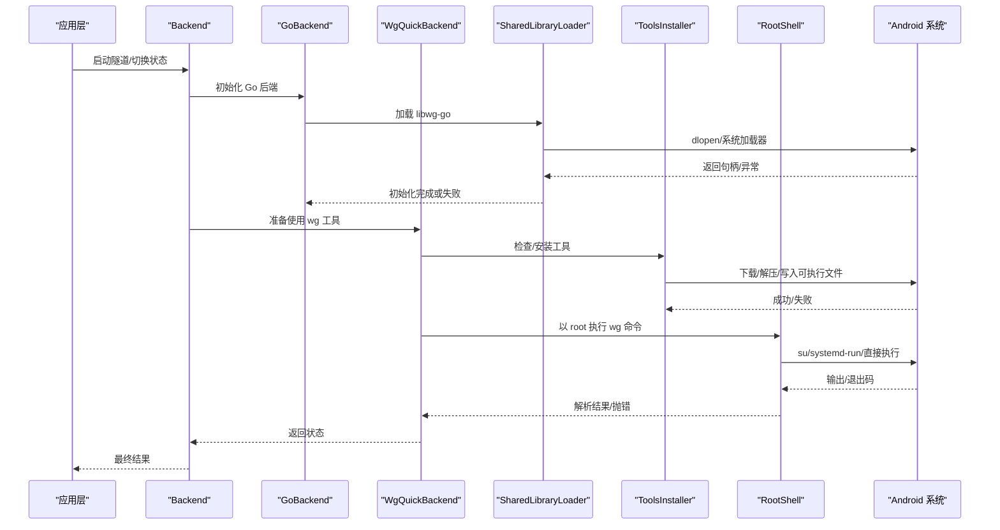
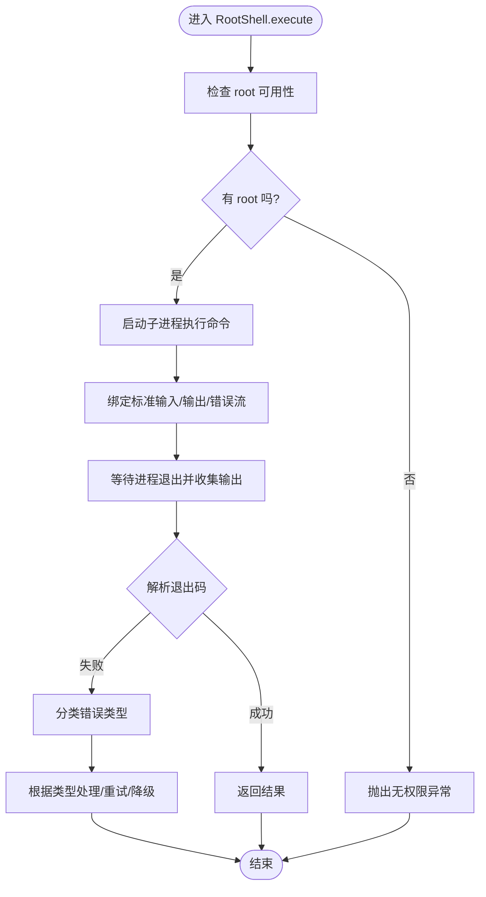
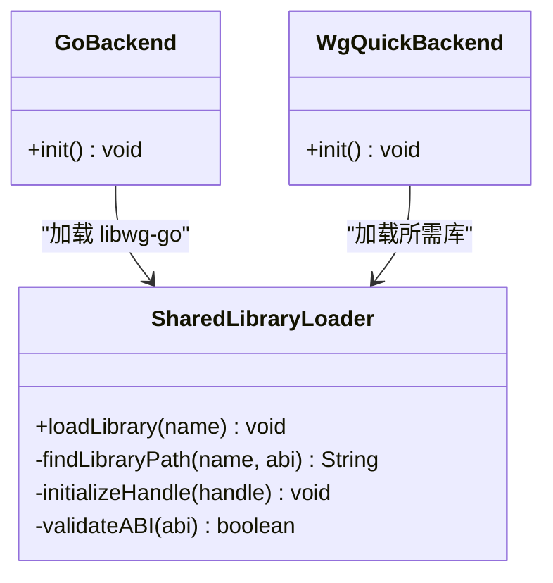
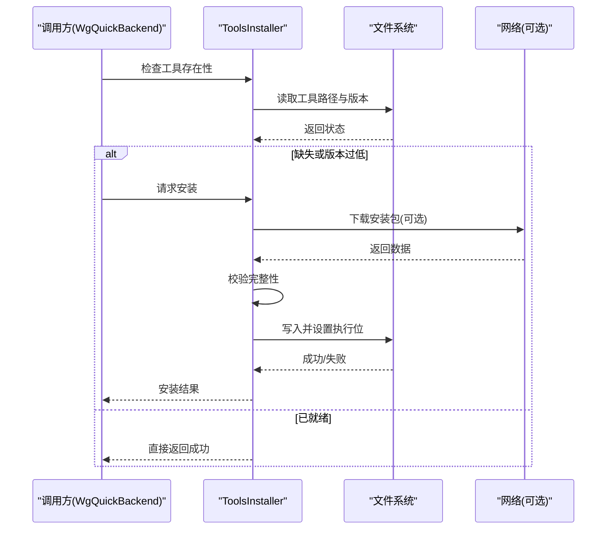
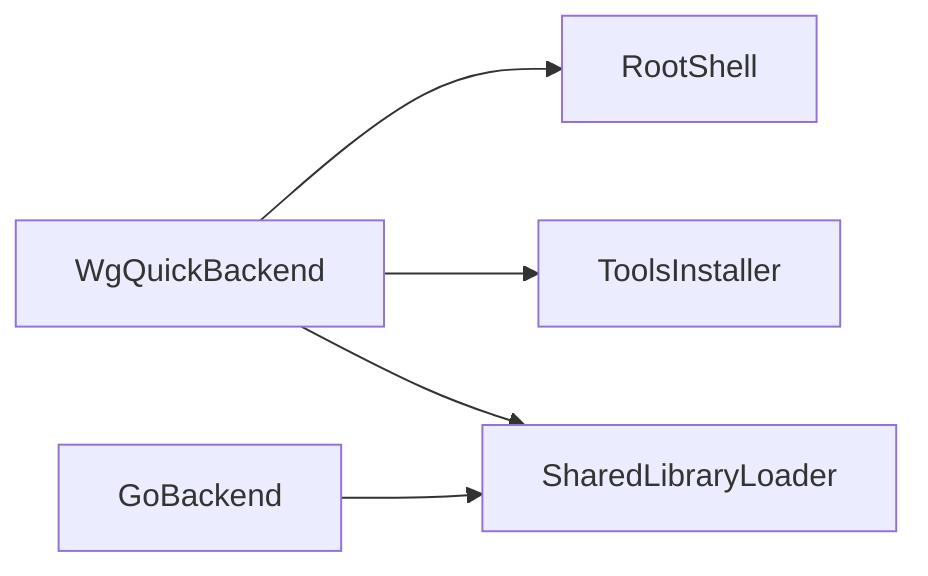

# 系统接口 API

<cite>
**本文引用的文件**   
- [RootShell.java](file://tunnel/src/main/java/com/wireguard/android/util/RootShell.java)
- [SharedLibraryLoader.java](file://tunnel/src/main/java/com/wireguard/android/util/SharedLibraryLoader.java)
- [ToolsInstaller.java](file://tunnel/src/main/java/com/wireguard/android/util/ToolsInstaller.java)
- [Backend.java](file://tunnel/src/main/java/com/wireguard/android/backend/Backend.java)
- [GoBackend.java](file://tunnel/src/main/java/com/wireguard/android/backend/GoBackend.java)
- [WgQuickBackend.java](file://tunnel/src/main/java/com/wireguard/android/backend/WgQuickBackend.java)
- [Tunnel.java](file://tunnel/src/main/java/com/wireguard/android/backend/Tunnel.java)
- [AndroidManifest.xml](file://tunnel/src/main/AndroidManifest.xml)
</cite>

## 目录
1. [简介](#简介)
2. [项目结构](#项目结构)
3. [核心组件](#核心组件)
4. [架构总览](#架构总览)
5. [详细组件分析](#详细组件分析)
6. [依赖关系分析](#依赖关系分析)
7. [性能考量](#性能考量)
8. [故障排查指南](#故障排查指南)
9. [结论](#结论)
10. [附录：系统调用示例与兼容性说明](#附录系统调用示例与兼容性说明)

## 简介
本文件面向 WireGuard Android 中的系统接口 API，聚焦以下三类能力：
- RootShell：以 root 权限执行系统命令、权限检查与结果处理。
- SharedLibraryLoader：动态库查找、加载与初始化流程。
- ToolsInstaller：工具安装与管理（含依赖检查与自动安装）。

文档同时覆盖 Android 系统权限要求、版本兼容性与错误处理策略，并提供端到端调用示例，帮助开发者快速集成与排障。

## 项目结构
与系统接口相关的核心代码位于 tunnel 模块的 util 包中，并由 backend 层在运行时按需调用。下图给出高层结构与调用关系概览。

图表来源
- [Backend.java](file://tunnel/src/main/java/com/wireguard/android/backend/Backend.java)
- [GoBackend.java](file://tunnel/src/main/java/com/wireguard/android/backend/GoBackend.java)
- [WgQuickBackend.java](file://tunnel/src/main/java/com/wireguard/android/backend/WgQuickBackend.java)
- [Tunnel.java](file://tunnel/src/main/java/com/wireguard/android/backend/Tunnel.java)
- [RootShell.java](file://tunnel/src/main/java/com/wireguard/android/util/RootShell.java)
- [SharedLibraryLoader.java](file://tunnel/src/main/java/com/wireguard/android/util/SharedLibraryLoader.java)
- [ToolsInstaller.java](file://tunnel/src/main/java/com/wireguard/android/util/ToolsInstaller.java)

章节来源
- [Backend.java](file://tunnel/src/main/java/com/wireguard/android/backend/Backend.java)
- [GoBackend.java](file://tunnel/src/main/java/com/wireguard/android/backend/GoBackend.java)
- [WgQuickBackend.java](file://tunnel/src/main/java/com/wireguard/android/backend/WgQuickBackend.java)
- [Tunnel.java](file://tunnel/src/main/java/com/wireguard/android/backend/Tunnel.java)
- [RootShell.java](file://tunnel/src/main/java/com/wireguard/android/util/RootShell.java)
- [SharedLibraryLoader.java](file://tunnel/src/main/java/com/wireguard/android/util/SharedLibraryLoader.java)
- [ToolsInstaller.java](file://tunnel/src/main/java/com/wireguard/android/util/ToolsInstaller.java)

## 核心组件
- RootShell：封装 root 权限下的命令执行，提供权限校验、进程管理、输出读取与错误码解析。
- SharedLibraryLoader：负责定位并加载所需的 native 库（如 libwg-go），包含路径探测、加载与初始化回调。
- ToolsInstaller：管理 wireguard-tools 等二进制工具的获取、校验与安装，支持依赖检查与自动安装流程。

章节来源
- [RootShell.java](file://tunnel/src/main/java/com/wireguard/android/util/RootShell.java)
- [SharedLibraryLoader.java](file://tunnel/src/main/java/com/wireguard/android/util/SharedLibraryLoader.java)
- [ToolsInstaller.java](file://tunnel/src/main/java/com/wireguard/android/util/ToolsInstaller.java)

## 架构总览
下图展示从上层调用到系统层的完整链路，包括权限获取、库加载与工具管理的交互时序。

图表来源
- [GoBackend.java](file://tunnel/src/main/java/com/wireguard/android/backend/GoBackend.java)
- [WgQuickBackend.java](file://tunnel/src/main/java/com/wireguard/android/backend/WgQuickBackend.java)
- [SharedLibraryLoader.java](file://tunnel/src/main/java/com/wireguard/android/util/SharedLibraryLoader.java)
- [ToolsInstaller.java](file://tunnel/src/main/java/com/wireguard/android/util/ToolsInstaller.java)
- [RootShell.java](file://tunnel/src/main/java/com/wireguard/android/util/RootShell.java)

## 详细组件分析

### RootShell：root 命令执行与权限控制
- 职责
  - 权限检查：判断当前是否具备 root 能力（例如通过 su 可用性检测）。
  - 命令执行：以 root 身份执行系统命令，支持标准输入、输出与错误流。
  - 结果处理：解析退出码、捕获输出、封装为统一的结果对象或异常。
- 关键流程
  - 启动子进程（su 或直接执行）
  - 读写 IO 流（带超时与缓冲）
  - 错误分类（权限不足、命令不存在、执行超时等）
  - 资源清理（关闭流、等待进程结束）
- 典型用法
  - 执行网络配置命令（如 ip、iptables、wireguard 相关命令）
  - 查询系统状态（接口名、路由表、内核参数）
- 错误与恢复
  - 无 root 权限时提示用户授予或使用替代方案
  - 命令不存在时回退或引导安装
  - 超时或 IO 异常时重试或降级

图表来源
- [RootShell.java](file://tunnel/src/main/java/com/wireguard/android/util/RootShell.java)

章节来源
- [RootShell.java](file://tunnel/src/main/java/com/wireguard/android/util/RootShell.java)

### SharedLibraryLoader：动态库加载机制
- 职责
  - 库文件查找：按 ABI、平台与打包方式定位 .so 文件。
  - 加载与初始化：调用系统加载器加载库，触发 JNI 初始化。
  - 错误处理：处理找不到库、符号缺失、ABI 不匹配等问题。
- 关键流程
  - 探测可用 ABI 列表
  - 在 APK 内或外部路径搜索目标库
  - 调用系统加载接口并缓存句柄
  - 暴露初始化钩子供上层调用
- 典型用法
  - 加载 libwg-go 或其他 native 组件
  - 在首次使用前确保库已就绪
- 错误与恢复
  - 找不到库时尝试备用路径或提示重新安装
  - 加载失败时记录日志并向上抛出明确异常

图表来源
- [SharedLibraryLoader.java](file://tunnel/src/main/java/com/wireguard/android/util/SharedLibraryLoader.java)
- [GoBackend.java](file://tunnel/src/main/java/com/wireguard/android/backend/GoBackend.java)
- [WgQuickBackend.java](file://tunnel/src/main/java/com/wireguard/android/backend/WgQuickBackend.java)

章节来源
- [SharedLibraryLoader.java](file://tunnel/src/main/java/com/wireguard/android/util/SharedLibraryLoader.java)
- [GoBackend.java](file://tunnel/src/main/java/com/wireguard/android/backend/GoBackend.java)
- [WgQuickBackend.java](file://tunnel/src/main/java/com/wireguard/android/backend/WgQuickBackend.java)

### ToolsInstaller：工具安装与管理
- 职责
  - 依赖检查：确认 wireguard-tools 等二进制是否存在且版本满足要求。
  - 自动安装：从内置资源或远程源下载、校验、解压并放置到可执行路径。
  - 权限与路径：设置可执行位、选择合适目录（如 /data/local/tmp 或应用私有目录）。
- 关键流程
  - 检测现有工具与版本
  - 若缺失或版本过旧，触发安装流程
  - 校验完整性（哈希/签名）
  - 写入文件系统并赋予执行权限
- 典型用法
  - 在启动前预检工具可用性
  - 在需要时按需安装或升级
- 错误与恢复
  - 下载失败时重试或回退
  - 校验失败时清除残留并重试
  - 写入失败时提示存储权限或空间不足

图表来源
- [ToolsInstaller.java](file://tunnel/src/main/java/com/wireguard/android/util/ToolsInstaller.java)

章节来源
- [ToolsInstaller.java](file://tunnel/src/main/java/com/wireguard/android/util/ToolsInstaller.java)

## 依赖关系分析
- RootShell 被 WgQuickBackend 用于执行系统命令；其正确性依赖于系统 shell 与 su 环境。
- SharedLibraryLoader 被 GoBackend/WgQuickBackend 用于加载 native 库；依赖 ABI 与打包一致性。
- ToolsInstaller 被 WgQuickBackend 用于保障工具链可用；依赖存储与网络（可选）。

图表来源
- [WgQuickBackend.java](file://tunnel/src/main/java/com/wireguard/android/backend/WgQuickBackend.java)
- [GoBackend.java](file://tunnel/src/main/java/com/wireguard/android/backend/GoBackend.java)
- [RootShell.java](file://tunnel/src/main/java/com/wireguard/android/util/RootShell.java)
- [SharedLibraryLoader.java](file://tunnel/src/main/java/com/wireguard/android/util/SharedLibraryLoader.java)
- [ToolsInstaller.java](file://tunnel/src/main/java/com/wireguard/android/util/ToolsInstaller.java)

章节来源
- [WgQuickBackend.java](file://tunnel/src/main/java/com/wireguard/android/backend/WgQuickBackend.java)
- [GoBackend.java](file://tunnel/src/main/java/com/wireguard/android/backend/GoBackend.java)
- [RootShell.java](file://tunnel/src/main/java/com/wireguard/android/util/RootShell.java)
- [SharedLibraryLoader.java](file://tunnel/src/main/java/com/wireguard/android/util/SharedLibraryLoader.java)
- [ToolsInstaller.java](file://tunnel/src/main/java/com/wireguard/android/util/ToolsInstaller.java)

## 性能考量
- RootShell
  - 避免频繁创建/销毁进程，必要时复用会话或批处理命令。
  - 合理设置 IO 缓冲区与超时，防止阻塞主线程。
- SharedLibraryLoader
  - 缓存库句柄，避免重复加载。
  - 仅在首次使用前加载，减少冷启动开销。
- ToolsInstaller
  - 增量检查与校验，避免重复下载。
  - 后台异步安装，避免阻塞 UI。

[本节为通用指导，无需特定文件引用]

## 故障排查指南
- 无 root 权限
  - 现象：RootShell 抛出无权限异常。
  - 排查：确认设备是否已授权 su；检查 RootShell 的权限检测逻辑。
- 动态库加载失败
  - 现象：SharedLibraryLoader 抛出找不到库或 ABI 不匹配。
  - 排查：核对 ABI 列表、APK 打包产物、设备架构；查看加载路径与符号依赖。
- 工具缺失或不可执行
  - 现象：WgQuickBackend 无法找到 wg 或执行失败。
  - 排查：检查 ToolsInstaller 的安装路径、执行位、存储空间与权限；验证完整性校验。
- 常见异常恢复
  - 重试策略：对网络与 IO 异常进行有限次重试。
  - 降级策略：在无 root 或工具不可用时提示用户或回退功能。
  - 日志与诊断：记录关键步骤与错误码，便于定位问题。

章节来源
- [RootShell.java](file://tunnel/src/main/java/com/wireguard/android/util/RootShell.java)
- [SharedLibraryLoader.java](file://tunnel/src/main/java/com/wireguard/android/util/SharedLibraryLoader.java)
- [ToolsInstaller.java](file://tunnel/src/main/java/com/wireguard/android/util/ToolsInstaller.java)

## 结论
RootShell、SharedLibraryLoader 与 ToolsInstaller 共同构成 WireGuard Android 的系统接口基础：前者负责高权限命令执行，中间者负责 native 库加载，后者保障工具链可用。三者协同确保后端在不同 Android 设备上稳定运行。通过完善的权限检查、错误分类与恢复策略，可在复杂环境中提升鲁棒性与用户体验。

[本节为总结性内容，无需特定文件引用]

## 附录：系统调用示例与兼容性说明

### 系统调用示例
- 权限获取与命令执行（RootShell）
  - 步骤：检查 root -> 执行命令 -> 解析输出/退出码 -> 返回结果或抛错。
  - 参考实现位置：[RootShell.java](file://tunnel/src/main/java/com/wireguard/android/util/RootShell.java)
- 库加载与初始化（SharedLibraryLoader）
  - 步骤：确定 ABI -> 查找库路径 -> 加载库 -> 初始化 -> 缓存句柄。
  - 参考实现位置：[SharedLibraryLoader.java](file://tunnel/src/main/java/com/wireguard/android/util/SharedLibraryLoader.java)
- 工具管理与安装（ToolsInstaller）
  - 步骤：检查工具 -> 缺失则下载/校验/安装 -> 设置执行位 -> 返回可用性。
  - 参考实现位置：[ToolsInstaller.java](file://tunnel/src/main/java/com/wireguard/android/util/ToolsInstaller.java)

章节来源
- [RootShell.java](file://tunnel/src/main/java/com/wireguard/android/util/RootShell.java)
- [SharedLibraryLoader.java](file://tunnel/src/main/java/com/wireguard/android/util/SharedLibraryLoader.java)
- [ToolsInstaller.java](file://tunnel/src/main/java/com/wireguard/android/util/ToolsInstaller.java)

### Android 权限与兼容性要点
- 权限模型
  - 普通应用无法直接执行系统级命令，需借助 root 或系统服务。
  - 部分操作可能需要系统签名或 OEM 定制权限。
- 版本差异
  - Android 10+ 对 /system/bin 写入限制更严格，建议将工具安装至应用私有目录或受控路径。
  - SELinux 策略可能影响 su 与某些系统调用的可用性。
- 架构与 ABI
  - 确保加载的 .so 与设备 ABI 一致（arm64-v8a、armeabi-v7a、x86_64 等）。
  - 多 ABI 打包时需按设备能力选择对应库。
- 安全与稳定性
  - 避免在主线程执行耗时 IO 与进程等待。
  - 对异常进行分级处理，提供用户可见的错误提示与恢复选项。

章节来源
- [AndroidManifest.xml](file://tunnel/src/main/AndroidManifest.xml)
- [Backend.java](file://tunnel/src/main/java/com/wireguard/android/backend/Backend.java)
- [GoBackend.java](file://tunnel/src/main/java/com/wireguard/android/backend/GoBackend.java)
- [WgQuickBackend.java](file://tunnel/src/main/java/com/wireguard/android/backend/WgQuickBackend.java)
- [Tunnel.java](file://tunnel/src/main/java/com/wireguard/android/backend/Tunnel.java)