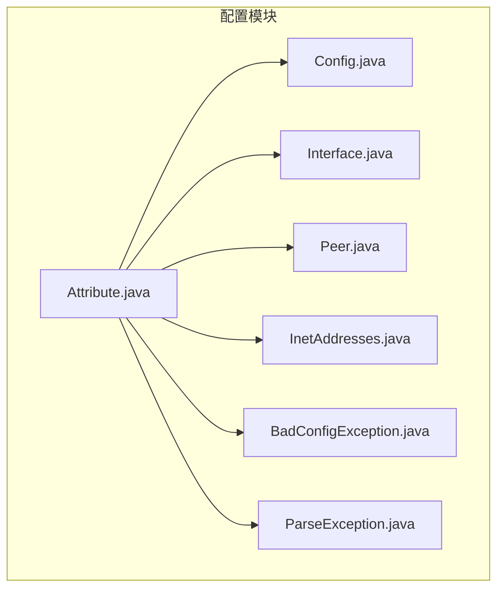
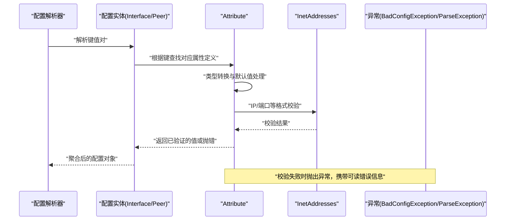
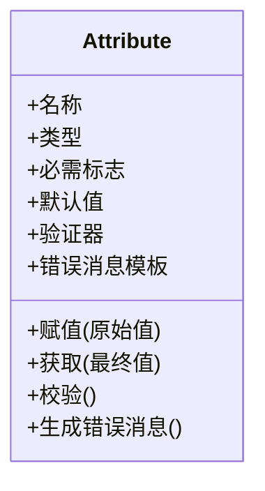
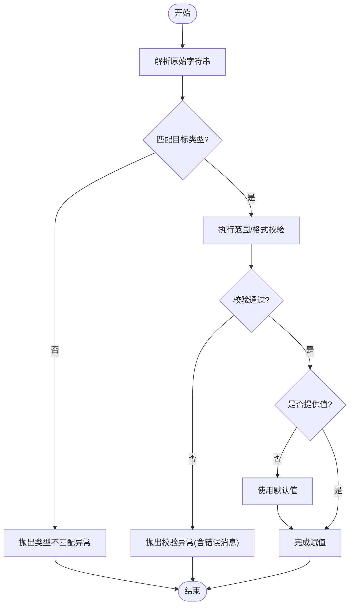
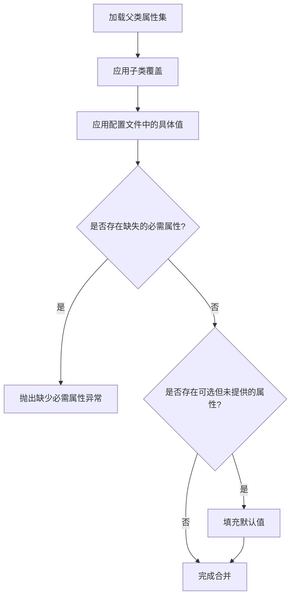
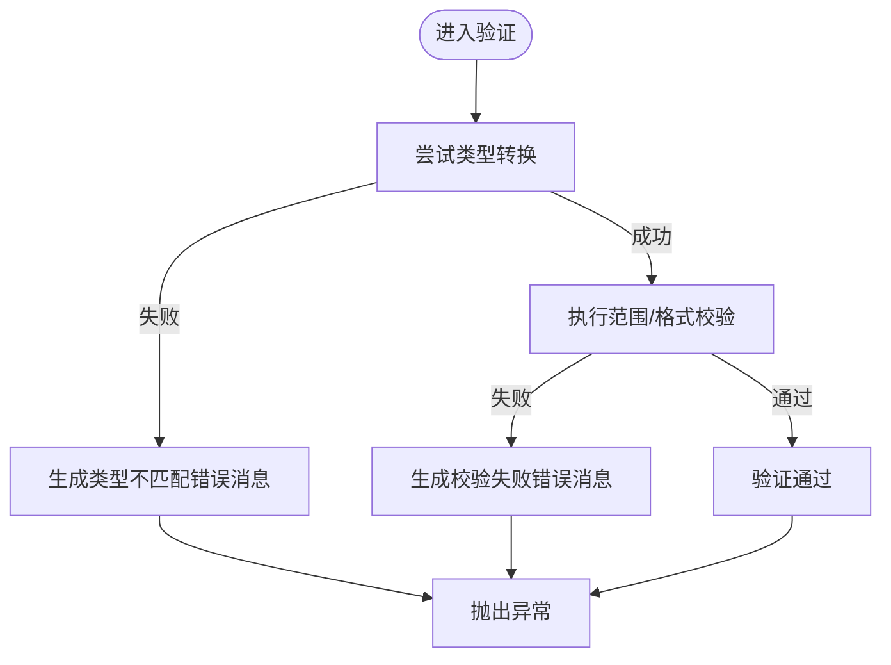
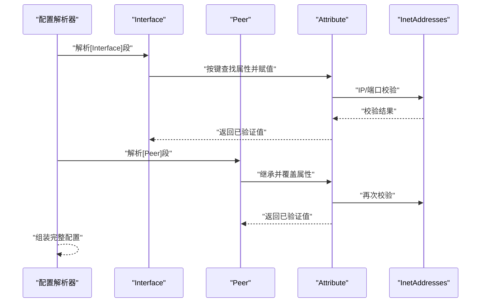
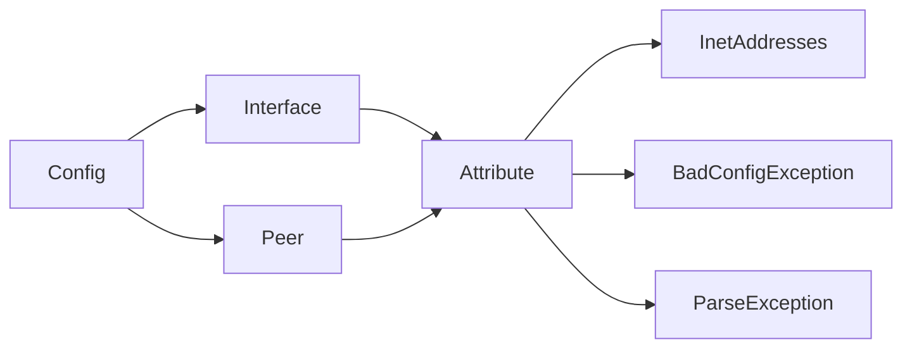

# Attribute 类 API

<cite>
**本文引用的文件**   
- [Attribute.java](file://tunnel/src/main/java/com/wireguard/config/Attribute.java)
- [Config.java](file://tunnel/src/main/java/com/wireguard/config/Config.java)
- [Interface.java](file://tunnel/src/main/java/com/wireguard/config/Interface.java)
- [Peer.java](file://tunnel/src/main/java/com/wireguard/config/Peer.java)
- [InetAddresses.java](file://tunnel/src/main/java/com/wireguard/config/InetAddresses.java)
- [BadConfigException.java](file://tunnel/src/main/java/com/wireguard/config/BadConfigException.java)
- [ParseException.java](file://tunnel/src/main/java/com/wireguard/config/ParseException.java)
</cite>

## 目录
1. [简介](#简介)
2. [项目结构](#项目结构)
3. [核心组件](#核心组件)
4. [架构总览](#架构总览)
5. [详细组件分析](#详细组件分析)
6. [依赖关系分析](#依赖关系分析)
7. [性能考虑](#性能考虑)
8. [故障排查指南](#故障排查指南)
9. [结论](#结论)
10. [附录](#附录) 

## 简介
本文件为 Attribute 类的 API 文档，聚焦属性系统的核心能力：属性的定义、类型检查与值验证、继承机制与默认值处理、错误消息生成，以及与配置解析器的集成和扩展方式。该子系统用于在 WireGuard Android 的配置解析过程中，对 Interface 与 Peer 等配置项进行强类型约束与校验，确保配置的正确性与一致性。

## 项目结构
Attribute 位于配置模块中，与 Config、Interface、Peer 等配置实体紧密协作，并通过 InetAddresses 等工具类完成 IP 地址相关转换与校验。异常体系由 BadConfigException 与 ParseException 提供统一的错误上报。

**图表来源** 
- [Attribute.java](file://tunnel/src/main/java/com/wireguard/config/Attribute.java)
- [Config.java](file://tunnel/src/main/java/com/wireguard/config/Config.java)
- [Interface.java](file://tunnel/src/main/java/com/wireguard/config/Interface.java)
- [Peer.java](file://tunnel/src/main/java/com/wireguard/config/Peer.java)
- [InetAddresses.java](file://tunnel/src/main/java/com/wireguard/config/InetAddresses.java)
- [BadConfigException.java](file://tunnel/src/main/java/com/wireguard/config/BadConfigException.java)
- [ParseException.java](file://tunnel/src/main/java/com/wireguard/config/ParseException.java)

**章节来源**
- [Attribute.java](file://tunnel/src/main/java/com/wireguard/config/Attribute.java)
- [Config.java](file://tunnel/src/main/java/com/wireguard/config/Config.java)
- [Interface.java](file://tunnel/src/main/java/com/wireguard/config/Interface.java)
- [Peer.java](file://tunnel/src/main/java/com/wireguard/config/Peer.java)
- [InetAddresses.java](file://tunnel/src/main/java/com/wireguard/config/InetAddresses.java)
- [BadConfigException.java](file://tunnel/src/main/java/com/wireguard/config/BadConfigException.java)
- [ParseException.java](file://tunnel/src/main/java/com/wireguard/config/ParseException.java)

## 核心组件
- Attribute：属性基类，封装名称、类型、是否必需、默认值、验证器与错误消息模板；提供赋值、类型转换与校验的统一入口。
- Config / Interface / Peer：配置实体，声明各自支持的属性集合，并实现继承与合并策略。
- InetAddresses：IP 地址与网络段解析与校验工具，被 Attribute 的 IP 类型使用。
- BadConfigException / ParseException：配置解析过程中的异常类型，用于向上层报告错误。

**章节来源**
- [Attribute.java](file://tunnel/src/main/java/com/wireguard/config/Attribute.java)
- [Config.java](file://tunnel/src/main/java/com/wireguard/config/Config.java)
- [Interface.java](file://tunnel/src/main/java/com/wireguard/config/Interface.java)
- [Peer.java](file://tunnel/src/main/java/com/wireguard/config/Peer.java)
- [InetAddresses.java](file://tunnel/src/main/java/com/wireguard/config/InetAddresses.java)
- [BadConfigException.java](file://tunnel/src/main/java/com/wireguard/config/BadConfigException.java)
- [ParseException.java](file://tunnel/src/main/java/com/wireguard/config/ParseException.java)

## 架构总览
Attribute 作为类型化属性的抽象，贯穿配置解析流程。各配置实体通过“属性注册 + 继承合并 + 校验”的流程，将原始字符串转换为强类型值，并在失败时抛出统一异常。

**图表来源** 
- [Attribute.java](file://tunnel/src/main/java/com/wireguard/config/Attribute.java)
- [Interface.java](file://tunnel/src/main/java/com/wireguard/config/Interface.java)
- [Peer.java](file://tunnel/src/main/java/com/wireguard/config/Peer.java)
- [InetAddresses.java](file://tunnel/src/main/java/com/wireguard/config/InetAddresses.java)
- [BadConfigException.java](file://tunnel/src/main/java/com/wireguard/config/BadConfigException.java)
- [ParseException.java](file://tunnel/src/main/java/com/wireguard/config/ParseException.java)

## 详细组件分析

### Attribute 类 API 概览
- 职责
  - 描述一个配置属性的元数据：名称、类型、是否必需、默认值、验证器、错误消息模板。
  - 提供统一的赋值接口，负责类型转换、默认值填充与自定义校验。
  - 生成面向用户的错误消息，便于定位问题。
- 关键能力
  - 类型系统：支持字符串、整数、布尔值、IP 地址（IPv4/IPv6）、端口、网络段等常见类型。
  - 转换规则：从原始字符串到目标类型的严格转换，包含范围与格式校验。
  - 继承与合并：子类可覆盖父类属性，合并策略遵循“后者优先”。
  - 默认值：未提供的可选属性自动回退到默认值。
  - 校验器：允许附加自定义校验逻辑，增强业务约束。
  - 错误消息：基于模板与上下文生成可读的错误提示。

**图表来源** 
- [Attribute.java](file://tunnel/src/main/java/com/wireguard/config/Attribute.java)

**章节来源**
- [Attribute.java](file://tunnel/src/main/java/com/wireguard/config/Attribute.java)

### 支持的属性类型与转换规则
- 字符串：直接保留，可附加长度或正则校验。
- 整数：范围校验（如端口号 1-65535），非法字符或越界时报错。
- 布尔值：支持 true/false、yes/no、1/0 等常见表示，大小写不敏感。
- IP 地址：IPv4/IPv6 解析与合法性校验，支持 CIDR 前缀的网络段。
- 端口：整数且范围限制，常用于 Endpoint 解析。
- 其他复合类型：如 Endpoint（IP+端口）可由多个基础属性组合而成。

转换流程图如下：

**图表来源** 
- [Attribute.java](file://tunnel/src/main/java/com/wireguard/config/Attribute.java)
- [InetAddresses.java](file://tunnel/src/main/java/com/wireguard/config/InetAddresses.java)

**章节来源**
- [Attribute.java](file://tunnel/src/main/java/com/wireguard/config/Attribute.java)
- [InetAddresses.java](file://tunnel/src/main/java/com/wireguard/config/InetAddresses.java)

### 继承机制与默认值处理
- 继承模型
  - 子配置实体（如 Peer）可继承父实体（如 Interface）的属性集。
  - 同名属性在子类中可覆盖，覆盖后以子类定义为准。
  - 合并顺序：先加载父类属性，再应用子类覆盖，最后应用配置文件中的具体值。
- 默认值策略
  - 可选属性若未提供，则采用默认值。
  - 必需属性若缺失，解析阶段即报错。
  - 默认值不参与用户可见的错误消息，仅作为内部回退。

**图表来源** 
- [Interface.java](file://tunnel/src/main/java/com/wireguard/config/Interface.java)
- [Peer.java](file://tunnel/src/main/java/com/wireguard/config/Peer.java)
- [Attribute.java](file://tunnel/src/main/java/com/wireguard/config/Attribute.java)

**章节来源**
- [Interface.java](file://tunnel/src/main/java/com/wireguard/config/Interface.java)
- [Peer.java](file://tunnel/src/main/java/com/wireguard/config/Peer.java)
- [Attribute.java](file://tunnel/src/main/java/com/wireguard/config/Attribute.java)

### 属性验证规则与错误消息生成
- 验证规则
  - 类型转换失败：例如非数字字符串赋给整型属性。
  - 范围/格式校验失败：如端口超出范围、IP 地址非法。
  - 业务约束失败：如某些属性组合互斥或依赖。
- 错误消息
  - 基于模板与上下文（属性名、期望类型、实际值）生成清晰提示。
  - 区分“缺少必需属性”“类型不匹配”“校验失败”等场景。

**图表来源** 
- [Attribute.java](file://tunnel/src/main/java/com/wireguard/config/Attribute.java)
- [BadConfigException.java](file://tunnel/src/main/java/com/wireguard/config/BadConfigException.java)
- [ParseException.java](file://tunnel/src/main/java/com/wireguard/config/ParseException.java)

**章节来源**
- [Attribute.java](file://tunnel/src/main/java/com/wireguard/config/Attribute.java)
- [BadConfigException.java](file://tunnel/src/main/java/com/wireguard/config/BadConfigException.java)
- [ParseException.java](file://tunnel/src/main/java/com/wireguard/config/ParseException.java)

### 与配置解析器的集成与扩展机制
- 集成方式
  - 配置实体（Interface/Peer）维护属性映射表，将键名与 Attribute 实例绑定。
  - 解析器遍历配置键值对，调用 Attribute 的赋值与校验方法，得到强类型值。
  - 解析完成后，配置实体持有已验证的属性集合供后续使用。
- 扩展机制
  - 新增属性类型：扩展 Attribute 的子类或验证器，复用统一赋值与校验流程。
  - 新增配置实体：在该实体中声明其属性集，并参与继承合并。
  - 自定义校验：通过验证器注入业务规则，保持错误消息一致。

**图表来源** 
- [Config.java](file://tunnel/src/main/java/com/wireguard/config/Config.java)
- [Interface.java](file://tunnel/src/main/java/com/wireguard/config/Interface.java)
- [Peer.java](file://tunnel/src/main/java/com/wireguard/config/Peer.java)
- [Attribute.java](file://tunnel/src/main/java/com/wireguard/config/Attribute.java)
- [InetAddresses.java](file://tunnel/src/main/java/com/wireguard/config/InetAddresses.java)

**章节来源**
- [Config.java](file://tunnel/src/main/java/com/wireguard/config/Config.java)
- [Interface.java](file://tunnel/src/main/java/com/wireguard/config/Interface.java)
- [Peer.java](file://tunnel/src/main/java/com/wireguard/config/Peer.java)
- [Attribute.java](file://tunnel/src/main/java/com/wireguard/config/Attribute.java)
- [InetAddresses.java](file://tunnel/src/main/java/com/wireguard/config/InetAddresses.java)

## 依赖关系分析
- Attribute 依赖 InetAddresses 进行 IP/网络段解析与校验。
- Attribute 依赖异常类型进行错误上报。
- Interface/Peer 依赖 Attribute 定义其属性集，并实现继承与合并。
- Config 协调解析流程，驱动 Attribute 的赋值与校验。

**图表来源** 
- [Attribute.java](file://tunnel/src/main/java/com/wireguard/config/Attribute.java)
- [InetAddresses.java](file://tunnel/src/main/java/com/wireguard/config/InetAddresses.java)
- [BadConfigException.java](file://tunnel/src/main/java/com/wireguard/config/BadConfigException.java)
- [ParseException.java](file://tunnel/src/main/java/com/wireguard/config/ParseException.java)
- [Interface.java](file://tunnel/src/main/java/com/wireguard/config/Interface.java)
- [Peer.java](file://tunnel/src/main/java/com/wireguard/config/Peer.java)
- [Config.java](file://tunnel/src/main/java/com/wireguard/config/Config.java)

**章节来源**
- [Attribute.java](file://tunnel/src/main/java/com/wireguard/config/Attribute.java)
- [InetAddresses.java](file://tunnel/src/main/java/com/wireguard/config/InetAddresses.java)
- [BadConfigException.java](file://tunnel/src/main/java/com/wireguard/config/BadConfigException.java)
- [ParseException.java](file://tunnel/src/main/java/com/wireguard/config/ParseException.java)
- [Interface.java](file://tunnel/src/main/java/com/wireguard/config/Interface.java)
- [Peer.java](file://tunnel/src/main/java/com/wireguard/config/Peer.java)
- [Config.java](file://tunnel/src/main/java/com/wireguard/config/Config.java)

## 性能考虑
- 类型转换与校验应在解析阶段一次性完成，避免重复计算。
- 对于频繁使用的属性（如端口、IP），建议缓存解析结果以减少开销。
- 错误消息生成应避免昂贵的字符串拼接，优先使用模板与占位符。
- 继承合并时应尽量减少对象复制，采用引用合并与延迟求值策略。

## 故障排查指南
- 常见问题
  - 类型不匹配：检查输入字符串是否符合目标类型规范（如整数、布尔、IP）。
  - 范围/格式错误：确认端口范围、IP/CIDR 格式是否正确。
  - 缺少必需属性：核对配置文件中是否遗漏必填字段。
  - 继承覆盖冲突：检查子类是否覆盖了父类属性导致预期行为变化。
- 定位步骤
  - 查看异常类型与错误消息，确定失败环节（类型转换、校验、缺失属性）。
  - 检查属性定义与验证器，确认规则是否符合预期。
  - 逐步缩小范围，隔离问题属性，复现并修复。

**章节来源**
- [BadConfigException.java](file://tunnel/src/main/java/com/wireguard/config/BadConfigException.java)
- [ParseException.java](file://tunnel/src/main/java/com/wireguard/config/ParseException.java)
- [Attribute.java](file://tunnel/src/main/java/com/wireguard/config/Attribute.java)

## 结论
Attribute 类为 WireGuard Android 的配置系统提供了强类型、可扩展、可校验的属性框架。通过统一的赋值、转换、校验与错误消息机制，显著提升了配置解析的可靠性与可维护性。结合继承与默认值策略，能够灵活表达复杂配置语义，并与解析器无缝集成。

## 附录
- 最佳实践
  - 明确区分必需与可选属性，合理设置默认值。
  - 为每个属性编写清晰的验证规则与错误消息模板。
  - 在继承关系中谨慎覆盖属性，避免破坏父类语义。
  - 使用工具类（如 InetAddresses）进行标准化解析，减少重复代码。
- 常见模式
  - 单一值属性：字符串、整数、布尔等基础类型。
  - 复合值属性：Endpoint（IP+端口）由多个基础属性组合。
  - 列表/集合属性：多值配置通过多次赋值或分隔符解析。
  - 条件校验：基于其他属性值动态调整校验规则。