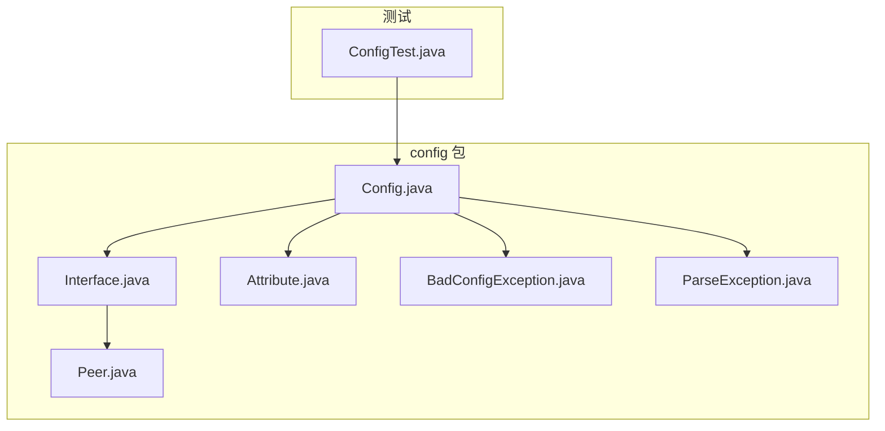
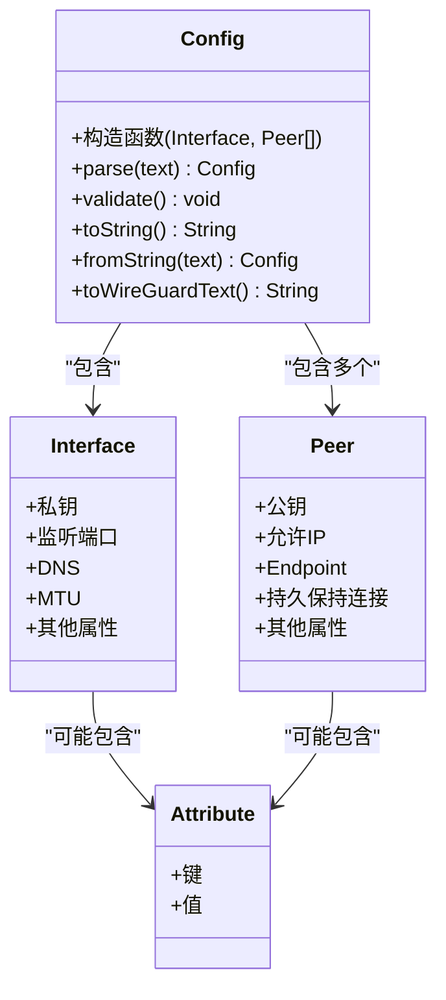
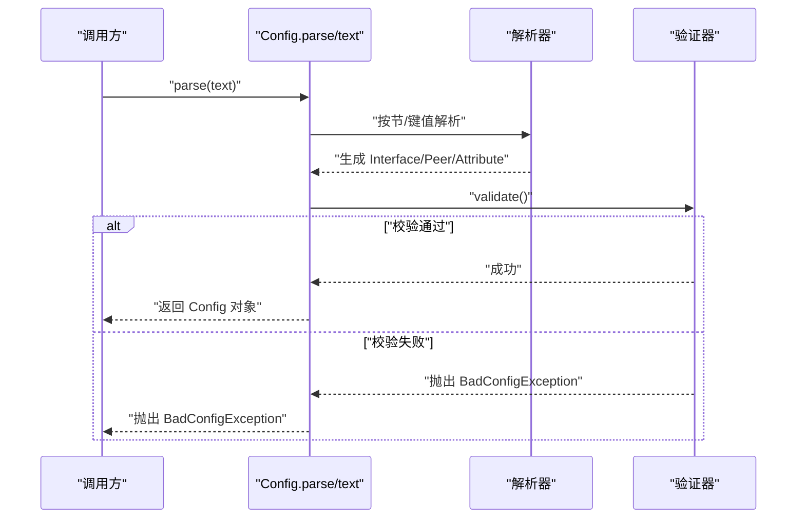
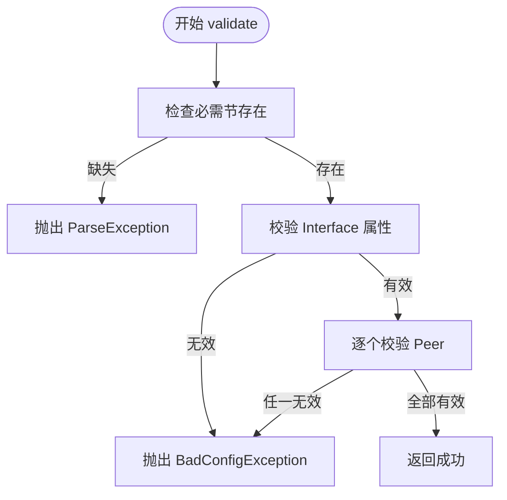
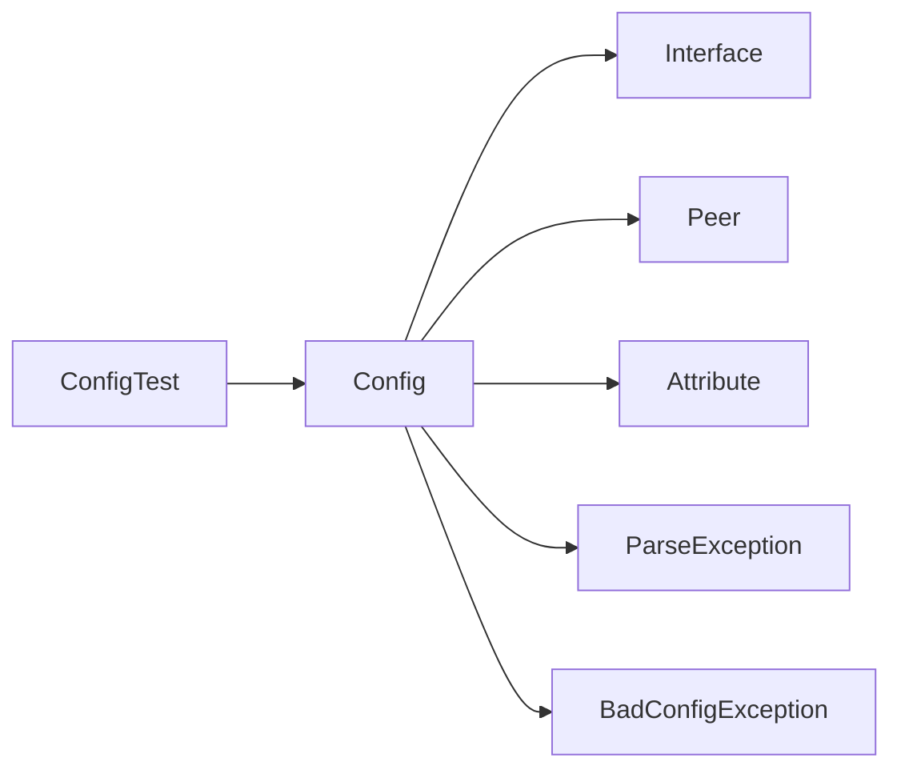

# Config 类 API

<cite>
**本文引用的文件**   
- [Config.java](file://tunnel/src/main/java/com/wireguard/config/Config.java)
- [Interface.java](file://tunnel/src/main/java/com/wireguard/config/Interface.java)
- [Peer.java](file://tunnel/src/main/java/com/wireguard/config/Peer.java)
- [Attribute.java](file://tunnel/src/main/java/com/wireguard/config/Attribute.java)
- [BadConfigException.java](file://tunnel/src/main/java/com/wireguard/config/BadConfigException.java)
- [ParseException.java](file://tunnel/src/main/java/com/wireguard/config/ParseException.java)
- [ConfigTest.java](file://tunnel/src/test/java/com/wireguard/config/ConfigTest.java)
</cite>

## 目录
1. [简介](#简介)
2. [项目结构](#项目结构)
3. [核心组件](#核心组件)
4. [架构总览](#架构总览)
5. [详细组件分析](#详细组件分析)
6. [依赖关系分析](#依赖关系分析)
7. [性能考虑](#性能考虑)
8. [故障排查指南](#故障排查指南)
9. [结论](#结论)
10. [附录](#附录)

## 简介
本文件为 Config 类的完整 API 文档，覆盖配置的创建、解析、验证与序列化（导入/导出）能力。重点说明：
- 构造函数参数与静态工厂方法
- 配置加载机制与文件格式约定
- 与 Interface、Peer 对象的关联关系
- 配置文件导入导出方法
- 配置验证规则与错误处理机制
- 版本兼容性与迁移策略
- 使用示例（以路径引用代替具体代码片段）

## 项目结构
Config 类位于 tunnel 模块的 config 包中，与 Interface、Peer、Attribute 等类型共同构成 WireGuard 配置模型。测试用例位于同包的 test 目录，提供多种合法/非法配置样例用于验证解析与校验逻辑。

图表来源
- [Config.java](file://tunnel/src/main/java/com/wireguard/config/Config.java)
- [Interface.java](file://tunnel/src/main/java/com/wireguard/config/Interface.java)
- [Peer.java](file://tunnel/src/main/java/com/wireguard/config/Peer.java)
- [Attribute.java](file://tunnel/src/main/java/com/wireguard/config/Attribute.java)
- [BadConfigException.java](file://tunnel/src/main/java/com/wireguard/config/BadConfigException.java)
- [ParseException.java](file://tunnel/src/main/java/com/wireguard/config/ParseException.java)
- [ConfigTest.java](file://tunnel/src/test/java/com/wireguard/config/ConfigTest.java)

章节来源
- [Config.java](file://tunnel/src/main/java/com/wireguard/config/Config.java)
- [Interface.java](file://tunnel/src/main/java/com/wireguard/config/Interface.java)
- [Peer.java](file://tunnel/src/main/java/com/wireguard/config/Peer.java)
- [Attribute.java](file://tunnel/src/main/java/com/wireguard/config/Attribute.java)
- [BadConfigException.java](file://tunnel/src/main/java/com/wireguard/config/BadConfigException.java)
- [ParseException.java](file://tunnel/src/main/java/com/wireguard/config/ParseException.java)
- [ConfigTest.java](file://tunnel/src/test/java/com/wireguard/config/ConfigTest.java)

## 核心组件
- Config：表示一个完整的 WireGuard 配置对象，包含一个 Interface 和多个 Peer，并提供解析、验证、序列化和导入导出能力。
- Interface：表示接口段，包含私钥、监听端口、DNS、MTU 等属性。
- Peer：表示对端段，包含公钥、允许的 IP、Endpoint、持久保持连接等属性。
- Attribute：通用键值属性模型，用于扩展或保留未知字段。
- BadConfigException：配置语义或结构错误时抛出的异常。
- ParseException：解析失败（语法错误、格式不匹配）时抛出的异常。

章节来源
- [Config.java](file://tunnel/src/main/java/com/wireguard/config/Config.java)
- [Interface.java](file://tunnel/src/main/java/com/wireguard/config/Interface.java)
- [Peer.java](file://tunnel/src/main/java/com/wireguard/config/Peer.java)
- [Attribute.java](file://tunnel/src/main/java/com/wireguard/config/Attribute.java)
- [BadConfigException.java](file://tunnel/src/main/java/com/wireguard/config/BadConfigException.java)
- [ParseException.java](file://tunnel/src/main/java/com/wireguard/config/ParseException.java)

## 架构总览
Config 作为顶层聚合对象，持有 Interface 实例与 Peer 列表，负责将文本配置解析为对象模型，并在保存时将对象模型序列化为标准文本格式。

图表来源
- [Config.java](file://tunnel/src/main/java/com/wireguard/config/Config.java)
- [Interface.java](file://tunnel/src/main/java/com/wireguard/config/Interface.java)
- [Peer.java](file://tunnel/src/main/java/com/wireguard/config/Peer.java)
- [Attribute.java](file://tunnel/src/main/java/com/wireguard/config/Attribute.java)

## 详细组件分析

### Config 类 API
- 构造与工厂
  - 构造函数：接收 Interface 与 Peer 列表，构建不可变或可变的配置对象（取决于实现）。
  - 静态工厂 parse(text)：从字符串解析生成 Config 对象；若文本不符合 WireGuard 配置语法，抛出 ParseException。
  - fromString(text)：等价于 parse，便于统一入口。
- 验证
  - validate()：执行语义校验（如密钥长度与格式、网络段合法性、必填项存在性等），失败抛出 BadConfigException。
- 序列化/导入导出
  - toString()/toWireGuardText()：将配置对象序列化为标准文本，可用于保存或分享。
  - 导入：通常通过 parse/fromString 完成；也可支持从字节流/Reader 读取后调用上述方法。
- 与 Interface、Peer 的关系
  - 获取/设置 Interface 实例。
  - 获取/添加/删除 Peer 列表元素。
- 版本兼容与迁移
  - 解析阶段忽略未知属性（保留为 Attribute），避免破坏性变更。
  - 验证阶段可根据当前版本要求拒绝过时或不安全的配置。

章节来源
- [Config.java](file://tunnel/src/main/java/com/wireguard/config/Config.java)
- [Interface.java](file://tunnel/src/main/java/com/wireguard/config/Interface.java)
- [Peer.java](file://tunnel/src/main/java/com/wireguard/config/Peer.java)
- [Attribute.java](file://tunnel/src/main/java/com/wireguard/config/Attribute.java)
- [BadConfigException.java](file://tunnel/src/main/java/com/wireguard/config/BadConfigException.java)
- [ParseException.java](file://tunnel/src/main/java/com/wireguard/config/ParseException.java)

### 配置解析流程（parse/fromString）

图表来源
- [Config.java](file://tunnel/src/main/java/com/wireguard/config/Config.java)
- [Interface.java](file://tunnel/src/main/java/com/wireguard/config/Interface.java)
- [Peer.java](file://tunnel/src/main/java/com/wireguard/config/Peer.java)
- [BadConfigException.java](file://tunnel/src/main/java/com/wireguard/config/BadConfigException.java)
- [ParseException.java](file://tunnel/src/main/java/com/wireguard/config/ParseException.java)

### 配置验证流程（validate）

图表来源
- [Config.java](file://tunnel/src/main/java/com/wireguard/config/Config.java)
- [Interface.java](file://tunnel/src/main/java/com/wireguard/config/Interface.java)
- [Peer.java](file://tunnel/src/main/java/com/wireguard/config/Peer.java)
- [BadConfigException.java](file://tunnel/src/main/java/com/wireguard/config/BadConfigException.java)
- [ParseException.java](file://tunnel/src/main/java/com/wireguard/config/ParseException.java)

### 配置序列化（toString/toWireGuardText）
- 输出顺序：先 Interface 节，再多个 Peer 节。
- 键值格式化：遵循 WireGuard 标准键名与值格式（如 Base64 编码的密钥、CIDR 地址、端口号等）。
- 兼容性：保留未知 Attribute 以便向前/向后兼容。

章节来源
- [Config.java](file://tunnel/src/main/java/com/wireguard/config/Config.java)
- [Interface.java](file://tunnel/src/main/java/com/wireguard/config/Interface.java)
- [Peer.java](file://tunnel/src/main/java/com/wireguard/config/Peer.java)
- [Attribute.java](file://tunnel/src/main/java/com/wireguard/config/Attribute.java)

### 与 Interface、Peer 的关联
- Config 持有唯一 Interface 与多个 Peer。
- Interface 定义隧道本地侧参数；Peer 定义远端对端参数。
- 修改 Peer 列表需保证每个 Peer 的必填项完整且格式正确。

章节来源
- [Config.java](file://tunnel/src/main/java/com/wireguard/config/Config.java)
- [Interface.java](file://tunnel/src/main/java/com/wireguard/config/Interface.java)
- [Peer.java](file://tunnel/src/main/java/com/wireguard/config/Peer.java)

### 错误处理机制
- ParseException：解析阶段遇到语法错误、未知节名、键值格式不正确等。
- BadConfigException：验证阶段发现语义错误，如密钥长度不符、网络段非法、必填项缺失等。
- 建议捕获并向上层展示用户可读的错误信息。

章节来源
- [BadConfigException.java](file://tunnel/src/main/java/com/wireguard/config/BadConfigException.java)
- [ParseException.java](file://tunnel/src/main/java/com/wireguard/config/ParseException.java)
- [Config.java](file://tunnel/src/main/java/com/wireguard/config/Config.java)

### 版本兼容性与迁移策略
- 解析阶段忽略未知属性（Attribute），确保旧版新增字段不会导致新版解析失败。
- 验证阶段可按目标版本启用更严格的规则，必要时提示迁移。
- 序列化时可选择是否保留未知 Attribute，以实现无损往返。

章节来源
- [Config.java](file://tunnel/src/main/java/com/wireguard/config/Config.java)
- [Attribute.java](file://tunnel/src/main/java/com/wireguard/config/Attribute.java)

## 依赖关系分析
- Config 依赖 Interface、Peer、Attribute 进行建模。
- 解析与验证过程依赖 ParseException 与 BadConfigException 表达不同阶段的错误。
- 测试用例覆盖多种边界情况，确保解析与验证的正确性。

图表来源
- [Config.java](file://tunnel/src/main/java/com/wireguard/config/Config.java)
- [Interface.java](file://tunnel/src/main/java/com/wireguard/config/Interface.java)
- [Peer.java](file://tunnel/src/main/java/com/wireguard/config/Peer.java)
- [Attribute.java](file://tunnel/src/main/java/com/wireguard/config/Attribute.java)
- [ParseException.java](file://tunnel/src/main/java/com/wireguard/config/ParseException.java)
- [BadConfigException.java](file://tunnel/src/main/java/com/wireguard/config/BadConfigException.java)
- [ConfigTest.java](file://tunnel/src/test/java/com/wireguard/config/ConfigTest.java)

章节来源
- [Config.java](file://tunnel/src/main/java/com/wireguard/config/Config.java)
- [ConfigTest.java](file://tunnel/src/test/java/com/wireguard/config/ConfigTest.java)

## 性能考虑
- 解析复杂度与配置大小线性相关，避免超大配置文件的频繁解析。
- 验证阶段应尽早失败（短路校验），减少不必要的计算。
- 序列化时应避免重复拼接字符串，采用缓冲或流式输出以提升性能。

[本节为通用指导，无需源码引用]

## 故障排查指南
- 解析失败（ParseException）
  - 检查配置文件语法是否符合 WireGuard 标准（节名、键名、值格式）。
  - 确认无多余字符或注释位置不当。
- 验证失败（BadConfigException）
  - 核对必填项是否存在（如私钥、公钥、允许的 IP 等）。
  - 检查数值范围（端口、MTU）与格式（Base64、CIDR）。
- 调试建议
  - 使用测试资源中的 broken.conf、invalid-key.conf、syntax-error.conf 等样例复现问题。
  - 在解析前后打印中间对象状态，定位问题环节。

章节来源
- [ConfigTest.java](file://tunnel/src/test/java/com/wireguard/config/ConfigTest.java)
- [BadConfigException.java](file://tunnel/src/main/java/com/wireguard/config/BadConfigException.java)
- [ParseException.java](file://tunnel/src/main/java/com/wireguard/config/ParseException.java)

## 结论
Config 类提供了完整的 WireGuard 配置生命周期管理能力：从文本解析到对象模型、从语义校验到标准文本序列化。通过与 Interface、Peer、Attribute 的清晰分工，以及明确的异常体系，确保了配置的健壮性与可维护性。建议在应用中统一通过 parse/fromString 与 validate 入口处理配置，并以 toWireGuardText 进行持久化或分享。

[本节为总结，无需源码引用]

## 附录

### 使用示例（路径引用）
- 创建与解析
  - 从字符串解析：参考 [ConfigTest.java](file://tunnel/src/test/java/com/wireguard/config/ConfigTest.java) 中的解析用例。
- 修改与验证
  - 修改 Interface/Peer 属性后调用 validate，参考 [ConfigTest.java](file://tunnel/src/test/java/com/wireguard/config/ConfigTest.java) 中的校验用例。
- 保存与导入
  - 序列化输出：参考 [ConfigTest.java](file://tunnel/src/test/java/com/wireguard/config/ConfigTest.java) 中的序列化用例。
  - 从文件导入：读取文件内容后调用 parse/fromString。

章节来源
- [ConfigTest.java](file://tunnel/src/test/java/com/wireguard/config/ConfigTest.java)