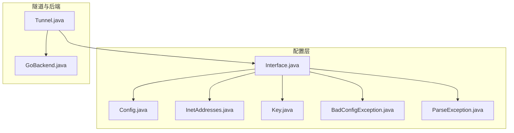
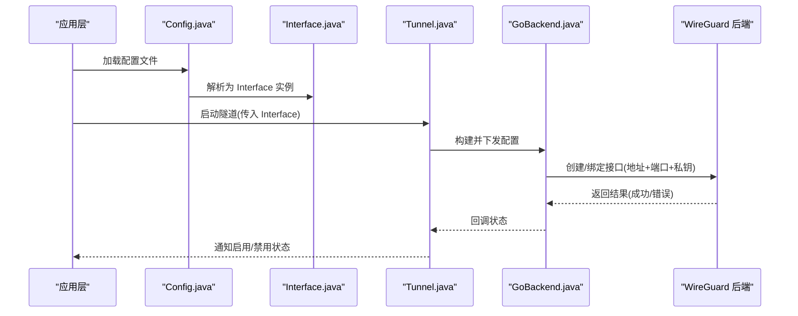
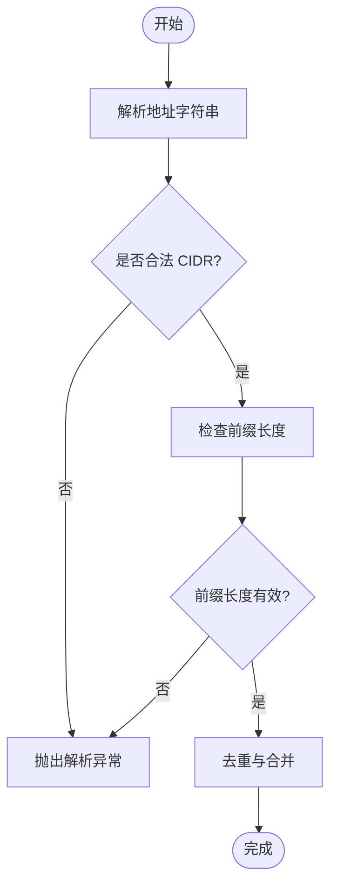
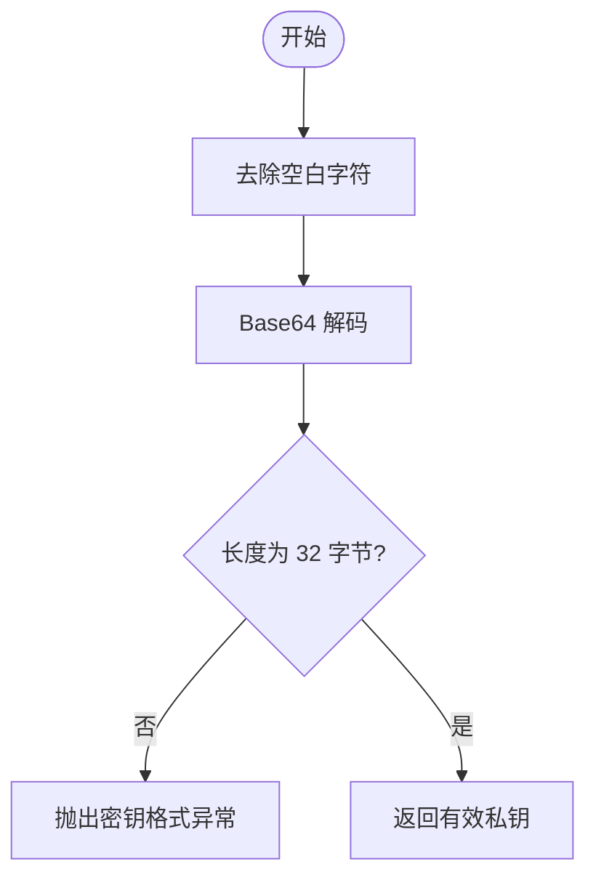
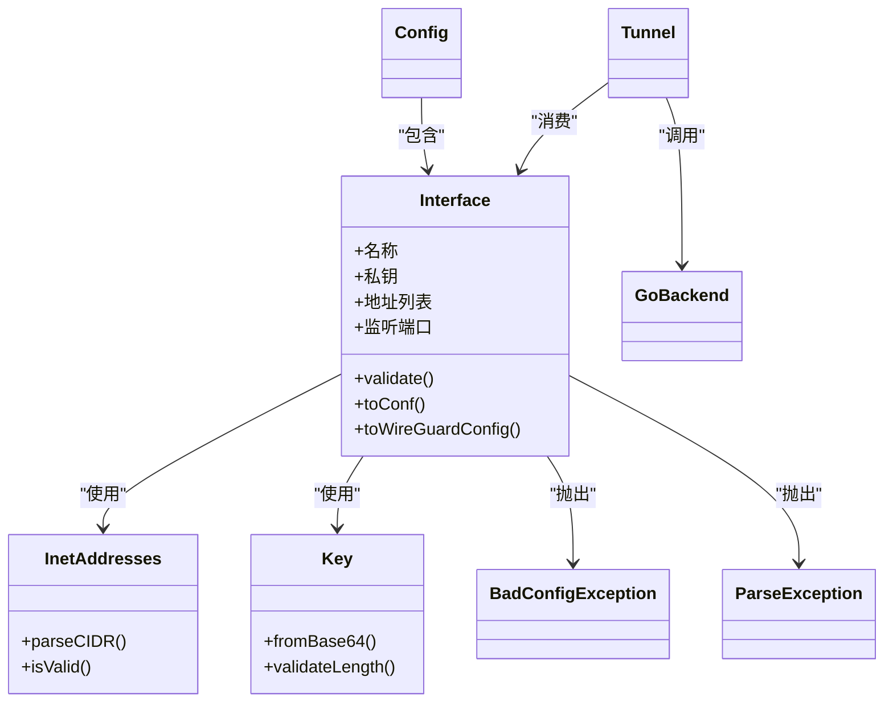

# Interface 类 API

<cite>
**本文引用的文件**   
- [Interface.java](file://tunnel/src/main/java/com/wireguard/config/Interface.java)
- [Config.java](file://tunnel/src/main/java/com/wireguard/config/Config.java)
- [InetAddresses.java](file://tunnel/src/main/java/com/wireguard/config/InetAddresses.java)
- [Key.java](file://tunnel/src/main/java/com/wireguard/crypto/Key.java)
- [BadConfigException.java](file://tunnel/src/main/java/com/wireguard/config/BadConfigException.java)
- [ParseException.java](file://tunnel/src/main/java/com/wireguard/config/ParseException.java)
- [Tunnel.java](file://tunnel/src/main/java/com/wireguard/android/backend/Tunnel.java)
- [GoBackend.java](file://tunnel/src/main/java/com/wireguard/android/backend/GoBackend.java)
</cite>

## 目录
1. [简介](#简介)
2. [项目结构](#项目结构)
3. [核心组件](#核心组件)
4. [架构总览](#架构总览)
5. [详细组件分析](#详细组件分析)
6. [依赖关系分析](#依赖关系分析)
7. [性能考虑](#性能考虑)
8. [故障排查指南](#故障排查指南)
9. [结论](#结论)
10. [附录：配置示例与最佳实践](#附录配置示例与最佳实践)

## 简介
本文件为 Interface 类的权威 API 文档，聚焦于网络接口配置的核心能力：地址设置（IPv4/IPv6）、端口配置、监听器设置与私钥管理；同时覆盖地址格式验证、端口范围检查、密钥校验规则、启用/禁用状态管理与配置变更通知机制。文档还说明与系统网络栈的集成方式及权限要求，并提供完整配置示例与最佳实践，帮助开发者正确、安全地配置 WireGuard 接口。

## 项目结构
Interface 位于配置模块中，负责解析和表示单个接口的配置项（如名称、私钥、地址、监听端口等），并与上层隧道生命周期管理以及底层 Go/WireGuard 后端交互。关键文件包括：
- 配置模型：Interface.java、Config.java
- 地址解析工具：InetAddresses.java
- 密钥模型：Key.java
- 异常类型：BadConfigException.java、ParseException.java
- 隧道与后端：Tunnel.java、GoBackend.java

图表来源
- [Interface.java](file://tunnel/src/main/java/com/wireguard/config/Interface.java)
- [Config.java](file://tunnel/src/main/java/com/wireguard/config/Config.java)
- [InetAddresses.java](file://tunnel/src/main/java/com/wireguard/config/InetAddresses.java)
- [Key.java](file://tunnel/src/main/java/com/wireguard/crypto/Key.java)
- [BadConfigException.java](file://tunnel/src/main/java/com/wireguard/config/BadConfigException.java)
- [ParseException.java](file://tunnel/src/main/java/com/wireguard/config/ParseException.java)
- [Tunnel.java](file://tunnel/src/main/java/com/wireguard/android/backend/Tunnel.java)
- [GoBackend.java](file://tunnel/src/main/java/com/wireguard/android/backend/GoBackend.java)

章节来源
- [Interface.java](file://tunnel/src/main/java/com/wireguard/config/Interface.java)
- [Config.java](file://tunnel/src/main/java/com/wireguard/config/Config.java)
- [Tunnel.java](file://tunnel/src/main/java/com/wireguard/android/backend/Tunnel.java)
- [GoBackend.java](file://tunnel/src/main/java/com/wireguard/android/backend/GoBackend.java)

## 核心组件
- Interface：表示一个 WireGuard 接口配置，包含名称、私钥、IPv4/IPv6 地址列表、监听端口等属性，提供序列化/反序列化、校验与转换方法。
- InetAddresses：负责 IPv4/IPv6 地址与 CIDR 的解析与校验。
- Key：封装 Curve25519 私钥/公钥的编码与校验。
- BadConfigException / ParseException：用于在配置解析与校验失败时抛出结构化异常。
- Tunnel / GoBackend：将 Interface 配置转换为底层 WireGuard 可识别的配置并应用至内核或用户态实现。

章节来源
- [Interface.java](file://tunnel/src/main/java/com/wireguard/config/Interface.java)
- [InetAddresses.java](file://tunnel/src/main/java/com/wireguard/config/InetAddresses.java)
- [Key.java](file://tunnel/src/main/java/com/wireguard/crypto/Key.java)
- [BadConfigException.java](file://tunnel/src/main/java/com/wireguard/config/BadConfigException.java)
- [ParseException.java](file://tunnel/src/main/java/com/wireguard/config/ParseException.java)

## 架构总览
Interface 作为配置对象，被 Config 聚合，并在隧道启动时被 Tunnel 读取并传递给 GoBackend，后者调用底层库完成接口创建与绑定。

图表来源
- [Config.java](file://tunnel/src/main/java/com/wireguard/config/Config.java)
- [Interface.java](file://tunnel/src/main/java/com/wireguard/config/Interface.java)
- [Tunnel.java](file://tunnel/src/main/java/com/wireguard/android/backend/Tunnel.java)
- [GoBackend.java](file://tunnel/src/main/java/com/wireguard/android/backend/GoBackend.java)

## 详细组件分析

### Interface 类 API 概览
- 作用：描述单个 WireGuard 接口配置，包含名称、私钥、地址集合、监听端口等。
- 主要职责：
  - 解析与生成配置文本（支持 .conf 格式）
  - 校验地址格式（IPv4/IPv6 + CIDR）
  - 校验端口范围
  - 校验私钥长度与编码
  - 提供只读视图与不可变副本
  - 暴露启用/禁用状态与变更通知（由上层通过隧道生命周期管理）

- 关键属性（概念性说明）：
  - 名称：字符串，唯一标识接口
  - 私钥：Curve25519 私钥，Base64 编码
  - 地址列表：IPv4/IPv6 地址段（CIDR），至少一项
  - 监听端口：整数，范围 1–65535
  - 其他可选字段：MTU、防火墙标记等（由具体实现决定）

- 关键方法（概念性说明）：
  - 构造与工厂方法：从配置文本或 Map 构建
  - 校验方法：validate()，对地址、端口、私钥进行严格校验
  - 序列化：toConf()/toString()，输出标准 .conf
  - 转换：toWireGuardConfig()，供后端使用
  - 克隆与冻结：确保线程安全与不可变性

章节来源
- [Interface.java](file://tunnel/src/main/java/com/wireguard/config/Interface.java)
- [Config.java](file://tunnel/src/main/java/com/wireguard/config/Config.java)

### 地址设置与验证（IPv4/IPv6）
- 支持的地址格式：
  - IPv4 单地址：a.b.c.d
  - IPv6 单地址：含冒号分隔的十六进制片段，支持压缩形式
  - CIDR 前缀：x.x.x.x/y 或 ::/y，其中 y 为有效前缀长度
- 校验规则：
  - 每个地址必须能被 InetAddresses 正确解析
  - IPv4 前缀长度 0–32，IPv6 前缀长度 0–128
  - 禁止非法混用（例如在同一条目中混合 v4/v6）
- 常见错误：
  - 非数字字符、超出范围的前缀、重复地址段
  - 空地址列表或缺少必要地址

图表来源
- [InetAddresses.java](file://tunnel/src/main/java/com/wireguard/config/InetAddresses.java)
- [Interface.java](file://tunnel/src/main/java/com/wireguard/config/Interface.java)

章节来源
- [InetAddresses.java](file://tunnel/src/main/java/com/wireguard/config/InetAddresses.java)
- [Interface.java](file://tunnel/src/main/java/com/wireguard/config/Interface.java)

### 端口配置与范围检查
- 端口范围：1–65535
- 校验行为：
  - 小于 1 或大于 65535 的端口将被拒绝
  - 未设置端口时的默认策略（由实现决定，通常不允许为空）
- 典型错误：
  - 非整数输入、越界值、负数

章节来源
- [Interface.java](file://tunnel/src/main/java/com/wireguard/config/Interface.java)

### 监听器设置
- 监听端口：指定本地 UDP 监听端口
- 绑定地址：若需绑定到特定 IP，应在更高层配置（由后端处理）
- 冲突检测：端口占用时由后端返回错误，上层应提示并重试

章节来源
- [Interface.java](file://tunnel/src/main/java/com/wireguard/config/Interface.java)
- [GoBackend.java](file://tunnel/src/main/java/com/wireguard/android/backend/GoBackend.java)

### 私钥管理与验证
- 私钥算法：Curve25519
- 编码格式：Base64（标准或 URL-safe，取决于实现）
- 长度校验：解码后字节长度必须为 32
- 校验流程：
  - 去除空白与换行
  - Base64 解码
  - 长度与内容合法性检查
- 错误处理：
  - 非法编码或长度不符抛出 KeyFormatException（来自 Key.java）

图表来源
- [Key.java](file://tunnel/src/main/java/com/wireguard/crypto/Key.java)
- [Interface.java](file://tunnel/src/main/java/com/wireguard/config/Interface.java)

章节来源
- [Key.java](file://tunnel/src/main/java/com/wireguard/crypto/Key.java)
- [Interface.java](file://tunnel/src/main/java/com/wireguard/config/Interface.java)

### 启用/禁用状态管理与配置变更通知
- 状态语义：
  - 启用：接口已创建并绑定端口，开始接收/发送流量
  - 禁用：接口关闭或释放资源
- 变更通知：
  - 当 Interface 配置更新（如地址、端口、私钥变化）时，上层通过 Tunnel 重新应用配置
  - 后端通过回调或事件通知状态变化（成功/失败）
- 建议：
  - 任何配置变更应先校验，再原子替换旧配置
  - 失败时应回滚并保持可用状态

章节来源
- [Tunnel.java](file://tunnel/src/main/java/com/wireguard/android/backend/Tunnel.java)
- [GoBackend.java](file://tunnel/src/main/java/com/wireguard/android/backend/GoBackend.java)

### 与系统网络栈的集成与权限要求
- 集成方式：
  - 通过 GoBackend 调用底层 WireGuard 实现（内核模块或用户态）
  - 创建虚拟网卡、分配 IP、设置路由与防火墙规则
- 权限要求：
  - 需要 root 或系统级权限以创建网络接口与修改路由
  - Android 上通常通过 RootShell 或系统服务执行特权操作
- 安全边界：
  - 仅允许受信任的配置源写入
  - 敏感信息（私钥）加密存储与最小化暴露

章节来源
- [Tunnel.java](file://tunnel/src/main/java/com/wireguard/android/backend/Tunnel.java)
- [GoBackend.java](file://tunnel/src/main/java/com/wireguard/android/backend/GoBackend.java)

## 依赖关系分析
- Interface 依赖：
  - InetAddresses：地址解析与校验
  - Key：私钥编码与校验
  - BadConfigException / ParseException：配置错误表达
- 上层依赖：
  - Config：聚合多个 Interface 与 Peer
  - Tunnel：生命周期管理与配置应用
  - GoBackend：实际网络栈调用

图表来源
- [Interface.java](file://tunnel/src/main/java/com/wireguard/config/Interface.java)
- [InetAddresses.java](file://tunnel/src/main/java/com/wireguard/config/InetAddresses.java)
- [Key.java](file://tunnel/src/main/java/com/wireguard/crypto/Key.java)
- [BadConfigException.java](file://tunnel/src/main/java/com/wireguard/config/BadConfigException.java)
- [ParseException.java](file://tunnel/src/main/java/com/wireguard/config/ParseException.java)
- [Config.java](file://tunnel/src/main/java/com/wireguard/config/Config.java)
- [Tunnel.java](file://tunnel/src/main/java/com/wireguard/android/backend/Tunnel.java)
- [GoBackend.java](file://tunnel/src/main/java/com/wireguard/android/backend/GoBackend.java)

章节来源
- [Interface.java](file://tunnel/src/main/java/com/wireguard/config/Interface.java)
- [Config.java](file://tunnel/src/main/java/com/wireguard/config/Config.java)
- [Tunnel.java](file://tunnel/src/main/java/com/wireguard/android/backend/Tunnel.java)
- [GoBackend.java](file://tunnel/src/main/java/com/wireguard/android/backend/GoBackend.java)

## 性能考虑
- 地址解析与校验：
  - 批量解析时可缓存结果，避免重复计算
  - 去重与合并可在内存中进行，减少后续路由表膨胀
- 私钥处理：
  - Base64 解码与长度检查开销较小，但应避免在热路径频繁复制大对象
- 配置应用：
  - 原子替换配置，避免中间状态导致的不一致
  - 失败快速回滚，降低重试成本

[本节为通用指导，不直接分析具体文件]

## 故障排查指南
- 常见错误与定位：
  - 地址格式错误：检查 CIDR 与前缀长度，确认无非法字符
  - 端口越界：确保 1–65535 范围内
  - 私钥无效：确认 Base64 编码与 32 字节长度
  - 权限不足：检查 root 或系统权限是否授予
- 调试步骤：
  - 打印解析后的 Interface 对象（脱敏）
  - 捕获 BadConfigException / ParseException 的具体消息
  - 查看后端日志，确认绑定与路由设置是否成功

章节来源
- [BadConfigException.java](file://tunnel/src/main/java/com/wireguard/config/BadConfigException.java)
- [ParseException.java](file://tunnel/src/main/java/com/wireguard/config/ParseException.java)
- [Key.java](file://tunnel/src/main/java/com/wireguard/crypto/Key.java)

## 结论
Interface 类提供了 WireGuard 接口配置的完整抽象，涵盖地址、端口、私钥等核心属性的解析、校验与序列化。通过与 InetAddresses、Key 等工具的协作，以及上层 Tunnel/GoBackend 的集成，实现了从配置到系统网络栈的安全落地。遵循本文档的校验规则与最佳实践，可显著提升配置的可靠性与安全性。

[本节为总结性内容，不直接分析具体文件]

## 附录：配置示例与最佳实践
- 基本接口配置要点：
  - 名称：唯一且可读
  - 私钥：使用安全的随机生成器，妥善存储
  - 地址：至少一个有效的 IPv4/IPv6 CIDR
  - 端口：1–65535 范围内的可用端口
- 推荐流程：
  - 先校验 Interface.validate()
  - 再通过 Tunnel 应用配置
  - 监听状态回调，处理失败与重试
- 安全建议：
  - 限制配置来源，避免注入恶意配置
  - 对私钥进行加密存储与最小化暴露
  - 记录审计日志，便于问题追踪

[本节为通用指导，不直接分析具体文件]