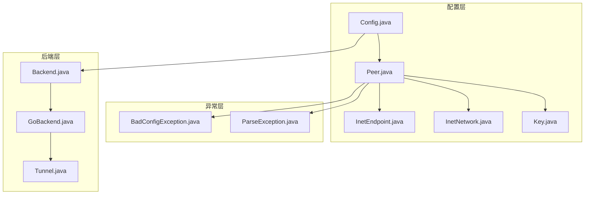
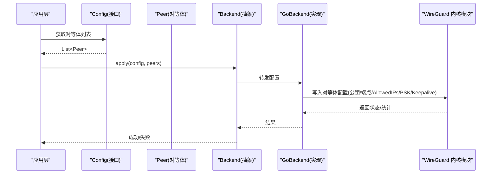
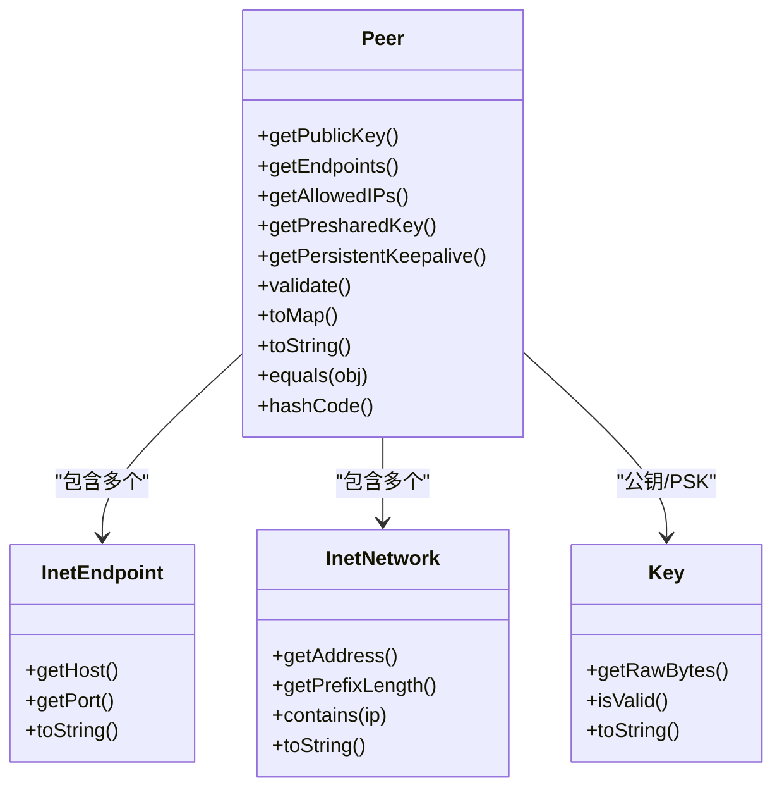
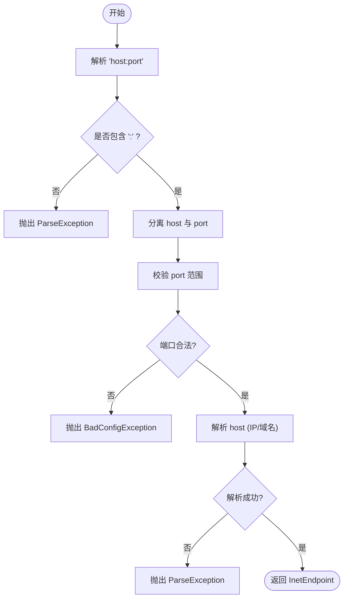
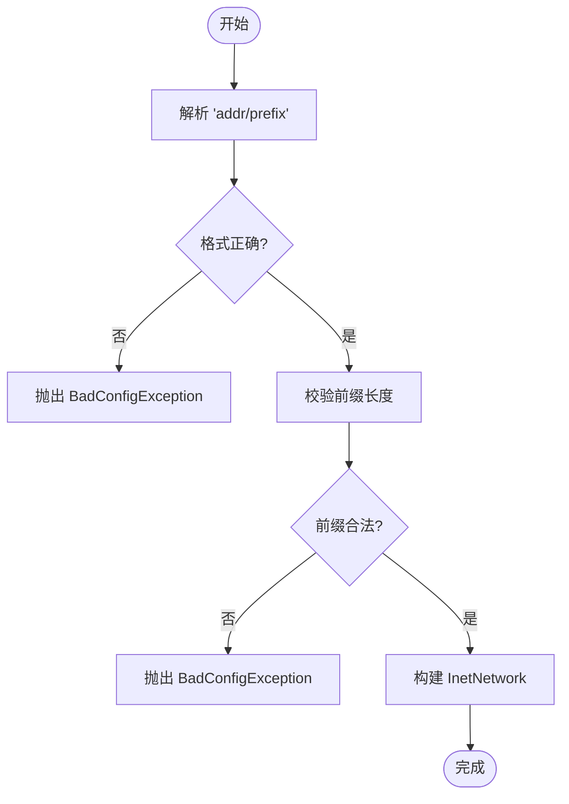
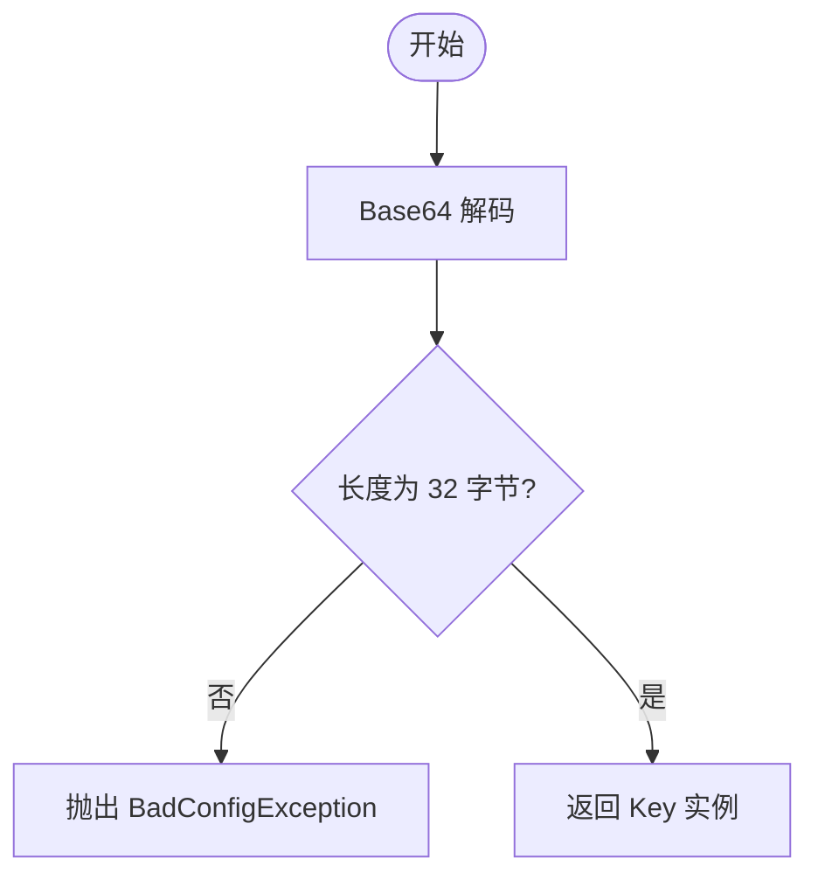
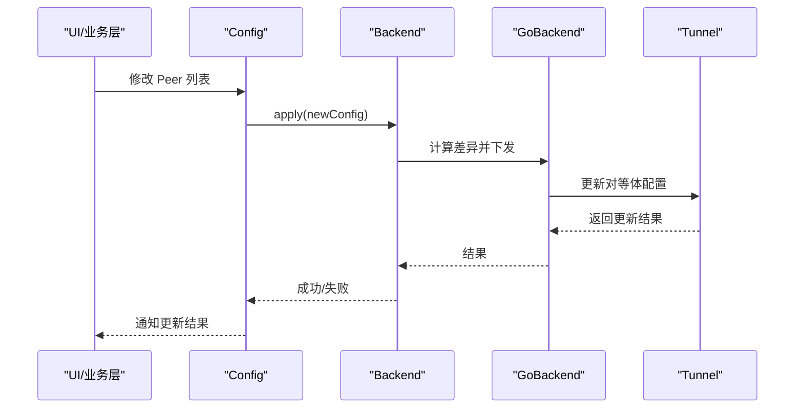
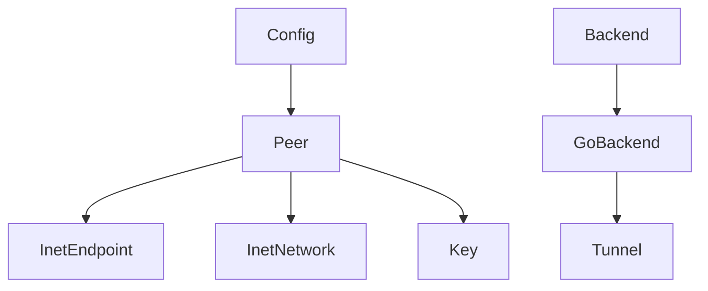

# Peer 类 API

<cite>
**本文引用的文件**   
- [Peer.java](file://tunnel/src/main/java/com/wireguard/config/Peer.java)
- [Config.java](file://tunnel/src/main/java/com/wireguard/config/Config.java)
- [InetEndpoint.java](file://tunnel/src/main/java/com/wireguard/config/InetEndpoint.java)
- [InetNetwork.java](file://tunnel/src/main/java/com/wireguard/config/InetNetwork.java)
- [Key.java](file://tunnel/src/main/java/com/wireguard/crypto/Key.java)
- [BadConfigException.java](file://tunnel/src/main/java/com/wireguard/config/BadConfigException.java)
- [ParseException.java](file://tunnel/src/main/java/com/wireguard/config/ParseException.java)
- [Backend.java](file://tunnel/src/main/java/com/wireguard/android/backend/Backend.java)
- [GoBackend.java](file://tunnel/src/main/java/com/wireguard/android/backend/GoBackend.java)
- [Tunnel.java](file://tunnel/src/main/java/com/wireguard/android/backend/Tunnel.java)
</cite>

## 目录
1. [简介](#简介)
2. [项目结构](#项目结构)
3. [核心组件](#核心组件)
4. [架构总览](#架构总览)
5. [详细组件分析](#详细组件分析)
6. [依赖关系分析](#依赖关系分析)
7. [性能考虑](#性能考虑)
8. [故障排查指南](#故障排查指南)
9. [结论](#结论)
10. [附录：配置示例与最佳实践](#附录配置示例与最佳实践)

## 简介
本文件为 WireGuard Android 项目中 Peer 类的权威 API 文档。内容涵盖对等体（Peer）的所有属性与方法，包括公钥设置、端点配置、持久化保持、允许的 IP 地址段与预共享密钥；详细说明端点格式校验、IP 地址段解析与密钥格式检查；记录连接状态管理与配置更新机制；并提供完整的对等体配置示例，展示如何建立安全的对等体连接。同时说明与 WireGuard 内核模块的交互方式及性能优化选项。

## 项目结构
与 Peer 相关的核心代码位于 tunnel 模块中：
- 配置模型：config 包下的 Peer.java、Config.java、InetEndpoint.java、InetNetwork.java
- 加密与密钥：crypto 包下的 Key.java
- 异常类型：BadConfigException.java、ParseException.java
- 后端与内核交互：android/backend 包下的 Backend.java、GoBackend.java、Tunnel.java

图表来源
- [Peer.java](file://tunnel/src/main/java/com/wireguard/config/Peer.java)
- [Config.java](file://tunnel/src/main/java/com/wireguard/config/Config.java)
- [InetEndpoint.java](file://tunnel/src/main/java/com/wireguard/config/InetEndpoint.java)
- [InetNetwork.java](file://tunnel/src/main/java/com/wireguard/config/InetNetwork.java)
- [Key.java](file://tunnel/src/main/java/com/wireguard/crypto/Key.java)
- [BadConfigException.java](file://tunnel/src/main/java/com/wireguard/config/BadConfigException.java)
- [ParseException.java](file://tunnel/src/main/java/com/wireguard/config/ParseException.java)
- [Backend.java](file://tunnel/src/main/java/com/wireguard/android/backend/Backend.java)
- [GoBackend.java](file://tunnel/src/main/java/com/wireguard/android/backend/GoBackend.java)
- [Tunnel.java](file://tunnel/src/main/java/com/wireguard/android/backend/Tunnel.java)

章节来源
- [Peer.java](file://tunnel/src/main/java/com/wireguard/config/Peer.java)
- [Config.java](file://tunnel/src/main/java/com/wireguard/config/Config.java)
- [InetEndpoint.java](file://tunnel/src/main/java/com/wireguard/config/InetEndpoint.java)
- [InetNetwork.java](file://tunnel/src/main/java/com/wireguard/config/InetNetwork.java)
- [Key.java](file://tunnel/src/main/java/com/wireguard/crypto/Key.java)
- [BadConfigException.java](file://tunnel/src/main/java/com/wireguard/config/BadConfigException.java)
- [ParseException.java](file://tunnel/src/main/java/com/wireguard/config/ParseException.java)
- [Backend.java](file://tunnel/src/main/java/com/wireguard/android/backend/Backend.java)
- [GoBackend.java](file://tunnel/src/main/java/com/wireguard/android/backend/GoBackend.java)
- [Tunnel.java](file://tunnel/src/main/java/com/wireguard/android/backend/Tunnel.java)

## 核心组件
- Peer：表示一个对等体，包含公钥、端点列表、允许 IP 段、预共享密钥、持久化保持标志、传输参数等。提供构造、验证、序列化/反序列化、比较与哈希等方法。
- InetEndpoint：表示 IPv4/IPv6 端点（主机+端口），支持字符串解析与格式化。
- InetNetwork：表示 CIDR 网段（如 10.0.0.0/24），用于 AllowedIPs。
- Key：封装 Curve25519 密钥的字节数组与格式校验。
- Config：接口定义，包含 getPeers() 等访问器，供上层使用。
- Backend/GoBackend/Tunnel：负责将配置下发到 WireGuard 内核模块并管理隧道生命周期。

章节来源
- [Peer.java](file://tunnel/src/main/java/com/wireguard/config/Peer.java)
- [InetEndpoint.java](file://tunnel/src/main/java/com/wireguard/config/InetEndpoint.java)
- [InetNetwork.java](file://tunnel/src/main/java/com/wireguard/config/InetNetwork.java)
- [Key.java](file://tunnel/src/main/java/com/wireguard/crypto/Key.java)
- [Config.java](file://tunnel/src/main/java/com/wireguard/config/Config.java)
- [Backend.java](file://tunnel/src/main/java/com/wireguard/android/backend/Backend.java)
- [GoBackend.java](file://tunnel/src/main/java/com/wireguard/android/backend/GoBackend.java)
- [Tunnel.java](file://tunnel/src/main/java/com/wireguard/android/backend/Tunnel.java)

## 架构总览
Peer 作为配置对象，被 Config 持有，并通过 Backend 抽象与 GoBackend 实现，最终调用 Tunnel 与 WireGuard 内核模块交互。

图表来源
- [Config.java](file://tunnel/src/main/java/com/wireguard/config/Config.java)
- [Peer.java](file://tunnel/src/main/java/com/wireguard/config/Peer.java)
- [Backend.java](file://tunnel/src/main/java/com/wireguard/android/backend/Backend.java)
- [GoBackend.java](file://tunnel/src/main/java/com/wireguard/android/backend/GoBackend.java)
- [Tunnel.java](file://tunnel/src/main/java/com/wireguard/android/backend/Tunnel.java)

## 详细组件分析

### Peer 类 API 概览
- 关键属性
  - 公钥（PublicKey）：必填，Base64 编码的 32 字节公钥
  - 端点（Endpoints）：可选，多个 InetEndpoint，支持多端点与故障转移
  - 允许 IP（AllowedIPs）：可选，多个 InetNetwork，决定路由范围
  - 预共享密钥（PresharedKey）：可选，Base64 编码的 32 字节对称密钥
  - 持久化保持（PersistentKeepalive）：可选，秒级整数，用于 NAT 穿透
  - 其他传输参数：如发送/接收缓冲区大小、最大分段等（由后端实现决定）
- 主要方法
  - 构造与工厂方法：从 Map/JSON/字符串构建 Peer
  - 验证：validate() 检查必填项、格式与取值范围
  - 序列化：toMap()/toString() 输出配置片段
  - 比较与哈希：equals()/hashCode() 基于关键字段
  - 访问器：getPublicKey(), getEndpoints(), getAllowedIPs(), getPresharedKey(), getPersistentKeepalive()
- 错误处理
  - 非法输入抛出 BadConfigException 或 ParseException
  - 具体错误信息包含字段名与原因

图表来源
- [Peer.java](file://tunnel/src/main/java/com/wireguard/config/Peer.java)
- [InetEndpoint.java](file://tunnel/src/main/java/com/wireguard/config/InetEndpoint.java)
- [InetNetwork.java](file://tunnel/src/main/java/com/wireguard/config/InetNetwork.java)
- [Key.java](file://tunnel/src/main/java/com/wireguard/crypto/Key.java)

章节来源
- [Peer.java](file://tunnel/src/main/java/com/wireguard/config/Peer.java)
- [InetEndpoint.java](file://tunnel/src/main/java/com/wireguard/config/InetEndpoint.java)
- [InetNetwork.java](file://tunnel/src/main/java/com/wireguard/config/InetNetwork.java)
- [Key.java](file://tunnel/src/main/java/com/wireguard/crypto/Key.java)

### 端点格式验证与解析
- 支持的协议与地址
  - IPv4/IPv6 地址，支持方括号包裹的 IPv6 字面量
  - 端口号范围与合法性校验
- 解析流程
  - 输入字符串按“主机:端口”拆分
  - 主机可为域名或 IP，优先尝试 IP 解析，失败再回退 DNS
  - 端口必须为有效数字且不超过上限
- 错误处理
  - 格式错误抛出 ParseException
  - 非法端口或空主机抛出 BadConfigException

图表来源
- [InetEndpoint.java](file://tunnel/src/main/java/com/wireguard/config/InetEndpoint.java)
- [BadConfigException.java](file://tunnel/src/main/java/com/wireguard/config/BadConfigException.java)
- [ParseException.java](file://tunnel/src/main/java/com/wireguard/config/ParseException.java)

章节来源
- [InetEndpoint.java](file://tunnel/src/main/java/com/wireguard/config/InetEndpoint.java)
- [BadConfigException.java](file://tunnel/src/main/java/com/wireguard/config/BadConfigException.java)
- [ParseException.java](file://tunnel/src/main/java/com/wireguard/config/ParseException.java)

### 允许的 IP 地址段配置与校验
- 格式要求
  - CIDR 表示法，如 10.0.0.0/24、::1/128
  - 前缀长度必须在合法范围内（IPv4: 0-32，IPv6: 0-128）
- 行为特性
  - 支持多个网段，合并路由表
  - contains(ip) 可用于快速判断某 IP 是否属于该网段
- 错误处理
  - 非法 CIDR 或越界前缀抛出 BadConfigException

图表来源
- [InetNetwork.java](file://tunnel/src/main/java/com/wireguard/config/InetNetwork.java)
- [BadConfigException.java](file://tunnel/src/main/java/com/wireguard/config/BadConfigException.java)

章节来源
- [InetNetwork.java](file://tunnel/src/main/java/com/wireguard/config/InetNetwork.java)
- [BadConfigException.java](file://tunnel/src/main/java/com/wireguard/config/BadConfigException.java)

### 密钥格式检查（公钥与预共享密钥）
- 公钥（PublicKey）
  - Base64 编码的 32 字节数据
  - 解码失败或长度不符抛出 BadConfigException
- 预共享密钥（PresharedKey）
  - 同样为 Base64 编码的 32 字节数据
  - 可选字段，若存在则进行相同校验
- Key 工具类
  - 提供 isValid() 与 toString() 等方法

图表来源
- [Key.java](file://tunnel/src/main/java/com/wireguard/crypto/Key.java)
- [BadConfigException.java](file://tunnel/src/main/java/com/wireguard/config/BadConfigException.java)

章节来源
- [Key.java](file://tunnel/src/main/java/com/wireguard/crypto/Key.java)
- [BadConfigException.java](file://tunnel/src/main/java/com/wireguard/config/BadConfigException.java)

### 连接状态管理与配置更新机制
- 状态管理
  - Peer 本身为配置对象，不直接维护连接状态
  - 连接状态由后端（Backend/GoBackend/Tunnel）管理，例如活跃/空闲、最近握手时间、流量统计等
- 配置更新
  - 通过 Config.apply(peers) 触发后端重新加载配置
  - 后端增量更新对等体，避免全量重建
  - 更新失败时回滚或保留上次有效配置

图表来源
- [Config.java](file://tunnel/src/main/java/com/wireguard/config/Config.java)
- [Backend.java](file://tunnel/src/main/java/com/wireguard/android/backend/Backend.java)
- [GoBackend.java](file://tunnel/src/main/java/com/wireguard/android/backend/GoBackend.java)
- [Tunnel.java](file://tunnel/src/main/java/com/wireguard/android/backend/Tunnel.java)

章节来源
- [Config.java](file://tunnel/src/main/java/com/wireguard/config/Config.java)
- [Backend.java](file://tunnel/src/main/java/com/wireguard/android/backend/Backend.java)
- [GoBackend.java](file://tunnel/src/main/java/com/wireguard/android/backend/GoBackend.java)
- [Tunnel.java](file://tunnel/src/main/java/com/wireguard/android/backend/Tunnel.java)

### 与 WireGuard 内核模块的交互方式
- 抽象接口
  - Backend 定义统一的 apply/getStats/restart 等方法
- 具体实现
  - GoBackend 通过 JNI 调用 libwg-go，进而与内核模块通信
- 隧道管理
  - Tunnel 封装内核句柄、设备名、事件循环与统计收集

图表来源
- [Backend.java](file://tunnel/src/main/java/com/wireguard/android/backend/Backend.java)
- [GoBackend.java](file://tunnel/src/main/java/com/wireguard/android/backend/GoBackend.java)
- [Tunnel.java](file://tunnel/src/main/java/com/wireguard/android/backend/Tunnel.java)

章节来源
- [Backend.java](file://tunnel/src/main/java/com/wireguard/android/backend/Backend.java)
- [GoBackend.java](file://tunnel/src/main/java/com/wireguard/android/backend/GoBackend.java)
- [Tunnel.java](file://tunnel/src/main/java/com/wireguard/android/backend/Tunnel.java)

## 依赖关系分析
- Peer 依赖 InetEndpoint、InetNetwork、Key 进行数据建模与校验
- Config 聚合多个 Peer，对外暴露配置访问与更新能力
- Backend/GoBackend/Tunnel 构成后端栈，负责与内核模块交互
- 异常类型贯穿配置解析与校验过程

图表来源
- [Peer.java](file://tunnel/src/main/java/com/wireguard/config/Peer.java)
- [InetEndpoint.java](file://tunnel/src/main/java/com/wireguard/config/InetEndpoint.java)
- [InetNetwork.java](file://tunnel/src/main/java/com/wireguard/config/InetNetwork.java)
- [Key.java](file://tunnel/src/main/java/com/wireguard/crypto/Key.java)
- [Config.java](file://tunnel/src/main/java/com/wireguard/config/Config.java)
- [Backend.java](file://tunnel/src/main/java/com/wireguard/android/backend/Backend.java)
- [GoBackend.java](file://tunnel/src/main/java/com/wireguard/android/backend/GoBackend.java)
- [Tunnel.java](file://tunnel/src/main/java/com/wireguard/android/backend/Tunnel.java)

章节来源
- [Peer.java](file://tunnel/src/main/java/com/wireguard/config/Peer.java)
- [InetEndpoint.java](file://tunnel/src/main/java/com/wireguard/config/InetEndpoint.java)
- [InetNetwork.java](file://tunnel/src/main/java/com/wireguard/config/InetNetwork.java)
- [Key.java](file://tunnel/src/main/java/com/wireguard/crypto/Key.java)
- [Config.java](file://tunnel/src/main/java/com/wireguard/config/Config.java)
- [Backend.java](file://tunnel/src/main/java/com/wireguard/android/backend/Backend.java)
- [GoBackend.java](file://tunnel/src/main/java/com/wireguard/android/backend/GoBackend.java)
- [Tunnel.java](file://tunnel/src/main/java/com/wireguard/android/backend/Tunnel.java)

## 性能考虑
- 端点选择与故障转移
  - 多端点可提升可用性，建议按延迟/带宽排序
  - 合理设置 PersistentKeepalive 以维持 NAT 映射，但需权衡功耗
- 路由收敛
  - AllowedIPs 尽量精确，减少不必要的路由条目
- 内存与 CPU
  - 避免频繁重建 Peer 对象，采用增量更新
  - 大流量场景下关注内核队列与缓冲区参数
- 统计与监控
  - 利用后端提供的统计接口观察握手次数、丢包率与吞吐量

[本节为通用指导，无需特定文件引用]

## 故障排查指南
- 常见错误
  - 端点格式错误：检查 host:port 格式与端口范围
  - AllowedIPs 非法：确认 CIDR 与前缀长度
  - 密钥格式错误：确保 Base64 编码且长度为 32 字节
- 定位步骤
  - 捕获 BadConfigException/ParseException，查看字段与原因
  - 打印 Peer.toString() 或 toMap() 核对配置
  - 检查后端日志，确认内核模块是否接受配置
- 恢复策略
  - 回滚到上一次有效配置
  - 逐步缩小 AllowedIPs 范围定位问题

章节来源
- [BadConfigException.java](file://tunnel/src/main/java/com/wireguard/config/BadConfigException.java)
- [ParseException.java](file://tunnel/src/main/java/com/wireguard/config/ParseException.java)
- [Peer.java](file://tunnel/src/main/java/com/wireguard/config/Peer.java)

## 结论
Peer 类提供了完整、严格的对等体配置模型与校验能力，配合后端栈实现对 WireGuard 内核模块的安全、高效交互。通过合理的端点与路由配置、密钥管理与 Keepalive 策略，可在移动设备上建立稳定可靠的 VPN 连接。

[本节为总结性内容，无需特定文件引用]

## 附录：配置示例与最佳实践
- 最小可用配置
  - 必填：公钥
  - 可选：端点、AllowedIPs、PresharedKey、PersistentKeepalive
- 安全建议
  - 始终启用 PresharedKey 增强安全性
  - 仅开放必要的 AllowedIPs 网段
  - 合理设置 PersistentKeepalive（如 25 秒）以穿越 NAT
- 高可用建议
  - 配置多个端点并按质量排序
  - 结合网络切换监听动态更新端点顺序
- 示例要点（文字描述）
  - 端点示例：peer.example.com:51820 或 [2001:db8::1]:51820
  - AllowedIPs 示例：10.0.0.0/24、192.168.1.0/24
  - 密钥示例：Base64 编码的 32 字节字符串

[本节为概念性示例，无需特定文件引用]