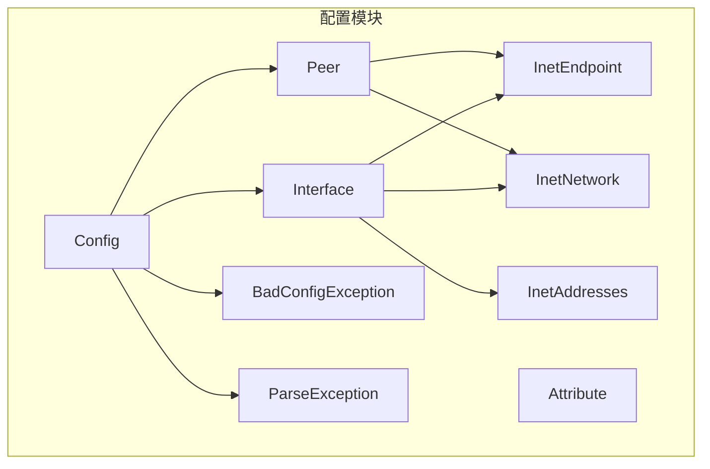
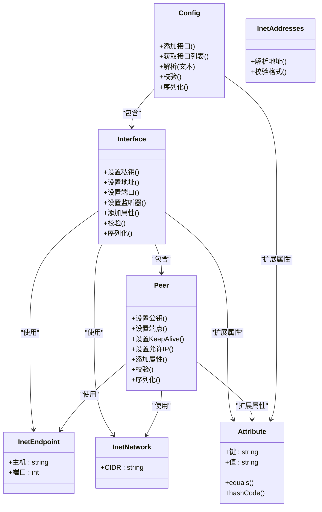
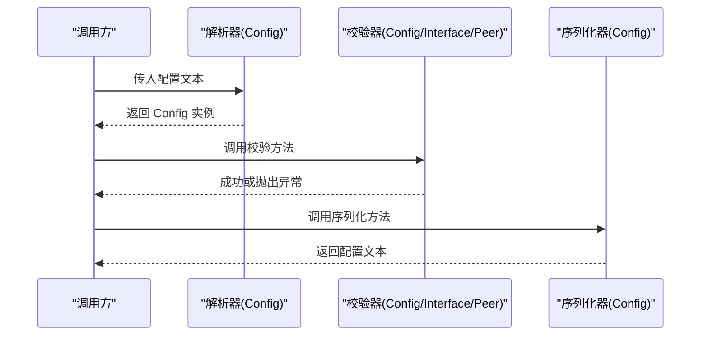
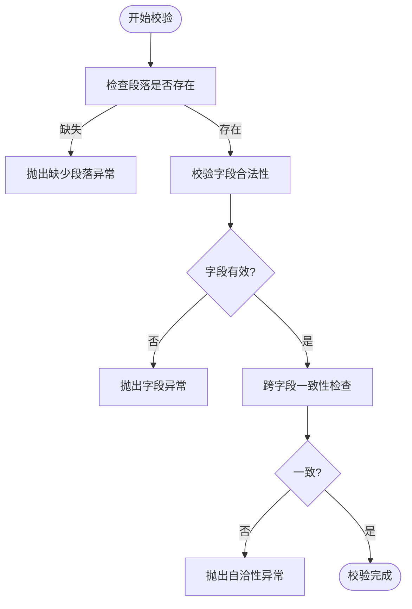
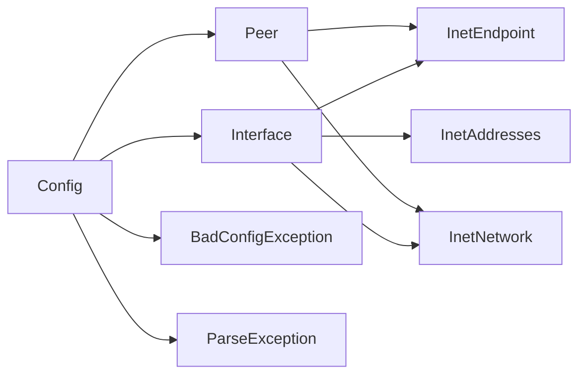

# 配置管理 API

<cite>
**本文档引用的文件**
- [Config.java](file://tunnel/src/main/java/com/wireguard/config/Config.java)
- [Interface.java](file://tunnel/src/main/java/com/wireguard/config/Interface.java)
- [Peer.java](file://tunnel/src/main/java/com/wireguard/config/Peer.java)
- [Attribute.java](file://tunnel/src/main/java/com/wireguard/config/Attribute.java)
- [BadConfigException.java](file://tunnel/src/main/java/com/wireguard/config/BadConfigException.java)
- [ParseException.java](file://tunnel/src/main/java/com/wireguard/config/ParseException.java)
- [InetEndpoint.java](file://tunnel/src/main/java/com/wireguard/config/InetEndpoint.java)
- [InetNetwork.java](file://tunnel/src/main/java/com/wireguard/config/InetNetwork.java)
- [InetAddresses.java](file://tunnel/src/main/java/com/wireguard/config/InetAddresses.java)
- [ConfigTest.java](file://tunnel/src/test/java/com/wireguard/config/ConfigTest.java)
- [BadConfigExceptionTest.java](file://tunnel/src/test/java/com/wireguard/config/BadConfigExceptionTest.java)
</cite>

## 目录
1. [简介](#简介)
2. [项目结构](#项目结构)
3. [核心组件](#核心组件)
4. [架构总览](#架构总览)
5. [详细组件分析](#详细组件分析)
6. [依赖关系分析](#依赖关系分析)
7. [性能考虑](#性能考虑)
8. [故障排查指南](#故障排查指南)
9. [结论](#结论)
10. [附录](#附录)

## 简介
本文件面向 WireGuard Android 项目的配置管理 API，聚焦于配置对象的创建、解析、验证与序列化。文档覆盖以下关键类：
- Config：顶层配置对象，负责整体配置的构建、校验与序列化
- Interface：接口配置，包含地址、端口、监听器、私钥等选项
- Peer：对等体配置，包含公钥、端点、持久化保持、允许的 IP 地址等
- Attribute：属性管理机制，用于扩展键值对属性
同时提供配置验证规则、错误处理说明、配置文件格式规范与最佳实践，并给出完整的配置对象创建与修改示例路径（以源码引用形式）。

## 项目结构
配置相关代码位于 tunnel/src/main/java/com/wireguard/config 包中，测试用例位于同名的 test 目录。核心文件包括 Config、Interface、Peer、Attribute 以及若干辅助类型和异常类型。

图表来源
- [Config.java](file://tunnel/src/main/java/com/wireguard/config/Config.java)
- [Interface.java](file://tunnel/src/main/java/com/wireguard/config/Interface.java)
- [Peer.java](file://tunnel/src/main/java/com/wireguard/config/Peer.java)
- [Attribute.java](file://tunnel/src/main/java/com/wireguard/config/Attribute.java)
- [InetEndpoint.java](file://tunnel/src/main/java/com/wireguard/config/InetEndpoint.java)
- [InetNetwork.java](file://tunnel/src/main/java/com/wireguard/config/InetNetwork.java)
- [InetAddresses.java](file://tunnel/src/main/java/com/wireguard/config/InetAddresses.java)
- [BadConfigException.java](file://tunnel/src/main/java/com/wireguard/config/BadConfigException.java)
- [ParseException.java](file://tunnel/src/main/java/com/wireguard/config/ParseException.java)

章节来源
- [Config.java](file://tunnel/src/main/java/com/wireguard/config/Config.java)
- [Interface.java](file://tunnel/src/main/java/com/wireguard/config/Interface.java)
- [Peer.java](file://tunnel/src/main/java/com/wireguard/config/Peer.java)
- [Attribute.java](file://tunnel/src/main/java/com/wireguard/config/Attribute.java)

## 核心组件
本节概述各核心类的职责与交互关系：
- Config：聚合 Interface 列表与全局属性，提供从字符串解析、校验到序列化的入口
- Interface：定义单个接口的网络参数（如私钥、地址、端口、监听器等）
- Peer：定义对等体的连接参数（如公钥、端点、KeepAlive、AllowedIPs）
- Attribute：通用键值属性容器，支持在 Interface/Peer/Config 上附加自定义属性
- InetEndpoint/InetNetwork/InetAddresses：网络地址与端点的解析与表示
- BadConfigException/ParseException：配置解析与校验过程中的异常类型

章节来源
- [Config.java](file://tunnel/src/main/java/com/wireguard/config/Config.java)
- [Interface.java](file://tunnel/src/main/java/com/wireguard/config/Interface.java)
- [Peer.java](file://tunnel/src/main/java/com/wireguard/config/Peer.java)
- [Attribute.java](file://tunnel/src/main/java/com/wireguard/config/Attribute.java)
- [InetEndpoint.java](file://tunnel/src/main/java/com/wireguard/config/InetEndpoint.java)
- [InetNetwork.java](file://tunnel/src/main/java/com/wireguard/config/InetNetwork.java)
- [InetAddresses.java](file://tunnel/src/main/java/com/wireguard/config/InetAddresses.java)
- [BadConfigException.java](file://tunnel/src/main/java/com/wireguard/config/BadConfigException.java)
- [ParseException.java](file://tunnel/src/main/java/com/wireguard/config/ParseException.java)

## 架构总览
下图展示了配置对象之间的层次关系与数据流向：Config 持有多个 Interface；每个 Interface 可关联多个 Peer；Attribute 作为可扩展的键值容器附着在各层级。

图表来源
- [Config.java](file://tunnel/src/main/java/com/wireguard/config/Config.java)
- [Interface.java](file://tunnel/src/main/java/com/wireguard/config/Interface.java)
- [Peer.java](file://tunnel/src/main/java/com/wireguard/config/Peer.java)
- [Attribute.java](file://tunnel/src/main/java/com/wireguard/config/Attribute.java)
- [InetEndpoint.java](file://tunnel/src/main/java/com/wireguard/config/InetEndpoint.java)
- [InetNetwork.java](file://tunnel/src/main/java/com/wireguard/config/InetNetwork.java)
- [InetAddresses.java](file://tunnel/src/main/java/com/wireguard/config/InetAddresses.java)

## 详细组件分析

### Config 类
职责与能力
- 配置聚合：维护 Interface 集合与全局属性
- 解析：从文本（如 .conf）内容构建配置对象
- 校验：检查必填项、类型与范围、重复项等
- 序列化：输出为可读的配置文本

常用方法与属性（概念性描述）
- 解析方法：接收字符串输入，返回 Config 实例或抛出解析异常
- 校验方法：遍历 Interface 与 Peer，执行字段级与跨字段约束检查
- 序列化方法：将配置对象转换为标准格式的文本
- 访问器：获取/设置 Interface 列表、属性映射

章节来源
- [Config.java](file://tunnel/src/main/java/com/wireguard/config/Config.java)
- [ConfigTest.java](file://tunnel/src/test/java/com/wireguard/config/ConfigTest.java)

### Interface 类
配置选项概览
- 私钥：接口身份标识
- 地址：IPv4/IPv6 CIDR 列表
- 端口：监听端口
- 监听器：绑定策略（如特定网卡或通配）
- 属性：扩展键值对（通过 Attribute）

常用方法与属性（概念性描述）
- 设置私钥：校验密钥格式与长度
- 设置地址：校验 CIDR 合法性与去重
- 设置端口：校验范围与冲突
- 设置监听器：校验绑定目标有效性
- 添加属性：注册自定义键值
- 校验：综合检查必填项与一致性
- 序列化：输出 [Interface] 段落的文本

章节来源
- [Interface.java](file://tunnel/src/main/java/com/wireguard/config/Interface.java)
- [InetNetwork.java](file://tunnel/src/main/java/com/wireguard/config/InetNetwork.java)
- [InetEndpoint.java](file://tunnel/src/main/java/com/wireguard/config/InetEndpoint.java)
- [InetAddresses.java](file://tunnel/src/main/java/com/wireguard/config/InetAddresses.java)

### Peer 类
对等体配置要点
- 公钥：对等体身份标识
- 端点：远程地址与端口（InetEndpoint）
- KeepAlive：保活间隔（秒）
- AllowedIPs：允许路由的 CIDR 列表
- 属性：扩展键值对（通过 Attribute）

常用方法与属性（概念性描述）
- 设置公钥：校验 Base64/Ed25519 格式
- 设置端点：校验主机与端口合法性
- 设置 KeepAlive：校验非负整数范围
- 设置 AllowedIPs：校验 CIDR 列表与去重
- 添加属性：注册自定义键值
- 校验：检查必填项与一致性
- 序列化：输出 [Peer] 段落的文本

章节来源
- [Peer.java](file://tunnel/src/main/java/com/wireguard/config/Peer.java)
- [InetEndpoint.java](file://tunnel/src/main/java/com/wireguard/config/InetEndpoint.java)
- [InetNetwork.java](file://tunnel/src/main/java/com/wireguard/config/InetNetwork.java)

### Attribute 类
属性管理机制
- 键值存储：统一的字符串键与值
- 相等性与哈希：基于键值比较，便于集合操作
- 使用位置：可在 Interface、Peer、Config 上附加扩展属性

常用方法与属性（概念性描述）
- 构造函数：传入键与值
- equals/hashCode：实现语义等价判断
- 序列化：输出 key=value 行

章节来源
- [Attribute.java](file://tunnel/src/main/java/com/wireguard/config/Attribute.java)

### 配置解析与序列化流程
下图展示从文本到配置对象再到文本序列化的典型流程。

图表来源
- [Config.java](file://tunnel/src/main/java/com/wireguard/config/Config.java)
- [Interface.java](file://tunnel/src/main/java/com/wireguard/config/Interface.java)
- [Peer.java](file://tunnel/src/main/java/com/wireguard/config/Peer.java)

### 配置验证流程图
下图概括了配置校验的关键分支与常见错误路径。

图表来源
- [Config.java](file://tunnel/src/main/java/com/wireguard/config/Config.java)
- [Interface.java](file://tunnel/src/main/java/com/wireguard/config/Interface.java)
- [Peer.java](file://tunnel/src/main/java/com/wireguard/config/Peer.java)
- [BadConfigException.java](file://tunnel/src/main/java/com/wireguard/config/BadConfigException.java)
- [ParseException.java](file://tunnel/src/main/java/com/wireguard/config/ParseException.java)

## 依赖关系分析
- Config 依赖 Interface、Peer、Attribute 进行组合建模
- Interface 与 Peer 依赖 InetEndpoint、InetNetwork、InetAddresses 进行地址与端点解析
- 异常类型 BadConfigException、ParseException 贯穿解析与校验过程

图表来源
- [Config.java](file://tunnel/src/main/java/com/wireguard/config/Config.java)
- [Interface.java](file://tunnel/src/main/java/com/wireguard/config/Interface.java)
- [Peer.java](file://tunnel/src/main/java/com/wireguard/config/Peer.java)
- [InetEndpoint.java](file://tunnel/src/main/java/com/wireguard/config/InetEndpoint.java)
- [InetNetwork.java](file://tunnel/src/main/java/com/wireguard/config/InetNetwork.java)
- [InetAddresses.java](file://tunnel/src/main/java/com/wireguard/config/InetAddresses.java)
- [BadConfigException.java](file://tunnel/src/main/java/com/wireguard/config/BadConfigException.java)
- [ParseException.java](file://tunnel/src/main/java/com/wireguard/config/ParseException.java)

章节来源
- [Config.java](file://tunnel/src/main/java/com/wireguard/config/Config.java)
- [Interface.java](file://tunnel/src/main/java/com/wireguard/config/Interface.java)
- [Peer.java](file://tunnel/src/main/java/com/wireguard/config/Peer.java)
- [InetEndpoint.java](file://tunnel/src/main/java/com/wireguard/config/InetEndpoint.java)
- [InetNetwork.java](file://tunnel/src/main/java/com/wireguard/config/InetNetwork.java)
- [InetAddresses.java](file://tunnel/src/main/java/com/wireguard/config/InetAddresses.java)
- [BadConfigException.java](file://tunnel/src/main/java/com/wireguard/config/BadConfigException.java)
- [ParseException.java](file://tunnel/src/main/java/com/wireguard/config/ParseException.java)

## 性能考虑
- 解析阶段：避免重复解析相同文本，必要时缓存结果
- 校验阶段：尽早失败，减少不必要的计算
- 序列化阶段：批量拼接输出，减少频繁字符串操作
- 地址与端点解析：复用解析工具类，避免重复正则匹配

[本节为通用指导，不直接分析具体文件]

## 故障排查指南
常见问题与定位建议
- 解析失败：检查语法、段落名称、键名拼写与大小写
- 字段非法：核对私钥/公钥格式、端口范围、CIDR 写法
- 自洽性错误：确保必填项齐全、无重复键、依赖关系合理
- 异常类型：
  - BadConfigException：配置结构或语义错误
  - ParseException：文本解析阶段的语法错误

章节来源
- [BadConfigException.java](file://tunnel/src/main/java/com/wireguard/config/BadConfigException.java)
- [ParseException.java](file://tunnel/src/main/java/com/wireguard/config/ParseException.java)
- [BadConfigExceptionTest.java](file://tunnel/src/test/java/com/wireguard/config/BadConfigExceptionTest.java)

## 结论
本配置管理 API 以 Config/Interface/Peer/Attribute 为核心，配合地址解析与异常体系，提供了完整的配置创建、解析、校验与序列化能力。遵循本文的验证规则与最佳实践，可有效降低配置错误率并提升稳定性。

[本节为总结性内容，不直接分析具体文件]

## 附录

### 配置文件格式规范（概要）
- 段落：[Interface]、[Peer]
- 关键字段（示例性列举，具体以实现为准）：
  - Interface：PrivateKey、Address、Port、ListenPort、Attributes
  - Peer：PublicKey、Endpoint、PersistentKeepalive、AllowedIPs、Attributes
- 注释：以 # 开头
- 键值对：key=value，注意大小写与空格

[本节为概念性说明，不直接分析具体文件]

### 配置对象创建与修改示例（路径指引）
- 创建 Config 并添加 Interface、Peer
- 设置 Interface 的私钥、地址、端口、监听器
- 设置 Peer 的公钥、端点、KeepAlive、AllowedIPs
- 添加 Attribute 扩展属性
- 调用校验与序列化方法

示例参考路径
- [ConfigTest.java](file://tunnel/src/test/java/com/wireguard/config/ConfigTest.java)

章节来源
- [ConfigTest.java](file://tunnel/src/test/java/com/wireguard/config/ConfigTest.java)

### 最佳实践
- 明确必填项：确保私钥、公钥、至少一个 AllowedIPs 等关键信息完整
- 严格校验：在应用层先调用校验方法，再提交到底层
- 避免重复：清理重复的 AllowedIPs、端口冲突
- 安全存储：敏感字段（私钥）加密存储，限制访问权限
- 版本兼容：新增 Attribute 时保持向后兼容

[本节为通用指导，不直接分析具体文件]