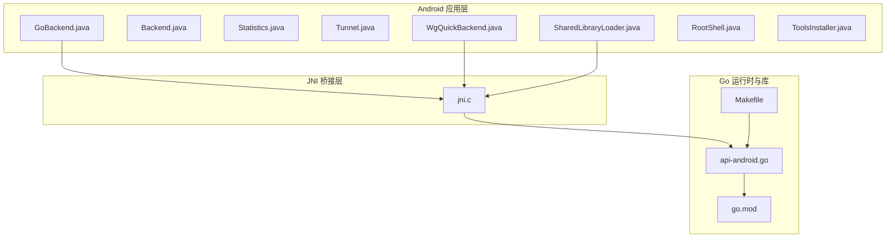
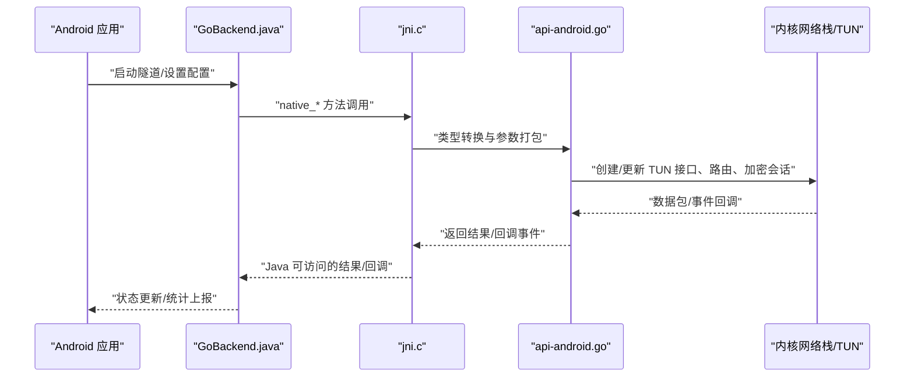
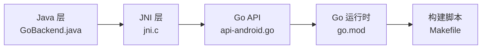

# GoBackend 实现详解

<cite>
**本文引用的文件**   
- [api-android.go](file://tunnel/tools/libwg-go/api-android.go)
- [jni.c](file://tunnel/tools/libwg-go/jni.c)
- [GoBackend.java](file://tunnel/src/main/java/com/wireguard/android/backend/GoBackend.java)
- [Backend.java](file://tunnel/src/main/java/com/wireguard/android/backend/Backend.java)
- [Statistics.java](file://tunnel/src/main/java/com/wireguard/android/backend/Statistics.java)
- [Tunnel.java](file://tunnel/src/main/java/com/wireguard/android/backend/Tunnel.java)
- [WgQuickBackend.java](file://tunnel/src/main/java/com/wireguard/android/backend/WgQuickBackend.java)
- [SharedLibraryLoader.java](file://tunnel/src/main/java/com/wireguard/android/util/SharedLibraryLoader.java)
- [RootShell.java](file://tunnel/src/main/java/com/wireguard/android/util/RootShell.java)
- [ToolsInstaller.java](file://tunnel/src/main/java/com/wireguard/android/util/ToolsInstaller.java)
- [go.mod](file://tunnel/tools/libwg-go/go.mod)
- [Makefile](file://tunnel/tools/libwg-go/Makefile)
</cite>

## 目录
1. [简介](#简介)
2. [项目结构](#项目结构)
3. [核心组件](#核心组件)
4. [架构总览](#架构总览)
5. [详细组件分析](#详细组件分析)
6. [依赖关系分析](#依赖关系分析)
7. [性能考量](#性能考量)
8. [故障排查指南](#故障排查指南)
9. [结论](#结论)
10. [附录](#附录)

## 简介
本技术文档聚焦于 WireGuard Android 中的 GoBackend 实现，系统性阐述基于 Go 运行时的 WireGuard 用户态实现与 JNI 桥接层的工作原理。内容涵盖：
- Go 函数接口定义与参数传递（api-android.go）
- C 语言层面的 JNI 实现细节（jni.c）
- Go 运行时在 Android 环境下的初始化与配置
- 内存管理、线程安全与异常处理机制
- 与系统内核的交互方式及网络栈集成
- 版本兼容性与依赖管理策略
- 性能优化建议与调试技巧

## 项目结构
GoBackend 的实现横跨 Java/Kotlin 层、JNI 桥接层与 Go 运行时库，关键目录与职责如下：
- tunnel/src/main/java/.../backend: 定义后端抽象与具体实现（GoBackend、WgQuickBackend），封装对底层库的调用
- tunnel/src/main/java/.../util: 工具类，负责共享库加载、Root Shell 执行与工具安装
- tunnel/tools/libwg-go: Go 侧 API 暴露与 JNI 桥接实现，包含 go.mod、Makefile 等构建脚本
- tunnel/tools/ndk-compat: NDK 兼容性适配代码
- ui: Android UI 层（与本主题相关度较低）

图表来源
- [GoBackend.java](file://tunnel/src/main/java/com/wireguard/android/backend/GoBackend.java)
- [Backend.java](file://tunnel/src/main/java/com/wireguard/android/backend/Backend.java)
- [Statistics.java](file://tunnel/src/main/java/com/wireguard/android/backend/Statistics.java)
- [Tunnel.java](file://tunnel/src/main/java/com/wireguard/android/backend/Tunnel.java)
- [WgQuickBackend.java](file://tunnel/src/main/java/com/wireguard/android/backend/WgQuickBackend.java)
- [SharedLibraryLoader.java](file://tunnel/src/main/java/com/wireguard/android/util/SharedLibraryLoader.java)
- [jni.c](file://tunnel/tools/libwg-go/jni.c)
- [api-android.go](file://tunnel/tools/libwg-go/api-android.go)
- [go.mod](file://tunnel/tools/libwg-go/go.mod)
- [Makefile](file://tunnel/tools/libwg-go/Makefile)

章节来源
- [GoBackend.java](file://tunnel/src/main/java/com/wireguard/android/backend/GoBackend.java)
- [Backend.java](file://tunnel/src/main/java/com/wireguard/android/backend/Backend.java)
- [Statistics.java](file://tunnel/src/main/java/com/wireguard/android/backend/Statistics.java)
- [Tunnel.java](file://tunnel/src/main/java/com/wireguard/android/backend/Tunnel.java)
- [WgQuickBackend.java](file://tunnel/src/main/java/com/wireguard/android/backend/WgQuickBackend.java)
- [SharedLibraryLoader.java](file://tunnel/src/main/java/com/wireguard/android/util/SharedLibraryLoader.java)
- [jni.c](file://tunnel/tools/libwg-go/jni.c)
- [api-android.go](file://tunnel/tools/libwg-go/api-android.go)
- [go.mod](file://tunnel/tools/libwg-go/go.mod)
- [Makefile](file://tunnel/tools/libwg-go/Makefile)

## 核心组件
- GoBackend.java: 面向上层的具体后端实现，负责生命周期管理、配置下发、统计获取、事件回调等
- Backend.java: 后端抽象接口，定义统一能力边界
- Statistics.java: 统计数据结构，用于上报流量、连接状态等指标
- Tunnel.java: 隧道对象，承载接口与对端信息
- WgQuickBackend.java: 基于 wg-quick 的后端实现（与 GoBackend 并行存在）
- SharedLibraryLoader.java: 动态库加载器，确保 libwg-go.so 正确加载
- RootShell.java / ToolsInstaller.java: 以 root 权限执行系统命令与安装必要工具

章节来源
- [GoBackend.java](file://tunnel/src/main/java/com/wireguard/android/backend/GoBackend.java)
- [Backend.java](file://tunnel/src/main/java/com/wireguard/android/backend/Backend.java)
- [Statistics.java](file://tunnel/src/main/java/com/wireguard/android/backend/Statistics.java)
- [Tunnel.java](file://tunnel/src/main/java/com/wireguard/android/backend/Tunnel.java)
- [WgQuickBackend.java](file://tunnel/src/main/java/com/wireguard/android/backend/WgQuickBackend.java)
- [SharedLibraryLoader.java](file://tunnel/src/main/java/com/wireguard/android/util/SharedLibraryLoader.java)
- [RootShell.java](file://tunnel/src/main/java/com/wireguard/android/util/RootShell.java)
- [ToolsInstaller.java](file://tunnel/src/main/java/com/wireguard/android/util/ToolsInstaller.java)

## 架构总览
整体数据流与控制流遵循“Java 调用 -> JNI 桥接 -> Go 运行时 -> 内核网络栈”的路径。Go 侧通过 api-android.go 暴露函数，C 侧 jni.c 完成类型转换与调用调度，最终由 Go 实现的 WireGuard 逻辑与内核模块或 TUN 设备交互。

图表来源
- [GoBackend.java](file://tunnel/src/main/java/com/wireguard/android/backend/GoBackend.java)
- [jni.c](file://tunnel/tools/libwg-go/jni.c)
- [api-android.go](file://tunnel/tools/libwg-go/api-android.go)

## 详细组件分析

### Go 函数接口定义与参数传递（api-android.go）
- 作用：为 JNI 提供稳定的 C 可调用入口，将 Go 侧 WireGuard 能力暴露给 C 层
- 关键点：
  - 函数命名约定：通常以特定前缀导出，便于 C 侧 dlsym 查找
  - 参数类型映射：字符串、字节数组、整型、指针等在 Go/C 间需严格对齐
  - 错误码约定：通过返回值或输出参数传递错误信息，避免跨语言异常传播
  - 回调注册：允许 Go 侧向 C 注册回调，以便将事件回传到 Java

章节来源
- [api-android.go](file://tunnel/tools/libwg-go/api-android.go)

### C 语言层面的 JNI 实现细节（jni.c）
- 作用：实现 Java 与 Go 之间的桥接，负责类型转换、内存拷贝、异常捕获与线程上下文切换
- 关键点：
  - JNI 方法签名：与 Java 声明一一对应，注意基本类型、数组、对象的映射
  - 内存管理：避免悬空指针与重复释放；必要时使用 NewGlobalRef/DeleteGlobalRef
  - 线程安全：确保在正确的线程上下文中调用 Go 函数，必要时进行线程绑定
  - 异常处理：捕获 Go 侧错误并转换为 Java 异常，保证上层感知

章节来源
- [jni.c](file://tunnel/tools/libwg-go/jni.c)

### Go 运行时在 Android 环境下的初始化与配置
- 初始化流程：
  - 动态库加载：SharedLibraryLoader.java 负责加载 libwg-go.so
  - 符号解析：jni.c 通过 dlsym 获取导出函数
  - Go 运行时启动：确保 CGO_ENABLED=1 且目标平台为 android/arm64 等
- 配置项：
  - 环境变量：如 GOROOT、GOOS、GOARCH、CGO_CFLAGS、CGO_LDFLAGS
  - 构建脚本：Makefile 中指定交叉编译参数与链接选项

章节来源
- [SharedLibraryLoader.java](file://tunnel/src/main/java/com/wireguard/android/util/SharedLibraryLoader.java)
- [jni.c](file://tunnel/tools/libwg-go/jni.c)
- [Makefile](file://tunnel/tools/libwg-go/Makefile)

### 内存管理、线程安全与异常处理机制
- 内存管理：
  - Java 对象与 C/Go 缓冲区之间需显式拷贝，避免 GC 移动导致崩溃
  - 使用池化或复用缓冲区减少分配开销
- 线程安全：
  - 限制并发调用，或使用互斥锁保护共享状态
  - 回调需在主线程或指定线程执行，避免 UI 线程阻塞
- 异常处理：
  - 统一错误码与异常包装，便于上层定位问题
  - 记录关键日志与堆栈，支持远程诊断

章节来源
- [jni.c](file://tunnel/tools/libwg-go/jni.c)
- [GoBackend.java](file://tunnel/src/main/java/com/wireguard/android/backend/GoBackend.java)

### 与系统内核的交互方式和网络栈集成
- TUN 设备：Go 侧通过 netlink/socket 接口创建/配置 TUN 设备
- 路由与防火墙：注入路由规则与 iptables/nftables 规则，实现流量劫持
- 加密与协议：WireGuard 协议栈在用户态实现，与内核模块协同工作

章节来源
- [api-android.go](file://tunnel/tools/libwg-go/api-android.go)
- [jni.c](file://tunnel/tools/libwg-go/jni.c)

### 版本兼容性与依赖管理策略
- go.mod：声明 Go 模块版本与依赖，确保可重现构建
- Makefile：固定交叉编译器版本与 NDK 路径，避免环境差异
- 向后兼容：保持 JNI 接口稳定，新增功能通过扩展而非破坏性变更

章节来源
- [go.mod](file://tunnel/tools/libwg-go/go.mod)
- [Makefile](file://tunnel/tools/libwg-go/Makefile)

## 依赖关系分析
GoBackend 的依赖链从 Java 层到 JNI 再到 Go 运行时，形成清晰的层次结构。

图表来源
- [GoBackend.java](file://tunnel/src/main/java/com/wireguard/android/backend/GoBackend.java)
- [jni.c](file://tunnel/tools/libwg-go/jni.c)
- [api-android.go](file://tunnel/tools/libwg-go/api-android.go)
- [go.mod](file://tunnel/tools/libwg-go/go.mod)
- [Makefile](file://tunnel/tools/libwg-go/Makefile)

章节来源
- [GoBackend.java](file://tunnel/src/main/java/com/wireguard/android/backend/GoBackend.java)
- [jni.c](file://tunnel/tools/libwg-go/jni.c)
- [api-android.go](file://tunnel/tools/libwg-go/api-android.go)
- [go.mod](file://tunnel/tools/libwg-go/go.mod)
- [Makefile](file://tunnel/tools/libwg-go/Makefile)

## 性能考量
- 零拷贝优化：尽量减少 Java/C/Go 之间的数据拷贝，使用直接缓冲区
- 批处理：合并小数据包与配置更新，降低系统调用频率
- 异步回调：避免阻塞主线程，使用事件驱动模型
- 资源复用：重用 socket、TUN 句柄与缓冲区
- 监控与埋点：收集关键路径耗时与内存占用，指导优化

[本节为通用指导，不直接分析具体文件]

## 故障排查指南
- 常见问题：
  - 动态库加载失败：检查 SO 路径与架构匹配
  - JNI 签名不匹配：核对方法签名与参数类型
  - 内存泄漏：使用 LeakCanary 或 Valgrind 检测
  - 线程死锁：分析线程栈与锁顺序
- 调试技巧：
  - 启用详细日志：在 Go 与 C 侧增加日志级别
  - 使用 strace/ltrace：跟踪系统调用与库调用
  - 模拟器测试：在可控环境中复现问题

章节来源
- [SharedLibraryLoader.java](file://tunnel/src/main/java/com/wireguard/android/util/SharedLibraryLoader.java)
- [jni.c](file://tunnel/tools/libwg-go/jni.c)

## 结论
GoBackend 通过 JNI 桥接将 Go 实现的 WireGuard 与 Android 应用无缝集成，具备高内聚、低耦合的特点。合理的内存管理、线程安全与异常处理是稳定性的关键。结合性能优化与调试技巧，可有效提升用户体验与系统可靠性。

[本节为总结，不直接分析具体文件]

## 附录
- 构建与部署：参考 Makefile 与 go.mod 配置
- 扩展开发：遵循现有 JNI 接口规范，保持向后兼容
- 社区资源：查阅 WireGuard 官方文档与 Android NDK 指南

[本节为补充信息，不直接分析具体文件]