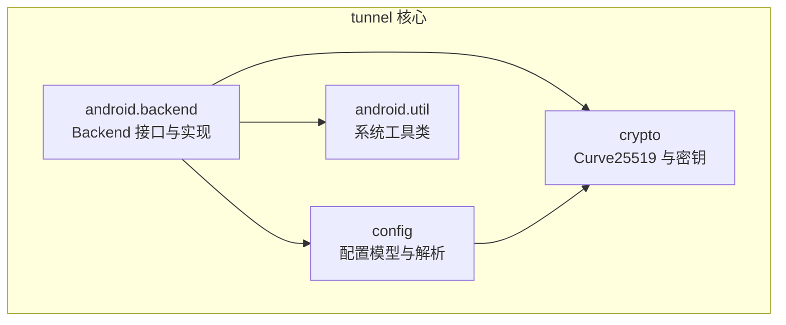
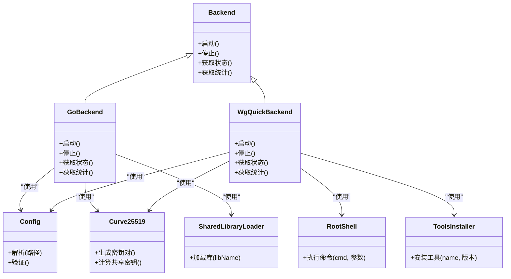
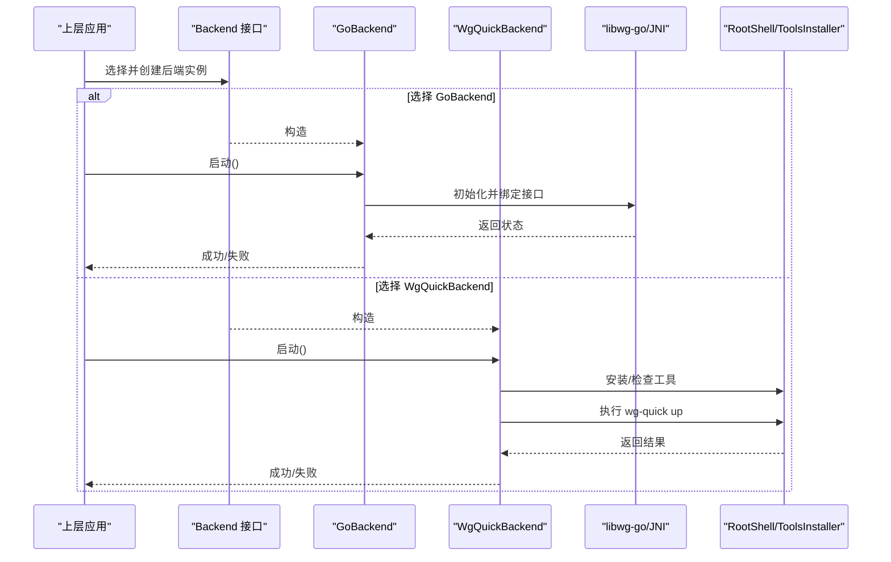
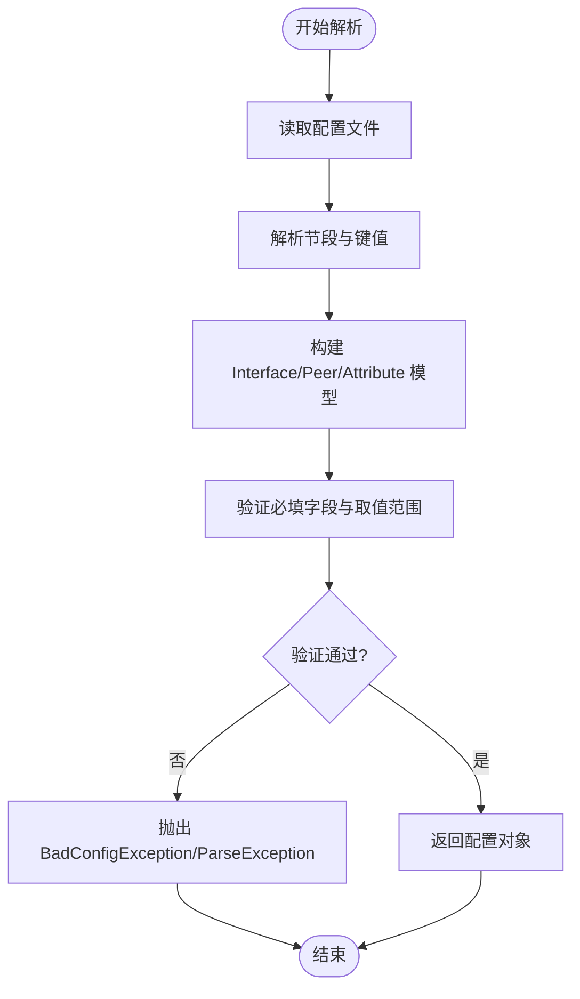
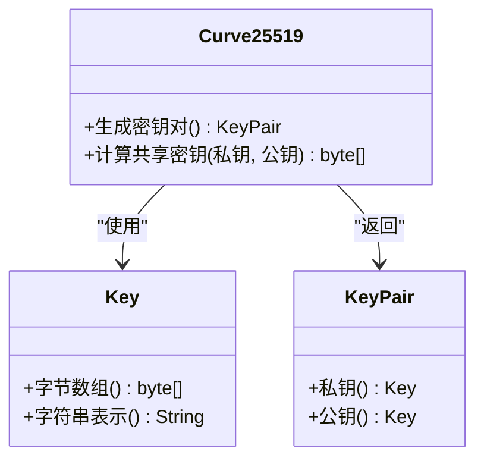
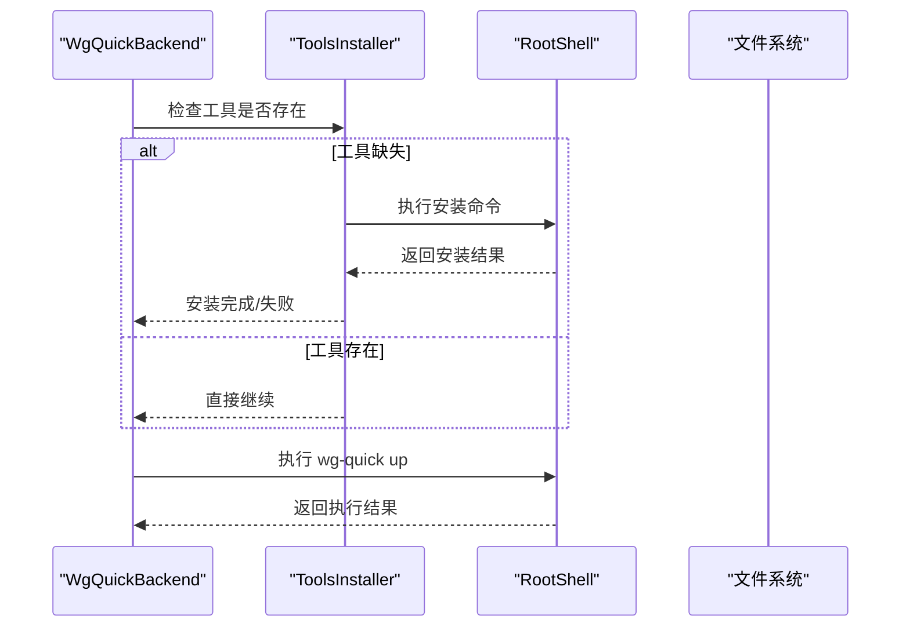
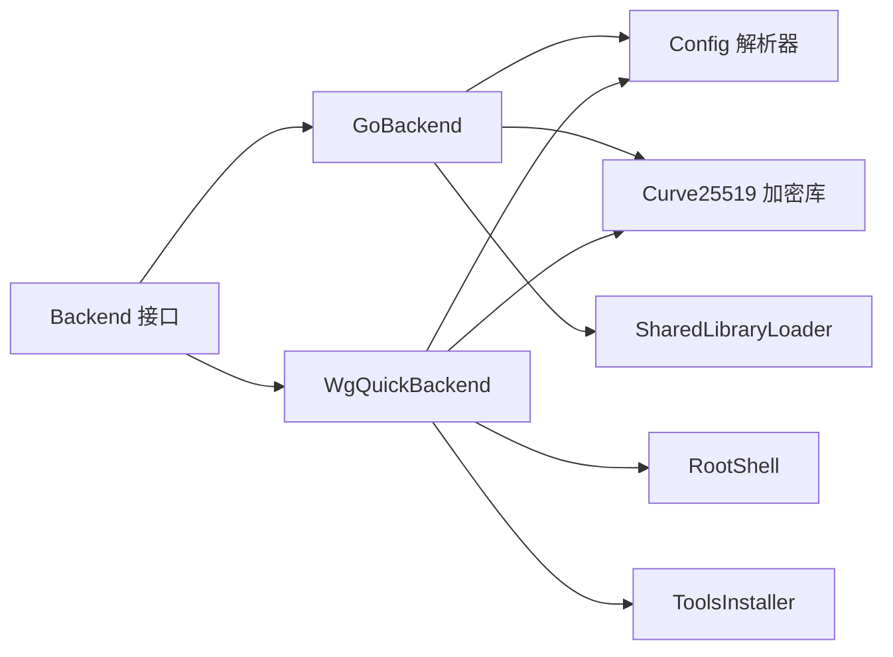

# Tunnel 核心模块

<cite>
**本文引用的文件**   
- [tunnel/src/main/java/com/wireguard/android/backend/Backend.java](file://tunnel/src/main/java/com/wireguard/android/backend/Backend.java)
- [tunnel/src/main/java/com/wireguard/android/backend/GoBackend.java](file://tunnel/src/main/java/com/wireguard/android/backend/GoBackend.java)
- [tunnel/src/main/java/com/wireguard/android/backend/WgQuickBackend.java](file://tunnel/src/main/java/com/wireguard/android/backend/WgQuickBackend.java)
- [tunnel/src/main/java/com/wireguard/android/backend/Tunnel.java](file://tunnel/src/main/java/com/wireguard/android/backend/Tunnel.java)
- [tunnel/src/main/java/com/wireguard/android/backend/Statistics.java](file://tunnel/src/main/java/com/wireguard/android/backend/Statistics.java)
- [tunnel/src/main/java/com/wireguard/android/backend/BackendException.java](file://tunnel/src/main/java/com/wireguard/android/backend/BackendException.java)
- [tunnel/src/main/java/com/wireguard/config/Config.java](file://tunnel/src/main/java/com/wireguard/config/Config.java)
- [tunnel/src/main/java/com/wireguard/config/Interface.java](file://tunnel/src/main/java/com/wireguard/config/Interface.java)
- [tunnel/src/main/java/com/wireguard/config/Peer.java](file://tunnel/src/main/java/com/wireguard/config/Peer.java)
- [tunnel/src/main/java/com/wireguard/config/Attribute.java](file://tunnel/src/main/java/com/wireguard/config/Attribute.java)
- [tunnel/src/main/java/com/wireguard/config/BadConfigException.java](file://tunnel/src/main/java/com/wireguard/config/BadConfigException.java)
- [tunnel/src/main/java/com/wireguard/config/ParseException.java](file://tunnel/src/main/java/com/wireguard/config/ParseException.java)
- [tunnel/src/main/java/com/wireguard/crypto/Curve25519.java](file://tunnel/src/main/java/com/wireguard/crypto/Curve25519.java)
- [tunnel/src/main/java/com/wireguard/crypto/Key.java](file://tunnel/src/main/java/com/wireguard/crypto/Key.java)
- [tunnel/src/main/java/com/wireguard/crypto/KeyPair.java](file://tunnel/src/main/java/com/wireguard/crypto/KeyPair.java)
- [tunnel/src/main/java/com/wireguard/crypto/KeyFormatException.java](file://tunnel/src/main/java/com/wireguard/crypto/KeyFormatException.java)
- [tunnel/src/main/java/com/wireguard/android/util/RootShell.java](file://tunnel/src/main/java/com/wireguard/android/util/RootShell.java)
- [tunnel/src/main/java/com/wireguard/android/util/SharedLibraryLoader.java](file://tunnel/src/main/java/com/wireguard/android/util/SharedLibraryLoader.java)
- [tunnel/src/main/java/com/wireguard/android/util/ToolsInstaller.java](file://tunnel/src/main/java/com/wireguard/android/util/ToolsInstaller.java)
</cite>

## 目录
1. [简介](#简介)
2. [项目结构](#项目结构)
3. [核心组件](#核心组件)
4. [架构总览](#架构总览)
5. [详细组件分析](#详细组件分析)
6. [依赖关系分析](#依赖关系分析)
7. [性能考虑](#性能考虑)
8. [故障排除指南](#故障排除指南)
9. [结论](#结论)
10. [附录](#附录)

## 简介
本技术文档聚焦于 Tunnel 核心模块，围绕后端抽象层、配置解析器、加密工具库与系统工具类进行系统化说明。目标是帮助开发者理解：
- 后端抽象层 Backend 接口的设计与实现策略
- GoBackend 与 WgQuickBackend 两种实现的差异、优缺点与选择逻辑
- 配置文件格式、验证规则与错误处理机制
- Curve25519 密钥交换、密钥生成与管理
- RootShell、SharedLibraryLoader、ToolsInstaller 的使用方式与最佳实践
- 与其他模块的集成方式与数据流
- 性能优化建议与常见问题排查

## 项目结构
Tunnel 核心模块位于 tunnel 子工程中，主要包含以下包：
- android.backend：后端抽象与实现（GoBackend、WgQuickBackend）、隧道封装与统计
- config：WireGuard 配置模型与解析器
- crypto：Curve25519 相关加密原语与密钥管理
- android.util：系统工具类（RootShell、SharedLibraryLoader、ToolsInstaller）

图表来源
- [tunnel/src/main/java/com/wireguard/android/backend/Backend.java](file://tunnel/src/main/java/com/wireguard/android/backend/Backend.java)
- [tunnel/src/main/java/com/wireguard/config/Config.java](file://tunnel/src/main/java/com/wireguard/config/Config.java)
- [tunnel/src/main/java/com/wireguard/crypto/Curve25519.java](file://tunnel/src/main/java/com/wireguard/crypto/Curve25519.java)
- [tunnel/src/main/java/com/wireguard/android/util/RootShell.java](file://tunnel/src/main/java/com/wireguard/android/util/RootShell.java)

章节来源
- [tunnel/src/main/java/com/wireguard/android/backend/Backend.java](file://tunnel/src/main/java/com/wireguard/android/backend/Backend.java)
- [tunnel/src/main/java/com/wireguard/config/Config.java](file://tunnel/src/main/java/com/wireguard/config/Config.java)
- [tunnel/src/main/java/com/wireguard/crypto/Curve25519.java](file://tunnel/src/main/java/com/wireguard/crypto/Curve25519.java)
- [tunnel/src/main/java/com/wireguard/android/util/RootShell.java](file://tunnel/src/main/java/com/wireguard/android/util/RootShell.java)

## 核心组件
- 后端抽象层 Backend：定义统一的隧道生命周期与状态查询接口，屏蔽底层实现差异
- 具体后端实现：
  - GoBackend：通过 libwg-go JNI 调用 Go 实现的 WireGuard 内核态交互
  - WgQuickBackend：通过 wg-quick 脚本与系统工具链执行配置与应用
- 配置解析器 Config：解析 .conf 文件，构建 Interface/Peer/Attribute 等对象模型，并进行校验
- 加密工具库 crypto：提供 Curve25519 密钥对生成、公钥派生、共享密钥计算与 Key/KeyPair 管理
- 系统工具类：
  - RootShell：以 root 权限执行命令
  - SharedLibraryLoader：加载 JNI 动态库
  - ToolsInstaller：安装/更新系统工具（如 wg、wg-quick）

章节来源
- [tunnel/src/main/java/com/wireguard/android/backend/Backend.java](file://tunnel/src/main/java/com/wireguard/android/backend/Backend.java)
- [tunnel/src/main/java/com/wireguard/android/backend/GoBackend.java](file://tunnel/src/main/java/com/wireguard/android/backend/GoBackend.java)
- [tunnel/src/main/java/com/wireguard/android/backend/WgQuickBackend.java](file://tunnel/src/main/java/com/wireguard/android/backend/WgQuickBackend.java)
- [tunnel/src/main/java/com/wireguard/config/Config.java](file://tunnel/src/main/java/com/wireguard/config/Config.java)
- [tunnel/src/main/java/com/wireguard/crypto/Curve25519.java](file://tunnel/src/main/java/com/wireguard/crypto/Curve25519.java)
- [tunnel/src/main/java/com/wireguard/android/util/RootShell.java](file://tunnel/src/main/java/com/wireguard/android/util/RootShell.java)
- [tunnel/src/main/java/com/wireguard/android/util/SharedLibraryLoader.java](file://tunnel/src/main/java/com/wireguard/android/util/SharedLibraryLoader.java)
- [tunnel/src/main/java/com/wireguard/android/util/ToolsInstaller.java](file://tunnel/src/main/java/com/wireguard/android/util/ToolsInstaller.java)

## 架构总览
Tunnel 核心模块采用“抽象 + 多实现”的后端架构，上层通过 Backend 接口统一操作，内部根据运行环境与可用性自动或显式选择 GoBackend 或 WgQuickBackend。配置解析器将 .conf 转换为结构化对象，供后端使用；加密库为密钥交换与身份认证提供基础能力；系统工具类负责权限提升、库加载与工具安装。

图表来源
- [tunnel/src/main/java/com/wireguard/android/backend/Backend.java](file://tunnel/src/main/java/com/wireguard/android/backend/Backend.java)
- [tunnel/src/main/java/com/wireguard/android/backend/GoBackend.java](file://tunnel/src/main/java/com/wireguard/android/backend/GoBackend.java)
- [tunnel/src/main/java/com/wireguard/android/backend/WgQuickBackend.java](file://tunnel/src/main/java/com/wireguard/android/backend/WgQuickBackend.java)
- [tunnel/src/main/java/com/wireguard/config/Config.java](file://tunnel/src/main/java/com/wireguard/config/Config.java)
- [tunnel/src/main/java/com/wireguard/crypto/Curve25519.java](file://tunnel/src/main/java/com/wireguard/crypto/Curve25519.java)
- [tunnel/src/main/java/com/wireguard/android/util/RootShell.java](file://tunnel/src/main/java/com/wireguard/android/util/RootShell.java)
- [tunnel/src/main/java/com/wireguard/android/util/SharedLibraryLoader.java](file://tunnel/src/main/java/com/wireguard/android/util/SharedLibraryLoader.java)
- [tunnel/src/main/java/com/wireguard/android/util/ToolsInstaller.java](file://tunnel/src/main/java/com/wireguard/android/util/ToolsInstaller.java)

## 详细组件分析

### 后端抽象层与实现策略
- Backend 接口定义了隧道的生命周期方法（启动、停止）、状态查询与统计信息获取，确保上层调用一致
- GoBackend 通过 JNI 调用 libwg-go，直接与内核态 WireGuard 交互，适合高性能场景
- WgQuickBackend 通过 wg-quick 脚本与系统工具链应用配置，适合兼容性与快速部署场景

图表来源
- [tunnel/src/main/java/com/wireguard/android/backend/Backend.java](file://tunnel/src/main/java/com/wireguard/android/backend/Backend.java)
- [tunnel/src/main/java/com/wireguard/android/backend/GoBackend.java](file://tunnel/src/main/java/com/wireguard/android/backend/GoBackend.java)
- [tunnel/src/main/java/com/wireguard/android/backend/WgQuickBackend.java](file://tunnel/src/main/java/com/wireguard/android/backend/WgQuickBackend.java)
- [tunnel/src/main/java/com/wireguard/android/util/RootShell.java](file://tunnel/src/main/java/com/wireguard/android/util/RootShell.java)
- [tunnel/src/main/java/com/wireguard/android/util/ToolsInstaller.java](file://tunnel/src/main/java/com/wireguard/android/util/ToolsInstaller.java)

章节来源
- [tunnel/src/main/java/com/wireguard/android/backend/Backend.java](file://tunnel/src/main/java/com/wireguard/android/backend/Backend.java)
- [tunnel/src/main/java/com/wireguard/android/backend/GoBackend.java](file://tunnel/src/main/java/com/wireguard/android/backend/GoBackend.java)
- [tunnel/src/main/java/com/wireguard/android/backend/WgQuickBackend.java](file://tunnel/src/main/java/com/wireguard/android/backend/WgQuickBackend.java)

#### GoBackend 与 WgQuickBackend 的差异与选择逻辑
- GoBackend
  - 优点：低延迟、高吞吐、细粒度控制、便于统计与监控
  - 缺点：需要 libwg-go 与 JNI 环境，依赖更复杂
  - 适用：对性能敏感、需要精细控制的场景
- WgQuickBackend
  - 优点：依赖简单、易于部署、兼容性强
  - 缺点：受限于 wg-quick 行为，扩展性较弱
  - 适用：快速部署、兼容性优先的场景
- 选择逻辑
  - 检测 libwg-go 是否可用且可加载
  - 若不可用则回退到 WgQuickBackend
  - 可通过运行时开关或配置决定后端类型

章节来源
- [tunnel/src/main/java/com/wireguard/android/backend/GoBackend.java](file://tunnel/src/main/java/com/wireguard/android/backend/GoBackend.java)
- [tunnel/src/main/java/com/wireguard/android/backend/WgQuickBackend.java](file://tunnel/src/main/java/com/wireguard/android/backend/WgQuickBackend.java)

### 配置解析器
- 配置文件格式
  - 基于 .conf 的键值对与节段结构，包含 [Interface] 与多个 [Peer] 节
  - 支持地址、端口、公钥、预共享密钥、Keepalive、AllowedIPs 等属性
- 解析流程
  - 读取文件内容，按行解析节段与键值
  - 构建 Interface、Peer、Attribute 对象模型
  - 校验必填字段与取值范围（如 IP 格式、端口范围、密钥长度）
- 错误处理
  - BadConfigException：用于语义错误（缺失必填项、非法值）
  - ParseException：用于语法错误（未知节/属性、格式错误）
  - 提供清晰的错误定位与修复建议

图表来源
- [tunnel/src/main/java/com/wireguard/config/Config.java](file://tunnel/src/main/java/com/wireguard/config/Config.java)
- [tunnel/src/main/java/com/wireguard/config/Interface.java](file://tunnel/src/main/java/com/wireguard/config/Interface.java)
- [tunnel/src/main/java/com/wireguard/config/Peer.java](file://tunnel/src/main/java/com/wireguard/config/Peer.java)
- [tunnel/src/main/java/com/wireguard/config/Attribute.java](file://tunnel/src/main/java/com/wireguard/config/Attribute.java)
- [tunnel/src/main/java/com/wireguard/config/BadConfigException.java](file://tunnel/src/main/java/com/wireguard/config/BadConfigException.java)
- [tunnel/src/main/java/com/wireguard/config/ParseException.java](file://tunnel/src/main/java/com/wireguard/config/ParseException.java)

章节来源
- [tunnel/src/main/java/com/wireguard/config/Config.java](file://tunnel/src/main/java/com/wireguard/config/Config.java)
- [tunnel/src/main/java/com/wireguard/config/Interface.java](file://tunnel/src/main/java/com/wireguard/config/Interface.java)
- [tunnel/src/main/java/com/wireguard/config/Peer.java](file://tunnel/src/main/java/com/wireguard/config/Peer.java)
- [tunnel/src/main/java/com/wireguard/config/Attribute.java](file://tunnel/src/main/java/com/wireguard/config/Attribute.java)
- [tunnel/src/main/java/com/wireguard/config/BadConfigException.java](file://tunnel/src/main/java/com/wireguard/config/BadConfigException.java)
- [tunnel/src/main/java/com/wireguard/config/ParseException.java](file://tunnel/src/main/java/com/wireguard/config/ParseException.java)

### 加密工具库（Curve25519）
- 功能概述
  - 密钥对生成：基于 Curve25519 算法生成私钥与公钥
  - 共享密钥计算：使用本地私钥与远端公钥计算共享密钥
  - 密钥管理：Key 与 KeyPair 提供安全的存储与访问封装
- 使用模式
  - 生成密钥对后，将公钥暴露给远端，私钥安全保存
  - 每次握手前计算共享密钥，用于后续对称加密
- 错误处理
  - KeyFormatException：处理非法密钥格式或长度不匹配

图表来源
- [tunnel/src/main/java/com/wireguard/crypto/Curve25519.java](file://tunnel/src/main/java/com/wireguard/crypto/Curve25519.java)
- [tunnel/src/main/java/com/wireguard/crypto/Key.java](file://tunnel/src/main/java/com/wireguard/crypto/Key.java)
- [tunnel/src/main/java/com/wireguard/crypto/KeyPair.java](file://tunnel/src/main/java/com/wireguard/crypto/KeyPair.java)
- [tunnel/src/main/java/com/wireguard/crypto/KeyFormatException.java](file://tunnel/src/main/java/com/wireguard/crypto/KeyFormatException.java)

章节来源
- [tunnel/src/main/java/com/wireguard/crypto/Curve25519.java](file://tunnel/src/main/java/com/wireguard/crypto/Curve25519.java)
- [tunnel/src/main/java/com/wireguard/crypto/Key.java](file://tunnel/src/main/java/com/wireguard/crypto/Key.java)
- [tunnel/src/main/java/com/wireguard/crypto/KeyPair.java](file://tunnel/src/main/java/com/wireguard/crypto/KeyPair.java)
- [tunnel/src/main/java/com/wireguard/crypto/KeyFormatException.java](file://tunnel/src/main/java/com/wireguard/crypto/KeyFormatException.java)

### 系统工具类
- RootShell
  - 用途：以 root 权限执行系统命令（如安装工具、修改网络设置）
  - 使用模式：封装命令执行、输出捕获与错误处理
- SharedLibraryLoader
  - 用途：加载 JNI 动态库（如 libwg-go），提供跨平台加载能力
  - 使用模式：在 GoBackend 初始化时加载库，失败时回退其他后端
- ToolsInstaller
  - 用途：安装/更新 wg、wg-quick 等工具，确保环境就绪
  - 使用模式：WgQuickBackend 启动前检查并安装必要工具

图表来源
- [tunnel/src/main/java/com/wireguard/android/util/ToolsInstaller.java](file://tunnel/src/main/java/com/wireguard/android/util/ToolsInstaller.java)
- [tunnel/src/main/java/com/wireguard/android/util/RootShell.java](file://tunnel/src/main/java/com/wireguard/android/util/RootShell.java)
- [tunnel/src/main/java/com/wireguard/android/backend/WgQuickBackend.java](file://tunnel/src/main/java/com/wireguard/android/backend/WgQuickBackend.java)

章节来源
- [tunnel/src/main/java/com/wireguard/android/util/RootShell.java](file://tunnel/src/main/java/com/wireguard/android/util/RootShell.java)
- [tunnel/src/main/java/com/wireguard/android/util/SharedLibraryLoader.java](file://tunnel/src/main/java/com/wireguard/android/util/SharedLibraryLoader.java)
- [tunnel/src/main/java/com/wireguard/android/util/ToolsInstaller.java](file://tunnel/src/main/java/com/wireguard/android/util/ToolsInstaller.java)

## 依赖关系分析
- 后端实现依赖配置解析器与加密库
- WgQuickBackend 额外依赖系统工具类（RootShell、ToolsInstaller）
- GoBackend 依赖 JNI 库加载（SharedLibraryLoader）

图表来源
- [tunnel/src/main/java/com/wireguard/android/backend/Backend.java](file://tunnel/src/main/java/com/wireguard/android/backend/Backend.java)
- [tunnel/src/main/java/com/wireguard/android/backend/GoBackend.java](file://tunnel/src/main/java/com/wireguard/android/backend/GoBackend.java)
- [tunnel/src/main/java/com/wireguard/android/backend/WgQuickBackend.java](file://tunnel/src/main/java/com/wireguard/android/backend/WgQuickBackend.java)
- [tunnel/src/main/java/com/wireguard/config/Config.java](file://tunnel/src/main/java/com/wireguard/config/Config.java)
- [tunnel/src/main/java/com/wireguard/crypto/Curve25519.java](file://tunnel/src/main/java/com/wireguard/crypto/Curve25519.java)
- [tunnel/src/main/java/com/wireguard/android/util/RootShell.java](file://tunnel/src/main/java/com/wireguard/android/util/RootShell.java)
- [tunnel/src/main/java/com/wireguard/android/util/SharedLibraryLoader.java](file://tunnel/src/main/java/com/wireguard/android/util/SharedLibraryLoader.java)
- [tunnel/src/main/java/com/wireguard/android/util/ToolsInstaller.java](file://tunnel/src/main/java/com/wireguard/android/util/ToolsInstaller.java)

章节来源
- [tunnel/src/main/java/com/wireguard/android/backend/Backend.java](file://tunnel/src/main/java/com/wireguard/android/backend/Backend.java)
- [tunnel/src/main/java/com/wireguard/android/backend/GoBackend.java](file://tunnel/src/main/java/com/wireguard/android/backend/GoBackend.java)
- [tunnel/src/main/java/com/wireguard/android/backend/WgQuickBackend.java](file://tunnel/src/main/java/com/wireguard/android/backend/WgQuickBackend.java)
- [tunnel/src/main/java/com/wireguard/config/Config.java](file://tunnel/src/main/java/com/wireguard/config/Config.java)
- [tunnel/src/main/java/com/wireguard/crypto/Curve25519.java](file://tunnel/src/main/java/com/wireguard/crypto/Curve25519.java)
- [tunnel/src/main/java/com/wireguard/android/util/RootShell.java](file://tunnel/src/main/java/com/wireguard/android/util/RootShell.java)
- [tunnel/src/main/java/com/wireguard/android/util/SharedLibraryLoader.java](file://tunnel/src/main/java/com/wireguard/android/util/SharedLibraryLoader.java)
- [tunnel/src/main/java/com/wireguard/android/util/ToolsInstaller.java](file://tunnel/src/main/java/com/wireguard/android/util/ToolsInstaller.java)

## 性能考虑
- 后端选择
  - 优先使用 GoBackend 以获得更低延迟与更高吞吐
  - 在无法加载 libwg-go 时回退至 WgQuickBackend
- 配置解析
  - 缓存已解析的配置对象，避免重复 I/O 与解析开销
  - 增量校验仅针对变更部分
- 加密操作
  - 复用 KeyPair 对象，减少频繁分配
  - 批量计算共享密钥时使用线程池
- 系统工具调用
  - 合并命令执行，减少进程创建与上下文切换
  - 异步执行耗时任务，避免阻塞主线程

[本节为通用指导，无需特定文件引用]

## 故障排除指南
- 后端启动失败
  - 检查 libwg-go 是否成功加载（SharedLibraryLoader）
  - 确认 wg-quick 与相关工具已安装（ToolsInstaller）
  - 查看 RootShell 执行日志，确认权限与命令返回值
- 配置解析错误
  - BadConfigException：检查必填字段与取值范围
  - ParseException：检查语法错误（未知节/属性、格式错误）
- 加密异常
  - KeyFormatException：检查密钥格式与长度是否符合规范
- 常见错误定位
  - 启用详细日志，记录关键步骤输入输出
  - 使用测试配置文件（working.conf、broken.conf 等）进行回归验证

章节来源
- [tunnel/src/main/java/com/wireguard/android/backend/BackendException.java](file://tunnel/src/main/java/com/wireguard/android/backend/BackendException.java)
- [tunnel/src/main/java/com/wireguard/config/BadConfigException.java](file://tunnel/src/main/java/com/wireguard/config/BadConfigException.java)
- [tunnel/src/main/java/com/wireguard/config/ParseException.java](file://tunnel/src/main/java/com/wireguard/config/ParseException.java)
- [tunnel/src/main/java/com/wireguard/crypto/KeyFormatException.java](file://tunnel/src/main/java/com/wireguard/crypto/KeyFormatException.java)

## 结论
Tunnel 核心模块通过清晰的抽象与模块化设计，实现了灵活的后端选择、健壮的配置解析、可靠的加密能力与完善的系统工具集成。开发时应优先选择 GoBackend 以获得最佳性能，并在必要时回退至 WgQuickBackend。配置解析需严格校验，加密操作应安全高效，系统工具调用需具备容错与日志能力。遵循本文的性能优化建议与故障排除指南，可有效提升系统的稳定性与可维护性。

[本节为总结性内容，无需特定文件引用]

## 附录
- 使用示例与最佳实践
  - 后端选择：在应用启动时检测环境并创建对应后端实例
  - 配置解析：先解析再验证，捕获并提示具体错误位置
  - 加密操作：生成密钥对后安全存储，握手前计算共享密钥
  - 系统工具：在安装与执行前后进行状态检查与日志记录
- 参考文件
  - [tunnel/src/main/java/com/wireguard/android/backend/Tunnel.java](file://tunnel/src/main/java/com/wireguard/android/backend/Tunnel.java)
  - [tunnel/src/main/java/com/wireguard/android/backend/Statistics.java](file://tunnel/src/main/java/com/wireguard/android/backend/Statistics.java)

[本节为补充信息，无需特定文件引用]