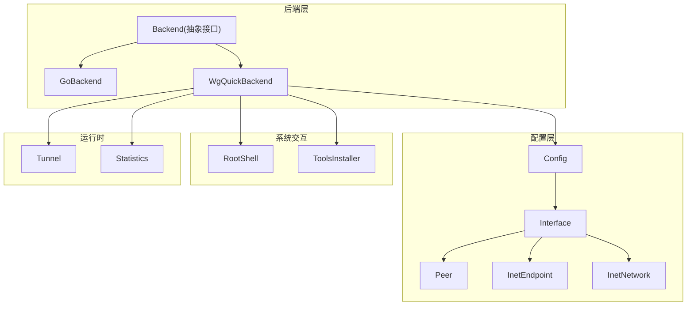
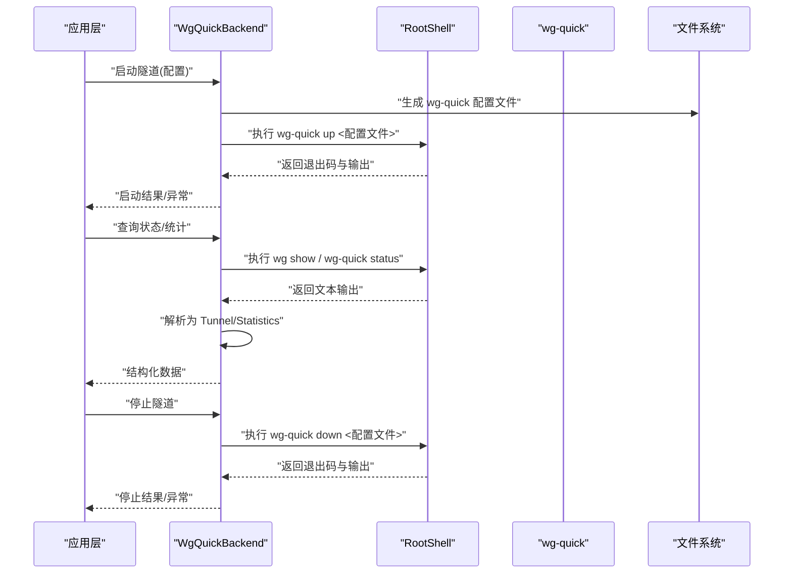
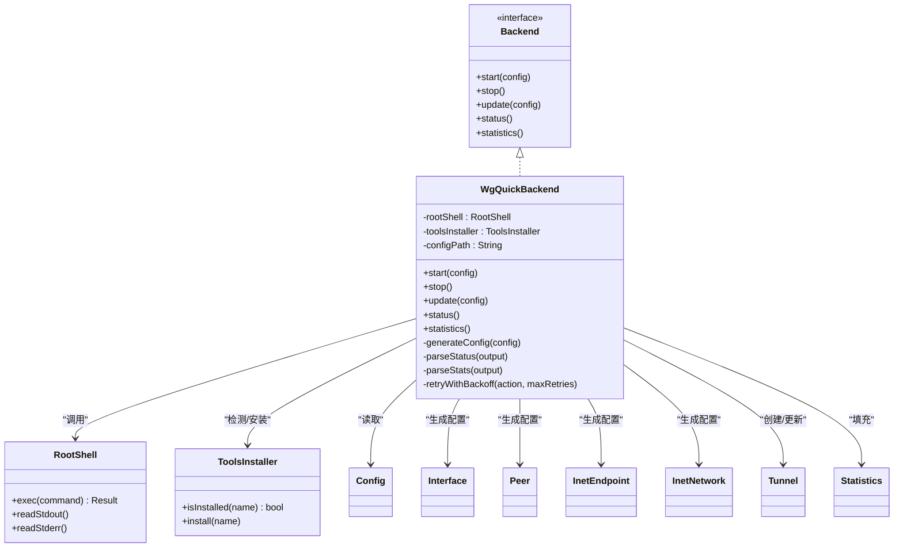
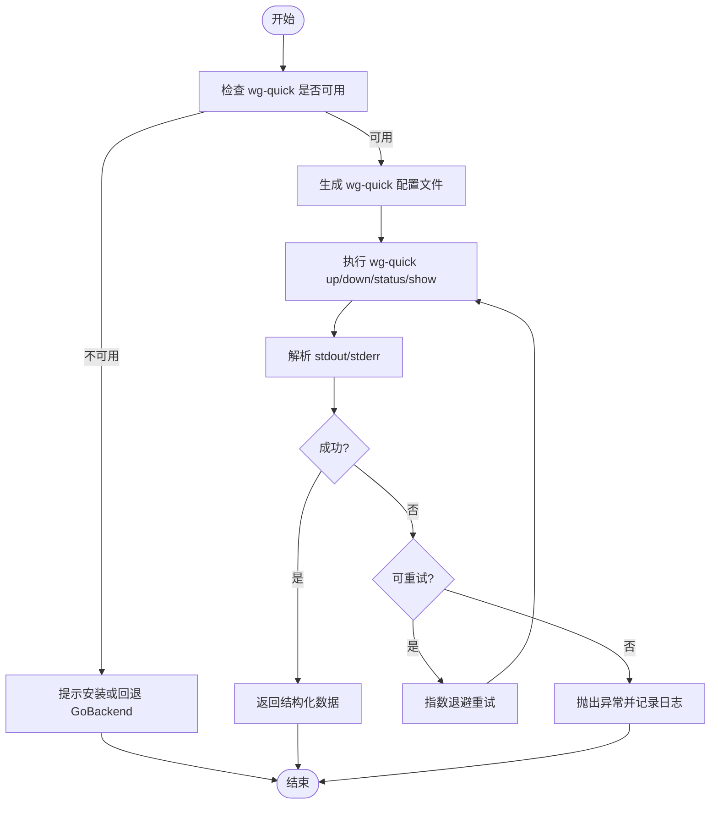
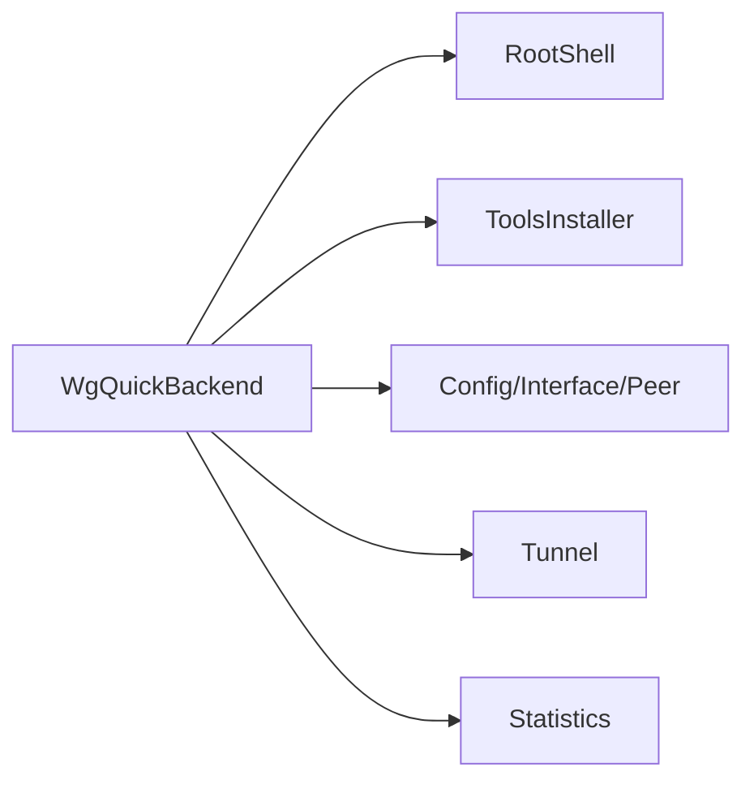

# WgQuickBackend 实现详解

<cite>
**本文引用的文件**   
- [WgQuickBackend.java](file://tunnel/src/main/java/com/wireguard/android/backend/WgQuickBackend.java)
- [GoBackend.java](file://tunnel/src/main/java/com/wireguard/android/backend/GoBackend.java)
- [Backend.java](file://tunnel/src/main/java/com/wireguard/android/backend/Backend.java)
- [RootShell.java](file://tunnel/src/main/java/com/wireguard/android/util/RootShell.java)
- [ToolsInstaller.java](file://tunnel/src/main/java/com/wireguard/android/util/ToolsInstaller.java)
- [Config.java](file://tunnel/src/main/java/com/wireguard/config/Config.java)
- [Interface.java](file://tunnel/src/main/java/com/wireguard/config/Interface.java)
- [Peer.java](file://tunnel/src/main/java/com/wireguard/config/Peer.java)
- [InetEndpoint.java](file://tunnel/src/main/java/com/wireguard/config/InetEndpoint.java)
- [InetNetwork.java](file://tunnel/src/main/java/com/wireguard/config/InetNetwork.java)
- [Tunnel.java](file://tunnel/src/main/java/com/wireguard/android/backend/Tunnel.java)
- [Statistics.java](file://tunnel/src/main/java/com/wireguard/android/backend/Statistics.java)
</cite>

## 目录
1. [简介](#简介)
2. [项目结构](#项目结构)
3. [核心组件](#核心组件)
4. [架构总览](#架构总览)
5. [详细组件分析](#详细组件分析)
6. [依赖关系分析](#依赖关系分析)
7. [性能考量](#性能考量)
8. [故障排除指南](#故障排除指南)
9. [结论](#结论)
10. [附录](#附录)

## 简介
本文件面向 WireGuard Android 中的 WgQuickBackend 实现，系统性阐述其基于 wg-quick 工具的工作方式：包括命令行调用、输出解析、配置文件生成与参数映射、进程管理与生命周期控制、错误处理与重试策略，以及与 GoBackend 的对比、配置优化建议、权限与沙箱兼容性、日志与调试方法。目标是帮助开发者快速理解并高效维护该后端实现。

## 项目结构
WgQuickBackend 位于 tunnel 模块的 Android Java 代码中，围绕 Backend 抽象接口实现，通过 RootShell 执行系统命令（wg-quick），并使用 Config/Interface/Peer 等配置模型生成 wg-quick 兼容的配置文件。关键路径如下：
- 后端实现：tunnel/src/main/java/com/wireguard/android/backend/WgQuickBackend.java
- 抽象接口与其他后端：Backend.java、GoBackend.java
- 系统命令执行：RootShell.java
- 工具安装与检测：ToolsInstaller.java
- 配置模型：Config.java、Interface.java、Peer.java、InetEndpoint.java、InetNetwork.java
- 隧道与统计：Tunnel.java、Statistics.java

图表来源
- [WgQuickBackend.java](file://tunnel/src/main/java/com/wireguard/android/backend/WgQuickBackend.java)
- [GoBackend.java](file://tunnel/src/main/java/com/wireguard/android/backend/GoBackend.java)
- [Backend.java](file://tunnel/src/main/java/com/wireguard/android/backend/Backend.java)
- [RootShell.java](file://tunnel/src/main/java/com/wireguard/android/util/RootShell.java)
- [ToolsInstaller.java](file://tunnel/src/main/java/com/wireguard/android/util/ToolsInstaller.java)
- [Config.java](file://tunnel/src/main/java/com/wireguard/config/Config.java)
- [Interface.java](file://tunnel/src/main/java/com/wireguard/config/Interface.java)
- [Peer.java](file://tunnel/src/main/java/com/wireguard/config/Peer.java)
- [InetEndpoint.java](file://tunnel/src/main/java/com/wireguard/config/InetEndpoint.java)
- [InetNetwork.java](file://tunnel/src/main/java/com/wireguard/config/InetNetwork.java)
- [Tunnel.java](file://tunnel/src/main/java/com/wireguard/android/backend/Tunnel.java)
- [Statistics.java](file://tunnel/src/main/java/com/wireguard/android/backend/Statistics.java)

章节来源
- [WgQuickBackend.java](file://tunnel/src/main/java/com/wireguard/android/backend/WgQuickBackend.java)
- [Backend.java](file://tunnel/src/main/java/com/wireguard/android/backend/Backend.java)
- [RootShell.java](file://tunnel/src/main/java/com/wireguard/android/util/RootShell.java)
- [ToolsInstaller.java](file://tunnel/src/main/java/com/wireguard/android/util/ToolsInstaller.java)
- [Config.java](file://tunnel/src/main/java/com/wireguard/config/Config.java)
- [Interface.java](file://tunnel/src/main/java/com/wireguard/config/Interface.java)
- [Peer.java](file://tunnel/src/main/java/com/wireguard/config/Peer.java)
- [InetEndpoint.java](file://tunnel/src/main/java/com/wireguard/config/InetEndpoint.java)
- [InetNetwork.java](file://tunnel/src/main/java/com/wireguard/config/InetNetwork.java)
- [Tunnel.java](file://tunnel/src/main/java/com/wireguard/android/backend/Tunnel.java)
- [Statistics.java](file://tunnel/src/main/java/com/wireguard/android/backend/Statistics.java)

## 核心组件
- WgQuickBackend：基于 wg-quick 的后端实现，负责将配置转换为 wg-quick 兼容格式，调用系统命令管理隧道生命周期，解析状态与统计信息。
- RootShell：封装 root 权限下的 shell 执行能力，用于运行 wg-quick 和查询内核状态。
- ToolsInstaller：检测并安装必要的系统工具（如 wg、wg-quick）。
- 配置模型：Config/Interface/Peer/InetEndpoint/InetNetwork 提供结构化配置数据，WgQuickBackend 将其序列化为 wg-quick 配置文件。
- Tunnel/Statistics：表示隧道实例与统计数据，供上层 UI 或业务逻辑使用。

章节来源
- [WgQuickBackend.java](file://tunnel/src/main/java/com/wireguard/android/backend/WgQuickBackend.java)
- [RootShell.java](file://tunnel/src/main/java/com/wireguard/android/util/RootShell.java)
- [ToolsInstaller.java](file://tunnel/src/main/java/com/wireguard/android/util/ToolsInstaller.java)
- [Config.java](file://tunnel/src/main/java/com/wireguard/config/Config.java)
- [Interface.java](file://tunnel/src/main/java/com/wireguard/config/Interface.java)
- [Peer.java](file://tunnel/src/main/java/com/wireguard/config/Peer.java)
- [InetEndpoint.java](file://tunnel/src/main/java/com/wireguard/config/InetEndpoint.java)
- [InetNetwork.java](file://tunnel/src/main/java/com/wireguard/config/InetNetwork.java)
- [Tunnel.java](file://tunnel/src/main/java/com/wireguard/android/backend/Tunnel.java)
- [Statistics.java](file://tunnel/src/main/java/com/wireguard/android/backend/Statistics.java)

## 架构总览
WgQuickBackend 作为 Backend 接口的一个实现，向上暴露统一的隧道操作（启动、停止、更新、查询状态/统计），向下通过 RootShell 调用 wg-quick 工具，并读写 wg-quick 配置文件。整体流程如下：

图表来源
- [WgQuickBackend.java](file://tunnel/src/main/java/com/wireguard/android/backend/WgQuickBackend.java)
- [RootShell.java](file://tunnel/src/main/java/com/wireguard/android/util/RootShell.java)

章节来源
- [WgQuickBackend.java](file://tunnel/src/main/java/com/wireguard/android/backend/WgQuickBackend.java)
- [RootShell.java](file://tunnel/src/main/java/com/wireguard/android/util/RootShell.java)

## 详细组件分析

### WgQuickBackend 类职责与行为
- 配置生成：将 Config/Interface/Peer 等对象序列化为 wg-quick 兼容的 .conf 文件，确保字段映射正确（如监听端口、私钥、对等体公钥、允许 IP、DNS、MTU、持久保持等）。
- 命令调用：通过 RootShell 执行 wg-quick up/down/status/show 等命令，捕获标准输出与错误流，进行解析。
- 状态与统计：解析 wg show 的输出，提取发送/接收字节数、握手次数、最近握手时间等，填充 Statistics。
- 生命周期：管理隧道的启动、停止、重启；在失败时进行有限次重试，记录错误原因。
- 权限与工具：检查 wg-quick 是否存在且可执行，必要时提示安装或回退到 GoBackend。

图表来源
- [WgQuickBackend.java](file://tunnel/src/main/java/com/wireguard/android/backend/WgQuickBackend.java)
- [Backend.java](file://tunnel/src/main/java/com/wireguard/android/backend/Backend.java)
- [RootShell.java](file://tunnel/src/main/java/com/wireguard/android/util/RootShell.java)
- [ToolsInstaller.java](file://tunnel/src/main/java/com/wireguard/android/util/ToolsInstaller.java)
- [Config.java](file://tunnel/src/main/java/com/wireguard/config/Config.java)
- [Interface.java](file://tunnel/src/main/java/com/wireguard/config/Interface.java)
- [Peer.java](file://tunnel/src/main/java/com/wireguard/config/Peer.java)
- [InetEndpoint.java](file://tunnel/src/main/java/com/wireguard/config/InetEndpoint.java)
- [InetNetwork.java](file://tunnel/src/main/java/com/wireguard/config/InetNetwork.java)
- [Tunnel.java](file://tunnel/src/main/java/com/wireguard/android/backend/Tunnel.java)
- [Statistics.java](file://tunnel/src/main/java/com/wireguard/android/backend/Statistics.java)

章节来源
- [WgQuickBackend.java](file://tunnel/src/main/java/com/wireguard/android/backend/WgQuickBackend.java)
- [Backend.java](file://tunnel/src/main/java/com/wireguard/android/backend/Backend.java)
- [RootShell.java](file://tunnel/src/main/java/com/wireguard/android/util/RootShell.java)
- [ToolsInstaller.java](file://tunnel/src/main/java/com/wireguard/android/util/ToolsInstaller.java)
- [Config.java](file://tunnel/src/main/java/com/wireguard/config/Config.java)
- [Interface.java](file://tunnel/src/main/java/com/wireguard/config/Interface.java)
- [Peer.java](file://tunnel/src/main/java/com/wireguard/config/Peer.java)
- [InetEndpoint.java](file://tunnel/src/main/java/com/wireguard/config/InetEndpoint.java)
- [InetNetwork.java](file://tunnel/src/main/java/com/wireguard/config/InetNetwork.java)
- [Tunnel.java](file://tunnel/src/main/java/com/wireguard/android/backend/Tunnel.java)
- [Statistics.java](file://tunnel/src/main/java/com/wireguard/android/backend/Statistics.java)

### 配置文件生成机制与参数映射
- 生成目标：wg-quick 兼容的 .conf 文件，包含 [Interface] 与多个 [Peer] 段。
- 关键字段映射：
  - 监听端口：Interface.ListenPort -> ListenPort
  - 私钥：Interface.PrivateKey -> PrivateKey
  - 对等体：Peer.PublicKey -> PublicKey，Peer.PresharedKey -> PresharedKey（可选）
  - 允许 IP：Peer.AllowedIPs -> AllowedIPs（支持多网段）
  - DNS：Interface.DNS -> DNS（逗号分隔）
  - MTU：Interface.MTU -> MTU
  - 持久保持：Interface.PersistentKeepalive -> PersistentKeepalive
- 生成策略：
  - 校验必填字段（如 PrivateKey、至少一个 Peer）
  - 规范化网络地址（IPv4/IPv6）
  - 去重与排序（AllowedIPs、DNS）
  - 写入临时文件或固定路径，保证原子性与可恢复性

章节来源
- [Config.java](file://tunnel/src/main/java/com/wireguard/config/Config.java)
- [Interface.java](file://tunnel/src/main/java/com/wireguard/config/Interface.java)
- [Peer.java](file://tunnel/src/main/java/com/wireguard/config/Peer.java)
- [InetEndpoint.java](file://tunnel/src/main/java/com/wireguard/config/InetEndpoint.java)
- [InetNetwork.java](file://tunnel/src/main/java/com/wireguard/config/InetNetwork.java)
- [WgQuickBackend.java](file://tunnel/src/main/java/com/wireguard/android/backend/WgQuickBackend.java)

### 命令行工具调用与输出解析
- 常用命令：
  - wg-quick up <配置文件>：启动隧道
  - wg-quick down <配置文件>：停止隧道
  - wg show：显示当前所有隧道状态
  - wg-quick status <配置文件>：显示指定隧道状态
- 输出解析：
  - 从 wg show 解析接口名称、对等体公钥、发送/接收字节、握手计数、最近握手时间
  - 从 wg-quick status 解析连接状态、对等体可达性
- 错误处理：
  - 非零退出码视为失败，记录 stderr 输出
  - 常见错误：权限不足、工具缺失、配置文件语法错误、端口冲突

图表来源
- [WgQuickBackend.java](file://tunnel/src/main/java/com/wireguard/android/backend/WgQuickBackend.java)
- [RootShell.java](file://tunnel/src/main/java/com/wireguard/android/util/RootShell.java)
- [ToolsInstaller.java](file://tunnel/src/main/java/com/wireguard/android/util/ToolsInstaller.java)

章节来源
- [WgQuickBackend.java](file://tunnel/src/main/java/com/wireguard/android/backend/WgQuickBackend.java)
- [RootShell.java](file://tunnel/src/main/java/com/wireguard/android/util/RootShell.java)
- [ToolsInstaller.java](file://tunnel/src/main/java/com/wireguard/android/util/ToolsInstaller.java)

### 进程管理与生命周期控制
- 启动流程：生成配置 -> 调用 wg-quick up -> 等待就绪 -> 轮询状态确认
- 停止流程：调用 wg-quick down -> 清理资源 -> 确认接口移除
- 重启流程：先 down 再 up，或在某些场景下直接 reload（取决于系统支持）
- 监控与自愈：周期性检查隧道状态，若异常则自动尝试重启（受最大重试次数限制）

章节来源
- [WgQuickBackend.java](file://tunnel/src/main/java/com/wireguard/android/backend/WgQuickBackend.java)
- [RootShell.java](file://tunnel/src/main/java/com/wireguard/android/util/RootShell.java)

### 错误处理与重试机制
- 错误分类：
  - 环境错误：缺少 wg-quick、权限不足
  - 配置错误：语法错误、字段缺失、非法值
  - 运行时错误：端口占用、路由冲突、内核不支持
- 重试策略：
  - 指数退避（初始延迟、最大延迟、最大重试次数）
  - 针对瞬时错误（如端口短暂占用）有效
- 降级策略：
  - 当 wg-quick 不可用时，提示用户安装或切换到 GoBackend

章节来源
- [WgQuickBackend.java](file://tunnel/src/main/java/com/wireguard/android/backend/WgQuickBackend.java)
- [ToolsInstaller.java](file://tunnel/src/main/java/com/wireguard/android/util/ToolsInstaller.java)

### 与系统权限和沙箱环境的兼容性
- 权限需求：需要 root 或具备修改网络命名空间的能力以运行 wg-quick
- 沙箱限制：受限环境中可能无法执行系统命令或访问网络接口，需提前检测并给出友好提示
- 兼容性处理：
  - 检测工具存在性与可执行性
  - 检测当前用户权限
  - 在不可用环境下回退到 GoBackend 或提示用户授权

章节来源
- [RootShell.java](file://tunnel/src/main/java/com/wireguard/android/util/RootShell.java)
- [ToolsInstaller.java](file://tunnel/src/main/java/com/wireguard/android/util/ToolsInstaller.java)
- [WgQuickBackend.java](file://tunnel/src/main/java/com/wireguard/android/backend/WgQuickBackend.java)

### 日志记录与调试方法
- 日志级别：
  - 信息：启动/停止/更新操作
  - 警告：重试、降级、工具缺失
  - 错误：命令失败、配置错误、权限不足
- 调试技巧：
  - 启用详细日志，捕获 wg-quick 的 stdout/stderr
  - 导出配置文件进行离线验证
  - 使用 wg show 手动核对状态
  - 逐步缩小问题范围（仅 Interface、逐个添加 Peer）

章节来源
- [WgQuickBackend.java](file://tunnel/src/main/java/com/wireguard/android/backend/WgQuickBackend.java)
- [RootShell.java](file://tunnel/src/main/java/com/wireguard/android/util/RootShell.java)

## 依赖关系分析
WgQuickBackend 依赖以下组件：
- RootShell：执行系统命令
- ToolsInstaller：检测与安装 wg-quick
- 配置模型：生成 wg-quick 配置文件
- Tunnel/Statistics：表示运行时状态与统计数据

图表来源
- [WgQuickBackend.java](file://tunnel/src/main/java/com/wireguard/android/backend/WgQuickBackend.java)
- [RootShell.java](file://tunnel/src/main/java/com/wireguard/android/util/RootShell.java)
- [ToolsInstaller.java](file://tunnel/src/main/java/com/wireguard/android/util/ToolsInstaller.java)
- [Config.java](file://tunnel/src/main/java/com/wireguard/config/Config.java)
- [Interface.java](file://tunnel/src/main/java/com/wireguard/config/Interface.java)
- [Peer.java](file://tunnel/src/main/java/com/wireguard/config/Peer.java)
- [Tunnel.java](file://tunnel/src/main/java/com/wireguard/android/backend/Tunnel.java)
- [Statistics.java](file://tunnel/src/main/java/com/wireguard/android/backend/Statistics.java)

章节来源
- [WgQuickBackend.java](file://tunnel/src/main/java/com/wireguard/android/backend/WgQuickBackend.java)
- [RootShell.java](file://tunnel/src/main/java/com/wireguard/android/util/RootShell.java)
- [ToolsInstaller.java](file://tunnel/src/main/java/com/wireguard/android/util/ToolsInstaller.java)
- [Config.java](file://tunnel/src/main/java/com/wireguard/config/Config.java)
- [Interface.java](file://tunnel/src/main/java/com/wireguard/config/Interface.java)
- [Peer.java](file://tunnel/src/main/java/com/wireguard/config/Peer.java)
- [Tunnel.java](file://tunnel/src/main/java/com/wireguard/android/backend/Tunnel.java)
- [Statistics.java](file://tunnel/src/main/java/com/wireguard/android/backend/Statistics.java)

## 性能考量
- 进程开销：每次操作都涉及子进程创建与 IO，相比 GoBackend 的 JNI 调用有额外开销
- I/O 瓶颈：频繁读写配置文件与解析文本输出会影响性能
- 并发与锁：避免重复启动/停止导致的竞争条件，需加锁保护
- 优化建议：
  - 批量更新配置，减少多次磁盘写入
  - 缓存状态查询结果，降低频繁调用 wg show
  - 合理设置重试间隔与上限，避免雪崩

章节来源
- [WgQuickBackend.java](file://tunnel/src/main/java/com/wireguard/android/backend/WgQuickBackend.java)
- [GoBackend.java](file://tunnel/src/main/java/com/wireguard/android/backend/GoBackend.java)

## 故障排除指南
常见问题与解决步骤：
- 无法启动隧道：
  - 检查 wg-quick 是否安装且可执行
  - 查看生成的配置文件是否正确（字段完整、语法合法）
  - 检查权限（root）与 SELinux/AppArmor 限制
- 状态异常：
  - 使用 wg show 核对接口与对等体状态
  - 检查防火墙规则与路由表
- 统计不更新：
  - 确认 wg show 输出正常
  - 检查解析逻辑是否匹配系统版本差异

章节来源
- [WgQuickBackend.java](file://tunnel/src/main/java/com/wireguard/android/backend/WgQuickBackend.java)
- [RootShell.java](file://tunnel/src/main/java/com/wireguard/android/util/RootShell.java)
- [ToolsInstaller.java](file://tunnel/src/main/java/com/wireguard/android/util/ToolsInstaller.java)

## 结论
WgQuickBackend 通过 wg-quick 工具实现了稳定可靠的 WireGuard 隧道管理，适合大多数 Android 设备环境。其优势在于与系统原生工具一致的行为与良好的兼容性；劣势在于进程与 I/O 开销较大。在高吞吐或低延迟场景中，GoBackend 更具优势。实际部署应根据设备能力、权限环境与性能需求选择合适的后端。

## 附录
- 配置优化建议：
  - 合理设置 MTU（通常 1420-1450）
  - 启用 PersistentKeepalive 以穿越 NAT
  - 精简 AllowedIPs，避免不必要的路由
- 调试方法：
  - 启用详细日志，捕获 wg-quick 输出
  - 导出配置文件进行离线验证
  - 使用 wg show 手动核对状态