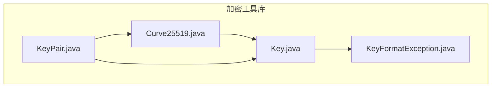
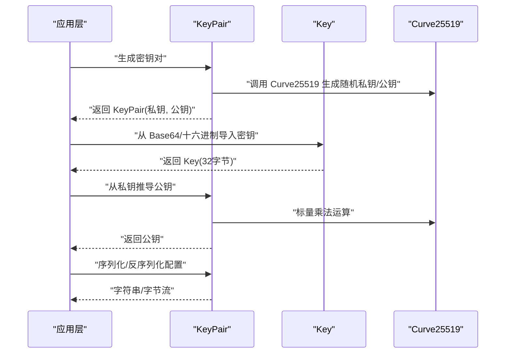
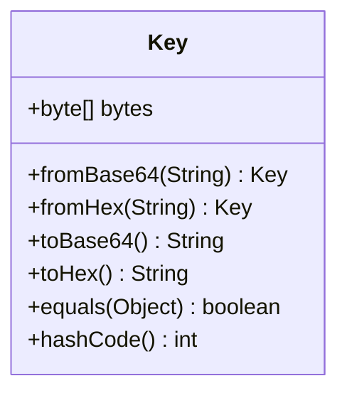
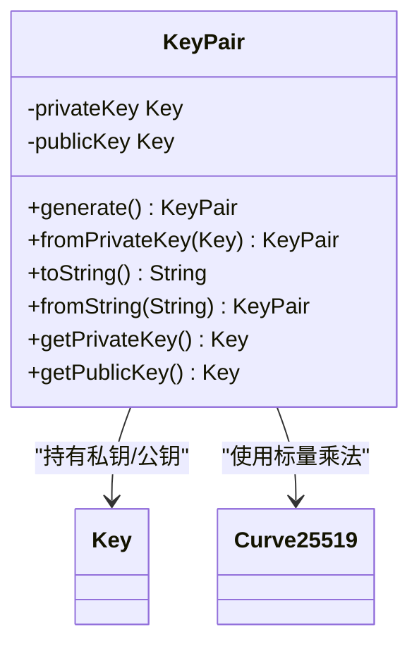
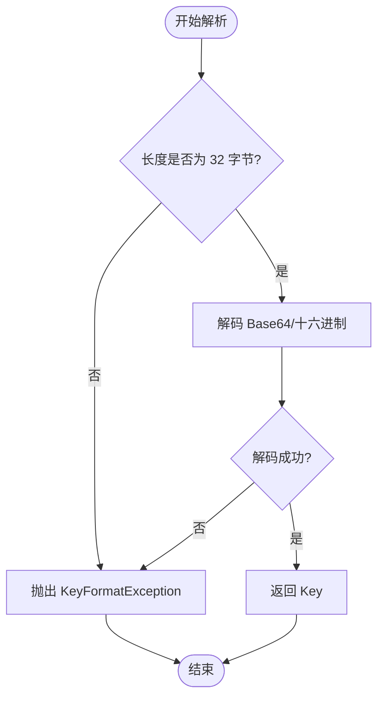
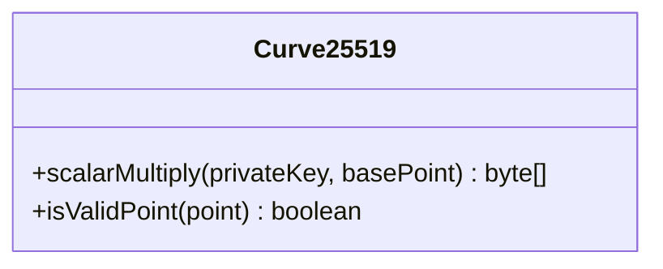
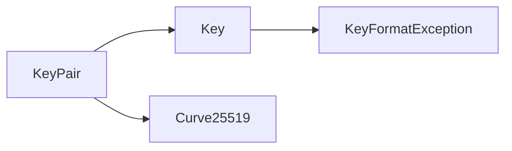
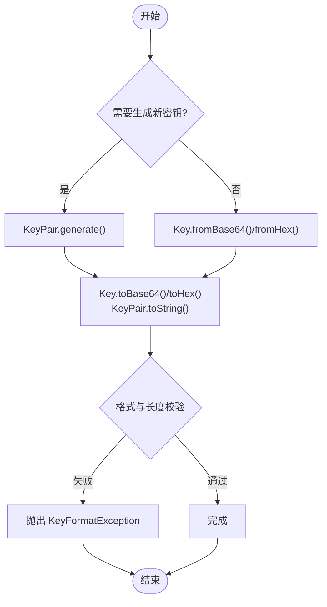

# 加密工具库

<cite>
**本文引用的文件**   
- [Curve25519.java](file://tunnel/src/main/java/com/wireguard/crypto/Curve25519.java)
- [Key.java](file://tunnel/src/main/java/com/wireguard/crypto/Key.java)
- [KeyPair.java](file://tunnel/src/main/java/com/wireguard/crypto/KeyPair.java)
- [KeyFormatException.java](file://tunnel/src/main/java/com/wireguard/crypto/KeyFormatException.java)
</cite>

## 目录
1. [简介](#简介)
2. [项目结构](#项目结构)
3. [核心组件](#核心组件)
4. [架构总览](#架构总览)
5. [详细组件分析](#详细组件分析)
6. [依赖关系分析](#依赖关系分析)
7. [性能考虑](#性能考虑)
8. [故障排查指南](#故障排查指南)
9. [结论](#结论)
10. [附录](#附录)

## 简介
本技术文档聚焦于 WireGuard Android 中的加密工具库，围绕 Curve25519 椭圆曲线密码学算法的实现与应用展开。文档重点说明 Key、KeyPair、KeyFormatException 等核心类的设计与使用方式，覆盖密钥的生成、导入、导出与验证流程，提供格式转换与编码解码示例，并给出安全最佳实践、性能优化建议与测试方法。同时解释与 WireGuard 协议在加密要求上的兼容性。

## 项目结构
加密相关代码位于 tunnel 模块的 com.wireguard.crypto 包中，包含以下关键文件：
- Curve25519.java：Curve25519 算法封装与操作入口
- Key.java：32 字节密钥表示与编解码接口
- KeyPair.java：私钥/公钥对管理与生成
- KeyFormatException.java：密钥解析异常类型

图表来源
- [Curve25519.java](file://tunnel/src/main/java/com/wireguard/crypto/Curve25519.java)
- [Key.java](file://tunnel/src/main/java/com/wireguard/crypto/Key.java)
- [KeyPair.java](file://tunnel/src/main/java/com/wireguard/crypto/KeyPair.java)
- [KeyFormatException.java](file://tunnel/src/main/java/com/wireguard/crypto/KeyFormatException.java)

章节来源
- [Curve25519.java](file://tunnel/src/main/java/com/wireguard/crypto/Curve25519.java)
- [Key.java](file://tunnel/src/main/java/com/wireguard/crypto/Key.java)
- [KeyPair.java](file://tunnel/src/main/java/com/wireguard/crypto/KeyPair.java)
- [KeyFormatException.java](file://tunnel/src/main/java/com/wireguard/crypto/KeyFormatException.java)

## 核心组件
- Curve25519：提供基于 Curve25519 的标量乘法（如 DH 共享密钥计算）等底层能力，供上层密钥操作调用。
- Key：以固定长度字节数组表示 32 字节的密钥，提供从 Base64/十六进制字符串导入、导出为字符串、以及内部字节访问等方法。
- KeyPair：管理私钥与公钥对，支持随机生成、从私钥推导公钥、序列化为配置文本或字节串、以及从配置文本或字节串反序列化。
- KeyFormatException：用于描述密钥格式不合法、长度不符、Base64 解码失败等解析错误。

章节来源
- [Curve25519.java](file://tunnel/src/main/java/com/wireguard/crypto/Curve25519.java)
- [Key.java](file://tunnel/src/main/java/com/wireguard/crypto/Key.java)
- [KeyPair.java](file://tunnel/src/main/java/com/wireguard/crypto/KeyPair.java)
- [KeyFormatException.java](file://tunnel/src/main/java/com/wireguard/crypto/KeyFormatException.java)

## 架构总览
下图展示了密钥生命周期与主要交互：应用层通过 KeyPair 生成或导入密钥，Key 负责统一表示与编解码，Curve25519 提供密码学原语；异常由 KeyFormatException 集中表达。

图表来源
- [KeyPair.java](file://tunnel/src/main/java/com/wireguard/crypto/KeyPair.java)
- [Key.java](file://tunnel/src/main/java/com/wireguard/crypto/Key.java)
- [Curve25519.java](file://tunnel/src/main/java/com/wireguard/crypto/Curve25519.java)

## 详细组件分析

### Key 类：密钥表示与操作接口
- 数据模型：内部以固定长度的字节数组存储 32 字节密钥。
- 导入：支持从 Base64 和十六进制字符串解析为 Key；若长度不为 32 字节或编码非法，抛出 KeyFormatException。
- 导出：将密钥转换为 Base64 或十六进制字符串，便于配置与传输。
- 访问：提供只读字节数组访问，避免外部修改。
- 比较与哈希：实现相等性比较与哈希，便于集合存储与查找。

图表来源
- [Key.java](file://tunnel/src/main/java/com/wireguard/crypto/Key.java)

章节来源
- [Key.java](file://tunnel/src/main/java/com/wireguard/crypto/Key.java)

### KeyPair 类：密钥对生成与管理
- 生成：随机生成符合 Curve25519 要求的私钥，并通过 Curve25519 计算对应公钥。
- 推导：给定私钥，可推导出公钥。
- 序列化：将私钥与公钥按 WireGuard 规范序列化为字符串或字节流。
- 反序列化：从字符串或字节流恢复密钥对，校验长度与格式，非法时抛出 KeyFormatException。
- 安全：避免直接暴露私钥字节数组的可写引用，必要时进行拷贝。

图表来源
- [KeyPair.java](file://tunnel/src/main/java/com/wireguard/crypto/KeyPair.java)
- [Curve25519.java](file://tunnel/src/main/java/com/wireguard/crypto/Curve25519.java)

章节来源
- [KeyPair.java](file://tunnel/src/main/java/com/wireguard/crypto/KeyPair.java)
- [Curve25519.java](file://tunnel/src/main/java/com/wireguard/crypto/Curve25519.java)

### KeyFormatException：异常处理策略
- 触发场景：密钥长度非 32 字节、Base64/十六进制编码非法、配置文本缺失关键字段等。
- 设计目标：向上层提供明确的解析失败原因，便于日志记录与用户提示。
- 使用建议：在导入/反序列化路径捕获该异常，区分“格式错误”与“其他运行时错误”。

图表来源
- [Key.java](file://tunnel/src/main/java/com/wireguard/crypto/Key.java)
- [KeyFormatException.java](file://tunnel/src/main/java/com/wireguard/crypto/KeyFormatException.java)

章节来源
- [Key.java](file://tunnel/src/main/java/com/wireguard/crypto/Key.java)
- [KeyFormatException.java](file://tunnel/src/main/java/com/wireguard/crypto/KeyFormatException.java)

### Curve25519：算法封装与调用
- 职责：封装 Curve25519 的标量乘法等原语，供 KeyPair 生成公钥、执行 DH 等操作。
- 输入输出：以 32 字节数组作为输入输出，严格遵循 Curve25519 规范。
- 安全性：确保输入点合法性与常量时间操作（由底层实现保证），避免侧信道泄露。

图表来源
- [Curve25519.java](file://tunnel/src/main/java/com/wireguard/crypto/Curve25519.java)

章节来源
- [Curve25519.java](file://tunnel/src/main/java/com/wireguard/crypto/Curve25519.java)

## 依赖关系分析
- KeyPair 依赖 Key 与 Curve25519：前者提供统一密钥表示，后者提供密码学原语。
- Key 依赖 KeyFormatException：在解析失败时抛出异常。
- 整体耦合度低，职责清晰，便于单元测试与替换底层实现。

图表来源
- [KeyPair.java](file://tunnel/src/main/java/com/wireguard/crypto/KeyPair.java)
- [Key.java](file://tunnel/src/main/java/com/wireguard/crypto/Key.java)
- [Curve25519.java](file://tunnel/src/main/java/com/wireguard/crypto/Curve25519.java)
- [KeyFormatException.java](file://tunnel/src/main/java/com/wireguard/crypto/KeyFormatException.java)

章节来源
- [KeyPair.java](file://tunnel/src/main/java/com/wireguard/crypto/KeyPair.java)
- [Key.java](file://tunnel/src/main/java/com/wireguard/crypto/Key.java)
- [Curve25519.java](file://tunnel/src/main/java/com/wireguard/crypto/Curve25519.java)
- [KeyFormatException.java](file://tunnel/src/main/java/com/wireguard/crypto/KeyFormatException.java)

## 性能考虑
- 内存分配：避免在高频路径重复创建临时字节数组；复用缓冲对象可降低 GC 压力。
- 编解码开销：Base64/十六进制编解码应批量处理，减少方法调用与中间对象。
- 常量时间：敏感操作（如比较、解密）尽量采用常量时间实现，防止时序攻击。
- I/O 优化：序列化/反序列化大对象时，优先使用流式处理，避免一次性加载到内存。

[本节为通用指导，无需特定文件来源]

## 故障排查指南
- 常见错误
  - 密钥长度不是 32 字节：检查导入源是否截断或填充错误。
  - Base64/十六进制编码非法：确认字符集与换行符处理是否符合预期。
  - 私钥无效：确保私钥满足 Curve25519 的位掩码要求（如低位清零、高位设置）。
- 定位步骤
  - 捕获 KeyFormatException，打印原始输入与期望长度。
  - 使用最小化用例复现问题，逐步缩小范围。
  - 核对 WireGuard 配置字段名称与大小写。
- 修复建议
  - 规范化输入（去除空白、统一大小写）。
  - 增加前置校验（长度、字符集、位掩码）。
  - 完善日志上下文（输入摘要、错误位置）。

章节来源
- [Key.java](file://tunnel/src/main/java/com/wireguard/crypto/Key.java)
- [KeyPair.java](file://tunnel/src/main/java/com/wireguard/crypto/KeyPair.java)
- [KeyFormatException.java](file://tunnel/src/main/java/com/wireguard/crypto/KeyFormatException.java)

## 结论
本加密工具库以 Key、KeyPair、Curve25519 为核心，提供了符合 WireGuard 协议的密钥表示、生成、导入/导出与验证能力。通过 KeyFormatException 统一异常处理，提升了健壮性与可维护性。建议在应用中遵循安全最佳实践与性能优化建议，并结合完善的测试用例保障正确性与稳定性。

[本节为总结性内容，无需特定文件来源]

## 附录

### 密钥生成、导入、导出与验证流程
- 生成
  - 使用 KeyPair.generate() 生成随机私钥与公钥。
  - 通过 Curve25519 确保私钥位掩码与公钥点合法性。
- 导入
  - 使用 Key.fromBase64()/Key.fromHex() 导入 32 字节密钥。
  - 非法输入抛出 KeyFormatException。
- 导出
  - 使用 Key.toBase64()/Key.toHex() 导出字符串。
  - KeyPair.toString() 输出 WireGuard 兼容的配置片段。
- 验证
  - 检查长度与编码合法性。
  - 可选：对公钥点进行曲线合法性校验。

图表来源
- [KeyPair.java](file://tunnel/src/main/java/com/wireguard/crypto/KeyPair.java)
- [Key.java](file://tunnel/src/main/java/com/wireguard/crypto/Key.java)
- [Curve25519.java](file://tunnel/src/main/java/com/wireguard/crypto/Curve25519.java)
- [KeyFormatException.java](file://tunnel/src/main/java/com/wireguard/crypto/KeyFormatException.java)

### 密钥格式转换与编码解码示例（概念性）
- 将 Base64 字符串转为 Key：调用 Key.fromBase64("...")。
- 将 Key 转为十六进制字符串：调用 key.toHex()。
- 从十六进制字符串导入 Key：调用 Key.fromHex("...")。
- 将 KeyPair 序列化为配置文本：调用 keyPair.toString()。
- 从配置文本反序列化 KeyPair：调用 KeyPair.fromString("...")。

[本节为概念性示例，不展示具体代码内容]

### 安全最佳实践与防护措施
- 使用安全的随机源生成私钥，避免弱熵。
- 对私钥进行位掩码处理，确保符合 Curve25519 要求。
- 禁止将私钥明文持久化到不安全位置；如需存储，使用受保护的密钥存储。
- 对外暴露的 API 仅返回必要的只读视图，避免内部字节数组被篡改。
- 对所有输入进行严格校验，拒绝非法长度与编码。
- 日志中避免记录完整密钥，仅记录摘要或占位符。

[本节为通用安全建议，无需特定文件来源]

### 性能优化建议
- 批量处理编解码，减少对象创建。
- 缓存常用结果（如公钥字符串），避免重复计算。
- 在高并发场景下，注意线程安全与锁粒度。
- 使用流式 I/O 处理大配置，降低内存峰值。

[本节为通用性能建议，无需特定文件来源]

### 测试方法
- 单元测试
  - 正向用例：生成密钥对、导入/导出、序列化/反序列化。
  - 反向用例：非法长度、非法编码、缺失字段。
- 边界条件
  - 空字符串、超长字符串、含换行符的 Base64。
  - 首尾空白字符处理。
- 一致性
  - 多次生成相同私钥应得到相同公钥。
  - 序列化后反序列化应与原始一致。
- 性能基准
  - 编解码耗时、内存占用、GC 次数。

[本节为通用测试建议，无需特定文件来源]

### 与 WireGuard 协议的加密要求兼容性
- 密钥长度：所有密钥均为 32 字节。
- 编码格式：Base64 与十六进制均被接受，需遵循标准编码规则。
- 配置文本：KeyPair.toString() 输出符合 WireGuard 配置规范的键值对。
- 曲线选择：Curve25519 为协议指定曲线，确保互操作性。

[本节为协议兼容性说明，无需特定文件来源]