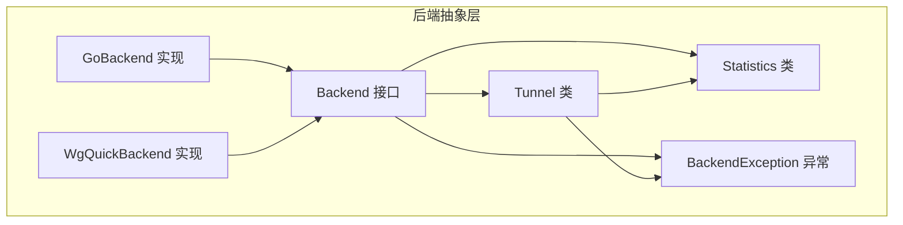
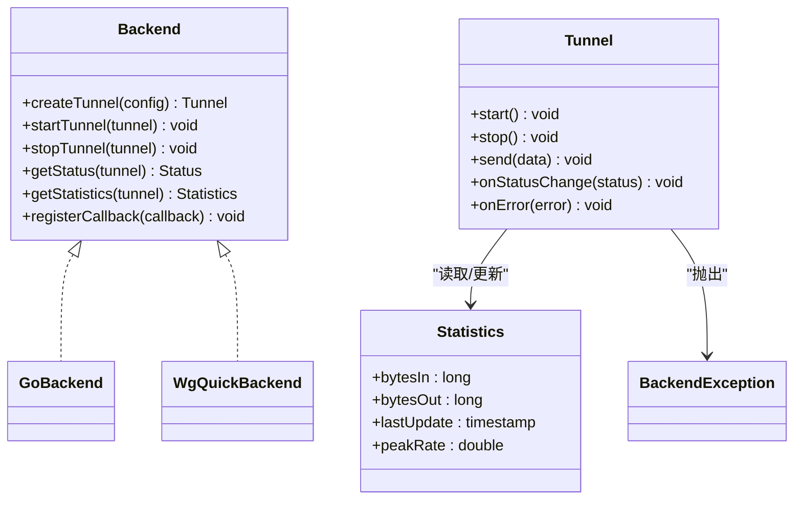
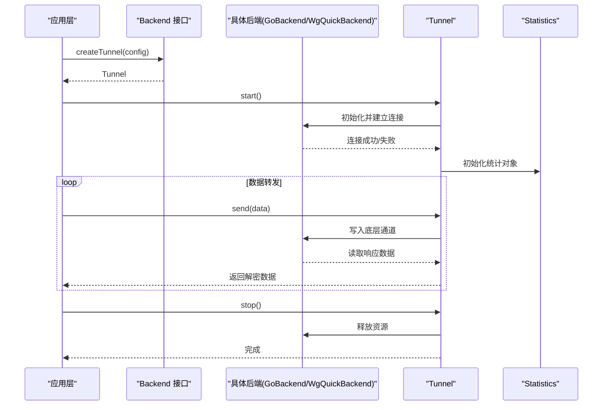
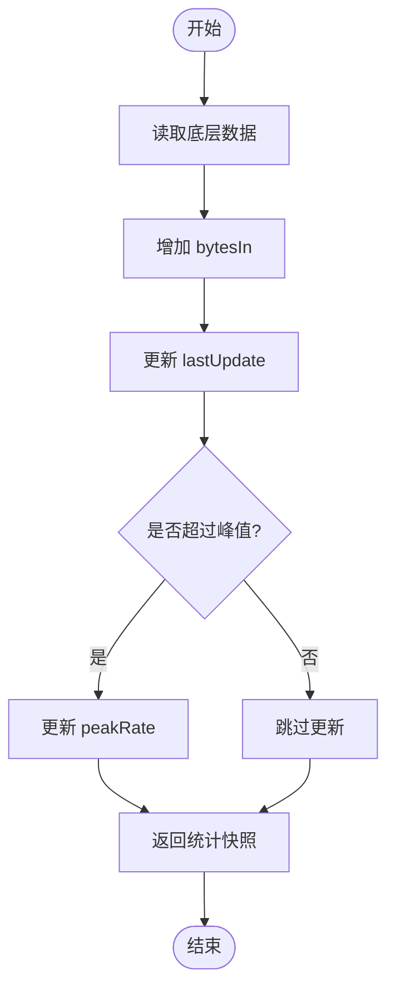
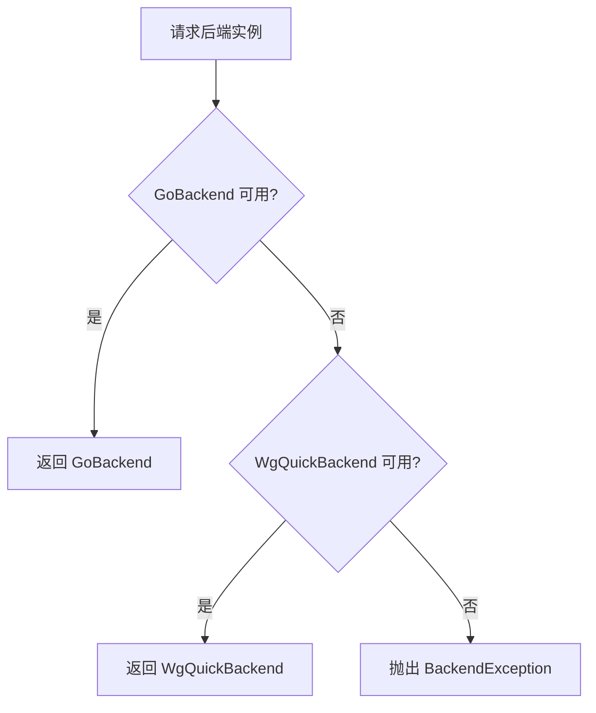
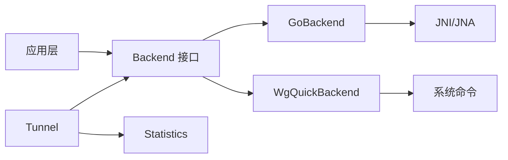

# 后端抽象层架构

<cite>
**本文引用的文件**   
- [Backend.java](file://tunnel/src/main/java/com/wireguard/android/backend/Backend.java)
- [BackendException.java](file://tunnel/src/main/java/com/wireguard/android/backend/BackendException.java)
- [GoBackend.java](file://tunnel/src/main/java/com/wireguard/android/backend/GoBackend.java)
- [Statistics.java](file://tunnel/src/main/java/com/wireguard/android/backend/Statistics.java)
- [Tunnel.java](file://tunnel/src/main/java/com/wireguard/android/backend/Tunnel.java)
- [WgQuickBackend.java](file://tunnel/src/main/java/com/wireguard/android/backend/WgQuickBackend.java)
</cite>

## 目录
1. [简介](#简介)
2. [项目结构](#项目结构)
3. [核心组件](#核心组件)
4. [架构总览](#架构总览)
5. [详细组件分析](#详细组件分析)
6. [依赖关系分析](#依赖关系分析)
7. [性能考量](#性能考量)
8. [故障排查指南](#故障排查指南)
9. [结论](#结论)
10. [附录：接口使用示例与最佳实践](#附录接口使用示例与最佳实践)

## 简介
本技术文档聚焦于 WireGuard Android 的后端抽象层，围绕 Backend 接口、Tunnel 类、Statistics 数据结构以及后端选择策略与工厂模式展开。目标是帮助开发者理解隧道生命周期管理、状态监控、统计信息收集机制，并指导如何扩展自定义后端。

## 项目结构
后端抽象层位于 tunnel 模块的 Java 包 com.wireguard.android.backend 下，包含以下关键文件：
- Backend.java：后端抽象接口，定义隧道创建、启动、停止、状态查询与统计等能力。
- Tunnel.java：隧道实例，封装连接建立、数据转发、错误处理与生命周期回调。
- Statistics.java：统计数据载体，用于记录流量、时间戳等信息。
- GoBackend.java：基于 Go 实现的 WireGuard 后端（通过 JNI/JNA 调用）。
- WgQuickBackend.java：基于 wg-quick 脚本的后端实现。
- BackendException.java：后端异常类型，统一错误传播。

图表来源
- [Backend.java](file://tunnel/src/main/java/com/wireguard/android/backend/Backend.java)
- [Tunnel.java](file://tunnel/src/main/java/com/wireguard/android/backend/Tunnel.java)
- [Statistics.java](file://tunnel/src/main/java/com/wireguard/android/backend/Statistics.java)
- [GoBackend.java](file://tunnel/src/main/java/com/wireguard/android/backend/GoBackend.java)
- [WgQuickBackend.java](file://tunnel/src/main/java/com/wireguard/android/backend/WgQuickBackend.java)
- [BackendException.java](file://tunnel/src/main/java/com/wireguard/android/backend/BackendException.java)

章节来源
- [Backend.java](file://tunnel/src/main/java/com/wireguard/android/backend/Backend.java)
- [Tunnel.java](file://tunnel/src/main/java/com/wireguard/android/backend/Tunnel.java)
- [Statistics.java](file://tunnel/src/main/java/com/wireguard/android/backend/Statistics.java)
- [GoBackend.java](file://tunnel/src/main/java/com/wireguard/android/backend/GoBackend.java)
- [WgQuickBackend.java](file://tunnel/src/main/java/com/wireguard/android/backend/WgQuickBackend.java)
- [BackendException.java](file://tunnel/src/main/java/com/wireguard/android/backend/BackendException.java)

## 核心组件
- Backend 接口：定义后端的统一契约，包括创建/销毁隧道、启动/停止、状态监听、统计获取等。
- Tunnel 类：封装单个隧道的运行期行为，如连接建立、数据转发、错误处理、状态变更通知。
- Statistics 类：承载统计数据的容器，通常包含字节数、时间戳、峰值速率等字段。
- GoBackend/WgQuickBackend：具体后端实现，分别基于 Go 内核库与 wg-quick 工具链。
- BackendException：统一的异常类型，便于上层捕获与处理后端错误。

章节来源
- [Backend.java](file://tunnel/src/main/java/com/wireguard/android/backend/Backend.java)
- [Tunnel.java](file://tunnel/src/main/java/com/wireguard/android/backend/Tunnel.java)
- [Statistics.java](file://tunnel/src/main/java/com/wireguard/android/backend/Statistics.java)
- [GoBackend.java](file://tunnel/src/main/java/com/wireguard/android/backend/GoBackend.java)
- [WgQuickBackend.java](file://tunnel/src/main/java/com/wireguard/android/backend/WgQuickBackend.java)
- [BackendException.java](file://tunnel/src/main/java/com/wireguard/android/backend/BackendException.java)

## 架构总览
后端抽象层将“后端实现”与“上层业务”解耦。上层通过 Backend 接口操作隧道，无需关心底层是 Go 实现还是 wg-quick 脚本。Tunnel 负责单条隧道的生命周期与数据流；Statistics 提供可观测性；BackendException 统一错误模型。

图表来源
- [Backend.java](file://tunnel/src/main/java/com/wireguard/android/backend/Backend.java)
- [Tunnel.java](file://tunnel/src/main/java/com/wireguard/android/backend/Tunnel.java)
- [Statistics.java](file://tunnel/src/main/java/com/wireguard/android/backend/Statistics.java)
- [GoBackend.java](file://tunnel/src/main/java/com/wireguard/android/backend/GoBackend.java)
- [WgQuickBackend.java](file://tunnel/src/main/java/com/wireguard/android/backend/WgQuickBackend.java)
- [BackendException.java](file://tunnel/src/main/java/com/wireguard/android/backend/BackendException.java)

## 详细组件分析

### Backend 接口设计
- 职责划分：
  - 隧道生命周期：创建、启动、停止、销毁。
  - 状态监控：查询当前状态、注册状态回调。
  - 统计信息：获取实时或历史统计数据。
- 设计理念：
  - 以接口为中心，屏蔽不同后端差异。
  - 回调驱动的状态更新，避免轮询开销。
  - 异常统一为 BackendException，简化错误处理。

章节来源
- [Backend.java](file://tunnel/src/main/java/com/wireguard/android/backend/Backend.java)

### Tunnel 类实现机制
- 连接建立：
  - 根据配置初始化底层通道（例如 Go 后端通过 JNI 加载库，wg-quick 通过脚本执行）。
  - 校验网络参数（IP、端口、密钥）并建立对等体连接。
- 数据转发：
  - 接收上层数据包，进行加密/封装后写入底层通道。
  - 从底层通道读取解密后的数据包，回传给上层。
- 错误处理：
  - 捕获底层异常并转换为 BackendException。
  - 触发 onError 回调，通知上层重试或降级。
- 生命周期：
  - start/stop 方法协调底层资源分配与释放。
  - 状态变更通过 onStatusChange 回调上报。

图表来源
- [Tunnel.java](file://tunnel/src/main/java/com/wireguard/android/backend/Tunnel.java)
- [GoBackend.java](file://tunnel/src/main/java/com/wireguard/android/backend/GoBackend.java)
- [WgQuickBackend.java](file://tunnel/src/main/java/com/wireguard/android/backend/WgQuickBackend.java)
- [Statistics.java](file://tunnel/src/main/java/com/wireguard/android/backend/Statistics.java)

章节来源
- [Tunnel.java](file://tunnel/src/main/java/com/wireguard/android/backend/Tunnel.java)

### Statistics 数据结构与更新机制
- 数据结构：
  - bytesIn/bytesOut：累计收发字节数。
  - lastUpdate：最近一次更新时间戳。
  - peakRate：峰值速率（可选），用于性能分析。
- 更新机制：
  - 在数据收发时原子递增计数器。
  - 定时任务或事件回调刷新 lastUpdate。
  - 对外提供只读快照，避免并发问题。

图表来源
- [Statistics.java](file://tunnel/src/main/java/com/wireguard/android/backend/Statistics.java)

章节来源
- [Statistics.java](file://tunnel/src/main/java/com/wireguard/android/backend/Statistics.java)

### 后端选择策略与工厂模式
- 选择策略：
  - 优先尝试 GoBackend（高性能、低延迟）。
  - 若不可用（缺少库或权限不足），回退到 WgQuickBackend。
  - 可通过配置开关强制指定后端。
- 工厂模式：
  - 提供 getBackend(config) 方法，根据环境检测返回具体实现。
  - 隐藏构造细节，便于扩展新后端。

图表来源
- [GoBackend.java](file://tunnel/src/main/java/com/wireguard/android/backend/GoBackend.java)
- [WgQuickBackend.java](file://tunnel/src/main/java/com/wireguard/android/backend/WgQuickBackend.java)
- [BackendException.java](file://tunnel/src/main/java/com/wireguard/android/backend/BackendException.java)

章节来源
- [GoBackend.java](file://tunnel/src/main/java/com/wireguard/android/backend/GoBackend.java)
- [WgQuickBackend.java](file://tunnel/src/main/java/com/wireguard/android/backend/WgQuickBackend.java)
- [BackendException.java](file://tunnel/src/main/java/com/wireguard/android/backend/BackendException.java)

## 依赖关系分析
- 耦合度：
  - Backend 接口与实现解耦，Tunnel 仅依赖接口。
  - Statistics 被 Tunnel 和后端实现共同使用，无循环依赖。
- 外部依赖：
  - GoBackend 依赖 JNI/JNA 调用 Go 库。
  - WgQuickBackend 依赖系统命令（wg-quick）。
- 潜在风险：
  - 后端可用性检测失败需快速回退。
  - 统计更新需保证线程安全。

图表来源
- [Backend.java](file://tunnel/src/main/java/com/wireguard/android/backend/Backend.java)
- [Tunnel.java](file://tunnel/src/main/java/com/wireguard/android/backend/Tunnel.java)
- [Statistics.java](file://tunnel/src/main/java/com/wireguard/android/backend/Statistics.java)
- [GoBackend.java](file://tunnel/src/main/java/com/wireguard/android/backend/GoBackend.java)
- [WgQuickBackend.java](file://tunnel/src/main/java/com/wireguard/android/backend/WgQuickBackend.java)

章节来源
- [Backend.java](file://tunnel/src/main/java/com/wireguard/android/backend/Backend.java)
- [Tunnel.java](file://tunnel/src/main/java/com/wireguard/android/backend/Tunnel.java)
- [Statistics.java](file://tunnel/src/main/java/com/wireguard/android/backend/Statistics.java)
- [GoBackend.java](file://tunnel/src/main/java/com/wireguard/android/backend/GoBackend.java)
- [WgQuickBackend.java](file://tunnel/src/main/java/com/wireguard/android/backend/WgQuickBackend.java)

## 性能考量
- 数据路径优化：
  - 零拷贝或最小化内存复制，减少 GC 压力。
  - 批量发送与接收，降低系统调用次数。
- 统计更新：
  - 使用原子变量或锁保护计数器，避免竞争。
  - 延迟计算峰值速率，避免频繁重算。
- 后端选择：
  - 启动时预检测后端可用性，避免运行时切换开销。

[本节为通用指导，不直接分析具体文件]

## 故障排查指南
- 常见错误：
  - 后端不可用：检查库加载或脚本权限。
  - 连接失败：验证配置参数（IP、端口、密钥）。
  - 统计异常：确认线程安全与更新时机。
- 调试建议：
  - 启用详细日志，记录状态变更与错误堆栈。
  - 使用 BackendException 捕获并分类错误。
  - 隔离测试不同后端实现。

章节来源
- [BackendException.java](file://tunnel/src/main/java/com/wireguard/android/backend/BackendException.java)

## 结论
后端抽象层通过清晰的接口设计与模块化实现，实现了高内聚、低耦合的架构。Tunnel 统一管理隧道生命周期与数据流，Statistics 提供可观测性，工厂模式简化后端选择。遵循本文档的指导原则，可高效扩展自定义后端并集成到现有系统中。

[本节为总结，不直接分析具体文件]

## 附录：接口使用示例与最佳实践
- 创建并使用隧道：
  - 通过 Backend 接口创建 Tunnel 实例。
  - 调用 start/stop 控制生命周期。
  - 使用 send 发送数据，监听状态回调。
- 统计信息收集：
  - 定期调用 getStatistics 获取快照。
  - 结合 UI 展示实时流量与峰值。
- 错误处理：
  - 捕获 BackendException，提示用户或重试。
  - 记录错误上下文，便于定位问题。
- 扩展自定义后端：
  - 实现 Backend 接口，提供 create/start/stop 等方法。
  - 在工厂中注册新后端，支持条件选择。
  - 确保线程安全与资源释放。

[本节为概念性内容，不直接分析具体文件]