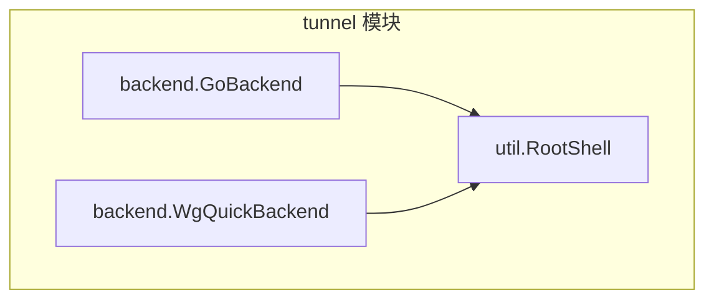
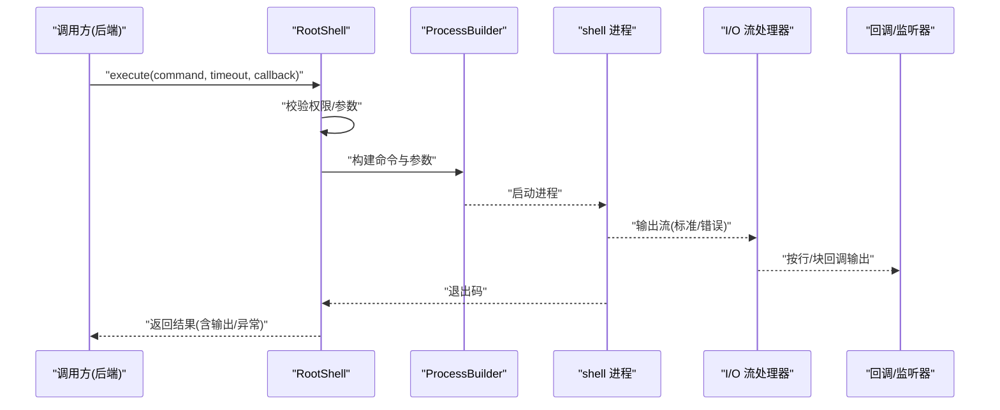
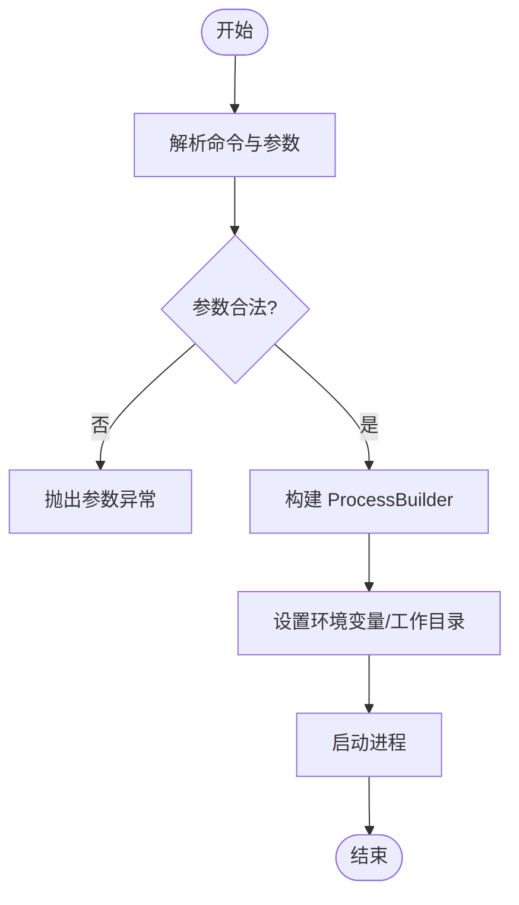
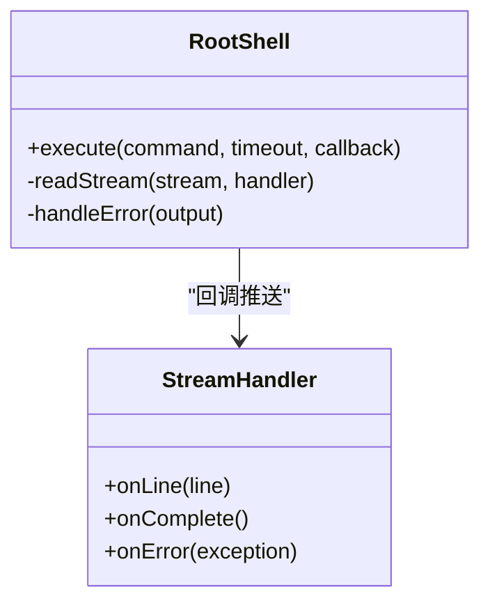
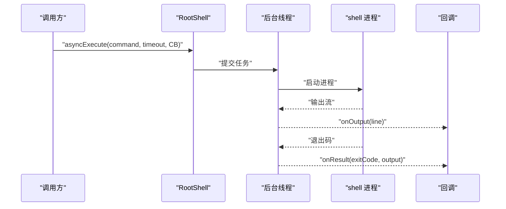
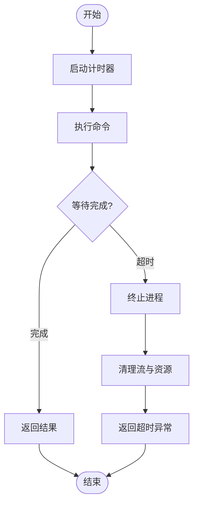
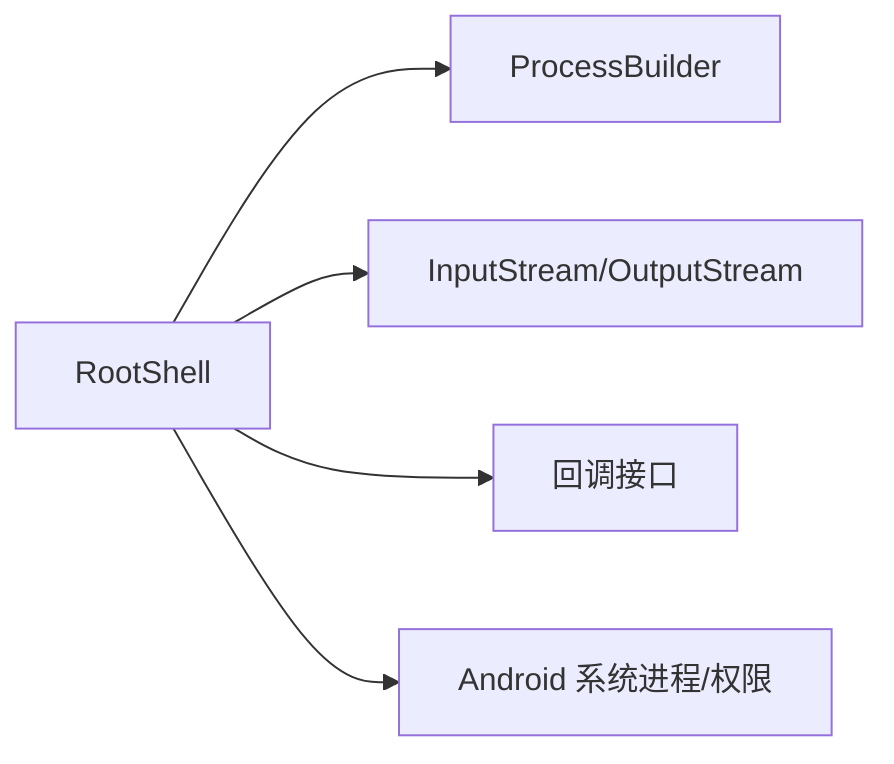

# RootShell 根权限命令执行

<cite>
**本文引用的文件**   
- [RootShell.java](file://tunnel/src/main/java/com/wireguard/android/util/RootShell.java)
</cite>

## 目录
1. [简介](#简介)
2. [项目结构](#项目结构)
3. [核心组件](#核心组件)
4. [架构总览](#架构总览)
5. [详细组件分析](#详细组件分析)
6. [依赖关系分析](#依赖关系分析)
7. [性能考量](#性能考量)
8. [故障排查指南](#故障排查指南)
9. [结论](#结论)
10. [附录](#附录)

## 简介
本技术文档聚焦于 RootShell 类，系统性阐述其在 Android 环境下以 root 权限执行系统命令的实现机制。内容涵盖进程创建与参数封装、输出流处理（标准输出与错误输出）、异步执行与回调、超时控制与进程管理策略、安全与权限校验、以及与 Android 系统版本的兼容性处理。同时提供典型使用场景示例与错误处理模式，帮助开发者正确、安全地集成和使用该能力。

## 项目结构
RootShell 位于 tunnel 模块的 util 包中，作为底层工具类为上层后端（如 GoBackend、WgQuickBackend）提供 root 命令执行能力。其职责单一、边界清晰，主要围绕 ProcessBuilder 进行进程生命周期管理与 I/O 流处理。

图表来源
- [RootShell.java](file://tunnel/src/main/java/com/wireguard/android/util/RootShell.java)

章节来源
- [RootShell.java](file://tunnel/src/main/java/com/wireguard/android/util/RootShell.java)

## 核心组件
- 进程构建与执行：基于 ProcessBuilder 构造 shell 命令，设置工作目录与环境变量，启动子进程并获取输入/输出/错误流。
- 命令封装与参数处理：对命令字符串进行分词与转义，避免注入风险；支持将多条命令组合为单条 shell 脚本执行。
- 输出流解析：分别读取标准输出与错误输出，支持同步阻塞读取与异步回调推送。
- 异步执行与回调：通过线程池或后台任务实现非阻塞调用，回调结果包含退出码、输出文本与异常信息。
- 超时控制：为进程等待与流读取设置超时阈值，防止死锁与资源泄露。
- 进程管理：统一维护进程句柄，确保在成功、失败或取消时正确关闭流与终止进程。
- 安全与权限校验：在执行前检查是否具备 root 权限，必要时回退到受限模式或抛出明确异常。

章节来源
- [RootShell.java](file://tunnel/src/main/java/com/wireguard/android/util/RootShell.java)

## 架构总览
RootShell 作为“命令执行引擎”，向上层暴露简洁 API，向下对接 Android 进程与 I/O 子系统。整体流程如下：

图表来源
- [RootShell.java](file://tunnel/src/main/java/com/wireguard/android/util/RootShell.java)

## 详细组件分析

### 进程构建与参数封装
- 使用 ProcessBuilder 指定命令与参数数组，避免字符串拼接带来的注入问题。
- 对特殊字符进行转义，保证命令在不同 locale 与路径下稳定执行。
- 支持设置环境变量与工作目录，便于隔离执行上下文。

图表来源
- [RootShell.java](file://tunnel/src/main/java/com/wireguard/android/util/RootShell.java)

章节来源
- [RootShell.java](file://tunnel/src/main/java/com/wireguard/android/util/RootShell.java)

### 输出流处理（标准输出与错误输出）
- 分别绑定标准输出与错误输出流，避免混合导致解析混乱。
- 采用缓冲读取与逐行回调，降低内存占用并提升实时性。
- 支持将错误输出重定向为标准输出或独立收集，便于调试与日志记录。

图表来源
- [RootShell.java](file://tunnel/src/main/java/com/wireguard/android/util/RootShell.java)

章节来源
- [RootShell.java](file://tunnel/src/main/java/com/wireguard/android/util/RootShell.java)

### 异步执行与回调机制
- 通过后台线程或线程池执行命令，避免阻塞 UI 线程。
- 回调接口包含进度（可选）、最终结果与异常，便于上层聚合展示。
- 支持取消操作，及时释放资源并中断长时间运行的命令。

图表来源
- [RootShell.java](file://tunnel/src/main/java/com/wireguard/android/util/RootShell.java)

章节来源
- [RootShell.java](file://tunnel/src/main/java/com/wireguard/android/util/RootShell.java)

### 超时处理与进程管理策略
- 为进程等待与流读取设置超时，避免无限阻塞。
- 超时后主动终止进程并清理流，确保无僵尸进程。
- 统一捕获并包装异常，向调用方返回明确的错误语义。

图表来源
- [RootShell.java](file://tunnel/src/main/java/com/wireguard/android/util/RootShell.java)

章节来源
- [RootShell.java](file://tunnel/src/main/java/com/wireguard/android/util/RootShell.java)

### 安全考虑与权限验证
- 执行前检测 root 可用性，若无权限则拒绝执行或降级处理。
- 严格校验命令白名单或沙箱化执行，限制敏感命令范围。
- 对用户输入进行转义与过滤，防止命令注入。

章节来源
- [RootShell.java](file://tunnel/src/main/java/com/wireguard/android/util/RootShell.java)

### 与 Android 系统的兼容性与版本适配
- 针对不同 Android 版本调整进程行为与 I/O 策略，确保稳定性。
- 处理 SELinux 与权限模型差异，必要时切换执行方式。
- 针对设备厂商定制 ROM 的差异进行兼容处理。

章节来源
- [RootShell.java](file://tunnel/src/main/java/com/wireguard/android/util/RootShell.java)

## 依赖关系分析
RootShell 依赖 Android 系统提供的进程与 I/O 能力，不直接耦合业务逻辑，保持高内聚低耦合。

图表来源
- [RootShell.java](file://tunnel/src/main/java/com/wireguard/android/util/RootShell.java)

章节来源
- [RootShell.java](file://tunnel/src/main/java/com/wireguard/android/util/RootShell.java)

## 性能考量
- 使用缓冲读取与按需回调，减少内存峰值。
- 合理设置超时与并发度，避免过多进程竞争 CPU 与 I/O。
- 复用线程池与资源，降低频繁创建销毁的开销。

## 故障排查指南
- 常见异常类型：权限不足、命令不存在、超时、流读取异常、进程被杀。
- 诊断步骤：
  - 检查 root 权限状态与 SELinux 模式。
  - 确认命令在 shell 中可执行且参数正确。
  - 查看标准输出与错误输出日志定位问题。
  - 适当增大超时时间或拆分复杂命令。
- 恢复策略：重试机制、降级执行、回滚变更。

章节来源
- [RootShell.java](file://tunnel/src/main/java/com/wireguard/android/util/RootShell.java)

## 结论
RootShell 提供了稳定、安全、高效的 root 命令执行能力，适用于需要系统级操作的 Android 应用。通过清晰的 API、完善的错误处理与异步支持，开发者可以便捷地集成并扩展功能。建议在生产环境中结合白名单与审计日志，进一步提升安全性与可观测性。

## 附录

### 使用示例（概念性说明）
- 简单命令执行：执行单个系统命令并获取退出码与输出。
- 复杂命令组合：将多条命令组合为脚本一次性执行，提高原子性。
- 批量操作：并发执行多个命令，汇总结果并处理异常。

章节来源
- [RootShell.java](file://tunnel/src/main/java/com/wireguard/android/util/RootShell.java)