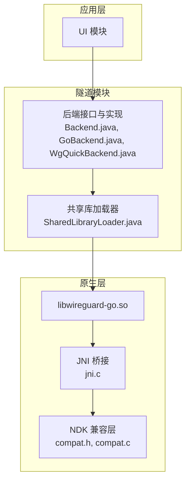
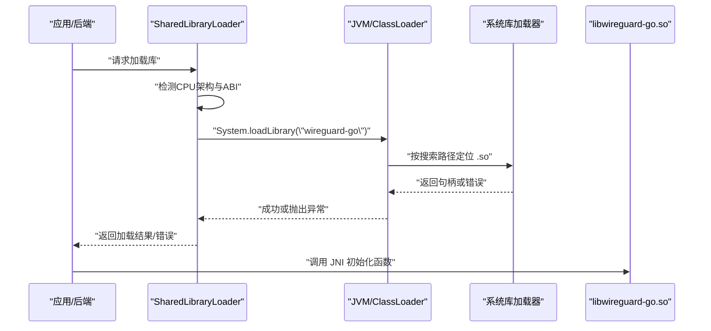
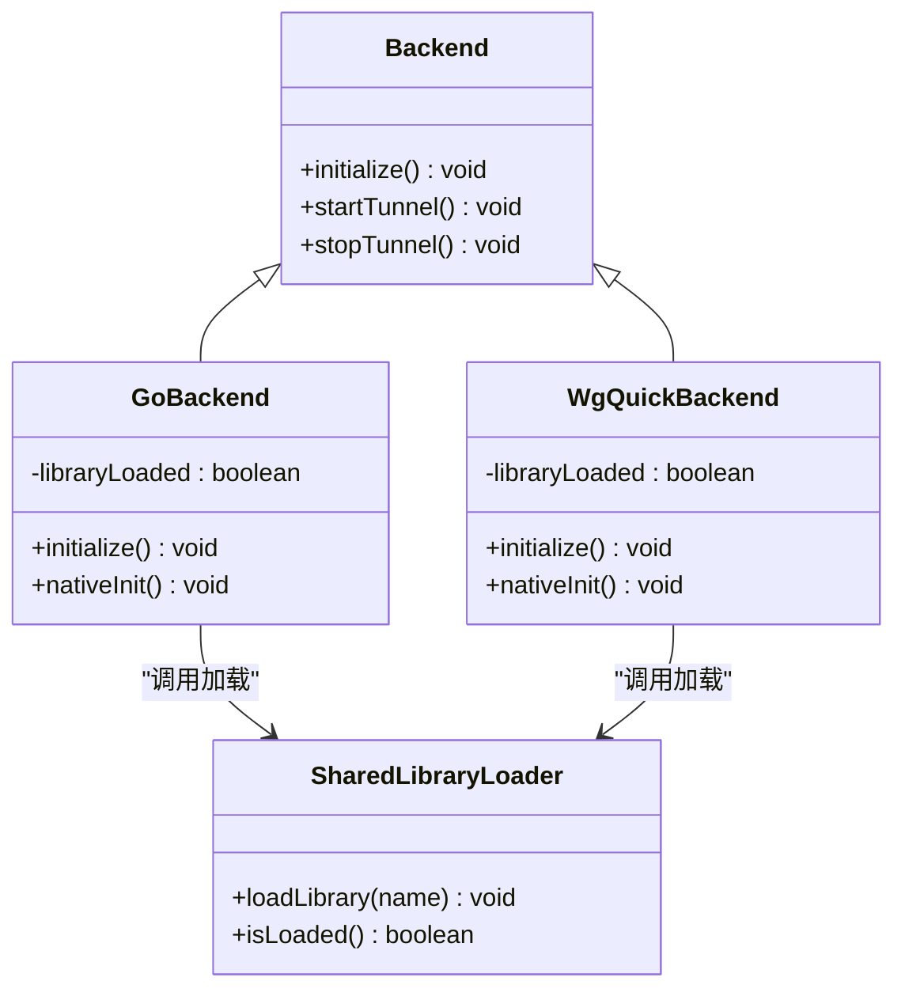
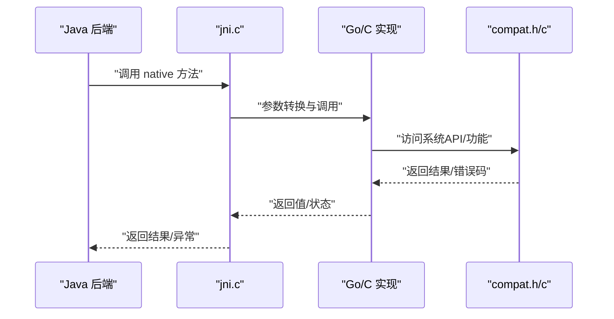
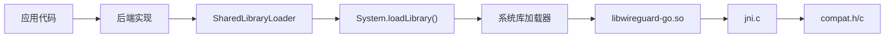

# SharedLibraryLoader 动态库加载器

<cite>
**本文档引用的文件**   
- [SharedLibraryLoader.java](file://tunnel/src/main/java/com/wireguard/android/util/SharedLibraryLoader.java)
- [Backend.java](file://tunnel/src/main/java/com/wireguard/android/backend/Backend.java)
- [GoBackend.java](file://tunnel/src/main/java/com/wireguard/android/backend/GoBackend.java)
- [WgQuickBackend.java](file://tunnel/src/main/java/com/wireguard/android/backend/WgQuickBackend.java)
- [BuildConfig.kt](file://ui/src/main/java/com/wireguard/android/Application.kt)
- [libwg-go Makefile](file://tunnel/tools/libwg-go/Makefile)
- [jni.c](file://tunnel/tools/libwg-go/jni.c)
- [compat.h](file://tunnel/tools/ndk-compat/compat.h)
- [compat.c](file://tunnel/tools/ndk-compat/compat.c)
</cite>

## 目录
1. [简介](#简介)
2. [项目结构](#项目结构)
3. [核心组件](#核心组件)
4. [架构总览](#架构总览)
5. [详细组件分析](#详细组件分析)
6. [依赖关系分析](#依赖关系分析)
7. [性能考虑](#性能考虑)
8. [故障排查指南](#故障排查指南)
9. [结论](#结论)
10. [附录](#附录)

## 简介
本技术文档围绕 SharedLibraryLoader 类，系统化阐述 Android 平台下动态库加载的实现原理与工程实践。内容涵盖 System.loadLibrary() 的调用机制、库文件查找路径、多架构支持策略（armeabi-v7a、arm64-v8a、x86、x86_64）、版本管理与兼容性检查、加载失败错误处理与回退机制、内存管理与资源清理策略，以及 NDK 构建系统集成与依赖管理。同时提供使用示例、调试技巧与性能优化建议，帮助开发者在 WireGuard Android 项目中正确集成与扩展原生库。

## 项目结构
WireGuard Android 采用模块化组织：tunnel 模块包含后端实现与工具链，ui 模块负责界面与交互。SharedLibraryLoader 位于 tunnel 模块的 util 包中，用于统一加载 libwireguard-go 等原生库；后端类通过该加载器完成 JNI 入口初始化。NDK 相关源码位于 tunnel/tools 目录，包含 Go/JNI 桥接与兼容层。



图表来源
- [SharedLibraryLoader.java](file://tunnel/src/main/java/com/wireguard/android/util/SharedLibraryLoader.java)
- [Backend.java](file://tunnel/src/main/java/com/wireguard/android/backend/Backend.java)
- [GoBackend.java](file://tunnel/src/main/java/com/wireguard/android/backend/GoBackend.java)
- [WgQuickBackend.java](file://tunnel/src/main/java/com/wireguard/android/backend/WgQuickBackend.java)
- [jni.c](file://tunnel/tools/libwg-go/jni.c)
- [compat.h](file://tunnel/tools/ndk-compat/compat.h)
- [compat.c](file://tunnel/tools/ndk-compat/compat.c)

章节来源
- [SharedLibraryLoader.java](file://tunnel/src/main/java/com/wireguard/android/util/SharedLibraryLoader.java)
- [Backend.java](file://tunnel/src/main/java/com/wireguard/android/backend/Backend.java)
- [GoBackend.java](file://tunnel/src/main/java/com/wireguard/android/backend/GoBackend.java)
- [WgQuickBackend.java](file://tunnel/src/main/java/com/wireguard/android/backend/WgQuickBackend.java)

## 核心组件
- SharedLibraryLoader：封装动态库加载逻辑，负责按架构选择并加载 libwireguard-go 等库，提供统一的加载入口与错误处理。
- Backend 系列：定义后端抽象与具体实现（GoBackend、WgQuickBackend），在启动时触发库加载与 JNI 初始化。
- JNI 桥接与兼容层：jni.c 暴露 Java 可调用方法；compat.h/c 提供 NDK 版本差异适配。

章节来源
- [SharedLibraryLoader.java](file://tunnel/src/main/java/com/wireguard/android/util/SharedLibraryLoader.java)
- [GoBackend.java](file://tunnel/src/main/java/com/wireguard/android/backend/GoBackend.java)
- [WgQuickBackend.java](file://tunnel/src/main/java/com/wireguard/android/backend/WgQuickBackend.java)
- [jni.c](file://tunnel/tools/libwg-go/jni.c)
- [compat.h](file://tunnel/tools/ndk-compat/compat.h)
- [compat.c](file://tunnel/tools/ndk-compat/compat.c)

## 架构总览
SharedLibraryLoader 作为加载中枢，协调上层后端与下层原生库。其关键职责包括：
- 识别设备 CPU 架构，选择对应 ABI 的库路径
- 调用 System.loadLibrary() 完成库装载
- 捕获并包装加载异常，向上层返回明确错误信息
- 为后续 JNI 初始化提供可靠入口



图表来源
- [SharedLibraryLoader.java](file://tunnel/src/main/java/com/wireguard/android/util/SharedLibraryLoader.java)
- [GoBackend.java](file://tunnel/src/main/java/com/wireguard/android/backend/GoBackend.java)

## 详细组件分析

### SharedLibraryLoader 类分析
- 架构识别与 ABI 映射：根据运行时 CPU 特性判断 armeabi-v7a、arm64-v8a、x86、x86_64，并映射到对应的库名或路径前缀。
- 加载流程：优先尝试直接 loadLibrary("wireguard-go")，若失败则依据 ABI 构造更具体的路径或名称进行重试。
- 错误处理：捕获 UnsatisfiedLinkError、NoClassDefFoundError 等，转换为业务友好的异常类型，便于上层回退或提示。
- 幂等性与缓存：确保同一进程内重复加载不会重复执行底层操作，避免资源浪费。
- 资源清理：不持有原生对象引用，由 JVM 与系统负责生命周期；在异常路径上避免泄露临时资源。

```mermaid
flowchart TD
Start(["开始"]) --> Detect["检测CPU架构与ABI"]
Detect --> TryLoad["尝试 System.loadLibrary(\"wireguard-go\")"]
TryLoad --> LoadOK{"加载成功?"}
LoadOK --> |是| InitJNI["调用 JNI 初始化"]
LoadOK --> |否| Fallback["按ABI构造备用路径/名称重试"]
Fallback --> RetryOK{"重试成功?"}
RetryOK --> |是| InitJNI
RetryOK --> |否| HandleErr["记录错误并抛出友好异常"]
InitJNI --> End(["结束"])
HandleErr --> End
```

图表来源
- [SharedLibraryLoader.java](file://tunnel/src/main/java/com/wireguard/android/util/SharedLibraryLoader.java)

章节来源
- [SharedLibraryLoader.java](file://tunnel/src/main/java/com/wireguard/android/util/SharedLibraryLoader.java)

### 后端与加载器的协作
- GoBackend/WgQuickBackend 在静态块或首次使用时触发库加载，确保 JNI 可用后再调用原生方法。
- 后端对加载失败进行统一处理，必要时降级或提示用户更新/重装。



图表来源
- [Backend.java](file://tunnel/src/main/java/com/wireguard/android/backend/Backend.java)
- [GoBackend.java](file://tunnel/src/main/java/com/wireguard/android/backend/GoBackend.java)
- [WgQuickBackend.java](file://tunnel/src/main/java/com/wireguard/android/backend/WgQuickBackend.java)
- [SharedLibraryLoader.java](file://tunnel/src/main/java/com/wireguard/android/util/SharedLibraryLoader.java)

章节来源
- [Backend.java](file://tunnel/src/main/java/com/wireguard/android/backend/Backend.java)
- [GoBackend.java](file://tunnel/src/main/java/com/wireguard/android/backend/GoBackend.java)
- [WgQuickBackend.java](file://tunnel/src/main/java/com/wireguard/android/backend/WgQuickBackend.java)
- [SharedLibraryLoader.java](file://tunnel/src/main/java/com/wireguard/android/util/SharedLibraryLoader.java)

### JNI 桥接与 NDK 兼容层
- jni.c 暴露 Java 可调用的 native 方法，负责将 Java 参数映射到 Go/C 侧实现。
- compat.h/c 屏蔽不同 NDK/API 级别差异，确保在不同 Android 版本上行为一致。



图表来源
- [jni.c](file://tunnel/tools/libwg-go/jni.c)
- [compat.h](file://tunnel/tools/ndk-compat/compat.h)
- [compat.c](file://tunnel/tools/ndk-compat/compat.c)

章节来源
- [jni.c](file://tunnel/tools/libwg-go/jni.c)
- [compat.h](file://tunnel/tools/ndk-compat/compat.h)
- [compat.c](file://tunnel/tools/ndk-compat/compat.c)

## 依赖关系分析
- 运行时依赖：Android 系统库加载器、设备 CPU 架构、ABI 匹配规则。
- 构建期依赖：NDK 版本、Go 工具链、CMake/Makefile 配置。
- 外部库：libwireguard-go 及其依赖的动态库。



图表来源
- [SharedLibraryLoader.java](file://tunnel/src/main/java/com/wireguard/android/util/SharedLibraryLoader.java)
- [jni.c](file://tunnel/tools/libwg-go/jni.c)
- [compat.h](file://tunnel/tools/ndk-compat/compat.h)
- [compat.c](file://tunnel/tools/ndk-compat/compat.c)

章节来源
- [SharedLibraryLoader.java](file://tunnel/src/main/java/com/wireguard/android/util/SharedLibraryLoader.java)
- [jni.c](file://tunnel/tools/libwg-go/jni.c)
- [compat.h](file://tunnel/tools/ndk-compat/compat.h)
- [compat.c](file://tunnel/tools/ndk-compat/compat.c)

## 性能考虑
- 延迟加载：仅在首次需要时触发库加载，避免冷启动开销。
- 架构预检：尽早识别不支持的 ABI，快速失败减少无效尝试。
- 避免重复加载：使用标志位或单例模式保证一次加载。
- 日志精简：生产环境降低日志级别，减少 I/O 与字符串分配。
- 内存占用：原生库加载后常驻内存，合理设计生命周期，避免频繁卸载/重载。

[本节为通用指导，无需特定文件来源]

## 故障排查指南
- 常见错误
  - UnsatisfiedLinkError：库未找到或 ABI 不匹配，检查 ABI 列表与打包配置。
  - NoClassDefFoundError：JNI 符号缺失，确认 jni.c 导出方法与签名一致。
  - 初始化失败：检查 compat 层 API 可用性，核对 NDK 版本。
- 诊断步骤
  - 打印当前 ABI 与支持的 ABI 列表，比对设备实际架构。
  - 查看系统日志（logcat）中的加载错误堆栈。
  - 验证 APK 中是否存在对应 ABI 的 .so 文件。
- 回退策略
  - 若主库加载失败，尝试按 ABI 重命名或从备用路径加载。
  - 向用户提示“请安装对应架构版本”或“重新安装应用”。

章节来源
- [SharedLibraryLoader.java](file://tunnel/src/main/java/com/wireguard/android/util/SharedLibraryLoader.java)
- [GoBackend.java](file://tunnel/src/main/java/com/wireguard/android/backend/GoBackend.java)
- [WgQuickBackend.java](file://tunnel/src/main/java/com/wireguard/android/backend/WgQuickBackend.java)

## 结论
SharedLibraryLoader 在 WireGuard Android 中承担关键的动态库加载职责，通过明确的架构识别、稳健的错误处理与清晰的加载流程，保障后端与原生库的稳定集成。结合 NDK 兼容层与构建脚本，可实现跨 ABI 与跨版本的可靠部署。遵循本文的性能与排障建议，有助于提升加载成功率与应用稳定性。

[本节为总结性内容，无需特定文件来源]

## 附录

### 使用示例（库加载、初始化与错误处理）
- 库加载
  - 在应用启动或首次使用后端时，调用 SharedLibraryLoader 的加载方法。
  - 若返回成功，继续调用后端的初始化方法以完成 JNI 初始化。
- 初始化调用
  - 后端 initialize() 内部应确保库已加载，再调用 native 方法。
- 错误处理
  - 捕获加载异常，记录上下文信息（ABI、Android 版本）。
  - 提示用户采取修复措施（如更换设备、重装应用）。

章节来源
- [SharedLibraryLoader.java](file://tunnel/src/main/java/com/wireguard/android/util/SharedLibraryLoader.java)
- [GoBackend.java](file://tunnel/src/main/java/com/wireguard/android/backend/GoBackend.java)
- [WgQuickBackend.java](file://tunnel/src/main/java/com/wireguard/android/backend/WgQuickBackend.java)

### 多架构支持策略（armeabi-v7a、arm64-v8a、x86、x86_64）
- 运行时检测：读取系统属性或 Build.CPU_ABI 确定当前 ABI。
- 构建产物：确保 APK 中包含各 ABI 的 .so 文件，或在服务端按需下发。
- 回退顺序：优先 arm64-v8a，其次 armeabi-v7a，最后 x86/x86_64（视设备能力）。

章节来源
- [SharedLibraryLoader.java](file://tunnel/src/main/java/com/wireguard/android/util/SharedLibraryLoader.java)

### 版本管理与兼容性检查
- 版本标识：在库或配置中嵌入版本号，加载后校验最低兼容版本。
- 兼容性矩阵：维护 Android API 级别与 NDK 版本的对应关系。
- 升级策略：当检测到不兼容时，提示用户更新或回退到兼容版本。

章节来源
- [jni.c](file://tunnel/tools/libwg-go/jni.c)
- [compat.h](file://tunnel/tools/ndk-compat/compat.h)
- [compat.c](file://tunnel/tools/ndk-compat/compat.c)

### 内存管理与资源清理策略
- 原生对象生命周期由 JVM 与系统管理，避免在 Java 层持有不必要的引用。
- 异常路径确保不泄露临时资源（如打开的文件描述符）。
- 避免频繁卸载库，尽量复用已加载实例。

章节来源
- [SharedLibraryLoader.java](file://tunnel/src/main/java/com/wireguard/android/util/SharedLibraryLoader.java)

### 与 NDK 构建系统的集成与依赖管理
- 构建脚本：使用 Makefile/CMake 生成各 ABI 的 .so，并纳入 APK 打包。
- 依赖声明：在 gradle 配置中指定 NDK 版本与 ABI 过滤。
- 发布策略：按 ABI 拆分产物或统一打包，确保下载体积与兼容性平衡。

章节来源
- [libwg-go Makefile](file://tunnel/tools/libwg-go/Makefile)
- [jni.c](file://tunnel/tools/libwg-go/jni.c)
- [compat.h](file://tunnel/tools/ndk-compat/compat.h)
- [compat.c](file://tunnel/tools/ndk-compat/compat.c)