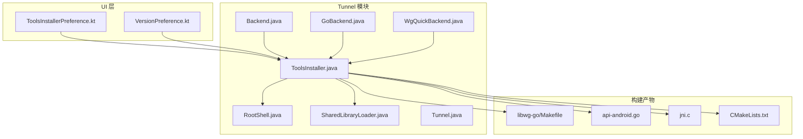
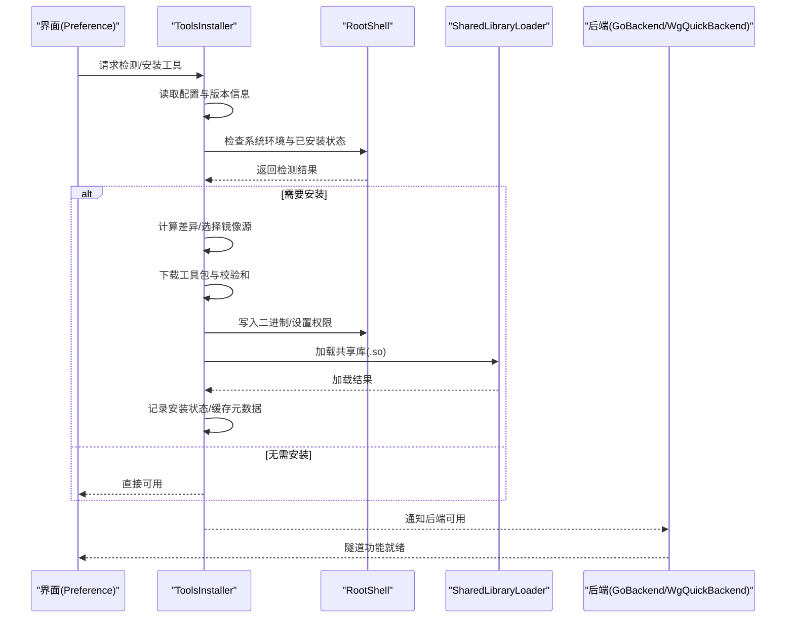
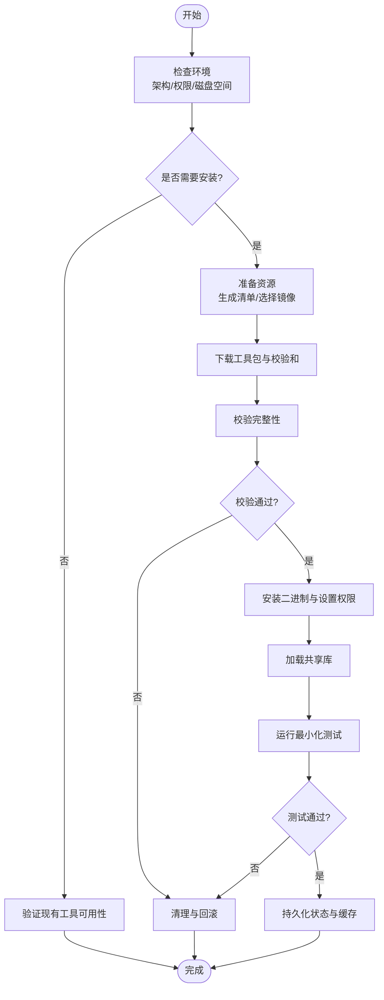
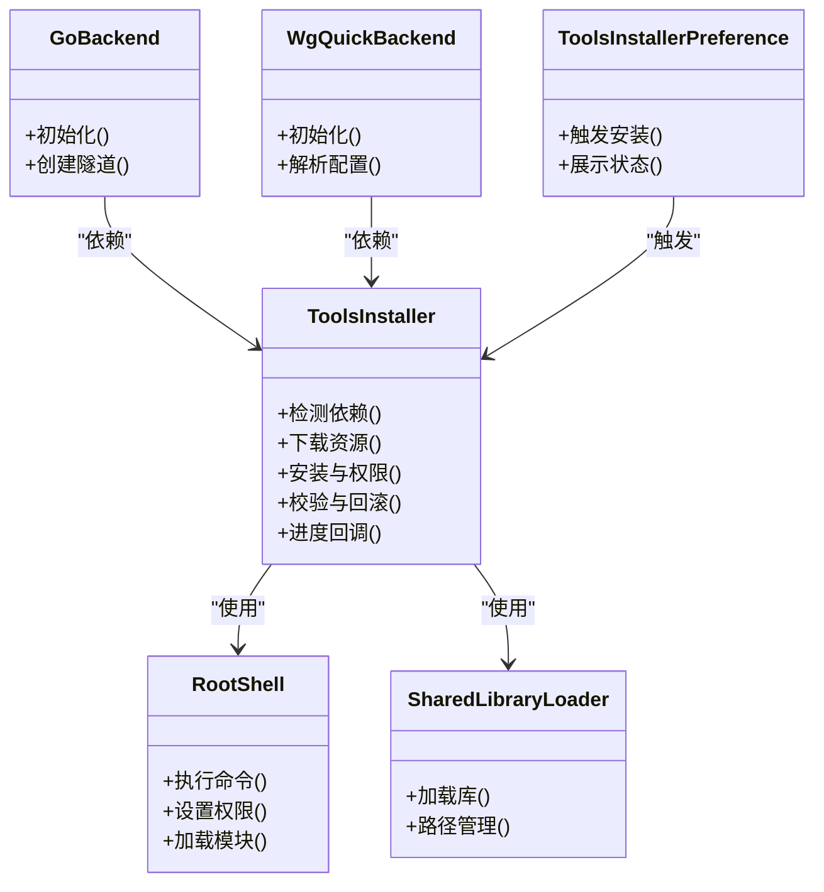

# ToolsInstaller 工具安装器

<cite>
**本文引用的文件**   
- [ToolsInstaller.java](file://tunnel/src/main/java/com/wireguard/android/util/ToolsInstaller.java)
- [RootShell.java](file://tunnel/src/main/java/com/wireguard/android/util/RootShell.java)
- [SharedLibraryLoader.java](file://tunnel/src/main/java/com/wireguard/android/util/SharedLibraryLoader.java)
- [Backend.java](file://tunnel/src/main/java/com/wireguard/android/backend/Backend.java)
- [GoBackend.java](file://tunnel/src/main/java/com/wireguard/android/backend/GoBackend.java)
- [WgQuickBackend.java](file://tunnel/src/main/java/com/wireguard/android/backend/WgQuickBackend.java)
- [Tunnel.java](file://tunnel/src/main/java/com/wireguard/android/backend/Tunnel.java)
- [PreferencesPreferenceDataStore.kt](file://ui/src/main/java/com/wireguard/android/preference/PreferencesPreferenceDataStore.kt)
- [ToolsInstallerPreference.kt](file://ui/src/main/java/com/wireguard/android/preference/ToolsInstallerPreference.kt)
- [VersionPreference.kt](file://ui/src/main/java/com/wireguard/android/preference/VersionPreference.kt)
- [libwg-go/Makefile](file://tunnel/tools/libwg-go/Makefile)
- [libwg-go/api-android.go](file://tunnel/tools/libwg-go/api-android.go)
- [libwg-go/jni.c](file://tunnel/tools/libwg-go/jni.c)
- [CMakeLists.txt](file://tunnel/tools/CMakeLists.txt)
</cite>

## 目录
1. [简介](#简介)
2. [项目结构](#项目结构)
3. [核心组件](#核心组件)
4. [架构总览](#架构总览)
5. [详细组件分析](#详细组件分析)
6. [依赖关系分析](#依赖关系分析)
7. [性能考虑](#性能考虑)
8. [故障排查指南](#故障排查指南)
9. [结论](#结论)
10. [附录](#附录)

## 简介
本技术文档围绕 ToolsInstaller 类，系统性阐述 WireGuard Android 项目中“工具包安装与管理”的实现与使用。内容涵盖：
- 依赖检测、下载与安装流程
- 支持的工具体系结构与版本管理（如 wireguard-tools、libwg-go）
- 权限检查与用户交互处理
- 失败回滚机制与错误恢复策略
- 缓存管理与增量更新支持
- 日志记录与进度反馈
- 与系统服务集成及后台任务管理
- 安全验证与完整性校验

## 项目结构
ToolsInstaller 位于 tunnel 模块的 util 包中，负责在运行时检测并安装必要的二进制工具与共享库，供后端（GoBackend、WgQuickBackend）调用。UI 层通过 Preference 相关类暴露安装入口与状态展示。

图表来源
- [ToolsInstaller.java](file://tunnel/src/main/java/com/wireguard/android/util/ToolsInstaller.java)
- [RootShell.java](file://tunnel/src/main/java/com/wireguard/android/util/RootShell.java)
- [SharedLibraryLoader.java](file://tunnel/src/main/java/com/wireguard/android/util/SharedLibraryLoader.java)
- [Backend.java](file://tunnel/src/main/java/com/wireguard/android/backend/Backend.java)
- [GoBackend.java](file://tunnel/src/main/java/com/wireguard/android/backend/GoBackend.java)
- [WgQuickBackend.java](file://tunnel/src/main/java/com/wireguard/android/backend/WgQuickBackend.java)
- [Tunnel.java](file://tunnel/src/main/java/com/wireguard/android/backend/Tunnel.java)
- [libwg-go/Makefile](file://tunnel/tools/libwg-go/Makefile)
- [libwg-go/api-android.go](file://tunnel/tools/libwg-go/api-android.go)
- [libwg-go/jni.c](file://tunnel/tools/libwg-go/jni.c)
- [CMakeLists.txt](file://tunnel/tools/CMakeLists.txt)

章节来源
- [ToolsInstaller.java](file://tunnel/src/main/java/com/wireguard/android/util/ToolsInstaller.java)
- [RootShell.java](file://tunnel/src/main/java/com/wireguard/android/util/RootShell.java)
- [SharedLibraryLoader.java](file://tunnel/src/main/java/com/wireguard/android/util/SharedLibraryLoader.java)
- [ToolsInstallerPreference.kt](file://ui/src/main/java/com/wireguard/android/preference/ToolsInstallerPreference.kt)
- [VersionPreference.kt](file://ui/src/main/java/com/wireguard/android/preference/VersionPreference.kt)

## 核心组件
- ToolsInstaller：负责工具包的依赖检测、下载、安装、校验、回滚与缓存管理；提供安装状态查询与进度回调接口。
- RootShell：以 root 权限执行系统命令，用于复制二进制到系统目录、设置权限、加载内核模块等。
- SharedLibraryLoader：负责 .so 库的动态加载与路径管理，确保 Go 后端能正确链接 libwg-go。
- Backend/GoBackend/WgQuickBackend：上层后端抽象与实现，依赖已安装的工具与库来创建/管理隧道。
- UI Preference：暴露安装入口、显示版本信息与安装状态，触发安装流程。

章节来源
- [ToolsInstaller.java](file://tunnel/src/main/java/com/wireguard/android/util/ToolsInstaller.java)
- [RootShell.java](file://tunnel/src/main/java/com/wireguard/android/util/RootShell.java)
- [SharedLibraryLoader.java](file://tunnel/src/main/java/com/wireguard/android/util/SharedLibraryLoader.java)
- [Backend.java](file://tunnel/src/main/java/com/wireguard/android/backend/Backend.java)
- [GoBackend.java](file://tunnel/src/main/java/com/wireguard/android/backend/GoBackend.java)
- [WgQuickBackend.java](file://tunnel/src/main/java/com/wireguard/android/backend/WgQuickBackend.java)
- [ToolsInstallerPreference.kt](file://ui/src/main/java/com/wireguard/android/preference/ToolsInstallerPreference.kt)
- [VersionPreference.kt](file://ui/src/main/java/com/wireguard/android/preference/VersionPreference.kt)

## 架构总览
ToolsInstaller 作为“安装编排器”，协调 RootShell 与 SharedLibraryLoader，结合 UI Preference 提供的用户输入与状态展示，完成从依赖检测到最终可用的完整生命周期。

图表来源
- [ToolsInstaller.java](file://tunnel/src/main/java/com/wireguard/android/util/ToolsInstaller.java)
- [RootShell.java](file://tunnel/src/main/java/com/wireguard/android/util/RootShell.java)
- [SharedLibraryLoader.java](file://tunnel/src/main/java/com/wireguard/android/util/SharedLibraryLoader.java)
- [GoBackend.java](file://tunnel/src/main/java/com/wireguard/android/backend/GoBackend.java)
- [WgQuickBackend.java](file://tunnel/src/main/java/com/wireguard/android/backend/WgQuickBackend.java)

## 详细组件分析

### ToolsInstaller 类分析
- 职责边界
  - 依赖检测：探测系统是否已存在 wireguard-tools、libwg-go 及其版本。
  - 下载与缓存：根据设备架构与版本策略选择合适资源，落盘至缓存目录，支持断点续传与增量更新。
  - 安装与权限：通过 RootShell 执行安装脚本或命令，设置可执行位与必要权限。
  - 校验与安全：对下载资源进行完整性校验（如哈希），必要时进行签名验证。
  - 回滚与恢复：安装失败时回滚变更，清理临时文件，保留可恢复状态。
  - 进度与日志：对外暴露进度回调与日志输出，便于 UI 与调试。
- 关键流程
  - 启动检测：读取本地缓存与系统状态，快速判定是否需要安装。
  - 资源准备：生成下载清单，校验和列表，选择镜像源。
  - 安装执行：按顺序执行二进制部署、库加载、权限设置。
  - 可用性验证：运行最小化测试（如 --version）确认工具可用。
  - 状态持久化：保存版本、时间戳、校验摘要，供下次快速判断。
- 错误处理
  - 网络异常：重试与切换镜像源。
  - 权限不足：提示用户授予 root 权限或切换到有权限的安装方式。
  - 校验失败：拒绝安装并清理残留，提示重新下载。
  - 回滚策略：分阶段提交，任一阶段失败则回滚该阶段变更。

图表来源
- [ToolsInstaller.java](file://tunnel/src/main/java/com/wireguard/android/util/ToolsInstaller.java)
- [RootShell.java](file://tunnel/src/main/java/com/wireguard/android/util/RootShell.java)
- [SharedLibraryLoader.java](file://tunnel/src/main/java/com/wireguard/android/util/SharedLibraryLoader.java)

章节来源
- [ToolsInstaller.java](file://tunnel/src/main/java/com/wireguard/android/util/ToolsInstaller.java)

### RootShell 与权限管理
- 作用：以 root 权限执行系统命令，包括复制文件、修改权限、挂载/卸载模块、调用系统工具。
- 安全要点：严格限制命令白名单，避免注入；对敏感操作进行二次确认或审计日志。
- 典型用法：安装二进制到系统目录、设置可执行位、加载内核模块、清理临时文件。

章节来源
- [RootShell.java](file://tunnel/src/main/java/com/wireguard/android/util/RootShell.java)

### SharedLibraryLoader 与库加载
- 作用：定位并加载 .so 库，确保 Go 后端能正确链接 libwg-go。
- 关键点：ABI 匹配、路径优先级、加载失败的回退策略。
- 与 ToolsInstaller 协作：安装完成后立即尝试加载，若失败则提示重新安装或检查 ABI。

章节来源
- [SharedLibraryLoader.java](file://tunnel/src/main/java/com/wireguard/android/util/SharedLibraryLoader.java)

### 后端集成（GoBackend / WgQuickBackend）
- 依赖关系：后端在初始化时依赖已安装的工具与库；若缺失则触发 ToolsInstaller 的检测与安装。
- 调用模式：通过 JNI 或直接调用二进制工具，封装为统一的 Tunnel 管理接口。

章节来源
- [Backend.java](file://tunnel/src/main/java/com/wireguard/android/backend/Backend.java)
- [GoBackend.java](file://tunnel/src/main/java/com/wireguard/android/backend/GoBackend.java)
- [WgQuickBackend.java](file://tunnel/src/main/java/com/wireguard/android/backend/WgQuickBackend.java)
- [Tunnel.java](file://tunnel/src/main/java/com/wireguard/android/backend/Tunnel.java)

### UI 偏好设置与用户交互
- ToolsInstallerPreference：提供“检测/安装”入口，展示当前状态与版本信息，支持手动触发安装。
- VersionPreference：显示当前工具版本与更新状态，辅助用户判断是否需要升级。
- 交互流程：用户点击后，UI 调用 ToolsInstaller，接收进度回调并更新界面。

章节来源
- [ToolsInstallerPreference.kt](file://ui/src/main/java/com/wireguard/android/preference/ToolsInstallerPreference.kt)
- [VersionPreference.kt](file://ui/src/main/java/com/wireguard/android/preference/VersionPreference.kt)
- [PreferencesPreferenceDataStore.kt](file://ui/src/main/java/com/wireguard/android/preference/PreferencesPreferenceDataStore.kt)

### 构建产物与版本管理（libwg-go）
- Makefile：定义构建目标、ABI 过滤、交叉编译参数，产出不同架构的 .so。
- api-android.go 与 jni.c：Android 平台 API 绑定与 JNI 桥接，确保 Java/Kotlin 与 Go 代码互通。
- CMakeLists.txt：统一构建入口，协调各子模块产物。

章节来源
- [libwg-go/Makefile](file://tunnel/tools/libwg-go/Makefile)
- [libwg-go/api-android.go](file://tunnel/tools/libwg-go/api-android.go)
- [libwg-go/jni.c](file://tunnel/tools/libwg-go/jni.c)
- [CMakeLists.txt](file://tunnel/tools/CMakeLists.txt)

## 依赖关系分析
- 组件耦合
  - ToolsInstaller 强依赖 RootShell 与 SharedLibraryLoader。
  - 后端（GoBackend/WgQuickBackend）弱依赖 ToolsInstaller，仅在缺失时触发安装。
  - UI Preference 仅负责触发与展示，不持有安装逻辑。
- 外部依赖
  - 网络访问：用于下载工具包与校验和。
  - 文件系统：缓存目录与系统目录读写。
  - 系统权限：root 权限用于系统级安装。

图表来源
- [ToolsInstaller.java](file://tunnel/src/main/java/com/wireguard/android/util/ToolsInstaller.java)
- [RootShell.java](file://tunnel/src/main/java/com/wireguard/android/util/RootShell.java)
- [SharedLibraryLoader.java](file://tunnel/src/main/java/com/wireguard/android/util/SharedLibraryLoader.java)
- [GoBackend.java](file://tunnel/src/main/java/com/wireguard/android/backend/GoBackend.java)
- [WgQuickBackend.java](file://tunnel/src/main/java/com/wireguard/android/backend/WgQuickBackend.java)
- [ToolsInstallerPreference.kt](file://ui/src/main/java/com/wireguard/android/preference/ToolsInstallerPreference.kt)

章节来源
- [ToolsInstaller.java](file://tunnel/src/main/java/com/wireguard/android/util/ToolsInstaller.java)
- [RootShell.java](file://tunnel/src/main/java/com/wireguard/android/util/RootShell.java)
- [SharedLibraryLoader.java](file://tunnel/src/main/java/com/wireguard/android/util/SharedLibraryLoader.java)
- [GoBackend.java](file://tunnel/src/main/java/com/wireguard/android/backend/GoBackend.java)
- [WgQuickBackend.java](file://tunnel/src/main/java/com/wireguard/android/backend/WgQuickBackend.java)
- [ToolsInstallerPreference.kt](file://ui/src/main/java/com/wireguard/android/preference/ToolsInstallerPreference.kt)

## 性能考虑
- 缓存命中：优先读取本地缓存与元数据，减少重复下载与校验。
- 增量更新：基于版本差异只拉取变更部分，降低带宽与时间开销。
- 并行下载：多资源并发下载，提升整体速度。
- I/O 优化：批量写入与原子替换，减少文件系统抖动。
- 内存控制：流式下载与分块校验，避免大文件占用过多内存。

[本节为通用指导，不涉及具体文件分析]

## 故障排查指南
- 常见错误
  - 权限不足：确认已授予 root 权限或采用非 root 安装路径。
  - 网络异常：检查网络连通性、代理设置与镜像源可用性。
  - 校验失败：重新下载资源，确认哈希一致性与签名有效。
  - 库加载失败：检查 ABI 匹配与库路径，必要时重装或重启应用。
- 诊断步骤
  - 查看日志：定位下载、校验、安装阶段的错误码与堆栈。
  - 验证状态：运行最小化测试（如 --version）确认工具可用。
  - 清理缓存：删除缓存目录后重试安装。
  - 回滚检查：确认无残留文件与权限不一致。

章节来源
- [ToolsInstaller.java](file://tunnel/src/main/java/com/wireguard/android/util/ToolsInstaller.java)
- [RootShell.java](file://tunnel/src/main/java/com/wireguard/android/util/RootShell.java)
- [SharedLibraryLoader.java](file://tunnel/src/main/java/com/wireguard/android/util/SharedLibraryLoader.java)

## 结论
ToolsInstaller 在 WireGuard Android 中承担关键的“工具链装配”职责，通过严谨的依赖检测、安全的下载与校验、稳健的回滚与恢复机制，以及清晰的进度与日志反馈，确保后端稳定运行。配合 UI Preference 的用户交互与版本管理，形成完整的安装与升级闭环。

[本节为总结性内容，不涉及具体文件分析]

## 附录

### 使用示例
- 手动安装
  - 在设置页点击“检测/安装”，观察进度与状态。
  - 如遇权限问题，按提示授予 root 权限。
- 自动检测
  - 应用启动时自动检测依赖，缺失则静默或提示安装。
- 批量部署
  - 通过预置配置与脚本，集中下发工具包与校验和，自动化安装。

[本节为概念性说明，不涉及具体文件分析]

### 日志与进度
- 日志级别：区分 INFO、WARN、ERROR，便于定位问题。
- 进度回调：在下载、校验、安装各阶段上报百分比与状态。
- 调试开关：开启详细日志输出，辅助开发与排障。

[本节为概念性说明，不涉及具体文件分析]

### 安全验证与完整性检查
- 哈希校验：对每个资源计算并比对哈希值。
- 签名验证：可选地验证数字签名，确保来源可信。
- 安全存储：校验和与元数据加密存储，防止篡改。

[本节为概念性说明，不涉及具体文件分析]

### 与系统服务集成与后台任务
- 系统集成：通过 RootShell 调用系统命令，管理内核模块与网络接口。
- 后台任务：使用异步任务队列，避免阻塞主线程，支持取消与重试。
- 服务通信：与系统服务交互时遵循权限模型与生命周期约束。

[本节为概念性说明，不涉及具体文件分析]