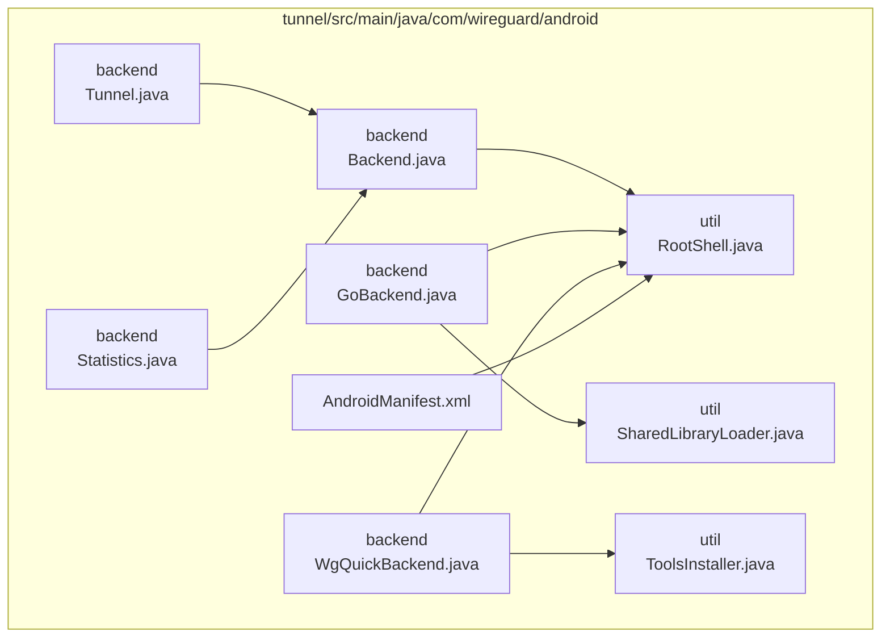
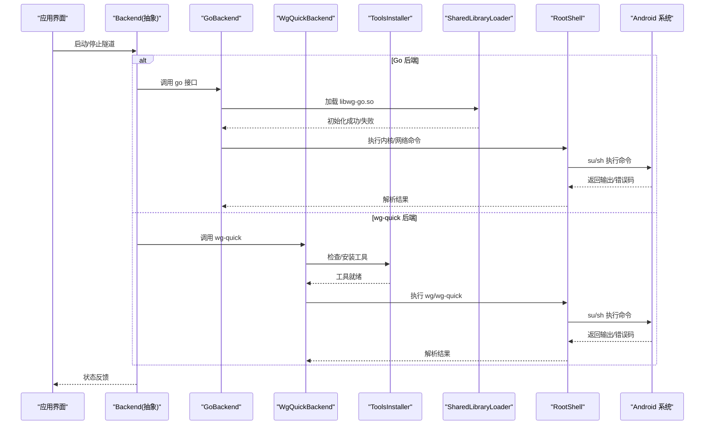
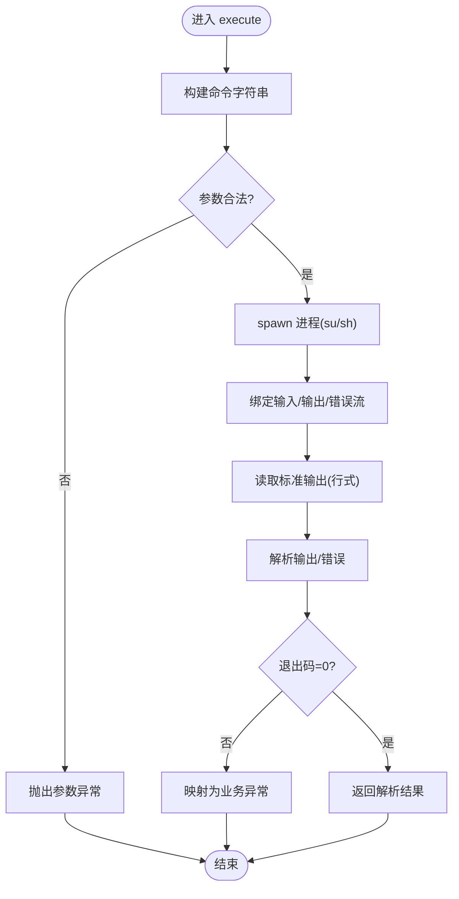
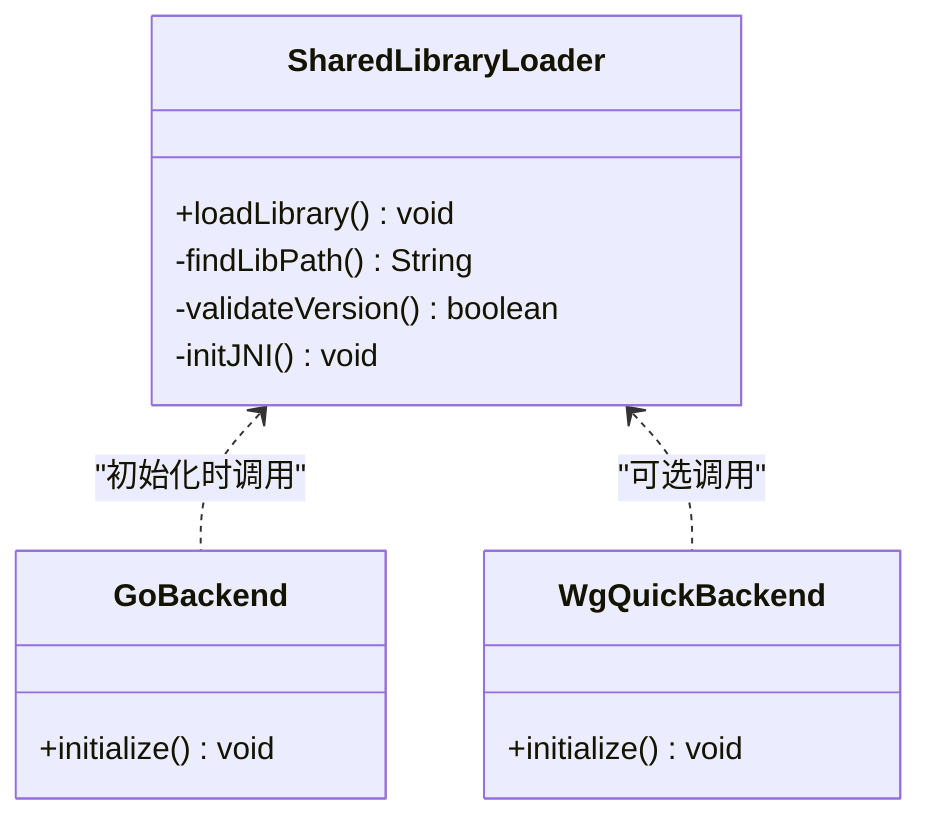
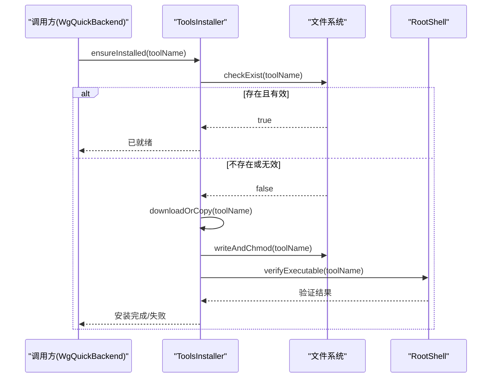
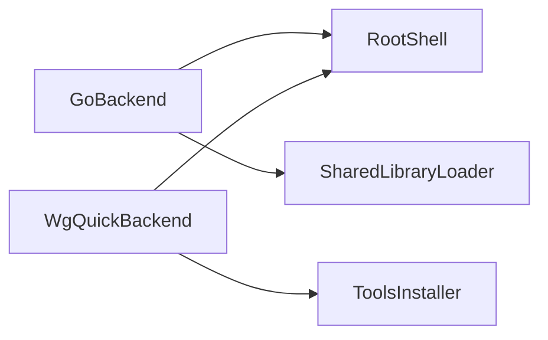

# 系统工具类

<cite>
**本文引用的文件**
- [RootShell.java](file://tunnel/src/main/java/com/wireguard/android/util/RootShell.java)
- [SharedLibraryLoader.java](file://tunnel/src/main/java/com/wireguard/android/util/SharedLibraryLoader.java)
- [ToolsInstaller.java](file://tunnel/src/main/java/com/wireguard/android/util/ToolsInstaller.java)
- [Backend.java](file://tunnel/src/main/java/com/wireguard/android/backend/Backend.java)
- [GoBackend.java](file://tunnel/src/main/java/com/wireguard/android/backend/GoBackend.java)
- [WgQuickBackend.java](file://tunnel/src/main/java/com/wireguard/android/backend/WgQuickBackend.java)
- [Tunnel.java](file://tunnel/src/main/java/com/wireguard/android/backend/Tunnel.java)
- [Statistics.java](file://tunnel/src/main/java/com/wireguard/android/backend/Statistics.java)
- [AndroidManifest.xml](file://tunnel/src/main/AndroidManifest.xml)
</cite>

## 目录
1. [简介](#简介)
2. [项目结构](#项目结构)
3. [核心组件](#核心组件)
4. [架构总览](#架构总览)
5. [详细组件分析](#详细组件分析)
6. [依赖关系分析](#依赖关系分析)
7. [性能考虑](#性能考虑)
8. [故障排除指南](#故障排除指南)
9. [结论](#结论)
10. [附录](#附录)

## 简介
本技术文档聚焦于 wireguard-android 中的系统工具类，围绕以下三类能力展开：
- RootShell：封装 root 权限命令执行、输出解析与错误处理，为上层后端提供统一的系统交互通道。
- SharedLibraryLoader：负责动态库的查找、加载与初始化，确保 Go 运行时与原生库在 Android 环境下的正确装配。
- ToolsInstaller：管理 WireGuard 工具（如 wg、wg-quick）的安装、更新与校验，保障运行期所需二进制可用。

文档同时覆盖安全与权限模型、Android 兼容性策略、调试技巧、资源管理与内存优化，并提供使用示例与最佳实践。

## 项目结构
与系统工具类相关的代码主要位于 tunnel 模块的 util 包中，并由 backend 层调用以完成隧道生命周期操作。

图表来源
- [RootShell.java](file://tunnel/src/main/java/com/wireguard/android/util/RootShell.java)
- [SharedLibraryLoader.java](file://tunnel/src/main/java/com/wireguard/android/util/SharedLibraryLoader.java)
- [ToolsInstaller.java](file://tunnel/src/main/java/com/wireguard/android/util/ToolsInstaller.java)
- [Backend.java](file://tunnel/src/main/java/com/wireguard/android/backend/Backend.java)
- [GoBackend.java](file://tunnel/src/main/java/com/wireguard/android/backend/GoBackend.java)
- [WgQuickBackend.java](file://tunnel/src/main/java/com/wireguard/android/backend/WgQuickBackend.java)
- [Tunnel.java](file://tunnel/src/main/java/com/wireguard/android/backend/Tunnel.java)
- [Statistics.java](file://tunnel/src/main/java/com/wireguard/android/backend/Statistics.java)
- [AndroidManifest.xml](file://tunnel/src/main/AndroidManifest.xml)

章节来源
- [RootShell.java](file://tunnel/src/main/java/com/wireguard/android/util/RootShell.java)
- [SharedLibraryLoader.java](file://tunnel/src/main/java/com/wireguard/android/util/SharedLibraryLoader.java)
- [ToolsInstaller.java](file://tunnel/src/main/java/com/wireguard/android/util/ToolsInstaller.java)
- [Backend.java](file://tunnel/src/main/java/com/wireguard/android/backend/Backend.java)
- [GoBackend.java](file://tunnel/src/main/java/com/wireguard/android/backend/GoBackend.java)
- [WgQuickBackend.java](file://tunnel/src/main/java/com/wireguard/android/backend/WgQuickBackend.java)
- [Tunnel.java](file://tunnel/src/main/java/com/wireguard/android/backend/Tunnel.java)
- [Statistics.java](file://tunnel/src/main/java/com/wireguard/android/backend/Statistics.java)
- [AndroidManifest.xml](file://tunnel/src/main/AndroidManifest.xml)

## 核心组件
本节对三大工具类进行概览性说明，后续章节将深入实现细节与调用流程。

- RootShell
  - 职责：以 root 权限执行 shell 命令，统一封装进程创建、I/O 流处理、超时控制、错误码解析与异常映射。
  - 关键点：命令参数白名单化、输出行级解析、错误信息标准化、并发安全与资源释放。
- SharedLibraryLoader
  - 职责：定位并加载 libwg-go.so 等原生库，完成 JNI 初始化，处理多 ABI 兼容与版本校验。
  - 关键点：ABI 探测、库路径搜索、加载失败回退、初始化钩子与异常传播。
- ToolsInstaller
  - 职责：安装/更新 wg、wg-quick 等工具到设备可执行目录，校验完整性与权限，保证后端命令可用。
  - 关键点：目标目录选择、下载或内嵌拷贝、签名/哈希校验、权限设置与幂等更新。

章节来源
- [RootShell.java](file://tunnel/src/main/java/com/wireguard/android/util/RootShell.java)
- [SharedLibraryLoader.java](file://tunnel/src/main/java/com/wireguard/android/util/SharedLibraryLoader.java)
- [ToolsInstaller.java](file://tunnel/src/main/java/com/wireguard/android/util/ToolsInstaller.java)

## 架构总览
下图展示工具类与后端模块之间的协作关系，以及典型的数据与控制流。

图表来源
- [Backend.java](file://tunnel/src/main/java/com/wireguard/android/backend/Backend.java)
- [GoBackend.java](file://tunnel/src/main/java/com/wireguard/android/backend/GoBackend.java)
- [WgQuickBackend.java](file://tunnel/src/main/java/com/wireguard/android/backend/WgQuickBackend.java)
- [ToolsInstaller.java](file://tunnel/src/main/java/com/wireguard/android/util/ToolsInstaller.java)
- [SharedLibraryLoader.java](file://tunnel/src/main/java/com/wireguard/android/util/SharedLibraryLoader.java)
- [RootShell.java](file://tunnel/src/main/java/com/wireguard/android/util/RootShell.java)

## 详细组件分析

### RootShell：根权限命令执行机制
- 命令封装
  - 通过 su 或 sh 发起进程，支持命令参数拼接与转义，避免注入风险。
  - 提供超时配置与取消机制，防止阻塞。
- 输出解析
  - 按行读取标准输出，支持前缀标记区分日志、数据与提示。
  - 对关键字段进行正则提取，便于上层结构化消费。
- 错误处理
  - 捕获退出码与 stderr，映射为统一异常类型。
  - 记录上下文（命令、参数、时间戳），便于排障。
- 并发与资源
  - 进程与流对象的生命周期管理，确保 finally 关闭。
  - 线程池或协程级别的调度，避免主线程阻塞。

图表来源
- [RootShell.java](file://tunnel/src/main/java/com/wireguard/android/util/RootShell.java)

章节来源
- [RootShell.java](file://tunnel/src/main/java/com/wireguard/android/util/RootShell.java)

### SharedLibraryLoader：动态库加载原理
- 库文件查找
  - 根据 CPU ABI 选择对应 so 文件，优先从应用私有目录或系统路径加载。
  - 支持多 ABI 回退策略，提升兼容性。
- 加载与初始化
  - 调用 System.loadLibrary 或 System.load 加载指定路径。
  - 触发 JNI 初始化函数，建立 Java 与 Go/JNI 层的桥接。
- 错误处理
  - 捕获 UnsatisfiedLinkError、IOException 等，转换为统一异常。
  - 记录加载路径与版本信息，辅助诊断。

图表来源
- [SharedLibraryLoader.java](file://tunnel/src/main/java/com/wireguard/android/util/SharedLibraryLoader.java)
- [GoBackend.java](file://tunnel/src/main/java/com/wireguard/android/backend/GoBackend.java)
- [WgQuickBackend.java](file://tunnel/src/main/java/com/wireguard/android/backend/WgQuickBackend.java)

章节来源
- [SharedLibraryLoader.java](file://tunnel/src/main/java/com/wireguard/android/util/SharedLibraryLoader.java)
- [GoBackend.java](file://tunnel/src/main/java/com/wireguard/android/backend/GoBackend.java)
- [WgQuickBackend.java](file://tunnel/src/main/java/com/wireguard/android/backend/WgQuickBackend.java)

### ToolsInstaller：工具安装与管理逻辑
- 安装流程
  - 检测目标工具是否存在且可执行，若缺失则从内置资源或远程源获取。
  - 写入目标目录（通常为 /data/local/tmp 或应用私有 bin 目录），设置执行权限。
- 校验与更新
  - 通过哈希或签名校验二进制完整性。
  - 支持增量更新与回滚，保证幂等性。
- 错误处理
  - 捕获 IO 异常、权限不足、空间不足等情况，给出明确错误码与提示。

图表来源
- [ToolsInstaller.java](file://tunnel/src/main/java/com/wireguard/android/util/ToolsInstaller.java)
- [RootShell.java](file://tunnel/src/main/java/com/wireguard/android/util/RootShell.java)

章节来源
- [ToolsInstaller.java](file://tunnel/src/main/java/com/wireguard/android/util/ToolsInstaller.java)
- [RootShell.java](file://tunnel/src/main/java/com/wireguard/android/util/RootShell.java)

### 与 Android 系统的兼容性处理
- ABI 与架构
  - 针对 arm64-v8a、armeabi-v7a、x86_64、x86 等多架构提供适配。
- SELinux 与权限
  - 通过 su 提权执行系统命令；必要时调整 SELinux 上下文或请求用户授权。
- 存储与路径
  - 优先使用应用私有目录，避免外部存储限制；必要时使用 /data 分区需 root。
- 进程与 I/O
  - 合理设置超时与缓冲，避免 ANR；对大输出采用流式处理。

章节来源
- [AndroidManifest.xml](file://tunnel/src/main/AndroidManifest.xml)
- [RootShell.java](file://tunnel/src/main/java/com/wireguard/android/util/RootShell.java)
- [SharedLibraryLoader.java](file://tunnel/src/main/java/com/wireguard/android/util/SharedLibraryLoader.java)
- [ToolsInstaller.java](file://tunnel/src/main/java/com/wireguard/android/util/ToolsInstaller.java)

## 依赖关系分析
- 组件耦合
  - GoBackend 与 WgQuickBackend 均依赖 RootShell 执行系统命令。
  - GoBackend 依赖 SharedLibraryLoader 加载 libwg-go。
  - WgQuickBackend 依赖 ToolsInstaller 确保 wg/wg-quick 可用。
- 外部依赖
  - Android 系统 API（进程、文件、权限）。
  - 第三方库（libwg-go 的 JNI 接口）。

图表来源
- [GoBackend.java](file://tunnel/src/main/java/com/wireguard/android/backend/GoBackend.java)
- [WgQuickBackend.java](file://tunnel/src/main/java/com/wireguard/android/backend/WgQuickBackend.java)
- [RootShell.java](file://tunnel/src/main/java/com/wireguard/android/util/RootShell.java)
- [SharedLibraryLoader.java](file://tunnel/src/main/java/com/wireguard/android/util/SharedLibraryLoader.java)
- [ToolsInstaller.java](file://tunnel/src/main/java/com/wireguard/android/util/ToolsInstaller.java)

章节来源
- [GoBackend.java](file://tunnel/src/main/java/com/wireguard/android/backend/GoBackend.java)
- [WgQuickBackend.java](file://tunnel/src/main/java/com/wireguard/android/backend/WgQuickBackend.java)
- [RootShell.java](file://tunnel/src/main/java/com/wireguard/android/util/RootShell.java)
- [SharedLibraryLoader.java](file://tunnel/src/main/java/com/wireguard/android/util/SharedLibraryLoader.java)
- [ToolsInstaller.java](file://tunnel/src/main/java/com/wireguard/android/util/ToolsInstaller.java)

## 性能考虑
- RootShell
  - 使用流式读取避免一次性加载大输出；设置合理的超时与重试策略。
  - 复用进程或连接（如适用），减少 spawn 开销。
- SharedLibraryLoader
  - 延迟加载与缓存加载结果，避免重复初始化。
  - 预校验 ABI 与路径，减少失败回退次数。
- ToolsInstaller
  - 增量更新与并行校验，缩短安装耗时。
  - 批量写入与权限设置，降低 I/O 次数。

[本节为通用指导，不直接分析具体文件]

## 故障排除指南
- 常见问题
  - 无法获取 root：检查 su 是否可用、SELinux 模式与用户授权。
  - 动态库加载失败：确认 ABI 匹配、库路径正确、签名一致。
  - 工具缺失或不可执行：检查安装目录权限、二进制完整性与路径环境变量。
- 调试技巧
  - 启用详细日志，记录命令、输出与错误码。
  - 使用 adb shell 手动复现命令，观察系统行为。
  - 打印加载路径与版本信息，对比预期。
- 恢复步骤
  - 清理临时目录并重试安装。
  - 卸载并重新安装应用，确保资源完整。
  - 切换后端（Go 或 wg-quick）隔离问题。

章节来源
- [RootShell.java](file://tunnel/src/main/java/com/wireguard/android/util/RootShell.java)
- [SharedLibraryLoader.java](file://tunnel/src/main/java/com/wireguard/android/util/SharedLibraryLoader.java)
- [ToolsInstaller.java](file://tunnel/src/main/java/com/wireguard/android/util/ToolsInstaller.java)

## 结论
RootShell、SharedLibraryLoader 与 ToolsInstaller 共同构成了 wireguard-android 的系统工具基座：前者提供安全的 root 命令执行通道，后者确保原生库与工具的二进制可用性。通过严格的参数校验、错误映射与资源管理，三者协同保障了后端在不同 Android 设备上的稳定运行。遵循本文的最佳实践与排障建议，可有效提升可靠性与可维护性。

[本节为总结性内容，不直接分析具体文件]

## 附录
- 使用示例与最佳实践
  - 使用 RootShell 执行命令时，始终对参数进行白名单校验与转义；设置超时并在非主线程执行。
  - 使用 SharedLibraryLoader 时，先校验 ABI 与版本，再加载库；捕获并记录加载异常。
  - 使用 ToolsInstaller 时，确保幂等安装与完整性校验；失败时提供明确的回滚与重试路径。
- 资源管理与内存优化
  - 及时关闭进程与流对象，避免泄漏；对大输出采用分块处理。
  - 缓存必要的元数据（如工具版本、库路径），减少重复计算。
- 安全与权限管理
  - 最小权限原则：仅申请必要权限，避免过度暴露。
  - 敏感操作审计：记录关键命令与结果，便于追溯。

[本节为补充性内容，不直接分析具体文件]