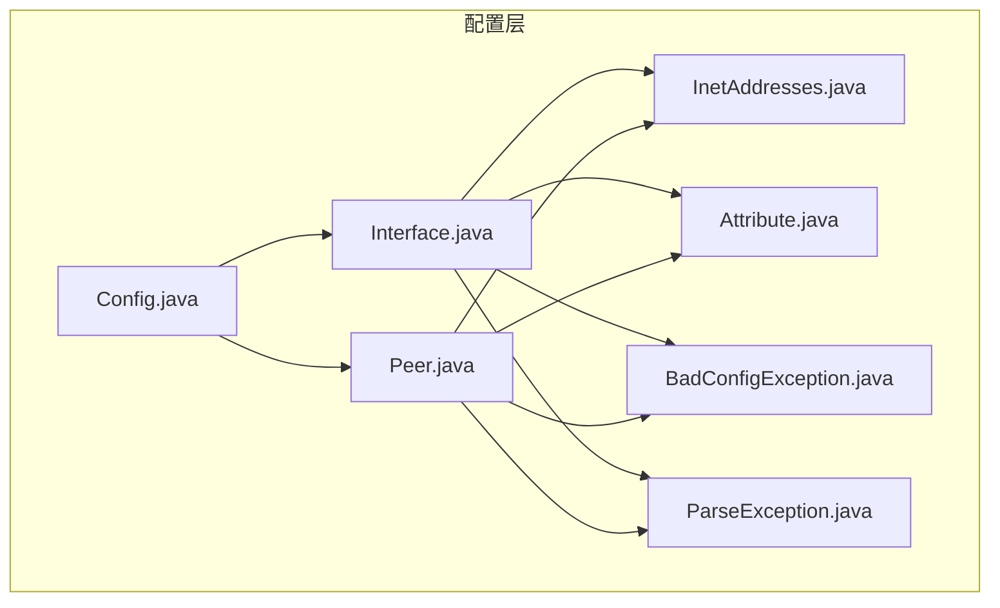
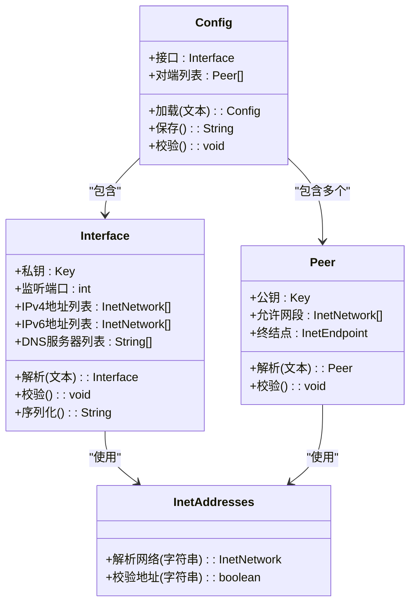
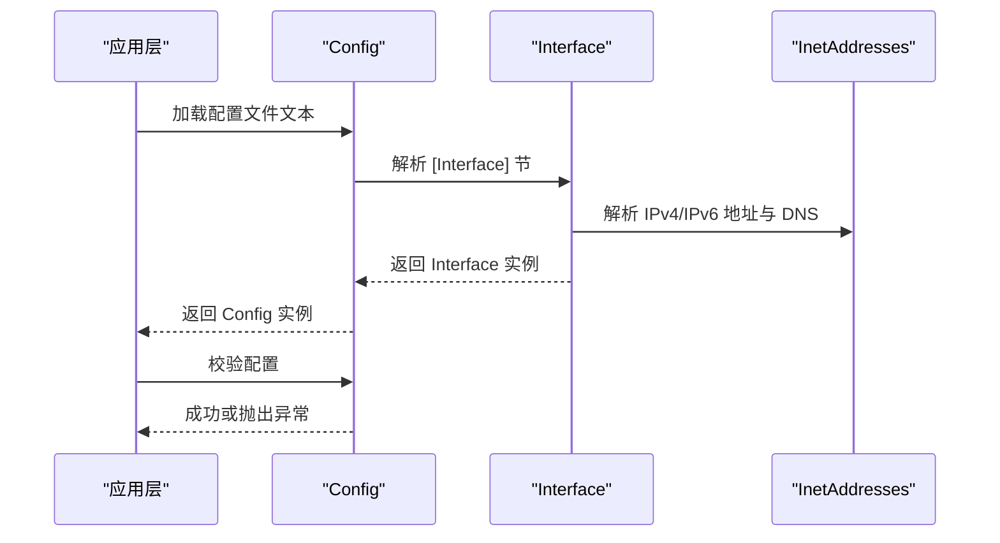
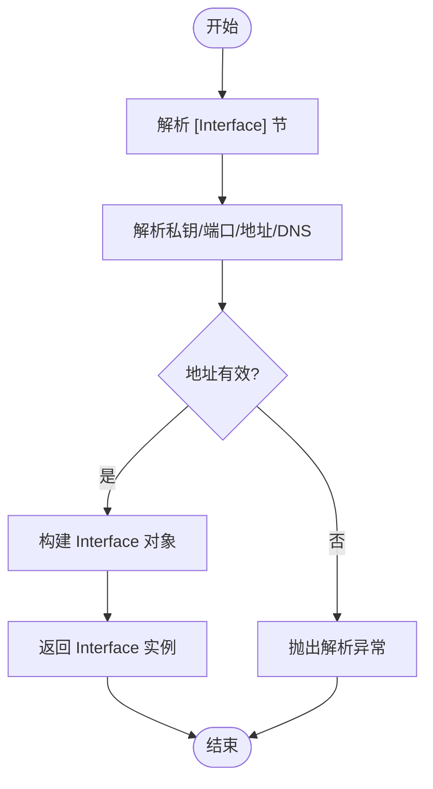
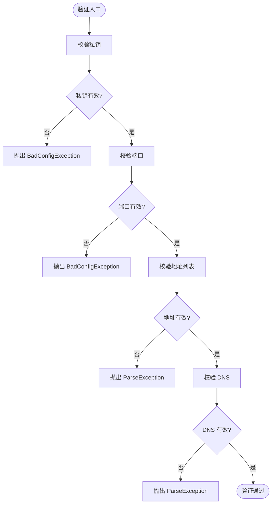
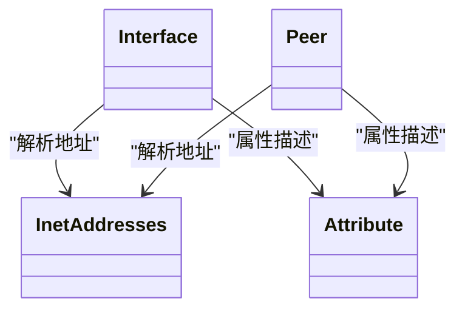
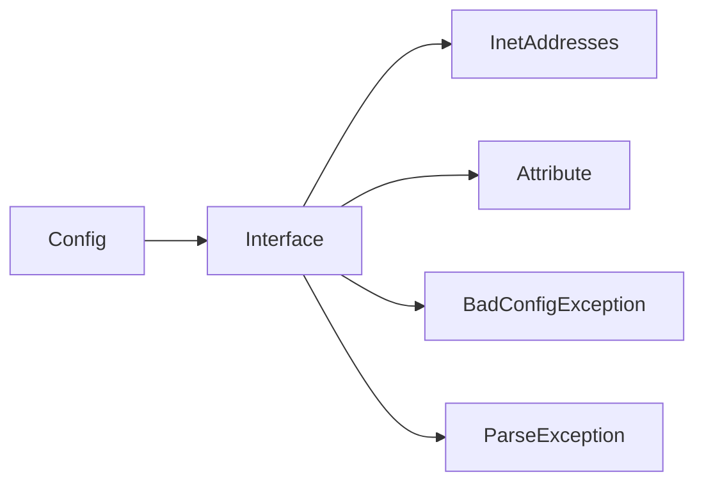

# Interface 配置类

<cite>
**本文档引用的文件**   
- [Interface.java](file://tunnel/src/main/java/com/wireguard/config/Interface.java)
- [Config.java](file://tunnel/src/main/java/com/wireguard/config/Config.java)
- [InetAddresses.java](file://tunnel/src/main/java/com/wireguard/config/InetAddresses.java)
- [BadConfigException.java](file://tunnel/src/main/java/com/wireguard/config/BadConfigException.java)
- [ParseException.java](file://tunnel/src/main/java/com/wireguard/config/ParseException.java)
- [Peer.java](file://tunnel/src/main/java/com/wireguard/config/Peer.java)
- [Attribute.java](file://tunnel/src/main/java/com/wireguard/config/Attribute.java)
</cite>

## 目录
1. [简介](#简介)
2. [项目结构](#项目结构)
3. [核心组件](#核心组件)
4. [架构总览](#架构总览)
5. [详细组件分析](#详细组件分析)
6. [依赖关系分析](#依赖关系分析)
7. [性能考虑](#性能考虑)
8. [故障排查指南](#故障排查指南)
9. [结论](#结论)
10. [附录](#附录)

## 简介
本技术文档聚焦于 Interface 配置类，系统阐述其在 WireGuard Android 隧道配置中的职责、属性与行为。内容涵盖：
- 私钥设置、监听端口、IPv4/IPv6 地址分配与 DNS 服务器配置的语义、数据类型、验证规则与默认值
- Interface 与 Config 对象的关系及其在隧道配置中的作用
- 完整的 Interface 配置示例（基础与高级）
- 配置的序列化与反序列化机制
- 配置验证逻辑与错误处理
- 与其他配置实体（如 Peer）的关联关系

## 项目结构
Interface 配置相关代码位于 tunnel 模块的 config 包中，核心文件包括 Interface.java、Config.java、InetAddresses.java、Attribute.java 以及异常类型 BadConfigException.java 和 ParseException.java。这些文件共同实现配置解析、校验、转换与持久化能力。

**图表来源** 
- [Interface.java](file://tunnel/src/main/java/com/wireguard/config/Interface.java)
- [Config.java](file://tunnel/src/main/java/com/wireguard/config/Config.java)
- [InetAddresses.java](file://tunnel/src/main/java/com/wireguard/config/InetAddresses.java)
- [Attribute.java](file://tunnel/src/main/java/com/wireguard/config/Attribute.java)
- [BadConfigException.java](file://tunnel/src/main/java/com/wireguard/config/BadConfigException.java)
- [ParseException.java](file://tunnel/src/main/java/com/wireguard/config/ParseException.java)
- [Peer.java](file://tunnel/src/main/java/com/wireguard/config/Peer.java)

**章节来源**
- [Interface.java](file://tunnel/src/main/java/com/wireguard/config/Interface.java)
- [Config.java](file://tunnel/src/main/java/com/wireguard/config/Config.java)
- [InetAddresses.java](file://tunnel/src/main/java/com/wireguard/config/InetAddresses.java)
- [Attribute.java](file://tunnel/src/main/java/com/wireguard/config/Attribute.java)
- [BadConfigException.java](file://tunnel/src/main/java/com/wireguard/config/BadConfigException.java)
- [ParseException.java](file://tunnel/src/main/java/com/wireguard/config/ParseException.java)
- [Peer.java](file://tunnel/src/main/java/com/wireguard/config/Peer.java)

## 核心组件
- Interface：定义隧道的本地端点与网络参数，包含私钥、监听端口、IPv4/IPv6 地址、DNS 等关键配置项，并提供解析、校验与序列化为配置文件的能力。
- Config：容器型配置对象，持有 Interface 与多个 Peer 实例，负责整体配置的加载、保存与一致性校验。
- InetAddresses：IP 地址与网络段解析工具，提供 IPv4/IPv6 字符串到网络对象的转换与校验。
- Attribute：通用属性键值模型，用于描述配置项的名称、类型与约束。
- BadConfigException / ParseException：配置解析与校验过程中的异常类型，分别表示结构性错误与语法/格式错误。
- Peer：对端节点配置，与 Interface 通过隧道建立安全连接，共享部分地址解析与属性模型。

**章节来源**
- [Interface.java](file://tunnel/src/main/java/com/wireguard/config/Interface.java)
- [Config.java](file://tunnel/src/main/java/com/wireguard/config/Config.java)
- [InetAddresses.java](file://tunnel/src/main/java/com/wireguard/config/InetAddresses.java)
- [Attribute.java](file://tunnel/src/main/java/com/wireguard/config/Attribute.java)
- [BadConfigException.java](file://tunnel/src/main/java/com/wireguard/config/BadConfigException.java)
- [ParseException.java](file://tunnel/src/main/java/com/wireguard/config/ParseException.java)
- [Peer.java](file://tunnel/src/main/java/com/wireguard/config/Peer.java)

## 架构总览
Interface 作为隧道本地端点的配置中心，承担以下职责：
- 解析配置文件中的 [Interface] 节，提取私钥、端口、地址、DNS 等字段
- 校验字段的合法性（如私钥长度、端口范围、地址前缀、DNS 格式）
- 将配置转换为内部数据结构，供上层应用或后端使用
- 将内部配置序列化为标准配置文件文本，便于存储与分享

**图表来源** 
- [Interface.java](file://tunnel/src/main/java/com/wireguard/config/Interface.java)
- [Config.java](file://tunnel/src/main/java/com/wireguard/config/Config.java)
- [InetAddresses.java](file://tunnel/src/main/java/com/wireguard/config/InetAddresses.java)
- [Peer.java](file://tunnel/src/main/java/com/wireguard/config/Peer.java)

## 详细组件分析

### Interface 类的核心属性与配置选项
- 私钥
  - 数据类型：加密密钥对象（Key）
  - 验证规则：必须为有效的 Curve25519 私钥；长度与编码需符合规范
  - 默认值：无（必填）
  - 作用：标识本地端点身份，用于生成会话密钥
- 监听端口
  - 数据类型：整数（端口号）
  - 验证规则：取值范围需在合法端口区间内；若未指定，通常由系统动态分配
  - 默认值：未指定时采用系统分配策略
  - 作用：决定 UDP 监听端口，用于接收对端入站数据报
- IPv4/IPv6 地址分配
  - 数据类型：IPv4/IPv6 网络段列表（InetNetwork）
  - 验证规则：每个条目必须是有效 CIDR 表示的网络段；IPv4 与 IPv6 不得混用同一列表
  - 默认值：空列表（可选）
  - 作用：为隧道虚拟网卡分配 IP 地址，并影响路由表
- DNS 服务器
  - 数据类型：字符串列表（DNS 服务器地址）
  - 验证规则：每个条目必须是合法的 IPv4/IPv6 地址或主机名（取决于解析器支持）
  - 默认值：空列表（可选）
  - 作用：为设备设置 DNS 服务器，影响域名解析路径

**章节来源**
- [Interface.java](file://tunnel/src/main/java/com/wireguard/config/Interface.java)
- [InetAddresses.java](file://tunnel/src/main/java/com/wireguard/config/InetAddresses.java)

### Interface 与 Config 对象的关系及作用
- Config 是顶层配置容器，持有 Interface 与多个 Peer 实例
- Interface 定义本地端点参数，Peer 定义对端参数；两者共同构成一个完整隧道
- Config 负责整体配置的加载、保存与一致性校验，确保 Interface 与 Peer 之间的匹配性（如允许的网段、终结点可达性等）

**图表来源** 
- [Config.java](file://tunnel/src/main/java/com/wireguard/config/Config.java)
- [Interface.java](file://tunnel/src/main/java/com/wireguard/config/Interface.java)
- [InetAddresses.java](file://tunnel/src/main/java/com/wireguard/config/InetAddresses.java)

**章节来源**
- [Config.java](file://tunnel/src/main/java/com/wireguard/config/Config.java)
- [Interface.java](file://tunnel/src/main/java/com/wireguard/config/Interface.java)

### 配置示例（基础与高级）
- 基本配置
  - 包含私钥、监听端口、至少一个 IPv4 或 IPv6 地址
  - 适用于单栈网络环境的基础隧道
- 高级配置
  - 同时配置 IPv4 与 IPv6 地址，启用双栈
  - 设置 DNS 服务器以控制域名解析
  - 结合多个 Peer 实现复杂拓扑（多对端、不同网段）

注意：示例仅说明字段组合与用途，具体文本格式请参考配置文件规范与解析器实现。

**章节来源**
- [Interface.java](file://tunnel/src/main/java/com/wireguard/config/Interface.java)
- [Config.java](file://tunnel/src/main/java/com/wireguard/config/Config.java)

### 序列化与反序列化机制
- 反序列化
  - 从配置文件文本中识别 [Interface] 节
  - 按属性键解析私钥、端口、地址、DNS 等字段
  - 调用 InetAddresses 进行地址与网络段校验
  - 构建 Interface 实例并返回给 Config
- 序列化
  - 将 Interface 的属性写回配置文件文本
  - 保持字段顺序与注释友好性（由实现决定）
  - 输出可用于持久化或分享的标准化文本

**图表来源** 
- [Interface.java](file://tunnel/src/main/java/com/wireguard/config/Interface.java)
- [InetAddresses.java](file://tunnel/src/main/java/com/wireguard/config/InetAddresses.java)
- [ParseException.java](file://tunnel/src/main/java/com/wireguard/config/ParseException.java)

**章节来源**
- [Interface.java](file://tunnel/src/main/java/com/wireguard/config/Interface.java)
- [InetAddresses.java](file://tunnel/src/main/java/com/wireguard/config/InetAddresses.java)
- [ParseException.java](file://tunnel/src/main/java/com/wireguard/config/ParseException.java)

### 配置验证逻辑与错误处理
- 验证逻辑
  - 私钥有效性检查（长度、编码、曲线类型）
  - 端口范围检查（是否在合法区间）
  - 地址前缀检查（CIDR 格式、IPv4/IPv6 分离）
  - DNS 格式检查（地址或主机名）
- 错误处理
  - 结构性错误：使用 BadConfigException 表示配置缺失或结构不合法
  - 语法/格式错误：使用 ParseException 表示字段值不符合预期格式
  - 校验失败时抛出相应异常，阻止无效配置进入运行时

**图表来源** 
- [Interface.java](file://tunnel/src/main/java/com/wireguard/config/Interface.java)
- [BadConfigException.java](file://tunnel/src/main/java/com/wireguard/config/BadConfigException.java)
- [ParseException.java](file://tunnel/src/main/java/com/wireguard/config/ParseException.java)

**章节来源**
- [Interface.java](file://tunnel/src/main/java/com/wireguard/config/Interface.java)
- [BadConfigException.java](file://tunnel/src/main/java/com/wireguard/config/BadConfigException.java)
- [ParseException.java](file://tunnel/src/main/java/com/wireguard/config/ParseException.java)

### 与其他配置实体的关联关系
- Interface 与 Peer
  - 通过允许的网段与终结点进行关联；Peer 的配置需与 Interface 的地址空间一致
  - Config 负责整体一致性校验，确保隧道两端可互通
- Interface 与 InetAddresses
  - 地址与网络段解析依赖 InetAddresses 提供的工具方法
- Interface 与 Attribute
  - 配置项以 Attribute 形式描述键名、类型与约束，便于统一解析与校验

**图表来源** 
- [Interface.java](file://tunnel/src/main/java/com/wireguard/config/Interface.java)
- [Peer.java](file://tunnel/src/main/java/com/wireguard/config/Peer.java)
- [InetAddresses.java](file://tunnel/src/main/java/com/wireguard/config/InetAddresses.java)
- [Attribute.java](file://tunnel/src/main/java/com/wireguard/config/Attribute.java)

**章节来源**
- [Interface.java](file://tunnel/src/main/java/com/wireguard/config/Interface.java)
- [Peer.java](file://tunnel/src/main/java/com/wireguard/config/Peer.java)
- [InetAddresses.java](file://tunnel/src/main/java/com/wireguard/config/InetAddresses.java)
- [Attribute.java](file://tunnel/src/main/java/com/wireguard/config/Attribute.java)

## 依赖关系分析
- Interface 依赖 InetAddresses 进行地址与网络段解析
- Interface 依赖 Attribute 描述配置项元数据
- Interface 与 Config 紧密耦合，Config 管理 Interface 的生命周期与校验
- 异常类型 BadConfigException 与 ParseException 贯穿解析与校验流程

**图表来源** 
- [Interface.java](file://tunnel/src/main/java/com/wireguard/config/Interface.java)
- [Config.java](file://tunnel/src/main/java/com/wireguard/config/Config.java)
- [InetAddresses.java](file://tunnel/src/main/java/com/wireguard/config/InetAddresses.java)
- [Attribute.java](file://tunnel/src/main/java/com/wireguard/config/Attribute.java)
- [BadConfigException.java](file://tunnel/src/main/java/com/wireguard/config/BadConfigException.java)
- [ParseException.java](file://tunnel/src/main/java/com/wireguard/config/ParseException.java)

**章节来源**
- [Interface.java](file://tunnel/src/main/java/com/wireguard/config/Interface.java)
- [Config.java](file://tunnel/src/main/java/com/wireguard/config/Config.java)
- [InetAddresses.java](file://tunnel/src/main/java/com/wireguard/config/InetAddresses.java)
- [Attribute.java](file://tunnel/src/main/java/com/wireguard/config/Attribute.java)
- [BadConfigException.java](file://tunnel/src/main/java/com/wireguard/config/BadConfigException.java)
- [ParseException.java](file://tunnel/src/main/java/com/wireguard/config/ParseException.java)

## 性能考虑
- 地址解析与校验应在加载阶段完成，避免运行时重复计算
- 大量 Peer 场景下，建议缓存解析结果以减少重复开销
- 配置文件解析应避免不必要的字符串操作，提升解析效率

[本节为通用指导，无需引用具体文件]

## 故障排查指南
- 私钥无效
  - 现象：解析或校验阶段抛出异常
  - 排查：确认私钥编码与长度是否符合规范
- 端口非法
  - 现象：端口超出合法范围导致校验失败
  - 排查：检查端口数值与系统限制
- 地址格式错误
  - 现象：CIDR 表示不正确或 IPv4/IPv6 混用
  - 排查：逐条校验地址前缀与协议族
- DNS 不可达或格式错误
  - 现象：DNS 解析失败或格式不合法
  - 排查：确认 DNS 地址或主机名是否正确

**章节来源**
- [BadConfigException.java](file://tunnel/src/main/java/com/wireguard/config/BadConfigException.java)
- [ParseException.java](file://tunnel/src/main/java/com/wireguard/config/ParseException.java)
- [Interface.java](file://tunnel/src/main/java/com/wireguard/config/Interface.java)

## 结论
Interface 配置类是 WireGuard Android 隧道配置的核心，负责本地端点的身份、网络与解析参数管理。通过与 Config、InetAddresses、Peer 等组件协作，实现了完整的配置解析、校验与序列化能力。遵循本文档所述的数据类型、验证规则与最佳实践，可有效提升配置的可靠性与可维护性。

[本节为总结性内容，无需引用具体文件]

## 附录
- 术语表
  - 私钥：Curve25519 椭圆曲线私钥，用于身份认证与密钥协商
  - 监听端口：UDP 端口，用于接收对端数据报
  - CIDR：无类别域间路由表示法，用于描述 IP 地址段
  - DNS：域名解析服务，用于将域名映射为 IP 地址

[本节为概念性内容，无需引用具体文件]