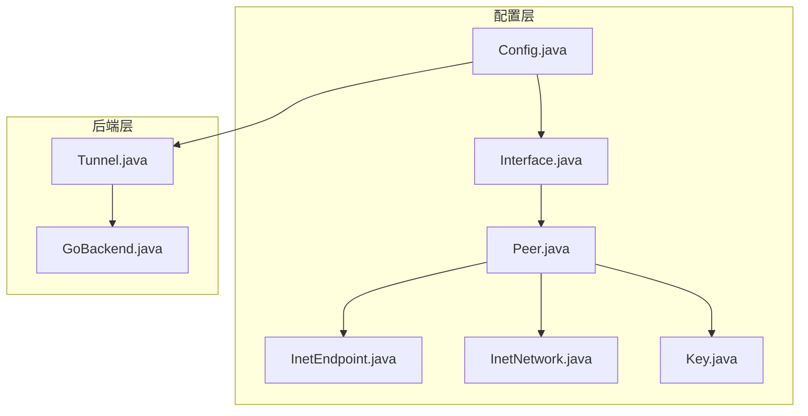
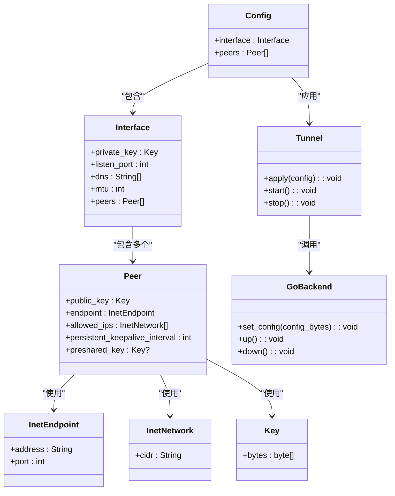
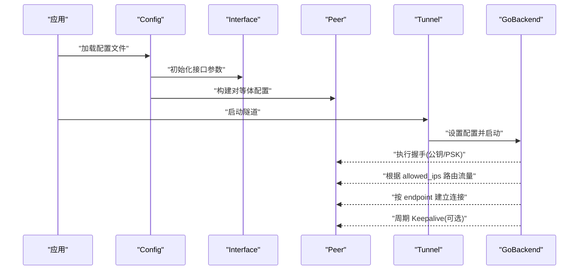
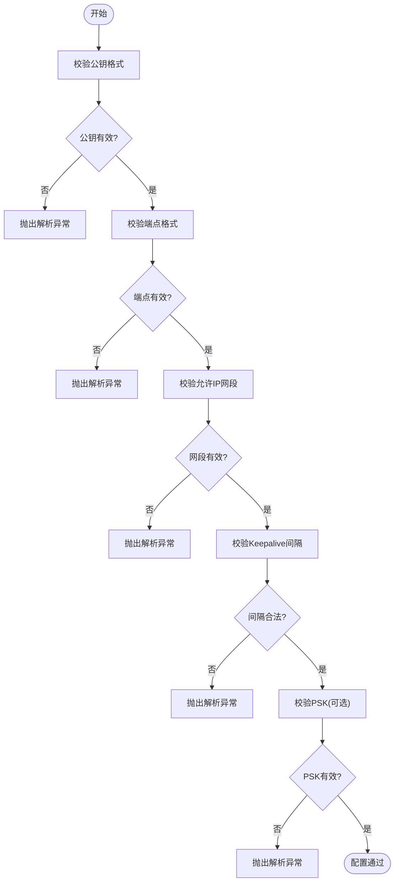
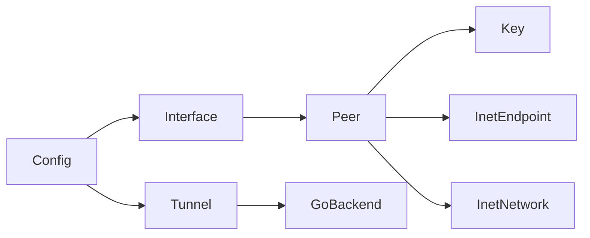

# Peer 配置类

<cite>
**本文引用的文件**   
- [Peer.java](file://tunnel/src/main/java/com/wireguard/config/Peer.java)
- [Interface.java](file://tunnel/src/main/java/com/wireguard/config/Interface.java)
- [Config.java](file://tunnel/src/main/java/com/wireguard/config/Config.java)
- [InetEndpoint.java](file://tunnel/src/main/java/com/wireguard/config/InetEndpoint.java)
- [InetNetwork.java](file://tunnel/src/main/java/com/wireguard/config/InetNetwork.java)
- [Key.java](file://tunnel/src/main/java/com/wireguard/crypto/Key.java)
- [BadConfigException.java](file://tunnel/src/main/java/com/wireguard/config/BadConfigException.java)
- [ParseException.java](file://tunnel/src/main/java/com/wireguard/config/ParseException.java)
- [Tunnel.java](file://tunnel/src/main/java/com/wireguard/android/backend/Tunnel.java)
- [GoBackend.java](file://tunnel/src/main/java/com/wireguard/android/backend/GoBackend.java)
</cite>

## 目录
1. [简介](#简介)
2. [项目结构](#项目结构)
3. [核心组件](#核心组件)
4. [架构总览](#架构总览)
5. [详细组件分析](#详细组件分析)
6. [依赖关系分析](#依赖关系分析)
7. [性能考虑](#性能考虑)
8. [故障排查指南](#故障排查指南)
9. [结论](#结论)
10. [附录](#附录)

## 简介
本技术文档聚焦于 WireGuard Android 中的 Peer 配置类，系统阐述对等体（Peer）的配置属性、数据格式与校验规则，以及与 Interface 的关联关系和通信机制。内容涵盖公钥、端点（单端点/多端点）、允许 IP 列表、持久保持连接（PersistentKeepalive）和预共享密钥（PresharedKey），并给出完整配置示例、依赖约束、对等体发现与连接管理流程，以及安全最佳实践。

## 项目结构
与 Peer 配置相关的核心代码位于 tunnel 模块的 config 包中，同时涉及 crypto 包的密钥类型与后端交互的 Tunnel/GoBackend 实现。

图表来源
- [Config.java](file://tunnel/src/main/java/com/wireguard/config/Config.java)
- [Interface.java](file://tunnel/src/main/java/com/wireguard/config/Interface.java)
- [Peer.java](file://tunnel/src/main/java/com/wireguard/config/Peer.java)
- [InetEndpoint.java](file://tunnel/src/main/java/com/wireguard/config/InetEndpoint.java)
- [InetNetwork.java](file://tunnel/src/main/java/com/wireguard/config/InetNetwork.java)
- [Key.java](file://tunnel/src/main/java/com/wireguard/crypto/Key.java)
- [Tunnel.java](file://tunnel/src/main/java/com/wireguard/android/backend/Tunnel.java)
- [GoBackend.java](file://tunnel/src/main/java/com/wireguard/android/backend/GoBackend.java)

章节来源
- [Peer.java](file://tunnel/src/main/java/com/wireguard/config/Peer.java)
- [Interface.java](file://tunnel/src/main/java/com/wireguard/config/Interface.java)
- [Config.java](file://tunnel/src/main/java/com/wireguard/config/Config.java)
- [InetEndpoint.java](file://tunnel/src/main/java/com/wireguard/config/InetEndpoint.java)
- [InetNetwork.java](file://tunnel/src/main/java/com/wireguard/config/InetNetwork.java)
- [Key.java](file://tunnel/src/main/java/com/wireguard/crypto/Key.java)
- [Tunnel.java](file://tunnel/src/main/java/com/wireguard/android/backend/Tunnel.java)
- [GoBackend.java](file://tunnel/src/main/java/com/wireguard/android/backend/GoBackend.java)

## 核心组件
- Peer：定义单个对等体的配置项，包括公钥、端点集合、允许 IP、持久保持连接与可选预共享密钥。
- Interface：定义本地接口配置（如私钥、监听端口、DNS、MTU 等），并与多个 Peer 建立关联。
- InetEndpoint：表示一个网络端点（地址+端口）。
- InetNetwork：表示允许的 IPv4/IPv6 网段。
- Key：封装 Curve25519 公钥/私钥/预共享密钥等二进制密钥类型。
- Config：包含 Interface 与 Peer 列表，负责整体配置的解析与校验。
- Tunnel/GoBackend：将配置下发到内核或 Go 实现的 WireGuard 后端，驱动实际连接与流量转发。

章节来源
- [Peer.java](file://tunnel/src/main/java/com/wireguard/config/Peer.java)
- [Interface.java](file://tunnel/src/main/java/com/wireguard/config/Interface.java)
- [Config.java](file://tunnel/src/main/java/com/wireguard/config/Config.java)
- [InetEndpoint.java](file://tunnel/src/main/java/com/wireguard/config/InetEndpoint.java)
- [InetNetwork.java](file://tunnel/src/main/java/com/wireguard/config/InetNetwork.java)
- [Key.java](file://tunnel/src/main/java/com/wireguard/crypto/Key.java)
- [Tunnel.java](file://tunnel/src/main/java/com/wireguard/android/backend/Tunnel.java)
- [GoBackend.java](file://tunnel/src/main/java/com/wireguard/android/backend/GoBackend.java)

## 架构总览
Peer 作为对等体配置单元，被 Interface 持有；Config 聚合 Interface 与 Peer 列表，最终通过 Tunnel/GoBackend 将配置写入底层 WireGuard 引擎，完成对等体间的加密隧道建立与数据转发。

图表来源
- [Config.java](file://tunnel/src/main/java/com/wireguard/config/Config.java)
- [Interface.java](file://tunnel/src/main/java/com/wireguard/config/Interface.java)
- [Peer.java](file://tunnel/src/main/java/com/wireguard/config/Peer.java)
- [InetEndpoint.java](file://tunnel/src/main/java/com/wireguard/config/InetEndpoint.java)
- [InetNetwork.java](file://tunnel/src/main/java/com/wireguard/config/InetNetwork.java)
- [Key.java](file://tunnel/src/main/java/com/wireguard/crypto/Key.java)
- [Tunnel.java](file://tunnel/src/main/java/com/wireguard/android/backend/Tunnel.java)
- [GoBackend.java](file://tunnel/src/main/java/com/wireguard/android/backend/GoBackend.java)

## 详细组件分析

### Peer 配置属性详解
- 公钥（public_key）
  - 作用：标识对等体的身份，用于握手与加密协商。
  - 数据格式：Curve25519 公钥（Base64 编码字符串）。
  - 验证规则：长度与字符集校验；非法值抛出解析异常。
- 端点（endpoint）
  - 作用：指定对等体的可达地址与端口，支持 IPv4/IPv6。
  - 数据格式：host:port，host 可为域名、IPv4 或 IPv6 字面量。
  - 验证规则：端口范围合法；主机名解析失败时记录错误。
  - 多端点：可通过重复 endpoint 字段提供多个候选端点，客户端按策略选择。
- 允许 IP（allowed_ips）
  - 作用：声明该对等体可路由的网段，决定哪些流量经此对等体转发。
  - 数据格式：CIDR 表示法（如 10.0.0.0/24、::1/128）。
  - 验证规则：网段合法性检查；空列表通常不允许任何流量。
- 持久保持连接（persistent_keepalive_interval）
  - 作用：周期性发送 Keepalive 报文以维持 NAT 映射。
  - 数据格式：秒数整数；0 表示禁用。
  - 验证规则：非负整数；过大值可能影响功耗。
- 预共享密钥（preshared_key，可选）
  - 作用：在公钥交换基础上增加一层对称密钥，提升抗量子攻击能力。
  - 数据格式：Base64 编码的 32 字节密钥。
  - 验证规则：长度与字符集校验；与公钥配对使用。

章节来源
- [Peer.java](file://tunnel/src/main/java/com/wireguard/config/Peer.java)
- [InetEndpoint.java](file://tunnel/src/main/java/com/wireguard/config/InetEndpoint.java)
- [InetNetwork.java](file://tunnel/src/main/java/com/wireguard/config/InetNetwork.java)
- [Key.java](file://tunnel/src/main/java/com/wireguard/crypto/Key.java)

### Peer 与 Interface 的关联关系
- Interface 持有 private_key、listen_port、dns、mtu 等本地参数，并维护 peers 列表。
- 每个 Peer 必须提供 public_key；allowed_ips 决定路由策略；endpoint 提供可达性。
- Config 将 Interface 与 Peer 列表组合后下发至后端。

章节来源
- [Interface.java](file://tunnel/src/main/java/com/wireguard/config/Interface.java)
- [Config.java](file://tunnel/src/main/java/com/wireguard/config/Config.java)
- [Peer.java](file://tunnel/src/main/java/com/wireguard/config/Peer.java)

### 对等体通信机制
- 握手阶段：基于 Curve25519 公钥进行密钥交换，可选加入 PresharedKey 增强安全性。
- 路由阶段：根据 allowed_ips 匹配流量，经由选定 endpoint 建立加密通道。
- 保活阶段：若启用 persistent_keepalive，定时发送探测报文维持 NAT 状态。
- 多端点切换：当首选端点不可达时，自动尝试其他端点。

图表来源
- [Config.java](file://tunnel/src/main/java/com/wireguard/config/Config.java)
- [Interface.java](file://tunnel/src/main/java/com/wireguard/config/Interface.java)
- [Peer.java](file://tunnel/src/main/java/com/wireguard/config/Peer.java)
- [Tunnel.java](file://tunnel/src/main/java/com/wireguard/android/backend/Tunnel.java)
- [GoBackend.java](file://tunnel/src/main/java/com/wireguard/android/backend/GoBackend.java)

### 配置示例
- 单端点配置要点
  - 为每个 Peer 设置 public_key、endpoint、allowed_ips。
  - 如需 NAT 穿透，设置 persistent_keepalive_interval。
  - 可选添加 preshared_key。
- 多端点配置要点
  - 为同一 Peer 配置多个 endpoint，提高可用性。
  - 确保各端点可达且 allowed_ips 一致。
- 常见约束
  - public_key 必填且有效。
  - allowed_ips 至少包含一个合法网段。
  - endpoint 端口必须在合法范围内。
  - persistent_keepalive_interval 为非负整数。

章节来源
- [Peer.java](file://tunnel/src/main/java/com/wireguard/config/Peer.java)
- [InetEndpoint.java](file://tunnel/src/main/java/com/wireguard/config/InetEndpoint.java)
- [InetNetwork.java](file://tunnel/src/main/java/com/wireguard/config/InetNetwork.java)

### 依赖关系与约束条件
- Peer 依赖 Key（公钥/PSK）、InetEndpoint（可达性）、InetNetwork（路由）。
- Interface 依赖 Peer 列表形成拓扑。
- Config 依赖 Interface 与 Peer 列表生成最终配置。
- 校验失败将抛出 BadConfigException 或 ParseException。

图表来源
- [Peer.java](file://tunnel/src/main/java/com/wireguard/config/Peer.java)
- [BadConfigException.java](file://tunnel/src/main/java/com/wireguard/config/BadConfigException.java)
- [ParseException.java](file://tunnel/src/main/java/com/wireguard/config/ParseException.java)

### 对等体发现与连接管理
- 对等体发现：由配置静态声明，无需动态发现协议；可通过 DNS 或域名解析实现端点更新。
- 连接管理：后端维护连接状态，支持多端点切换、保活、重连与统计。
- 路由策略：依据 allowed_ips 精确匹配流量路径。

章节来源
- [Peer.java](file://tunnel/src/main/java/com/wireguard/config/Peer.java)
- [Tunnel.java](file://tunnel/src/main/java/com/wireguard/android/backend/Tunnel.java)
- [GoBackend.java](file://tunnel/src/main/java/com/wireguard/android/backend/GoBackend.java)

### 安全相关配置与最佳实践
- 使用强随机私钥与公钥，避免弱密钥。
- 建议启用 PresharedKey 以增强安全性。
- 合理设置 allowed_ips，最小化暴露面。
- 谨慎配置 persistent_keepalive_interval，平衡连通性与功耗。
- 定期轮换密钥，限制端点访问范围。

章节来源
- [Key.java](file://tunnel/src/main/java/com/wireguard/crypto/Key.java)
- [Peer.java](file://tunnel/src/main/java/com/wireguard/config/Peer.java)

## 依赖关系分析
- 组件耦合
  - Peer 与 InetEndpoint、InetNetwork、Key 高内聚。
  - Interface 聚合多个 Peer，形成拓扑。
  - Config 统一编排 Interface 与 Peer。
- 外部依赖
  - 后端通过 Tunnel/GoBackend 与内核或 Go 实现交互。
- 潜在循环依赖
  - 当前结构无循环依赖；配置单向流向后端。

图表来源
- [Peer.java](file://tunnel/src/main/java/com/wireguard/config/Peer.java)
- [Interface.java](file://tunnel/src/main/java/com/wireguard/config/Interface.java)
- [Config.java](file://tunnel/src/main/java/com/wireguard/config/Config.java)
- [Tunnel.java](file://tunnel/src/main/java/com/wireguard/android/backend/Tunnel.java)
- [GoBackend.java](file://tunnel/src/main/java/com/wireguard/android/backend/GoBackend.java)

章节来源
- [Peer.java](file://tunnel/src/main/java/com/wireguard/config/Peer.java)
- [Interface.java](file://tunnel/src/main/java/com/wireguard/config/Interface.java)
- [Config.java](file://tunnel/src/main/java/com/wireguard/config/Config.java)
- [Tunnel.java](file://tunnel/src/main/java/com/wireguard/android/backend/Tunnel.java)
- [GoBackend.java](file://tunnel/src/main/java/com/wireguard/android/backend/GoBackend.java)

## 性能考虑
- 多端点可减少重连开销，提升可用性。
- 合理的 allowed_ips 减少不必要的路由计算。
- persistent_keepalive 不宜过大，避免频繁心跳导致功耗上升。
- 大流量场景下关注后端统计与日志，定位瓶颈。

[本节为通用指导，不直接分析具体文件]

## 故障排查指南
- 解析异常
  - 公钥/PSK 格式错误：检查 Base64 编码与长度。
  - 端点无效：确认 host:port 格式与端口范围。
  - 网段非法：检查 CIDR 表示法与掩码。
- 连接问题
  - 端点不可达：检查网络连通性与防火墙策略。
  - NAT 穿透失败：适当增大 persistent_keepalive_interval。
  - 路由不生效：核对 allowed_ips 是否覆盖目标网段。
- 工具与日志
  - 查看后端日志与统计信息，定位握手与数据转发问题。

章节来源
- [BadConfigException.java](file://tunnel/src/main/java/com/wireguard/config/BadConfigException.java)
- [ParseException.java](file://tunnel/src/main/java/com/wireguard/config/ParseException.java)
- [Tunnel.java](file://tunnel/src/main/java/com/wireguard/android/backend/Tunnel.java)
- [GoBackend.java](file://tunnel/src/main/java/com/wireguard/android/backend/GoBackend.java)

## 结论
Peer 配置类是 WireGuard Android 中对等体配置的核心，围绕公钥、端点、允许 IP、持久保持连接与可选预共享密钥构建完整的对等体描述。通过与 Interface 的组合与后端交互，实现稳定、安全的加密隧道通信。遵循本文的配置规范与安全最佳实践，可有效提升连通性与安全性。

[本节为总结，不直接分析具体文件]

## 附录
- 术语
  - 对等体（Peer）：隧道的另一端实体。
  - 端点（Endpoint）：对等体的可达地址与端口。
  - 允许 IP（Allowed IPs）：经该对等体转发的网段。
  - 持久保持连接（Persistent Keepalive）：周期性保活机制。
  - 预共享密钥（Preshared Key）：附加对称密钥增强安全。
- 参考
  - 配置解析与校验：参见 Peer、Interface、Config 的实现。
  - 后端交互：参见 Tunnel、GoBackend 的实现。

[本节为补充说明，不直接分析具体文件]