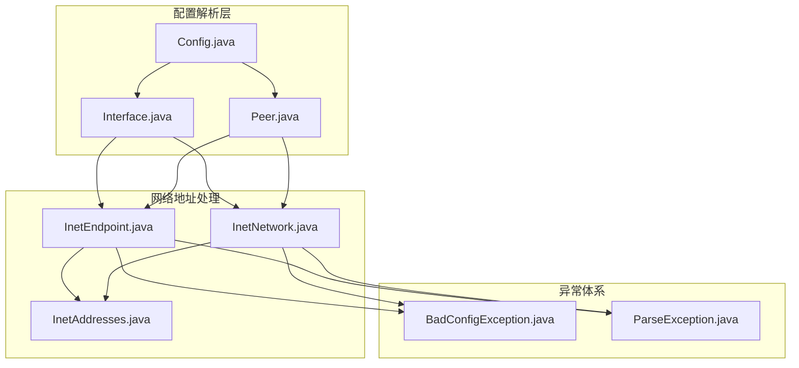
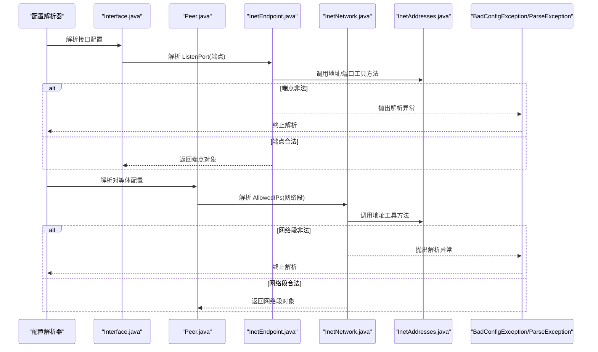
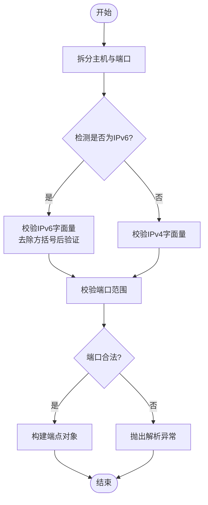
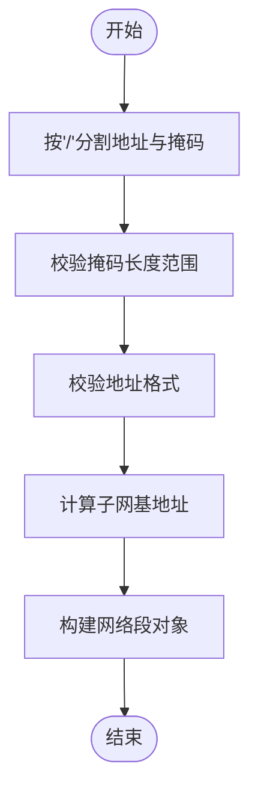
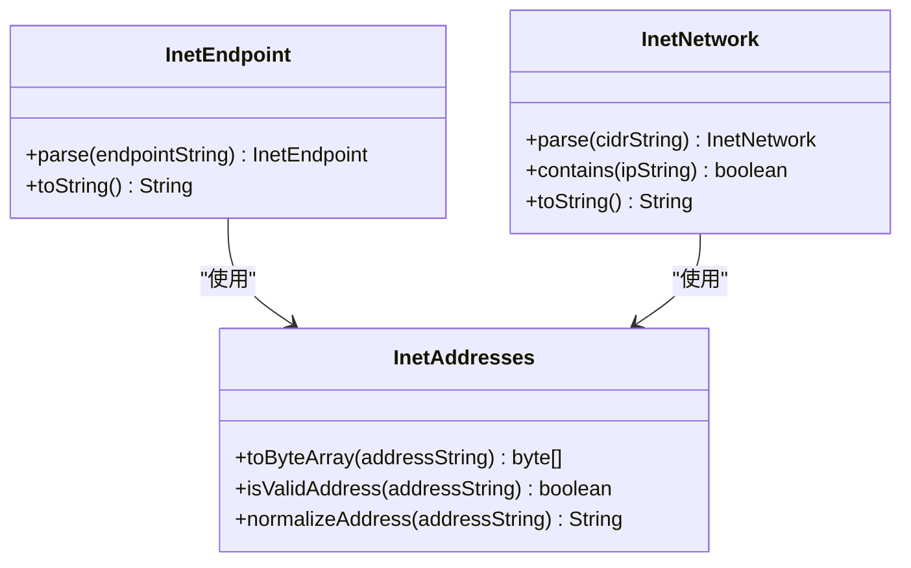
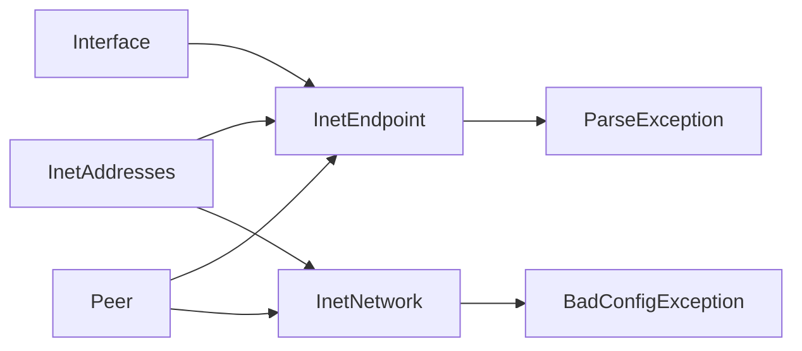

# 网络地址处理

<cite>
**本文引用的文件**   
- [InetEndpoint.java](file://tunnel/src/main/java/com/wireguard/config/InetEndpoint.java)
- [InetNetwork.java](file://tunnel/src/main/java/com/wireguard/config/InetNetwork.java)
- [InetAddresses.java](file://tunnel/src/main/java/com/wireguard/config/InetAddresses.java)
- [Config.java](file://tunnel/src/main/java/com/wireguard/config/Config.java)
- [Interface.java](file://tunnel/src/main/java/com/wireguard/config/Interface.java)
- [Peer.java](file://tunnel/src/main/java/com/wireguard/config/Peer.java)
- [BadConfigException.java](file://tunnel/src/main/java/com/wireguard/config/BadConfigException.java)
- [ParseException.java](file://tunnel/src/main/java/com/wireguard/config/ParseException.java)
</cite>

## 目录
1. [简介](#简介)
2. [项目结构](#项目结构)
3. [核心组件](#核心组件)
4. [架构总览](#架构总览)
5. [详细组件分析](#详细组件分析)
6. [依赖关系分析](#依赖关系分析)
7. [性能考虑](#性能考虑)
8. [故障排查指南](#故障排查指南)
9. [结论](#结论)
10. [附录](#附录)

## 简介
本技术文档聚焦于 WireGuard Android 配置解析中的网络地址处理模块，围绕以下三类核心类展开：
- InetEndpoint：端点（IP:Port）的解析与校验，支持 IPv4/IPv6 及端口范围。
- InetNetwork：网络段（CIDR）表示、子网计算与包含性判断。
- InetAddresses：地址转换与验证工具方法，提供字符串到字节数组等常用操作。

文档将系统阐述这些类的职责边界、数据流、错误处理策略、序列化/反序列化机制，以及与 Android 网络 API 的集成方式。同时给出完整的配置示例与校验规则说明，帮助开发者快速理解并正确使用该模块。

## 项目结构
网络地址相关代码位于 tunnel 模块的配置包中，主要文件如下：
- InetEndpoint.java：端点模型与解析逻辑
- InetNetwork.java：网络段模型与 CIDR 计算
- InetAddresses.java：地址工具方法
- Config.java / Interface.java / Peer.java：配置项对端点与网络的引用
- BadConfigException.java / ParseException.java：配置解析异常类型

图表来源
- [Config.java](file://tunnel/src/main/java/com/wireguard/config/Config.java)
- [Interface.java](file://tunnel/src/main/java/com/wireguard/config/Interface.java)
- [Peer.java](file://tunnel/src/main/java/com/wireguard/config/Peer.java)
- [InetEndpoint.java](file://tunnel/src/main/java/com/wireguard/config/InetEndpoint.java)
- [InetNetwork.java](file://tunnel/src/main/java/com/wireguard/config/InetNetwork.java)
- [InetAddresses.java](file://tunnel/src/main/java/com/wireguard/config/InetAddresses.java)
- [BadConfigException.java](file://tunnel/src/main/java/com/wireguard/config/BadConfigException.java)
- [ParseException.java](file://tunnel/src/main/java/com/wireguard/config/ParseException.java)

章节来源
- [Config.java](file://tunnel/src/main/java/com/wireguard/config/Config.java)
- [Interface.java](file://tunnel/src/main/java/com/wireguard/config/Interface.java)
- [Peer.java](file://tunnel/src/main/java/com/wireguard/config/Peer.java)
- [InetEndpoint.java](file://tunnel/src/main/java/com/wireguard/config/InetEndpoint.java)
- [InetNetwork.java](file://tunnel/src/main/java/com/wireguard/config/InetNetwork.java)
- [InetAddresses.java](file://tunnel/src/main/java/com/wireguard/config/InetAddresses.java)
- [BadConfigException.java](file://tunnel/src/main/java/com/wireguard/config/BadConfigException.java)
- [ParseException.java](file://tunnel/src/main/java/com/wireguard/config/ParseException.java)

## 核心组件
本节概述三大核心类的职责与交互关系：
- InetEndpoint：负责“主机:端口”形式的端点解析与校验，包括 IPv4/IPv6 字面量、方括号包裹的 IPv6 以及端口合法性检查。
- InetNetwork：负责“地址/CIDR”形式的网络段解析与计算，如掩码长度有效性、子网基地址推导、包含性判断等。
- InetAddresses：提供通用地址工具方法，如字符串到字节数组转换、格式校验、常见转换辅助函数。

章节来源
- [InetEndpoint.java](file://tunnel/src/main/java/com/wireguard/config/InetEndpoint.java)
- [InetNetwork.java](file://tunnel/src/main/java/com/wireguard/config/InetNetwork.java)
- [InetAddresses.java](file://tunnel/src/main/java/com/wireguard/config/InetAddresses.java)

## 架构总览
下图展示了配置解析过程中，端点与网络段的创建、校验与使用路径，以及异常抛出点。

图表来源
- [InetEndpoint.java](file://tunnel/src/main/java/com/wireguard/config/InetEndpoint.java)
- [InetNetwork.java](file://tunnel/src/main/java/com/wireguard/config/InetNetwork.java)
- [InetAddresses.java](file://tunnel/src/main/java/com/wireguard/config/InetAddresses.java)
- [Interface.java](file://tunnel/src/main/java/com/wireguard/config/Interface.java)
- [Peer.java](file://tunnel/src/main/java/com/wireguard/config/Peer.java)
- [BadConfigException.java](file://tunnel/src/main/java/com/wireguard/config/BadConfigException.java)
- [ParseException.java](file://tunnel/src/main/java/com/wireguard/config/ParseException.java)

## 详细组件分析

### InetEndpoint：端点解析与验证
- 功能要点
  - 支持 IPv4 字面量与 IPv6 字面量（含方括号包裹）。
  - 端口范围校验（有效区间与越界处理）。
  - 提供字符串到端点的解析方法与反向序列化方法。
  - 在解析失败时抛出配置或解析异常。
- 关键流程
  - 输入字符串拆分为主机与端口两部分。
  - 根据是否包含冒号与方括号判断 IPv6 或 IPv4。
  - 校验端口数值范围与格式。
  - 构造不可变端点对象并返回。
- 错误处理
  - 非法格式或越界端口触发异常，便于上层统一捕获与提示。

图表来源
- [InetEndpoint.java](file://tunnel/src/main/java/com/wireguard/config/InetEndpoint.java)
- [InetAddresses.java](file://tunnel/src/main/java/com/wireguard/config/InetAddresses.java)
- [ParseException.java](file://tunnel/src/main/java/com/wireguard/config/ParseException.java)
- [BadConfigException.java](file://tunnel/src/main/java/com/wireguard/config/BadConfigException.java)

章节来源
- [InetEndpoint.java](file://tunnel/src/main/java/com/wireguard/config/InetEndpoint.java)
- [InetAddresses.java](file://tunnel/src/main/java/com/wireguard/config/InetAddresses.java)
- [ParseException.java](file://tunnel/src/main/java/com/wireguard/config/ParseException.java)
- [BadConfigException.java](file://tunnel/src/main/java/com/wireguard/config/BadConfigException.java)

### InetNetwork：网络段与 CIDR 处理
- 功能要点
  - 支持 CIDR 表示法（如 192.168.1.0/24、::/0）。
  - 计算子网基地址与掩码长度有效性。
  - 提供包含性判断（某 IP 是否属于该网络段）。
  - 提供字符串解析与序列化方法。
- 关键流程
  - 按斜杠分割地址与掩码长度。
  - 校验掩码长度范围与地址格式。
  - 推导子网基地址（必要时进行位运算）。
  - 构造不可变网络段对象。
- 错误处理
  - 非法 CIDR 或越界掩码触发异常，确保配置一致性。

图表来源
- [InetNetwork.java](file://tunnel/src/main/java/com/wireguard/config/InetNetwork.java)
- [InetAddresses.java](file://tunnel/src/main/java/com/wireguard/config/InetAddresses.java)
- [ParseException.java](file://tunnel/src/main/java/com/wireguard/config/ParseException.java)
- [BadConfigException.java](file://tunnel/src/main/java/com/wireguard/config/BadConfigException.java)

章节来源
- [InetNetwork.java](file://tunnel/src/main/java/com/wireguard/config/InetNetwork.java)
- [InetAddresses.java](file://tunnel/src/main/java/com/wireguard/config/InetAddresses.java)
- [ParseException.java](file://tunnel/src/main/java/com/wireguard/config/ParseException.java)
- [BadConfigException.java](file://tunnel/src/main/java/com/wireguard/config/BadConfigException.java)

### InetAddresses：地址转换与验证工具
- 功能要点
  - 提供字符串到字节数组的转换方法（用于底层网络栈或加密模块）。
  - 提供地址格式校验与规范化方法。
  - 封装常见的 IPv4/IPv6 处理细节，供端点与网络段复用。
- 典型用法
  - 端点解析时调用地址校验与转换。
  - 网络段解析时调用地址格式验证与掩码计算。
- 错误处理
  - 非法地址字符串抛出解析异常，保证上层调用安全。

图表来源
- [InetAddresses.java](file://tunnel/src/main/java/com/wireguard/config/InetAddresses.java)
- [InetEndpoint.java](file://tunnel/src/main/java/com/wireguard/config/InetEndpoint.java)
- [InetNetwork.java](file://tunnel/src/main/java/com/wireguard/config/InetNetwork.java)

章节来源
- [InetAddresses.java](file://tunnel/src/main/java/com/wireguard/config/InetAddresses.java)
- [InetEndpoint.java](file://tunnel/src/main/java/com/wireguard/config/InetEndpoint.java)
- [InetNetwork.java](file://tunnel/src/main/java/com/wireguard/config/InetNetwork.java)

### 序列化和反序列化机制
- 反序列化（解析）
  - 端点：从字符串解析为 InetEndpoint 实例，包含主机与端口校验。
  - 网络段：从 CIDR 字符串解析为 InetNetwork 实例，包含掩码与地址校验。
- 序列化（输出）
  - 端点：将内部状态转换为标准字符串表示（IPv4/IPv6 与端口）。
  - 网络段：将 CIDR 表示为标准字符串形式。
- 配置集成
  - Interface 与 Peer 在解析配置时调用上述解析方法，并将结果存储为不可变对象。
  - 当配置写入或展示时，通过序列化方法生成可读文本。

章节来源
- [InetEndpoint.java](file://tunnel/src/main/java/com/wireguard/config/InetEndpoint.java)
- [InetNetwork.java](file://tunnel/src/main/java/com/wireguard/config/InetNetwork.java)
- [Interface.java](file://tunnel/src/main/java/com/wireguard/config/Interface.java)
- [Peer.java](file://tunnel/src/main/java/com/wireguard/config/Peer.java)

### 与 Android 网络 API 的集成
- 集成点
  - 地址字节数组转换可用于 Android 网络栈（如 Socket、DatagramSocket）或 JNI 层。
  - 端点与网络段对象作为配置模型的中间表示，避免直接依赖平台 API。
- 注意事项
  - 保持平台无关的地址表示，仅在必要时转换为字节数组。
  - 异常统一由解析层抛出，上层无需关心平台差异。

章节来源
- [InetAddresses.java](file://tunnel/src/main/java/com/wireguard/config/InetAddresses.java)
- [InetEndpoint.java](file://tunnel/src/main/java/com/wireguard/config/InetEndpoint.java)
- [InetNetwork.java](file://tunnel/src/main/java/com/wireguard/config/InetNetwork.java)

## 依赖关系分析
- 组件耦合
  - InetEndpoint 与 InetNetwork 均依赖 InetAddresses 的工具方法，降低重复实现。
  - 配置模型（Interface、Peer）仅持有端点与网络段对象，不直接处理字符串。
- 异常传播
  - 解析失败通过 BadConfigException 或 ParseException 向上抛出，便于统一处理。
- 外部依赖
  - 与 Android 网络 API 的耦合最小化，仅在需要时进行字节数组转换。

图表来源
- [InetAddresses.java](file://tunnel/src/main/java/com/wireguard/config/InetAddresses.java)
- [InetEndpoint.java](file://tunnel/src/main/java/com/wireguard/config/InetEndpoint.java)
- [InetNetwork.java](file://tunnel/src/main/java/com/wireguard/config/InetNetwork.java)
- [Interface.java](file://tunnel/src/main/java/com/wireguard/config/Interface.java)
- [Peer.java](file://tunnel/src/main/java/com/wireguard/config/Peer.java)
- [ParseException.java](file://tunnel/src/main/java/com/wireguard/config/ParseException.java)
- [BadConfigException.java](file://tunnel/src/main/java/com/wireguard/config/BadConfigException.java)

章节来源
- [InetAddresses.java](file://tunnel/src/main/java/com/wireguard/config/InetAddresses.java)
- [InetEndpoint.java](file://tunnel/src/main/java/com/wireguard/config/InetEndpoint.java)
- [InetNetwork.java](file://tunnel/src/main/java/com/wireguard/config/InetNetwork.java)
- [Interface.java](file://tunnel/src/main/java/com/wireguard/config/Interface.java)
- [Peer.java](file://tunnel/src/main/java/com/wireguard/config/Peer.java)
- [ParseException.java](file://tunnel/src/main/java/com/wireguard/config/ParseException.java)
- [BadConfigException.java](file://tunnel/src/main/java/com/wireguard/config/BadConfigException.java)

## 性能考虑
- 解析开销
  - 端点与网络段解析涉及字符串拆分与校验，建议在批量配置解析时缓存结果。
- 内存占用
  - 端点与网络段对象为不可变设计，适合多次复用与线程安全访问。
- 转换优化
  - 地址字节数组转换应尽量避免重复计算，可在上层缓存已转换结果。

[本节为通用指导，不涉及具体文件分析]

## 故障排查指南
- 常见错误
  - 端口越界或格式非法：检查端口范围与数字格式。
  - IPv6 缺少方括号或格式错误：确保 IPv6 地址用方括号包裹。
  - CIDR 掩码无效：确认掩码长度在允许范围内且地址格式正确。
- 定位方法
  - 查看解析异常类型（ParseException 或 BadConfigException）以区分格式错误与配置错误。
  - 使用 InetAddresses 的校验方法先行验证输入字符串。
- 修复建议
  - 修正配置文件中的地址与端口格式。
  - 在 UI 层增加实时校验提示，减少用户输入错误。

章节来源
- [ParseException.java](file://tunnel/src/main/java/com/wireguard/config/ParseException.java)
- [BadConfigException.java](file://tunnel/src/main/java/com/wireguard/config/BadConfigException.java)
- [InetEndpoint.java](file://tunnel/src/main/java/com/wireguard/config/InetEndpoint.java)
- [InetNetwork.java](file://tunnel/src/main/java/com/wireguard/config/InetNetwork.java)
- [InetAddresses.java](file://tunnel/src/main/java/com/wireguard/config/InetAddresses.java)

## 结论
本模块通过清晰的职责划分与严格的校验逻辑，为 WireGuard Android 提供了稳定可靠的网络地址处理能力。InetEndpoint、InetNetwork 与 InetAddresses 三者协作，既保证了配置的准确性，又降低了与平台 API 的耦合度。开发者可基于此模块快速扩展新的地址处理需求，并确保一致的错误处理与序列化行为。

[本节为总结性内容，不涉及具体文件分析]

## 附录
- 配置示例（端点与网络段）
  - 监听端点：IPv4 与 IPv6 的 ListenPort 配置
  - 对等体 AllowedIPs：多个 CIDR 条目，支持 IPv4/IPv6 混合
- 校验规则
  - 端口范围与格式
  - IPv4/IPv6 字面量规范
  - CIDR 掩码长度与地址格式
- 最佳实践
  - 在 UI 层进行实时校验
  - 使用不可变对象提升线程安全性
  - 集中处理解析异常，提供友好提示

[本节为概念性内容，不涉及具体文件分析]