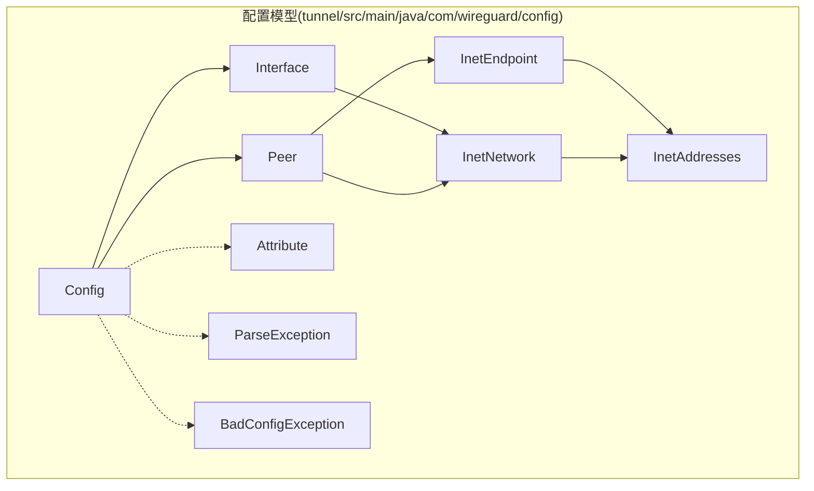
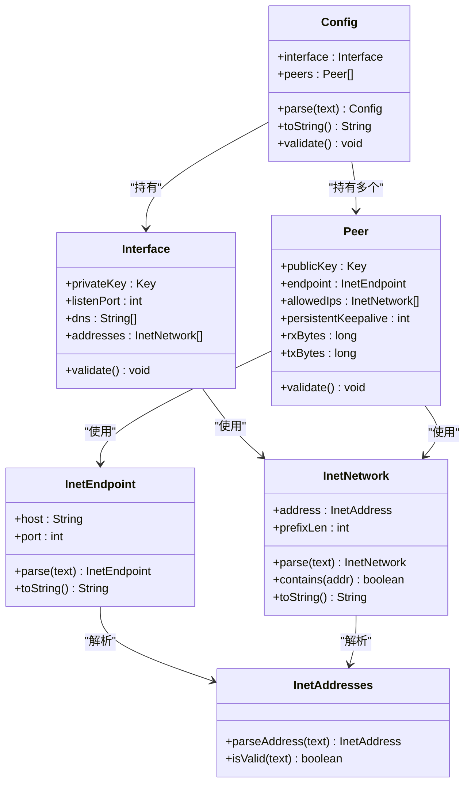
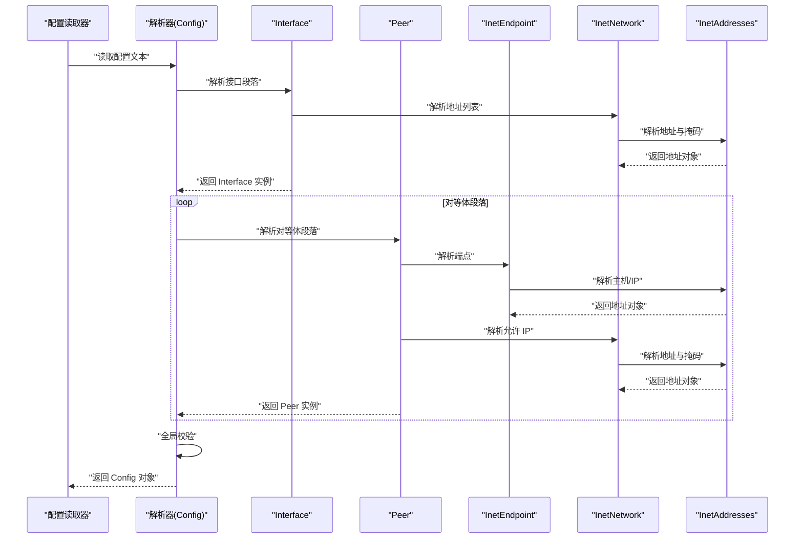
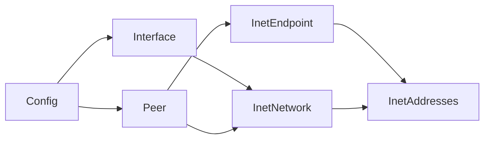

# 配置模型

<cite>
**本文引用的文件**   
- [Config.java](file://tunnel/src/main/java/com/wireguard/config/Config.java)
- [Interface.java](file://tunnel/src/main/java/com/wireguard/config/Interface.java)
- [Peer.java](file://tunnel/src/main/java/com/wireguard/config/Peer.java)
- [InetEndpoint.java](file://tunnel/src/main/java/com/wireguard/config/InetEndpoint.java)
- [InetNetwork.java](file://tunnel/src/main/java/com/wireguard/config/InetNetwork.java)
- [InetAddresses.java](file://tunnel/src/main/java/com/wireguard/config/InetAddresses.java)
- [Attribute.java](file://tunnel/src/main/java/com/wireguard/config/Attribute.java)
- [BadConfigException.java](file://tunnel/src/main/java/com/wireguard/config/BadConfigException.java)
- [ParseException.java](file://tunnel/src/main/java/com/wireguard/config/ParseException.java)
- [ConfigTest.java](file://tunnel/src/test/java/com/wireguard/config/ConfigTest.java)
- [working.conf](file://tunnel/src/test/resources/working.conf)
</cite>

## 目录
1. [简介](#简介)
2. [项目结构](#项目结构)
3. [核心组件](#核心组件)
4. [架构总览](#架构总览)
5. [详细组件分析](#详细组件分析)
6. [依赖关系分析](#依赖关系分析)
7. [性能考虑](#性能考虑)
8. [故障排查指南](#故障排查指南)
9. [结论](#结论)
10. [附录](#附录)

## 简介
本技术文档聚焦 WireGuard Android 项目的配置模型，围绕 Interface、Peer、InetEndpoint、InetNetwork 等核心类展开，系统阐述属性与配置项（网络接口设置、监听端口与地址分配）、对等体配置（公钥、端点、允许 IP、持久保持连接）、网络地址处理逻辑、对象间关系与数据流转、验证规则与约束、序列化与反序列化机制，以及配置模板与生成工具的使用建议。目标是帮助开发者快速理解并正确构建、校验、持久化与迁移配置。

## 项目结构
配置模型位于 tunnel 模块的 com.wireguard.config 包中，采用分层清晰的 Java 类组织：
- 顶层配置容器：Config
- 接口配置：Interface
- 对等体配置：Peer
- 网络地址与端点：InetEndpoint、InetNetwork、InetAddresses
- 解析与错误：Attribute、ParseException、BadConfigException
- 测试与示例：ConfigTest、working.conf 等

图表来源
- [Config.java](file://tunnel/src/main/java/com/wireguard/config/Config.java)
- [Interface.java](file://tunnel/src/main/java/com/wireguard/config/Interface.java)
- [Peer.java](file://tunnel/src/main/java/com/wireguard/config/Peer.java)
- [InetEndpoint.java](file://tunnel/src/main/java/com/wireguard/config/InetEndpoint.java)
- [InetNetwork.java](file://tunnel/src/main/java/com/wireguard/config/InetNetwork.java)
- [InetAddresses.java](file://tunnel/src/main/java/com/wireguard/config/InetAddresses.java)
- [Attribute.java](file://tunnel/src/main/java/com/wireguard/config/Attribute.java)
- [ParseException.java](file://tunnel/src/main/java/com/wireguard/config/ParseException.java)
- [BadConfigException.java](file://tunnel/src/main/java/com/wireguard/config/BadConfigException.java)

章节来源
- [Config.java](file://tunnel/src/main/java/com/wireguard/config/Config.java)
- [Interface.java](file://tunnel/src/main/java/com/wireguard/config/Interface.java)
- [Peer.java](file://tunnel/src/main/java/com/wireguard/config/Peer.java)
- [InetEndpoint.java](file://tunnel/src/main/java/com/wireguard/config/InetEndpoint.java)
- [InetNetwork.java](file://tunnel/src/main/java/com/wireguard/config/InetNetwork.java)
- [InetAddresses.java](file://tunnel/src/main/java/com/wireguard/config/InetAddresses.java)
- [Attribute.java](file://tunnel/src/main/java/com/wireguard/config/Attribute.java)
- [ParseException.java](file://tunnel/src/main/java/com/wireguard/config/ParseException.java)
- [BadConfigException.java](file://tunnel/src/main/java/com/wireguard/config/BadConfigException.java)

## 核心组件
- Config：配置根对象，持有 Interface 与 Peer 列表，提供序列化/反序列化入口与整体校验。
- Interface：定义本地隧道接口参数，包括私钥、监听端口、DNS、以及允许的入站 IPv4/IPv6 网段。
- Peer：定义对等体参数，包括公钥、端点（IP+端口）、允许 IP 列表、持久保持连接开关、发送/接收字节计数等。
- InetEndpoint：封装远端端点（主机名或 IP + 端口），支持解析与格式化。
- InetNetwork：封装 IPv4/IPv6 网段（含前缀长度），支持包含判断与规范化。
- InetAddresses：底层地址解析与校验工具，统一处理 IPv4/IPv6 字符串到地址对象的转换与合法性检查。
- Attribute：用于描述配置键值语义与类型，辅助解析与校验。
- ParseException / BadConfigException：解析失败与配置不合法时抛出的异常类型。

章节来源
- [Config.java](file://tunnel/src/main/java/com/wireguard/config/Config.java)
- [Interface.java](file://tunnel/src/main/java/com/wireguard/config/Interface.java)
- [Peer.java](file://tunnel/src/main/java/com/wireguard/config/Peer.java)
- [InetEndpoint.java](file://tunnel/src/main/java/com/wireguard/config/InetEndpoint.java)
- [InetNetwork.java](file://tunnel/src/main/java/com/wireguard/config/InetNetwork.java)
- [InetAddresses.java](file://tunnel/src/main/java/com/wireguard/config/InetAddresses.java)
- [Attribute.java](file://tunnel/src/main/java/com/wireguard/config/Attribute.java)
- [ParseException.java](file://tunnel/src/main/java/com/wireguard/config/ParseException.java)
- [BadConfigException.java](file://tunnel/src/main/java/com/wireguard/config/BadConfigException.java)

## 架构总览
配置模型以 Config 为根，向下聚合 Interface 与多个 Peer；Interface 与 Peer 均依赖 InetNetwork 表示地址范围；Peer 还依赖 InetEndpoint 表示远端可达性；所有地址解析由 InetAddresses 统一完成。解析流程从文本到对象树，随后进行字段级与全局级校验，最终输出稳定可序列化的配置对象。

图表来源
- [Config.java](file://tunnel/src/main/java/com/wireguard/config/Config.java)
- [Interface.java](file://tunnel/src/main/java/com/wireguard/config/Interface.java)
- [Peer.java](file://tunnel/src/main/java/com/wireguard/config/Peer.java)
- [InetEndpoint.java](file://tunnel/src/main/java/com/wireguard/config/InetEndpoint.java)
- [InetNetwork.java](file://tunnel/src/main/java/com/wireguard/config/InetNetwork.java)
- [InetAddresses.java](file://tunnel/src/main/java/com/wireguard/config/InetAddresses.java)

## 详细组件分析

### Interface 类（接口配置）
- 关键属性
  - 私钥：用于隧道加密协商。
  - 监听端口：本机 UDP 监听端口。
  - DNS：可选的 DNS 服务器列表。
  - 地址列表：允许的入站 IPv4/IPv6 网段集合。
- 配置选项说明
  - 监听端口：必须为有效端口号；若未设置则按默认策略处理。
  - 地址列表：每个元素为 CIDR 形式；需满足前缀长度合法且地址规范。
- 验证规则
  - 私钥格式与长度校验。
  - 端口范围与冲突检测。
  - 地址列表非空时的合法性与去重。
- 数据流转
  - 解析阶段：将文本中的键值映射为 Interface 实例字段。
  - 校验阶段：调用 validate 方法执行字段级与组合约束检查。
  - 序列化阶段：将对象转回标准文本格式供持久化或传输。

章节来源
- [Interface.java](file://tunnel/src/main/java/com/wireguard/config/Interface.java)
- [InetNetwork.java](file://tunnel/src/main/java/com/wireguard/config/InetNetwork.java)
- [InetAddresses.java](file://tunnel/src/main/java/com/wireguard/config/InetAddresses.java)

### Peer 类（对等体配置）
- 关键属性
  - 公钥：对等体的公钥，用于身份认证与密钥派生。
  - 端点：远端可达地址（主机名或 IP + 端口）。
  - 允许 IP：该对等体可路由的网段集合。
  - 持久保持连接：心跳间隔秒数，控制 NAT 保活。
  - 流量统计：发送/接收字节数。
- 配置选项说明
  - 端点：支持域名或 IP，端口必填；域名解析在运行时进行。
  - 允许 IP：CIDR 列表，至少一个；用于决定哪些流量走隧道。
  - 持久保持连接：0 表示关闭；正整数表示心跳周期。
- 验证规则
  - 公钥格式与长度校验。
  - 端点解析成功且端口合法。
  - 允许 IP 列表非空且每项合法。
  - 持久保持连接为非负整数。
- 数据流转
  - 解析阶段：逐条读取对等体段落，填充字段。
  - 校验阶段：validate 确保对等体可用性与一致性。
  - 序列化阶段：输出为标准配置片段。

章节来源
- [Peer.java](file://tunnel/src/main/java/com/wireguard/config/Peer.java)
- [InetEndpoint.java](file://tunnel/src/main/java/com/wireguard/config/InetEndpoint.java)
- [InetNetwork.java](file://tunnel/src/main/java/com/wireguard/config/InetNetwork.java)

### InetEndpoint（端点处理）
- 功能职责
  - 解析“主机:端口”或“[IPv6]:端口”形式的端点字符串。
  - 提供标准化 toString 输出，便于日志与配置展示。
- 解析逻辑要点
  - 区分 IPv4、IPv6 与域名三种情况。
  - 端口范围校验与边界处理。
  - 非法输入抛出解析异常。
- 复杂度与性能
  - 解析为 O(n)，n 为字符串长度；缓存结果可减少重复解析开销。

章节来源
- [InetEndpoint.java](file://tunnel/src/main/java/com/wireguard/config/InetEndpoint.java)
- [InetAddresses.java](file://tunnel/src/main/java/com/wireguard/config/InetAddresses.java)

### InetNetwork（网段处理）
- 功能职责
  - 表示 IPv4/IPv6 网段（地址 + 前缀长度）。
  - 提供 contains 判断某地址是否属于该网段。
  - 规范化与比较操作，保证等价网段一致。
- 解析与校验
  - 支持 CIDR 语法；前缀长度必须在地址族范围内。
  - 地址规范化后存储，避免歧义。
- 复杂度与性能
  - contains 为 O(1) 位运算判定；适合高频匹配场景。

章节来源
- [InetNetwork.java](file://tunnel/src/main/java/com/wireguard/config/InetNetwork.java)
- [InetAddresses.java](file://tunnel/src/main/java/com/wireguard/config/InetAddresses.java)

### InetAddresses（地址工具）
- 功能职责
  - 统一的地址解析与合法性检查。
  - 屏蔽 IPv4/IPv6 差异，向上层提供一致 API。
- 典型方法
  - 解析字符串为 InetAddress。
  - 校验字符串是否为合法地址表示。
- 错误处理
  - 非法输入抛出解析异常，附带上下文信息。

章节来源
- [InetAddresses.java](file://tunnel/src/main/java/com/wireguard/config/InetAddresses.java)

### 配置解析与校验流程（序列化和反序列化）
- 反序列化（文本 → 对象）
  - 读取配置文本，按段落与键值构建 Config/Interface/Peer 对象树。
  - 对每个字段调用对应解析器（如 InetEndpoint.parse、InetNetwork.parse）。
  - 校验失败抛出 ParseException 或 BadConfigException。
- 序列化（对象 → 文本）
  - 遍历对象树，生成标准键值对与段落结构。
  - 保证输出稳定、可读、可再解析。

图表来源
- [Config.java](file://tunnel/src/main/java/com/wireguard/config/Config.java)
- [Interface.java](file://tunnel/src/main/java/com/wireguard/config/Interface.java)
- [Peer.java](file://tunnel/src/main/java/com/wireguard/config/Peer.java)
- [InetEndpoint.java](file://tunnel/src/main/java/com/wireguard/config/InetEndpoint.java)
- [InetNetwork.java](file://tunnel/src/main/java/com/wireguard/config/InetNetwork.java)
- [InetAddresses.java](file://tunnel/src/main/java/com/wireguard/config/InetAddresses.java)

章节来源
- [Config.java](file://tunnel/src/main/java/com/wireguard/config/Config.java)
- [ParseException.java](file://tunnel/src/main/java/com/wireguard/config/ParseException.java)
- [BadConfigException.java](file://tunnel/src/main/java/com/wireguard/config/BadConfigException.java)

### 配置验证规则与约束条件
- 通用约束
  - 所有地址与端点必须通过 InetAddresses 校验。
  - 端口号必须在合法范围。
  - 必填字段缺失将导致解析失败。
- Interface 约束
  - 私钥格式与长度符合算法要求。
  - 地址列表每项为合法 CIDR。
- Peer 约束
  - 公钥格式与长度符合算法要求。
  - 端点存在且端口合法。
  - 允许 IP 列表非空且每项合法。
  - 持久保持连接为非负整数。
- 全局约束
  - 同一配置中不允许冲突的端口或地址。
  - 对等体数量与资源限制（例如最大条目数）由实现决定。

章节来源
- [Interface.java](file://tunnel/src/main/java/com/wireguard/config/Interface.java)
- [Peer.java](file://tunnel/src/main/java/com/wireguard/config/Peer.java)
- [InetEndpoint.java](file://tunnel/src/main/java/com/wireguard/config/InetEndpoint.java)
- [InetNetwork.java](file://tunnel/src/main/java/com/wireguard/config/InetNetwork.java)
- [InetAddresses.java](file://tunnel/src/main/java/com/wireguard/config/InetAddresses.java)

### 配置示例与最佳实践
- 最小可用配置
  - Interface：至少包含私钥与地址列表。
  - Peer：至少包含公钥、端点与允许 IP。
- 推荐实践
  - 明确指定允许 IP，避免过宽网段导致不必要流量进入隧道。
  - 合理设置持久保持连接，平衡保活与能耗。
  - 使用稳定的域名或固定 IP 作为端点，减少解析失败概率。
  - 对敏感字段（私钥、公钥）进行安全存储与访问控制。
- 示例参考
  - 参见测试资源 working.conf 的结构与键值组织方式。

章节来源
- [working.conf](file://tunnel/src/test/resources/working.conf)

### 配置模板与生成工具使用方法
- 模板设计原则
  - 模板应覆盖常见拓扑（单对等体、多对等体、不同地址族）。
  - 保留占位符以便程序替换（如私钥、公钥、端点、允许 IP）。
- 生成工具建议
  - 基于模板引擎批量生成配置文件。
  - 生成后自动运行解析与校验流程，确保输出有效。
  - 提供导出与导入能力，便于版本管理与分发。

章节来源
- [ConfigTest.java](file://tunnel/src/test/java/com/wireguard/config/ConfigTest.java)
- [working.conf](file://tunnel/src/test/resources/working.conf)

## 依赖关系分析
- 耦合与内聚
  - Config 高内聚地管理 Interface 与 Peer 生命周期。
  - InetEndpoint 与 InetNetwork 低耦合，仅依赖 InetAddresses 进行地址解析。
- 外部依赖
  - 地址解析依赖系统网络库（通过 InetAddresses 抽象）。
  - 配置持久化由上层存储模块负责（不在本模型范围内）。
- 潜在循环依赖
  - 当前模型无循环依赖；Interface 与 Peer 相互独立。

图表来源
- [Config.java](file://tunnel/src/main/java/com/wireguard/config/Config.java)
- [Interface.java](file://tunnel/src/main/java/com/wireguard/config/Interface.java)
- [Peer.java](file://tunnel/src/main/java/com/wireguard/config/Peer.java)
- [InetEndpoint.java](file://tunnel/src/main/java/com/wireguard/config/InetEndpoint.java)
- [InetNetwork.java](file://tunnel/src/main/java/com/wireguard/config/InetNetwork.java)
- [InetAddresses.java](file://tunnel/src/main/java/com/wireguard/config/InetAddresses.java)

章节来源
- [Config.java](file://tunnel/src/main/java/com/wireguard/config/Config.java)
- [Interface.java](file://tunnel/src/main/java/com/wireguard/config/Interface.java)
- [Peer.java](file://tunnel/src/main/java/com/wireguard/config/Peer.java)
- [InetEndpoint.java](file://tunnel/src/main/java/com/wireguard/config/InetEndpoint.java)
- [InetNetwork.java](file://tunnel/src/main/java/com/wireguard/config/InetNetwork.java)
- [InetAddresses.java](file://tunnel/src/main/java/com/wireguard/config/InetAddresses.java)

## 性能考虑
- 解析性能
  - 大量端点与网段解析时，建议缓存 InetAddresses 的结果以减少重复计算。
- 内存占用
  - 避免创建过多临时对象；复用 InetNetwork 与 InetEndpoint 实例。
- I/O 与序列化
  - 大配置文件的读写建议使用流式处理，避免一次性加载到内存。
- 校验优化
  - 先进行快速字段级校验，再进行全局约束检查，尽早失败。

## 故障排查指南
- 常见问题
  - 地址或端点解析失败：检查 CIDR 语法、端口范围与主机名有效性。
  - 私钥/公钥格式错误：确认编码与长度是否符合算法要求。
  - 缺少必填字段：根据异常信息定位缺失键。
- 调试建议
  - 启用详细日志，记录解析过程中的中间对象与错误位置。
  - 使用测试用例 working.conf 作为基准对比。
- 异常类型
  - ParseException：语法或格式错误。
  - BadConfigException：语义或约束违规。

章节来源
- [ParseException.java](file://tunnel/src/main/java/com/wireguard/config/ParseException.java)
- [BadConfigException.java](file://tunnel/src/main/java/com/wireguard/config/BadConfigException.java)
- [ConfigTest.java](file://tunnel/src/test/java/com/wireguard/config/ConfigTest.java)

## 结论
WireGuard Android 的配置模型以清晰的对象层次与严格的校验机制为核心，提供了可靠的配置解析、验证与序列化能力。通过 Interface、Peer、InetEndpoint、InetNetwork 与 InetAddresses 的协作，实现了灵活而安全的网络配置表达。遵循本文的最佳实践与约束规则，可有效提升配置的稳定性与可维护性。

## 附录
- 术语表
  - 对等体（Peer）：隧道的另一端实体。
  - 允许 IP：经隧道转发的目标网段。
  - 持久保持连接：周期性心跳以维持 NAT 映射。
- 参考文件
  - 测试配置 working.conf 展示了标准键值与段落组织方式。
  - 单元测试 ConfigTest 覆盖了常见解析与校验场景。