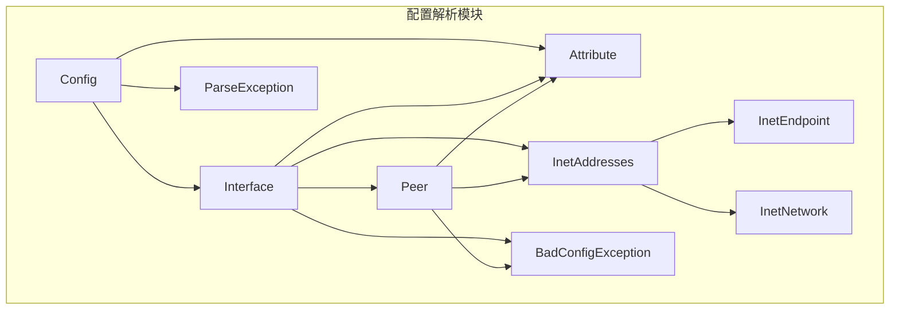
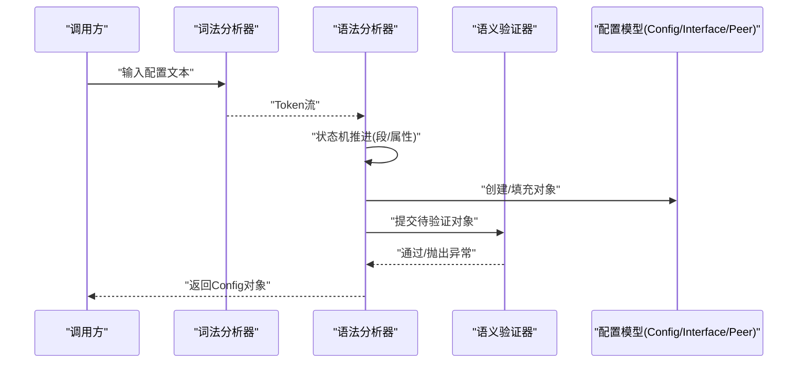
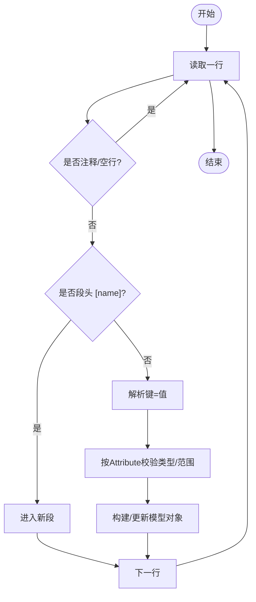
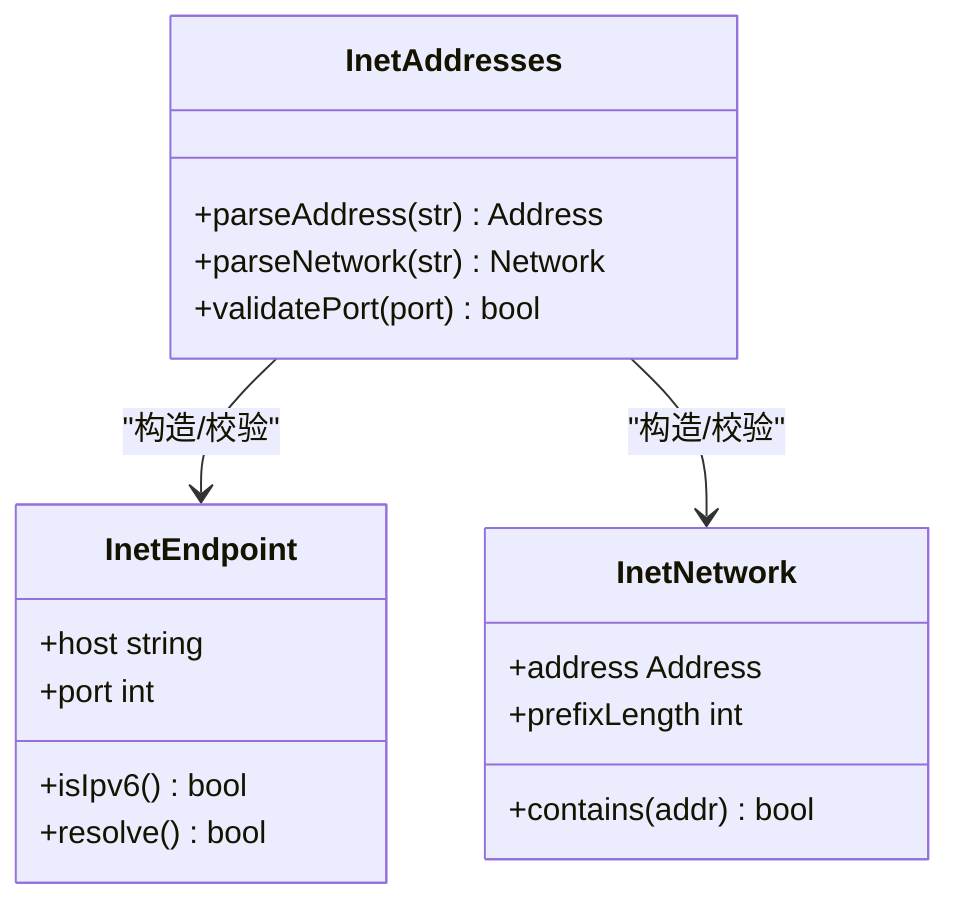
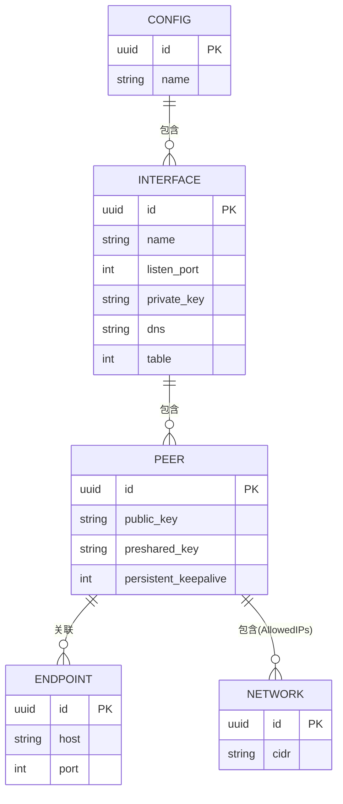
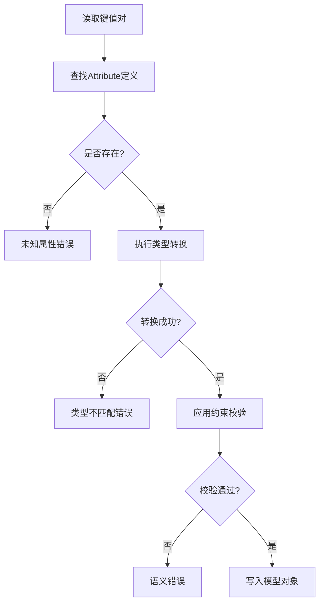
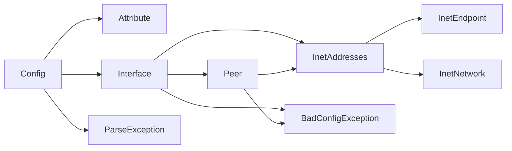

# 解析算法实现

<cite>
**本文引用的文件**   
- [Config.java](file://tunnel/src/main/java/com/wireguard/config/Config.java)
- [Attribute.java](file://tunnel/src/main/java/com/wireguard/config/Attribute.java)
- [InetAddresses.java](file://tunnel/src/main/java/com/wireguard/config/InetAddresses.java)
- [InetEndpoint.java](file://tunnel/src/main/java/com/wireguard/config/InetEndpoint.java)
- [InetNetwork.java](file://tunnel/src/main/java/com/wireguard/config/InetNetwork.java)
- [Interface.java](file://tunnel/src/main/java/com/wireguard/config/Interface.java)
- [Peer.java](file://tunnel/src/main/java/com/wireguard/config/Peer.java)
- [BadConfigException.java](file://tunnel/src/main/java/com/wireguard/config/BadConfigException.java)
- [ParseException.java](file://tunnel/src/main/java/com/wireguard/config/ParseException.java)
- [ConfigTest.java](file://tunnel/src/test/java/com/wireguard/config/ConfigTest.java)
</cite>

## 目录
1. [简介](#简介)
2. [项目结构](#项目结构)
3. [核心组件](#核心组件)
4. [架构总览](#架构总览)
5. [详细组件分析](#详细组件分析)
6. [依赖关系分析](#依赖关系分析)
7. [性能考虑](#性能考虑)
8. [故障排查指南](#故障排查指南)
9. [结论](#结论)
10. [附录](#附录)

## 简介
本技术文档聚焦于 WireGuard Android 项目中配置解析算法的实现，围绕 Config 类的解析器展开，系统阐述词法分析、语法分析与语义验证三个阶段；解释状态机设计与递归下降解析策略；记录 InetAddresses、InetEndpoint、InetNetwork 的地址解析逻辑；说明配置数据的内存模型与对象图构建过程；详述属性值的类型转换与验证机制；总结解析性能优化技术与内存管理策略；并给出扩展点与自定义属性支持机制，以及调试与监控方法。

## 项目结构
本项目采用按功能域划分的包结构，配置解析相关代码集中在 com.wireguard.config 包中：
- 配置模型与解析入口：Config、Interface、Peer
- 属性定义与校验：Attribute、BadConfigException、ParseException
- 地址与网络类型：InetAddresses、InetEndpoint、InetNetwork
- 测试用例：ConfigTest 及资源配置文件（用于断言解析行为）

图表来源
- [Config.java](file://tunnel/src/main/java/com/wireguard/config/Config.java)
- [Interface.java](file://tunnel/src/main/java/com/wireguard/config/Interface.java)
- [Peer.java](file://tunnel/src/main/java/com/wireguard/config/Peer.java)
- [Attribute.java](file://tunnel/src/main/java/com/wireguard/config/Attribute.java)
- [InetAddresses.java](file://tunnel/src/main/java/com/wireguard/config/InetAddresses.java)
- [InetEndpoint.java](file://tunnel/src/main/java/com/wireguard/config/InetEndpoint.java)
- [InetNetwork.java](file://tunnel/src/main/java/com/wireguard/config/InetNetwork.java)
- [BadConfigException.java](file://tunnel/src/main/java/com/wireguard/config/BadConfigException.java)
- [ParseException.java](file://tunnel/src/main/java/com/wireguard/config/ParseException.java)

章节来源
- [Config.java](file://tunnel/src/main/java/com/wireguard/config/Config.java)
- [Interface.java](file://tunnel/src/main/java/com/wireguard/config/Interface.java)
- [Peer.java](file://tunnel/src/main/java/com/wireguard/config/Peer.java)
- [Attribute.java](file://tunnel/src/main/java/com/wireguard/config/Attribute.java)
- [InetAddresses.java](file://tunnel/src/main/java/com/wireguard/config/InetAddresses.java)
- [InetEndpoint.java](file://tunnel/src/main/java/com/wireguard/config/InetEndpoint.java)
- [InetNetwork.java](file://tunnel/src/main/java/com/wireguard/config/InetNetwork.java)
- [BadConfigException.java](file://tunnel/src/main/java/com/wireguard/config/BadConfigException.java)
- [ParseException.java](file://tunnel/src/main/java/com/wireguard/config/ParseException.java)

## 核心组件
- Config：配置根对象，负责整体解析流程编排、段（section）识别与属性分发，维护 Interface 列表与全局设置。
- Interface：接口段模型，包含监听端口、私钥、DNS、MTU、表ID等属性，持有 Peer 列表。
- Peer：对端段模型，包含公钥、允许IP、终结点、持久连接、预共享密钥等属性。
- Attribute：属性元数据与值容器，提供类型化访问与校验钩子。
- InetAddresses：通用地址解析工具，封装 IPv4/IPv6 字符串到网络对象的转换。
- InetEndpoint：终结点模型（主机:端口），支持域名或 IP 的解析与校验。
- InetNetwork：CIDR 网络模型，支持前缀长度校验与范围判断。
- BadConfigException / ParseException：配置错误与解析异常类型，贯穿解析阶段以传递错误上下文。

章节来源
- [Config.java](file://tunnel/src/main/java/com/wireguard/config/Config.java)
- [Interface.java](file://tunnel/src/main/java/com/wireguard/config/Interface.java)
- [Peer.java](file://tunnel/src/main/java/com/wireguard/config/Peer.java)
- [Attribute.java](file://tunnel/src/main/java/com/wireguard/config/Attribute.java)
- [InetAddresses.java](file://tunnel/src/main/java/com/wireguard/config/InetAddresses.java)
- [InetEndpoint.java](file://tunnel/src/main/java/com/wireguard/config/InetEndpoint.java)
- [InetNetwork.java](file://tunnel/src/main/java/com/wireguard/config/InetNetwork.java)
- [BadConfigException.java](file://tunnel/src/main/java/com/wireguard/config/BadConfigException.java)
- [ParseException.java](file://tunnel/src/main/java/com/wireguard/config/ParseException.java)

## 架构总览
配置解析采用“词法分析 + 递归下降语法分析 + 语义验证”的分层架构：
- 词法分析：将原始文本切分为 token（段名、键、值、分隔符、注释行）。
- 语法分析：基于状态机驱动递归下降，识别 [interface]、[peer] 等段及其属性键值对。
- 语义验证：对属性进行类型转换、取值范围检查、跨字段一致性校验（如 AllowedIPs 与 Endpoint 的协议匹配）。

图表来源
- [Config.java](file://tunnel/src/main/java/com/wireguard/config/Config.java)
- [Interface.java](file://tunnel/src/main/java/com/wireguard/config/Interface.java)
- [Peer.java](file://tunnel/src/main/java/com/wireguard/config/Peer.java)
- [Attribute.java](file://tunnel/src/main/java/com/wireguard/config/Attribute.java)
- [InetAddresses.java](file://tunnel/src/main/java/com/wireguard/config/InetAddresses.java)
- [InetEndpoint.java](file://tunnel/src/main/java/com/wireguard/config/InetEndpoint.java)
- [InetNetwork.java](file://tunnel/src/main/java/com/wireguard/config/InetNetwork.java)

## 详细组件分析

### Config 解析器：状态机与递归下降
- 词法阶段：逐字符扫描，忽略空白与注释，识别段落头 [section]、键=值、多值键（如 AllowedIPs）、续行与转义。
- 语法阶段：递归下降函数对应不同语法单元（parseSection、parseAttributes、parseKeyValue），状态机在“段内/段外”、“键读取/值读取”之间切换。
- 语义阶段：根据 Attribute 定义进行类型转换与约束校验，生成 Interface/Peer 实例并挂入 Config。

图表来源
- [Config.java](file://tunnel/src/main/java/com/wireguard/config/Config.java)
- [Attribute.java](file://tunnel/src/main/java/com/wireguard/config/Attribute.java)

章节来源
- [Config.java](file://tunnel/src/main/java/com/wireguard/config/Config.java)
- [Attribute.java](file://tunnel/src/main/java/com/wireguard/config/Attribute.java)

### InetAddresses、InetEndpoint、InetNetwork 地址解析
- InetAddresses：统一处理 IPv4/IPv6 字符串解析，支持 CIDR 前缀提取与合法性校验。
- InetEndpoint：解析 host:port 形式，支持域名解析与端口范围校验，区分 v4/v6 终结点。
- InetNetwork：表示 CIDR 网络，校验前缀长度与地址族一致性，提供包含性判断。

图表来源
- [InetAddresses.java](file://tunnel/src/main/java/com/wireguard/config/InetAddresses.java)
- [InetEndpoint.java](file://tunnel/src/main/java/com/wireguard/config/InetEndpoint.java)
- [InetNetwork.java](file://tunnel/src/main/java/com/wireguard/config/InetNetwork.java)

章节来源
- [InetAddresses.java](file://tunnel/src/main/java/com/wireguard/config/InetAddresses.java)
- [InetEndpoint.java](file://tunnel/src/main/java/com/wireguard/config/InetEndpoint.java)
- [InetNetwork.java](file://tunnel/src/main/java/com/wireguard/config/InetNetwork.java)

### 配置数据内存模型与对象图构建
- Config 作为根节点，持有 Interface 列表。
- Interface 持有 Peer 列表，并保存自身属性（如 ListenPort、PrivateKey、DNS、Table）。
- Peer 保存 PublicKey、AllowedIPs、Endpoint、PersistentKeepalive、PresharedKey 等。
- 所有字符串型属性经 Attribute 转换为强类型对象（如 InetEndpoint、InetNetwork），确保后续使用安全。

图表来源
- [Config.java](file://tunnel/src/main/java/com/wireguard/config/Config.java)
- [Interface.java](file://tunnel/src/main/java/com/wireguard/config/Interface.java)
- [Peer.java](file://tunnel/src/main/java/com/wireguard/config/Peer.java)
- [InetEndpoint.java](file://tunnel/src/main/java/com/wireguard/config/InetEndpoint.java)
- [InetNetwork.java](file://tunnel/src/main/java/com/wireguard/config/InetNetwork.java)

章节来源
- [Config.java](file://tunnel/src/main/java/com/wireguard/config/Config.java)
- [Interface.java](file://tunnel/src/main/java/com/wireguard/config/Interface.java)
- [Peer.java](file://tunnel/src/main/java/com/wireguard/config/Peer.java)
- [InetEndpoint.java](file://tunnel/src/main/java/com/wireguard/config/InetEndpoint.java)
- [InetNetwork.java](file://tunnel/src/main/java/com/wireguard/config/InetNetwork.java)

### 属性值类型转换与验证机制
- Attribute 定义每个属性的名称、类型、是否可重复、默认值与校验规则。
- 解析时根据 Attribute 的类型选择对应的转换器（如字符串→端口整数、字符串→InetEndpoint、字符串→InetNetwork）。
- 校验失败抛出 BadConfigException，附带位置信息与期望类型，便于定位问题。

图表来源
- [Attribute.java](file://tunnel/src/main/java/com/wireguard/config/Attribute.java)
- [BadConfigException.java](file://tunnel/src/main/java/com/wireguard/config/BadConfigException.java)

章节来源
- [Attribute.java](file://tunnel/src/main/java/com/wireguard/config/Attribute.java)
- [BadConfigException.java](file://tunnel/src/main/java/com/wireguard/config/BadConfigException.java)

### 解析流程的调试与监控
- 启用详细日志：在词法/语法/语义各阶段输出关键步骤（当前段、键、值、状态）。
- 异常堆栈：ParseException 携带行号与列号，BadConfigException 携带属性名与期望类型。
- 单元测试：利用 ConfigTest 与 resources 中的 .conf 样例覆盖正常与异常路径。

章节来源
- [ConfigTest.java](file://tunnel/src/test/java/com/wireguard/config/ConfigTest.java)
- [ParseException.java](file://tunnel/src/main/java/com/wireguard/config/ParseException.java)
- [BadConfigException.java](file://tunnel/src/main/java/com/wireguard/config/BadConfigException.java)

## 依赖关系分析
- Config 依赖 Attribute 完成属性元数据与转换；依赖 Interface/Peer 构建对象图。
- Interface/Peer 依赖 InetAddresses/InetEndpoint/InetNetwork 完成地址族与端口校验。
- 异常类型贯穿全链路，保证错误信息一致性与可追溯性。

图表来源
- [Config.java](file://tunnel/src/main/java/com/wireguard/config/Config.java)
- [Attribute.java](file://tunnel/src/main/java/com/wireguard/config/Attribute.java)
- [Interface.java](file://tunnel/src/main/java/com/wireguard/config/Interface.java)
- [Peer.java](file://tunnel/src/main/java/com/wireguard/config/Peer.java)
- [InetAddresses.java](file://tunnel/src/main/java/com/wireguard/config/InetAddresses.java)
- [InetEndpoint.java](file://tunnel/src/main/java/com/wireguard/config/InetEndpoint.java)
- [InetNetwork.java](file://tunnel/src/main/java/com/wireguard/config/InetNetwork.java)
- [ParseException.java](file://tunnel/src/main/java/com/wireguard/config/ParseException.java)
- [BadConfigException.java](file://tunnel/src/main/java/com/wireguard/config/BadConfigException.java)

章节来源
- [Config.java](file://tunnel/src/main/java/com/wireguard/config/Config.java)
- [Attribute.java](file://tunnel/src/main/java/com/wireguard/config/Attribute.java)
- [Interface.java](file://tunnel/src/main/java/com/wireguard/config/Interface.java)
- [Peer.java](file://tunnel/src/main/java/com/wireguard/config/Peer.java)
- [InetAddresses.java](file://tunnel/src/main/java/com/wireguard/config/InetAddresses.java)
- [InetEndpoint.java](file://tunnel/src/main/java/com/wireguard/config/InetEndpoint.java)
- [InetNetwork.java](file://tunnel/src/main/java/com/wireguard/config/InetNetwork.java)
- [ParseException.java](file://tunnel/src/main/java/com/wireguard/config/ParseException.java)
- [BadConfigException.java](file://tunnel/src/main/java/com/wireguard/config/BadConfigException.java)

## 性能考虑
- 词法分析：线性扫描，避免正则回溯，减少中间对象分配。
- 递归下降：无回溯解析，提前短路非法分支，降低复杂度。
- 类型转换：集中式 Attribute 转换器，复用缓存（如端口范围、CIDR 前缀表）。
- 内存管理：按需创建对象，避免大对象过早分配；解析完成后释放临时缓冲区。
- I/O 优化：缓冲读取配置文本，批量处理行，减少系统调用。

## 故障排查指南
- 常见错误类型
  - 语法错误：段名不合法、键值格式错误、未闭合段。
  - 类型错误：端口超出范围、CIDR 前缀无效、IPv4/IPv6 混用。
  - 语义错误：AllowedIPs 与 Endpoint 协议不一致、必填属性缺失。
- 定位方法
  - 查看 ParseException 的行/列信息，快速定位源文本位置。
  - 查看 BadConfigException 的属性名与期望类型，修正配置值。
  - 使用单元测试样例对比差异，逐步缩小问题范围。
- 建议实践
  - 在 CI 中加入配置校验用例，拦截非法配置。
  - 为自定义属性增加最小化测试集，覆盖边界值。

章节来源
- [ParseException.java](file://tunnel/src/main/java/com/wireguard/config/ParseException.java)
- [BadConfigException.java](file://tunnel/src/main/java/com/wireguard/config/BadConfigException.java)
- [ConfigTest.java](file://tunnel/src/test/java/com/wireguard/config/ConfigTest.java)

## 结论
本解析器通过清晰的三层架构（词法、语法、语义）与状态机驱动的递归下降策略，实现了高可靠、易扩展的配置解析能力。InetAddresses/InetEndpoint/InetNetwork 提供了稳健的地址族处理能力；Attribute 体系简化了类型转换与校验；异常模型贯穿全流程，提升可观测性与可维护性。结合性能优化与调试手段，可在复杂场景下保持高效与稳定。

## 附录
- 扩展点与自定义属性支持
  - 新增属性：在 Attribute 注册表中添加条目，指定类型、默认值与校验规则。
  - 自定义转换器：实现类型转换逻辑并在 Attribute 中绑定。
  - 语义校验钩子：在 Interface/Peer 构建后插入额外一致性检查。
- 最佳实践
  - 保持 Attribute 定义与文档同步更新。
  - 为新增属性补充单元测试与边界用例。
  - 谨慎引入外部依赖（如 DNS 解析），避免阻塞解析主流程。