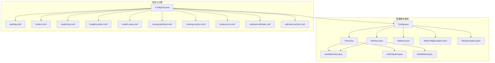
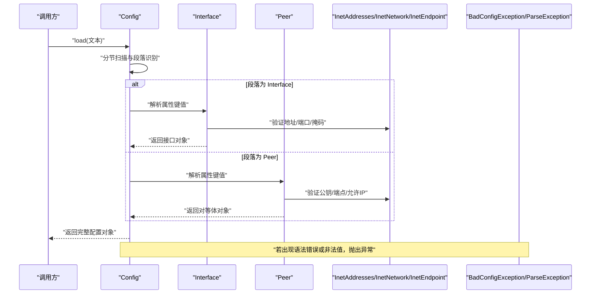
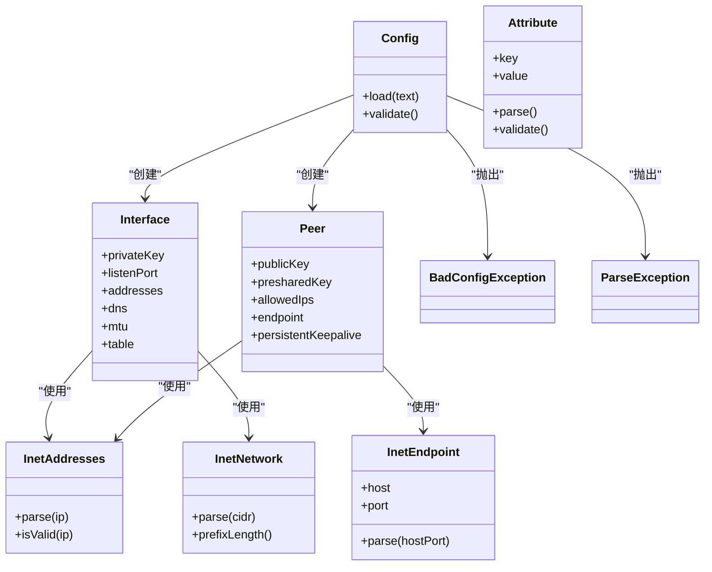
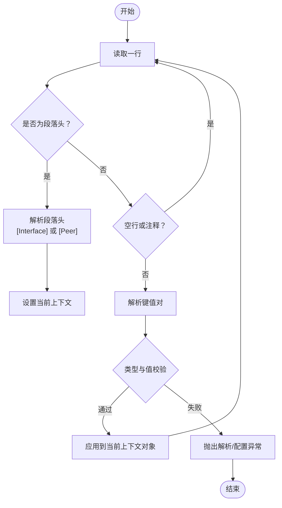
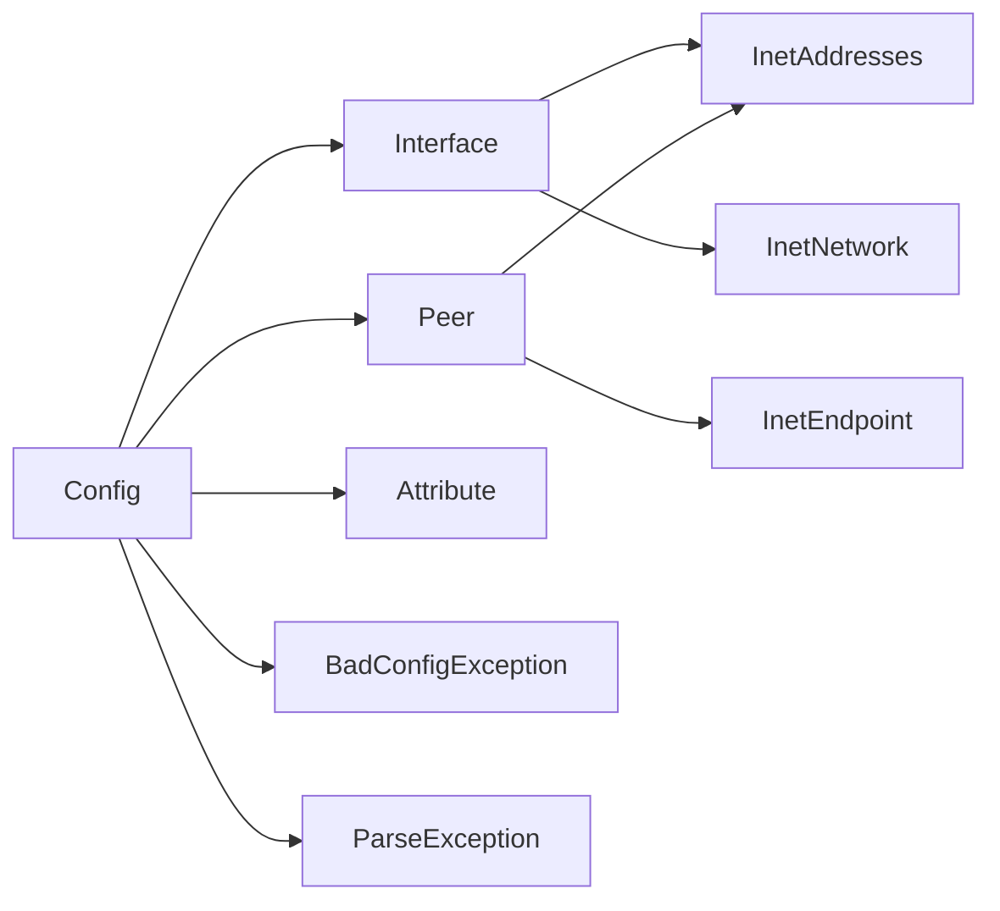

# 配置文件格式规范

<cite>
**本文档引用的文件**   
- [Config.java](file://tunnel/src/main/java/com/wireguard/config/Config.java)
- [Interface.java](file://tunnel/src/main/java/com/wireguard/config/Interface.java)
- [Peer.java](file://tunnel/src/main/java/com/wireguard/config/Peer.java)
- [Attribute.java](file://tunnel/src/main/java/com/wireguard/config/Attribute.java)
- [InetAddresses.java](file://tunnel/src/main/java/com/wireguard/config/InetAddresses.java)
- [InetEndpoint.java](file://tunnel/src/main/java/com/wireguard/config/InetEndpoint.java)
- [InetNetwork.java](file://tunnel/src/main/java/com/wireguard/config/InetNetwork.java)
- [BadConfigException.java](file://tunnel/src/main/java/com/wireguard/config/BadConfigException.java)
- [ParseException.java](file://tunnel/src/main/java/com/wireguard/config/ParseException.java)
- [ConfigTest.java](file://tunnel/src/test/java/com/wireguard/config/ConfigTest.java)
- [working.conf](file://tunnel/src/test/resources/working.conf)
- [broken.conf](file://tunnel/src/test/resources/broken.conf)
- [invalid-key.conf](file://tunnel/src/test/resources/invalid-key.conf)
- [invalid-number.conf](file://tunnel/src/test/resources/invalid-number.conf)
- [invalid-value.conf](file://tunnel/src/test/resources/invalid-value.conf)
- [missing-attribute.conf](file://tunnel/src/test/resources/missing-attribute.conf)
- [missing-section.conf](file://tunnel/src/test/resources/missing-section.conf)
- [syntax-error.conf](file://tunnel/src/test/resources/syntax-error.conf)
- [unknown-attribute.conf](file://tunnel/src/test/resources/unknown-attribute.conf)
- [unknown-section.conf](file://tunnel/src/test/resources/unknown-section.conf)
</cite>

## 目录
1. [简介](#简介)
2. [项目结构](#项目结构)
3. [核心组件](#核心组件)
4. [架构总览](#架构总览)
5. [详细组件分析](#详细组件分析)
6. [依赖关系分析](#依赖关系分析)
7. [性能考虑](#性能考虑)
8. [故障排查指南](#故障排查指南)
9. [结论](#结论)
10. [附录](#附录)

## 简介
本规范基于 WireGuard Android 项目的配置解析实现，系统化描述 .conf 配置文件的语法与语义。内容涵盖接口段（[Interface]）与对等体段（[Peer]）的定义、所有支持的属性及其数据类型、默认值与校验规则；IPv4/IPv6 地址格式、端口号范围与网络掩码表示法；注释、行续行符与空白字符处理；版本兼容性与向后兼容性说明；以及常见配置模式与最佳实践。

## 项目结构
本项目采用按功能域划分的包结构，配置解析相关代码集中在 config 包中，测试用例与示例配置位于 test 资源目录。关键路径如下：
- 配置模型与解析：tunnel/src/main/java/com/wireguard/config/*
- 测试与示例配置：tunnel/src/test/resources/*.conf
- 单元测试入口：tunnel/src/test/java/com/wireguard/config/ConfigTest.java

图表来源
- [Config.java](file://tunnel/src/main/java/com/wireguard/config/Config.java)
- [Interface.java](file://tunnel/src/main/java/com/wireguard/config/Interface.java)
- [Peer.java](file://tunnel/src/main/java/com/wireguard/config/Peer.java)
- [Attribute.java](file://tunnel/src/main/java/com/wireguard/config/Attribute.java)
- [InetAddresses.java](file://tunnel/src/main/java/com/wireguard/config/InetAddresses.java)
- [InetEndpoint.java](file://tunnel/src/main/java/com/wireguard/config/InetEndpoint.java)
- [InetNetwork.java](file://tunnel/src/main/java/com/wireguard/config/InetNetwork.java)
- [BadConfigException.java](file://tunnel/src/main/java/com/wireguard/config/BadConfigException.java)
- [ParseException.java](file://tunnel/src/main/java/com/wireguard/config/ParseException.java)
- [ConfigTest.java](file://tunnel/src/test/java/com/wireguard/config/ConfigTest.java)
- [working.conf](file://tunnel/src/test/resources/working.conf)
- [broken.conf](file://tunnel/src/test/resources/broken.conf)
- [invalid-key.conf](file://tunnel/src/test/resources/invalid-key.conf)
- [invalid-number.conf](file://tunnel/src/test/resources/invalid-number.conf)
- [invalid-value.conf](file://tunnel/src/test/resources/invalid-value.conf)
- [missing-attribute.conf](file://tunnel/src/test/resources/missing-attribute.conf)
- [missing-section.conf](file://tunnel/src/test/resources/missing-section.conf)
- [syntax-error.conf](file://tunnel/src/test/resources/syntax-error.conf)
- [unknown-attribute.conf](file://tunnel/src/test/resources/unknown-attribute.conf)
- [unknown-section.conf](file://tunnel/src/test/resources/unknown-section.conf)

章节来源
- [Config.java](file://tunnel/src/main/java/com/wireguard/config/Config.java)
- [Interface.java](file://tunnel/src/main/java/com/wireguard/config/Interface.java)
- [Peer.java](file://tunnel/src/main/java/com/wireguard/config/Peer.java)
- [ConfigTest.java](file://tunnel/src/test/java/com/wireguard/config/ConfigTest.java)

## 核心组件
- Config：负责整体配置的加载、分节解析、属性映射与校验，抛出 BadConfigException/ParseException 以报告错误。
- Interface：定义接口段的所有属性，如私钥、监听端口、IPv4/IPv6 地址、DNS、MTU、表名等。
- Peer：定义对等体段的所有属性，如公钥、预共享密钥、允许 IP、端点、持久连接、Keepalive 等。
- Attribute：通用属性键值抽象，用于统一解析与类型转换。
- InetAddresses/InetNetwork/InetEndpoint：IP 地址、网段与端点的解析与校验工具。
- BadConfigException/ParseException：配置错误与解析异常的类型封装。

章节来源
- [Config.java](file://tunnel/src/main/java/com/wireguard/config/Config.java)
- [Interface.java](file://tunnel/src/main/java/com/wireguard/config/Interface.java)
- [Peer.java](file://tunnel/src/main/java/com/wireguard/config/Peer.java)
- [Attribute.java](file://tunnel/src/main/java/com/wireguard/config/Attribute.java)
- [InetAddresses.java](file://tunnel/src/main/java/com/wireguard/config/InetAddresses.java)
- [InetEndpoint.java](file://tunnel/src/main/java/com/wireguard/config/InetEndpoint.java)
- [InetNetwork.java](file://tunnel/src/main/java/com/wireguard/config/InetNetwork.java)
- [BadConfigException.java](file://tunnel/src/main/java/com/wireguard/config/BadConfigException.java)
- [ParseException.java](file://tunnel/src/main/java/com/wireguard/config/ParseException.java)

## 架构总览
配置解析流程从 Config 开始，逐行读取并识别段落头（[Interface]/[Peer]），将键值对映射到对应模型的属性上，随后进行类型转换与业务校验。遇到非法语法或值时抛出相应异常。

图表来源
- [Config.java](file://tunnel/src/main/java/com/wireguard/config/Config.java)
- [Interface.java](file://tunnel/src/main/java/com/wireguard/config/Interface.java)
- [Peer.java](file://tunnel/src/main/java/com/wireguard/config/Peer.java)
- [InetAddresses.java](file://tunnel/src/main/java/com/wireguard/config/InetAddresses.java)
- [InetNetwork.java](file://tunnel/src/main/java/com/wireguard/config/InetNetwork.java)
- [InetEndpoint.java](file://tunnel/src/main/java/com/wireguard/config/InetEndpoint.java)
- [BadConfigException.java](file://tunnel/src/main/java/com/wireguard/config/BadConfigException.java)
- [ParseException.java](file://tunnel/src/main/java/com/wireguard/config/ParseException.java)

## 详细组件分析

### 配置解析器（Config）
- 职责：读取文本、识别段落、分发属性解析、聚合结果、错误上报。
- 行为要点：
  - 支持多段落（一个 Interface + 多个 Peer）。
  - 未知段落或未知属性会触发异常。
  - 数值型属性需满足范围约束（如端口号）。
  - 字符串型属性需满足长度与字符集限制（如密钥）。
- 错误类型：
  - BadConfigException：语义错误（缺失必填项、值不合法）。
  - ParseException：语法错误（段落头格式错误、键值对格式错误）。

章节来源
- [Config.java](file://tunnel/src/main/java/com/wireguard/config/Config.java)
- [BadConfigException.java](file://tunnel/src/main/java/com/wireguard/config/BadConfigException.java)
- [ParseException.java](file://tunnel/src/main/java/com/wireguard/config/ParseException.java)

### 接口段（Interface）
- 典型属性（名称与含义）：
  - 私钥：Base64 编码的 32 字节私钥。
  - 监听端口：整数，有效范围为 1–65535。
  - IPv4 地址：CIDR 表示法，如 a.b.c.d/n。
  - IPv6 地址：CIDR 表示法，如 x:x::x/n。
  - DNS：逗号分隔的域名或 IP 列表。
  - MTU：正整数，通常建议 1280–1500。
  - 路由表名：字符串，系统路由表标识。
- 校验规则：
  - 私钥必须为合法的 Base64 字符串且解码后长度为 32 字节。
  - 监听端口必须在 1–65535 范围内。
  - IPv4/IPv6 地址必须符合 CIDR 规范，前缀长度在合理区间内。
  - DNS 列表每项需通过域名/IP 校验。
  - MTU 为正整数且在系统可接受范围内。

章节来源
- [Interface.java](file://tunnel/src/main/java/com/wireguard/config/Interface.java)
- [InetAddresses.java](file://tunnel/src/main/java/com/wireguard/config/InetAddresses.java)
- [InetNetwork.java](file://tunnel/src/main/java/com/wireguard/config/InetNetwork.java)

### 对等体段（Peer）
- 典型属性（名称与含义）：
  - 公钥：Base64 编码的 32 字节公钥。
  - 预共享密钥（可选）：Base64 编码的 32 字节密钥。
  - 允许 IP：逗号分隔的 CIDR 列表，指定隧道流量路由。
  - 端点：host:port 形式，host 可为 IPv4/IPv6 或域名。
  - 持久连接（可选）：布尔值，控制是否保持长连接。
  - Keepalive（可选）：整数秒，心跳间隔。
- 校验规则：
  - 公钥必须为合法的 Base64 字符串且解码后长度为 32 字节。
  - 预共享密钥（若提供）同样需满足长度与编码要求。
  - 允许 IP 列表每项必须为合法 CIDR。
  - 端点 host 需为合法主机名或 IP，port 需在 1–65535。
  - 持久连接与 Keepalive 为布尔与整数字段，需满足取值范围。

章节来源
- [Peer.java](file://tunnel/src/main/java/com/wireguard/config/Peer.java)
- [InetEndpoint.java](file://tunnel/src/main/java/com/wireguard/config/InetEndpoint.java)
- [InetAddresses.java](file://tunnel/src/main/java/com/wireguard/config/InetAddresses.java)

### 地址与端点解析（InetAddresses/InetNetwork/InetEndpoint）
- InetAddresses：通用 IP 地址解析与校验（IPv4/IPv6）。
- InetNetwork：CIDR 网段解析与前缀长度校验。
- InetEndpoint：host:port 组合解析，支持域名与 IP 两种 host 形式。

章节来源
- [InetAddresses.java](file://tunnel/src/main/java/com/wireguard/config/InetAddresses.java)
- [InetNetwork.java](file://tunnel/src/main/java/com/wireguard/config/InetNetwork.java)
- [InetEndpoint.java](file://tunnel/src/main/java/com/wireguard/config/InetEndpoint.java)

### 属性抽象（Attribute）
- 作用：统一表示“键=值”对，提供类型转换与校验钩子。
- 使用方式：各段（Interface/Peer）根据键名选择对应的转换器与校验器。

章节来源
- [Attribute.java](file://tunnel/src/main/java/com/wireguard/config/Attribute.java)

### 类关系图

图表来源
- [Config.java](file://tunnel/src/main/java/com/wireguard/config/Config.java)
- [Interface.java](file://tunnel/src/main/java/com/wireguard/config/Interface.java)
- [Peer.java](file://tunnel/src/main/java/com/wireguard/config/Peer.java)
- [Attribute.java](file://tunnel/src/main/java/com/wireguard/config/Attribute.java)
- [InetAddresses.java](file://tunnel/src/main/java/com/wireguard/config/InetAddresses.java)
- [InetNetwork.java](file://tunnel/src/main/java/com/wireguard/config/InetNetwork.java)
- [InetEndpoint.java](file://tunnel/src/main/java/com/wireguard/config/InetEndpoint.java)
- [BadConfigException.java](file://tunnel/src/main/java/com/wireguard/config/BadConfigException.java)
- [ParseException.java](file://tunnel/src/main/java/com/wireguard/config/ParseException.java)

### 解析流程图（算法视角）

图表来源
- [Config.java](file://tunnel/src/main/java/com/wireguard/config/Config.java)
- [Attribute.java](file://tunnel/src/main/java/com/wireguard/config/Attribute.java)
- [BadConfigException.java](file://tunnel/src/main/java/com/wireguard/config/BadConfigException.java)
- [ParseException.java](file://tunnel/src/main/java/com/wireguard/config/ParseException.java)

## 依赖关系分析
- Config 强依赖 Interface、Peer、Attribute 与网络解析工具类。
- Interface/Peer 依赖 InetAddresses/InetNetwork/InetEndpoint 完成地址与端点校验。
- 错误处理通过 BadConfigException 与 ParseException 向上层暴露。

图表来源
- [Config.java](file://tunnel/src/main/java/com/wireguard/config/Config.java)
- [Interface.java](file://tunnel/src/main/java/com/wireguard/config/Interface.java)
- [Peer.java](file://tunnel/src/main/java/com/wireguard/config/Peer.java)
- [Attribute.java](file://tunnel/src/main/java/com/wireguard/config/Attribute.java)
- [InetAddresses.java](file://tunnel/src/main/java/com/wireguard/config/InetAddresses.java)
- [InetNetwork.java](file://tunnel/src/main/java/com/wireguard/config/InetNetwork.java)
- [InetEndpoint.java](file://tunnel/src/main/java/com/wireguard/config/InetEndpoint.java)
- [BadConfigException.java](file://tunnel/src/main/java/com/wireguard/config/BadConfigException.java)
- [ParseException.java](file://tunnel/src/main/java/com/wireguard/config/ParseException.java)

章节来源
- [Config.java](file://tunnel/src/main/java/com/wireguard/config/Config.java)
- [Interface.java](file://tunnel/src/main/java/com/wireguard/config/Interface.java)
- [Peer.java](file://tunnel/src/main/java/com/wireguard/config/Peer.java)

## 性能考虑
- 解析过程为线性扫描，时间复杂度 O(N)，N 为配置行数。
- 地址与端点解析涉及正则匹配与字符串处理，建议在批量导入时缓存结果。
- 大文件场景下避免重复解析，可在内存中构建对象树后再序列化输出。
- 对频繁访问的属性（如 AllowedIPs、Endpoint）建议在上层做索引或缓存。

## 故障排查指南
- 常见错误类型：
  - 语法错误：段落头格式不正确、键值对缺少等号或冒号。
  - 值错误：端口超出范围、密钥长度不符、CIDR 前缀无效。
  - 语义错误：缺少必填属性（如私钥、公钥）、未知段落或属性。
- 定位方法：
  - 查看抛出的异常类型（ParseException/BadConfigException）获取具体位置与原因。
  - 对照测试资源中的错误样例快速比对问题所在。
- 参考样例：
  - working.conf：正确配置示例。
  - broken.conf：基础语法错误。
  - invalid-key.conf：密钥格式错误。
  - invalid-number.conf：数值字段非法。
  - invalid-value.conf：值不在允许集合内。
  - missing-attribute.conf：缺失必填属性。
  - missing-section.conf：缺少必要段落。
  - syntax-error.conf：语法错误。
  - unknown-attribute.conf：未知属性。
  - unknown-section.conf：未知段落。

章节来源
- [ConfigTest.java](file://tunnel/src/test/java/com/wireguard/config/ConfigTest.java)
- [working.conf](file://tunnel/src/test/resources/working.conf)
- [broken.conf](file://tunnel/src/test/resources/broken.conf)
- [invalid-key.conf](file://tunnel/src/test/resources/invalid-key.conf)
- [invalid-number.conf](file://tunnel/src/test/resources/invalid-number.conf)
- [invalid-value.conf](file://tunnel/src/test/resources/invalid-value.conf)
- [missing-attribute.conf](file://tunnel/src/test/resources/missing-attribute.conf)
- [missing-section.conf](file://tunnel/src/test/resources/missing-section.conf)
- [syntax-error.conf](file://tunnel/src/test/resources/syntax-error.conf)
- [unknown-attribute.conf](file://tunnel/src/test/resources/unknown-attribute.conf)
- [unknown-section.conf](file://tunnel/src/test/resources/unknown-section.conf)

## 结论
本规范总结了 WireGuard Android 配置文件的语法结构与校验规则，明确了接口段与对等体段的属性、数据类型与验证逻辑，提供了地址与端点的表示法说明，并给出错误排查方法与最佳实践建议。遵循本规范可显著提升配置的可读性、可维护性与稳定性。

## 附录

### 语法与格式规则
- 段落头：以方括号包裹的段落名，如 [Interface]、[Peer]。
- 键值对：键与值之间用等号分隔，如 Key=Value。
- 注释：以分号开头的一行为注释，解析器忽略。
- 空白字符：空格与制表符在键值两侧会被忽略；换行符用于分隔条目。
- 行续行符：当前实现未显式支持反斜杠续行，建议单行书写每个键值对。

### 地址与端口规范
- IPv4 地址：a.b.c.d 形式，结合 /n 表示 CIDR。
- IPv6 地址：x:x::x 形式，结合 /n 表示 CIDR。
- 端口号：整数，范围 1–65535。
- 端点：host:port，host 可为 IPv4/IPv6 或域名。

### 版本与兼容性
- 向后兼容：新增可选属性不应破坏旧版配置解析；必填属性的变更需谨慎评估。
- 段落顺序：[Interface] 应在任意 [Peer] 之前出现。
- 未知段落/属性：当前实现会报错，建议严格遵循已知段落与属性集合。

### 模板与示例
- 模板要点：
  - [Interface] 段包含私钥、监听端口、IPv4/IPv6 地址、DNS、MTU、表名。
  - 一个或多个 [Peer] 段，每段包含公钥、可选预共享密钥、允许 IP、端点、持久连接与 Keepalive。
- 有效示例：参见 working.conf。
- 错误示例：参见 broken.conf、invalid-key.conf、invalid-number.conf、invalid-value.conf、missing-attribute.conf、missing-section.conf、syntax-error.conf、unknown-attribute.conf、unknown-section.conf。

章节来源
- [ConfigTest.java](file://tunnel/src/test/java/com/wireguard/config/ConfigTest.java)
- [working.conf](file://tunnel/src/test/resources/working.conf)
- [broken.conf](file://tunnel/src/test/resources/broken.conf)
- [invalid-key.conf](file://tunnel/src/test/resources/invalid-key.conf)
- [invalid-number.conf](file://tunnel/src/test/resources/invalid-number.conf)
- [invalid-value.conf](file://tunnel/src/test/resources/invalid-value.conf)
- [missing-attribute.conf](file://tunnel/src/test/resources/missing-attribute.conf)
- [missing-section.conf](file://tunnel/src/test/resources/missing-section.conf)
- [syntax-error.conf](file://tunnel/src/test/resources/syntax-error.conf)
- [unknown-attribute.conf](file://tunnel/src/test/resources/unknown-attribute.conf)
- [unknown-section.conf](file://tunnel/src/test/resources/unknown-section.conf)