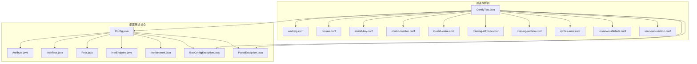
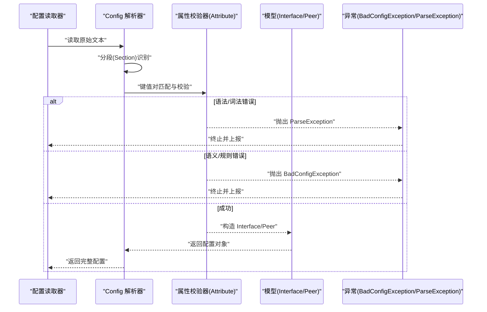
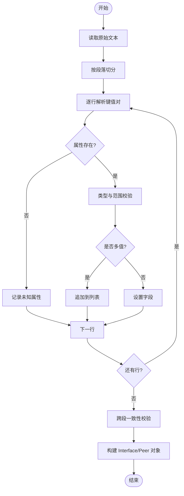
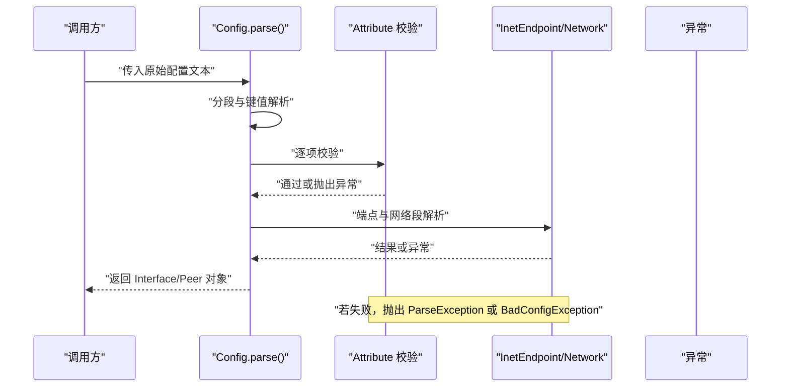
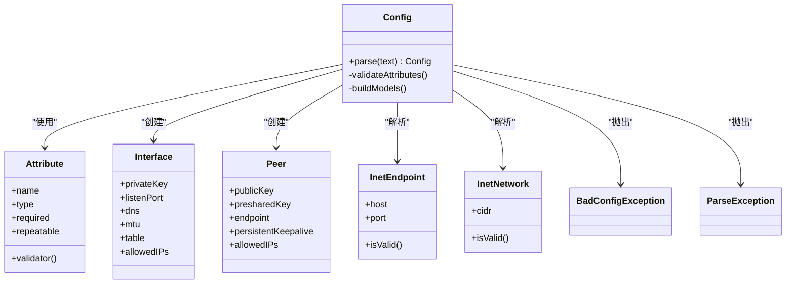

# 配置解析器

<cite>
**本文引用的文件**   
- [Config.java](file://tunnel/src/main/java/com/wireguard/config/Config.java)
- [Attribute.java](file://tunnel/src/main/java/com/wireguard/config/Attribute.java)
- [Interface.java](file://tunnel/src/main/java/com/wireguard/config/Interface.java)
- [Peer.java](file://tunnel/src/main/java/com/wireguard/config/Peer.java)
- [InetEndpoint.java](file://tunnel/src/main/java/com/wireguard/config/InetEndpoint.java)
- [InetNetwork.java](file://tunnel/src/main/java/com/wireguard/config/InetNetwork.java)
- [BadConfigException.java](file://tunnel/src/main/java/com/wireguard/config/BadConfigException.java)
- [ParseException.java](file://tunnel/src/main/java/com/wireguard/config/ParseException.java)
- [working.conf](file://tunnel/src/test/resources/working.conf)
- [broken.conf](file://tunnel/src/test/resources/broken.conf)
- [invalid-key.conf](file://tunnel/src/test/resources/invalid-key.conf)
- [invalid-number.conf](file://tunnel/src/test/resources/invalid-number.conf)
- [invalid-value.conf](file://tunnel/src/test/resources/invalid-value.conf)
- [missing-attribute.conf](file://tunnel/src/test/resources/missing-attribute.conf)
- [missing-section.conf](file://tunnel/src/test/resources/missing-section.conf)
- [syntax-error.conf](file://tunnel/src/test/resources/syntax-error.conf)
- [unknown-attribute.conf](file://tunnel/src/test/resources/unknown-attribute.conf)
- [unknown-section.conf](file://tunnel/src/test/resources/unknown-section.conf)
- [ConfigTest.java](file://tunnel/src/test/java/com/wireguard/config/ConfigTest.java)
</cite>

## 目录
1. [简介](#简介)
2. [项目结构](#项目结构)
3. [核心组件](#核心组件)
4. [架构总览](#架构总览)
5. [详细组件分析](#详细组件分析)
6. [依赖关系分析](#依赖关系分析)
7. [性能考量](#性能考量)
8. [故障排查指南](#故障排查指南)
9. [结论](#结论)
10. [附录](#附录)

## 简介
本技术文档聚焦于 WireGuard Android 项目的配置解析器，系统性阐述配置文件格式规范、语法结构、解析算法与数据结构设计。重点覆盖 Config 类的解析流程、Attribute 枚举及属性校验规则、错误处理机制（BadConfigException 与 ParseException）、配置文件的读取/验证/转换流程，并提供模板示例、高级特性说明、扩展点、版本兼容性与迁移策略，以及调试与验证方法。

## 项目结构
配置解析相关代码位于 tunnel 模块的 Java 包 com.wireguard.config 下，测试用例与样例配置文件位于同模块的 test 资源目录中。整体组织遵循“按功能域划分”的方式：接口段、对等体段、地址与端点解析、异常定义与工具类各自独立，便于维护与扩展。

图表来源
- [Config.java](file://tunnel/src/main/java/com/wireguard/config/Config.java)
- [Attribute.java](file://tunnel/src/main/java/com/wireguard/config/Attribute.java)
- [Interface.java](file://tunnel/src/main/java/com/wireguard/config/Interface.java)
- [Peer.java](file://tunnel/src/main/java/com/wireguard/config/Peer.java)
- [InetEndpoint.java](file://tunnel/src/main/java/com/wireguard/config/InetEndpoint.java)
- [InetNetwork.java](file://tunnel/src/main/java/com/wireguard/config/InetNetwork.java)
- [BadConfigException.java](file://tunnel/src/main/java/com/wireguard/config/BadConfigException.java)
- [ParseException.java](file://tunnel/src/main/java/com/wireguard/config/ParseException.java)
- [ConfigTest.java](file://tunnel/src/test/java/com/wireguard/config/ConfigTest.java)

章节来源
- [Config.java](file://tunnel/src/main/java/com/wireguard/config/Config.java)
- [Attribute.java](file://tunnel/src/main/java/com/wireguard/config/Attribute.java)
- [Interface.java](file://tunnel/src/main/java/com/wireguard/config/Interface.java)
- [Peer.java](file://tunnel/src/main/java/com/wireguard/config/Peer.java)
- [InetEndpoint.java](file://tunnel/src/main/java/com/wireguard/config/InetEndpoint.java)
- [InetNetwork.java](file://tunnel/src/main/java/com/wireguard/config/InetNetwork.java)
- [BadConfigException.java](file://tunnel/src/main/java/com/wireguard/config/BadConfigException.java)
- [ParseException.java](file://tunnel/src/main/java/com/wireguard/config/ParseException.java)
- [ConfigTest.java](file://tunnel/src/test/java/com/wireguard/config/ConfigTest.java)

## 核心组件
- Config：配置根对象，负责读取、分块解析、字段映射、跨段校验与最终对象构建。
- Attribute：属性枚举，集中定义支持的键名、取值范围、是否必填、是否可重复等元数据。
- Interface：接口段模型，包含监听端口、私钥、DNS、MTU、表路由等。
- Peer：对等体段模型，包含公钥、允许 IP、端点、持久连接、预共享密钥等。
- InetEndpoint：IP:Port 端点解析与校验。
- InetNetwork：CIDR 网络段解析与校验。
- BadConfigException：配置语义或业务规则不合法时抛出。
- ParseException：词法/语法解析失败时抛出。

章节来源
- [Config.java](file://tunnel/src/main/java/com/wireguard/config/Config.java)
- [Attribute.java](file://tunnel/src/main/java/com/wireguard/config/Attribute.java)
- [Interface.java](file://tunnel/src/main/java/com/wireguard/config/Interface.java)
- [Peer.java](file://tunnel/src/main/java/com/wireguard/config/Peer.java)
- [InetEndpoint.java](file://tunnel/src/main/java/com/wireguard/config/InetEndpoint.java)
- [InetNetwork.java](file://tunnel/src/main/java/com/wireguard/config/InetNetwork.java)
- [BadConfigException.java](file://tunnel/src/main/java/com/wireguard/config/BadConfigException.java)
- [ParseException.java](file://tunnel/src/main/java/com/wireguard/config/ParseException.java)

## 架构总览
配置解析采用“分块—键值—校验—建模”的分层流水线：先按段落切分，再逐行解析键值对，随后进行类型与语义校验，最后组装为强类型的 Interface/Peer 对象。异常体系将“语法错误”和“语义错误”分离，便于上层定位问题。

图表来源
- [Config.java](file://tunnel/src/main/java/com/wireguard/config/Config.java)
- [Attribute.java](file://tunnel/src/main/java/com/wireguard/config/Attribute.java)
- [Interface.java](file://tunnel/src/main/java/com/wireguard/config/Interface.java)
- [Peer.java](file://tunnel/src/main/java/com/wireguard/config/Peer.java)
- [BadConfigException.java](file://tunnel/src/main/java/com/wireguard/config/BadConfigException.java)
- [ParseException.java](file://tunnel/src/main/java/com/wireguard/config/ParseException.java)

## 详细组件分析

### Config 类：解析算法与数据结构
- 输入：原始配置文本（字符串或字节流）。
- 阶段一：空白与注释过滤、段落边界识别（以 [section] 形式）。
- 阶段二：逐行拆分键值对，支持多值键（如 AllowedIPs）与去重策略。
- 阶段三：基于 Attribute 枚举进行类型转换与范围校验（端口、数字、布尔、Base64 等）。
- 阶段四：跨段一致性检查（例如接口段必填项、对等体段必填项、端点合法性等）。
- 输出：不可变或受保护的 Interface/Peer 对象集合，供上层使用。

关键设计要点
- 严格区分“未知段落/未知属性”与“缺失必填项”，分别抛出不同异常类型。
- 对多值属性提供有序集合存储，保留用户书写顺序。
- 对数值型属性统一进行范围与进制解析，避免溢出与非法字符。
- 对 Base64 长度与填充进行校验，确保密钥完整性。

图表来源
- [Config.java](file://tunnel/src/main/java/com/wireguard/config/Config.java)
- [Attribute.java](file://tunnel/src/main/java/com/wireguard/config/Attribute.java)

章节来源
- [Config.java](file://tunnel/src/main/java/com/wireguard/config/Config.java)
- [Attribute.java](file://tunnel/src/main/java/com/wireguard/config/Attribute.java)

### Attribute 枚举：属性定义与校验规则
- 键名与归属段落：明确每个属性属于 Interface 或 Peer 段。
- 数据类型：字符串、整数、布尔、Base64、IP/CIDR、端口等。
- 约束：是否必填、是否可重复、取值范围（如端口 1-65535）、格式（如 CIDR、IPv4/IPv6）。
- 默认值：部分属性具备默认行为（如某些布尔开关）。

校验流程
- 词法：去除首尾空白、忽略空行与注释行。
- 语法：键=值 形式，值可为单值或多值（逗号分隔）。
- 语义：根据 Attribute 定义的规则执行类型转换与范围检查。

章节来源
- [Attribute.java](file://tunnel/src/main/java/com/wireguard/config/Attribute.java)

### Interface 与 Peer：模型结构与约束
- Interface：包含私钥、监听端口、DNS、MTU、Table、AllowedIPs（用于路由）等。
- Peer：包含公钥、预共享密钥、端点、持久连接、AllowedIPs、发送/接收计数器等。
- 约束：私钥/公钥长度与编码；端口范围；AllowedIPs 必须为有效 CIDR；端点必须为有效主机:端口。

章节来源
- [Interface.java](file://tunnel/src/main/java/com/wireguard/config/Interface.java)
- [Peer.java](file://tunnel/src/main/java/com/wireguard/config/Peer.java)

### InetEndpoint 与 InetNetwork：地址与端点解析
- InetEndpoint：解析 host:port，支持 IPv4、IPv6（含方括号表示），端口范围校验。
- InetNetwork：解析 CIDR，支持 IPv4/IPv6，掩码长度校验，网络地址规范化。

章节来源
- [InetEndpoint.java](file://tunnel/src/main/java/com/wireguard/config/InetEndpoint.java)
- [InetNetwork.java](file://tunnel/src/main/java/com/wireguard/config/InetNetwork.java)

### 异常体系：BadConfigException 与 ParseException
- ParseException：词法/语法错误（如缺少等号、未知段落、未知属性、行格式错误）。
- BadConfigException：语义/规则错误（如必填项缺失、数值越界、Base64 非法、CIDR 非法、端口无效）。
- 错误信息应包含位置（段落、行号）与上下文，便于快速定位。

章节来源
- [BadConfigException.java](file://tunnel/src/main/java/com/wireguard/config/BadConfigException.java)
- [ParseException.java](file://tunnel/src/main/java/com/wireguard/config/ParseException.java)

### 配置读取、验证与转换流程

图表来源
- [Config.java](file://tunnel/src/main/java/com/wireguard/config/Config.java)
- [Attribute.java](file://tunnel/src/main/java/com/wireguard/config/Attribute.java)
- [InetEndpoint.java](file://tunnel/src/main/java/com/wireguard/config/InetEndpoint.java)
- [InetNetwork.java](file://tunnel/src/main/java/com/wireguard/config/InetNetwork.java)
- [BadConfigException.java](file://tunnel/src/main/java/com/wireguard/config/BadConfigException.java)
- [ParseException.java](file://tunnel/src/main/java/com/wireguard/config/ParseException.java)

章节来源
- [Config.java](file://tunnel/src/main/java/com/wireguard/config/Config.java)

## 依赖关系分析
- Config 依赖 Attribute 完成键名与规则映射，依赖 Interface/Pear 完成建模，依赖 InetEndpoint/InetNetwork 完成地址解析，依赖异常类完成错误传播。
- Attribute 作为“规则中心”，降低 Config 与具体字段之间的耦合度，提升可扩展性。
- 测试用例通过多种样例配置驱动解析路径，覆盖正常与异常分支。

图表来源
- [Config.java](file://tunnel/src/main/java/com/wireguard/config/Config.java)
- [Attribute.java](file://tunnel/src/main/java/com/wireguard/config/Attribute.java)
- [Interface.java](file://tunnel/src/main/java/com/wireguard/config/Interface.java)
- [Peer.java](file://tunnel/src/main/java/com/wireguard/config/Peer.java)
- [InetEndpoint.java](file://tunnel/src/main/java/com/wireguard/config/InetEndpoint.java)
- [InetNetwork.java](file://tunnel/src/main/java/com/wireguard/config/InetNetwork.java)
- [BadConfigException.java](file://tunnel/src/main/java/com/wireguard/config/BadConfigException.java)
- [ParseException.java](file://tunnel/src/main/java/com/wireguard/config/ParseException.java)

章节来源
- [Config.java](file://tunnel/src/main/java/com/wireguard/config/Config.java)
- [Attribute.java](file://tunnel/src/main/java/com/wireguard/config/Attribute.java)
- [Interface.java](file://tunnel/src/main/java/com/wireguard/config/Interface.java)
- [Peer.java](file://tunnel/src/main/java/com/wireguard/config/Peer.java)
- [InetEndpoint.java](file://tunnel/src/main/java/com/wireguard/config/InetEndpoint.java)
- [InetNetwork.java](file://tunnel/src/main/java/com/wireguard/config/InetNetwork.java)
- [BadConfigException.java](file://tunnel/src/main/java/com/wireguard/config/BadConfigException.java)
- [ParseException.java](file://tunnel/src/main/java/com/wireguard/config/ParseException.java)

## 性能考量
- 解析复杂度：O(N) 线性扫描，N 为配置行数。多值属性追加操作均摊 O(1)。
- 内存占用：配置对象不可变或最小化可变状态，避免中间大对象复制。
- I/O 优化：建议一次性读取至内存缓冲，减少系统调用次数。
- 校验开销：类型转换与正则匹配集中在 Attribute 层，避免重复计算。
- 扩展点：新增属性只需在 Attribute 中声明规则，无需修改解析主干。

[本节为通用指导，不直接分析具体文件]

## 故障排查指南
常见错误与定位方法
- 语法错误（ParseException）
  - 现象：段落未闭合、键值格式错误、未知段落名。
  - 排查：检查配置文件中的 [section] 与 key=value 格式，确认无多余空格或中文标点。
  - 参考样例：syntax-error.conf、unknown-section.conf。
- 语义错误（BadConfigException）
  - 现象：必填项缺失、端口越界、Base64 非法、CIDR 非法、未知属性。
  - 排查：对照 Attribute 定义，逐项核对类型与范围；使用测试样例对比差异。
  - 参考样例：missing-attribute.conf、invalid-key.conf、invalid-number.conf、invalid-value.conf、unknown-attribute.conf。
- 断言与单元测试
  - 使用 ConfigTest 覆盖正常与异常路径，逐步缩小问题范围。
  - 针对特定配置片段，构造最小复现用例，快速定位。

调试建议
- 打印解析日志：记录当前段落、行号、键名与原始值。
- 隔离解析阶段：先运行词法/语法阶段，再运行语义校验阶段。
- 使用样例配置：working.conf 作为基准，逐步引入变更观察行为。

章节来源
- [ConfigTest.java](file://tunnel/src/test/java/com/wireguard/config/ConfigTest.java)
- [working.conf](file://tunnel/src/test/resources/working.conf)
- [broken.conf](file://tunnel/src/test/resources/broken.conf)
- [invalid-key.conf](file://tunnel/src/test/resources/invalid-key.conf)
- [invalid-number.conf](file://tunnel/src/test/resources/invalid-number.conf)
- [invalid-value.conf](file://tunnel/src/test/resources/invalid-value.conf)
- [missing-attribute.conf](file://tunnel/src/test/resources/missing-attribute.conf)
- [missing-section.conf](file://tunnel/src/test/resources/missing-section.conf)
- [syntax-error.conf](file://tunnel/src/test/resources/syntax-error.conf)
- [unknown-attribute.conf](file://tunnel/src/test/resources/unknown-attribute.conf)
- [unknown-section.conf](file://tunnel/src/test/resources/unknown-section.conf)

## 结论
本配置解析器以 Attribute 为中心实现高内聚、低耦合的键值校验与建模，结合清晰的异常分层与完善的测试样例，能够稳定支撑 WireGuard 配置文件的读取、验证与转换。通过扩展 Attribute 与新增解析规则，可在不侵入主流程的前提下平滑演进。

[本节为总结性内容，不直接分析具体文件]

## 附录

### 配置文件模板与示例
- 基础模板
  - [interface] 段：填写私钥、监听端口、DNS、MTU、Table、AllowedIPs。
  - [peer] 段：填写公钥、可选预共享密钥、端点、持久连接、AllowedIPs。
- 工作样例
  - working.conf：标准可用配置，可作为基线模板。
- 错误样例
  - broken.conf、syntax-error.conf、unknown-section.conf：语法与结构错误。
  - invalid-key.conf、invalid-number.conf、invalid-value.conf、unknown-attribute.conf：类型与值错误。
  - missing-attribute.conf、missing-section.conf：必填项缺失。

章节来源
- [working.conf](file://tunnel/src/test/resources/working.conf)
- [broken.conf](file://tunnel/src/test/resources/broken.conf)
- [syntax-error.conf](file://tunnel/src/test/resources/syntax-error.conf)
- [unknown-section.conf](file://tunnel/src/test/resources/unknown-section.conf)
- [invalid-key.conf](file://tunnel/src/test/resources/invalid-key.conf)
- [invalid-number.conf](file://tunnel/src/test/resources/invalid-number.conf)
- [invalid-value.conf](file://tunnel/src/test/resources/invalid-value.conf)
- [unknown-attribute.conf](file://tunnel/src/test/resources/unknown-attribute.conf)
- [missing-attribute.conf](file://tunnel/src/test/resources/missing-attribute.conf)
- [missing-section.conf](file://tunnel/src/test/resources/missing-section.conf)

### 高级特性与扩展点
- 多值属性：如 AllowedIPs 支持多条，保持顺序与去重策略。
- 自定义属性扩展：在 Attribute 中新增条目，定义类型、范围与校验逻辑，无需改动解析主干。
- 版本兼容：通过 Attribute 的版本标记与降级策略，支持向后兼容与渐进式弃用。
- 国际化错误消息：将异常信息抽取为本地化资源，便于用户理解。

[本节为概念性内容，不直接分析具体文件]

### 配置迁移与版本兼容性
- 版本标识：建议在配置头部添加版本字段（如 # version=1），由解析器读取并校验。
- 迁移策略：
  - 新增必填项：旧配置自动补全默认值或拒绝加载并提示迁移。
  - 废弃属性：解析器发出警告并转换为新字段。
  - 字段重命名：提供别名映射，保证双向兼容。
- 自动化迁移：提供迁移脚本或工具，批量更新历史配置。

[本节为概念性内容，不直接分析具体文件]

### 配置验证工具与调试方法
- 单元测试驱动：利用 ConfigTest 覆盖各类场景，快速回归。
- 命令行验证：封装解析入口，输出结构化诊断报告（段落、行号、错误类型与建议）。
- 日志与追踪：开启详细日志，记录解析阶段、键名、原始值与校验结果。
- 最小复现实例：从 working.conf 出发，逐步替换字段，定位问题根源。

章节来源
- [ConfigTest.java](file://tunnel/src/test/java/com/wireguard/config/ConfigTest.java)