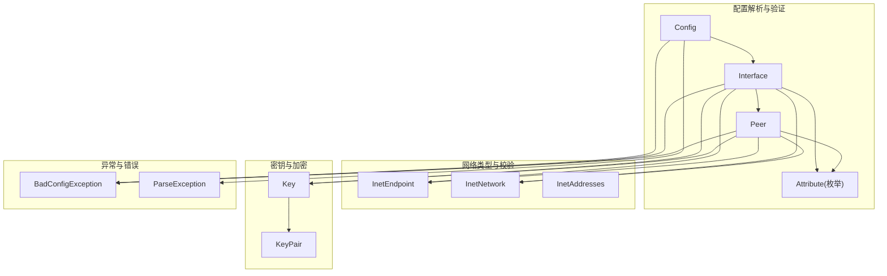
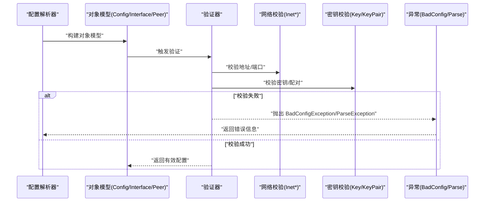
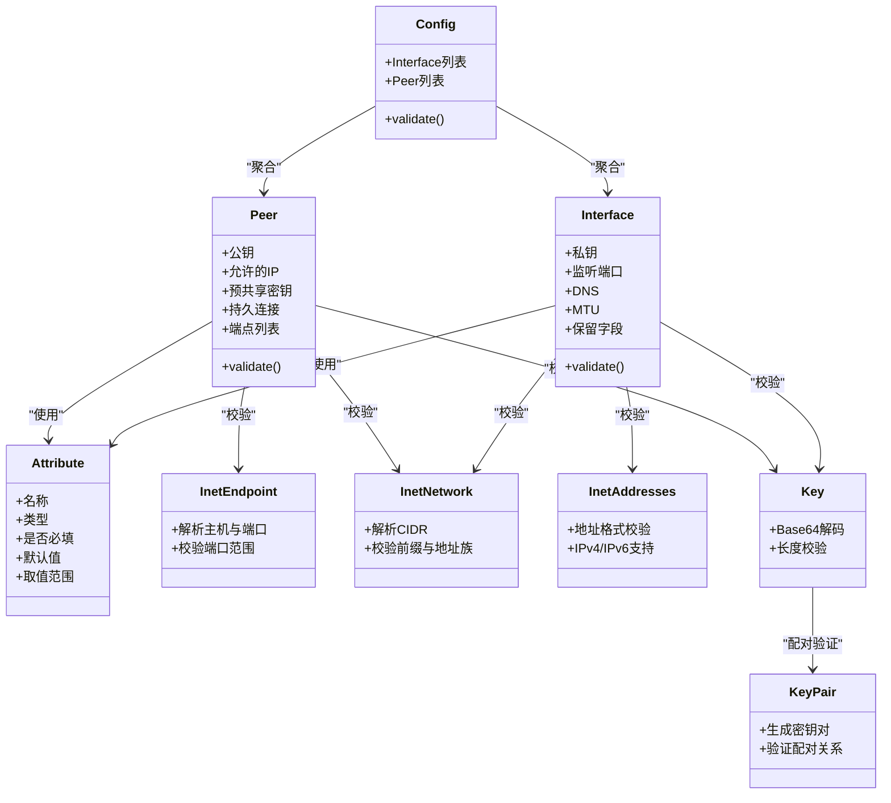

# 配置验证规则

<cite>
**本文引用的文件**   
- [Attribute.java](file://tunnel/src/main/java/com/wireguard/config/Attribute.java)
- [Interface.java](file://tunnel/src/main/java/com/wireguard/config/Interface.java)
- [Peer.java](file://tunnel/src/main/java/com/wireguard/config/Peer.java)
- [Config.java](file://tunnel/src/main/java/com/wireguard/config/Config.java)
- [InetEndpoint.java](file://tunnel/src/main/java/com/wireguard/config/InetEndpoint.java)
- [InetNetwork.java](file://tunnel/src/main/java/com/wireguard/config/InetNetwork.java)
- [InetAddresses.java](file://tunnel/src/main/java/com/wireguard/config/InetAddresses.java)
- [Key.java](file://tunnel/src/main/java/com/wireguard/crypto/Key.java)
- [KeyPair.java](file://tunnel/src/main/java/com/wireguard/crypto/KeyPair.java)
- [BadConfigException.java](file://tunnel/src/main/java/com/wireguard/config/BadConfigException.java)
- [ParseException.java](file://tunnel/src/main/java/com/wireguard/config/ParseException.java)
</cite>

## 目录
1. [简介](#简介)
2. [项目结构](#项目结构)
3. [核心组件](#核心组件)
4. [架构总览](#架构总览)
5. [详细组件分析](#详细组件分析)
6. [依赖关系分析](#依赖关系分析)
7. [性能考虑](#性能考虑)
8. [故障排查指南](#故障排查指南)
9. [结论](#结论)
10. [附录](#附录)

## 简介
本技术文档聚焦于 WireGuard Android 项目中“配置验证规则”的实现与规范，围绕以下目标展开：
- 解释 Attribute 枚举中定义的属性验证逻辑与数据类型检查。
- 说明 Interface 与 Peer 类中的业务规则验证（必填字段、值域约束）。
- 记录密钥格式的验证规则（Base64 编码、长度校验）及私钥与公钥匹配检查。
- 阐述网络地址与端口的有效性验证逻辑。
- 描述配置完整性与一致性检查流程。
- 提供自定义验证规则的扩展机制建议。
- 给出验证性能优化与批量验证策略。

## 项目结构
配置验证相关代码集中在 tunnel 模块的 config 与 crypto 包中，核心对象包括 Config、Interface、Peer、Attribute 以及网络与密钥工具类。整体采用分层设计：解析层负责将文本配置转换为对象模型，验证层对对象模型进行类型、值域与业务规则校验，异常层统一抛出结构化错误信息。

图表来源
- [Config.java](file://tunnel/src/main/java/com/wireguard/config/Config.java)
- [Interface.java](file://tunnel/src/main/java/com/wireguard/config/Interface.java)
- [Peer.java](file://tunnel/src/main/java/com/wireguard/config/Peer.java)
- [Attribute.java](file://tunnel/src/main/java/com/wireguard/config/Attribute.java)
- [InetEndpoint.java](file://tunnel/src/main/java/com/wireguard/config/InetEndpoint.java)
- [InetNetwork.java](file://tunnel/src/main/java/com/wireguard/config/InetNetwork.java)
- [InetAddresses.java](file://tunnel/src/main/java/com/wireguard/config/InetAddresses.java)
- [Key.java](file://tunnel/src/main/java/com/wireguard/crypto/Key.java)
- [KeyPair.java](file://tunnel/src/main/java/com/wireguard/crypto/KeyPair.java)
- [BadConfigException.java](file://tunnel/src/main/java/com/wireguard/config/BadConfigException.java)
- [ParseException.java](file://tunnel/src/main/java/com/wireguard/config/ParseException.java)

章节来源
- [Config.java](file://tunnel/src/main/java/com/wireguard/config/Config.java)
- [Interface.java](file://tunnel/src/main/java/com/wireguard/config/Interface.java)
- [Peer.java](file://tunnel/src/main/java/com/wireguard/config/Peer.java)
- [Attribute.java](file://tunnel/src/main/java/com/wireguard/config/Attribute.java)
- [InetEndpoint.java](file://tunnel/src/main/java/com/wireguard/config/InetEndpoint.java)
- [InetNetwork.java](file://tunnel/src/main/java/com/wireguard/config/InetNetwork.java)
- [InetAddresses.java](file://tunnel/src/main/java/com/wireguard/config/InetAddresses.java)
- [Key.java](file://tunnel/src/main/java/com/wireguard/crypto/Key.java)
- [KeyPair.java](file://tunnel/src/main/java/com/wireguard/crypto/KeyPair.java)
- [BadConfigException.java](file://tunnel/src/main/java/com/wireguard/config/BadConfigException.java)
- [ParseException.java](file://tunnel/src/main/java/com/wireguard/config/ParseException.java)

## 核心组件
- Attribute 枚举：定义配置项的名称、数据类型与可选性，作为解析与校验的基础契约。
- Interface 类：表示隧道接口，包含监听端口、私钥、DNS、MTU、保留字段等，并执行必填与值域校验。
- Peer 类：表示对等端，包含公钥、允许的 IP、预共享密钥、持久连接、端点列表等，并执行必填与值域校验。
- InetEndpoint / InetNetwork / InetAddresses：封装网络地址与端口解析、范围校验与格式验证。
- Key / KeyPair：封装密钥的 Base64 解码、长度校验与配对关系验证。
- BadConfigException / ParseException：统一的配置错误与解析异常类型，便于上层捕获与提示。

章节来源
- [Attribute.java](file://tunnel/src/main/java/com/wireguard/config/Attribute.java)
- [Interface.java](file://tunnel/src/main/java/com/wireguard/config/Interface.java)
- [Peer.java](file://tunnel/src/main/java/com/wireguard/config/Peer.java)
- [InetEndpoint.java](file://tunnel/src/main/java/com/wireguard/config/InetEndpoint.java)
- [InetNetwork.java](file://tunnel/src/main/java/com/wireguard/config/InetNetwork.java)
- [InetAddresses.java](file://tunnel/src/main/java/com/wireguard/config/InetAddresses.java)
- [Key.java](file://tunnel/src/main/java/com/wireguard/crypto/Key.java)
- [KeyPair.java](file://tunnel/src/main/java/com/wireguard/crypto/KeyPair.java)
- [BadConfigException.java](file://tunnel/src/main/java/com/wireguard/config/BadConfigException.java)
- [ParseException.java](file://tunnel/src/main/java/com/wireguard/config/ParseException.java)

## 架构总览
配置验证的整体流程如下：
- 解析阶段：将配置文件文本按节与键值对解析为对象模型（Config -> Interface -> Peer），同时根据 Attribute 枚举进行基础类型与存在性检查。
- 校验阶段：对 Interface 与 Peer 执行必填字段、值域与业务规则校验；对网络地址与端口进行格式与范围校验；对密钥进行 Base64 与长度校验，并进行私钥与公钥匹配检查。
- 异常处理：所有校验失败均通过 BadConfigException 或 ParseException 抛出，携带明确的错误上下文（如字段名、位置、原因）。

图表来源
- [Config.java](file://tunnel/src/main/java/com/wireguard/config/Config.java)
- [Interface.java](file://tunnel/src/main/java/com/wireguard/config/Interface.java)
- [Peer.java](file://tunnel/src/main/java/com/wireguard/config/Peer.java)
- [InetEndpoint.java](file://tunnel/src/main/java/com/wireguard/config/InetEndpoint.java)
- [InetNetwork.java](file://tunnel/src/main/java/com/wireguard/config/InetNetwork.java)
- [InetAddresses.java](file://tunnel/src/main/java/com/wireguard/config/InetAddresses.java)
- [Key.java](file://tunnel/src/main/java/com/wireguard/crypto/Key.java)
- [KeyPair.java](file://tunnel/src/main/java/com/wireguard/crypto/KeyPair.java)
- [BadConfigException.java](file://tunnel/src/main/java/com/wireguard/config/BadConfigException.java)
- [ParseException.java](file://tunnel/src/main/java/com/wireguard/config/ParseException.java)

## 详细组件分析

### Attribute 枚举：属性验证与数据类型检查
- 作用：定义每个配置项的名称、是否必填、默认值、数据类型与取值范围。
- 数据类型检查：在解析时依据 Attribute 的类型信息进行字符串到具体类型的转换与校验（如整数、布尔、IP、端口等）。
- 必填性与默认值：对于必填项缺失直接报错；非必填项可设置默认值以减少后续校验负担。
- 扩展机制：新增属性需在 Attribute 中声明，并在 Interface/Peer 的验证逻辑中引用，确保一致性与可维护性。

章节来源
- [Attribute.java](file://tunnel/src/main/java/com/wireguard/config/Attribute.java)

### Interface 类：接口级业务规则验证
- 必填字段：如私钥、监听端口等关键属性必须存在且合法。
- 值域校验：监听端口必须在允许范围内；DNS、MTU、保留字段需满足数值与格式要求。
- 网络校验：IPv4/IPv6 地址与掩码合法性由 InetNetwork 与 InetAddresses 保障。
- 密钥校验：私钥需符合 Base64 与长度要求，必要时与公钥进行配对验证。

章节来源
- [Interface.java](file://tunnel/src/main/java/com/wireguard/config/Interface.java)
- [InetNetwork.java](file://tunnel/src/main/java/com/wireguard/config/InetNetwork.java)
- [InetAddresses.java](file://tunnel/src/main/java/com/wireguard/config/InetAddresses.java)
- [Key.java](file://tunnel/src/main/java/com/wireguard/crypto/Key.java)

### Peer 类：对等端业务规则验证
- 必填字段：公钥为必填；其他如预共享密钥、持久连接标志等为可选但需满足类型与值域。
- 值域校验：允许的 IP 列表需为合法 CIDR；端点列表中的地址与端口需通过 InetEndpoint 校验。
- 密钥校验：公钥需符合 Base64 与长度要求；若存在预共享密钥，则需额外校验其格式与长度。
- 依赖关系：公钥应与 Interface 私钥匹配（若实现了对称性检查），否则视为不一致。

章节来源
- [Peer.java](file://tunnel/src/main/java/com/wireguard/config/Peer.java)
- [InetEndpoint.java](file://tunnel/src/main/java/com/wireguard/config/InetEndpoint.java)
- [Key.java](file://tunnel/src/main/java/com/wireguard/crypto/Key.java)

### 网络地址与端口有效性验证
- InetEndpoint：解析主机名或 IP 与端口组合，校验端口范围与协议支持。
- InetNetwork：解析 CIDR 表示的网络段，校验前缀长度与地址族一致性。
- InetAddresses：提供底层地址解析与格式校验，确保 IPv4/IPv6 的正确性。

章节来源
- [InetEndpoint.java](file://tunnel/src/main/java/com/wireguard/config/InetEndpoint.java)
- [InetNetwork.java](file://tunnel/src/main/java/com/wireguard/config/InetNetwork.java)
- [InetAddresses.java](file://tunnel/src/main/java/com/wireguard/config/InetAddresses.java)

### 密钥格式与配对验证
- Key：对 Base64 编码的密钥进行解码与长度校验，确保符合 Curve25519 等算法要求。
- KeyPair：用于生成或验证密钥对，确保私钥与公钥的数学关系正确。
- 配对检查：在配置验证中，若需要，可对 Interface 私钥与 Peer 公钥进行匹配检查，防止配置不一致。

章节来源
- [Key.java](file://tunnel/src/main/java/com/wireguard/crypto/Key.java)
- [KeyPair.java](file://tunnel/src/main/java/com/wireguard/crypto/KeyPair.java)

### 配置完整性与一致性检查
- 完整性：确保所有必填字段存在、类型正确、值域合法。
- 一致性：确保网络段不冲突、端点可达性合理、密钥配对正确。
- 全局校验：在 Config 层汇总 Interface 与 Peer 的校验结果，输出统一的错误报告。

章节来源
- [Config.java](file://tunnel/src/main/java/com/wireguard/config/Config.java)
- [BadConfigException.java](file://tunnel/src/main/java/com/wireguard/config/BadConfigException.java)
- [ParseException.java](file://tunnel/src/main/java/com/wireguard/config/ParseException.java)

### 自定义验证规则的扩展机制
- 在 Attribute 中声明新属性的类型与约束。
- 在 Interface/Peer 的验证方法中添加对应的值域与业务规则检查。
- 使用 BadConfigException 抛出明确错误信息，便于上层处理与用户提示。
- 建议在验证器中引入策略模式，将不同属性的校验逻辑解耦，提升可扩展性。

章节来源
- [Attribute.java](file://tunnel/src/main/java/com/wireguard/config/Attribute.java)
- [Interface.java](file://tunnel/src/main/java/com/wireguard/config/Interface.java)
- [Peer.java](file://tunnel/src/main/java/com/wireguard/config/Peer.java)
- [BadConfigException.java](file://tunnel/src/main/java/com/wireguard/config/BadConfigException.java)

## 依赖关系分析
- Interface 依赖 Attribute 以获取属性元数据，依赖 Inet* 进行网络校验，依赖 Key 进行密钥校验。
- Peer 依赖 Attribute、InetEndpoint、InetNetwork、Key 进行对等端规则校验。
- Config 聚合 Interface 与 Peer 的校验结果，统一抛出异常。
- 密钥模块 Key/KeyPair 独立于配置模块，提供密码学原语与配对验证。

图表来源
- [Attribute.java](file://tunnel/src/main/java/com/wireguard/config/Attribute.java)
- [Interface.java](file://tunnel/src/main/java/com/wireguard/config/Interface.java)
- [Peer.java](file://tunnel/src/main/java/com/wireguard/config/Peer.java)
- [InetEndpoint.java](file://tunnel/src/main/java/com/wireguard/config/InetEndpoint.java)
- [InetNetwork.java](file://tunnel/src/main/java/com/wireguard/config/InetNetwork.java)
- [InetAddresses.java](file://tunnel/src/main/java/com/wireguard/config/InetAddresses.java)
- [Key.java](file://tunnel/src/main/java/com/wireguard/crypto/Key.java)
- [KeyPair.java](file://tunnel/src/main/java/com/wireguard/crypto/KeyPair.java)
- [Config.java](file://tunnel/src/main/java/com/wireguard/config/Config.java)

章节来源
- [Attribute.java](file://tunnel/src/main/java/com/wireguard/config/Attribute.java)
- [Interface.java](file://tunnel/src/main/java/com/wireguard/config/Interface.java)
- [Peer.java](file://tunnel/src/main/java/com/wireguard/config/Peer.java)
- [InetEndpoint.java](file://tunnel/src/main/java/com/wireguard/config/InetEndpoint.java)
- [InetNetwork.java](file://tunnel/src/main/java/com/wireguard/config/InetNetwork.java)
- [InetAddresses.java](file://tunnel/src/main/java/com/wireguard/config/InetAddresses.java)
- [Key.java](file://tunnel/src/main/java/com/wireguard/crypto/Key.java)
- [KeyPair.java](file://tunnel/src/main/java/com/wireguard/crypto/KeyPair.java)
- [Config.java](file://tunnel/src/main/java/com/wireguard/config/Config.java)

## 性能考虑
- 批量验证：对多个 Peer 或 Interface 的验证应顺序执行并累积错误，避免单次失败导致整体阻塞。
- 短路校验：优先执行快速失败的校验（如必填字段、Base64 格式），减少不必要的计算。
- 缓存解析结果：对频繁使用的地址与密钥解析结果进行缓存，降低重复开销。
- 并行化：在网络与密钥校验之间无强依赖时，可考虑并行执行以提升吞吐。

[本节为通用指导，无需特定文件来源]

## 故障排查指南
- 常见错误类型：
  - BadConfigException：配置结构或值域不符合预期。
  - ParseException：解析阶段出现语法或格式错误。
- 定位方法：
  - 检查 Attribute 定义与实际配置是否一致。
  - 核对 Interface/Peer 的必填字段与值域约束。
  - 验证密钥的 Base64 编码与长度是否符合要求。
  - 确认网络地址与端口的格式与范围。
- 修复建议：
  - 修正拼写错误或遗漏字段。
  - 调整数值范围或格式（如端口、掩码）。
  - 重新生成或粘贴正确的密钥。
  - 检查 DNS、MTU、保留字段的合法性。

章节来源
- [BadConfigException.java](file://tunnel/src/main/java/com/wireguard/config/BadConfigException.java)
- [ParseException.java](file://tunnel/src/main/java/com/wireguard/config/ParseException.java)

## 结论
WireGuard Android 的配置验证体系以 Attribute 为契约核心，结合 Interface/Peer 的业务规则、网络与密钥工具类，形成完整、严谨的校验流程。通过统一的异常类型与清晰的依赖关系，系统具备良好的可维护性与扩展性。建议在实际使用中遵循必填与值域约束，合理使用批量与短路策略提升性能，并通过自定义扩展机制适配新的配置需求。

[本节为总结性内容，无需特定文件来源]

## 附录
- 最佳实践：
  - 在新增属性时同步更新 Attribute 与验证逻辑。
  - 对复杂校验逻辑编写单元测试，覆盖边界条件。
  - 对用户输入进行前置校验，减少后端压力。
- 参考实现路径：
  - 属性定义与校验：[Attribute.java](file://tunnel/src/main/java/com/wireguard/config/Attribute.java)
  - 接口与对等端验证：[Interface.java](file://tunnel/src/main/java/com/wireguard/config/Interface.java)、[Peer.java](file://tunnel/src/main/java/com/wireguard/config/Peer.java)
  - 网络与密钥校验：[InetEndpoint.java](file://tunnel/src/main/java/com/wireguard/config/InetEndpoint.java)、[InetNetwork.java](file://tunnel/src/main/java/com/wireguard/config/InetNetwork.java)、[InetAddresses.java](file://tunnel/src/main/java/com/wireguard/config/InetAddresses.java)、[Key.java](file://tunnel/src/main/java/com/wireguard/crypto/Key.java)、[KeyPair.java](file://tunnel/src/main/java/com/wireguard/crypto/KeyPair.java)
  - 异常处理：[BadConfigException.java](file://tunnel/src/main/java/com/wireguard/config/BadConfigException.java)、[ParseException.java](file://tunnel/src/main/java/com/wireguard/config/ParseException.java)