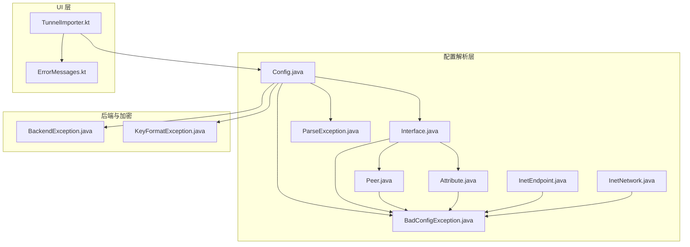
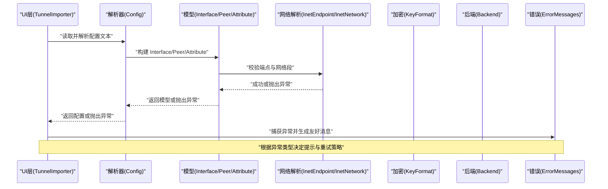
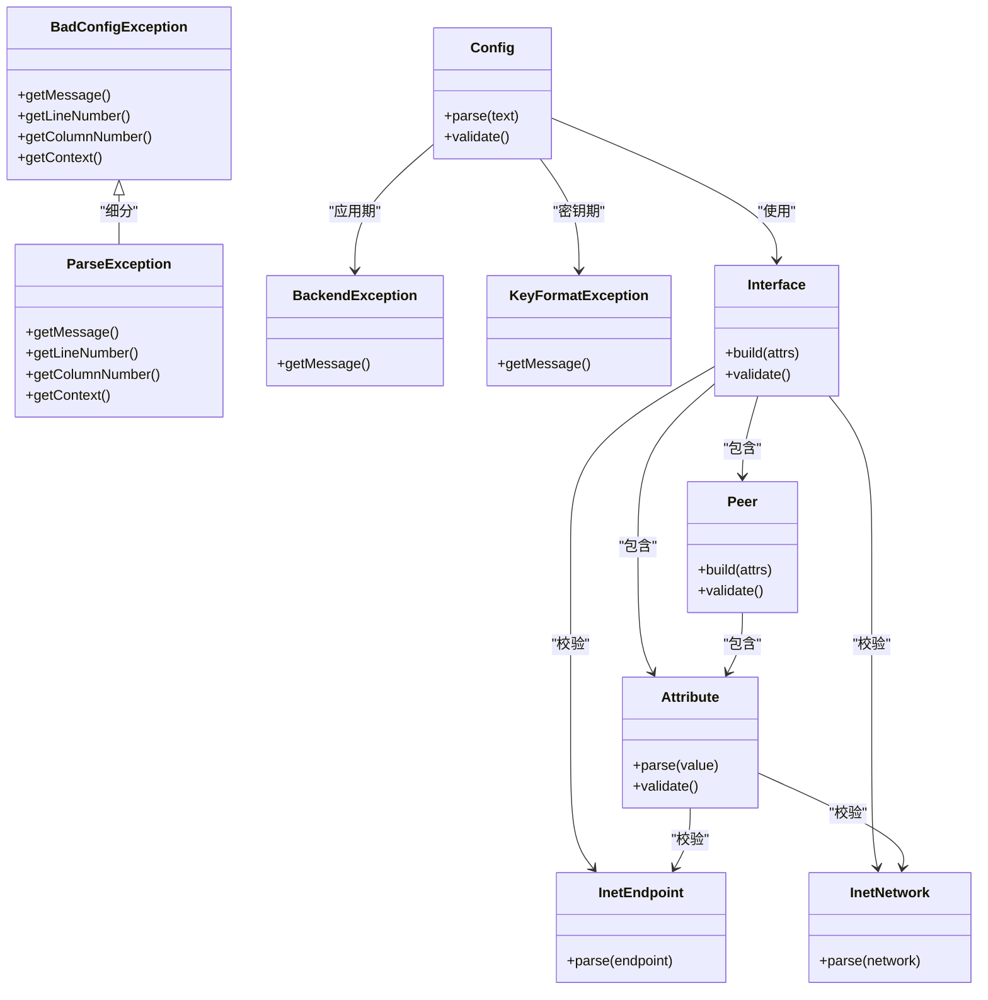
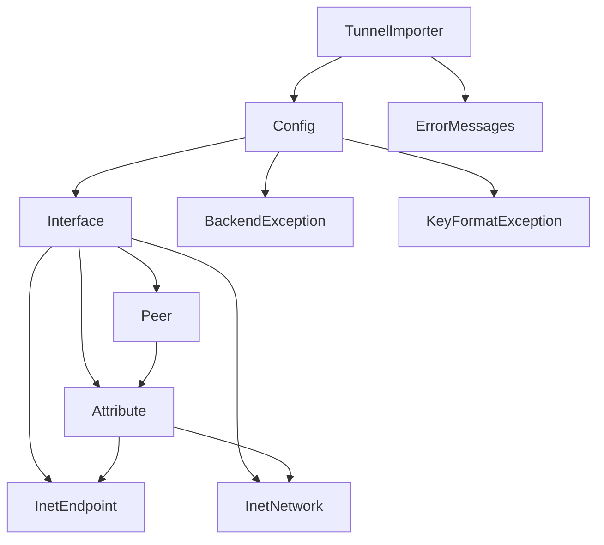

# 错误处理机制

<cite>
**本文引用的文件**   
- [BadConfigException.java](file://tunnel/src/main/java/com/wireguard/config/BadConfigException.java)
- [ParseException.java](file://tunnel/src/main/java/com/wireguard/config/ParseException.java)
- [Config.java](file://tunnel/src/main/java/com/wireguard/config/Config.java)
- [Interface.java](file://tunnel/src/main/java/com/wireguard/config/Interface.java)
- [Peer.java](file://tunnel/src/main/java/com/wireguard/config/Peer.java)
- [Attribute.java](file://tunnel/src/main/java/com/wireguard/config/Attribute.java)
- [InetEndpoint.java](file://tunnel/src/main/java/com/wireguard/config/InetEndpoint.java)
- [InetNetwork.java](file://tunnel/src/main/java/com/wireguard/config/InetNetwork.java)
- [BackendException.java](file://tunnel/src/main/java/com/wireguard/android/backend/BackendException.java)
- [KeyFormatException.java](file://tunnel/src/main/java/com/wireguard/crypto/KeyFormatException.java)
- [ErrorMessages.kt](file://ui/src/main/java/com/wireguard/android/util/ErrorMessages.kt)
- [TunnelImporter.kt](file://ui/src/main/java/com/wireguard/android/util/TunnelImporter.kt)
- [BadConfigExceptionTest.java](file://tunnel/src/test/java/com/wireguard/config/BadConfigExceptionTest.java)
- [ConfigTest.java](file://tunnel/src/test/java/com/wireguard/config/ConfigTest.java)
- [syntax-error.conf](file://tunnel/src/test/resources/syntax-error.conf)
- [missing-section.conf](file://tunnel/src/test/resources/missing-section.conf)
- [unknown-section.conf](file://tunnel/src/test/resources/unknown-section.conf)
- [missing-attribute.conf](file://tunnel/src/test/resources/missing-attribute.conf)
- [unknown-attribute.conf](file://tunnel/src/test/resources/unknown-attribute.conf)
- [invalid-key.conf](file://tunnel/src/test/resources/invalid-key.conf)
- [invalid-number.conf](file://tunnel/src/test/resources/invalid-number.conf)
- [invalid-value.conf](file://tunnel/src/test/resources/invalid-value.conf)
</cite>

## 目录
1. [简介](#简介)
2. [项目结构](#项目结构)
3. [核心组件](#核心组件)
4. [架构总览](#架构总览)
5. [详细组件分析](#详细组件分析)
6. [依赖关系分析](#依赖关系分析)
7. [性能考虑](#性能考虑)
8. [故障排查指南](#故障排查指南)
9. [结论](#结论)
10. [附录](#附录)

## 简介
本技术文档聚焦于 WireGuard Android 项目中配置解析的错误处理机制，围绕 BadConfigException 与 ParseException 的设计理念、异常层次结构、错误分类（语法错误、语义错误、验证错误）、错误信息生成规则与用户友好格式化、错误定位（行号、列号、上下文）、错误恢复与重试策略、测试用例覆盖以及诊断工具与日志分析方法进行系统化阐述。同时给出性能考量与资源清理建议，帮助开发者在维护与扩展配置解析能力时具备清晰的设计依据与工程实践指导。

## 项目结构
与配置解析错误处理相关的代码主要分布在以下模块：
- 配置模型与解析层：位于 tunnel/src/main/java/com/wireguard/config，包含 Config、Interface、Peer、Attribute 等模型及 BadConfigException、ParseException 等异常类型。
- 后端与加密异常：BackendException 与 KeyFormatException 分别用于后端调用失败与密钥格式错误。
- UI 层错误处理与导入：ErrorMessages.kt 提供用户友好的错误消息；TunnelImporter.kt 负责从外部来源导入并触发解析流程。
- 测试资源与用例：tunnel/src/test 下包含多种错误场景的配置文件与单元测试，覆盖语法、语义与验证错误。

图表来源
- [Config.java](file://tunnel/src/main/java/com/wireguard/config/Config.java)
- [Interface.java](file://tunnel/src/main/java/com/wireguard/config/Interface.java)
- [Peer.java](file://tunnel/src/main/java/com/wireguard/config/Peer.java)
- [Attribute.java](file://tunnel/src/main/java/com/wireguard/config/Attribute.java)
- [BadConfigException.java](file://tunnel/src/main/java/com/wireguard/config/BadConfigException.java)
- [ParseException.java](file://tunnel/src/main/java/com/wireguard/config/ParseException.java)
- [InetEndpoint.java](file://tunnel/src/main/java/com/wireguard/config/InetEndpoint.java)
- [InetNetwork.java](file://tunnel/src/main/java/com/wireguard/config/InetNetwork.java)
- [BackendException.java](file://tunnel/src/main/java/com/wireguard/android/backend/BackendException.java)
- [KeyFormatException.java](file://tunnel/src/main/java/com/wireguard/crypto/KeyFormatException.java)
- [ErrorMessages.kt](file://ui/src/main/java/com/wireguard/android/util/ErrorMessages.kt)
- [TunnelImporter.kt](file://ui/src/main/java/com/wireguard/android/util/TunnelImporter.kt)

章节来源
- [Config.java](file://tunnel/src/main/java/com/wireguard/config/Config.java)
- [Interface.java](file://tunnel/src/main/java/com/wireguard/config/Interface.java)
- [Peer.java](file://tunnel/src/main/java/com/wireguard/config/Peer.java)
- [Attribute.java](file://tunnel/src/main/java/com/wireguard/config/Attribute.java)
- [BadConfigException.java](file://tunnel/src/main/java/com/wireguard/config/BadConfigException.java)
- [ParseException.java](file://tunnel/src/main/java/com/wireguard/config/ParseException.java)
- [InetEndpoint.java](file://tunnel/src/main/java/com/wireguard/config/InetEndpoint.java)
- [InetNetwork.java](file://tunnel/src/main/java/com/wireguard/config/InetNetwork.java)
- [BackendException.java](file://tunnel/src/main/java/com/wireguard/android/backend/BackendException.java)
- [KeyFormatException.java](file://tunnel/src/main/java/com/wireguard/crypto/KeyFormatException.java)
- [ErrorMessages.kt](file://ui/src/main/java/com/wireguard/android/util/ErrorMessages.kt)
- [TunnelImporter.kt](file://ui/src/main/java/com/wireguard/android/util/TunnelImporter.kt)

## 核心组件
- BadConfigException：表示“配置整体不可用”的顶层异常，通常由解析或验证阶段抛出，携带可定位信息（如行号、列号、上下文片段）与人类可读的错误描述。适用于语法错误、语义错误与验证错误的统一封装。
- ParseException：更细粒度的解析异常，常用于词法/语法解析阶段的失败，例如未知节名、未知属性、非法值、缺失必要属性等。
- Config/Interface/Peer/Attribute：配置模型对象，在构建与校验过程中可能抛出上述异常以反馈错误。
- InetEndpoint/InetNetwork：网络端点与网络段解析器，负责地址与端口等字段的合法性检查，失败时通过异常传播。
- BackendException/KeyFormatException：非解析类异常，分别用于后端调用失败与密钥格式错误，通常在配置应用阶段被捕获并转换为 BadConfigException 或用户提示。
- ErrorMessages.kt：UI 层错误消息聚合与本地化展示，将异常信息转化为友好提示。
- TunnelImporter.kt：导入入口，负责读取配置文本、调用解析逻辑、捕获异常并交由 UI 层处理。

章节来源
- [BadConfigException.java](file://tunnel/src/main/java/com/wireguard/config/BadConfigException.java)
- [ParseException.java](file://tunnel/src/main/java/com/wireguard/config/ParseException.java)
- [Config.java](file://tunnel/src/main/java/com/wireguard/config/Config.java)
- [Interface.java](file://tunnel/src/main/java/com/wireguard/config/Interface.java)
- [Peer.java](file://tunnel/src/main/java/com/wireguard/config/Peer.java)
- [Attribute.java](file://tunnel/src/main/java/com/wireguard/config/Attribute.java)
- [InetEndpoint.java](file://tunnel/src/main/java/com/wireguard/config/InetEndpoint.java)
- [InetNetwork.java](file://tunnel/src/main/java/com/wireguard/config/InetNetwork.java)
- [BackendException.java](file://tunnel/src/main/java/com/wireguard/android/backend/BackendException.java)
- [KeyFormatException.java](file://tunnel/src/main/java/com/wireguard/crypto/KeyFormatException.java)
- [ErrorMessages.kt](file://ui/src/main/java/com/wireguard/android/util/ErrorMessages.kt)
- [TunnelImporter.kt](file://ui/src/main/java/com/wireguard/android/util/TunnelImporter.kt)

## 架构总览
配置解析的错误处理遵循“分层捕获、统一封装、友好呈现”的原则：
- 解析层：词法/语法解析与字段校验抛出 ParseException 或 BadConfigException，附带位置信息与上下文。
- 应用层：Config/Interface/Peer/Attribute 在构建与验证阶段进行语义与业务规则校验，失败时抛出 BadConfigException。
- 后端与加密层：BackendException/KeyFormatException 在配置应用或密钥处理阶段抛出，上层将其转换为 BadConfigException 或提示。
- UI 层：TunnelImporter 捕获异常并委托 ErrorMessages 生成用户友好消息，必要时支持重试或回退。

图表来源
- [TunnelImporter.kt](file://ui/src/main/java/com/wireguard/android/util/TunnelImporter.kt)
- [Config.java](file://tunnel/src/main/java/com/wireguard/config/Config.java)
- [Interface.java](file://tunnel/src/main/java/com/wireguard/config/Interface.java)
- [Peer.java](file://tunnel/src/main/java/com/wireguard/config/Peer.java)
- [Attribute.java](file://tunnel/src/main/java/com/wireguard/config/Attribute.java)
- [InetEndpoint.java](file://tunnel/src/main/java/com/wireguard/config/InetEndpoint.java)
- [InetNetwork.java](file://tunnel/src/main/java/com/wireguard/config/InetNetwork.java)
- [KeyFormatException.java](file://tunnel/src/main/java/com/wireguard/crypto/KeyFormatException.java)
- [BackendException.java](file://tunnel/src/main/java/com/wireguard/android/backend/BackendException.java)
- [ErrorMessages.kt](file://ui/src/main/java/com/wireguard/android/util/ErrorMessages.kt)

## 详细组件分析

### 异常层次结构与设计理念
- 设计目标
  - 明确区分解析期错误与应用期错误，便于定位与修复。
  - 统一异常封装，使上层无需关心底层实现细节。
  - 提供精确的位置信息与上下文，提升用户体验。
- 层次划分
  - BadConfigException：顶层配置异常，涵盖语法、语义与验证错误。
  - ParseException：解析期异常，侧重词法/语法层面的问题。
  - 其他领域异常：BackendException、KeyFormatException 等在应用期抛出，上层可转换为 BadConfigException。

图表来源
- [BadConfigException.java](file://tunnel/src/main/java/com/wireguard/config/BadConfigException.java)
- [ParseException.java](file://tunnel/src/main/java/com/wireguard/config/ParseException.java)
- [Config.java](file://tunnel/src/main/java/com/wireguard/config/Config.java)
- [Interface.java](file://tunnel/src/main/java/com/wireguard/config/Interface.java)
- [Peer.java](file://tunnel/src/main/java/com/wireguard/config/Peer.java)
- [Attribute.java](file://tunnel/src/main/java/com/wireguard/config/Attribute.java)
- [InetEndpoint.java](file://tunnel/src/main/java/com/wireguard/config/InetEndpoint.java)
- [InetNetwork.java](file://tunnel/src/main/java/com/wireguard/config/InetNetwork.java)
- [BackendException.java](file://tunnel/src/main/java/com/wireguard/android/backend/BackendException.java)
- [KeyFormatException.java](file://tunnel/src/main/java/com/wireguard/crypto/KeyFormatException.java)

章节来源
- [BadConfigException.java](file://tunnel/src/main/java/com/wireguard/config/BadConfigException.java)
- [ParseException.java](file://tunnel/src/main/java/com/wireguard/config/ParseException.java)
- [Config.java](file://tunnel/src/main/java/com/wireguard/config/Config.java)
- [Interface.java](file://tunnel/src/main/java/com/wireguard/config/Interface.java)
- [Peer.java](file://tunnel/src/main/java/com/wireguard/config/Peer.java)
- [Attribute.java](file://tunnel/src/main/java/com/wireguard/config/Attribute.java)
- [InetEndpoint.java](file://tunnel/src/main/java/com/wireguard/config/InetEndpoint.java)
- [InetNetwork.java](file://tunnel/src/main/java/com/wireguard/config/InetNetwork.java)
- [BackendException.java](file://tunnel/src/main/java/com/wireguard/android/backend/BackendException.java)
- [KeyFormatException.java](file://tunnel/src/main/java/com/wireguard/crypto/KeyFormatException.java)

### 错误分类与定位机制
- 语法错误
  - 表现：未知节名、未知属性、非法字符、括号不匹配等。
  - 定位：行号、列号、上下文片段（如当前行内容）。
  - 典型异常：ParseException。
- 语义错误
  - 表现：缺少必要属性、属性组合不合法、节间依赖冲突。
  - 定位：行号、列号、上下文片段。
  - 典型异常：BadConfigException。
- 验证错误
  - 表现：IP/端口格式非法、数值范围越界、密钥长度不符。
  - 定位：行号、列号、上下文片段。
  - 典型异常：BadConfigException 或 ParseException。

章节来源
- [BadConfigException.java](file://tunnel/src/main/java/com/wireguard/config/BadConfigException.java)
- [ParseException.java](file://tunnel/src/main/java/com/wireguard/config/ParseException.java)
- [Config.java](file://tunnel/src/main/java/com/wireguard/config/Config.java)
- [Interface.java](file://tunnel/src/main/java/com/wireguard/config/Interface.java)
- [Peer.java](file://tunnel/src/main/java/com/wireguard/config/Peer.java)
- [Attribute.java](file://tunnel/src/main/java/com/wireguard/config/Attribute.java)
- [InetEndpoint.java](file://tunnel/src/main/java/com/wireguard/config/InetEndpoint.java)
- [InetNetwork.java](file://tunnel/src/main/java/com/wireguard/config/InetNetwork.java)

### 错误信息生成与用户友好格式化
- 生成规则
  - 异常构造时附加位置信息（行号、列号）与上下文片段。
  - 为不同错误类型提供结构化消息模板，避免硬编码长串文本。
- 用户友好格式化
  - UI 层 ErrorMessages.kt 将异常信息映射为本地化提示。
  - 对关键错误（如密钥格式、端口范围）提供修复建议。
  - 对批量错误进行汇总展示，减少用户认知负担。

章节来源
- [ErrorMessages.kt](file://ui/src/main/java/com/wireguard/android/util/ErrorMessages.kt)
- [BadConfigException.java](file://tunnel/src/main/java/com/wireguard/config/BadConfigException.java)
- [ParseException.java](file://tunnel/src/main/java/com/wireguard/config/ParseException.java)

### 错误恢复与重试机制
- 恢复策略
  - 解析失败时保留已解析部分，允许用户修正后重新加载。
  - 对可恢复错误（如临时网络问题）支持自动重试。
- 重试机制
  - 限制重试次数与间隔，避免无限循环。
  - 结合用户操作（如点击重试按钮）触发重试。
- 回退策略
  - 当新配置不可用时，回滚到上一个有效配置。

章节来源
- [TunnelImporter.kt](file://ui/src/main/java/com/wireguard/android/util/TunnelImporter.kt)
- [ErrorMessages.kt](file://ui/src/main/java/com/wireguard/android/util/ErrorMessages.kt)

### 测试用例中的错误场景处理
- 语法错误
  - syntax-error.conf：测试未知节名、非法字符等。
  - missing-section.conf：测试缺失必需节。
- 语义错误
  - unknown-section.conf：测试未知节名。
  - missing-attribute.conf：测试缺失必要属性。
- 验证错误
  - invalid-key.conf：测试密钥格式错误。
  - invalid-number.conf：测试数值范围或格式错误。
  - invalid-value.conf：测试属性值非法。
- 测试断言
  - BadConfigExceptionTest.java：断言异常类型、消息内容与位置信息。
  - ConfigTest.java：断言解析结果与错误路径。

章节来源
- [syntax-error.conf](file://tunnel/src/test/resources/syntax-error.conf)
- [missing-section.conf](file://tunnel/src/test/resources/missing-section.conf)
- [unknown-section.conf](file://tunnel/src/test/resources/unknown-section.conf)
- [missing-attribute.conf](file://tunnel/src/test/resources/missing-attribute.conf)
- [invalid-key.conf](file://tunnel/src/test/resources/invalid-key.conf)
- [invalid-number.conf](file://tunnel/src/test/resources/invalid-number.conf)
- [invalid-value.conf](file://tunnel/src/test/resources/invalid-value.conf)
- [BadConfigExceptionTest.java](file://tunnel/src/test/java/com/wireguard/config/BadConfigExceptionTest.java)
- [ConfigTest.java](file://tunnel/src/test/java/com/wireguard/config/ConfigTest.java)

## 依赖关系分析
- 组件耦合
  - Config 依赖 Interface、Peer、Attribute 进行模型构建与校验。
  - Interface/Peer/Attribute 依赖 InetEndpoint/InetNetwork 进行网络字段校验。
  - UI 层通过 TunnelImporter 调用解析逻辑，并通过 ErrorMessages 展示错误。
- 外部依赖
  - 后端与加密库抛出 BackendException/KeyFormatException，需在上层捕获并转换。
- 潜在循环依赖
  - 模型之间应避免直接相互引用，采用接口抽象降低耦合。

图表来源
- [Config.java](file://tunnel/src/main/java/com/wireguard/config/Config.java)
- [Interface.java](file://tunnel/src/main/java/com/wireguard/config/Interface.java)
- [Peer.java](file://tunnel/src/main/java/com/wireguard/config/Peer.java)
- [Attribute.java](file://tunnel/src/main/java/com/wireguard/config/Attribute.java)
- [InetEndpoint.java](file://tunnel/src/main/java/com/wireguard/config/InetEndpoint.java)
- [InetNetwork.java](file://tunnel/src/main/java/com/wireguard/config/InetNetwork.java)
- [TunnelImporter.kt](file://ui/src/main/java/com/wireguard/android/util/TunnelImporter.kt)
- [ErrorMessages.kt](file://ui/src/main/java/com/wireguard/android/util/ErrorMessages.kt)
- [BackendException.java](file://tunnel/src/main/java/com/wireguard/android/backend/BackendException.java)
- [KeyFormatException.java](file://tunnel/src/main/java/com/wireguard/crypto/KeyFormatException.java)

章节来源
- [Config.java](file://tunnel/src/main/java/com/wireguard/config/Config.java)
- [Interface.java](file://tunnel/src/main/java/com/wireguard/config/Interface.java)
- [Peer.java](file://tunnel/src/main/java/com/wireguard/config/Peer.java)
- [Attribute.java](file://tunnel/src/main/java/com/wireguard/config/Attribute.java)
- [InetEndpoint.java](file://tunnel/src/main/java/com/wireguard/config/InetEndpoint.java)
- [InetNetwork.java](file://tunnel/src/main/java/com/wireguard/config/InetNetwork.java)
- [TunnelImporter.kt](file://ui/src/main/java/com/wireguard/android/util/TunnelImporter.kt)
- [ErrorMessages.kt](file://ui/src/main/java/com/wireguard/android/util/ErrorMessages.kt)
- [BackendException.java](file://tunnel/src/main/java/com/wireguard/android/backend/BackendException.java)
- [KeyFormatException.java](file://tunnel/src/main/java/com/wireguard/crypto/KeyFormatException.java)

## 性能考虑
- 解析性能
  - 避免在解析过程中进行昂贵的 I/O 或网络操作。
  - 对大配置文件进行分块解析与增量校验。
- 异常开销
  - 异常创建与堆栈收集有成本，仅在真正错误路径抛出。
  - 复用错误消息模板，减少字符串拼接开销。
- 资源清理
  - 确保解析失败时释放临时缓冲区与句柄。
  - 在 UI 层及时取消未完成的导入任务。

[本节为通用指导，不直接分析具体文件]

## 故障排查指南
- 快速定位
  - 查看异常的行号、列号与上下文片段，快速定位问题位置。
  - 对照测试资源文件（如 syntax-error.conf、invalid-key.conf）理解常见错误模式。
- 日志分析
  - 记录异常类型、消息与位置信息，便于回溯。
  - 对重试与回滚操作添加日志标记，便于审计。
- 用户提示
  - 使用 ErrorMessages.kt 提供的本地化消息，确保用户易懂。
  - 对关键错误提供修复建议（如“请检查端口范围”“密钥长度应为 X”）。

章节来源
- [BadConfigExceptionTest.java](file://tunnel/src/test/java/com/wireguard/config/BadConfigExceptionTest.java)
- [ConfigTest.java](file://tunnel/src/test/java/com/wireguard/config/ConfigTest.java)
- [ErrorMessages.kt](file://ui/src/main/java/com/wireguard/android/util/ErrorMessages.kt)
- [syntax-error.conf](file://tunnel/src/test/resources/syntax-error.conf)
- [invalid-key.conf](file://tunnel/src/test/resources/invalid-key.conf)

## 结论
WireGuard Android 的配置解析错误处理机制通过清晰的异常层次、精确的定位信息与友好的用户提示，实现了高可用与易维护的目标。BadConfigException 与 ParseException 的分层设计使得语法、语义与验证错误得以准确分类与处理。配合完善的测试用例与诊断工具，开发者能够快速定位与修复问题，保障配置解析的稳定性和用户体验。

[本节为总结性内容，不直接分析具体文件]

## 附录
- 常见错误场景与修复建议
  - 语法错误：检查节名与属性拼写，确保括号与引号匹配。
  - 语义错误：补充缺失的必要属性，检查节间依赖关系。
  - 验证错误：修正 IP/端口格式，确保数值范围合法，检查密钥长度。
- 最佳实践
  - 在解析前进行基础校验，减少异常发生概率。
  - 对用户输入进行实时校验，提前发现错误。
  - 保持错误消息一致性与本地化，提升用户体验。

[本节为补充性内容，不直接分析具体文件]