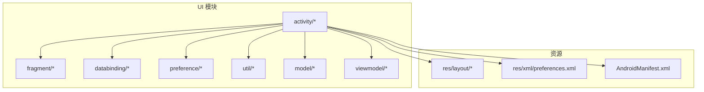
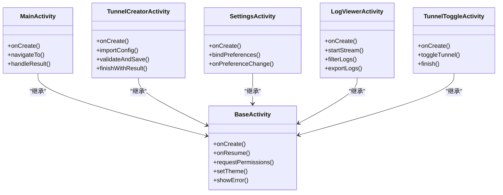
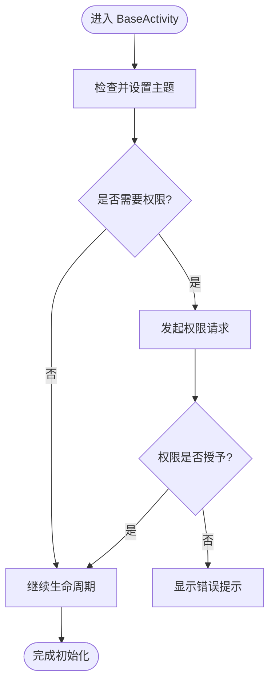
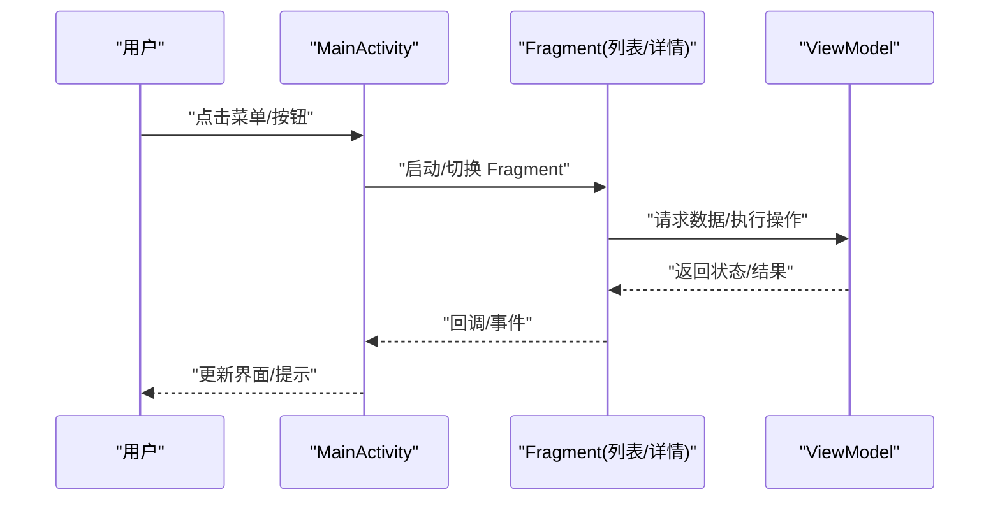
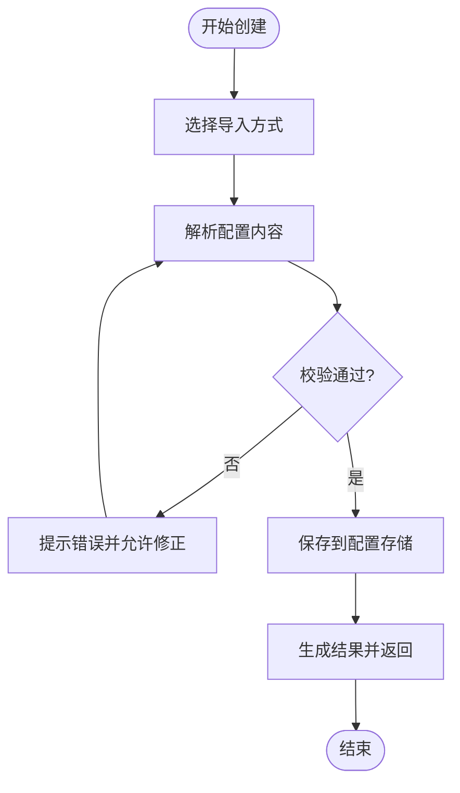
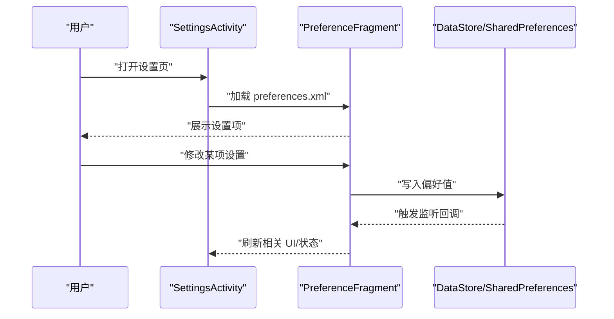
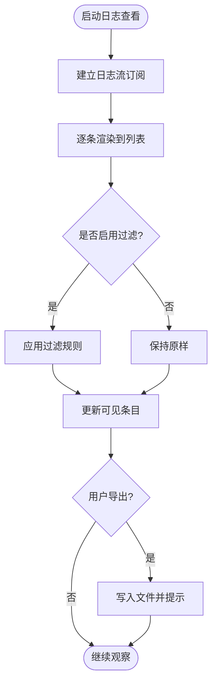
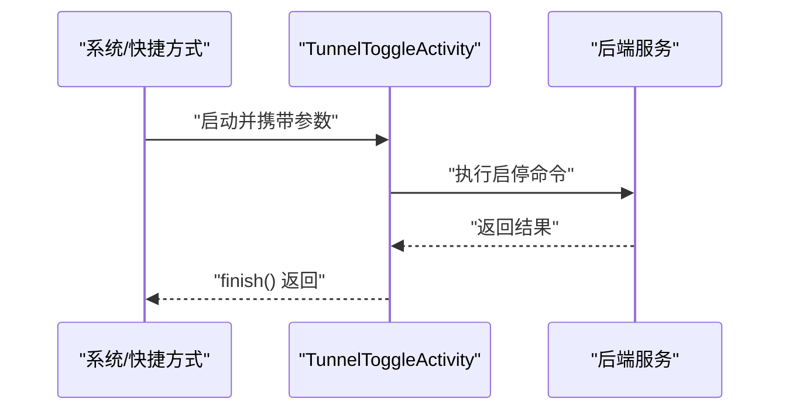
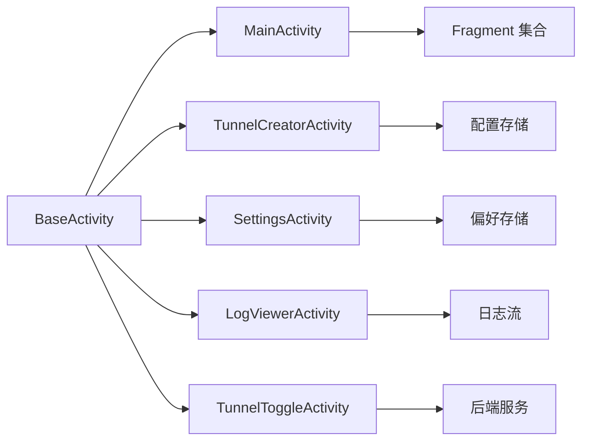

# Activity 层架构

<cite>
**本文引用的文件**   
- [BaseActivity.kt](file://ui/src/main/java/com/wireguard/android/activity/BaseActivity.kt)
- [MainActivity.kt](file://ui/src/main/java/com/wireguard/android/activity/MainActivity.kt)
- [TunnelCreatorActivity.kt](file://ui/src/main/java/com/wireguard/android/activity/TunnelCreatorActivity.kt)
- [SettingsActivity.kt](file://ui/src/main/java/com/wireguard/android/activity/SettingsActivity.kt)
- [LogViewerActivity.kt](file://ui/src/main/java/com/wireguard/android/activity/LogViewerActivity.kt)
- [TunnelToggleActivity.kt](file://ui/src/main/java/com/wireguard/android/activity/TunnelToggleActivity.kt)
- [preferences.xml](file://ui/src/main/res/xml/preferences.xml)
- [main_activity.xml](file://ui/src/main/res/layout/main_activity.xml)
- [log_viewer_activity.xml](file://ui/src/main/res/layout/log_viewer_activity.xml)
- [tunnel_creator_activity.xml](file://ui/src/main/res/layout/tunnel_creator_activity.xml)
- [AndroidManifest.xml](file://ui/src/main/AndroidManifest.xml)
</cite>

## 目录
1. [简介](#简介)
2. [项目结构](#项目结构)
3. [核心组件](#核心组件)
4. [架构总览](#架构总览)
5. [详细组件分析](#详细组件分析)
6. [依赖关系分析](#依赖关系分析)
7. [性能考量](#性能考量)
8. [故障排查指南](#故障排查指南)
9. [结论](#结论)
10. [附录](#附录)

## 简介
本技术文档聚焦于 Android 应用中的 Activity 层，系统性阐述 BaseActivity 的通用能力（权限、主题、错误处理）、主界面 MainActivity 的设计模式与数据流、TunnelCreatorActivity 的配置创建流程与用户交互、SettingsActivity 的设置管理与偏好存储集成、LogViewerActivity 的日志显示与过滤、以及 TunnelToggleActivity 的快速切换实现。同时总结 Activity 间的导航模式与参数传递机制，并给出最佳实践建议。

## 项目结构
UI 模块中 activity 包集中管理所有页面入口，配合 fragment、viewmodel、preference、util 等子包完成业务逻辑与 UI 绑定。布局资源位于 res/layout，偏好配置位于 res/xml/preferences.xml，清单声明在 AndroidManifest.xml。

图表来源
- [AndroidManifest.xml](file://ui/src/main/AndroidManifest.xml)
- [main_activity.xml](file://ui/src/main/res/layout/main_activity.xml)
- [preferences.xml](file://ui/src/main/res/xml/preferences.xml)

章节来源
- [AndroidManifest.xml](file://ui/src/main/AndroidManifest.xml)
- [main_activity.xml](file://ui/src/main/res/layout/main_activity.xml)
- [preferences.xml](file://ui/src/main/res/xml/preferences.xml)

## 核心组件
- BaseActivity：统一生命周期增强、权限申请封装、主题设置、错误提示与 Toast/Snackbar 展示、返回键行为控制等。
- MainActivity：应用主入口，承载列表/详情 Fragment，负责路由跳转、状态同步与全局事件分发。
- TunnelCreatorActivity：新建隧道配置的向导式界面，包含导入、校验、保存与结果回传。
- SettingsActivity：基于 PreferenceFragmentCompat 的设置页，读写用户偏好。
- LogViewerActivity：实时日志查看器，支持关键字过滤、滚动定位与导出。
- TunnelToggleActivity：快速开关隧道的轻量 Activity，常用于快捷方式或系统 Tile。

章节来源
- [BaseActivity.kt](file://ui/src/main/java/com/wireguard/android/activity/BaseActivity.kt)
- [MainActivity.kt](file://ui/src/main/java/com/wireguard/android/activity/MainActivity.kt)
- [TunnelCreatorActivity.kt](file://ui/src/main/java/com/wireguard/android/activity/TunnelCreatorActivity.kt)
- [SettingsActivity.kt](file://ui/src/main/java/com/wireguard/android/activity/SettingsActivity.kt)
- [LogViewerActivity.kt](file://ui/src/main/java/com/wireguard/android/activity/LogViewerActivity.kt)
- [TunnelToggleActivity.kt](file://ui/src/main/java/com/wireguard/android/activity/TunnelToggleActivity.kt)

## 架构总览
Activity 层采用“基类抽象 + 具体页面”的分层设计，结合 Fragment 与 ViewModel 解耦 UI 与业务。导航以显式 Intent 为主，辅以 Fragment 事务；参数通过 Bundle/Intent Extras 传递；状态变化通过回调或 LiveData/StateFlow 驱动。

图表来源
- [BaseActivity.kt](file://ui/src/main/java/com/wireguard/android/activity/BaseActivity.kt)
- [MainActivity.kt](file://ui/src/main/java/com/wireguard/android/activity/MainActivity.kt)
- [TunnelCreatorActivity.kt](file://ui/src/main/java/com/wireguard/android/activity/TunnelCreatorActivity.kt)
- [SettingsActivity.kt](file://ui/src/main/java/com/wireguard/android/activity/SettingsActivity.kt)
- [LogViewerActivity.kt](file://ui/src/main/java/com/wireguard/android/activity/LogViewerActivity.kt)
- [TunnelToggleActivity.kt](file://ui/src/main/java/com/wireguard/android/activity/TunnelToggleActivity.kt)

## 详细组件分析

### BaseActivity：通用功能与生命周期管理
- 权限处理：封装运行时权限请求流程，提供统一的授权回调与拒绝处理策略。
- 主题设置：根据系统深色模式或用户偏好动态切换主题，确保一致体验。
- 错误处理：集中化错误提示（Toast/Snackbar），避免在各页面重复实现。
- 生命周期增强：在 onResume/onPause 中执行必要的状态恢复与资源释放。

图表来源
- [BaseActivity.kt](file://ui/src/main/java/com/wireguard/android/activity/BaseActivity.kt)

章节来源
- [BaseActivity.kt](file://ui/src/main/java/com/wireguard/android/activity/BaseActivity.kt)

### MainActivity：主界面设计与数据流
- 设计模式：作为容器 Activity，承载多个 Fragment（如隧道列表、详情、编辑器），使用 FragmentManager 进行页面切换。
- 数据流：从 ViewModel/Repository 获取隧道状态，更新 UI；用户操作通过回调或事件总线通知上层。
- 导航与参数：通过 Intent Extras 传递隧道 ID、操作类型等参数，接收 onActivityResult 或 Fragment Result API。

图表来源
- [MainActivity.kt](file://ui/src/main/java/com/wireguard/android/activity/MainActivity.kt)
- [main_activity.xml](file://ui/src/main/res/layout/main_activity.xml)

章节来源
- [MainActivity.kt](file://ui/src/main/java/com/wireguard/android/activity/MainActivity.kt)
- [main_activity.xml](file://ui/src/main/res/layout/main_activity.xml)

### TunnelCreatorActivity：配置创建流程与用户交互
- 流程：选择导入源（文本/Qr/文件）→ 解析与校验 → 用户编辑 → 保存至本地存储 → 返回结果。
- 交互：分步向导、输入校验反馈、失败重试、成功提示。
- 参数：通过 Intent 传入初始配置片段，返回新创建的隧道标识。

图表来源
- [TunnelCreatorActivity.kt](file://ui/src/main/java/com/wireguard/android/activity/TunnelCreatorActivity.kt)
- [tunnel_creator_activity.xml](file://ui/src/main/res/layout/tunnel_creator_activity.xml)

章节来源
- [TunnelCreatorActivity.kt](file://ui/src/main/java/com/wireguard/android/activity/TunnelCreatorActivity.kt)
- [tunnel_creator_activity.xml](file://ui/src/main/res/layout/tunnel_creator_activity.xml)

### SettingsActivity：设置管理与偏好存储集成
- 管理：基于 PreferenceFragmentCompat 加载 preferences.xml，渲染设置项。
- 存储：使用 DataStore 或 SharedPreferences 持久化用户偏好，监听变更并即时生效。
- 扩展：自定义 Preference 控件（如版本、捐赠、工具安装等）。

图表来源
- [SettingsActivity.kt](file://ui/src/main/java/com/wireguard/android/activity/SettingsActivity.kt)
- [preferences.xml](file://ui/src/main/res/xml/preferences.xml)

章节来源
- [SettingsActivity.kt](file://ui/src/main/java/com/wireguard/android/activity/SettingsActivity.kt)
- [preferences.xml](file://ui/src/main/res/xml/preferences.xml)

### LogViewerActivity：日志显示与过滤
- 显示：订阅后端日志流，按时间顺序追加显示，自动滚动到底部。
- 过滤：支持关键字过滤、级别筛选、清空历史。
- 导出：将当前日志导出为文件供分享或下载。

图表来源
- [LogViewerActivity.kt](file://ui/src/main/java/com/wireguard/android/activity/LogViewerActivity.kt)
- [log_viewer_activity.xml](file://ui/src/main/res/layout/log_viewer_activity.xml)

章节来源
- [LogViewerActivity.kt](file://ui/src/main/java/com/wireguard/android/activity/LogViewerActivity.kt)
- [log_viewer_activity.xml](file://ui/src/main/res/layout/log_viewer_activity.xml)

### TunnelToggleActivity：快速切换实现
- 目标：最小化开销，快速执行隧道启停操作。
- 实现：接收隧道标识与动作（开启/关闭），调用后端服务并立即返回。
- 场景：桌面快捷方式、系统 Quick Settings Tile 触发。

图表来源
- [TunnelToggleActivity.kt](file://ui/src/main/java/com/wireguard/android/activity/TunnelToggleActivity.kt)

章节来源
- [TunnelToggleActivity.kt](file://ui/src/main/java/com/wireguard/android/activity/TunnelToggleActivity.kt)

### Activity 间导航与参数传递机制
- 导航模式：显式 Intent 跳转、Fragment 事务切换、结果回调（onActivityResult/Fragment Result API）。
- 参数传递：通过 Intent Extras 或 Fragment Arguments 传递基本类型与序列化对象。
- 最佳实践：
  - 使用命名常量定义 Action/Extra Key，避免硬编码字符串。
  - 对关键参数进行非空与范围校验，失败时及时提示。
  - 大对象传递优先使用 ID 引用而非直接序列化。

章节来源
- [AndroidManifest.xml](file://ui/src/main/AndroidManifest.xml)
- [MainActivity.kt](file://ui/src/main/java/com/wireguard/android/activity/MainActivity.kt)
- [TunnelCreatorActivity.kt](file://ui/src/main/java/com/wireguard/android/activity/TunnelCreatorActivity.kt)

## 依赖关系分析
- 组件内聚：每个 Activity 职责单一，UI 与业务分离，便于测试与维护。
- 外部依赖：偏好存储（DataStore/SharedPreferences）、后端服务（启停隧道）、日志流订阅。
- 潜在循环依赖：Activity 之间应避免直接互相引用，通过回调或事件总线解耦。

图表来源
- [BaseActivity.kt](file://ui/src/main/java/com/wireguard/android/activity/BaseActivity.kt)
- [MainActivity.kt](file://ui/src/main/java/com/wireguard/android/activity/MainActivity.kt)
- [TunnelCreatorActivity.kt](file://ui/src/main/java/com/wireguard/android/activity/TunnelCreatorActivity.kt)
- [SettingsActivity.kt](file://ui/src/main/java/com/wireguard/android/activity/SettingsActivity.kt)
- [LogViewerActivity.kt](file://ui/src/main/java/com/wireguard/android/activity/LogViewerActivity.kt)
- [TunnelToggleActivity.kt](file://ui/src/main/java/com/wireguard/android/activity/TunnelToggleActivity.kt)

章节来源
- [BaseActivity.kt](file://ui/src/main/java/com/wireguard/android/activity/BaseActivity.kt)
- [MainActivity.kt](file://ui/src/main/java/com/wireguard/android/activity/MainActivity.kt)
- [TunnelCreatorActivity.kt](file://ui/src/main/java/com/wireguard/android/activity/TunnelCreatorActivity.kt)
- [SettingsActivity.kt](file://ui/src/main/java/com/wireguard/android/activity/SettingsActivity.kt)
- [LogViewerActivity.kt](file://ui/src/main/java/com/wireguard/android/activity/LogViewerActivity.kt)
- [TunnelToggleActivity.kt](file://ui/src/main/java/com/wireguard/android/activity/TunnelToggleActivity.kt)

## 性能考量
- 列表与日志渲染：使用分页加载与虚拟列表，避免一次性渲染大量条目。
- 内存占用：及时释放资源（如订阅、监听器），防止内存泄漏。
- 线程模型：I/O 与网络操作放后台线程，UI 更新在主线程。
- 主题切换：延迟重绘，批量更新以减少闪烁。

[本节为通用指导，不直接分析具体文件]

## 故障排查指南
- 权限问题：确认已声明必要权限并在运行时申请；记录拒绝原因以便引导用户手动开启。
- 主题异常：检查系统深色模式与自定义主题冲突；必要时强制刷新。
- 配置导入失败：校验格式与字段完整性，输出详细错误信息。
- 日志卡顿：检查过滤表达式复杂度与渲染频率，必要时节流。
- 快速切换无响应：核对后端服务状态与权限（如 root/VPN），增加超时与重试。

章节来源
- [BaseActivity.kt](file://ui/src/main/java/com/wireguard/android/activity/BaseActivity.kt)
- [LogViewerActivity.kt](file://ui/src/main/java/com/wireguard/android/activity/LogViewerActivity.kt)
- [TunnelToggleActivity.kt](file://ui/src/main/java/com/wireguard/android/activity/TunnelToggleActivity.kt)

## 结论
Activity 层通过 BaseActivity 统一了权限、主题与错误处理，各具体 Activity 聚焦各自职责，配合 Fragment 与 ViewModel 形成清晰的数据流与导航路径。遵循本文的最佳实践可提升可维护性与用户体验。

[本节为总结性内容，不直接分析具体文件]

## 附录
- 推荐参数命名规范：Action/Extra Key 使用全大写下划线命名，避免歧义。
- 错误提示文案：面向用户友好，提供可操作的下一步指引。
- 测试建议：对关键流程（导入、保存、启停）编写单元测试与 UI 自动化测试。

[本节为补充说明，不直接分析具体文件]