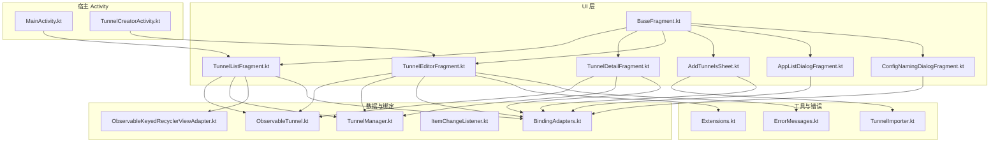
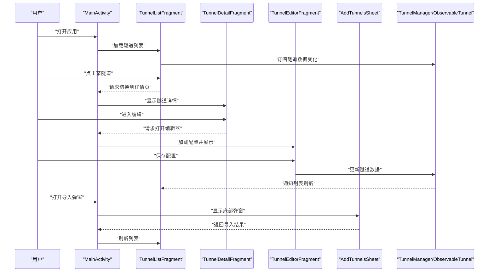
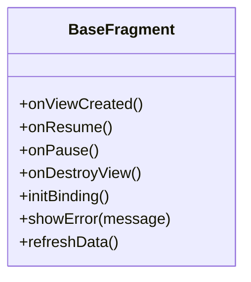
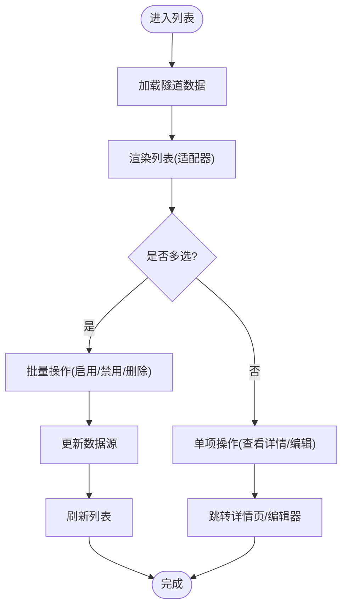
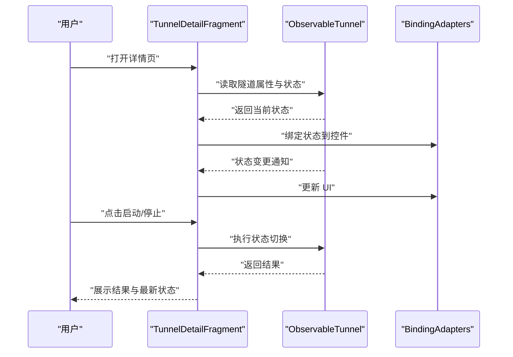
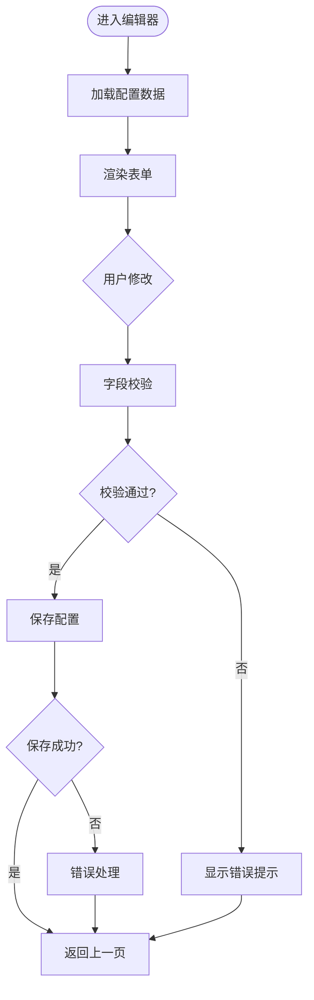
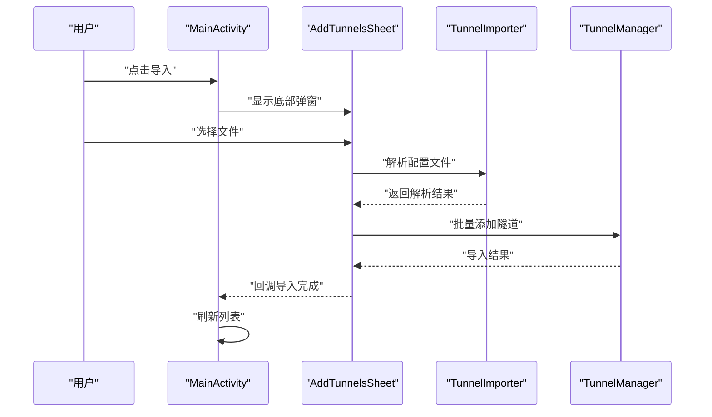
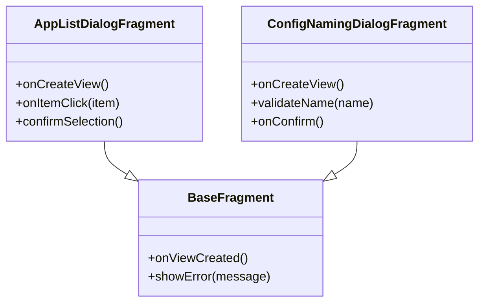
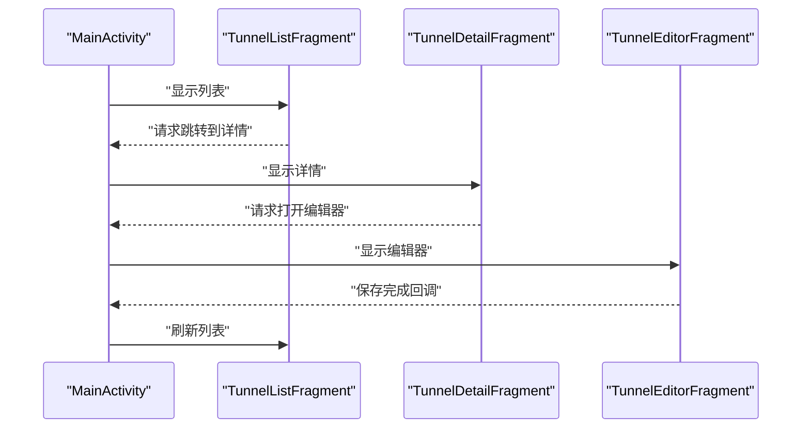
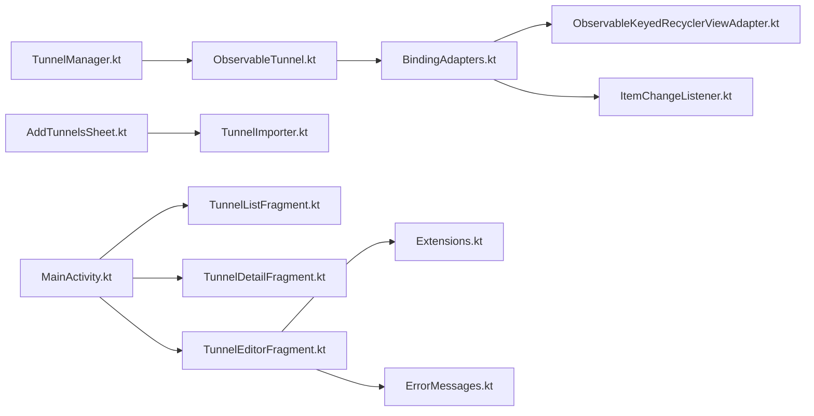

# Fragment 层架构

<cite>
**本文引用的文件**   
- [BaseFragment.kt](file://ui/src/main/java/com/wireguard/android/fragment/BaseFragment.kt)
- [TunnelListFragment.kt](file://ui/src/main/java/com/wireguard/android/fragment/TunnelListFragment.kt)
- [TunnelDetailFragment.kt](file://ui/src/main/java/com/wireguard/android/fragment/TunnelDetailFragment.kt)
- [TunnelEditorFragment.kt](file://ui/src/main/java/com/wireguard/android/fragment/TunnelEditorFragment.kt)
- [AddTunnelsSheet.kt](file://ui/src/main/java/com/wireguard/android/fragment/AddTunnelsSheet.kt)
- [AppListDialogFragment.kt](file://ui/src/main/java/com/wireguard/android/fragment/AppListDialogFragment.kt)
- [ConfigNamingDialogFragment.kt](file://ui/src/main/java/com/wireguard/android/fragment/ConfigNamingDialogFragment.kt)
- [MainActivity.kt](file://ui/src/main/java/com/wireguard/android/activity/MainActivity.kt)
- [TunnelCreatorActivity.kt](file://ui/src/main/java/com/wireguard/android/activity/TunnelCreatorActivity.kt)
- [ObservableTunnel.kt](file://ui/src/main/java/com/wireguard/android/model/ObservableTunnel.kt)
- [TunnelManager.kt](file://ui/src/main/java/com/wireguard/android/model/TunnelManager.kt)
- [BindingAdapters.kt](file://ui/src/main/java/com/wireguard/android/databinding/BindingAdapters.kt)
- [ItemChangeListener.kt](file://ui/src/main/java/com/wireguard/android/databinding/ItemChangeListener.kt)
- [ObservableKeyedRecyclerViewAdapter.kt](file://ui/src/main/java/com/wireguard/android/databinding/ObservableKeyedRecyclerViewAdapter.kt)
- [Extensions.kt](file://ui/src/main/java/com/wireguard/android/util/Extensions.kt)
- [ErrorMessages.kt](file://ui/src/main/java/com/wireguard/android/util/ErrorMessages.kt)
- [TunnelImporter.kt](file://ui/src/main/java/com/wireguard/android/util/TunnelImporter.kt)
- [add_tunnels_bottom_sheet.xml](file://ui/src/main/res/layout/add_tunnels_bottom_sheet.xml)
- [app_list_dialog_fragment.xml](file://ui/src/main/res/layout/app_list_dialog_fragment.xml)
- [config_naming_dialog_fragment.xml](file://ui/src/main/res/layout/config_naming_dialog_fragment.xml)
- [tunnel_detail_fragment.xml](file://ui/src/main/res/layout/tunnel_detail_fragment.xml)
- [tunnel_editor_fragment.xml](file://ui/src/main/res/layout/tunnel_editor_fragment.xml)
- [tunnel_list_fragment.xml](file://ui/src/main/res/layout/tunnel_list_fragment.xml)
</cite>

## 目录
1. [简介](#简介)
2. [项目结构](#项目结构)
3. [核心组件](#核心组件)
4. [架构总览](#架构总览)
5. [详细组件分析](#详细组件分析)
6. [依赖关系分析](#依赖关系分析)
7. [性能考虑](#性能考虑)
8. [故障排查指南](#故障排查指南)
9. [结论](#结论)
10. [附录：使用示例与最佳实践](#附录使用示例与最佳实践)

## 简介
本文件聚焦于 Android 应用中的 Fragment 层，系统性梳理 BaseFragment 的基础能力（生命周期、数据绑定、错误处理），并深入解析 TunnelListFragment、TunnelDetailFragment、TunnelEditorFragment、AddTunnelsSheet 以及多个 DialogFragment 的实现要点。文档同时说明 Fragment 与 Activity 的通信模式、事件处理机制，并提供使用示例与性能优化建议，帮助读者快速理解与高效扩展该层代码。

## 项目结构
Fragment 相关代码位于 ui 模块的 fragment 包中，配合 model、databinding、util 等包提供数据模型、数据绑定适配器和工具方法；布局资源集中在 res/layout 下，对应各 Fragment/Dialog 的 UI。

图表来源
- [BaseFragment.kt](file://ui/src/main/java/com/wireguard/android/fragment/BaseFragment.kt)
- [TunnelListFragment.kt](file://ui/src/main/java/com/wireguard/android/fragment/TunnelListFragment.kt)
- [TunnelDetailFragment.kt](file://ui/src/main/java/com/wireguard/android/fragment/TunnelDetailFragment.kt)
- [TunnelEditorFragment.kt](file://ui/src/main/java/com/wireguard/android/fragment/TunnelEditorFragment.kt)
- [AddTunnelsSheet.kt](file://ui/src/main/java/com/wireguard/android/fragment/AddTunnelsSheet.kt)
- [AppListDialogFragment.kt](file://ui/src/main/java/com/wireguard/android/fragment/AppListDialogFragment.kt)
- [ConfigNamingDialogFragment.kt](file://ui/src/main/java/com/wireguard/android/fragment/ConfigNamingDialogFragment.kt)
- [ObservableTunnel.kt](file://ui/src/main/java/com/wireguard/android/model/ObservableTunnel.kt)
- [TunnelManager.kt](file://ui/src/main/java/com/wireguard/android/model/TunnelManager.kt)
- [BindingAdapters.kt](file://ui/src/main/java/com/wireguard/android/databinding/BindingAdapters.kt)
- [ItemChangeListener.kt](file://ui/src/main/java/com/wireguard/android/databinding/ItemChangeListener.kt)
- [ObservableKeyedRecyclerViewAdapter.kt](file://ui/src/main/java/com/wireguard/android/databinding/ObservableKeyedRecyclerViewAdapter.kt)
- [Extensions.kt](file://ui/src/main/java/com/wireguard/android/util/Extensions.kt)
- [ErrorMessages.kt](file://ui/src/main/java/com/wireguard/android/util/ErrorMessages.kt)
- [TunnelImporter.kt](file://ui/src/main/java/com/wireguard/android/util/TunnelImporter.kt)
- [MainActivity.kt](file://ui/src/main/java/com/wireguard/android/activity/MainActivity.kt)
- [TunnelCreatorActivity.kt](file://ui/src/main/java/com/wireguard/android/activity/TunnelCreatorActivity.kt)

章节来源
- [BaseFragment.kt](file://ui/src/main/java/com/wireguard/android/fragment/BaseFragment.kt)
- [TunnelListFragment.kt](file://ui/src/main/java/com/wireguard/android/fragment/TunnelListFragment.kt)
- [TunnelDetailFragment.kt](file://ui/src/main/java/com/wireguard/android/fragment/TunnelDetailFragment.kt)
- [TunnelEditorFragment.kt](file://ui/src/main/java/com/wireguard/android/fragment/TunnelEditorFragment.kt)
- [AddTunnelsSheet.kt](file://ui/src/main/java/com/wireguard/android/fragment/AddTunnelsSheet.kt)
- [AppListDialogFragment.kt](file://ui/src/main/java/com/wireguard/android/fragment/AppListDialogFragment.kt)
- [ConfigNamingDialogFragment.kt](file://ui/src/main/java/com/wireguard/android/fragment/ConfigNamingDialogFragment.kt)
- [ObservableTunnel.kt](file://ui/src/main/java/com/wireguard/android/model/ObservableTunnel.kt)
- [TunnelManager.kt](file://ui/src/main/java/com/wireguard/android/model/TunnelManager.kt)
- [BindingAdapters.kt](file://ui/src/main/java/com/wireguard/android/databinding/BindingAdapters.kt)
- [ItemChangeListener.kt](file://ui/src/main/java/com/wireguard/android/databinding/ItemChangeListener.kt)
- [ObservableKeyedRecyclerViewAdapter.kt](file://ui/src/main/java/com/wireguard/android/databinding/ObservableKeyedRecyclerViewAdapter.kt)
- [Extensions.kt](file://ui/src/main/java/com/wireguard/android/util/Extensions.kt)
- [ErrorMessages.kt](file://ui/src/main/java/com/wireguard/android/util/ErrorMessages.kt)
- [TunnelImporter.kt](file://ui/src/main/java/com/wireguard/android/util/TunnelImporter.kt)
- [MainActivity.kt](file://ui/src/main/java/com/wireguard/android/activity/MainActivity.kt)
- [TunnelCreatorActivity.kt](file://ui/src/main/java/com/wireguard/android/activity/TunnelCreatorActivity.kt)

## 核心组件
- BaseFragment：为所有 Fragment 提供统一的生命周期管理、数据绑定初始化、错误提示封装与通用交互逻辑，降低重复代码。
- TunnelListFragment：隧道列表展示、多选与批量操作（启用/禁用、删除、导入导出等）。
- TunnelDetailFragment：单个隧道的详情展示、状态监控（连接状态、统计信息）与快捷操作入口。
- TunnelEditorFragment：隧道配置编辑界面，包含字段校验、保存流程与错误反馈。
- AddTunnelsSheet：底部弹窗，支持从文件或剪贴板导入隧道配置。
- AppListDialogFragment / ConfigNamingDialogFragment：自定义对话框，分别用于选择应用与命名配置文件。

章节来源
- [BaseFragment.kt](file://ui/src/main/java/com/wireguard/android/fragment/BaseFragment.kt)
- [TunnelListFragment.kt](file://ui/src/main/java/com/wireguard/android/fragment/TunnelListFragment.kt)
- [TunnelDetailFragment.kt](file://ui/src/main/java/com/wireguard/android/fragment/TunnelDetailFragment.kt)
- [TunnelEditorFragment.kt](file://ui/src/main/java/com/wireguard/android/fragment/TunnelEditorFragment.kt)
- [AddTunnelsSheet.kt](file://ui/src/main/java/com/wireguard/android/fragment/AddTunnelsSheet.kt)
- [AppListDialogFragment.kt](file://ui/src/main/java/com/wireguard/android/fragment/AppListDialogFragment.kt)
- [ConfigNamingDialogFragment.kt](file://ui/src/main/java/com/wireguard/android/fragment/ConfigNamingDialogFragment.kt)

## 架构总览
Fragment 层通过数据绑定与可观察数据模型驱动 UI，借助 Adapter 与 BindingAdapters 实现高效列表渲染与双向绑定。Activity 作为容器与导航中枢，Fragment 之间通过回调或共享 ViewModel/Manager 进行协作。

图表来源
- [MainActivity.kt](file://ui/src/main/java/com/wireguard/android/activity/MainActivity.kt)
- [TunnelListFragment.kt](file://ui/src/main/java/com/wireguard/android/fragment/TunnelListFragment.kt)
- [TunnelDetailFragment.kt](file://ui/src/main/java/com/wireguard/android/fragment/TunnelDetailFragment.kt)
- [TunnelEditorFragment.kt](file://ui/src/main/java/com/wireguard/android/fragment/TunnelEditorFragment.kt)
- [AddTunnelsSheet.kt](file://ui/src/main/java/com/wireguard/android/fragment/AddTunnelsSheet.kt)
- [TunnelManager.kt](file://ui/src/main/java/com/wireguard/android/model/TunnelManager.kt)
- [ObservableTunnel.kt](file://ui/src/main/java/com/wireguard/android/model/ObservableTunnel.kt)

## 详细组件分析

### BaseFragment：基础功能与通用能力
- 生命周期管理：集中处理视图创建、销毁与内存释放，确保在 Fragment 切换时正确清理监听器与定时器。
- 数据绑定：统一初始化 DataBinding，提供便捷访问绑定对象的方法，减少样板代码。
- 错误处理：封装统一的错误提示方式（如 Snackbar/Toast），便于全局样式与文案管理。
- 扩展点：提供可覆写的方法以注入业务逻辑，例如“首次可见”、“数据刷新”等钩子。

图表来源
- [BaseFragment.kt](file://ui/src/main/java/com/wireguard/android/fragment/BaseFragment.kt)

章节来源
- [BaseFragment.kt](file://ui/src/main/java/com/wireguard/android/fragment/BaseFragment.kt)

### TunnelListFragment：列表展示与批量操作
- 列表渲染：使用可观察的 Keyed RecyclerView Adapter，结合 ObservableTunnel 实现增量更新，避免全量重绘。
- 多选与批量操作：支持选择多个隧道执行批量启用/禁用、删除等操作，操作后自动刷新。
- 数据源：订阅 TunnelManager 提供的隧道集合，保证 UI 与数据一致。
- 交互：菜单项与长按手势触发操作，结果通过统一错误处理反馈给用户。

图表来源
- [TunnelListFragment.kt](file://ui/src/main/java/com/wireguard/android/fragment/TunnelListFragment.kt)
- [ObservableKeyedRecyclerViewAdapter.kt](file://ui/src/main/java/com/wireguard/android/databinding/ObservableKeyedRecyclerViewAdapter.kt)
- [ObservableTunnel.kt](file://ui/src/main/java/com/wireguard/android/model/ObservableTunnel.kt)
- [TunnelManager.kt](file://ui/src/main/java/com/wireguard/android/model/TunnelManager.kt)

章节来源
- [TunnelListFragment.kt](file://ui/src/main/java/com/wireguard/android/fragment/TunnelListFragment.kt)
- [ObservableKeyedRecyclerViewAdapter.kt](file://ui/src/main/java/com/wireguard/android/databinding/ObservableKeyedRecyclerViewAdapter.kt)
- [ObservableTunnel.kt](file://ui/src/main/java/com/wireguard/android/model/ObservableTunnel.kt)
- [TunnelManager.kt](file://ui/src/main/java/com/wireguard/android/model/TunnelManager.kt)

### TunnelDetailFragment：隧道详情与状态监控
- 详情展示：展示隧道名称、接口、对端、统计信息等关键属性。
- 状态监控：实时反映连接状态（已连接/未连接/错误），并在状态变化时更新 UI。
- 快捷操作：提供启动/停止、分享配置、进入编辑等入口。
- 数据绑定：通过 BindingAdapters 将后端状态映射到 UI 控件。

图表来源
- [TunnelDetailFragment.kt](file://ui/src/main/java/com/wireguard/android/fragment/TunnelDetailFragment.kt)
- [ObservableTunnel.kt](file://ui/src/main/java/com/wireguard/android/model/ObservableTunnel.kt)
- [BindingAdapters.kt](file://ui/src/main/java/com/wireguard/android/databinding/BindingAdapters.kt)

章节来源
- [TunnelDetailFragment.kt](file://ui/src/main/java/com/wireguard/android/fragment/TunnelDetailFragment.kt)
- [ObservableTunnel.kt](file://ui/src/main/java/com/wireguard/android/model/ObservableTunnel.kt)
- [BindingAdapters.kt](file://ui/src/main/java/com/wireguard/android/databinding/BindingAdapters.kt)

### TunnelEditorFragment：配置编辑与数据验证
- 编辑界面：提供表单式编辑，包括接口、对端、密钥等字段的输入与展示。
- 数据验证：对必填字段、格式合法性进行校验，失败时即时提示。
- 保存流程：校验通过后持久化配置，成功后返回并刷新上游列表。
- 错误处理：捕获异常并通过统一错误提示展示给用户。

图表来源
- [TunnelEditorFragment.kt](file://ui/src/main/java/com/wireguard/android/fragment/TunnelEditorFragment.kt)
- [Extensions.kt](file://ui/src/main/java/com/wireguard/android/util/Extensions.kt)
- [ErrorMessages.kt](file://ui/src/main/java/com/wireguard/android/util/ErrorMessages.kt)

章节来源
- [TunnelEditorFragment.kt](file://ui/src/main/java/com/wireguard/android/fragment/TunnelEditorFragment.kt)
- [Extensions.kt](file://ui/src/main/java/com/wireguard/android/util/Extensions.kt)
- [ErrorMessages.kt](file://ui/src/main/java/com/wireguard/android/util/ErrorMessages.kt)

### AddTunnelsSheet：底部弹窗与文件导入
- 弹窗实现：基于 BottomSheet 的 DialogFragment，提供简洁的导入入口。
- 文件导入：支持从文件系统选择 .conf 文件，解析并批量导入隧道配置。
- 结果回传：导入完成后通过回调或事件通知宿主 Activity 刷新列表。

图表来源
- [AddTunnelsSheet.kt](file://ui/src/main/java/com/wireguard/android/fragment/AddTunnelsSheet.kt)
- [TunnelImporter.kt](file://ui/src/main/java/com/wireguard/android/util/TunnelImporter.kt)
- [TunnelManager.kt](file://ui/src/main/java/com/wireguard/android/model/TunnelManager.kt)
- [add_tunnels_bottom_sheet.xml](file://ui/src/main/res/layout/add_tunnels_bottom_sheet.xml)

章节来源
- [AddTunnelsSheet.kt](file://ui/src/main/java/com/wireguard/android/fragment/AddTunnelsSheet.kt)
- [TunnelImporter.kt](file://ui/src/main/java/com/wireguard/android/util/TunnelImporter.kt)
- [TunnelManager.kt](file://ui/src/main/java/com/wireguard/android/model/TunnelManager.kt)
- [add_tunnels_bottom_sheet.xml](file://ui/src/main/res/layout/add_tunnels_bottom_sheet.xml)

### DialogFragment：自定义对话框
- AppListDialogFragment：用于选择应用，通常与策略或白名单相关。
- ConfigNamingDialogFragment：用于输入配置文件名称，支持基本校验与确认。
- 共同特性：继承自 BaseFragment 的能力，统一生命周期与错误处理；通过 XML 布局定义 UI，使用 DataBinding 绑定数据。

图表来源
- [AppListDialogFragment.kt](file://ui/src/main/java/com/wireguard/android/fragment/AppListDialogFragment.kt)
- [ConfigNamingDialogFragment.kt](file://ui/src/main/java/com/wireguard/android/fragment/ConfigNamingDialogFragment.kt)
- [BaseFragment.kt](file://ui/src/main/java/com/wireguard/android/fragment/BaseFragment.kt)
- [app_list_dialog_fragment.xml](file://ui/src/main/res/layout/app_list_dialog_fragment.xml)
- [config_naming_dialog_fragment.xml](file://ui/src/main/res/layout/config_naming_dialog_fragment.xml)

章节来源
- [AppListDialogFragment.kt](file://ui/src/main/java/com/wireguard/android/fragment/AppListDialogFragment.kt)
- [ConfigNamingDialogFragment.kt](file://ui/src/main/java/com/wireguard/android/fragment/ConfigNamingDialogFragment.kt)
- [BaseFragment.kt](file://ui/src/main/java/com/wireguard/android/fragment/BaseFragment.kt)
- [app_list_dialog_fragment.xml](file://ui/src/main/res/layout/app_list_dialog_fragment.xml)
- [config_naming_dialog_fragment.xml](file://ui/src/main/res/layout/config_naming_dialog_fragment.xml)

### Fragment 与 Activity 的通信与事件处理
- 事件回调：Fragment 通过接口回调或 LiveData/Flow 向 Activity 上报事件（如导航、导入结果）。
- 共享数据：通过 TunnelManager 与 ObservableTunnel 作为共享数据源，保证多 Fragment 间的数据一致性。
- 导航控制：Activity 负责 Fragment 的添加、替换与返回栈管理，Fragment 仅关注自身业务。

图表来源
- [MainActivity.kt](file://ui/src/main/java/com/wireguard/android/activity/MainActivity.kt)
- [TunnelListFragment.kt](file://ui/src/main/java/com/wireguard/android/fragment/TunnelListFragment.kt)
- [TunnelDetailFragment.kt](file://ui/src/main/java/com/wireguard/android/fragment/TunnelDetailFragment.kt)
- [TunnelEditorFragment.kt](file://ui/src/main/java/com/wireguard/android/fragment/TunnelEditorFragment.kt)

章节来源
- [MainActivity.kt](file://ui/src/main/java/com/wireguard/android/activity/MainActivity.kt)
- [TunnelListFragment.kt](file://ui/src/main/java/com/wireguard/android/fragment/TunnelListFragment.kt)
- [TunnelDetailFragment.kt](file://ui/src/main/java/com/wireguard/android/fragment/TunnelDetailFragment.kt)
- [TunnelEditorFragment.kt](file://ui/src/main/java/com/wireguard/android/fragment/TunnelEditorFragment.kt)

## 依赖关系分析
- 数据层依赖：TunnelManager 提供隧道数据的增删改查与状态同步；ObservableTunnel 暴露可观察的属性供 UI 订阅。
- 绑定层依赖：BindingAdapters 将业务数据转换为 UI 所需类型；ItemChangeListener 与 ObservableKeyedRecyclerViewAdapter 提升列表性能。
- 工具层依赖：Extensions 提供常用扩展方法；ErrorMessages 统一管理错误文案；TunnelImporter 负责配置文件解析。

图表来源
- [TunnelManager.kt](file://ui/src/main/java/com/wireguard/android/model/TunnelManager.kt)
- [ObservableTunnel.kt](file://ui/src/main/java/com/wireguard/android/model/ObservableTunnel.kt)
- [BindingAdapters.kt](file://ui/src/main/java/com/wireguard/android/databinding/BindingAdapters.kt)
- [ObservableKeyedRecyclerViewAdapter.kt](file://ui/src/main/java/com/wireguard/android/databinding/ObservableKeyedRecyclerViewAdapter.kt)
- [ItemChangeListener.kt](file://ui/src/main/java/com/wireguard/android/databinding/ItemChangeListener.kt)
- [TunnelEditorFragment.kt](file://ui/src/main/java/com/wireguard/android/fragment/TunnelEditorFragment.kt)
- [Extensions.kt](file://ui/src/main/java/com/wireguard/android/util/Extensions.kt)
- [ErrorMessages.kt](file://ui/src/main/java/com/wireguard/android/util/ErrorMessages.kt)
- [AddTunnelsSheet.kt](file://ui/src/main/java/com/wireguard/android/fragment/AddTunnelsSheet.kt)
- [TunnelImporter.kt](file://ui/src/main/java/com/wireguard/android/util/TunnelImporter.kt)
- [MainActivity.kt](file://ui/src/main/java/com/wireguard/android/activity/MainActivity.kt)
- [TunnelListFragment.kt](file://ui/src/main/java/com/wireguard/android/fragment/TunnelListFragment.kt)
- [TunnelDetailFragment.kt](file://ui/src/main/java/com/wireguard/android/fragment/TunnelDetailFragment.kt)

章节来源
- [TunnelManager.kt](file://ui/src/main/java/com/wireguard/android/model/TunnelManager.kt)
- [ObservableTunnel.kt](file://ui/src/main/java/com/wireguard/android/model/ObservableTunnel.kt)
- [BindingAdapters.kt](file://ui/src/main/java/com/wireguard/android/databinding/BindingAdapters.kt)
- [ObservableKeyedRecyclerViewAdapter.kt](file://ui/src/main/java/com/wireguard/android/databinding/ObservableKeyedRecyclerViewAdapter.kt)
- [ItemChangeListener.kt](file://ui/src/main/java/com/wireguard/android/databinding/ItemChangeListener.kt)
- [TunnelEditorFragment.kt](file://ui/src/main/java/com/wireguard/android/fragment/TunnelEditorFragment.kt)
- [Extensions.kt](file://ui/src/main/java/com/wireguard/android/util/Extensions.kt)
- [ErrorMessages.kt](file://ui/src/main/java/com/wireguard/android/util/ErrorMessages.kt)
- [AddTunnelsSheet.kt](file://ui/src/main/java/com/wireguard/android/fragment/AddTunnelsSheet.kt)
- [TunnelImporter.kt](file://ui/src/main/java/com/wireguard/android/util/TunnelImporter.kt)
- [MainActivity.kt](file://ui/src/main/java/com/wireguard/android/activity/MainActivity.kt)
- [TunnelListFragment.kt](file://ui/src/main/java/com/wireguard/android/fragment/TunnelListFragment.kt)
- [TunnelDetailFragment.kt](file://ui/src/main/java/com/wireguard/android/fragment/TunnelDetailFragment.kt)

## 性能考虑
- 列表性能：使用 Keyed RecyclerView Adapter 与可观察数据模型，仅更新变更项，避免全量刷新。
- 数据绑定：通过 BindingAdapters 减少转换开销，避免在 onBindViewHolder 中进行复杂计算。
- 异步处理：导入与保存操作应在后台线程执行，避免阻塞主线程。
- 内存管理：在 onDestroyView 中释放监听器与引用，防止内存泄漏。
- 资源复用：Dialog 与 BottomSheet 尽量复用实例，减少频繁创建销毁。

[本节为通用指导，不直接分析具体文件]

## 故障排查指南
- 常见错误：
  - 配置解析失败：检查文件格式与关键字段，查看导入日志与错误消息。
  - 列表不刷新：确认数据源是否发出变更通知，检查适配器是否正确注册观察者。
  - 状态不同步：核对 ObservableTunnel 的状态更新路径与 UI 绑定是否正确。
- 调试建议：
  - 使用统一错误提示定位问题位置。
  - 在关键路径打印必要日志，避免泄露敏感信息。
  - 逐步缩小范围，先验证数据源再检查 UI 绑定。

章节来源
- [ErrorMessages.kt](file://ui/src/main/java/com/wireguard/android/util/ErrorMessages.kt)
- [Extensions.kt](file://ui/src/main/java/com/wireguard/android/util/Extensions.kt)
- [TunnelImporter.kt](file://ui/src/main/java/com/wireguard/android/util/TunnelImporter.kt)

## 结论
Fragment 层通过 BaseFragment 的统一能力、可观察数据模型与高效的绑定适配器，实现了清晰的职责划分与良好的可维护性。TunnelListFragment、TunnelDetailFragment、TunnelEditorFragment 与各类 DialogFragment 各司其职，配合 Activity 的导航与事件分发，形成稳定可靠的 UI 架构。遵循本文的性能与排错建议，可进一步提升用户体验与开发效率。

[本节为总结，不直接分析具体文件]

## 附录：使用示例与最佳实践
- 新建 Fragment：
  - 继承 BaseFragment，覆写必要生命周期方法。
  - 使用 DataBinding 初始化 UI，避免 findViewById。
  - 通过 TunnelManager 获取数据，订阅变更并更新 UI。
- 列表实现：
  - 使用 ObservableKeyedRecyclerViewAdapter，为每个条目设置唯一 key。
  - 在 ItemChangeListener 中处理点击与长按事件。
- 编辑器实现：
  - 在保存前进行字段校验，失败时立即提示。
  - 保存成功后通过回调或事件通知上层刷新。
- 导入实现：
  - 使用 AddTunnelsSheet 提供导入入口。
  - 调用 TunnelImporter 解析文件，批量添加到 TunnelManager。
- 对话框实现：
  - 使用 DialogFragment 承载自定义 UI。
  - 通过 XML 布局与 DataBinding 绑定数据。

章节来源
- [BaseFragment.kt](file://ui/src/main/java/com/wireguard/android/fragment/BaseFragment.kt)
- [ObservableKeyedRecyclerViewAdapter.kt](file://ui/src/main/java/com/wireguard/android/databinding/ObservableKeyedRecyclerViewAdapter.kt)
- [ItemChangeListener.kt](file://ui/src/main/java/com/wireguard/android/databinding/ItemChangeListener.kt)
- [TunnelEditorFragment.kt](file://ui/src/main/java/com/wireguard/android/fragment/TunnelEditorFragment.kt)
- [AddTunnelsSheet.kt](file://ui/src/main/java/com/wireguard/android/fragment/AddTunnelsSheet.kt)
- [TunnelImporter.kt](file://ui/src/main/java/com/wireguard/android/util/TunnelImporter.kt)
- [AppListDialogFragment.kt](file://ui/src/main/java/com/wireguard/android/fragment/AppListDialogFragment.kt)
- [ConfigNamingDialogFragment.kt](file://ui/src/main/java/com/wireguard/android/fragment/ConfigNamingDialogFragment.kt)