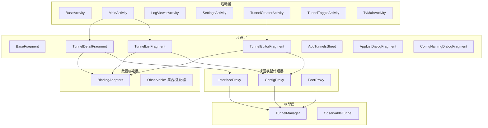
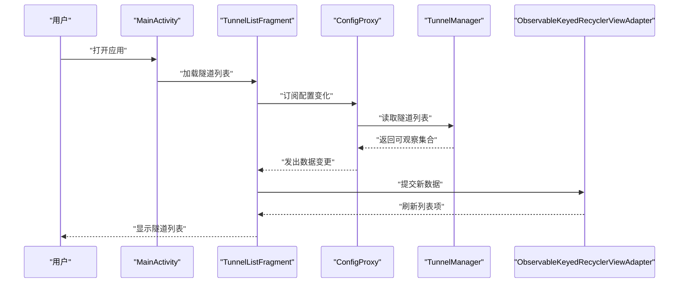
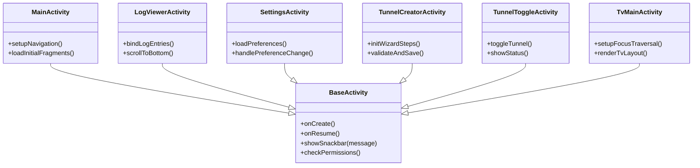
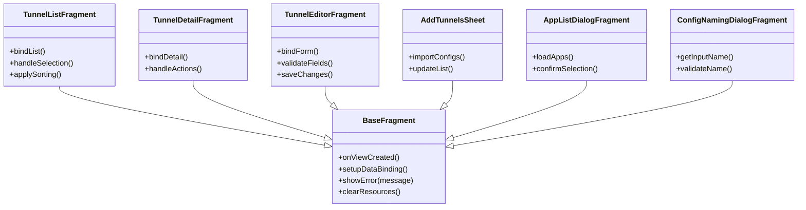
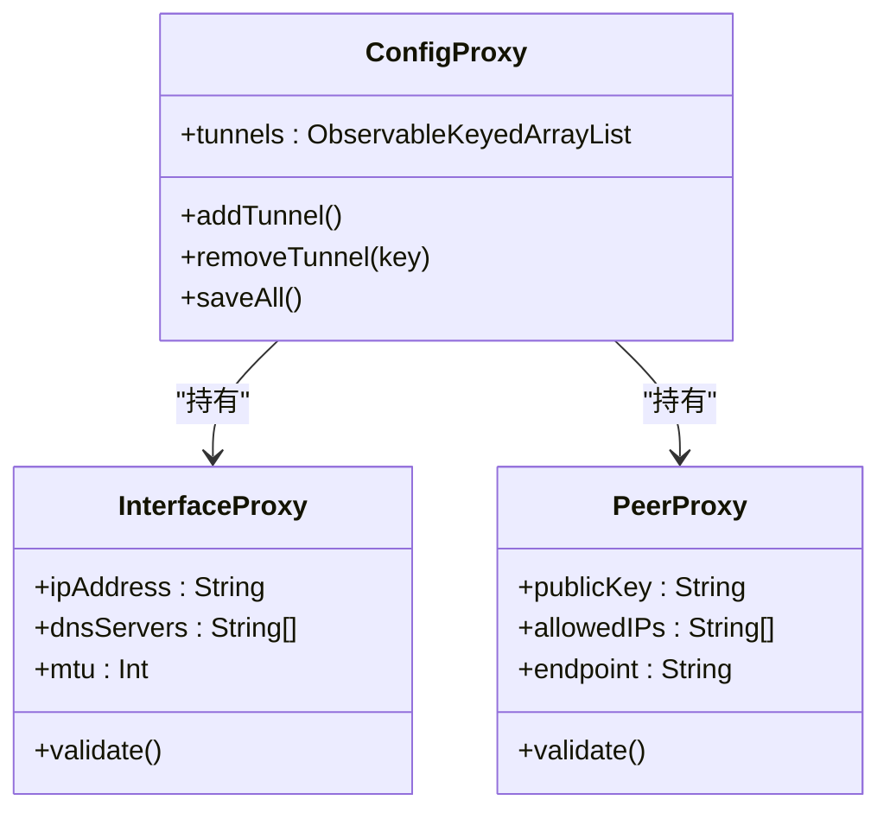
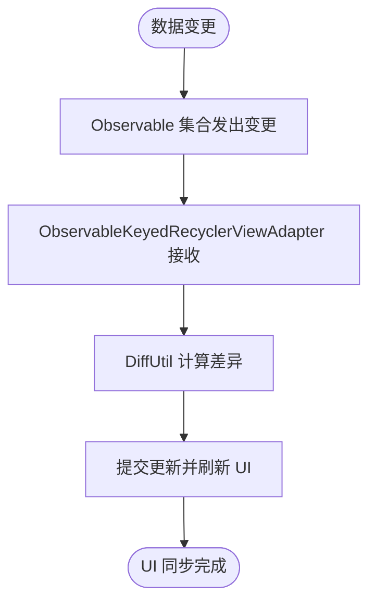
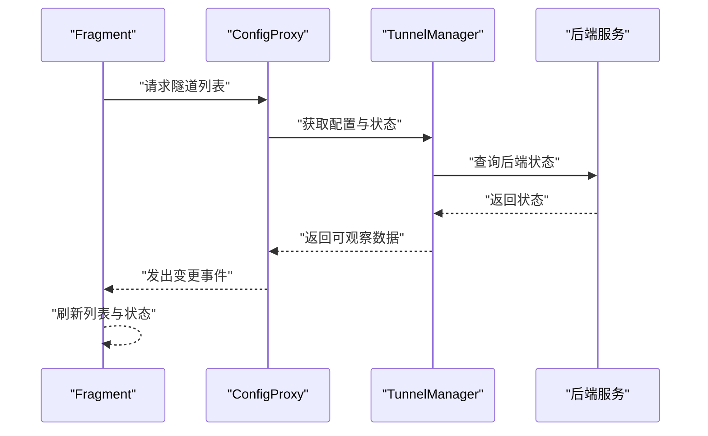
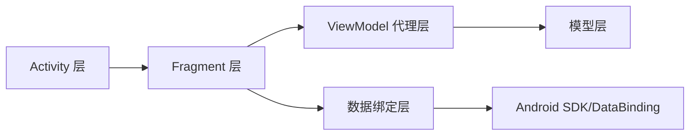

# UI 用户界面模块

<cite>
**本文引用的文件**   
- [BaseActivity.kt](file://ui/src/main/java/com/wireguard/android/activity/BaseActivity.kt)
- [MainActivity.kt](file://ui/src/main/java/com/wireguard/android/activity/MainActivity.kt)
- [LogViewerActivity.kt](file://ui/src/main/java/com/wireguard/android/activity/LogViewerActivity.kt)
- [SettingsActivity.kt](file://ui/src/main/java/com/wireguard/android/activity/SettingsActivity.kt)
- [TunnelCreatorActivity.kt](file://ui/src/main/java/com/wireguard/android/activity/TunnelCreatorActivity.kt)
- [TunnelToggleActivity.kt](file://ui/src/main/java/com/wireguard/android/activity/TunnelToggleActivity.kt)
- [TvMainActivity.kt](file://ui/src/main/java/com/wireguard/android/activity/TvMainActivity.kt)
- [BaseFragment.kt](file://ui/src/main/java/com/wireguard/android/fragment/BaseFragment.kt)
- [TunnelListFragment.kt](file://ui/src/main/java/com/wireguard/android/fragment/TunnelListFragment.kt)
- [TunnelDetailFragment.kt](file://ui/src/main/java/com/wireguard/android/fragment/TunnelDetailFragment.kt)
- [TunnelEditorFragment.kt](file://ui/src/main/java/com/wireguard/android/fragment/TunnelEditorFragment.kt)
- [AddTunnelsSheet.kt](file://ui/src/main/java/com/wireguard/android/fragment/AddTunnelsSheet.kt)
- [AppListDialogFragment.kt](file://ui/src/main/java/com/wireguard/android/fragment/AppListDialogFragment.kt)
- [ConfigNamingDialogFragment.kt](file://ui/src/main/java/com/wireguard/android/fragment/ConfigNamingDialogFragment.kt)
- [ConfigProxy.kt](file://ui/src/main/java/com/wireguard/android/viewmodel/ConfigProxy.kt)
- [InterfaceProxy.kt](file://ui/src/main/java/com/wireguard/android/viewmodel/InterfaceProxy.kt)
- [PeerProxy.kt](file://ui/src/main/java/com/wireguard/android/viewmodel/PeerProxy.kt)
- [BindingAdapters.kt](file://ui/src/main/java/com/wireguard/android/databinding/BindingAdapters.kt)
- [ItemChangeListener.kt](file://ui/src/main/java/com/wireguard/android/databinding/ItemChangeListener.kt)
- [Keyed.kt](file://ui/src/main/java/com/wireguard/android/databinding/Keyed.kt)
- [ObservableKeyedArrayList.kt](file://ui/src/main/java/com/wireguard/android/databinding/ObservableKeyedArrayList.kt)
- [ObservableKeyedRecyclerViewAdapter.kt](file://ui/src/main/java/com/wireguard/android/databinding/ObservableKeyedRecyclerViewAdapter.kt)
- [ObservableSortedKeyedArrayList.kt](file://ui/src/main/java/com/wireguard/android/databinding/ObservableSortedKeyedArrayList.kt)
- [TunnelManager.kt](file://ui/src/main/java/com/wireguard/android/model/TunnelManager.kt)
- [ObservableTunnel.kt](file://ui/src/main/java/com/wireguard/android/model/ObservableTunnel.kt)
- [AndroidManifest.xml](file://ui/src/main/AndroidManifest.xml)
- [themes.xml](file://ui/src/main/res/values/themes.xml)
- [strings.xml](file://ui/src/main/res/values/strings.xml)
- [attrs.xml](file://ui/src/main/res/values/attrs.xml)
- [styles.xml](file://ui/src/main/res/values/styles.xml)
- [main_activity.xml](file://ui/src/main/res/layout/main_activity.xml)
- [tunnel_list_fragment.xml](file://ui/src/main/res/layout/tunnel_list_fragment.xml)
- [tunnel_detail_fragment.xml](file://ui/src/main/res/layout/tunnel_detail_fragment.xml)
- [tunnel_editor_fragment.xml](file://ui/src/main/res/layout/tunnel_editor_fragment.xml)
- [add_tunnels_bottom_sheet.xml](file://ui/src/main/res/layout/add_tunnels_bottom_sheet.xml)
- [app_list_dialog_fragment.xml](file://ui/src/main/res/layout/app_list_dialog_fragment.xml)
- [config_naming_dialog_fragment.xml](file://ui/src/main/res/layout/config_naming_dialog_fragment.xml)
- [log_viewer_activity.xml](file://ui/src/main/res/layout/log_viewer_activity.xml)
- [tunnel_creator_activity.xml](file://ui/src/main/res/layout/tunnel_creator_activity.xml)
</cite>

## 目录
1. [简介](#简介)
2. [项目结构](#项目结构)
3. [核心组件](#核心组件)
4. [架构总览](#架构总览)
5. [详细组件分析](#详细组件分析)
6. [依赖关系分析](#依赖关系分析)
7. [性能考量](#性能考量)
8. [故障排查指南](#故障排查指南)
9. [结论](#结论)
10. [附录](#附录)

## 简介
本技术文档聚焦于 WireGuard Android 项目的 UI 用户界面模块，系统性阐述 Activity 层、Fragment 层与 ViewModel 层的职责划分与交互方式，重点说明数据绑定系统的实现（BindingAdapters 与自定义适配器）、资源管理策略（布局、字符串、主题），以及与后端模块的集成和状态同步机制。同时提供响应式设计与无障碍功能的实践要点，并给出常用 UI 组件的使用示例与最佳实践。

## 项目结构
UI 模块采用分层组织：
- activity：页面级入口与导航编排，包含 BaseActivity 基类与各业务 Activity。
- fragment：可复用页面片段，包含 BaseFragment 基类与具体 Fragment。
- viewmodel：代理层（Proxy）封装配置、接口与对等体的数据模型与变更通知。
- databinding：数据绑定扩展与适配器，支持列表、排序与键控集合。
- model：隧道相关的数据模型与管理器。
- res：布局、样式、主题、字符串等资源。

图表来源
- [MainActivity.kt](file://ui/src/main/java/com/wireguard/android/activity/MainActivity.kt)
- [BaseActivity.kt](file://ui/src/main/java/com/wireguard/android/activity/BaseActivity.kt)
- [BaseFragment.kt](file://ui/src/main/java/com/wireguard/android/fragment/BaseFragment.kt)
- [ConfigProxy.kt](file://ui/src/main/java/com/wireguard/android/viewmodel/ConfigProxy.kt)
- [InterfaceProxy.kt](file://ui/src/main/java/com/wireguard/android/viewmodel/InterfaceProxy.kt)
- [PeerProxy.kt](file://ui/src/main/java/com/wireguard/android/viewmodel/PeerProxy.kt)
- [BindingAdapters.kt](file://ui/src/main/java/com/wireguard/android/databinding/BindingAdapters.kt)
- [ObservableKeyedRecyclerViewAdapter.kt](file://ui/src/main/java/com/wireguard/android/databinding/ObservableKeyedRecyclerViewAdapter.kt)
- [TunnelManager.kt](file://ui/src/main/java/com/wireguard/android/model/TunnelManager.kt)

章节来源
- [AndroidManifest.xml](file://ui/src/main/AndroidManifest.xml)
- [main_activity.xml](file://ui/src/main/res/layout/main_activity.xml)
- [tunnel_list_fragment.xml](file://ui/src/main/res/layout/tunnel_list_fragment.xml)
- [tunnel_detail_fragment.xml](file://ui/src/main/res/layout/tunnel_detail_fragment.xml)
- [tunnel_editor_fragment.xml](file://ui/src/main/res/layout/tunnel_editor_fragment.xml)

## 核心组件
- BaseActivity：统一生命周期处理、权限检查、主题切换、日志输出与通用 UI 行为。
- BaseFragment：统一的 Fragment 初始化流程、数据绑定启用、生命周期回调与错误提示。
- ConfigProxy / InterfaceProxy / PeerProxy：以代理模式暴露可观察的数据与命令，驱动 UI 更新。
- BindingAdapters：为 DataBinding 提供属性绑定与事件转换，减少样板代码。
- Observable 集合与适配器：基于键控与排序的可观察列表，自动触发 RecyclerView 刷新。
- TunnelManager：集中管理隧道配置、状态与持久化，作为 UI 与后端之间的桥梁。

章节来源
- [BaseActivity.kt](file://ui/src/main/java/com/wireguard/android/activity/BaseActivity.kt)
- [BaseFragment.kt](file://ui/src/main/java/com/wireguard/android/fragment/BaseFragment.kt)
- [ConfigProxy.kt](file://ui/src/main/java/com/wireguard/android/viewmodel/ConfigProxy.kt)
- [InterfaceProxy.kt](file://ui/src/main/java/com/wireguard/android/viewmodel/InterfaceProxy.kt)
- [PeerProxy.kt](file://ui/src/main/java/com/wireguard/android/viewmodel/PeerProxy.kt)
- [BindingAdapters.kt](file://ui/src/main/java/com/wireguard/android/databinding/BindingAdapters.kt)
- [ObservableKeyedRecyclerViewAdapter.kt](file://ui/src/main/java/com/wireguard/android/databinding/ObservableKeyedRecyclerViewAdapter.kt)
- [TunnelManager.kt](file://ui/src/main/java/com/wireguard/android/model/TunnelManager.kt)

## 架构总览
UI 层遵循“活动-片段-代理-模型”的分层架构：
- Activity 负责页面容器与导航；Fragment 承载具体业务视图与交互。
- ViewModel 代理层将复杂配置对象拆分为可观察的片段，便于细粒度绑定与更新。
- 数据绑定层通过自定义适配器与可观察集合，实现声明式 UI 更新。
- 模型层提供隧道管理与状态源，必要时与后端模块交互。

图表来源
- [MainActivity.kt](file://ui/src/main/java/com/wireguard/android/activity/MainActivity.kt)
- [TunnelListFragment.kt](file://ui/src/main/java/com/wireguard/android/fragment/TunnelListFragment.kt)
- [ConfigProxy.kt](file://ui/src/main/java/com/wireguard/android/viewmodel/ConfigProxy.kt)
- [TunnelManager.kt](file://ui/src/main/java/com/wireguard/android/model/TunnelManager.kt)
- [ObservableKeyedRecyclerViewAdapter.kt](file://ui/src/main/java/com/wireguard/android/databinding/ObservableKeyedRecyclerViewAdapter.kt)

## 详细组件分析

### Activity 层设计模式
- BaseActivity：封装通用逻辑，如主题设置、权限申请、日志打印、对话框与 Snackbar 展示、生命周期钩子。
- MainActivity：主入口，负责底部导航或片段切换，协调隧道列表与详情。
- LogViewerActivity：日志查看页，绑定日志条目列表与滚动控制。
- SettingsActivity：设置页，聚合偏好项与系统能力检测。
- TunnelCreatorActivity：新建隧道向导，分步编辑配置。
- TunnelToggleActivity：快速开关隧道，常用于快捷方式或通知操作。
- TvMainActivity：TV 端适配的主活动，优化焦点与导航。

图表来源
- [BaseActivity.kt](file://ui/src/main/java/com/wireguard/android/activity/BaseActivity.kt)
- [MainActivity.kt](file://ui/src/main/java/com/wireguard/android/activity/MainActivity.kt)
- [LogViewerActivity.kt](file://ui/src/main/java/com/wireguard/android/activity/LogViewerActivity.kt)
- [SettingsActivity.kt](file://ui/src/main/java/com/wireguard/android/activity/SettingsActivity.kt)
- [TunnelCreatorActivity.kt](file://ui/src/main/java/com/wireguard/android/activity/TunnelCreatorActivity.kt)
- [TunnelToggleActivity.kt](file://ui/src/main/java/com/wireguard/android/activity/TunnelToggleActivity.kt)
- [TvMainActivity.kt](file://ui/src/main/java/com/wireguard/android/activity/TvMainActivity.kt)

章节来源
- [BaseActivity.kt](file://ui/src/main/java/com/wireguard/android/activity/BaseActivity.kt)
- [MainActivity.kt](file://ui/src/main/java/com/wireguard/android/activity/MainActivity.kt)
- [LogViewerActivity.kt](file://ui/src/main/java/com/wireguard/android/activity/LogViewerActivity.kt)
- [SettingsActivity.kt](file://ui/src/main/java/com/wireguard/android/activity/SettingsActivity.kt)
- [TunnelCreatorActivity.kt](file://ui/src/main/java/com/wireguard/android/activity/TunnelCreatorActivity.kt)
- [TunnelToggleActivity.kt](file://ui/src/main/java/com/wireguard/android/activity/TunnelToggleActivity.kt)
- [TvMainActivity.kt](file://ui/src/main/java/com/wireguard/android/activity/TvMainActivity.kt)

### Fragment 层架构
- BaseFragment：统一启用数据绑定、生命周期回调、错误提示与资源清理。
- TunnelListFragment：渲染隧道列表，支持多选、批量操作与排序。
- TunnelDetailFragment：展示单个隧道的详细信息与操作按钮。
- TunnelEditorFragment：编辑隧道配置，含字段校验与保存。
- AddTunnelsSheet：底部弹窗导入多个配置。
- AppListDialogFragment：选择允许 VPN 的应用。
- ConfigNamingDialogFragment：命名配置文件的对话框。

图表来源
- [BaseFragment.kt](file://ui/src/main/java/com/wireguard/android/fragment/BaseFragment.kt)
- [TunnelListFragment.kt](file://ui/src/main/java/com/wireguard/android/fragment/TunnelListFragment.kt)
- [TunnelDetailFragment.kt](file://ui/src/main/java/com/wireguard/android/fragment/TunnelDetailFragment.kt)
- [TunnelEditorFragment.kt](file://ui/src/main/java/com/wireguard/android/fragment/TunnelEditorFragment.kt)
- [AddTunnelsSheet.kt](file://ui/src/main/java/com/wireguard/android/fragment/AddTunnelsSheet.kt)
- [AppListDialogFragment.kt](file://ui/src/main/java/com/wireguard/android/fragment/AppListDialogFragment.kt)
- [ConfigNamingDialogFragment.kt](file://ui/src/main/java/com/wireguard/android/fragment/ConfigNamingDialogFragment.kt)

章节来源
- [BaseFragment.kt](file://ui/src/main/java/com/wireguard/android/fragment/BaseFragment.kt)
- [TunnelListFragment.kt](file://ui/src/main/java/com/wireguard/android/fragment/TunnelListFragment.kt)
- [TunnelDetailFragment.kt](file://ui/src/main/java/com/wireguard/android/fragment/TunnelDetailFragment.kt)
- [TunnelEditorFragment.kt](file://ui/src/main/java/com/wireguard/android/fragment/TunnelEditorFragment.kt)
- [AddTunnelsSheet.kt](file://ui/src/main/java/com/wireguard/android/fragment/AddTunnelsSheet.kt)
- [AppListDialogFragment.kt](file://ui/src/main/java/com/wireguard/android/fragment/AppListDialogFragment.kt)
- [ConfigNamingDialogFragment.kt](file://ui/src/main/java/com/wireguard/android/fragment/ConfigNamingDialogFragment.kt)

### ViewModel 代理模式与数据绑定机制
- ConfigProxy：暴露隧道配置的集合与命令（新增、删除、保存），内部维护可观察集合与排序规则。
- InterfaceProxy：封装接口层面的属性（IP、DNS、MTU 等），提供双向绑定与校验。
- PeerProxy：封装对等体属性（公钥、允许的 IP、Endpoint 等），支持动态增删与验证。

图表来源
- [ConfigProxy.kt](file://ui/src/main/java/com/wireguard/android/viewmodel/ConfigProxy.kt)
- [InterfaceProxy.kt](file://ui/src/main/java/com/wireguard/android/viewmodel/InterfaceProxy.kt)
- [PeerProxy.kt](file://ui/src/main/java/com/wireguard/android/viewmodel/PeerProxy.kt)

章节来源
- [ConfigProxy.kt](file://ui/src/main/java/com/wireguard/android/viewmodel/ConfigProxy.kt)
- [InterfaceProxy.kt](file://ui/src/main/java/com/wireguard/android/viewmodel/InterfaceProxy.kt)
- [PeerProxy.kt](file://ui/src/main/java/com/wireguard/android/viewmodel/PeerProxy.kt)

### 数据绑定系统实现
- BindingAdapters：定义自定义属性绑定（如文本格式化、可见性、点击事件转发），减少 XML 中的逻辑。
- ItemChangeListener：封装列表项变更监听，简化选中状态与回调。
- Keyed：为列表项提供稳定键值，确保 DiffUtil 高效计算差异。
- ObservableKeyedArrayList / ObservableSortedKeyedArrayList：可观察且支持排序的键控集合，变更时自动通知适配器。
- ObservableKeyedRecyclerViewAdapter：基于 DiffUtil 的高效适配器，支持增删改与动画。

图表来源
- [BindingAdapters.kt](file://ui/src/main/java/com/wireguard/android/databinding/BindingAdapters.kt)
- [ItemChangeListener.kt](file://ui/src/main/java/com/wireguard/android/databinding/ItemChangeListener.kt)
- [Keyed.kt](file://ui/src/main/java/com/wireguard/android/databinding/Keyed.kt)
- [ObservableKeyedArrayList.kt](file://ui/src/main/java/com/wireguard/android/databinding/ObservableKeyedArrayList.kt)
- [ObservableKeyedRecyclerViewAdapter.kt](file://ui/src/main/java/com/wireguard/android/databinding/ObservableKeyedRecyclerViewAdapter.kt)
- [ObservableSortedKeyedArrayList.kt](file://ui/src/main/java/com/wireguard/android/databinding/ObservableSortedKeyedArrayList.kt)

章节来源
- [BindingAdapters.kt](file://ui/src/main/java/com/wireguard/android/databinding/BindingAdapters.kt)
- [ItemChangeListener.kt](file://ui/src/main/java/com/wireguard/android/databinding/ItemChangeListener.kt)
- [Keyed.kt](file://ui/src/main/java/com/wireguard/android/databinding/Keyed.kt)
- [ObservableKeyedArrayList.kt](file://ui/src/main/java/com/wireguard/android/databinding/ObservableKeyedArrayList.kt)
- [ObservableKeyedRecyclerViewAdapter.kt](file://ui/src/main/java/com/wireguard/android/databinding/ObservableKeyedRecyclerViewAdapter.kt)
- [ObservableSortedKeyedArrayList.kt](file://ui/src/main/java/com/wireguard/android/databinding/ObservableSortedKeyedArrayList.kt)

### 资源管理策略
- 布局文件：按功能拆分（活动、片段、对话框、列表项），使用 include 与约束布局提升复用性与性能。
- 字符串资源：多语言支持（values-zh-rCN、values-en 等），避免硬编码文本。
- 主题与样式：通过 themes.xml 与 styles.xml 统一管理颜色、字体与控件样式，支持夜间模式与 TV 适配。
- 自定义属性：attrs.xml 定义可复用属性，配合 BindingAdapters 进行绑定。

章节来源
- [themes.xml](file://ui/src/main/res/values/themes.xml)
- [strings.xml](file://ui/src/main/res/values/strings.xml)
- [attrs.xml](file://ui/src/main/res/values/attrs.xml)
- [styles.xml](file://ui/src/main/res/values/styles.xml)
- [main_activity.xml](file://ui/src/main/res/layout/main_activity.xml)
- [tunnel_list_fragment.xml](file://ui/src/main/res/layout/tunnel_list_fragment.xml)
- [tunnel_detail_fragment.xml](file://ui/src/main/res/layout/tunnel_detail_fragment.xml)
- [tunnel_editor_fragment.xml](file://ui/src/main/res/layout/tunnel_editor_fragment.xml)
- [add_tunnels_bottom_sheet.xml](file://ui/src/main/res/layout/add_tunnels_bottom_sheet.xml)
- [app_list_dialog_fragment.xml](file://ui/src/main/res/layout/app_list_dialog_fragment.xml)
- [config_naming_dialog_fragment.xml](file://ui/src/main/res/layout/config_naming_dialog_fragment.xml)
- [log_viewer_activity.xml](file://ui/src/main/res/layout/log_viewer_activity.xml)
- [tunnel_creator_activity.xml](file://ui/src/main/res/layout/tunnel_creator_activity.xml)

### 与后端模块的集成与状态同步
- TunnelManager：集中管理隧道配置与状态，提供增删改查与持久化接口。
- ObservableTunnel：可观察的隧道对象，变更时触发 UI 更新。
- 代理层（ConfigProxy/InterfaceProxy/PeerProxy）：将后端状态映射为 UI 友好的数据结构，并通过可观察集合驱动列表刷新。
- 状态同步：当后端状态变化（如连接成功/失败），通过代理层发出事件，Fragment 订阅后更新 UI。

图表来源
- [TunnelManager.kt](file://ui/src/main/java/com/wireguard/android/model/TunnelManager.kt)
- [ObservableTunnel.kt](file://ui/src/main/java/com/wireguard/android/model/ObservableTunnel.kt)
- [ConfigProxy.kt](file://ui/src/main/java/com/wireguard/android/viewmodel/ConfigProxy.kt)

章节来源
- [TunnelManager.kt](file://ui/src/main/java/com/wireguard/android/model/TunnelManager.kt)
- [ObservableTunnel.kt](file://ui/src/main/java/com/wireguard/android/model/ObservableTunnel.kt)
- [ConfigProxy.kt](file://ui/src/main/java/com/wireguard/android/viewmodel/ConfigProxy.kt)

### 响应式设计实现细节
- 使用 ConstraintLayout 与百分比布局，适配不同屏幕尺寸。
- 通过资源限定符（layout-sw600dp）为大屏设备提供专用布局。
- 使用主题与样式切换深色模式，保证视觉一致性。
- 列表与网格根据屏幕宽度动态调整列数与间距。

章节来源
- [main_activity.xml](file://ui/src/main/res/layout/main_activity.xml)
- [themes.xml](file://ui/src/main/res/values/themes.xml)
- [styles.xml](file://ui/src/main/res/values/styles.xml)

### 无障碍功能实现细节
- 为关键控件设置 contentDescription 与 accessibilityLabel。
- 确保焦点顺序合理，支持键盘与遥控器导航（TV 场景）。
- 使用语义化标签与标题，提高读屏软件体验。
- 在日志查看器中提供滚动到最新与暂停功能，方便视障用户。

章节来源
- [log_viewer_activity.xml](file://ui/src/main/res/layout/log_viewer_activity.xml)
- [tv_tunnel_list_item.xml](file://ui/src/main/res/layout/tv_tunnel_list_item.xml)

## 依赖关系分析
UI 模块内部依赖清晰，外部依赖主要为 Android SDK 与数据绑定库。关键依赖如下：
- Activity 依赖 Fragment 与 ViewModel 代理层。
- Fragment 依赖数据绑定层与模型层。
- ViewModel 代理层依赖模型层与后端接口。
- 数据绑定层依赖 Android DataBinding 库。

图表来源
- [MainActivity.kt](file://ui/src/main/java/com/wireguard/android/activity/MainActivity.kt)
- [BaseFragment.kt](file://ui/src/main/java/com/wireguard/android/fragment/BaseFragment.kt)
- [ConfigProxy.kt](file://ui/src/main/java/com/wireguard/android/viewmodel/ConfigProxy.kt)
- [TunnelManager.kt](file://ui/src/main/java/com/wireguard/android/model/TunnelManager.kt)
- [BindingAdapters.kt](file://ui/src/main/java/com/wireguard/android/databinding/BindingAdapters.kt)

章节来源
- [MainActivity.kt](file://ui/src/main/java/com/wireguard/android/activity/MainActivity.kt)
- [BaseFragment.kt](file://ui/src/main/java/com/wireguard/android/fragment/BaseFragment.kt)
- [ConfigProxy.kt](file://ui/src/main/java/com/wireguard/android/viewmodel/ConfigProxy.kt)
- [TunnelManager.kt](file://ui/src/main/java/com/wireguard/android/model/TunnelManager.kt)
- [BindingAdapters.kt](file://ui/src/main/java/com/wireguard/android/databinding/BindingAdapters.kt)

## 性能考量
- 使用 DiffUtil 与键控集合减少不必要的重绘。
- 避免在 onBindViewHolder 中进行耗时操作，使用异步加载与缓存。
- 合理使用 include 与 ViewStub 延迟加载复杂视图。
- 在大数据集上启用分页与虚拟滚动。
- 避免在 UI 线程执行网络或磁盘 I/O。

[本节为通用指导，不直接分析具体文件]

## 故障排查指南
- 列表不刷新：检查 Observable 集合是否正确发出变更，确认适配器已调用 submitList。
- 数据绑定异常：确认 XML 中的变量与类型匹配，检查 BindingAdapters 是否注册。
- 内存泄漏：确保 Fragment 在 onDestroyView 中释放观察者与引用。
- 主题不一致：检查 values-night 与默认主题的覆盖关系。
- 无障碍问题：使用 Accessibility Scanner 扫描并修复缺失描述。

章节来源
- [ObservableKeyedRecyclerViewAdapter.kt](file://ui/src/main/java/com/wireguard/android/databinding/ObservableKeyedRecyclerViewAdapter.kt)
- [BindingAdapters.kt](file://ui/src/main/java/com/wireguard/android/databinding/BindingAdapters.kt)
- [BaseFragment.kt](file://ui/src/main/java/com/wireguard/android/fragment/BaseFragment.kt)
- [themes.xml](file://ui/src/main/res/values/themes.xml)

## 结论
UI 模块通过清晰的层次划分与数据绑定机制，实现了高内聚、低耦合的界面架构。Activity 与 Fragment 的职责明确，ViewModel 代理层有效解耦了 UI 与数据模型，BindingAdapters 与可观察集合提升了开发效率与性能。资源管理与响应式设计确保了跨设备的一致性体验，无障碍功能增强了可访问性。建议继续优化异步加载与内存管理，进一步提升用户体验。

[本节为总结，不直接分析具体文件]

## 附录
- 常用 UI 组件使用示例与最佳实践：
  - 列表项：使用 ObservableKeyedRecyclerViewAdapter 与 Keyed 接口，确保稳定键值与高效刷新。
  - 表单输入：结合 BindingAdapters 实现实时校验与反馈。
  - 对话框：使用 BaseFragment 的子类封装生命周期与资源清理。
  - 主题切换：通过 BaseActivity 统一设置主题，并在运行时切换。
  - 无障碍：为所有交互控件添加内容描述，确保焦点顺序合理。

[本节为补充信息，不直接分析具体文件]