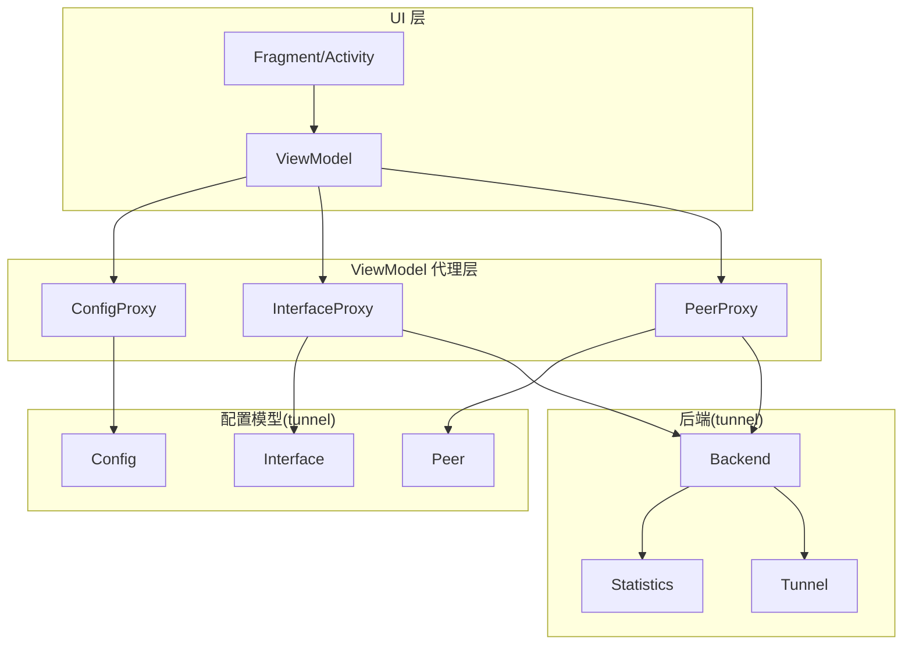
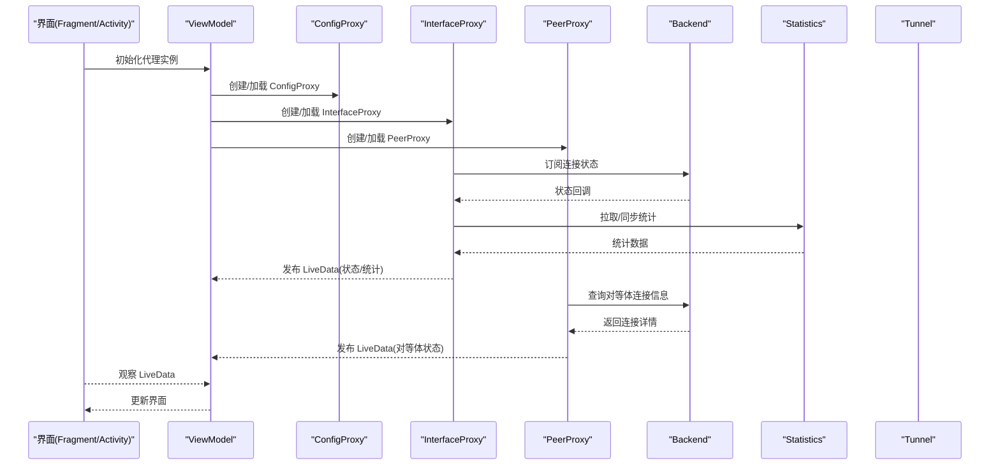
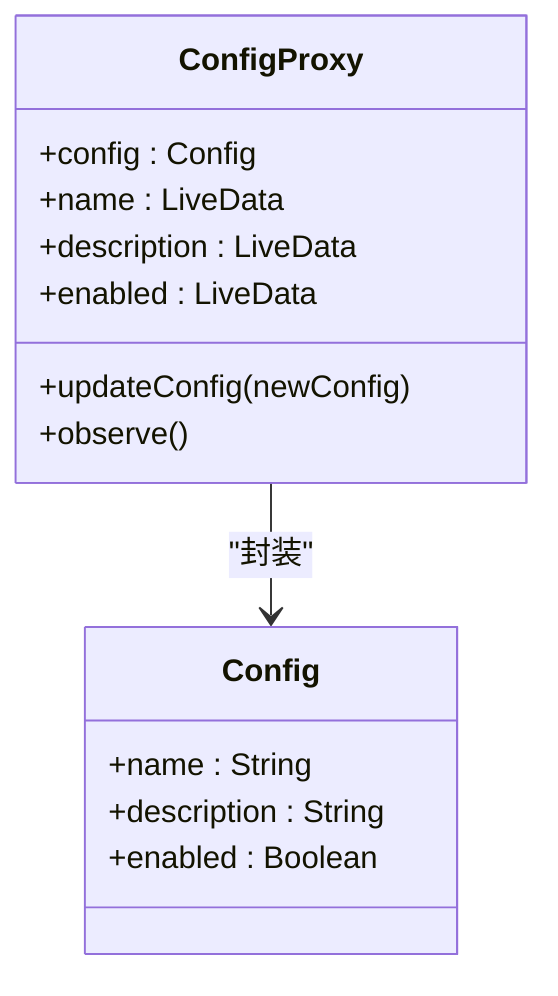
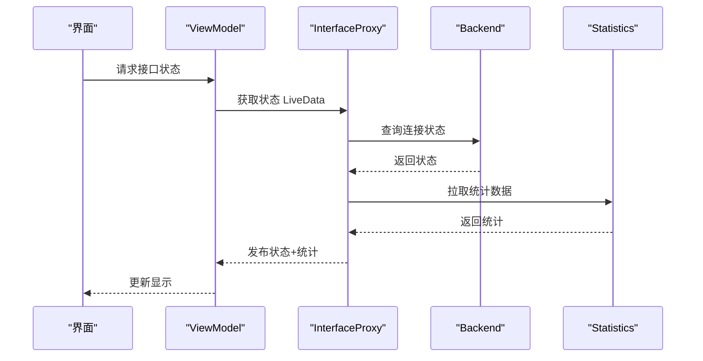
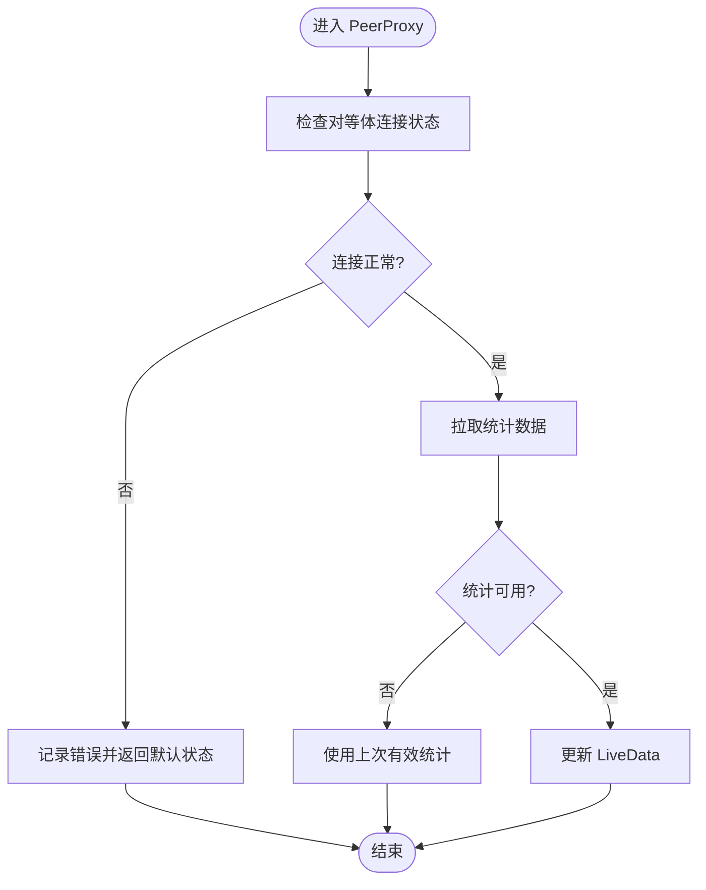
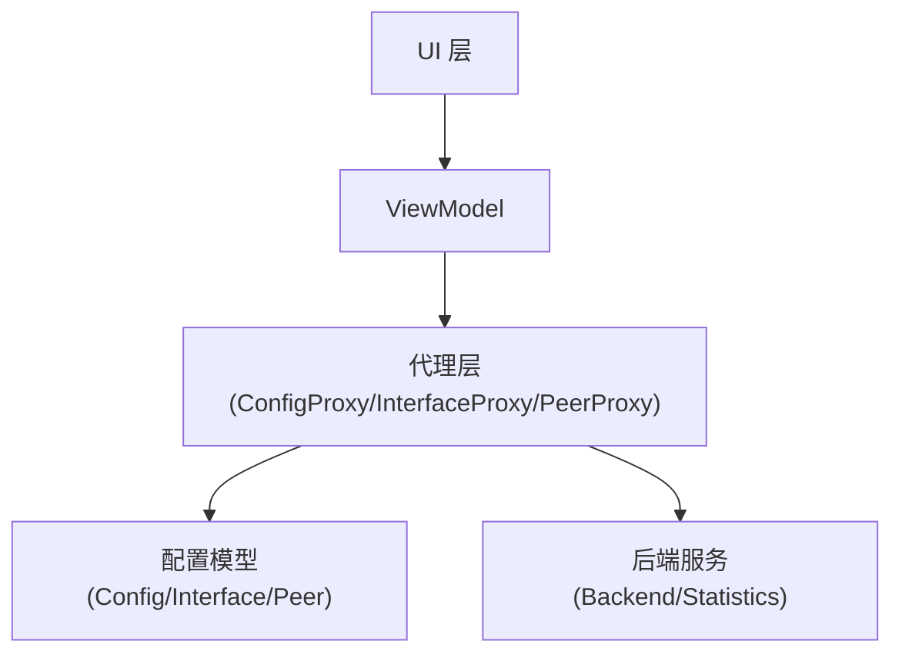
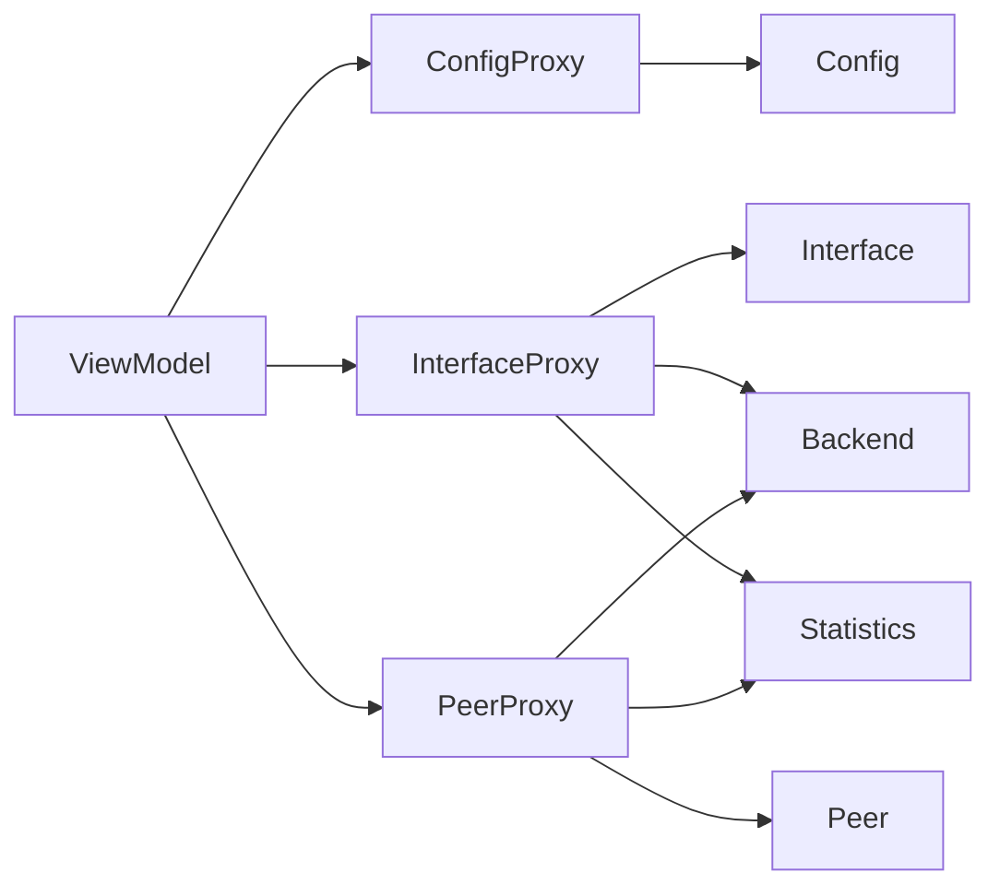

# ViewModel 代理层

<cite>
**本文引用的文件**   
- [ConfigProxy.kt](file://ui/src/main/java/com/wireguard/android/viewmodel/ConfigProxy.kt)
- [InterfaceProxy.kt](file://ui/src/main/java/com/wireguard/android/viewmodel/InterfaceProxy.kt)
- [PeerProxy.kt](file://ui/src/main/java/com/wireguard/android/viewmodel/PeerProxy.kt)
- [Config.java](file://tunnel/src/main/java/com/wireguard/config/Config.java)
- [Interface.java](file://tunnel/src/main/java/com/wireguard/config/Interface.java)
- [Peer.java](file://tunnel/src/main/java/com/wireguard/config/Peer.java)
- [Backend.java](file://tunnel/src/main/java/com/wireguard/android/backend/Backend.java)
- [Statistics.java](file://tunnel/src/main/java/com/wireguard/android/backend/Statistics.java)
- [Tunnel.java](file://tunnel/src/main/java/com/wireguard/android/backend/Tunnel.java)
- [ObservableTunnel.kt](file://ui/src/main/java/com/wireguard/android/model/ObservableTunnel.kt)
- [TunnelManager.kt](file://ui/src/main/java/com/wireguard/android/model/TunnelManager.kt)
</cite>

## 目录
1. [简介](#简介)
2. [项目结构](#项目结构)
3. [核心组件](#核心组件)
4. [架构总览](#架构总览)
5. [详细组件分析](#详细组件分析)
6. [依赖关系分析](#依赖关系分析)
7. [性能考量](#性能考量)
8. [故障排查指南](#故障排查指南)
9. [结论](#结论)
10. [附录](#附录)

## 简介
本技术文档聚焦于 ViewModel 代理层，围绕 ConfigProxy、InterfaceProxy、PeerProxy 三大代理类展开。它们将底层配置对象（Config、Interface、Peer）与 UI 层解耦，通过响应式数据流（LiveData）向界面提供可观察的数据更新，并在 MVVM 架构中承担状态管理与变更通知的职责。本文还将说明与后端模块（Backend、Statistics、Tunnel）的集成方式、错误处理机制、数据绑定示例以及性能优化技巧。

## 项目结构
ViewModel 代理层位于 ui 模块的 viewmodel 包中，分别封装 tunnel 模块的配置实体：
- ConfigProxy 封装 Config
- InterfaceProxy 封装 Interface
- PeerProxy 封装 Peer

这些代理类在 Fragment/Activity 的 ViewModel 中被使用，配合 LiveData 实现响应式 UI 更新。

图表来源
- [ConfigProxy.kt](file://ui/src/main/java/com/wireguard/android/viewmodel/ConfigProxy.kt)
- [InterfaceProxy.kt](file://ui/src/main/java/com/wireguard/android/viewmodel/InterfaceProxy.kt)
- [PeerProxy.kt](file://ui/src/main/java/com/wireguard/android/viewmodel/PeerProxy.kt)
- [Config.java](file://tunnel/src/main/java/com/wireguard/config/Config.java)
- [Interface.java](file://tunnel/src/main/java/com/wireguard/config/Interface.java)
- [Peer.java](file://tunnel/src/main/java/com/wireguard/config/Peer.java)
- [Backend.java](file://tunnel/src/main/java/com/wireguard/android/backend/Backend.java)
- [Statistics.java](file://tunnel/src/main/java/com/wireguard/android/backend/Statistics.java)
- [Tunnel.java](file://tunnel/src/main/java/com/wireguard/android/backend/Tunnel.java)

章节来源
- [ConfigProxy.kt](file://ui/src/main/java/com/wireguard/android/viewmodel/ConfigProxy.kt)
- [InterfaceProxy.kt](file://ui/src/main/java/com/wireguard/android/viewmodel/InterfaceProxy.kt)
- [PeerProxy.kt](file://ui/src/main/java/com/wireguard/android/viewmodel/PeerProxy.kt)

## 核心组件
- ConfigProxy：对 Config 进行封装，暴露响应式的配置属性，支持监听配置变更并触发 UI 刷新。
- InterfaceProxy：对 Interface 进行代理，维护接口配置属性，监听连接状态变化，同步统计信息，并向 UI 发布 LiveData。
- PeerProxy：对 Peer 进行代理，管理对等体配置，监控连接状态与统计数据，提供变更通知。

章节来源
- [ConfigProxy.kt](file://ui/src/main/java/com/wireguard/android/viewmodel/ConfigProxy.kt)
- [InterfaceProxy.kt](file://ui/src/main/java/com/wireguard/android/viewmodel/InterfaceProxy.kt)
- [PeerProxy.kt](file://ui/src/main/java/com/wireguard/android/viewmodel/PeerProxy.kt)

## 架构总览
代理层在 MVVM 中的职责：
- 隔离 UI 与底层配置对象，避免直接操作 Config/Interface/Peer。
- 将配置对象的变更转换为 LiveData 事件，驱动 UI 响应式更新。
- 与 Backend 交互，获取连接状态和统计数据，统一在代理层内处理异步与异常。

图表来源
- [InterfaceProxy.kt](file://ui/src/main/java/com/wireguard/android/viewmodel/InterfaceProxy.kt)
- [PeerProxy.kt](file://ui/src/main/java/com/wireguard/android/viewmodel/PeerProxy.kt)
- [Backend.java](file://tunnel/src/main/java/com/wireguard/android/backend/Backend.java)
- [Statistics.java](file://tunnel/src/main/java/com/wireguard/android/backend/Statistics.java)
- [Tunnel.java](file://tunnel/src/main/java/com/wireguard/android/backend/Tunnel.java)

## 详细组件分析

### ConfigProxy 分析
- 作用：封装 Config 对象，暴露响应式属性（如名称、描述、全局开关等），当底层配置发生变化时，通过 LiveData 通知 UI。
- 数据流：读取 Config -> 转换/校验 -> 发布 LiveData -> UI 订阅更新。
- 错误处理：捕获解析或访问异常，向上抛出或降级为默认值，保证 UI 稳定。
- 性能：避免频繁创建 LiveData，采用单例或生命周期感知观察者；仅在必要字段变更时触发更新。

图表来源
- [ConfigProxy.kt](file://ui/src/main/java/com/wireguard/android/viewmodel/ConfigProxy.kt)
- [Config.java](file://tunnel/src/main/java/com/wireguard/config/Config.java)

章节来源
- [ConfigProxy.kt](file://ui/src/main/java/com/wireguard/android/viewmodel/ConfigProxy.kt)
- [Config.java](file://tunnel/src/main/java/com/wireguard/config/Config.java)

### InterfaceProxy 分析
- 作用：代理 Interface 配置，监听连接状态变化，同步统计信息，并通过 LiveData 暴露给 UI。
- 关键能力：
  - 属性监听：接口地址、端口、密钥等属性的变更监听。
  - 变更通知：属性修改后发布 LiveData，驱动 UI 刷新。
  - 连接状态监控：与 Backend 交互，获取当前连接状态（已连接/断开/错误）。
  - 统计同步：从 Statistics 拉取流量统计并更新 UI。
- 错误处理：网络或状态查询失败时，返回错误状态并提示用户。

图表来源
- [InterfaceProxy.kt](file://ui/src/main/java/com/wireguard/android/viewmodel/InterfaceProxy.kt)
- [Backend.java](file://tunnel/src/main/java/com/wireguard/android/backend/Backend.java)
- [Statistics.java](file://tunnel/src/main/java/com/wireguard/android/backend/Statistics.java)

章节来源
- [InterfaceProxy.kt](file://ui/src/main/java/com/wireguard/android/viewmodel/InterfaceProxy.kt)
- [Backend.java](file://tunnel/src/main/java/com/wireguard/android/backend/Backend.java)
- [Statistics.java](file://tunnel/src/main/java/com/wireguard/android/backend/Statistics.java)

### PeerProxy 分析
- 作用：代理 Peer 配置，管理对等体连接信息与统计，提供响应式更新。
- 关键能力：
  - 连接状态监控：实时获取对等体的连接状态（在线/离线/错误）。
  - 统计信息同步：同步上行/下行流量、延迟等指标。
  - 变更通知：对等体配置或状态变化时，发布 LiveData。
- 错误处理：连接失败或统计不可用时，返回默认值或错误状态，确保 UI 不崩溃。

图表来源
- [PeerProxy.kt](file://ui/src/main/java/com/wireguard/android/viewmodel/PeerProxy.kt)
- [Backend.java](file://tunnel/src/main/java/com/wireguard/android/backend/Backend.java)
- [Statistics.java](file://tunnel/src/main/java/com/wireguard/android/backend/Statistics.java)

章节来源
- [PeerProxy.kt](file://ui/src/main/java/com/wireguard/android/viewmodel/PeerProxy.kt)
- [Backend.java](file://tunnel/src/main/java/com/wireguard/android/backend/Backend.java)
- [Statistics.java](file://tunnel/src/main/java/com/wireguard/android/backend/Statistics.java)

### 概念性概览
代理模式在 MVVM 中的作用：
- 解耦：UI 不直接依赖底层配置对象，降低耦合度。
- 可测试性：代理层可替换为 Mock 对象，便于单元测试。
- 响应式：通过 LiveData 统一管理数据流，简化 UI 更新逻辑。
- 一致性：集中处理错误与异常，保证 UI 行为一致。

[此图为概念流程图，不映射具体源码文件]

## 依赖关系分析
- ConfigProxy 依赖 Config，负责配置数据的响应式封装。
- InterfaceProxy 依赖 Interface 与 Backend，负责连接状态与统计同步。
- PeerProxy 依赖 Peer 与 Backend，负责对等体连接与统计管理。
- ObservableTunnel 与 TunnelManager 作为隧道管理的辅助组件，可能与代理层协作以提供更高层的状态管理。

图表来源
- [ConfigProxy.kt](file://ui/src/main/java/com/wireguard/android/viewmodel/ConfigProxy.kt)
- [InterfaceProxy.kt](file://ui/src/main/java/com/wireguard/android/viewmodel/InterfaceProxy.kt)
- [PeerProxy.kt](file://ui/src/main/java/com/wireguard/android/viewmodel/PeerProxy.kt)
- [Config.java](file://tunnel/src/main/java/com/wireguard/config/Config.java)
- [Interface.java](file://tunnel/src/main/java/com/wireguard/config/Interface.java)
- [Peer.java](file://tunnel/src/main/java/com/wireguard/config/Peer.java)
- [Backend.java](file://tunnel/src/main/java/com/wireguard/android/backend/Backend.java)
- [Statistics.java](file://tunnel/src/main/java/com/wireguard/android/backend/Statistics.java)

章节来源
- [ConfigProxy.kt](file://ui/src/main/java/com/wireguard/android/viewmodel/ConfigProxy.kt)
- [InterfaceProxy.kt](file://ui/src/main/java/com/wireguard/android/viewmodel/InterfaceProxy.kt)
- [PeerProxy.kt](file://ui/src/main/java/com/wireguard/android/viewmodel/PeerProxy.kt)
- [ObservableTunnel.kt](file://ui/src/main/java/com/wireguard/android/model/ObservableTunnel.kt)
- [TunnelManager.kt](file://ui/src/main/java/com/wireguard/android/model/TunnelManager.kt)

## 性能考量
- LiveData 使用：
  - 避免重复创建 LiveData，尽量复用或缓存。
  - 使用 observeLifecycle 确保只在活跃生命周期内接收更新。
- 数据更新频率：
  - 合并高频更新（如统计信息）使用节流或去抖策略。
  - 批量更新配置时，合并多次变更以减少 UI 重绘。
- 内存管理：
  - 及时移除不必要的观察者，防止内存泄漏。
  - 大对象（如配置）使用引用而非拷贝。
- 异步操作：
  - 使用协程或线程池处理 I/O 操作，避免阻塞主线程。
  - 错误路径快速失败，减少无效计算。

[本节为通用指导，不直接分析具体文件]

## 故障排查指南
- 常见问题：
  - 配置解析失败：检查 Config/Interface/Peer 的必填字段与格式。
  - 连接状态异常：确认 Backend 是否正常运行，权限是否正确。
  - 统计信息缺失：检查 Statistics 数据源是否可用，网络是否正常。
- 调试建议：
  - 在代理层添加日志输出，追踪数据流与异常位置。
  - 使用断点调试 LiveData 的发布与观察过程。
  - 验证错误处理分支是否按预期执行。

章节来源
- [ConfigProxy.kt](file://ui/src/main/java/com/wireguard/android/viewmodel/ConfigProxy.kt)
- [InterfaceProxy.kt](file://ui/src/main/java/com/wireguard/android/viewmodel/InterfaceProxy.kt)
- [PeerProxy.kt](file://ui/src/main/java/com/wireguard/android/viewmodel/PeerProxy.kt)

## 结论
ViewModel 代理层通过 ConfigProxy、InterfaceProxy、PeerProxy 实现了配置对象与 UI 的有效解耦，利用 LiveData 提供响应式数据更新，并与后端模块无缝集成。该设计提升了代码的可维护性与可测试性，同时保证了 UI 的稳定性和性能。在实际开发中，应遵循错误处理与性能优化的最佳实践，以确保用户体验与系统可靠性。

[本节为总结性内容，不直接分析具体文件]

## 附录
- 数据绑定示例：
  - 在布局文件中绑定 LiveData 属性，如文本、开关状态、列表项等。
  - 使用自定义 BindingAdapter 扩展数据绑定能力。
- 异步操作处理：
  - 使用协程或 RxJava 处理网络请求与状态同步。
  - 确保在主线程更新 UI，避免并发问题。

[本节为补充说明，不直接分析具体文件]