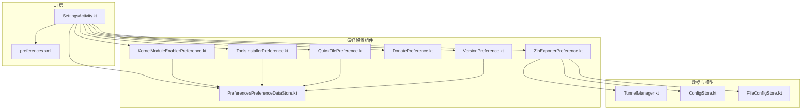
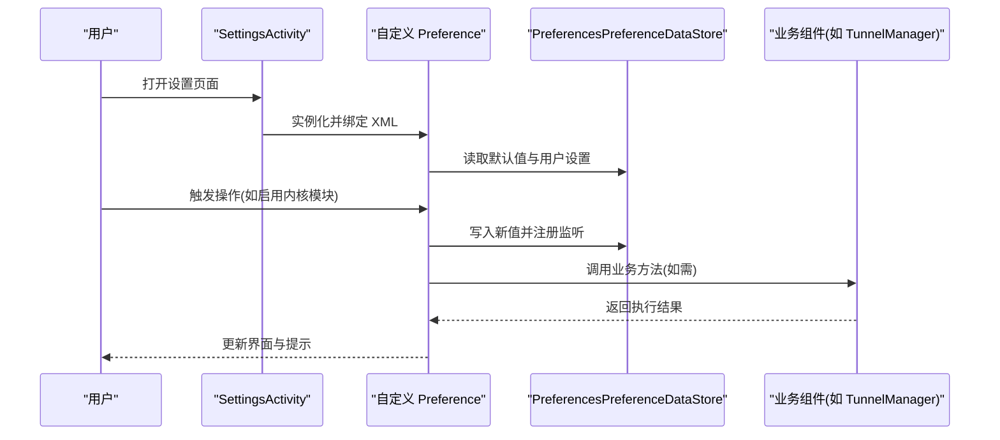
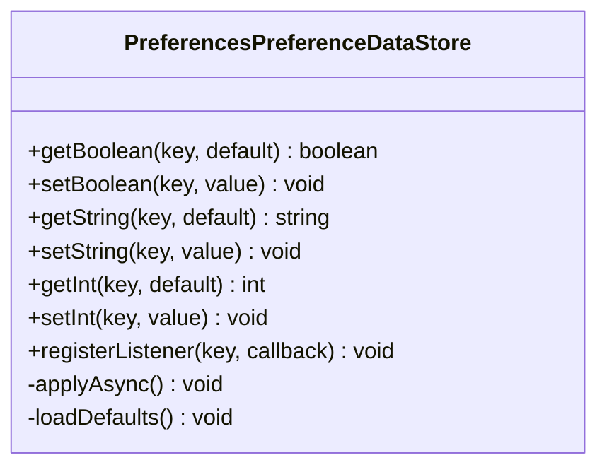
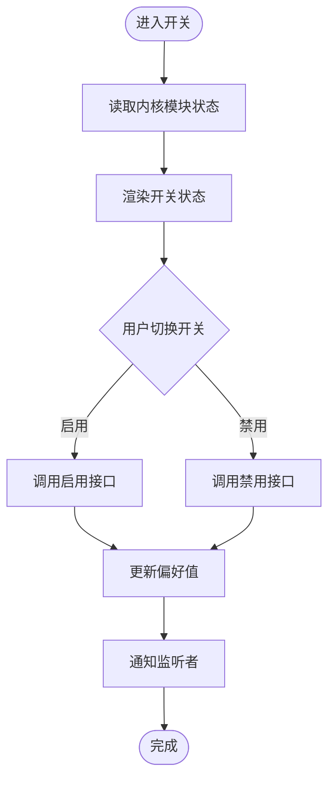
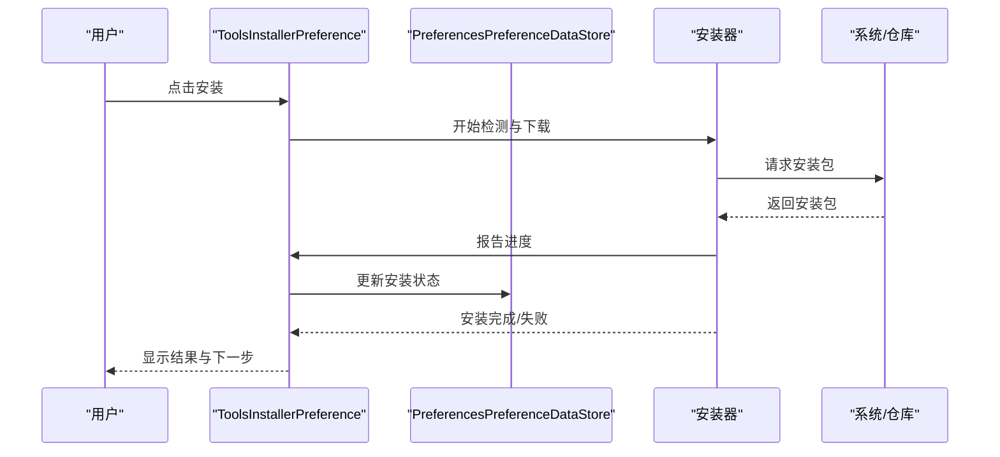
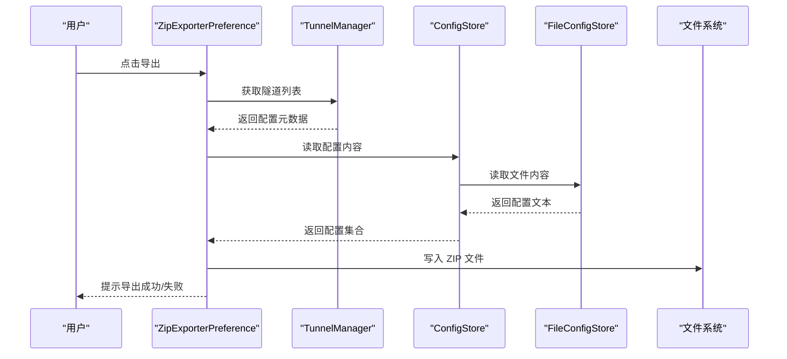
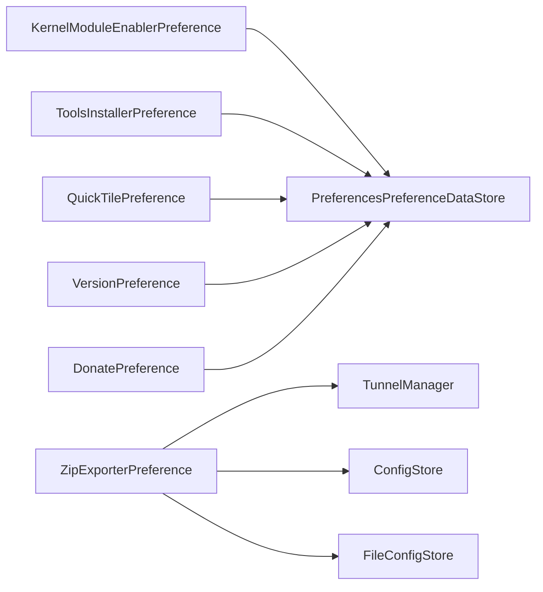

# 偏好设置系统

<cite>
**本文引用的文件**   
- [PreferencesPreferenceDataStore.kt](file://ui/src/main/java/com/wireguard/android/preference/PreferencesPreferenceDataStore.kt)
- [KernelModuleEnablerPreference.kt](file://ui/src/main/java/com/wireguard/android/preference/KernelModuleEnablerPreference.kt)
- [ToolsInstallerPreference.kt](file://ui/src/main/java/com/wireguard/android/preference/ToolsInstallerPreference.kt)
- [ZipExporterPreference.kt](file://ui/src/main/java/com/wireguard/android/preference/ZipExporterPreference.kt)
- [DonatePreference.kt](file://ui/src/main/java/com/wireguard/android/preference/DonatePreference.kt)
- [VersionPreference.kt](file://ui/src/main/java/com/wireguard/android/preference/VersionPreference.kt)
- [QuickTilePreference.kt](file://ui/src/main/java/com/wireguard/android/preference/QuickTilePreference.kt)
- [preferences.xml](file://ui/src/main/res/xml/preferences.xml)
- [SettingsActivity.kt](file://ui/src/main/java/com/wireguard/android/activity/SettingsActivity.kt)
- [TunnelManager.kt](file://ui/src/main/java/com/wireguard/android/model/TunnelManager.kt)
- [ConfigStore.kt](file://ui/src/main/java/com/wireguard/android/configStore/ConfigStore.kt)
- [FileConfigStore.kt](file://ui/src/main/java/com/wireguard/android/configStore/FileConfigStore.kt)
</cite>

## 目录
1. [简介](#简介)
2. [项目结构](#项目结构)
3. [核心组件](#核心组件)
4. [架构总览](#架构总览)
5. [详细组件分析](#详细组件分析)
6. [依赖关系分析](#依赖关系分析)
7. [性能考量](#性能考量)
8. [故障排查指南](#故障排查指南)
9. [结论](#结论)
10. [附录：自定义 Preference 开发指南](#附录自定义-preference-开发指南)

## 简介
本技术文档聚焦 WireGuard Android 应用中的“偏好设置系统”，围绕以下目标展开：
- 深入解析 PreferencesPreferenceDataStore 的数据存储实现，包括对 SharedPreferences 的封装与优化。
- 详细说明 KernelModuleEnablerPreference 的内核模块开关功能。
- 记录 ToolsInstallerPreference 的工具安装管理流程。
- 解释 ZipExporterPreference 的导出功能实现。
- 说明 DonatePreference 的捐赠引导和用户反馈收集。
- 记录 VersionPreference 的版本信息显示和更新检查。
- 解释 QuickTilePreference 的快捷方式配置。
- 阐述设置的同步机制与默认值管理。
- 提供可操作的自定义 Preference 开发指南。

## 项目结构
偏好设置相关代码集中在 ui 模块的 preference 包中，并通过 XML 配置文件声明设置项，由 SettingsActivity 加载并展示。数据持久化通过 PreferencesPreferenceDataStore 统一封装，业务逻辑（如隧道、工具安装、导出）与 UI 层解耦。

图表来源
- [SettingsActivity.kt](file://ui/src/main/java/com/wireguard/android/activity/SettingsActivity.kt)
- [preferences.xml](file://ui/src/main/res/xml/preferences.xml)
- [PreferencesPreferenceDataStore.kt](file://ui/src/main/java/com/wireguard/android/preference/PreferencesPreferenceDataStore.kt)
- [KernelModuleEnablerPreference.kt](file://ui/src/main/java/com/wireguard/android/preference/KernelModuleEnablerPreference.kt)
- [ToolsInstallerPreference.kt](file://ui/src/main/java/com/wireguard/android/preference/ToolsInstallerPreference.kt)
- [ZipExporterPreference.kt](file://ui/src/main/java/com/wireguard/android/preference/ZipExporterPreference.kt)
- [DonatePreference.kt](file://ui/src/main/java/com/wireguard/android/preference/DonatePreference.kt)
- [VersionPreference.kt](file://ui/src/main/java/com/wireguard/android/preference/VersionPreference.kt)
- [QuickTilePreference.kt](file://ui/src/main/java/com/wireguard/android/preference/QuickTilePreference.kt)
- [TunnelManager.kt](file://ui/src/main/java/com/wireguard/android/model/TunnelManager.kt)
- [ConfigStore.kt](file://ui/src/main/java/com/wireguard/android/configStore/ConfigStore.kt)
- [FileConfigStore.kt](file://ui/src/main/java/com/wireguard/android/configStore/FileConfigStore.kt)

章节来源
- [SettingsActivity.kt](file://ui/src/main/java/com/wireguard/android/activity/SettingsActivity.kt)
- [preferences.xml](file://ui/src/main/res/xml/preferences.xml)

## 核心组件
- PreferencesPreferenceDataStore：统一的偏好设置数据存取封装，基于 SharedPreferences，提供类型安全、线程友好的读写接口，支持默认值与监听回调。
- KernelModuleEnablerPreference：内核模块开关，用于启用/禁用 WireGuard 内核模块，并在状态变化时通知系统或上层服务。
- ToolsInstallerPreference：工具安装管理，负责检测、下载与安装必要的系统工具（例如 wireguard-tools），并提供安装进度与结果反馈。
- ZipExporterPreference：配置导出功能，将当前隧道配置打包为 ZIP 文件，便于备份与分享。
- DonatePreference：捐赠引导与用户反馈入口，引导用户进行捐赠或提交问题反馈。
- VersionPreference：显示应用版本信息，并可触发更新检查流程。
- QuickTilePreference：快捷方式（Quick Tile）配置，控制快捷开关的可见性与行为。

章节来源
- [PreferencesPreferenceDataStore.kt](file://ui/src/main/java/com/wireguard/android/preference/PreferencesPreferenceDataStore.kt)
- [KernelModuleEnablerPreference.kt](file://ui/src/main/java/com/wireguard/android/preference/KernelModuleEnablerPreference.kt)
- [ToolsInstallerPreference.kt](file://ui/src/main/java/com/wireguard/android/preference/ToolsInstallerPreference.kt)
- [ZipExporterPreference.kt](file://ui/src/main/java/com/wireguard/android/preference/ZipExporterPreference.kt)
- [DonatePreference.kt](file://ui/src/main/java/com/wireguard/android/preference/DonatePreference.kt)
- [VersionPreference.kt](file://ui/src/main/java/com/wireguard/android/preference/VersionPreference.kt)
- [QuickTilePreference.kt](file://ui/src/main/java/com/wireguard/android/preference/QuickTilePreference.kt)

## 架构总览
偏好设置系统的整体交互如下：
- SettingsActivity 加载 preferences.xml 定义的 Preference 树。
- 每个自定义 Preference 在初始化时从 PreferencesPreferenceDataStore 读取默认值与用户设置。
- 用户操作触发对应 Preference 的业务逻辑（如启用内核模块、安装工具、导出配置等）。
- 关键状态变更通过 PreferencesPreferenceDataStore 的监听机制同步到 UI 或其他组件。

图表来源
- [SettingsActivity.kt](file://ui/src/main/java/com/wireguard/android/activity/SettingsActivity.kt)
- [preferences.xml](file://ui/src/main/res/xml/preferences.xml)
- [PreferencesPreferenceDataStore.kt](file://ui/src/main/java/com/wireguard/android/preference/PreferencesPreferenceDataStore.kt)
- [TunnelManager.kt](file://ui/src/main/java/com/wireguard/android/model/TunnelManager.kt)

## 详细组件分析

### PreferencesPreferenceDataStore：数据存储与优化
- 设计目标：为所有 Preference 提供一致、类型安全的键值存取能力，屏蔽 SharedPreferences 的复杂性。
- 主要职责：
  - 提供布尔、字符串、整数等类型的 get/set 方法。
  - 支持默认值注入，保证首次访问时的稳定性。
  - 提供监听器接口，以便在值变化时通知 UI 或业务层。
  - 内部使用 SharedPreferences 的异步写入策略，避免阻塞主线程。
- 优化点：
  - 批量写入合并，减少 I/O 次数。
  - 懒加载与缓存热点键，降低重复读取开销。
  - 错误处理与降级策略，确保异常情况下仍可回退到默认值。

图表来源
- [PreferencesPreferenceDataStore.kt](file://ui/src/main/java/com/wireguard/android/preference/PreferencesPreferenceDataStore.kt)

章节来源
- [PreferencesPreferenceDataStore.kt](file://ui/src/main/java/com/wireguard/android/preference/PreferencesPreferenceDataStore.kt)

### KernelModuleEnablerPreference：内核模块开关
- 功能概述：允许用户在设置中启用或禁用 WireGuard 内核模块，影响网络隧道的底层实现。
- 交互流程：
  - 读取当前内核模块状态。
  - 根据用户选择调用系统或驱动接口切换状态。
  - 更新本地偏好值并广播状态变化。
- 注意事项：
  - 需要适当的权限与 root 能力（视平台而定）。
  - 失败时需给出明确提示与回滚策略。

图表来源
- [KernelModuleEnablerPreference.kt](file://ui/src/main/java/com/wireguard/android/preference/KernelModuleEnablerPreference.kt)
- [PreferencesPreferenceDataStore.kt](file://ui/src/main/java/com/wireguard/android/preference/PreferencesPreferenceDataStore.kt)

章节来源
- [KernelModuleEnablerPreference.kt](file://ui/src/main/java/com/wireguard/android/preference/KernelModuleEnablerPreference.kt)

### ToolsInstallerPreference：工具安装管理
- 功能概述：检测系统中是否已安装必要工具（如 wireguard-tools），若缺失则引导用户下载安装。
- 交互流程：
  - 检测工具是否存在与版本。
  - 若缺失，显示安装入口与进度。
  - 安装完成后验证可用性并更新偏好状态。
- 错误处理：
  - 网络不可用、权限不足、签名校验失败等情况需友好提示。
  - 支持重试与取消操作。

图表来源
- [ToolsInstallerPreference.kt](file://ui/src/main/java/com/wireguard/android/preference/ToolsInstallerPreference.kt)
- [PreferencesPreferenceDataStore.kt](file://ui/src/main/java/com/wireguard/android/preference/PreferencesPreferenceDataStore.kt)

章节来源
- [ToolsInstallerPreference.kt](file://ui/src/main/java/com/wireguard/android/preference/ToolsInstallerPreference.kt)

### ZipExporterPreference：配置导出
- 功能概述：将当前隧道配置导出为 ZIP 文件，便于备份与分享。
- 交互流程：
  - 收集隧道配置数据。
  - 生成 ZIP 文件并保存到指定目录。
  - 提供分享或打开选项。
- 数据流：
  - 从 TunnelManager 获取配置列表。
  - 通过 ConfigStore/FileConfigStore 读取具体配置内容。
  - 输出到外部存储或共享目录。

图表来源
- [ZipExporterPreference.kt](file://ui/src/main/java/com/wireguard/android/preference/ZipExporterPreference.kt)
- [TunnelManager.kt](file://ui/src/main/java/com/wireguard/android/model/TunnelManager.kt)
- [ConfigStore.kt](file://ui/src/main/java/com/wireguard/android/configStore/ConfigStore.kt)
- [FileConfigStore.kt](file://ui/src/main/java/com/wireguard/android/configStore/FileConfigStore.kt)

章节来源
- [ZipExporterPreference.kt](file://ui/src/main/java/com/wireguard/android/preference/ZipExporterPreference.kt)
- [TunnelManager.kt](file://ui/src/main/java/com/wireguard/android/model/TunnelManager.kt)
- [ConfigStore.kt](file://ui/src/main/java/com/wireguard/android/configStore/ConfigStore.kt)
- [FileConfigStore.kt](file://ui/src/main/java/com/wireguard/android/configStore/FileConfigStore.kt)

### DonatePreference：捐赠引导与反馈
- 功能概述：为用户提供捐赠入口与反馈渠道，增强用户参与感。
- 交互流程：
  - 点击后跳转至捐赠页面或反馈表单。
  - 可选记录用户行为以统计转化率（遵循隐私政策）。
- 注意事项：
  - 链接有效性维护。
  - 反馈数据的匿名化处理。

章节来源
- [DonatePreference.kt](file://ui/src/main/java/com/wireguard/android/preference/DonatePreference.kt)

### VersionPreference：版本信息与更新检查
- 功能概述：显示当前应用版本，并提供更新检查入口。
- 交互流程：
  - 读取应用版本信息。
  - 触发更新检查（联网查询最新版本）。
  - 若有新版本，引导用户前往商店或下载页。
- 错误处理：
  - 网络异常、版本比较失败等场景需提示用户。

章节来源
- [VersionPreference.kt](file://ui/src/main/java/com/wireguard/android/preference/VersionPreference.kt)

### QuickTilePreference：快捷方式配置
- 功能概述：控制系统快捷开关（Quick Tile）的可见性与行为，方便快速连接/断开隧道。
- 交互流程：
  - 读取快捷开关配置。
  - 根据用户设置启用/禁用快捷开关。
  - 与系统快捷面板集成，响应点击事件。
- 注意事项：
  - 不同 Android 版本的兼容性处理。
  - 权限与系统限制。

章节来源
- [QuickTilePreference.kt](file://ui/src/main/java/com/wireguard/android/preference/QuickTilePreference.kt)

## 依赖关系分析
偏好设置组件之间的耦合度较低，主要通过 PreferencesPreferenceDataStore 进行状态同步，业务逻辑委托给独立的服务或管理器。

图表来源
- [KernelModuleEnablerPreference.kt](file://ui/src/main/java/com/wireguard/android/preference/KernelModuleEnablerPreference.kt)
- [ToolsInstallerPreference.kt](file://ui/src/main/java/com/wireguard/android/preference/ToolsInstallerPreference.kt)
- [ZipExporterPreference.kt](file://ui/src/main/java/com/wireguard/android/preference/ZipExporterPreference.kt)
- [QuickTilePreference.kt](file://ui/src/main/java/com/wireguard/android/preference/QuickTilePreference.kt)
- [VersionPreference.kt](file://ui/src/main/java/com/wireguard/android/preference/VersionPreference.kt)
- [DonatePreference.kt](file://ui/src/main/java/com/wireguard/android/preference/DonatePreference.kt)
- [PreferencesPreferenceDataStore.kt](file://ui/src/main/java/com/wireguard/android/preference/PreferencesPreferenceDataStore.kt)
- [TunnelManager.kt](file://ui/src/main/java/com/wireguard/android/model/TunnelManager.kt)
- [ConfigStore.kt](file://ui/src/main/java/com/wireguard/android/configStore/ConfigStore.kt)
- [FileConfigStore.kt](file://ui/src/main/java/com/wireguard/android/configStore/FileConfigStore.kt)

章节来源
- [PreferencesPreferenceDataStore.kt](file://ui/src/main/java/com/wireguard/android/preference/PreferencesPreferenceDataStore.kt)
- [TunnelManager.kt](file://ui/src/main/java/com/wireguard/android/model/TunnelManager.kt)
- [ConfigStore.kt](file://ui/src/main/java/com/wireguard/android/configStore/ConfigStore.kt)
- [FileConfigStore.kt](file://ui/src/main/java/com/wireguard/android/configStore/FileConfigStore.kt)

## 性能考量
- 读写优化：PreferencesPreferenceDataStore 采用异步写入与批量合并，减少 SharedPreferences 的 I/O 压力。
- 内存占用：避免在 Preference 中持有大对象引用，必要时使用弱引用或延迟加载。
- UI 流畅性：耗时操作（如下载、导出）应在后台线程执行，并通过回调更新 UI。
- 监听器管理：合理注册与注销监听器，防止内存泄漏。

[本节为通用指导，不直接分析具体文件]

## 故障排查指南
- 偏好值未生效：
  - 检查默认值是否正确注入。
  - 确认写入操作是否成功且未被覆盖。
  - 查看监听器是否正确触发。
- 内核模块开关失败：
  - 检查权限与 root 状态。
  - 查看系统日志定位驱动或内核错误。
- 工具安装失败：
  - 验证网络连接与仓库可达性。
  - 检查签名校验与存储空间。
- 导出失败：
  - 确认文件写入权限与路径有效性。
  - 检查配置数据完整性。

章节来源
- [PreferencesPreferenceDataStore.kt](file://ui/src/main/java/com/wireguard/android/preference/PreferencesPreferenceDataStore.kt)
- [KernelModuleEnablerPreference.kt](file://ui/src/main/java/com/wireguard/android/preference/KernelModuleEnablerPreference.kt)
- [ToolsInstallerPreference.kt](file://ui/src/main/java/com/wireguard/android/preference/ToolsInstallerPreference.kt)
- [ZipExporterPreference.kt](file://ui/src/main/java/com/wireguard/android/preference/ZipExporterPreference.kt)

## 结论
偏好设置系统通过统一的 PreferencesPreferenceDataStore 实现了稳定、高效的状态管理，各自定义 Preference 职责清晰、耦合度低。结合 XML 配置与 Activity 加载机制，提供了良好的可扩展性与可维护性。未来可进一步引入更丰富的数据类型与跨进程同步能力，以满足复杂场景需求。

[本节为总结性内容，不直接分析具体文件]

## 附录：自定义 Preference 开发指南
- 步骤概览：
  - 定义 XML 布局与属性（attrs.xml）。
  - 创建继承自 Preference 的类，实现初始化、值读取与写入逻辑。
  - 在 preferences.xml 中声明该 Preference。
  - 在 SettingsActivity 中加载并绑定。
- 最佳实践：
  - 使用 PreferencesPreferenceDataStore 进行数据存取，避免直接操作 SharedPreferences。
  - 对用户输入进行校验，提供即时反馈。
  - 耗时操作放入后台线程，避免阻塞 UI。
  - 妥善处理异常与边界情况，保证用户体验。
- 示例参考：
  - 参考现有组件（如 KernelModuleEnablerPreference、ToolsInstallerPreference）的实现模式。

章节来源
- [preferences.xml](file://ui/src/main/res/xml/preferences.xml)
- [SettingsActivity.kt](file://ui/src/main/java/com/wireguard/android/activity/SettingsActivity.kt)
- [PreferencesPreferenceDataStore.kt](file://ui/src/main/java/com/wireguard/android/preference/PreferencesPreferenceDataStore.kt)
- [KernelModuleEnablerPreference.kt](file://ui/src/main/java/com/wireguard/android/preference/KernelModuleEnablerPreference.kt)
- [ToolsInstallerPreference.kt](file://ui/src/main/java/com/wireguard/android/preference/ToolsInstallerPreference.kt)