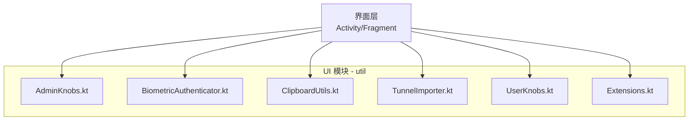
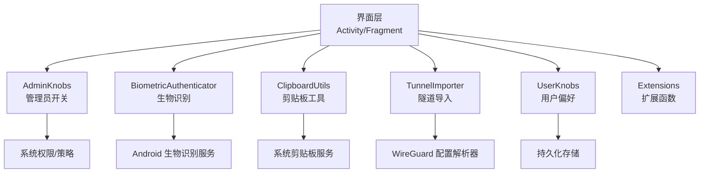
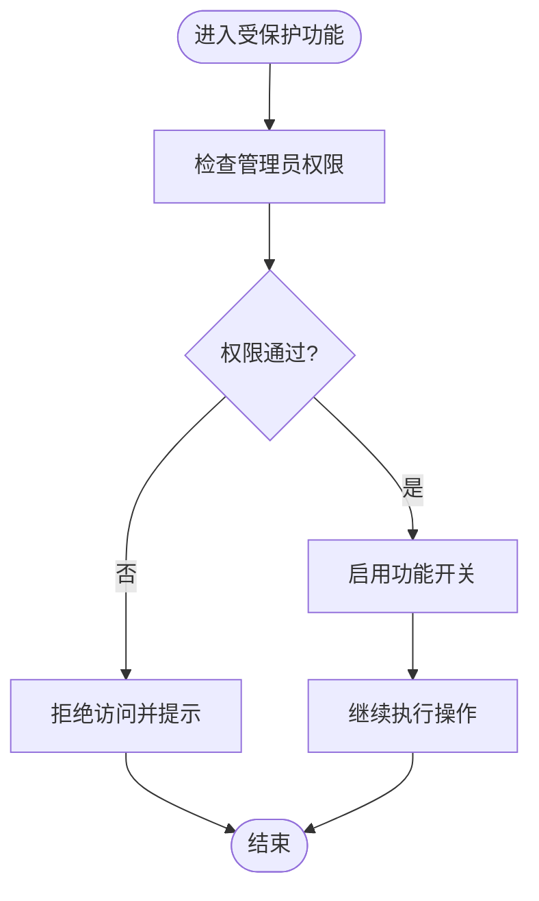
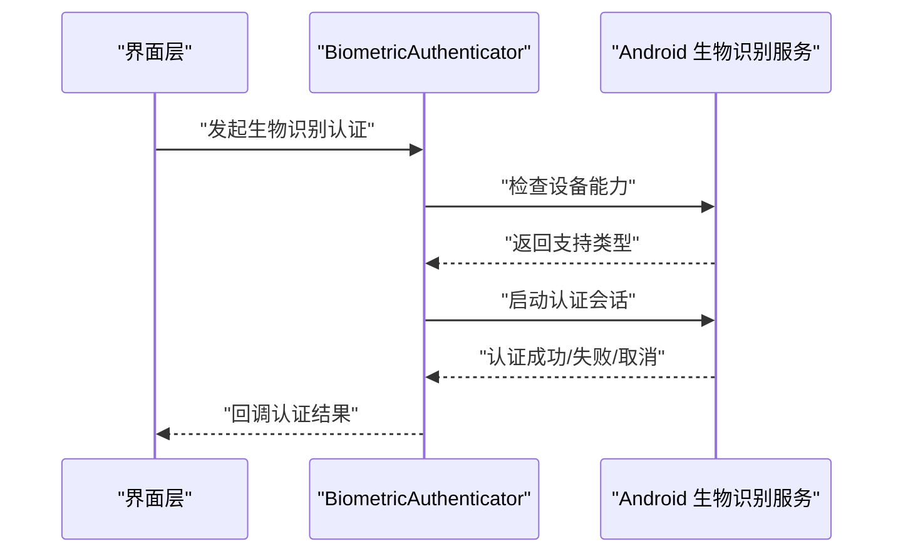
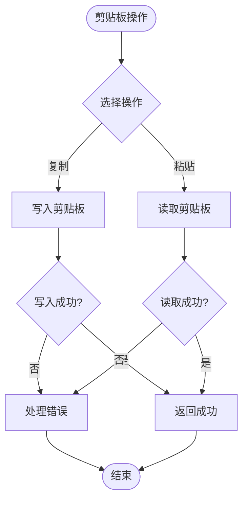
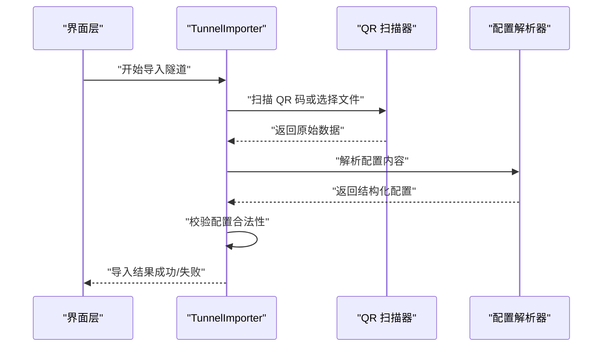
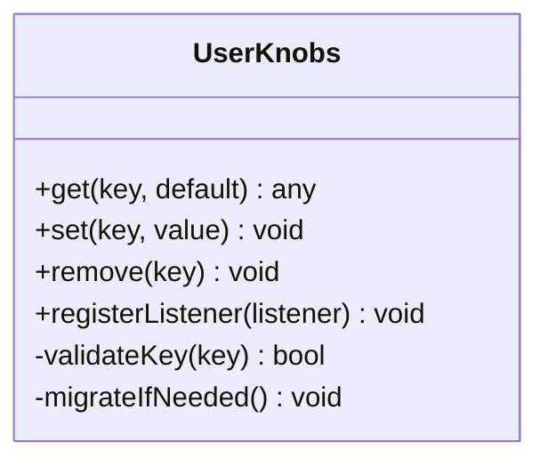
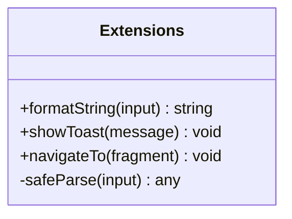
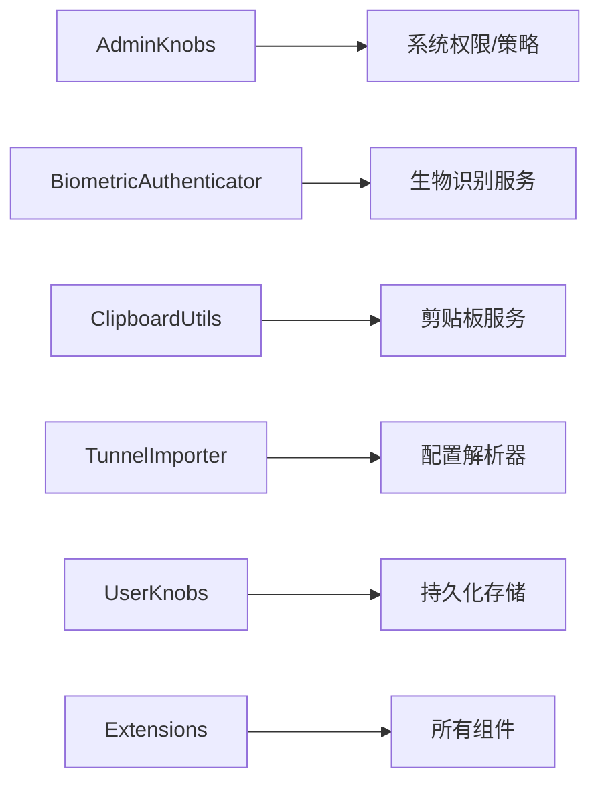

# 实用工具组件

<cite>
**本文档引用的文件**
- [AdminKnobs.kt](file://ui/src/main/java/com/wireguard/android/util/AdminKnobs.kt)
- [BiometricAuthenticator.kt](file://ui/src/main/java/com/wireguard/android/util/BiometricAuthenticator.kt)
- [ClipboardUtils.kt](file://ui/src/main/java/com/wireguard/android/util/ClipboardUtils.kt)
- [TunnelImporter.kt](file://ui/src/main/java/com/wireguard/android/util/TunnelImporter.kt)
- [UserKnobs.kt](file://ui/src/main/java/com/wireguard/android/util/UserKnobs.kt)
- [Extensions.kt](file://ui/src/main/java/com/wireguard/android/util/Extensions.kt)
</cite>

## 目录
1. [简介](#简介)
2. [项目结构](#项目结构)
3. [核心组件](#核心组件)
4. [架构总览](#架构总览)
5. [详细组件分析](#详细组件分析)
6. [依赖关系分析](#依赖关系分析)
7. [性能考虑](#性能考虑)
8. [故障排查指南](#故障排查指南)
9. [结论](#结论)
10. [附录](#附录)

## 简介
本技术文档聚焦 WireGuard Android 项目中的实用工具组件，围绕以下能力进行系统化说明：
- AdminKnobs：管理员功能开关与权限检查、功能启用机制
- BiometricAuthenticator：生物识别认证（指纹、面部识别）实现
- ClipboardUtils：剪贴板操作工具（文本复制粘贴、格式处理）
- TunnelImporter：隧道导入（QR 码扫描、配置文件解析）
- UserKnobs：用户偏好设置管理
- Extensions：Kotlin 扩展函数与通用工具方法

文档提供架构图、调用序列图、流程图以及最佳实践与错误处理建议，帮助开发者快速理解并正确使用这些组件。

## 项目结构
实用工具组件位于 ui 模块的 util 包中，按职责划分清晰：
- AdminKnobs.kt：管理员开关与权限控制
- BiometricAuthenticator.kt：生物识别认证封装
- ClipboardUtils.kt：剪贴板读写与格式化
- TunnelImporter.kt：隧道配置导入（含 QR 码与文件解析）
- UserKnobs.kt：用户偏好存储与读取
- Extensions.kt：Kotlin 扩展方法与工具函数

**图表来源**
- [AdminKnobs.kt](file://ui/src/main/java/com/wireguard/android/util/AdminKnobs.kt)
- [BiometricAuthenticator.kt](file://ui/src/main/java/com/wireguard/android/util/BiometricAuthenticator.kt)
- [ClipboardUtils.kt](file://ui/src/main/java/com/wireguard/android/util/ClipboardUtils.kt)
- [TunnelImporter.kt](file://ui/src/main/java/com/wireguard/android/util/TunnelImporter.kt)
- [UserKnobs.kt](file://ui/src/main/java/com/wireguard/android/util/UserKnobs.kt)
- [Extensions.kt](file://ui/src/main/java/com/wireguard/android/util/Extensions.kt)

**章节来源**
- [AdminKnobs.kt](file://ui/src/main/java/com/wireguard/android/util/AdminKnobs.kt)
- [BiometricAuthenticator.kt](file://ui/src/main/java/com/wireguard/android/util/BiometricAuthenticator.kt)
- [ClipboardUtils.kt](file://ui/src/main/java/com/wireguard/android/util/ClipboardUtils.kt)
- [TunnelImporter.kt](file://ui/src/main/java/com/wireguard/android/util/TunnelImporter.kt)
- [UserKnobs.kt](file://ui/src/main/java/com/wireguard/android/util/UserKnobs.kt)
- [Extensions.kt](file://ui/src/main/java/com/wireguard/android/util/Extensions.kt)

## 核心组件
本节概述各工具组件的职责与关键能力：
- AdminKnobs：集中管理管理员级别的功能开关，结合系统权限或设备策略进行启用控制
- BiometricAuthenticator：封装 Android 生物识别 API，支持指纹与面部识别，提供统一的认证流程
- ClipboardUtils：统一剪贴板访问接口，处理文本复制/粘贴与常见格式转换
- TunnelImporter：负责从 QR 码或文件中解析 WireGuard 隧道配置，并进行校验与导入
- UserKnobs：基于持久化存储的用户偏好管理，提供类型安全的读写接口
- Extensions：为常用类型提供便捷扩展方法，提升开发效率与代码可读性

**章节来源**
- [AdminKnobs.kt](file://ui/src/main/java/com/wireguard/android/util/AdminKnobs.kt)
- [BiometricAuthenticator.kt](file://ui/src/main/java/com/wireguard/android/util/BiometricAuthenticator.kt)
- [ClipboardUtils.kt](file://ui/src/main/java/com/wireguard/android/util/ClipboardUtils.kt)
- [TunnelImporter.kt](file://ui/src/main/java/com/wireguard/android/util/TunnelImporter.kt)
- [UserKnobs.kt](file://ui/src/main/java/com/wireguard/android/util/UserKnobs.kt)
- [Extensions.kt](file://ui/src/main/java/com/wireguard/android/util/Extensions.kt)

## 架构总览
下图展示了实用工具组件在应用中的位置与交互关系。UI 层通过工具类完成权限检查、生物识别、剪贴板操作、隧道导入与偏好设置等任务。

**图表来源**
- [AdminKnobs.kt](file://ui/src/main/java/com/wireguard/android/util/AdminKnobs.kt)
- [BiometricAuthenticator.kt](file://ui/src/main/java/com/wireguard/android/util/BiometricAuthenticator.kt)
- [ClipboardUtils.kt](file://ui/src/main/java/com/wireguard/android/util/ClipboardUtils.kt)
- [TunnelImporter.kt](file://ui/src/main/java/com/wireguard/android/util/TunnelImporter.kt)
- [UserKnobs.kt](file://ui/src/main/java/com/wireguard/android/util/UserKnobs.kt)
- [Extensions.kt](file://ui/src/main/java/com/wireguard/android/util/Extensions.kt)

## 详细组件分析

### AdminKnobs：管理员功能开关与权限检查
- 职责
  - 提供管理员级别功能开关的统一入口
  - 根据系统权限或设备策略判断是否启用特定功能
  - 暴露布尔型状态供 UI 层动态展示与交互
- 关键行为
  - 权限检查：结合系统权限或设备策略返回可用状态
  - 功能启用：在满足条件时允许执行敏感操作（如高级设置、调试模式）
  - 状态缓存：避免频繁查询系统资源，提高响应速度
- 使用示例
  - 在需要管理员权限的操作前调用检查方法，根据结果决定是否继续
  - 将开关状态绑定到 UI 控件，实时反映当前可用性
- 最佳实践
  - 对敏感操作增加二次确认提示
  - 在权限变更时刷新状态，确保 UI 一致性
- 错误处理
  - 权限不足时返回明确状态，引导用户授权
  - 异常情况下降级为禁用状态，保证稳定性

**图表来源**
- [AdminKnobs.kt](file://ui/src/main/java/com/wireguard/android/util/AdminKnobs.kt)

**章节来源**
- [AdminKnobs.kt](file://ui/src/main/java/com/wireguard/android/util/AdminKnobs.kt)

### BiometricAuthenticator：生物识别认证实现
- 职责
  - 封装 Android 生物识别 API，提供统一的认证流程
  - 支持指纹与面部识别，适配不同设备能力
- 关键行为
  - 能力检测：检测设备是否支持生物识别及具体类型
  - 认证流程：发起认证请求，处理成功、失败与取消回调
  - 安全上下文：确保认证过程在安全环境中进行
- 使用示例
  - 在敏感操作前触发认证，根据结果决定是否放行
  - 处理认证失败场景（多次失败、硬件不可用）
- 最佳实践
  - 提供清晰的失败原因与重试指引
  - 避免在主线程阻塞，采用异步回调或协程
- 错误处理
  - 捕获生物识别服务异常，回退到密码或其他验证方式
  - 记录失败次数，防止暴力尝试

**图表来源**
- [BiometricAuthenticator.kt](file://ui/src/main/java/com/wireguard/android/util/BiometricAuthenticator.kt)

**章节来源**
- [BiometricAuthenticator.kt](file://ui/src/main/java/com/wireguard/android/util/BiometricAuthenticator.kt)

### ClipboardUtils：剪贴板操作工具
- 职责
  - 统一访问系统剪贴板，提供文本复制/粘贴接口
  - 处理常见格式（纯文本、富文本）与编码问题
- 关键行为
  - 复制：将字符串写入剪贴板，处理空值与异常
  - 粘贴：从剪贴板读取内容，进行格式校验与解码
  - 兼容性：适配不同 Android 版本的剪贴板 API
- 使用示例
  - 在分享或导出功能中调用复制方法
  - 在导入功能中调用粘贴方法获取配置内容
- 最佳实践
  - 避免长时间持有大对象引用，及时释放内存
  - 对用户可见的错误信息进行本地化提示
- 错误处理
  - 剪贴板为空或格式不合法时返回明确错误
  - 捕获权限或系统限制导致的异常

**图表来源**
- [ClipboardUtils.kt](file://ui/src/main/java/com/wireguard/android/util/ClipboardUtils.kt)

**章节来源**
- [ClipboardUtils.kt](file://ui/src/main/java/com/wireguard/android/util/ClipboardUtils.kt)

### TunnelImporter：隧道导入功能
- 职责
  - 从 QR 码或文件中解析 WireGuard 隧道配置
  - 校验配置合法性并导入到系统
- 关键行为
  - QR 码扫描：调用相机或图库选择图片，提取二维码内容
  - 文件解析：读取配置文件，解析字段与参数
  - 配置校验：检查必填项、格式与网络参数有效性
- 使用示例
  - 在“添加隧道”流程中调用导入方法
  - 支持批量导入与重复配置检测
- 最佳实践
  - 提供进度反馈与错误定位信息
  - 对大文件或复杂配置进行分块处理
- 错误处理
  - 解析失败时返回详细错误原因
  - 网络参数冲突时给出修复建议

**图表来源**
- [TunnelImporter.kt](file://ui/src/main/java/com/wireguard/android/util/TunnelImporter.kt)

**章节来源**
- [TunnelImporter.kt](file://ui/src/main/java/com/wireguard/android/util/TunnelImporter.kt)

### UserKnobs：用户偏好设置管理
- 职责
  - 管理用户级别的偏好设置，提供类型安全的读写接口
  - 支持默认值、版本迁移与同步更新
- 关键行为
  - 存储：将键值对持久化到 SharedPreferences 或类似存储
  - 读取：根据键获取对应类型的值，缺失时返回默认值
  - 监听：支持偏好变更监听，用于 UI 实时更新
- 使用示例
  - 保存用户主题、语言、通知开关等设置
  - 在应用启动时加载偏好并初始化 UI
- 最佳实践
  - 使用明确的命名空间避免键冲突
  - 对敏感数据进行加密存储
- 错误处理
  - 存储失败时记录日志并提供回退方案
  - 兼容旧版本数据结构，平滑迁移

**图表来源**
- [UserKnobs.kt](file://ui/src/main/java/com/wireguard/android/util/UserKnobs.kt)

**章节来源**
- [UserKnobs.kt](file://ui/src/main/java/com/wireguard/android/util/UserKnobs.kt)

### Extensions：Kotlin 扩展函数与工具方法
- 职责
  - 为常用类型提供便捷扩展方法，简化开发
  - 封装重复逻辑，提升代码复用性与可读性
- 关键行为
  - 字符串处理：格式化、校验、编码转换
  - UI 相关：显示 Toast、Dialog、导航跳转
  - 网络与 IO：简化请求与文件操作
- 使用示例
  - 使用扩展方法快速格式化日期或数字
  - 通过扩展函数统一处理 UI 提示
- 最佳实践
  - 保持扩展函数单一职责，避免过度封装
  - 提供清晰的文档与示例
- 错误处理
  - 在扩展函数内部捕获异常并返回安全值
  - 提供可选参数以控制错误行为

**图表来源**
- [Extensions.kt](file://ui/src/main/java/com/wireguard/android/util/Extensions.kt)

**章节来源**
- [Extensions.kt](file://ui/src/main/java/com/wireguard/android/util/Extensions.kt)

## 依赖关系分析
各工具组件之间的依赖关系如下：
- AdminKnobs 依赖系统权限与设备策略
- BiometricAuthenticator 依赖 Android 生物识别服务
- ClipboardUtils 依赖系统剪贴板服务
- TunnelImporter 依赖配置解析器与输入源（QR 码/文件）
- UserKnobs 依赖持久化存储
- Extensions 为其他组件提供通用工具方法

**图表来源**
- [AdminKnobs.kt](file://ui/src/main/java/com/wireguard/android/util/AdminKnobs.kt)
- [BiometricAuthenticator.kt](file://ui/src/main/java/com/wireguard/android/util/BiometricAuthenticator.kt)
- [ClipboardUtils.kt](file://ui/src/main/java/com/wireguard/android/util/ClipboardUtils.kt)
- [TunnelImporter.kt](file://ui/src/main/java/com/wireguard/android/util/TunnelImporter.kt)
- [UserKnobs.kt](file://ui/src/main/java/com/wireguard/android/util/UserKnobs.kt)
- [Extensions.kt](file://ui/src/main/java/com/wireguard/android/util/Extensions.kt)

**章节来源**
- [AdminKnobs.kt](file://ui/src/main/java/com/wireguard/android/util/AdminKnobs.kt)
- [BiometricAuthenticator.kt](file://ui/src/main/java/com/wireguard/android/util/BiometricAuthenticator.kt)
- [ClipboardUtils.kt](file://ui/src/main/java/com/wireguard/android/util/ClipboardUtils.kt)
- [TunnelImporter.kt](file://ui/src/main/java/com/wireguard/android/util/TunnelImporter.kt)
- [UserKnobs.kt](file://ui/src/main/java/com/wireguard/android/util/UserKnobs.kt)
- [Extensions.kt](file://ui/src/main/java/com/wireguard/android/util/Extensions.kt)

## 性能考虑
- 避免在主线程执行耗时操作（如文件 I/O、网络请求）
- 合理使用缓存，减少重复计算与系统调用
- 对大对象进行延迟加载与及时释放
- 使用异步回调或协程处理长耗时任务
- 监控内存使用，避免内存泄漏

[本节为通用指导，无需特定文件来源]

## 故障排查指南
- 权限问题
  - 检查系统权限是否授予
  - 查看权限被拒绝的原因与恢复步骤
- 生物识别失败
  - 确认设备是否支持生物识别
  - 检查传感器状态与用户注册情况
- 剪贴板异常
  - 验证剪贴板内容格式与编码
  - 处理空值与非法字符
- 隧道导入失败
  - 检查配置文件语法与必填字段
  - 确认网络参数有效性与冲突
- 偏好设置丢失
  - 验证存储路径与权限
  - 检查数据迁移逻辑

**章节来源**
- [AdminKnobs.kt](file://ui/src/main/java/com/wireguard/android/util/AdminKnobs.kt)
- [BiometricAuthenticator.kt](file://ui/src/main/java/com/wireguard/android/util/BiometricAuthenticator.kt)
- [ClipboardUtils.kt](file://ui/src/main/java/com/wireguard/android/util/ClipboardUtils.kt)
- [TunnelImporter.kt](file://ui/src/main/java/com/wireguard/android/util/TunnelImporter.kt)
- [UserKnobs.kt](file://ui/src/main/java/com/wireguard/android/util/UserKnobs.kt)
- [Extensions.kt](file://ui/src/main/java/com/wireguard/android/util/Extensions.kt)

## 结论
本文档详细分析了 WireGuard Android 项目中的实用工具组件，涵盖管理员开关、生物识别认证、剪贴板操作、隧道导入、用户偏好与扩展函数。通过架构图、序列图与流程图，帮助开发者理解组件职责、依赖关系与最佳实践。在实际使用中，应注重错误处理与性能优化，确保应用的稳定性与用户体验。

[本节为总结性内容，无需特定文件来源]

## 附录
- 术语表
  - 管理员开关：控制高级功能的启用状态
  - 生物识别：指纹、面部等身份验证方式
  - 剪贴板：系统级文本复制粘贴服务
  - 隧道导入：将外部配置导入到 WireGuard
  - 偏好设置：用户自定义的配置选项
  - 扩展函数：Kotlin 提供的便捷方法

[本节为概念性内容，无需特定文件来源]