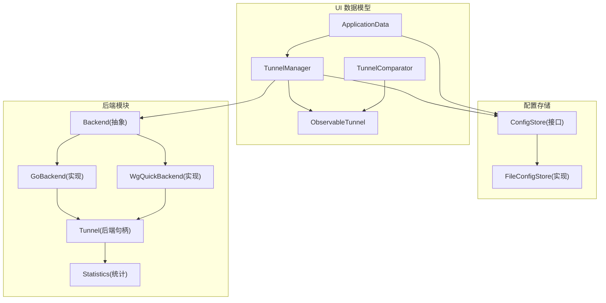
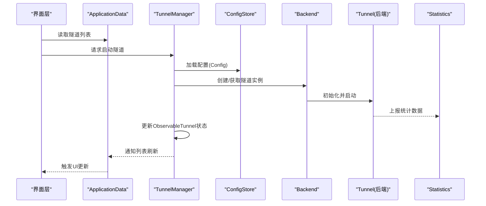
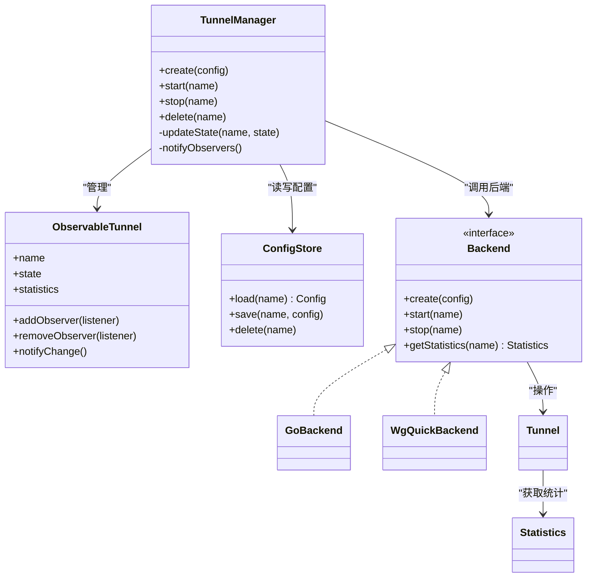
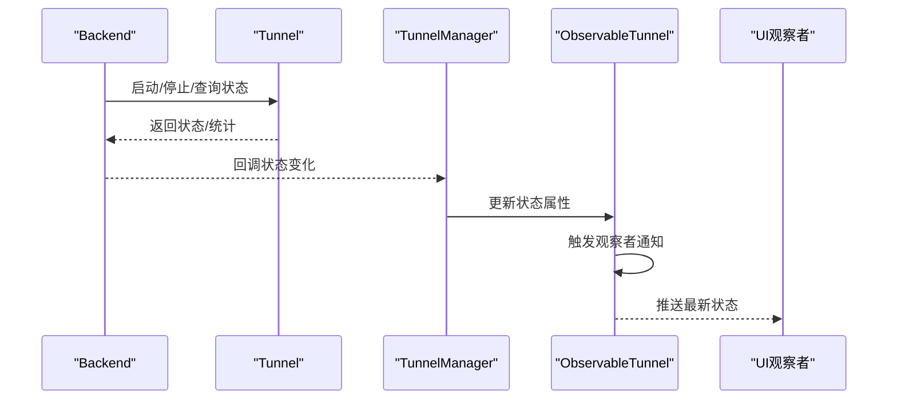
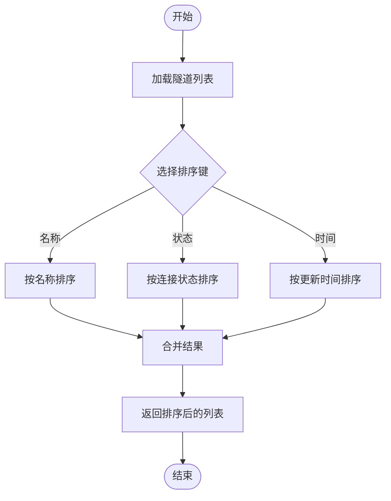
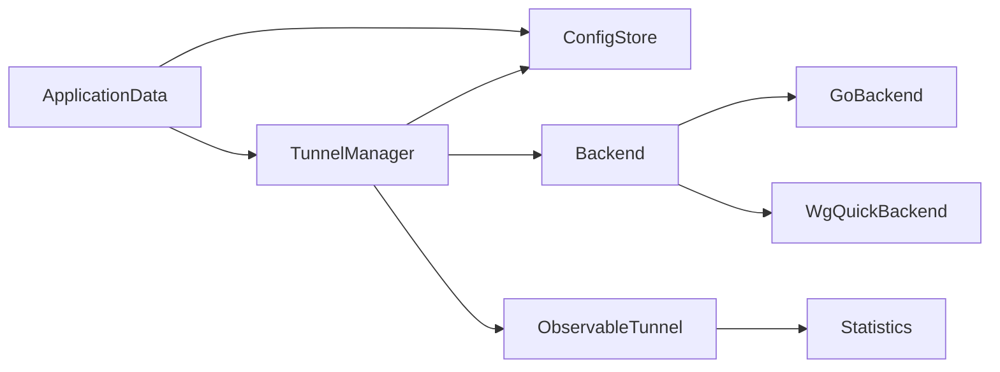

# 数据模型层

<cite>
**本文引用的文件**   
- [TunnelManager.kt](file://ui/src/main/java/com/wireguard/android/model/TunnelManager.kt)
- [ObservableTunnel.kt](file://ui/src/main/java/com/wireguard/android/model/ObservableTunnel.kt)
- [ApplicationData.kt](file://ui/src/main/java/com/wireguard/android/model/ApplicationData.kt)
- [TunnelComparator.kt](file://ui/src/main/java/com/wireguard/android/model/TunnelComparator.kt)
- [ConfigStore.kt](file://ui/src/main/java/com/wireguard/android/configStore/ConfigStore.kt)
- [FileConfigStore.kt](file://ui/src/main/java/com/wireguard/android/configStore/FileConfigStore.kt)
- [Backend.java](file://tunnel/src/main/java/com/wireguard/android/backend/Backend.java)
- [GoBackend.java](file://tunnel/src/main/java/com/wireguard/android/backend/GoBackend.java)
- [WgQuickBackend.java](file://tunnel/src/main/java/com/wireguard/android/backend/WgQuickBackend.java)
- [Tunnel.java](file://tunnel/src/main/java/com/wireguard/android/backend/Tunnel.java)
- [Statistics.java](file://tunnel/src/main/java/com/wireguard/android/backend/Statistics.java)
- [Config.java](file://tunnel/src/main/java/com/wireguard/config/Config.java)
</cite>

## 目录
1. [简介](#简介)
2. [项目结构](#项目结构)
3. [核心组件](#核心组件)
4. [架构总览](#架构总览)
5. [详细组件分析](#详细组件分析)
6. [依赖关系分析](#依赖关系分析)
7. [性能考虑](#性能考虑)
8. [故障排查指南](#故障排查指南)
9. [结论](#结论)
10. [附录：使用示例与最佳实践](#附录使用示例与最佳实践)

## 简介
本技术文档聚焦于 WireGuard Android 的数据模型层，围绕以下目标展开：
- 深入解释 TunnelManager 的隧道生命周期管理（创建、启动、停止、删除）。
- 详细说明 ObservableTunnel 的可观察隧道状态，包括连接状态监控与实时更新。
- 记录 ApplicationData 的全局应用数据存储与状态管理。
- 解释 TunnelComparator 的排序逻辑与自定义比较器实现。
- 说明数据模型的线程安全与并发访问控制。
- 阐述数据持久化策略与缓存机制。
- 提供具体使用示例与最佳实践。
- 解释与后端模块的数据同步机制。

## 项目结构
数据模型层主要位于 ui 模块的 model 包中，并与 configStore 和 tunnel 后端模块交互：
- model: 包含 TunnelManager、ObservableTunnel、ApplicationData、TunnelComparator 等核心数据模型与控制器。
- configStore: 负责配置的持久化存储接口与文件实现。
- tunnel: 封装底层 Go 实现的隧道能力，提供 Backend、Tunnel、Statistics 等类型。

图表来源
- [TunnelManager.kt](file://ui/src/main/java/com/wireguard/android/model/TunnelManager.kt)
- [ObservableTunnel.kt](file://ui/src/main/java/com/wireguard/android/model/ObservableTunnel.kt)
- [ApplicationData.kt](file://ui/src/main/java/com/wireguard/android/model/ApplicationData.kt)
- [TunnelComparator.kt](file://ui/src/main/java/com/wireguard/android/model/TunnelComparator.kt)
- [ConfigStore.kt](file://ui/src/main/java/com/wireguard/android/configStore/ConfigStore.kt)
- [FileConfigStore.kt](file://ui/src/main/java/com/wireguard/android/configStore/FileConfigStore.kt)
- [Backend.java](file://tunnel/src/main/java/com/wireguard/android/backend/Backend.java)
- [GoBackend.java](file://tunnel/src/main/java/com/wireguard/android/backend/GoBackend.java)
- [WgQuickBackend.java](file://tunnel/src/main/java/com/wireguard/android/backend/WgQuickBackend.java)
- [Tunnel.java](file://tunnel/src/main/java/com/wireguard/android/backend/Tunnel.java)
- [Statistics.java](file://tunnel/src/main/java/com/wireguard/android/backend/Statistics.java)

章节来源
- [TunnelManager.kt](file://ui/src/main/java/com/wireguard/android/model/TunnelManager.kt)
- [ObservableTunnel.kt](file://ui/src/main/java/com/wireguard/android/model/ObservableTunnel.kt)
- [ApplicationData.kt](file://ui/src/main/java/com/wireguard/android/model/ApplicationData.kt)
- [TunnelComparator.kt](file://ui/src/main/java/com/wireguard/android/model/TunnelComparator.kt)
- [ConfigStore.kt](file://ui/src/main/java/com/wireguard/android/configStore/ConfigStore.kt)
- [FileConfigStore.kt](file://ui/src/main/java/com/wireguard/android/configStore/FileConfigStore.kt)
- [Backend.java](file://tunnel/src/main/java/com/wireguard/android/backend/Backend.java)
- [GoBackend.java](file://tunnel/src/main/java/com/wireguard/android/backend/GoBackend.java)
- [WgQuickBackend.java](file://tunnel/src/main/java/com/wireguard/android/backend/WgQuickBackend.java)
- [Tunnel.java](file://tunnel/src/main/java/com/wireguard/android/backend/Tunnel.java)
- [Statistics.java](file://tunnel/src/main/java/com/wireguard/android/backend/Statistics.java)

## 核心组件
- TunnelManager：集中管理隧道的生命周期（创建、启动、停止、删除），协调 UI 状态与后端操作，维护可观察隧道集合。
- ObservableTunnel：封装单个隧道的可观察状态（如连接状态、统计数据），支持观察者模式进行实时更新。
- ApplicationData：全局应用数据容器，持有隧道列表、当前选中项、应用级设置等，供多模块共享。
- TunnelComparator：定义隧道排序规则（例如按名称、状态、时间等），用于列表展示与筛选。

章节来源
- [TunnelManager.kt](file://ui/src/main/java/com/wireguard/android/model/TunnelManager.kt)
- [ObservableTunnel.kt](file://ui/src/main/java/com/wireguard/android/model/ObservableTunnel.kt)
- [ApplicationData.kt](file://ui/src/main/java/com/wireguard/android/model/ApplicationData.kt)
- [TunnelComparator.kt](file://ui/src/main/java/com/wireguard/android/model/TunnelComparator.kt)

## 架构总览
数据模型层通过分层设计将 UI 状态、持久化与后端能力解耦：
- UI 层通过 ApplicationData 获取隧道列表与状态。
- TunnelManager 作为控制器，调用 ConfigStore 读写配置，调用 Backend 执行隧道操作。
- Backend 抽象了不同后端实现（GoBackend、WgQuickBackend），统一暴露隧道启停与统计接口。
- ObservableTunnel 在状态变化时通知观察者，驱动 UI 更新。

图表来源
- [TunnelManager.kt](file://ui/src/main/java/com/wireguard/android/model/TunnelManager.kt)
- [ObservableTunnel.kt](file://ui/src/main/java/com/wireguard/android/model/ObservableTunnel.kt)
- [ApplicationData.kt](file://ui/src/main/java/com/wireguard/android/model/ApplicationData.kt)
- [ConfigStore.kt](file://ui/src/main/java/com/wireguard/android/configStore/ConfigStore.kt)
- [Backend.java](file://tunnel/src/main/java/com/wireguard/android/backend/Backend.java)
- [Tunnel.java](file://tunnel/src/main/java/com/wireguard/android/backend/Tunnel.java)
- [Statistics.java](file://tunnel/src/main/java/com/wireguard/android/backend/Statistics.java)

## 详细组件分析

### TunnelManager：隧道生命周期管理
职责与流程
- 创建：根据配置文件生成隧道实例，注册到管理器并建立可观察对象。
- 启动：调用后端启动隧道，监听状态变化并更新 ObservableTunnel。
- 停止：调用后端停止隧道，清理资源并更新状态。
- 删除：从持久化存储移除配置，销毁隧道实例，清理可观察对象。

并发与线程安全
- 对隧道集合的操作需保证线程安全，避免并发修改导致的异常。
- 状态更新应在统一的调度器或锁保护下进行，确保观察者收到的状态一致。

错误处理
- 对后端操作的失败进行捕获与重试（必要时），并向 UI 反馈错误信息。
- 对无效配置进行校验与提示。

章节来源
- [TunnelManager.kt](file://ui/src/main/java/com/wireguard/android/model/TunnelManager.kt)
- [Backend.java](file://tunnel/src/main/java/com/wireguard/android/backend/Backend.java)
- [GoBackend.java](file://tunnel/src/main/java/com/wireguard/android/backend/GoBackend.java)
- [WgQuickBackend.java](file://tunnel/src/main/java/com/wireguard/android/backend/WgQuickBackend.java)
- [Tunnel.java](file://tunnel/src/main/java/com/wireguard/android/backend/Tunnel.java)

#### 类图（TunnelManager 相关）

图表来源
- [TunnelManager.kt](file://ui/src/main/java/com/wireguard/android/model/TunnelManager.kt)
- [ObservableTunnel.kt](file://ui/src/main/java/com/wireguard/android/model/ObservableTunnel.kt)
- [ConfigStore.kt](file://ui/src/main/java/com/wireguard/android/configStore/ConfigStore.kt)
- [Backend.java](file://tunnel/src/main/java/com/wireguard/android/backend/Backend.java)
- [GoBackend.java](file://tunnel/src/main/java/com/wireguard/android/backend/GoBackend.java)
- [WgQuickBackend.java](file://tunnel/src/main/java/com/wireguard/android/backend/WgQuickBackend.java)
- [Tunnel.java](file://tunnel/src/main/java/com/wireguard/android/backend/Tunnel.java)
- [Statistics.java](file://tunnel/src/main/java/com/wireguard/android/backend/Statistics.java)

### ObservableTunnel：可观察隧道状态
功能要点
- 封装隧道名称、连接状态、统计数据等属性。
- 提供观察者注册与通知机制，当状态变化时自动推送更新。
- 与 TunnelManager 协作，确保状态变更的原子性与一致性。

状态监控与实时更新
- 连接状态变化（如已连接、断开、错误）由后端回调或轮询触发。
- 统计数据（上传/下载字节数、延迟等）周期性更新并通知观察者。

章节来源
- [ObservableTunnel.kt](file://ui/src/main/java/com/wireguard/android/model/ObservableTunnel.kt)
- [Statistics.java](file://tunnel/src/main/java/com/wireguard/android/backend/Statistics.java)

#### 序列图（状态更新流程）

图表来源
- [Backend.java](file://tunnel/src/main/java/com/wireguard/android/backend/Backend.java)
- [Tunnel.java](file://tunnel/src/main/java/com/wireguard/android/backend/Tunnel.java)
- [TunnelManager.kt](file://ui/src/main/java/com/wireguard/android/model/TunnelManager.kt)
- [ObservableTunnel.kt](file://ui/src/main/java/com/wireguard/android/model/ObservableTunnel.kt)

### ApplicationData：全局应用数据存储与状态管理
职责
- 持有隧道列表、当前选中的隧道、应用级设置（如主题、语言、权限开关）。
- 提供线程安全的存取方法，确保多模块共享时的数据一致性。
- 与 ConfigStore 协同，实现数据的持久化与恢复。

并发控制
- 使用同步块或不可变数据结构保证读写的原子性。
- 对外暴露只读视图，防止外部直接修改内部状态。

章节来源
- [ApplicationData.kt](file://ui/src/main/java/com/wireguard/android/model/ApplicationData.kt)
- [ConfigStore.kt](file://ui/src/main/java/com/wireguard/android/configStore/ConfigStore.kt)

### TunnelComparator：排序逻辑与自定义比较器
排序规则
- 默认按隧道名称字母序排序。
- 可选按连接状态优先（已连接的在前）、最后更新时间等维度排序。
- 支持组合排序键，便于灵活展示。

实现要点
- 实现比较接口，确保稳定排序与空值处理。
- 与 UI 列表适配器集成，动态切换排序策略。

章节来源
- [TunnelComparator.kt](file://ui/src/main/java/com/wireguard/android/model/TunnelComparator.kt)

#### 流程图（排序算法）

图表来源
- [TunnelComparator.kt](file://ui/src/main/java/com/wireguard/android/model/TunnelComparator.kt)

## 依赖关系分析
- TunnelManager 依赖 ConfigStore 与 Backend，完成配置的读写与隧道操作。
- ObservableTunnel 依赖 Statistics，用于展示实时数据。
- ApplicationData 依赖所有模型组件，作为全局状态中心。
- Backend 抽象了 GoBackend 与 WgQuickBackend，屏蔽底层差异。

图表来源
- [TunnelManager.kt](file://ui/src/main/java/com/wireguard/android/model/TunnelManager.kt)
- [ObservableTunnel.kt](file://ui/src/main/java/com/wireguard/android/model/ObservableTunnel.kt)
- [ApplicationData.kt](file://ui/src/main/java/com/wireguard/android/model/ApplicationData.kt)
- [ConfigStore.kt](file://ui/src/main/java/com/wireguard/android/configStore/ConfigStore.kt)
- [Backend.java](file://tunnel/src/main/java/com/wireguard/android/backend/Backend.java)
- [GoBackend.java](file://tunnel/src/main/java/com/wireguard/android/backend/GoBackend.java)
- [WgQuickBackend.java](file://tunnel/src/main/java/com/wireguard/android/backend/WgQuickBackend.java)

章节来源
- [TunnelManager.kt](file://ui/src/main/java/com/wireguard/android/model/TunnelManager.kt)
- [ObservableTunnel.kt](file://ui/src/main/java/com/wireguard/android/model/ObservableTunnel.kt)
- [ApplicationData.kt](file://ui/src/main/java/com/wireguard/android/model/ApplicationData.kt)
- [ConfigStore.kt](file://ui/src/main/java/com/wireguard/android/configStore/ConfigStore.kt)
- [Backend.java](file://tunnel/src/main/java/com/wireguard/android/backend/Backend.java)
- [GoBackend.java](file://tunnel/src/main/java/com/wireguard/android/backend/GoBackend.java)
- [WgQuickBackend.java](file://tunnel/src/main/java/com/wireguard/android/backend/WgQuickBackend.java)

## 性能考虑
- 减少不必要的状态更新：仅在状态真正变化时通知观察者，避免频繁 UI 重绘。
- 批量操作：在创建/删除多个隧道时，采用批量提交与合并更新。
- 异步处理：后端操作应异步执行，避免阻塞主线程。
- 内存管理：及时释放不再使用的隧道实例与观察者引用，防止内存泄漏。

[本节为通用指导，不直接分析具体文件]

## 故障排查指南
常见问题与定位
- 隧道无法启动：检查配置文件合法性、后端初始化是否成功、权限是否授予。
- 状态不同步：确认观察者是否正确注册，状态更新是否在正确线程触发。
- 数据丢失：验证 ConfigStore 的读写路径与权限，确保持久化成功。

调试建议
- 增加日志输出，记录关键步骤的状态与异常。
- 使用单元测试覆盖生命周期操作与排序逻辑。
- 模拟后端失败场景，验证错误处理与恢复机制。

章节来源
- [TunnelManager.kt](file://ui/src/main/java/com/wireguard/android/model/TunnelManager.kt)
- [ConfigStore.kt](file://ui/src/main/java/com/wireguard/android/configStore/ConfigStore.kt)
- [Backend.java](file://tunnel/src/main/java/com/wireguard/android/backend/Backend.java)

## 结论
数据模型层通过清晰的职责划分与解耦设计，实现了隧道生命周期的可靠管理、可观察状态的实时更新以及全局状态的统一管理。结合线程安全与持久化策略，确保了系统的稳定性与可扩展性。在实际使用中，遵循最佳实践可有效提升用户体验与系统性能。

[本节为总结，不直接分析具体文件]

## 附录：使用示例与最佳实践
- 创建隧道：通过 TunnelManager.create 传入有效配置，成功后加入 ApplicationData 列表。
- 启动/停止：调用 TunnelManager.start/stop，监听 ObservableTunnel 状态变化以更新 UI。
- 删除隧道：先停止再删除配置，确保资源释放与数据一致性。
- 排序展示：根据用户偏好切换 TunnelComparator 的排序键。
- 线程安全：所有状态更新应在主线程或统一调度器中进行，避免竞态条件。
- 持久化：使用 ConfigStore 保存配置，并在应用启动时恢复状态。
- 后端同步：通过 Backend 抽象与具体实现对接，确保跨平台兼容性。

章节来源
- [TunnelManager.kt](file://ui/src/main/java/com/wireguard/android/model/TunnelManager.kt)
- [ObservableTunnel.kt](file://ui/src/main/java/com/wireguard/android/model/ObservableTunnel.kt)
- [ApplicationData.kt](file://ui/src/main/java/com/wireguard/android/model/ApplicationData.kt)
- [TunnelComparator.kt](file://ui/src/main/java/com/wireguard/android/model/TunnelComparator.kt)
- [ConfigStore.kt](file://ui/src/main/java/com/wireguard/android/configStore/ConfigStore.kt)
- [Backend.java](file://tunnel/src/main/java/com/wireguard/android/backend/Backend.java)