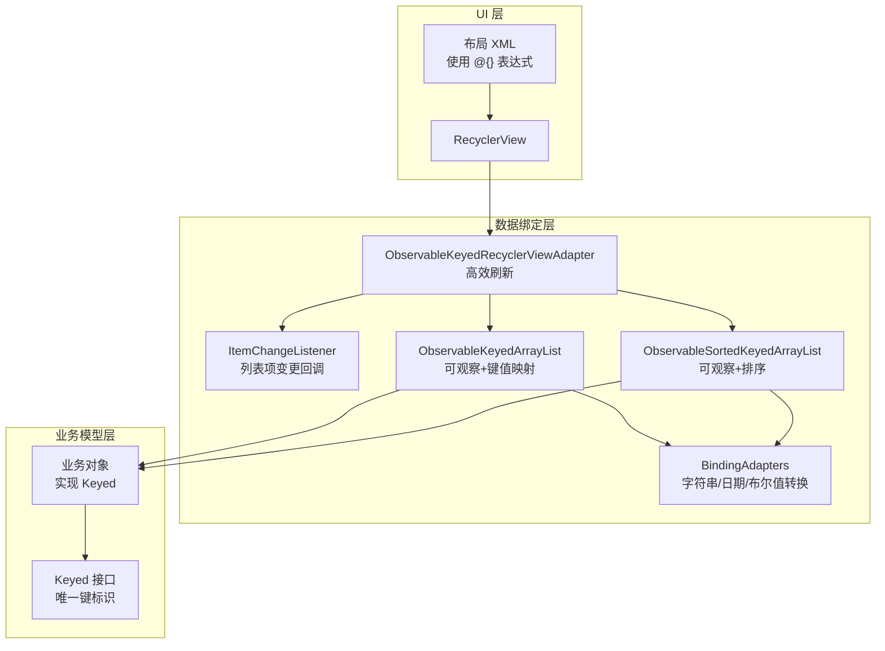
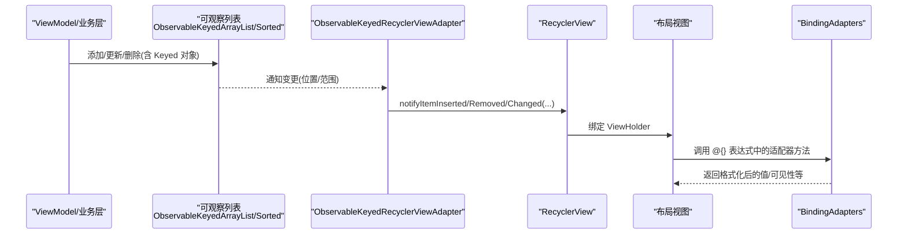
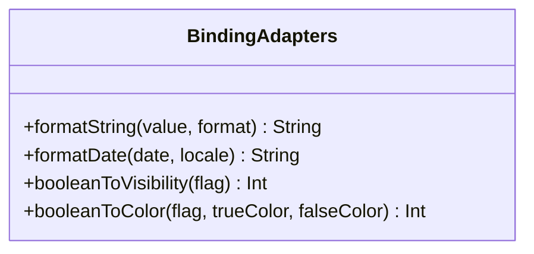
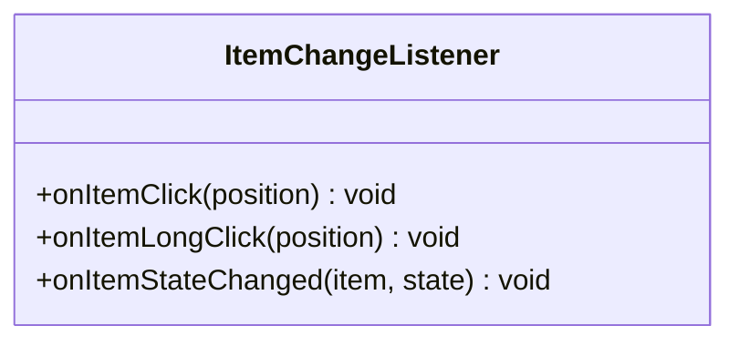
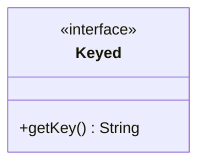
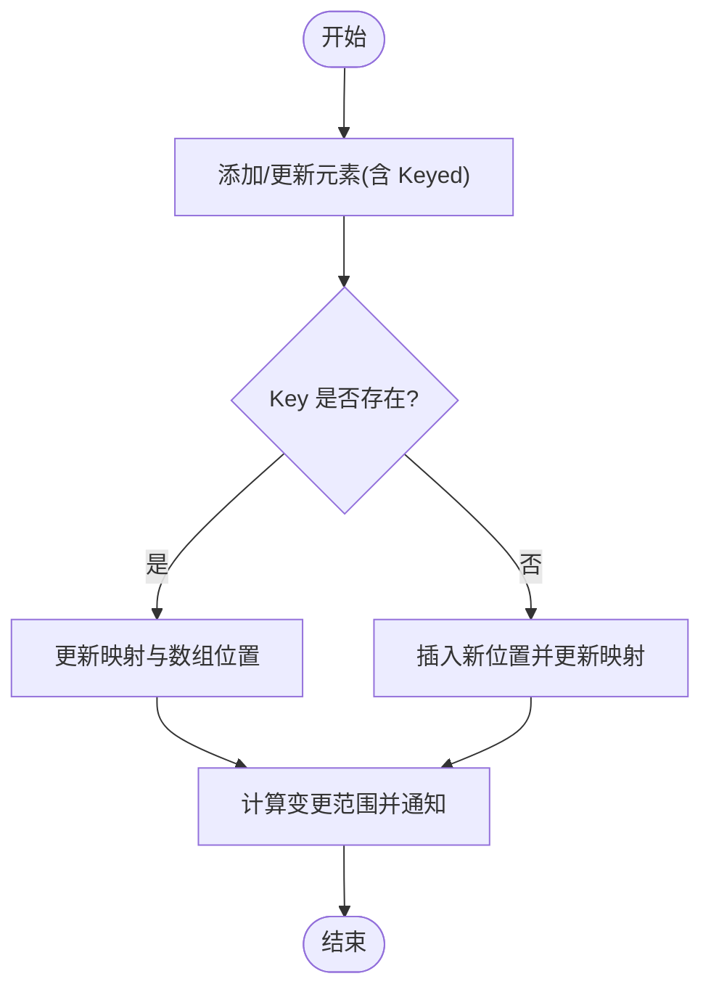
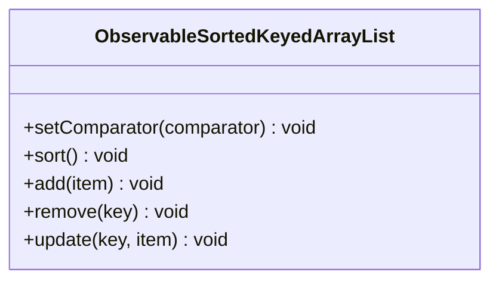
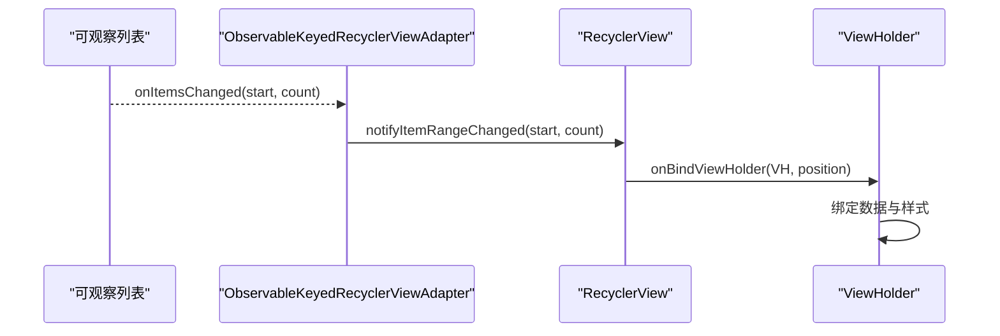
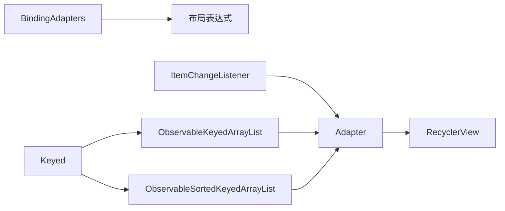

# 数据绑定系统

<cite>
**本文引用的文件**   
- [BindingAdapters.kt](file://ui/src/main/java/com/wireguard/android/databinding/BindingAdapters.kt)
- [ItemChangeListener.kt](file://ui/src/main/java/com/wireguard/android/databinding/ItemChangeListener.kt)
- [Keyed.kt](file://ui/src/main/java/com/wireguard/android/databinding/Keyed.kt)
- [ObservableKeyedArrayList.kt](file://ui/src/main/java/com/wireguard/android/databinding/ObservableKeyedArrayList.kt)
- [ObservableSortedKeyedArrayList.kt](file://ui/src/main/java/com/wireguard/android/databinding/ObservableSortedKeyedArrayList.kt)
- [ObservableKeyedRecyclerViewAdapter.kt](file://ui/src/main/java/com/wireguard/android/databinding/ObservableKeyedRecyclerViewAdapter.kt)
</cite>

## 目录
1. [简介](#简介)
2. [项目结构](#项目结构)
3. [核心组件](#核心组件)
4. [架构总览](#架构总览)
5. [详细组件分析](#详细组件分析)
6. [依赖关系分析](#依赖关系分析)
7. [性能考虑](#性能考虑)
8. [故障排查指南](#故障排查指南)
9. [结论](#结论)
10. [附录](#附录)

## 简介
本技术文档聚焦 WireGuard Android 项目中的数据绑定子系统，重点覆盖以下方面：
- BindingAdapters 自定义适配器：字符串格式化、日期处理、布尔值转换等。
- ItemChangeListener 的列表项变更监听机制。
- ObservableKeyedArrayList 的可观察列表实现（键值映射与自动刷新）。
- ObservableSortedKeyedArrayList 的排序列表功能。
- Keyed 接口的作用与键值管理机制。
- 数据绑定的性能优化策略与内存管理。
- 绑定表达式示例与调试技巧。
- 与 RecyclerView 的高效集成与渲染。

## 项目结构
数据绑定相关代码集中在 ui 模块的 databinding 包中，包含适配器、可观察集合、RecyclerView 适配器等关键类。整体采用“数据驱动 + 可观察集合”的模式，结合 DataBinding 在布局层进行声明式绑定。

图表来源
- [BindingAdapters.kt](file://ui/src/main/java/com/wireguard/android/databinding/BindingAdapters.kt)
- [ItemChangeListener.kt](file://ui/src/main/java/com/wireguard/android/databinding/ItemChangeListener.kt)
- [Keyed.kt](file://ui/src/main/java/com/wireguard/android/databinding/Keyed.kt)
- [ObservableKeyedArrayList.kt](file://ui/src/main/java/com/wireguard/android/databinding/ObservableKeyedArrayList.kt)
- [ObservableSortedKeyedArrayList.kt](file://ui/src/main/java/com/wireguard/android/databinding/ObservableSortedKeyedArrayList.kt)
- [ObservableKeyedRecyclerViewAdapter.kt](file://ui/src/main/java/com/wireguard/android/databinding/ObservableKeyedRecyclerViewAdapter.kt)

章节来源
- [BindingAdapters.kt](file://ui/src/main/java/com/wireguard/android/databinding/BindingAdapters.kt)
- [ItemChangeListener.kt](file://ui/src/main/java/com/wireguard/android/databinding/ItemChangeListener.kt)
- [Keyed.kt](file://ui/src/main/java/com/wireguard/android/databinding/Keyed.kt)
- [ObservableKeyedArrayList.kt](file://ui/src/main/java/com/wireguard/android/databinding/ObservableKeyedArrayList.kt)
- [ObservableSortedKeyedArrayList.kt](file://ui/src/main/java/com/wireguard/android/databinding/ObservableSortedKeyedArrayList.kt)
- [ObservableKeyedRecyclerViewAdapter.kt](file://ui/src/main/java/com/wireguard/android/databinding/ObservableKeyedRecyclerViewAdapter.kt)

## 核心组件
- BindingAdapters：为 DataBinding 提供自定义属性转换器，涵盖字符串格式化、日期显示、布尔值到可见性/颜色等的转换。
- ItemChangeListener：定义列表项点击或状态变更的统一回调接口，便于在 Adapter 中解耦交互逻辑。
- Keyed：为业务对象提供稳定唯一的键（key），用于列表去重、定位与高效刷新。
- ObservableKeyedArrayList：基于 Keyed 的可观察列表，支持增删改时按 key 精准通知 UI 刷新。
- ObservableSortedKeyedArrayList：在可观察基础上增加排序能力，适用于需要动态排序的列表场景。
- ObservableKeyedRecyclerViewAdapter：将上述可观察集合与 RecyclerView 高效联动，减少不必要的刷新范围。

章节来源
- [BindingAdapters.kt](file://ui/src/main/java/com/wireguard/android/databinding/BindingAdapters.kt)
- [ItemChangeListener.kt](file://ui/src/main/java/com/wireguard/android/databinding/ItemChangeListener.kt)
- [Keyed.kt](file://ui/src/main/java/com/wireguard/android/databinding/Keyed.kt)
- [ObservableKeyedArrayList.kt](file://ui/src/main/java/com/wireguard/android/databinding/ObservableKeyedArrayList.kt)
- [ObservableSortedKeyedArrayList.kt](file://ui/src/main/java/com/wireguard/android/databinding/ObservableSortedKeyedArrayList.kt)
- [ObservableKeyedRecyclerViewAdapter.kt](file://ui/src/main/java/com/wireguard/android/databinding/ObservableKeyedRecyclerViewAdapter.kt)

## 架构总览
数据从业务模型（实现 Keyed）进入可观察集合（ObservableKeyedArrayList / ObservableSortedKeyedArrayList），再由 ObservableKeyedRecyclerViewAdapter 订阅变化并触发 RecyclerView 的局部刷新；同时，BindingAdapters 在布局层对数据进行格式化和类型转换，保证 UI 展示一致性与可读性。

图表来源
- [ObservableKeyedArrayList.kt](file://ui/src/main/java/com/wireguard/android/databinding/ObservableKeyedArrayList.kt)
- [ObservableSortedKeyedArrayList.kt](file://ui/src/main/java/com/wireguard/android/databinding/ObservableSortedKeyedArrayList.kt)
- [ObservableKeyedRecyclerViewAdapter.kt](file://ui/src/main/java/com/wireguard/android/databinding/ObservableKeyedRecyclerViewAdapter.kt)
- [BindingAdapters.kt](file://ui/src/main/java/com/wireguard/android/databinding/BindingAdapters.kt)

## 详细组件分析

### BindingAdapters：自定义数据绑定适配器
- 字符串格式化：提供统一的时间、数量、状态等文本格式化方法，避免在布局或 ViewModel 中重复实现。
- 日期处理：封装日期到本地化字符串的转换，支持可选的格式与区域设置。
- 布尔值转换：将布尔值映射为可见性、颜色、图标等资源，简化布局表达式。
- 扩展点：通过 @BindingAdapter 注解暴露给布局使用，保持声明式绑定简洁。

图表来源
- [BindingAdapters.kt](file://ui/src/main/java/com/wireguard/android/databinding/BindingAdapters.kt)

章节来源
- [BindingAdapters.kt](file://ui/src/main/java/com/wireguard/android/databinding/BindingAdapters.kt)

### ItemChangeListener：列表项变更监听
- 职责：定义统一的列表项交互回调（如点击、长按、状态切换），由 Adapter 转发至上层处理。
- 设计优势：将 UI 事件与业务逻辑解耦，便于测试与复用。
- 典型用法：在 Adapter 中持有该监听器实例，并在 ViewHolder 的事件回调中调用。

图表来源
- [ItemChangeListener.kt](file://ui/src/main/java/com/wireguard/android/databinding/ItemChangeListener.kt)

章节来源
- [ItemChangeListener.kt](file://ui/src/main/java/com/wireguard/android/databinding/ItemChangeListener.kt)

### Keyed：键值管理与唯一标识
- 作用：为每个业务对象提供稳定的唯一键（key），用于列表去重、快速定位与精确刷新。
- 要求：key 需满足稳定性与唯一性，避免频繁变化导致刷新异常。
- 常见实现：UUID、组合字段（如 name+id）、哈希值等。

图表来源
- [Keyed.kt](file://ui/src/main/java/com/wireguard/android/databinding/Keyed.kt)

章节来源
- [Keyed.kt](file://ui/src/main/java/com/wireguard/android/databinding/Keyed.kt)

### ObservableKeyedArrayList：可观察列表与自动刷新
- 特性：
  - 维护一个以 key 为索引的映射表，支持 O(1) 查找与更新。
  - 对外暴露 add/remove/update 等方法，内部根据 key 计算变更范围并通知观察者。
  - 与 RecyclerView.Adapter 配合，仅刷新受影响项，提升性能。
- 数据结构：
  - 顺序数组：保持插入顺序，便于遍历与渲染。
  - 键值映射：key -> index，加速定位与去重。
- 复杂度：
  - 查找/更新：O(1)
  - 插入/删除：O(n)（数组移动），但可通过批量操作与最小化变更降低开销。

图表来源
- [ObservableKeyedArrayList.kt](file://ui/src/main/java/com/wireguard/android/databinding/ObservableKeyedArrayList.kt)

章节来源
- [ObservableKeyedArrayList.kt](file://ui/src/main/java/com/wireguard/android/databinding/ObservableKeyedArrayList.kt)

### ObservableSortedKeyedArrayList：排序列表功能
- 特性：
  - 在可观察基础上引入 Comparator，支持动态排序。
  - 排序后重新计算 key 映射与索引，确保刷新准确。
  - 适合需要按名称、时间、状态等维度排序的列表。
- 注意事项：
  - 排序比较器应稳定且无副作用。
  - 频繁排序建议合并多次变更，减少重排次数。

图表来源
- [ObservableSortedKeyedArrayList.kt](file://ui/src/main/java/com/wireguard/android/databinding/ObservableSortedKeyedArrayList.kt)

章节来源
- [ObservableSortedKeyedArrayList.kt](file://ui/src/main/java/com/wireguard/android/databinding/ObservableSortedKeyedArrayList.kt)

### ObservableKeyedRecyclerViewAdapter：与 RecyclerView 的高效集成
- 职责：
  - 订阅可观察列表的变更事件，转换为 RecyclerView 的局部刷新调用。
  - 利用 Keyed 映射，精确定位受影响项，避免全量刷新。
  - 提供统一的 ViewHolder 绑定入口，简化 Adapter 实现。
- 性能要点：
  - 使用 notifyItemRangeInserted/Removed/Changed 等细粒度 API。
  - 合并相邻变更，减少刷新批次。
  - 避免在 onBindViewHolder 中进行耗时计算。

图表来源
- [ObservableKeyedRecyclerViewAdapter.kt](file://ui/src/main/java/com/wireguard/android/databinding/ObservableKeyedRecyclerViewAdapter.kt)

章节来源
- [ObservableKeyedRecyclerViewAdapter.kt](file://ui/src/main/java/com/wireguard/android/databinding/ObservableKeyedRecyclerViewAdapter.kt)

## 依赖关系分析
- BindingAdapters 被布局层通过 @{} 表达式调用，属于纯函数型工具，无外部依赖。
- ItemChangeListener 作为回调接口，被 Adapter 持有并调用，解耦 UI 事件与业务逻辑。
- Keyed 是所有业务对象的契约，被可观察列表与 Adapter 共同依赖。
- ObservableKeyedArrayList 与 ObservableSortedKeyedArrayList 依赖 Keyed，并提供变更通知。
- ObservableKeyedRecyclerViewAdapter 依赖可观察列表与 RecyclerView，负责桥接数据与 UI。

图表来源
- [BindingAdapters.kt](file://ui/src/main/java/com/wireguard/android/databinding/BindingAdapters.kt)
- [ItemChangeListener.kt](file://ui/src/main/java/com/wireguard/android/databinding/ItemChangeListener.kt)
- [Keyed.kt](file://ui/src/main/java/com/wireguard/android/databinding/Keyed.kt)
- [ObservableKeyedArrayList.kt](file://ui/src/main/java/com/wireguard/android/databinding/ObservableKeyedArrayList.kt)
- [ObservableSortedKeyedArrayList.kt](file://ui/src/main/java/com/wireguard/android/databinding/ObservableSortedKeyedArrayList.kt)
- [ObservableKeyedRecyclerViewAdapter.kt](file://ui/src/main/java/com/wireguard/android/databinding/ObservableKeyedRecyclerViewAdapter.kt)

章节来源
- [BindingAdapters.kt](file://ui/src/main/java/com/wireguard/android/databinding/BindingAdapters.kt)
- [ItemChangeListener.kt](file://ui/src/main/java/com/wireguard/android/databinding/ItemChangeListener.kt)
- [Keyed.kt](file://ui/src/main/java/com/wireguard/android/databinding/Keyed.kt)
- [ObservableKeyedArrayList.kt](file://ui/src/main/java/com/wireguard/android/databinding/ObservableKeyedArrayList.kt)
- [ObservableSortedKeyedArrayList.kt](file://ui/src/main/java/com/wireguard/android/databinding/ObservableSortedKeyedArrayList.kt)
- [ObservableKeyedRecyclerViewAdapter.kt](file://ui/src/main/java/com/wireguard/android/databinding/ObservableKeyedRecyclerViewAdapter.kt)

## 性能考虑
- 局部刷新：优先使用 notifyItemRange* 系列 API，避免 notifyDataSetChanged。
- 键值映射：通过 Keyed 建立 O(1) 查找，减少线性扫描。
- 批量变更：合并多次 add/remove/update，降低重排与绘制次数。
- 排序优化：仅在必要时触发排序，避免频繁 re-sort。
- 内存管理：
  - 避免在 BindingAdapters 中创建大量临时对象。
  - 使用弱引用或生命周期感知组件避免内存泄漏。
  - 及时释放不再使用的监听器与资源。
- 布局表达式：
  - 尽量使用纯函数，避免副作用。
  - 缓存复杂计算结果，减少重复计算。

[本节为通用指导，不直接分析具体文件]

## 故障排查指南
- 列表未刷新：
  - 检查 Keyed 的 key 是否稳定且唯一。
  - 确认可观察列表是否正确触发变更通知。
  - 验证 Adapter 的 notifyItemRange* 调用参数是否正确。
- 绑定表达式报错：
  - 检查 BindingAdapters 的方法签名与参数类型是否与布局匹配。
  - 确保传入的数据不为 null，或在适配器中做空值保护。
- 性能问题：
  - 使用 Android Profiler 观察主线程卡顿。
  - 减少 onBindViewHolder 中的耗时操作。
  - 避免在高频回调中创建大对象。
- 调试技巧：
  - 在 BindingAdapters 中添加日志输出，确认输入输出。
  - 打印可观察列表的变更事件，定位问题阶段。
  - 使用 RecyclerView.ItemAnimator 调试动画与刷新。

章节来源
- [BindingAdapters.kt](file://ui/src/main/java/com/wireguard/android/databinding/BindingAdapters.kt)
- [ObservableKeyedArrayList.kt](file://ui/src/main/java/com/wireguard/android/databinding/ObservableKeyedArrayList.kt)
- [ObservableSortedKeyedArrayList.kt](file://ui/src/main/java/com/wireguard/android/databinding/ObservableSortedKeyedArrayList.kt)
- [ObservableKeyedRecyclerViewAdapter.kt](file://ui/src/main/java/com/wireguard/android/databinding/ObservableKeyedRecyclerViewAdapter.kt)

## 结论
本数据绑定系统通过 Keyed 契约、可观察集合与高效 Adapter 的组合，实现了声明式、高性能的 UI 更新机制。BindingAdapters 提供了统一的格式化与转换能力，ItemChangeListener 解耦了交互逻辑。在实际使用中，应重点关注键值的稳定性、变更批量化与局部刷新，以获得最佳性能与用户体验。

[本节为总结性内容，不直接分析具体文件]

## 附录
- 绑定表达式示例（路径参考）：
  - 字符串格式化：@{bindingAdapters.formatString(value, format)}
  - 日期显示：@{bindingAdapters.formatDate(date, locale)}
  - 布尔值可见性：@{bindingAdapters.booleanToVisibility(flag)}
  - 布尔值颜色：@{bindingAdapters.booleanToColor(flag, trueColor, falseColor)}
- 调试清单：
  - 确认 Keyed 的 key 唯一且稳定。
  - 验证 BindingAdapters 的参数类型与返回值。
  - 检查 RecyclerView 的 ItemAnimator 配置。
  - 使用 Log 输出关键路径的输入输出。

[本节为补充信息，不直接分析具体文件]