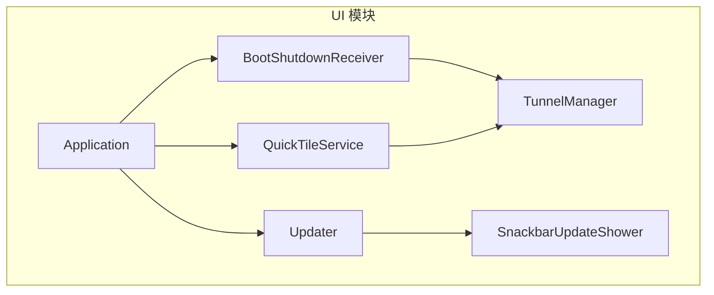
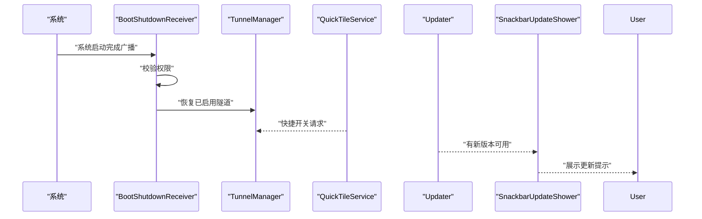
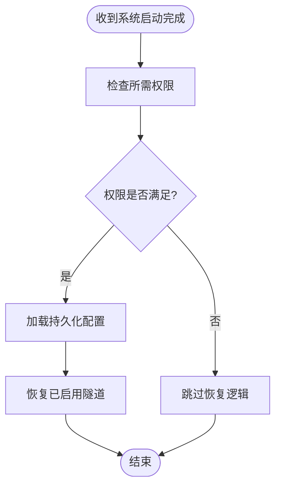
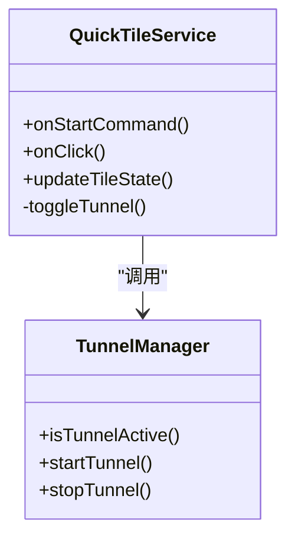
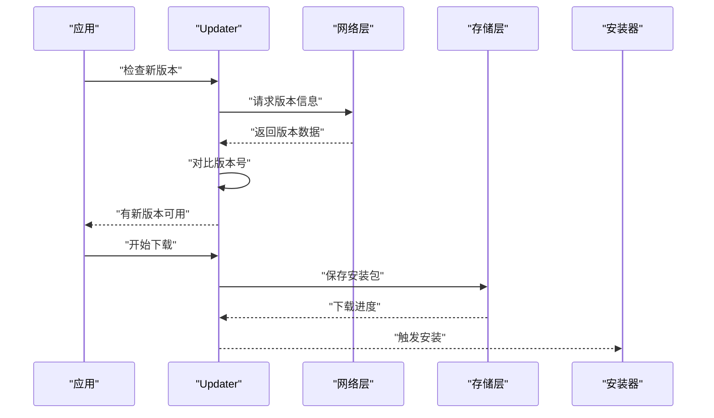
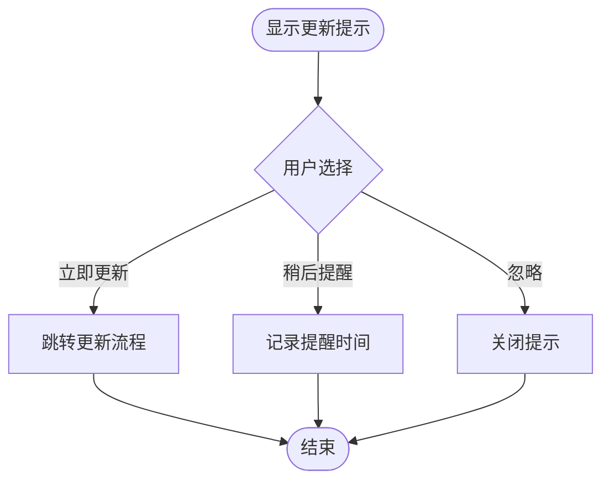
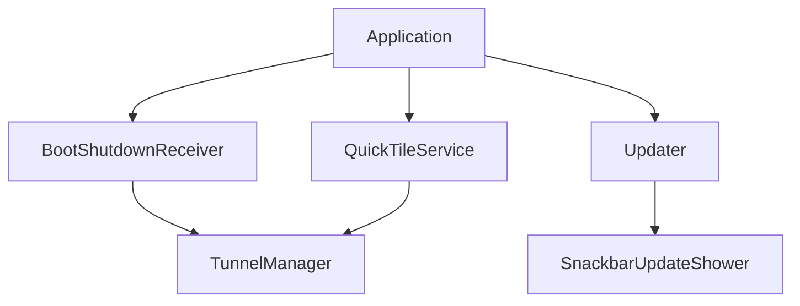

# 系统集成服务

<cite>
**本文引用的文件**   
- [BootShutdownReceiver.kt](file://ui/src/main/java/com/wireguard/android/BootShutdownReceiver.kt)
- [QuickTileService.kt](file://ui/src/main/java/com/wireguard/android/QuickTileService.kt)
- [Updater.kt](file://ui/src/main/java/com/wireguard/android/updater/Updater.kt)
- [SnackbarUpdateShower.kt](file://ui/src/main/java/com/wireguard/android/updater/SnackbarUpdateShower.kt)
- [AndroidManifest.xml](file://ui/src/main/AndroidManifest.xml)
- [Application.kt](file://ui/src/main/java/com/wireguard/android/Application.kt)
- [TunnelManager.kt](file://ui/src/main/java/com/wireguard/android/model/TunnelManager.kt)
- [Extensions.kt](file://ui/src/main/java/com/wireguard/android/util/Extensions.kt)
</cite>

## 目录
1. [简介](#简介)
2. [项目结构](#项目结构)
3. [核心组件](#核心组件)
4. [架构总览](#架构总览)
5. [详细组件分析](#详细组件分析)
6. [依赖关系分析](#依赖关系分析)
7. [性能考虑](#性能考虑)
8. [故障排查指南](#故障排查指南)
9. [结论](#结论)
10. [附录](#附录)

## 简介
本技术文档聚焦于 wireguard-android 的系统集成服务，围绕以下关键能力展开：
- 开机自启动与关机监听：通过广播接收器在系统启动后恢复隧道状态。
- 快捷开关服务：提供 Android 12+ 的快捷面板入口，快速启停隧道。
- 应用更新机制：版本检查、下载管理与安装引导。
- 更新提示界面：以 Snackbar 形式展示更新信息并引导用户操作。
- 系统服务生命周期管理：确保后台任务与系统事件协调一致。
- 电池优化适配与后台限制：兼容不同 Android 版本的省电策略。
- 兼容性处理：针对 Android 各版本的差异进行适配。

## 项目结构
本项目采用多模块组织，UI 层包含系统集成相关的关键类：
- BootShutdownReceiver：系统广播接收器，负责开机自启动与关机监听。
- QuickTileService：快捷开关服务，对接系统快捷面板。
- Updater：应用更新管理器，负责版本检查与下载流程。
- SnackbarUpdateShower：更新提示 UI，使用 Snackbar 展示更新信息。
- Application：应用初始化入口，集中注册全局逻辑。
- TunnelManager：隧道状态管理，供其他组件查询与操作。
- Extensions：扩展工具方法，封装常用系统 API 调用。

**图表来源** 
- [BootShutdownReceiver.kt](file://ui/src/main/java/com/wireguard/android/BootShutdownReceiver.kt)
- [QuickTileService.kt](file://ui/src/main/java/com/wireguard/android/QuickTileService.kt)
- [Updater.kt](file://ui/src/main/java/com/wireguard/android/updater/Updater.kt)
- [SnackbarUpdateShower.kt](file://ui/src/main/java/com/wireguard/android/updater/SnackbarUpdateShower.kt)
- [Application.kt](file://ui/src/main/java/com/wireguard/android/Application.kt)
- [TunnelManager.kt](file://ui/src/main/java/com/wireguard/android/model/TunnelManager.kt)

**章节来源**
- [AndroidManifest.xml](file://ui/src/main/AndroidManifest.xml)
- [Application.kt](file://ui/src/main/java/com/wireguard/android/Application.kt)

## 核心组件
- BootShutdownReceiver：监听系统启动完成广播，校验权限后恢复已启用隧道；处理关机或重启事件，确保资源释放。
- QuickTileService：实现快捷开关服务，支持 Android 12+ 的 Tile 接口，提供快速启停隧道的入口。
- Updater：定期检查新版本，触发下载任务，管理下载进度与失败重试，完成后引导安装。
- SnackbarUpdateShower：在合适时机弹出 Snackbar，展示更新信息并提供“立即更新”、“稍后提醒”等操作。

**章节来源**
- [BootShutdownReceiver.kt](file://ui/src/main/java/com/wireguard/android/BootShutdownReceiver.kt)
- [QuickTileService.kt](file://ui/src/main/java/com/wireguard/android/QuickTileService.kt)
- [Updater.kt](file://ui/src/main/java/com/wireguard/android/updater/Updater.kt)
- [SnackbarUpdateShower.kt](file://ui/src/main/java/com/wireguard/android/updater/SnackbarUpdateShower.kt)

## 架构总览
系统集成服务的整体交互如下：
- 系统广播触发 BootShutdownReceiver，进而调用 TunnelManager 恢复隧道。
- 用户通过快捷面板触发 QuickTileService，直接控制隧道启停。
- Updater 在后台执行版本检查与下载，SnackbarUpdateShower 负责 UI 提示。
- Application 在进程启动时统一初始化这些组件，确保生命周期一致性。

**图表来源** 
- [BootShutdownReceiver.kt](file://ui/src/main/java/com/wireguard/android/BootShutdownReceiver.kt)
- [QuickTileService.kt](file://ui/src/main/java/com/wireguard/android/QuickTileService.kt)
- [Updater.kt](file://ui/src/main/java/com/wireguard/android/updater/Updater.kt)
- [SnackbarUpdateShower.kt](file://ui/src/main/java/com/wireguard/android/updater/SnackbarUpdateShower.kt)
- [TunnelManager.kt](file://ui/src/main/java/com/wireguard/android/model/TunnelManager.kt)

## 详细组件分析

### BootShutdownReceiver（开机自启动）
- 功能要点：
  - 注册系统启动完成广播，确保应用在设备重启后能自动恢复运行。
  - 权限校验：检查必要权限（如网络访问、前台服务等），未授权则跳过恢复逻辑。
  - 状态恢复：根据持久化配置重新启用之前处于活动状态的隧道。
  - 错误处理：捕获异常并记录日志，避免影响系统稳定性。
- 生命周期管理：
  - 在 Application 中动态注册广播接收器，避免清单静态注册的潜在问题。
  - 在进程退出或销毁时注销接收器，防止内存泄漏。
- 兼容性处理：
  - 针对不同 Android 版本的广播行为差异进行适配。
  - 对高版本系统的后台限制进行规避，例如使用前台服务提升优先级。

**图表来源** 
- [BootShutdownReceiver.kt](file://ui/src/main/java/com/wireguard/android/BootShutdownReceiver.kt)
- [TunnelManager.kt](file://ui/src/main/java/com/wireguard/android/model/TunnelManager.kt)

**章节来源**
- [BootShutdownReceiver.kt](file://ui/src/main/java/com/wireguard/android/BootShutdownReceiver.kt)
- [AndroidManifest.xml](file://ui/src/main/AndroidManifest.xml)

### QuickTileService（快捷开关服务）
- 功能要点：
  - 实现 Android 12+ 的 Tile 接口，提供系统级快捷开关。
  - 支持快速启停隧道，无需打开应用主界面。
  - 状态同步：根据当前隧道状态更新 Tile 图标与文本。
- 权限与限制：
  - 需要声明相应服务权限，并在清单中注册。
  - 处理系统对后台服务的限制，必要时引导用户开启白名单。
- 兼容性处理：
  - 对低版本系统进行降级处理，提供替代入口。
  - 适配不同厂商 ROM 的快捷面板差异。

**图表来源** 
- [QuickTileService.kt](file://ui/src/main/java/com/wireguard/android/QuickTileService.kt)
- [TunnelManager.kt](file://ui/src/main/java/com/wireguard/android/model/TunnelManager.kt)

**章节来源**
- [QuickTileService.kt](file://ui/src/main/java/com/wireguard/android/QuickTileService.kt)
- [AndroidManifest.xml](file://ui/src/main/AndroidManifest.xml)

### Updater（应用更新机制）
- 功能要点：
  - 版本检查：从指定源获取最新版本信息，与当前版本对比。
  - 下载管理：支持断点续传、进度回调、失败重试。
  - 安装引导：下载完成后引导用户跳转到安装页面。
- 错误处理：
  - 网络异常、存储不足等场景的友好提示。
  - 下载中断后的自动恢复机制。
- 兼容性处理：
  - 对不同 Android 版本的安装权限进行适配。
  - 处理 OEM 定制系统的安装限制。

**图表来源** 
- [Updater.kt](file://ui/src/main/java/com/wireguard/android/updater/Updater.kt)
- [SnackbarUpdateShower.kt](file://ui/src/main/java/com/wireguard/android/updater/SnackbarUpdateShower.kt)

**章节来源**
- [Updater.kt](file://ui/src/main/java/com/wireguard/android/updater/Updater.kt)

### SnackbarUpdateShower（更新提示界面）
- 功能要点：
  - 在合适的时机弹出 Snackbar，展示更新信息。
  - 提供“立即更新”、“稍后提醒”等操作按钮。
  - 支持自定义样式与动画效果。
- 用户体验：
  - 避免频繁打扰，合理控制显示频率。
  - 根据用户选择记录偏好，减少重复提示。
- 兼容性处理：
  - 适配不同屏幕尺寸与主题风格。
  - 处理 Fragment 与 Activity 的生命周期差异。

**图表来源** 
- [SnackbarUpdateShower.kt](file://ui/src/main/java/com/wireguard/android/updater/SnackbarUpdateShower.kt)

**章节来源**
- [SnackbarUpdateShower.kt](file://ui/src/main/java/com/wireguard/android/updater/SnackbarUpdateShower.kt)

## 依赖关系分析
系统集成服务之间的依赖关系如下：
- BootShutdownReceiver 依赖 TunnelManager 进行隧道状态管理。
- QuickTileService 同样依赖 TunnelManager 实现快捷开关功能。
- Updater 与 SnackbarUpdateShower 协作，前者负责逻辑，后者负责 UI。
- Application 作为统一入口，初始化并协调各组件。

**图表来源** 
- [Application.kt](file://ui/src/main/java/com/wireguard/android/Application.kt)
- [BootShutdownReceiver.kt](file://ui/src/main/java/com/wireguard/android/BootShutdownReceiver.kt)
- [QuickTileService.kt](file://ui/src/main/java/com/wireguard/android/QuickTileService.kt)
- [Updater.kt](file://ui/src/main/java/com/wireguard/android/updater/Updater.kt)
- [SnackbarUpdateShower.kt](file://ui/src/main/java/com/wireguard/android/updater/SnackbarUpdateShower.kt)
- [TunnelManager.kt](file://ui/src/main/java/com/wireguard/android/model/TunnelManager.kt)

**章节来源**
- [Application.kt](file://ui/src/main/java/com/wireguard/android/Application.kt)

## 性能考虑
- 广播接收器应轻量高效，避免在主线程执行耗时操作。
- 快捷开关服务需及时响应，但也要避免频繁唤醒 CPU。
- 更新下载应在后台线程执行，支持断点续传以减少流量消耗。
- UI 提示应避免阻塞主线程，合理使用异步回调。

[本节为通用指导，无需特定文件来源]

## 故障排查指南
- 开机自启动失败：
  - 检查系统权限是否授予。
  - 确认广播接收器是否正确注册。
  - 查看日志输出定位具体错误。
- 快捷开关无响应：
  - 验证服务是否在清单中正确声明。
  - 检查系统对后台服务的限制设置。
- 更新下载失败：
  - 确认网络连接正常。
  - 检查存储空间是否充足。
  - 查看下载任务的错误码与日志。

**章节来源**
- [Extensions.kt](file://ui/src/main/java/com/wireguard/android/util/Extensions.kt)

## 结论
wireguard-android 的系统集成服务通过广播接收器、快捷开关服务、更新管理器与提示界面等组件，实现了完整的系统级功能集成。各组件之间职责清晰、依赖明确，并通过统一的初始化入口进行管理。在实际部署中，需注意权限配置、系统限制适配与错误处理，以确保在不同 Android 版本上的稳定运行。

[本节为总结性内容，无需特定文件来源]

## 附录
- 电池优化适配：
  - 对于 Android 6.0+ 的 Doze 模式，建议使用前台服务提升优先级。
  - 对于 Android 8.0+ 的应用启动限制，避免在后台启动活动或服务。
- 后台运行限制：
  - 针对不同厂商 ROM 的特殊限制，提供用户引导说明。
  - 使用系统提供的白名单机制，提升应用保活能力。
- 兼容性处理：
  - 使用条件编译或运行时检测，针对不同版本提供差异化实现。
  - 充分测试各种 Android 版本，确保功能一致性。

[本节为通用指导，无需特定文件来源]