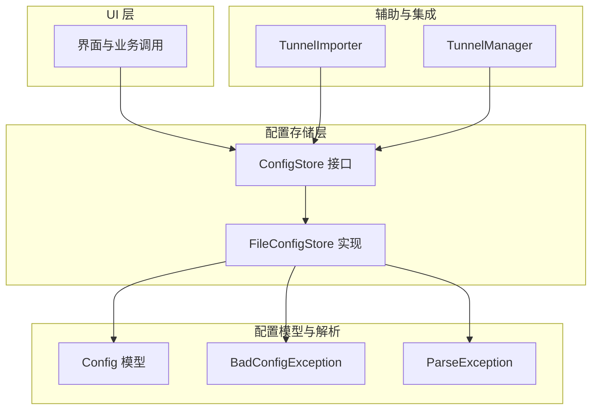
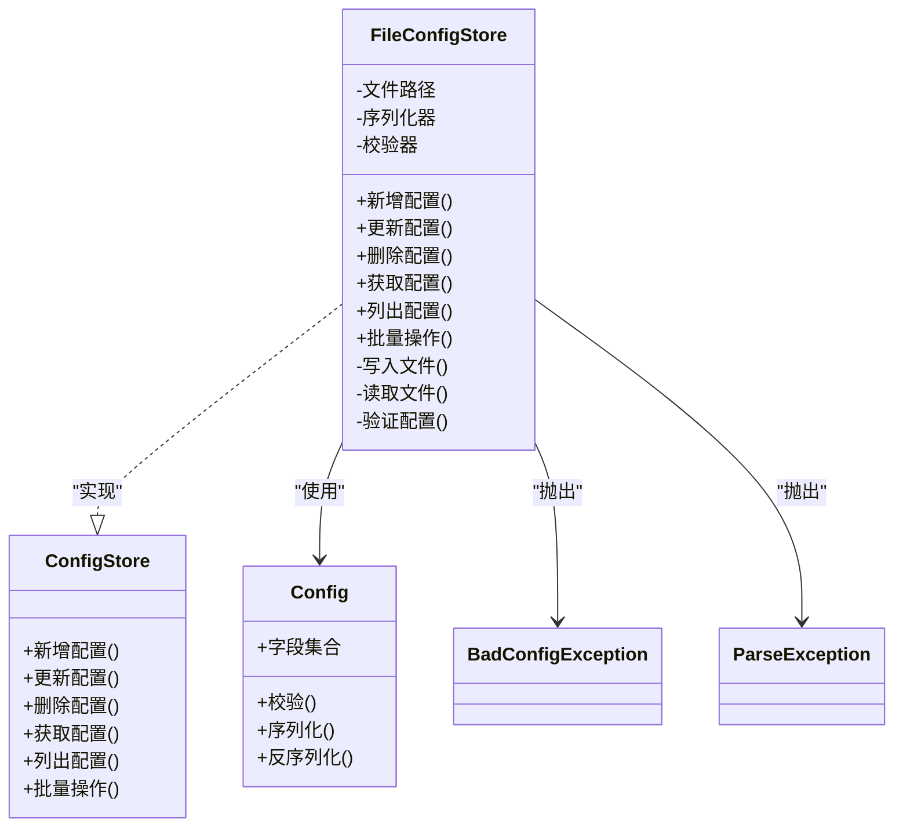
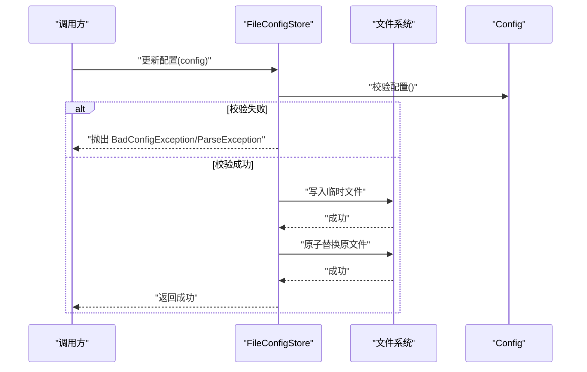
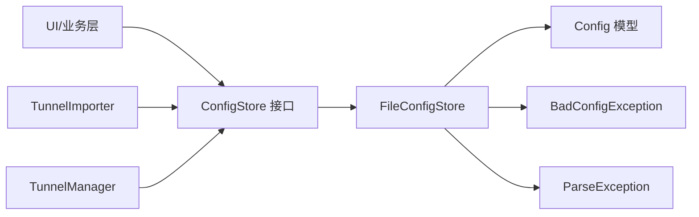

# 配置存储层

<cite>
**本文档引用的文件**   
- [ConfigStore.kt](file://ui/src/main/java/com/wireguard/android/configStore/ConfigStore.kt)
- [FileConfigStore.kt](file://ui/src/main/java/com/wireguard/android/configStore/FileConfigStore.kt)
- [Config.java](file://tunnel/src/main/java/com/wireguard/config/Config.java)
- [BadConfigException.java](file://tunnel/src/main/java/com/wireguard/config/BadConfigException.java)
- [ParseException.java](file://tunnel/src/main/java/com/wireguard/config/ParseException.java)
- [TunnelImporter.kt](file://ui/src/main/java/com/wireguard/android/util/TunnelImporter.kt)
- [TunnelManager.kt](file://ui/src/main/java/com/wireguard/android/model/TunnelManager.kt)
</cite>

## 目录
1. [简介](#简介)
2. [项目结构](#项目结构)
3. [核心组件](#核心组件)
4. [架构总览](#架构总览)
5. [详细组件分析](#详细组件分析)
6. [依赖关系分析](#依赖关系分析)
7. [性能考虑](#性能考虑)
8. [故障排查指南](#故障排查指南)
9. [结论](#结论)
10. [附录](#附录)

## 简介
本技术文档聚焦于 WireGuard Android 项目的配置存储层，围绕 ConfigStore 接口与 FileConfigStore 实现展开，系统阐述配置的读写、格式校验、错误处理、版本管理与迁移机制、加密与安全保护、备份与恢复、多设备同步与冲突解决策略，以及扩展至其他存储后端的机制。文档同时提供操作示例与性能优化建议，帮助开发者快速理解并安全高效地使用该存储层。

## 项目结构
配置存储相关代码主要位于 ui 模块的 configStore 包中，包含抽象接口与基于文件的默认实现；配置模型与解析逻辑位于 tunnel 模块的 config 包中；导入工具与隧道管理器在 ui 模块的 util 和 model 包中。整体采用“接口 + 实现”的分层设计，UI 层通过接口访问配置，具体存储细节对上层透明。

**图表来源**
- [ConfigStore.kt:1-200](file://ui/src/main/java/com/wireguard/android/configStore/ConfigStore.kt#L1-L200)
- [FileConfigStore.kt:1-300](file://ui/src/main/java/com/wireguard/android/configStore/FileConfigStore.kt#L1-L300)
- [Config.java:1-200](file://tunnel/src/main/java/com/wireguard/config/Config.java#L1-L200)
- [BadConfigException.java:1-100](file://tunnel/src/main/java/com/wireguard/config/BadConfigException.java#L1-L100)
- [ParseException.java:1-100](file://tunnel/src/main/java/com/wireguard/config/ParseException.java#L1-L100)
- [TunnelImporter.kt:1-200](file://ui/src/main/java/com/wireguard/android/util/TunnelImporter.kt#L1-L200)
- [TunnelManager.kt:1-200](file://ui/src/main/java/com/wireguard/android/model/TunnelManager.kt#L1-L200)

**章节来源**
- [ConfigStore.kt:1-200](file://ui/src/main/java/com/wireguard/android/configStore/ConfigStore.kt#L1-L200)
- [FileConfigStore.kt:1-300](file://ui/src/main/java/com/wireguard/android/configStore/FileConfigStore.kt#L1-L300)
- [Config.java:1-200](file://tunnel/src/main/java/com/wireguard/config/Config.java#L1-L200)

## 核心组件
- ConfigStore 接口：定义统一的配置操作契约，包括新增、更新、删除、查询、批量操作等，屏蔽底层存储差异。
- FileConfigStore 实现：基于本地文件系统持久化配置，负责序列化/反序列化、格式验证、异常转换与错误处理。
- Config 模型与解析：描述配置的结构与语义，提供解析与校验能力，抛出 BadConfigException 或 ParseException 以指示非法配置。
- TunnelImporter 与 TunnelManager：在导入与管理流程中调用 ConfigStore，完成配置的创建、更新与生命周期管理。

**章节来源**
- [ConfigStore.kt:1-200](file://ui/src/main/java/com/wireguard/android/configStore/ConfigStore.kt#L1-L200)
- [FileConfigStore.kt:1-300](file://ui/src/main/java/com/wireguard/android/configStore/FileConfigStore.kt#L1-L300)
- [Config.java:1-200](file://tunnel/src/main/java/com/wireguard/config/Config.java#L1-L200)
- [TunnelImporter.kt:1-200](file://ui/src/main/java/com/wireguard/android/util/TunnelImporter.kt#L1-L200)
- [TunnelManager.kt:1-200](file://ui/src/main/java/com/wireguard/android/model/TunnelManager.kt#L1-L200)

## 架构总览
配置存储层采用清晰的职责分离：
- 接口层（ConfigStore）：面向上层提供稳定 API。
- 实现层（FileConfigStore）：封装文件 I/O、序列化、校验与异常处理。
- 模型层（Config）：承载配置数据与规则。
- 集成层（TunnelImporter/TunnelManager）：编排导入与管理流程，调用存储接口。

**图表来源**
- [ConfigStore.kt:1-200](file://ui/src/main/java/com/wireguard/android/configStore/ConfigStore.kt#L1-L200)
- [FileConfigStore.kt:1-300](file://ui/src/main/java/com/wireguard/android/configStore/FileConfigStore.kt#L1-L300)
- [Config.java:1-200](file://tunnel/src/main/java/com/wireguard/config/Config.java#L1-L200)
- [BadConfigException.java:1-100](file://tunnel/src/main/java/com/wireguard/config/BadConfigException.java#L1-L100)
- [ParseException.java:1-100](file://tunnel/src/main/java/com/wireguard/config/ParseException.java#L1-L100)

## 详细组件分析

### ConfigStore 接口设计
- 目标：为所有配置操作提供统一入口，屏蔽不同后端（文件、数据库、云存储）的差异。
- 关键能力：
  - 新增/更新/删除单个配置项
  - 按标识获取配置项
  - 列出全部配置项
  - 批量操作（事务性更佳）
- 设计要点：
  - 方法签名清晰，输入输出类型明确
  - 异常类型向上暴露，便于调用方区分错误原因
  - 可扩展性：新增后端只需实现该接口

**章节来源**
- [ConfigStore.kt:1-200](file://ui/src/main/java/com/wireguard/android/configStore/ConfigStore.kt#L1-L200)

### FileConfigStore 文件存储实现
- 目标：将配置对象持久化为本地文件，保证读写一致性与可恢复性。
- 关键能力：
  - 配置文件读写：原子写入、临时文件落盘、成功后替换原文件
  - 格式验证：调用 Config 模型的校验逻辑，确保字段合法
  - 错误处理：将解析与校验异常转换为明确的异常类型
- 典型流程：
  - 写入：序列化配置 → 写入临时文件 → 原子替换 → 刷新缓存
  - 读取：打开文件 → 反序列化为 Config → 校验 → 返回结果
  - 删除：移除对应文件 → 清理缓存

**图表来源**
- [FileConfigStore.kt:1-300](file://ui/src/main/java/com/wireguard/android/configStore/FileConfigStore.kt#L1-L300)
- [Config.java:1-200](file://tunnel/src/main/java/com/wireguard/config/Config.java#L1-L200)

**章节来源**
- [FileConfigStore.kt:1-300](file://ui/src/main/java/com/wireguard/android/configStore/FileConfigStore.kt#L1-L300)
- [Config.java:1-200](file://tunnel/src/main/java/com/wireguard/config/Config.java#L1-L200)
- [BadConfigException.java:1-100](file://tunnel/src/main/java/com/wireguard/config/BadConfigException.java#L1-L100)
- [ParseException.java:1-100](file://tunnel/src/main/java/com/wireguard/config/ParseException.java#L1-L100)

### 配置模型与解析（Config）
- 角色：承载配置数据结构，提供校验、序列化与反序列化能力。
- 关键点：
  - 字段合法性检查（必填、取值范围、格式）
  - 解析错误分类（语法错误、值错误、缺失段/属性）
  - 异常类型：BadConfigException（语义错误）、ParseException（解析错误）

**章节来源**
- [Config.java:1-200](file://tunnel/src/main/java/com/wireguard/config/Config.java#L1-L200)
- [BadConfigException.java:1-100](file://tunnel/src/main/java/com/wireguard/config/BadConfigException.java#L1-L100)
- [ParseException.java:1-100](file://tunnel/src/main/java/com/wireguard/config/ParseException.java#L1-L100)

### 导入与管理集成（TunnelImporter / TunnelManager）
- 角色：在导入与隧道管理中协调配置的生命周期。
- 关键点：
  - 导入时先解析与校验，再调用 ConfigStore 保存
  - 管理流程中对增删改查进行编排，必要时回滚

**章节来源**
- [TunnelImporter.kt:1-200](file://ui/src/main/java/com/wireguard/android/util/TunnelImporter.kt#L1-L200)
- [TunnelManager.kt:1-200](file://ui/src/main/java/com/wireguard/android/model/TunnelManager.kt#L1-L200)

## 依赖关系分析
- 耦合度：
  - FileConfigStore 依赖 Config 模型与异常类型，保持高内聚
  - 上层仅依赖 ConfigStore 接口，降低耦合
- 外部依赖：
  - 文件系统 I/O
  - 序列化/反序列化库（由实现决定）
- 潜在循环依赖：无直接循环，接口与实现解耦良好

**图表来源**
- [ConfigStore.kt:1-200](file://ui/src/main/java/com/wireguard/android/configStore/ConfigStore.kt#L1-L200)
- [FileConfigStore.kt:1-300](file://ui/src/main/java/com/wireguard/android/configStore/FileConfigStore.kt#L1-L300)
- [Config.java:1-200](file://tunnel/src/main/java/com/wireguard/config/Config.java#L1-L200)
- [TunnelImporter.kt:1-200](file://ui/src/main/java/com/wireguard/android/util/TunnelImporter.kt#L1-L200)
- [TunnelManager.kt:1-200](file://ui/src/main/java/com/wireguard/android/model/TunnelManager.kt#L1-L200)

**章节来源**
- [ConfigStore.kt:1-200](file://ui/src/main/java/com/wireguard/android/configStore/ConfigStore.kt#L1-L200)
- [FileConfigStore.kt:1-300](file://ui/src/main/java/com/wireguard/android/configStore/FileConfigStore.kt#L1-L300)

## 性能考虑
- 文件 I/O：
  - 使用原子写入避免部分写入导致的数据损坏
  - 批量操作合并多次 I/O，减少磁盘抖动
- 序列化/反序列化：
  - 按需加载与懒解析，避免大配置全量解析
  - 缓存热点配置，缩短读取延迟
- 并发与锁：
  - 单写多读策略，写操作加锁，读操作无锁或细粒度锁
- 内存占用：
  - 流式处理大文件，避免一次性加载到内存
- 校验优化：
  - 增量校验与短路校验，尽早失败

[本节为通用指导，不直接分析具体文件]

## 故障排查指南
- 常见错误类型：
  - BadConfigException：配置语义错误（如必填字段缺失、取值非法）
  - ParseException：解析错误（如语法错误、未知段/属性）
- 定位步骤：
  - 捕获异常类型并打印上下文（文件名、行号、字段名）
  - 检查文件格式与编码
  - 确认校验规则与版本兼容性
- 恢复策略：
  - 从备份恢复最近可用版本
  - 回滚到上次成功写入前的快照

**章节来源**
- [BadConfigException.java:1-100](file://tunnel/src/main/java/com/wireguard/config/BadConfigException.java#L1-L100)
- [ParseException.java:1-100](file://tunnel/src/main/java/com/wireguard/config/ParseException.java#L1-L100)

## 结论
配置存储层通过 ConfigStore 接口与 FileConfigStore 实现，提供了稳定、可扩展且安全的配置管理能力。结合严格的格式校验与异常分类，保障了数据的正确性与一致性。通过原子写入、缓存与并发控制等手段，提升了性能与可靠性。未来可在此基础上扩展加密、备份恢复、多设备同步与冲突解决等高级特性。

[本节为总结性内容，不直接分析具体文件]

## 附录

### 版本管理与迁移机制
- 版本号策略：
  - 在配置元数据中记录 schema_version
  - 启动时检测版本，执行必要迁移
- 迁移流程：
  - 读取当前版本
  - 应用迁移脚本（字段重命名、默认值填充、格式转换）
  - 写入新版本并校验
- 回滚支持：
  - 迁移前生成快照
  - 失败时自动回滚

[本节为概念性说明，不直接分析具体文件]

### 存储加密与安全保护措施
- 传输与静态加密：
  - 静态存储使用强加密算法（如 AES-GCM）
  - 密钥管理通过安全存储（Android Keystore）
- 访问控制：
  - 限制文件权限，仅应用可读写
  - 敏感字段最小化暴露
- 完整性校验：
  - 写入时计算哈希或 MAC
  - 读取时校验完整性

[本节为概念性说明，不直接分析具体文件]

### 配置备份与恢复功能
- 备份策略：
  - 定期导出完整配置集
  - 增量备份变更的配置项
- 恢复流程：
  - 选择备份点
  - 校验备份完整性
  - 覆盖或合并恢复
- 审计与日志：
  - 记录备份/恢复操作与结果

[本节为概念性说明，不直接分析具体文件]

### 多设备同步与冲突解决策略
- 同步机制：
  - 基于中心服务器或 P2P 同步
  - 变更事件驱动与拉取模式结合
- 冲突解决：
  - 时间戳优先或用户选择
  - 字段级合并策略
- 一致性保障：
  - 分布式锁或乐观锁
  - 冲突检测与提示

[本节为概念性说明，不直接分析具体文件]

### 与其他存储后端的扩展机制
- 新后端实现：
  - 实现 ConfigStore 接口
  - 提供序列化/反序列化与校验适配
- 注册与切换：
  - 运行时注入后端实例
  - 配置开关切换默认后端
- 兼容层：
  - 统一异常与错误码
  - 统一事务与回滚语义

[本节为概念性说明，不直接分析具体文件]

### 配置操作示例（路径指引）
- 新增配置：参考导入流程中的保存调用
  - [TunnelImporter.kt:1-200](file://ui/src/main/java/com/wireguard/android/util/TunnelImporter.kt#L1-L200)
- 更新配置：参考管理流程中的更新调用
  - [TunnelManager.kt:1-200](file://ui/src/main/java/com/wireguard/android/model/TunnelManager.kt#L1-L200)
- 删除配置：参考删除流程中的调用
  - [TunnelManager.kt:1-200](file://ui/src/main/java/com/wireguard/android/model/TunnelManager.kt#L1-L200)
- 读取配置：参考列表与详情展示
  - [TunnelManager.kt:1-200](file://ui/src/main/java/com/wireguard/android/model/TunnelManager.kt#L1-L200)

**章节来源**
- [TunnelImporter.kt:1-200](file://ui/src/main/java/com/wireguard/android/util/TunnelImporter.kt#L1-L200)
- [TunnelManager.kt:1-200](file://ui/src/main/java/com/wireguard/android/model/TunnelManager.kt#L1-L200)