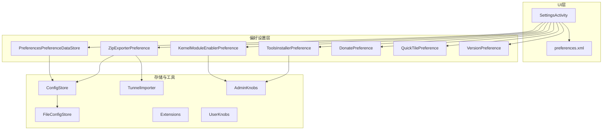
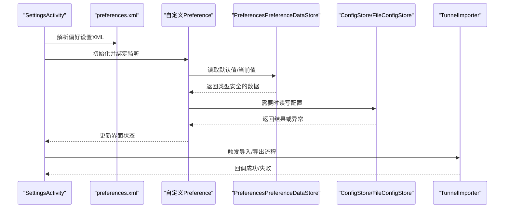
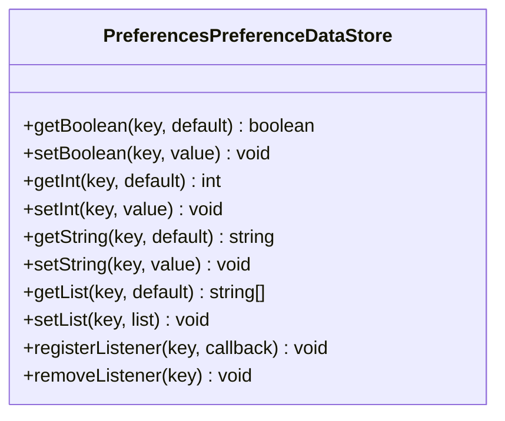
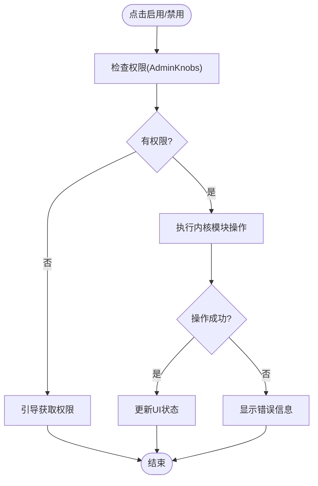
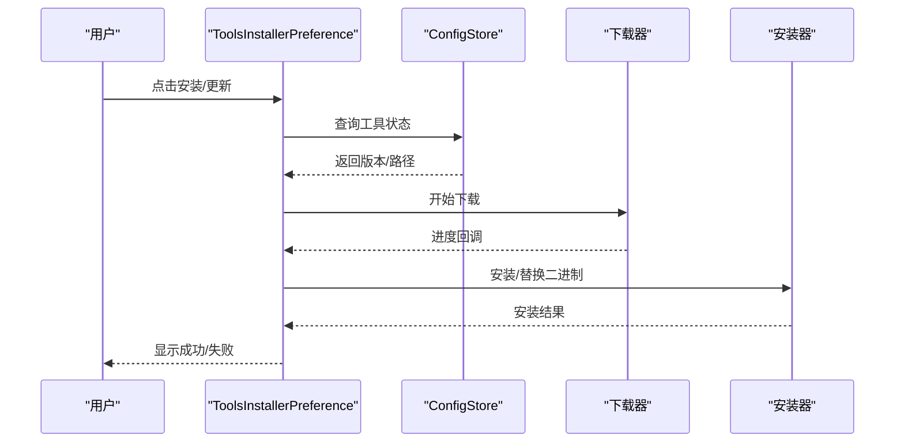
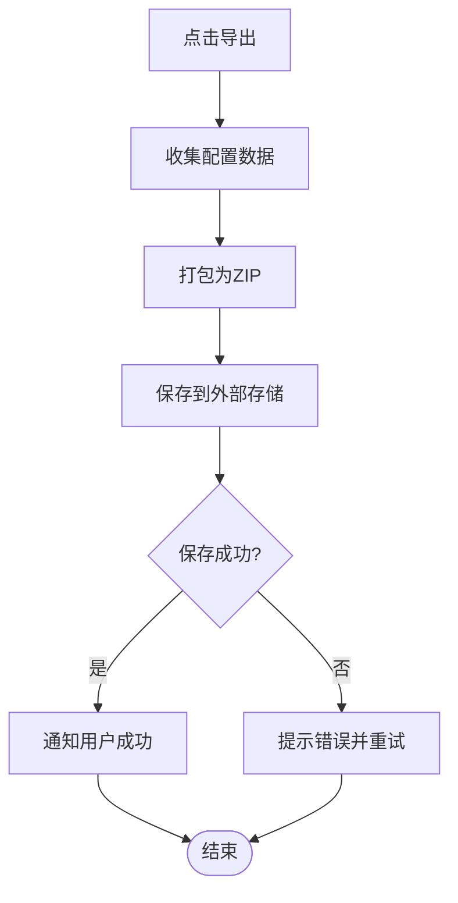
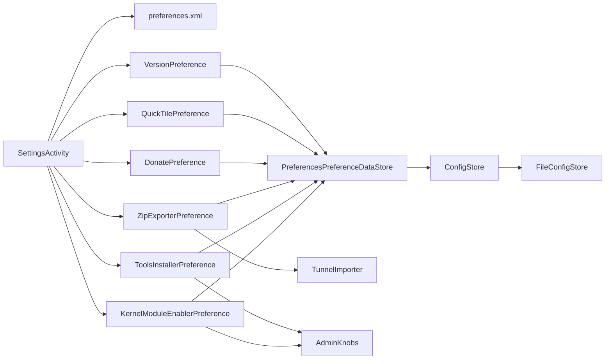

# 偏好设置系统

<cite>
**本文档引用的文件**   
- [PreferencesPreferenceDataStore.kt](file://ui/src/main/java/com/wireguard/android/preference/PreferencesPreferenceDataStore.kt)
- [KernelModuleEnablerPreference.kt](file://ui/src/main/java/com/wireguard/android/preference/KernelModuleEnablerPreference.kt)
- [ToolsInstallerPreference.kt](file://ui/src/main/java/com/wireguard/android/preference/ToolsInstallerPreference.kt)
- [ZipExporterPreference.kt](file://ui/src/main/java/com/wireguard/android/preference/ZipExporterPreference.kt)
- [DonatePreference.kt](file://ui/src/main/java/com/wireguard/android/preference/DonatePreference.kt)
- [QuickTilePreference.kt](file://ui/src/main/java/com/wireguard/android/preference/QuickTilePreference.kt)
- [VersionPreference.kt](file://ui/src/main/java/com/wireguard/android/preference/VersionPreference.kt)
- [preferences.xml](file://ui/src/main/res/xml/preferences.xml)
- [SettingsActivity.kt](file://ui/src/main/java/com/wireguard/android/activity/SettingsActivity.kt)
- [ConfigStore.kt](file://ui/src/main/java/com/wireguard/android/configStore/ConfigStore.kt)
- [FileConfigStore.kt](file://ui/src/main/java/com/wireguard/android/configStore/FileConfigStore.kt)
- [TunnelImporter.kt](file://ui/src/main/java/com/wireguard/android/util/TunnelImporter.kt)
- [Extensions.kt](file://ui/src/main/java/com/wireguard/android/util/Extensions.kt)
- [AdminKnobs.kt](file://ui/src/main/java/com/wireguard/android/util/AdminKnobs.kt)
- [UserKnobs.kt](file://ui/src/main/java/com/wireguard/android/util/UserKnobs.kt)
</cite>

## 目录
1. [简介](#简介)
2. [项目结构](#项目结构)
3. [核心组件](#核心组件)
4. [架构总览](#架构总览)
5. [详细组件分析](#详细组件分析)
6. [依赖关系分析](#依赖关系分析)
7. [性能考虑](#性能考虑)
8. [故障排查指南](#故障排查指南)
9. [结论](#结论)
10. [附录](#附录)

## 简介
本文件系统性梳理 WireGuard Android 的偏好设置系统，重点覆盖以下方面：
- PreferencesPreferenceDataStore 的设计与实现：数据存储、类型安全、默认值管理。
- 自定义 Preference 组件：KernelModuleEnablerPreference、ToolsInstallerPreference、ZipExporterPreference 的实现要点。
- 偏好设置的 XML 配置结构：界面布局、验证规则、依赖关系。
- 数据持久化机制：SharedPreferences 集成与版本迁移策略。
- 用户界面的动态生成：条件显示、实时更新、国际化支持。
- 导入导出功能：配置备份与恢复流程。
- 权限相关设置项：系统权限请求与用户授权管理。
- 扩展指南与最佳实践：如何新增偏好项、校验与错误处理。

## 项目结构
偏好设置系统主要位于 ui 模块中，关键目录与职责如下：
- preference：自定义 Preference 组件与 DataStore 封装。
- res/xml/preferences.xml：偏好设置 XML 定义（条目、分组、依赖、校验）。
- activity/SettingsActivity.kt：设置页入口与生命周期管理。
- configStore/*：配置存储抽象与文件实现，用于隧道配置的导入导出。
- util/*：工具类，包含导入器、权限与用户开关等。

图表来源
- [SettingsActivity.kt](file://ui/src/main/java/com/wireguard/android/activity/SettingsActivity.kt)
- [preferences.xml](file://ui/src/main/res/xml/preferences.xml)
- [PreferencesPreferenceDataStore.kt](file://ui/src/main/java/com/wireguard/android/preference/PreferencesPreferenceDataStore.kt)
- [KernelModuleEnablerPreference.kt](file://ui/src/main/java/com/wireguard/android/preference/KernelModuleEnablerPreference.kt)
- [ToolsInstallerPreference.kt](file://ui/src/main/java/com/wireguard/android/preference/ToolsInstallerPreference.kt)
- [ZipExporterPreference.kt](file://ui/src/main/java/com/wireguard/android/preference/ZipExporterPreference.kt)
- [DonatePreference.kt](file://ui/src/main/java/com/wireguard/android/preference/DonatePreference.kt)
- [QuickTilePreference.kt](file://ui/src/main/java/com/wireguard/android/preference/QuickTilePreference.kt)
- [VersionPreference.kt](file://ui/src/main/java/com/wireguard/android/preference/VersionPreference.kt)
- [ConfigStore.kt](file://ui/src/main/java/com/wireguard/android/configStore/ConfigStore.kt)
- [FileConfigStore.kt](file://ui/src/main/java/com/wireguard/android/configStore/FileConfigStore.kt)
- [TunnelImporter.kt](file://ui/src/main/java/com/wireguard/android/util/TunnelImporter.kt)
- [Extensions.kt](file://ui/src/main/java/com/wireguard/android/util/Extensions.kt)
- [AdminKnobs.kt](file://ui/src/main/java/com/wireguard/android/util/AdminKnobs.kt)
- [UserKnobs.kt](file://ui/src/main/java/com/wireguard/android/util/UserKnobs.kt)

章节来源
- [SettingsActivity.kt](file://ui/src/main/java/com/wireguard/android/activity/SettingsActivity.kt)
- [preferences.xml](file://ui/src/main/res/xml/preferences.xml)

## 核心组件
- PreferencesPreferenceDataStore：为 Preference 提供类型安全的读写接口，封装 SharedPreferences 或 DataStore 的访问，统一默认值与键名管理。
- KernelModuleEnablerPreference：用于启用/禁用内核模块的自定义 Preference，通常涉及 root 权限与状态检测。
- ToolsInstallerPreference：安装/更新辅助工具的自定义 Preference，可能触发下载与安装流程。
- ZipExporterPreference：将当前配置打包为 ZIP 并导出到指定位置，支持进度反馈与错误提示。
- DonatePreference、QuickTilePreference、VersionPreference：展示型或轻量交互的自定义 Preference。

章节来源
- [PreferencesPreferenceDataStore.kt](file://ui/src/main/java/com/wireguard/android/preference/PreferencesPreferenceDataStore.kt)
- [KernelModuleEnablerPreference.kt](file://ui/src/main/java/com/wireguard/android/preference/KernelModuleEnablerPreference.kt)
- [ToolsInstallerPreference.kt](file://ui/src/main/java/com/wireguard/android/preference/ToolsInstallerPreference.kt)
- [ZipExporterPreference.kt](file://ui/src/main/java/com/wireguard/android/preference/ZipExporterPreference.kt)
- [DonatePreference.kt](file://ui/src/main/java/com/wireguard/android/preference/DonatePreference.kt)
- [QuickTilePreference.kt](file://ui/src/main/java/com/wireguard/android/preference/QuickTilePreference.kt)
- [VersionPreference.kt](file://ui/src/main/java/com/wireguard/android/preference/VersionPreference.kt)

## 架构总览
偏好设置系统的整体交互流程如下：
- SettingsActivity 加载 preferences.xml，构建 PreferenceScreen。
- 每个自定义 Preference 通过 PreferencesPreferenceDataStore 读取/写入配置。
- 需要持久化的配置由 ConfigStore 抽象，具体实现 FileConfigStore 负责文件 IO。
- 导入导出由 TunnelImporter 与 ZipExporterPreference 协作完成。
- 权限与管理员能力由 AdminKnobs/UserKnobs 提供判断与引导。

图表来源
- [SettingsActivity.kt](file://ui/src/main/java/com/wireguard/android/activity/SettingsActivity.kt)
- [preferences.xml](file://ui/src/main/res/xml/preferences.xml)
- [PreferencesPreferenceDataStore.kt](file://ui/src/main/java/com/wireguard/android/preference/PreferencesPreferenceDataStore.kt)
- [ConfigStore.kt](file://ui/src/main/java/com/wireguard/android/configStore/ConfigStore.kt)
- [FileConfigStore.kt](file://ui/src/main/java/com/wireguard/android/configStore/FileConfigStore.kt)
- [TunnelImporter.kt](file://ui/src/main/java/com/wireguard/android/util/TunnelImporter.kt)

## 详细组件分析

### PreferencesPreferenceDataStore
- 设计目标：为 Preference 提供统一的键名管理与类型安全的存取方法，屏蔽底层存储差异。
- 关键点：
  - 键名集中管理，避免硬编码字符串散落各处。
  - 默认值集中定义，保证首次启动行为一致。
  - 类型安全接口：布尔、整数、浮点、字符串、集合等。
  - 可选的异步写入与变更监听，便于 UI 实时刷新。
- 典型用法：在自定义 Preference 的 onCreate/onClick 中调用读取/写入方法，结合 UI 状态更新。

图表来源
- [PreferencesPreferenceDataStore.kt](file://ui/src/main/java/com/wireguard/android/preference/PreferencesPreferenceDataStore.kt)

章节来源
- [PreferencesPreferenceDataStore.kt](file://ui/src/main/java/com/wireguard/android/preference/PreferencesPreferenceDataStore.kt)

### KernelModuleEnablerPreference
- 功能：允许用户在设置中启用/禁用内核模块，常见于需要 root 权限的场景。
- 关键点：
  - 检测当前设备是否具备所需权限（root/管理员）。
  - 执行模块启停命令，捕获输出并反馈给用户。
  - 根据结果更新 UI 状态，必要时提示重试或失败原因。
- 与权限管理：依赖 AdminKnobs 进行能力判断与引导。

图表来源
- [KernelModuleEnablerPreference.kt](file://ui/src/main/java/com/wireguard/android/preference/KernelModuleEnablerPreference.kt)
- [AdminKnobs.kt](file://ui/src/main/java/com/wireguard/android/util/AdminKnobs.kt)

章节来源
- [KernelModuleEnablerPreference.kt](file://ui/src/main/java/com/wireguard/android/preference/KernelModuleEnablerPreference.kt)
- [AdminKnobs.kt](file://ui/src/main/java/com/wireguard/android/util/AdminKnobs.kt)

### ToolsInstallerPreference
- 功能：安装或更新辅助工具（如命令行工具），可能涉及下载、校验与安装。
- 关键点：
  - 检查工具是否存在及版本。
  - 触发下载任务，显示进度与状态。
  - 安装完成后更新偏好状态，失败时给出可操作的错误提示。
- 与权限管理：可能需要 root 或特定目录写入权限。

图表来源
- [ToolsInstallerPreference.kt](file://ui/src/main/java/com/wireguard/android/preference/ToolsInstallerPreference.kt)
- [ConfigStore.kt](file://ui/src/main/java/com/wireguard/android/configStore/ConfigStore.kt)

章节来源
- [ToolsInstallerPreference.kt](file://ui/src/main/java/com/wireguard/android/preference/ToolsInstallerPreference.kt)

### ZipExporterPreference
- 功能：将当前配置打包为 ZIP 并导出到用户选择的目录。
- 关键点：
  - 收集需要导出的配置项（接口、对端、密钥等）。
  - 使用 ZipExporterPreference 组织打包逻辑。
  - 通过系统文件选择器或 Downloads 目录保存，反馈成功/失败。
- 与导入导出：配合 TunnelImporter 实现双向操作。

图表来源
- [ZipExporterPreference.kt](file://ui/src/main/java/com/wireguard/android/preference/ZipExporterPreference.kt)
- [TunnelImporter.kt](file://ui/src/main/java/com/wireguard/android/util/TunnelImporter.kt)

章节来源
- [ZipExporterPreference.kt](file://ui/src/main/java/com/wireguard/android/preference/ZipExporterPreference.kt)
- [TunnelImporter.kt](file://ui/src/main/java/com/wireguard/android/util/TunnelImporter.kt)

### 其他自定义 Preference
- DonatePreference：展示捐赠链接或按钮，无复杂状态。
- QuickTilePreference：与系统快捷磁贴联动，控制快速切换。
- VersionPreference：显示应用版本信息，只读展示。

章节来源
- [DonatePreference.kt](file://ui/src/main/java/com/wireguard/android/preference/DonatePreference.kt)
- [QuickTilePreference.kt](file://ui/src/main/java/com/wireguard/android/preference/QuickTilePreference.kt)
- [VersionPreference.kt](file://ui/src/main/java/com/wireguard/android/preference/VersionPreference.kt)

## 依赖关系分析
偏好设置系统与存储、工具、权限之间的依赖关系如下：
- SettingsActivity 依赖 preferences.xml 与所有自定义 Preference。
- 自定义 Preference 依赖 PreferencesPreferenceDataStore 进行读写。
- 配置导入导出依赖 ConfigStore/FileConfigStore 与 TunnelImporter。
- 权限相关依赖 AdminKnobs/UserKnobs。

图表来源
- [SettingsActivity.kt](file://ui/src/main/java/com/wireguard/android/activity/SettingsActivity.kt)
- [preferences.xml](file://ui/src/main/res/xml/preferences.xml)
- [PreferencesPreferenceDataStore.kt](file://ui/src/main/java/com/wireguard/android/preference/PreferencesPreferenceDataStore.kt)
- [ConfigStore.kt](file://ui/src/main/java/com/wireguard/android/configStore/ConfigStore.kt)
- [FileConfigStore.kt](file://ui/src/main/java/com/wireguard/android/configStore/FileConfigStore.kt)
- [TunnelImporter.kt](file://ui/src/main/java/com/wireguard/android/util/TunnelImporter.kt)
- [AdminKnobs.kt](file://ui/src/main/java/com/wireguard/android/util/AdminKnobs.kt)

章节来源
- [SettingsActivity.kt](file://ui/src/main/java/com/wireguard/android/activity/SettingsActivity.kt)
- [preferences.xml](file://ui/src/main/res/xml/preferences.xml)
- [PreferencesPreferenceDataStore.kt](file://ui/src/main/java/com/wireguard/android/preference/PreferencesPreferenceDataStore.kt)
- [ConfigStore.kt](file://ui/src/main/java/com/wireguard/android/configStore/ConfigStore.kt)
- [FileConfigStore.kt](file://ui/src/main/java/com/wireguard/android/configStore/FileConfigStore.kt)
- [TunnelImporter.kt](file://ui/src/main/java/com/wireguard/android/util/TunnelImporter.kt)
- [AdminKnobs.kt](file://ui/src/main/java/com/wireguard/android/util/AdminKnobs.kt)

## 性能考虑
- 偏好读写应尽量批量合并，避免频繁 I/O；PreferencesPreferenceDataStore 可提供批量写入接口。
- 长耗时操作（下载、安装、打包）应在后台线程执行，并通过回调更新 UI。
- 大文件导出应避免阻塞主线程，采用流式写入与进度回调。
- 缓存常用配置值，减少重复读取。

[本节为通用指导，不直接分析具体文件]

## 故障排查指南
- 权限问题：确认 AdminKnobs 的能力检测结果，必要时引导用户授予权限。
- 导入失败：检查文件格式与内容完整性，查看 TunnelImporter 的错误码与日志。
- 导出失败：确认外部存储权限与目标目录可写性，检查磁盘空间。
- 偏好未生效：检查 PreferencesPreferenceDataStore 的键名与默认值是否正确，确认监听器已注册。

章节来源
- [TunnelImporter.kt](file://ui/src/main/java/com/wireguard/android/util/TunnelImporter.kt)
- [AdminKnobs.kt](file://ui/src/main/java/com/wireguard/android/util/AdminKnobs.kt)
- [PreferencesPreferenceDataStore.kt](file://ui/src/main/java/com/wireguard/android/preference/PreferencesPreferenceDataStore.kt)

## 结论
WireGuard Android 的偏好设置系统以 PreferencesPreferenceDataStore 为核心，结合自定义 Preference 组件与配置存储抽象，实现了类型安全、可扩展且易于维护的设置体系。通过 XML 配置与动态 UI 生成，系统具备良好的可读性与国际化支持。导入导出与权限管理进一步完善了用户体验与安全性。遵循本文档的最佳实践，可高效扩展新的偏好项并确保稳定性。

[本节为总结，不直接分析具体文件]

## 附录

### 偏好设置 XML 配置结构
- 界面布局：使用 PreferenceScreen/PreferenceCategory 组织条目，便于分组与导航。
- 验证规则：在 XML 中声明输入限制（如必填、格式），或在代码中进行二次校验。
- 依赖关系：通过 dependency 属性控制条目的可见性与启用状态。

章节来源
- [preferences.xml](file://ui/src/main/res/xml/preferences.xml)

### 数据持久化与版本迁移
- SharedPreferences/DataStore：PreferencesPreferenceDataStore 统一封装，确保类型安全与默认值一致性。
- 版本迁移：在应用升级时检查偏好版本，执行必要的字段映射与清理。

章节来源
- [PreferencesPreferenceDataStore.kt](file://ui/src/main/java/com/wireguard/android/preference/PreferencesPreferenceDataStore.kt)

### 用户界面动态生成
- 条件显示：基于用户权限、设备能力与偏好状态动态显示/隐藏条目。
- 实时更新：通过监听器响应偏好变化，即时刷新 UI。
- 国际化：使用 strings.xml 多语言资源，确保文本本地化。

章节来源
- [SettingsActivity.kt](file://ui/src/main/java/com/wireguard/android/activity/SettingsActivity.kt)
- [Extensions.kt](file://ui/src/main/java/com/wireguard/android/util/Extensions.kt)

### 导入导出功能
- 配置备份：ZipExporterPreference 将接口、对端、密钥等打包为 ZIP。
- 配置恢复：TunnelImporter 解析 ZIP 并导入配置，支持冲突处理与回滚。

章节来源
- [ZipExporterPreference.kt](file://ui/src/main/java/com/wireguard/android/preference/ZipExporterPreference.kt)
- [TunnelImporter.kt](file://ui/src/main/java/com/wireguard/android/util/TunnelImporter.kt)

### 权限相关设置项
- 系统权限请求：在安装工具、写入外部存储等场景下请求必要权限。
- 用户授权管理：通过 AdminKnobs/UserKnobs 判断能力并提供引导。

章节来源
- [AdminKnobs.kt](file://ui/src/main/java/com/wireguard/android/util/AdminKnobs.kt)
- [UserKnobs.kt](file://ui/src/main/java/com/wireguard/android/util/UserKnobs.kt)

### 扩展指南与最佳实践
- 新增偏好项：
  - 在 preferences.xml 中添加条目，定义 key、title、summary、dependency。
  - 如需自定义行为，继承 Preference 并实现 onClick/onBindViewHolder。
  - 使用 PreferencesPreferenceDataStore 读写配置，确保类型安全。
- 校验与错误处理：
  - 在 XML 中声明基本校验，在代码中进行业务校验。
  - 统一错误提示与重试机制，提升用户体验。
- 测试建议：
  - 单元测试覆盖 PreferencesPreferenceDataStore 的读写逻辑。
  - 集成测试验证导入导出流程与权限处理。

章节来源
- [PreferencesPreferenceDataStore.kt](file://ui/src/main/java/com/wireguard/android/preference/PreferencesPreferenceDataStore.kt)
- [preferences.xml](file://ui/src/main/res/xml/preferences.xml)