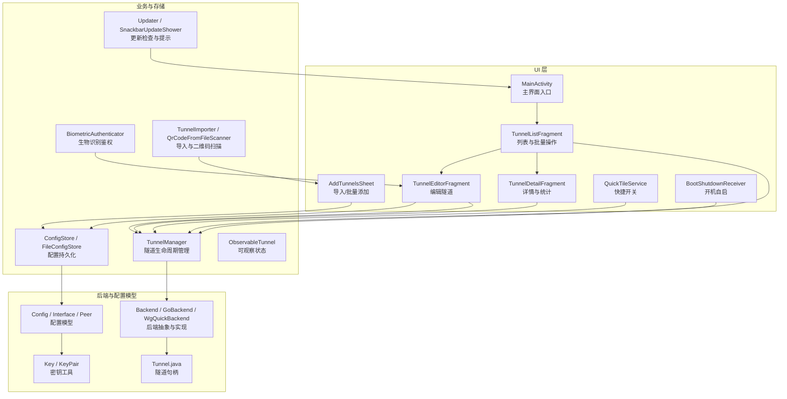
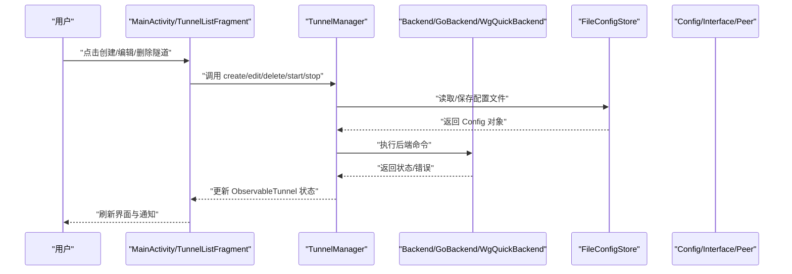
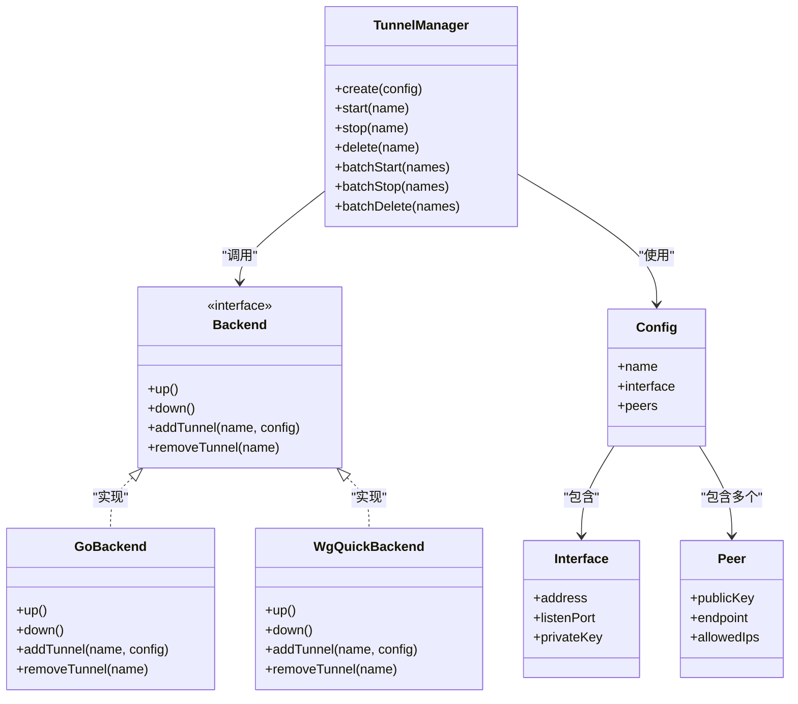
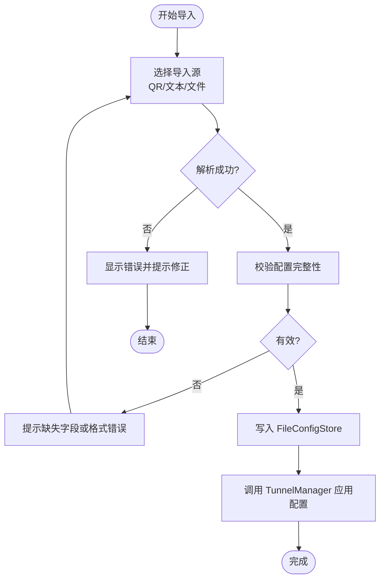
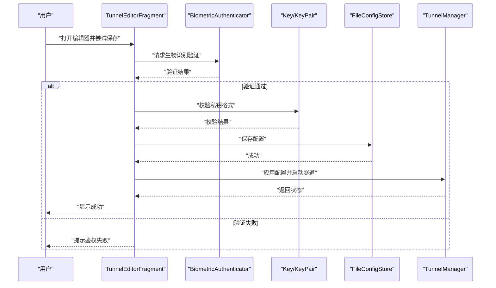
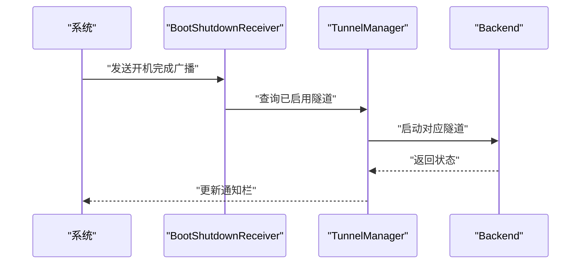
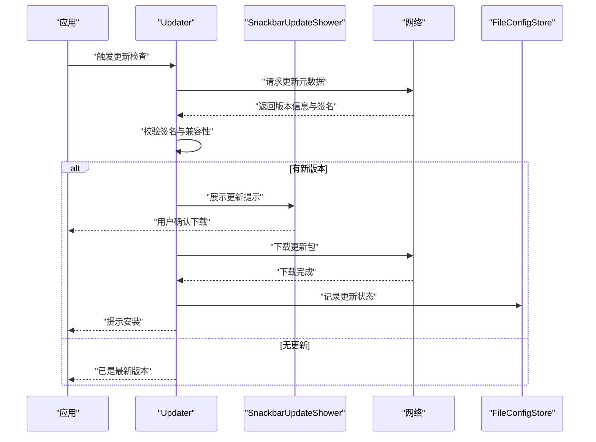
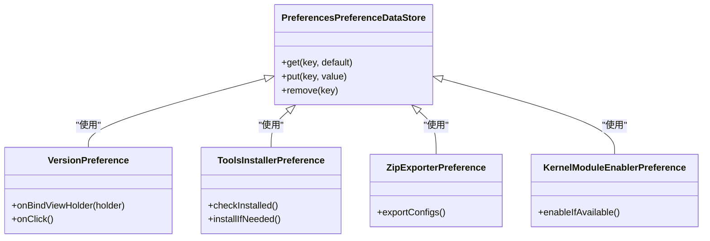
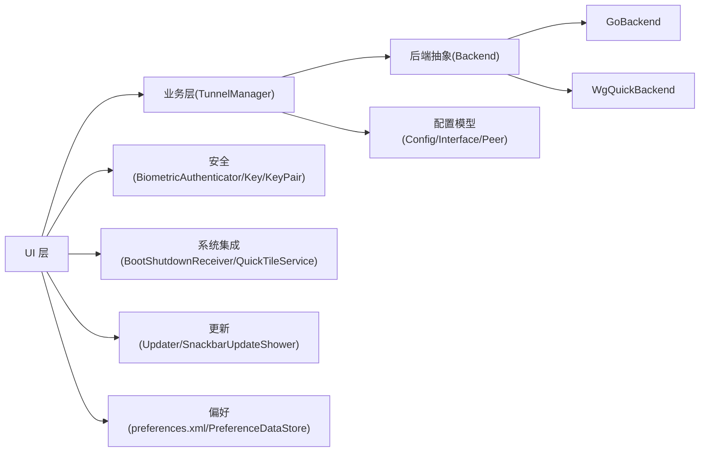

# 功能特性实现

<cite>
**本文引用的文件**   
- [README.md](file://README.md)
- [AndroidManifest.xml (ui)](file://ui/src/main/AndroidManifest.xml)
- [MainActivity.kt](file://ui/src/main/java/com/wireguard/android/activity/MainActivity.kt)
- [TunnelCreatorActivity.kt](file://ui/src/main/java/com/wireguard/android/activity/TunnelCreatorActivity.kt)
- [TunnelListFragment.kt](file://ui/src/main/java/com/wireguard/android/fragment/TunnelListFragment.kt)
- [TunnelEditorFragment.kt](file://ui/src/main/java/com/wireguard/android/fragment/TunnelEditorFragment.kt)
- [TunnelDetailFragment.kt](file://ui/src/main/java/com/wireguard/android/fragment/TunnelDetailFragment.kt)
- [AddTunnelsSheet.kt](file://ui/src/main/java/com/wireguard/android/fragment/AddTunnelsSheet.kt)
- [ConfigStore.kt](file://ui/src/main/java/com/wireguard/android/configStore/ConfigStore.kt)
- [FileConfigStore.kt](file://ui/src/main/java/com/wireguard/android/configStore/FileConfigStore.kt)
- [TunnelManager.kt](file://ui/src/main/java/com/wireguard/android/model/TunnelManager.kt)
- [ObservableTunnel.kt](file://ui/src/main/java/com/wireguard/android/model/ObservableTunnel.kt)
- [BootShutdownReceiver.kt](file://ui/src/main/java/com/wireguard/android/BootShutdownReceiver.kt)
- [QuickTileService.kt](file://ui/src/main/java/com/wireguard/android/QuickTileService.kt)
- [Updater.kt](file://ui/src/main/java/com/wireguard/android/updater/Updater.kt)
- [SnackbarUpdateShower.kt](file://ui/src/main/java/com/wireguard/android/updater/SnackbarUpdateShower.kt)
- [BiometricAuthenticator.kt](file://ui/src/main/java/com/wireguard/android/util/BiometricAuthenticator.kt)
- [TunnelImporter.kt](file://ui/src/main/java/com/wireguard/android/util/TunnelImporter.kt)
- [QrCodeFromFileScanner.kt](file://ui/src/main/java/com/wireguard/android/util/QrCodeFromFileScanner.kt)
- [preferences.xml](file://ui/src/main/res/xml/preferences.xml)
- [Backend.java](file://tunnel/src/main/java/com/wireguard/android/backend/Backend.java)
- [GoBackend.java](file://tunnel/src/main/java/com/wireguard/android/backend/GoBackend.java)
- [WgQuickBackend.java](file://tunnel/src/main/java/com/wireguard/android/backend/WgQuickBackend.java)
- [Tunnel.java (tunnel 模块)](file://tunnel/src/main/java/com/wireguard/android/backend/Tunnel.java)
- [Config.java](file://tunnel/src/main/java/com/wireguard/config/Config.java)
- [Interface.java](file://tunnel/src/main/java/com/wireguard/config/Interface.java)
- [Peer.java](file://tunnel/src/main/java/com/wireguard/config/Peer.java)
- [Key.java](file://tunnel/src/main/java/com/wireguard/crypto/Key.java)
- [KeyPair.java](file://tunnel/src/main/java/com/wireguard/crypto/KeyPair.java)
</cite>

## 目录
1. [简介](#简介)
2. [项目结构](#项目结构)
3. [核心组件](#核心组件)
4. [架构总览](#架构总览)
5. [详细组件分析](#详细组件分析)
6. [依赖关系分析](#依赖关系分析)
7. [性能考量](#性能考量)
8. [故障排查指南](#故障排查指南)
9. [结论](#结论)
10. [附录](#附录)

## 简介
本文件面向 WireGuard Android 的功能特性实现，围绕隧道管理、配置管理、安全能力、系统集成、更新机制与偏好设置六大方面进行系统化说明。文档以“从用户操作到系统内核”的视角，梳理数据流与控制流，给出关键类与交互图，并附带使用示例与常见问题排查建议，帮助开发者与高级用户快速理解与扩展功能。

## 项目结构
项目采用多模块组织：
- ui 模块：Android UI、业务编排、存储与集成（活动、片段、ViewModel、偏好、通知、快捷方式、更新等）
- tunnel 模块：WireGuard 后端抽象与 Go 绑定、配置模型、加密原语
- gradle 与构建脚本：版本管理与构建配置

图表来源
- [AndroidManifest.xml (ui)](file://ui/src/main/AndroidManifest.xml)
- [MainActivity.kt](file://ui/src/main/java/com/wireguard/android/activity/MainActivity.kt)
- [TunnelListFragment.kt](file://ui/src/main/java/com/wireguard/android/fragment/TunnelListFragment.kt)
- [TunnelEditorFragment.kt](file://ui/src/main/java/com/wireguard/android/fragment/TunnelEditorFragment.kt)
- [TunnelDetailFragment.kt](file://ui/src/main/java/com/wireguard/android/fragment/TunnelDetailFragment.kt)
- [AddTunnelsSheet.kt](file://ui/src/main/java/com/wireguard/android/fragment/AddTunnelsSheet.kt)
- [ConfigStore.kt](file://ui/src/main/java/com/wireguard/android/configStore/ConfigStore.kt)
- [FileConfigStore.kt](file://ui/src/main/java/com/wireguard/android/configStore/FileConfigStore.kt)
- [TunnelManager.kt](file://ui/src/main/java/com/wireguard/android/model/TunnelManager.kt)
- [ObservableTunnel.kt](file://ui/src/main/java/com/wireguard/android/model/ObservableTunnel.kt)
- [QuickTileService.kt](file://ui/src/main/java/com/wireguard/android/QuickTileService.kt)
- [BootShutdownReceiver.kt](file://ui/src/main/java/com/wireguard/android/BootShutdownReceiver.kt)
- [Updater.kt](file://ui/src/main/java/com/wireguard/android/updater/Updater.kt)
- [SnackbarUpdateShower.kt](file://ui/src/main/java/com/wireguard/android/updater/SnackbarUpdateShower.kt)
- [BiometricAuthenticator.kt](file://ui/src/main/java/com/wireguard/android/util/BiometricAuthenticator.kt)
- [TunnelImporter.kt](file://ui/src/main/java/com/wireguard/android/util/TunnelImporter.kt)
- [QrCodeFromFileScanner.kt](file://ui/src/main/java/com/wireguard/android/util/QrCodeFromFileScanner.kt)
- [Backend.java](file://tunnel/src/main/java/com/wireguard/android/backend/Backend.java)
- [GoBackend.java](file://tunnel/src/main/java/com/wireguard/android/backend/GoBackend.java)
- [WgQuickBackend.java](file://tunnel/src/main/java/com/wireguard/android/backend/WgQuickBackend.java)
- [Tunnel.java (tunnel 模块)](file://tunnel/src/main/java/com/wireguard/android/backend/Tunnel.java)
- [Config.java](file://tunnel/src/main/java/com/wireguard/config/Config.java)
- [Interface.java](file://tunnel/src/main/java/com/wireguard/config/Interface.java)
- [Peer.java](file://tunnel/src/main/java/com/wireguard/config/Peer.java)
- [Key.java](file://tunnel/src/main/java/com/wireguard/crypto/Key.java)
- [KeyPair.java](file://tunnel/src/main/java/com/wireguard/crypto/KeyPair.java)

章节来源
- [README.md](file://README.md)

## 核心组件
- 隧道管理：TunnelManager 负责创建、启动、停止、删除与批量操作；UI 通过 Fragment/Activity 触发，最终调用后端接口。
- 配置管理：ConfigStore/FileConfigStore 提供配置的读写与校验；TunnelImporter/QrCodeFromFileScanner 支持导入与 QR 码解析；Config/Interface/Peer 为配置模型。
- 安全能力：Key/KeyPair 用于密钥生成与校验；BiometricAuthenticator 提供生物识别鉴权；权限控制由 Manifest 与运行时权限共同保障。
- 系统集成：BootShutdownReceiver 处理开机自启动；QuickTileService 提供系统快捷开关；通知栏状态由 TunnelManager 驱动。
- 更新机制：Updater 定期检查更新，SnackbarUpdateShower 展示更新提示与下载流程。
- 偏好设置：preferences.xml 定义设置项，Preference 相关组件提供扩展点。

章节来源
- [TunnelManager.kt](file://ui/src/main/java/com/wireguard/android/model/TunnelManager.kt)
- [ConfigStore.kt](file://ui/src/main/java/com/wireguard/android/configStore/ConfigStore.kt)
- [FileConfigStore.kt](file://ui/src/main/java/com/wireguard/android/configStore/FileConfigStore.kt)
- [TunnelImporter.kt](file://ui/src/main/java/com/wireguard/android/util/TunnelImporter.kt)
- [QrCodeFromFileScanner.kt](file://ui/src/main/java/com/wireguard/android/util/QrCodeFromFileScanner.kt)
- [Key.java](file://tunnel/src/main/java/com/wireguard/crypto/Key.java)
- [KeyPair.java](file://tunnel/src/main/java/com/wireguard/crypto/KeyPair.java)
- [BiometricAuthenticator.kt](file://ui/src/main/java/com/wireguard/android/util/BiometricAuthenticator.kt)
- [BootShutdownReceiver.kt](file://ui/src/main/java/com/wireguard/android/BootShutdownReceiver.kt)
- [QuickTileService.kt](file://ui/src/main/java/com/wireguard/android/QuickTileService.kt)
- [Updater.kt](file://ui/src/main/java/com/wireguard/android/updater/Updater.kt)
- [SnackbarUpdateShower.kt](file://ui/src/main/java/com/wireguard/android/updater/SnackbarUpdateShower.kt)
- [preferences.xml](file://ui/src/main/res/xml/preferences.xml)

## 架构总览
整体采用“UI 层 → 业务编排 → 后端抽象 → 配置模型”的分层架构。UI 层通过 ViewModel/Fragment 协调用户交互；业务层集中管理隧道生命周期与配置持久化；后端抽象屏蔽具体实现差异（Go 绑定或 wg-quick）；配置模型确保跨平台一致性。

图表来源
- [TunnelListFragment.kt](file://ui/src/main/java/com/wireguard/android/fragment/TunnelListFragment.kt)
- [TunnelEditorFragment.kt](file://ui/src/main/java/com/wireguard/android/fragment/TunnelEditorFragment.kt)
- [TunnelManager.kt](file://ui/src/main/java/com/wireguard/android/model/TunnelManager.kt)
- [Backend.java](file://tunnel/src/main/java/com/wireguard/android/backend/Backend.java)
- [GoBackend.java](file://tunnel/src/main/java/com/wireguard/android/backend/GoBackend.java)
- [WgQuickBackend.java](file://tunnel/src/main/java/com/wireguard/android/backend/WgQuickBackend.java)
- [FileConfigStore.kt](file://ui/src/main/java/com/wireguard/android/configStore/FileConfigStore.kt)
- [Config.java](file://tunnel/src/main/java/com/wireguard/config/Config.java)
- [Interface.java](file://tunnel/src/main/java/com/wireguard/config/Interface.java)
- [Peer.java](file://tunnel/src/main/java/com/wireguard/config/Peer.java)

## 详细组件分析

### 隧道管理功能
- 创建：TunnelEditorFragment 收集 Interface/Peer 信息，写入 ConfigStore，随后通过 TunnelManager 调用后端创建并启动。
- 编辑：加载现有配置，修改后重新持久化并应用变更。
- 删除：移除配置文件并调用后端删除隧道实例。
- 批量操作：TunnelListFragment 支持多选，批量启动/停止/删除，提升效率。

图表来源
- [TunnelManager.kt](file://ui/src/main/java/com/wireguard/android/model/TunnelManager.kt)
- [Backend.java](file://tunnel/src/main/java/com/wireguard/android/backend/Backend.java)
- [GoBackend.java](file://tunnel/src/main/java/com/wireguard/android/backend/GoBackend.java)
- [WgQuickBackend.java](file://tunnel/src/main/java/com/wireguard/android/backend/WgQuickBackend.java)
- [Config.java](file://tunnel/src/main/java/com/wireguard/config/Config.java)
- [Interface.java](file://tunnel/src/main/java/com/wireguard/config/Interface.java)
- [Peer.java](file://tunnel/src/main/java/com/wireguard/config/Peer.java)

章节来源
- [TunnelListFragment.kt](file://ui/src/main/java/com/wireguard/android/fragment/TunnelListFragment.kt)
- [TunnelEditorFragment.kt](file://ui/src/main/java/com/wireguard/android/fragment/TunnelEditorFragment.kt)
- [TunnelDetailFragment.kt](file://ui/src/main/java/com/wireguard/android/fragment/TunnelDetailFragment.kt)
- [TunnelManager.kt](file://ui/src/main/java/com/wireguard/android/model/TunnelManager.kt)

### 配置管理功能
- 导入导出：TunnelImporter 支持多种格式导入；FileConfigStore 负责本地持久化；导出可通过 ZipExporterPreference 或自定义逻辑打包。
- QR 码支持：QrCodeFromFileScanner 解析 QR 内容并转换为配置对象，再由 AddTunnelsSheet 完成导入。
- 模板管理：可在 preferences.xml 中定义常用字段模板，或在编辑器中保存常用片段供复用。

图表来源
- [TunnelImporter.kt](file://ui/src/main/java/com/wireguard/android/util/TunnelImporter.kt)
- [QrCodeFromFileScanner.kt](file://ui/src/main/java/com/wireguard/android/util/QrCodeFromFileScanner.kt)
- [FileConfigStore.kt](file://ui/src/main/java/com/wireguard/android/configStore/FileConfigStore.kt)
- [AddTunnelsSheet.kt](file://ui/src/main/java/com/wireguard/android/fragment/AddTunnelsSheet.kt)
- [preferences.xml](file://ui/src/main/res/xml/preferences.xml)

章节来源
- [TunnelImporter.kt](file://ui/src/main/java/com/wireguard/android/util/TunnelImporter.kt)
- [QrCodeFromFileScanner.kt](file://ui/src/main/java/com/wireguard/android/util/QrCodeFromFileScanner.kt)
- [FileConfigStore.kt](file://ui/src/main/java/com/wireguard/android/configStore/FileConfigStore.kt)
- [AddTunnelsSheet.kt](file://ui/src/main/java/com/wireguard/android/fragment/AddTunnelsSheet.kt)
- [preferences.xml](file://ui/src/main/res/xml/preferences.xml)

### 安全功能实现
- 密钥管理：Key/KeyPair 提供密钥生成、校验与序列化；编辑器强制输入合法私钥并隐藏敏感信息。
- 生物识别认证：BiometricAuthenticator 在敏感操作前进行指纹/面部验证，防止未授权访问。
- 权限控制：Manifest 声明必要权限（网络、前台服务、接收广播等），运行时权限按需申请。

图表来源
- [TunnelEditorFragment.kt](file://ui/src/main/java/com/wireguard/android/fragment/TunnelEditorFragment.kt)
- [BiometricAuthenticator.kt](file://ui/src/main/java/com/wireguard/android/util/BiometricAuthenticator.kt)
- [Key.java](file://tunnel/src/main/java/com/wireguard/crypto/Key.java)
- [KeyPair.java](file://tunnel/src/main/java/com/wireguard/crypto/KeyPair.java)
- [FileConfigStore.kt](file://ui/src/main/java/com/wireguard/android/configStore/FileConfigStore.kt)
- [TunnelManager.kt](file://ui/src/main/java/com/wireguard/android/model/TunnelManager.kt)

章节来源
- [BiometricAuthenticator.kt](file://ui/src/main/java/com/wireguard/android/util/BiometricAuthenticator.kt)
- [Key.java](file://tunnel/src/main/java/com/wireguard/crypto/Key.java)
- [KeyPair.java](file://tunnel/src/main/java/com/wireguard/crypto/KeyPair.java)
- [AndroidManifest.xml (ui)](file://ui/src/main/AndroidManifest.xml)

### 系统集成功能
- 开机自启动：BootShutdownReceiver 监听系统广播，若检测到已启用隧道则自动恢复连接。
- 通知栏控制：TunnelManager 维护前台服务与通知，反映隧道状态与流量统计。
- 快捷方式：QuickTileService 提供系统级快捷开关，一键启停隧道。

图表来源
- [BootShutdownReceiver.kt](file://ui/src/main/java/com/wireguard/android/BootShutdownReceiver.kt)
- [TunnelManager.kt](file://ui/src/main/java/com/wireguard/android/model/TunnelManager.kt)
- [Backend.java](file://tunnel/src/main/java/com/wireguard/android/backend/Backend.java)

章节来源
- [BootShutdownReceiver.kt](file://ui/src/main/java/com/wireguard/android/BootShutdownReceiver.kt)
- [QuickTileService.kt](file://ui/src/main/java/com/wireguard/android/QuickTileService.kt)
- [TunnelManager.kt](file://ui/src/main/java/com/wireguard/android/model/TunnelManager.kt)

### 更新机制实现
- 自动检查：Updater 定期或按事件触发检查新版本，支持签名校验与增量更新策略。
- 提示与下载：SnackbarUpdateShower 展示更新提示，引导用户下载与安装。

图表来源
- [Updater.kt](file://ui/src/main/java/com/wireguard/android/updater/Updater.kt)
- [SnackbarUpdateShower.kt](file://ui/src/main/java/com/wireguard/android/updater/SnackbarUpdateShower.kt)
- [FileConfigStore.kt](file://ui/src/main/java/com/wireguard/android/configStore/FileConfigStore.kt)

章节来源
- [Updater.kt](file://ui/src/main/java/com/wireguard/android/updater/Updater.kt)
- [SnackbarUpdateShower.kt](file://ui/src/main/java/com/wireguard/android/updater/SnackbarUpdateShower.kt)

### 偏好设置系统与扩展机制
- 设置项定义：preferences.xml 集中定义设置键、类型、默认值与依赖关系。
- 扩展点：自定义 Preference 组件（如 DonatePreference、KernelModuleEnablerPreference、ToolsInstallerPreference、ZipExporterPreference、VersionPreference）提供特定行为。
- 数据存取：PreferencesPreferenceDataStore 统一读写偏好数据，便于测试与迁移。

图表来源
- [preferences.xml](file://ui/src/main/res/xml/preferences.xml)
- [PreferencesPreferenceDataStore.kt](file://ui/src/main/java/com/wireguard/android/preference/PreferencesPreferenceDataStore.kt)
- [VersionPreference.kt](file://ui/src/main/java/com/wireguard/android/preference/VersionPreference.kt)
- [ToolsInstallerPreference.kt](file://ui/src/main/java/com/wireguard/android/preference/ToolsInstallerPreference.kt)
- [ZipExporterPreference.kt](file://ui/src/main/java/com/wireguard/android/preference/ZipExporterPreference.kt)
- [KernelModuleEnablerPreference.kt](file://ui/src/main/java/com/wireguard/android/preference/KernelModuleEnablerPreference.kt)

章节来源
- [preferences.xml](file://ui/src/main/res/xml/preferences.xml)
- [PreferencesPreferenceDataStore.kt](file://ui/src/main/java/com/wireguard/android/preference/PreferencesPreferenceDataStore.kt)
- [VersionPreference.kt](file://ui/src/main/java/com/wireguard/android/preference/VersionPreference.kt)
- [ToolsInstallerPreference.kt](file://ui/src/main/java/com/wireguard/android/preference/ToolsInstallerPreference.kt)
- [ZipExporterPreference.kt](file://ui/src/main/java/com/wireguard/android/preference/ZipExporterPreference.kt)
- [KernelModuleEnablerPreference.kt](file://ui/src/main/java/com/wireguard/android/preference/KernelModuleEnablerPreference.kt)

### 使用示例与配置选项
- 创建隧道：在 TunnelEditorFragment 中填写 Interface 私钥、地址与监听端口，添加至少一个 Peer（公钥、端点、允许 IP），保存后启动。
- 导入配置：通过 AddTunnelsSheet 选择 QR 码或文本粘贴，系统自动解析并填充表单，确认后保存。
- 批量操作：在 TunnelListFragment 勾选多个隧道，执行批量启动/停止/删除。
- 快捷开关：下拉通知面板或系统快捷开关页面，点击 Tile 快速切换隧道状态。
- 开机自启：在偏好设置中开启“开机自启动”，系统将自动恢复之前启用的隧道。
- 更新检查：在设置中查看版本信息，如有新版本将提示下载与安装。

章节来源
- [TunnelEditorFragment.kt](file://ui/src/main/java/com/wireguard/android/fragment/TunnelEditorFragment.kt)
- [AddTunnelsSheet.kt](file://ui/src/main/java/com/wireguard/android/fragment/AddTunnelsSheet.kt)
- [TunnelListFragment.kt](file://ui/src/main/java/com/wireguard/android/fragment/TunnelListFragment.kt)
- [QuickTileService.kt](file://ui/src/main/java/com/wireguard/android/QuickTileService.kt)
- [BootShutdownReceiver.kt](file://ui/src/main/java/com/wireguard/android/BootShutdownReceiver.kt)
- [preferences.xml](file://ui/src/main/res/xml/preferences.xml)

## 依赖关系分析
- UI 依赖业务层：Fragment/Activity 调用 TunnelManager 进行隧道生命周期管理。
- 业务层依赖后端抽象：TunnelManager 通过 Backend 接口调用具体实现（GoBackend/WgQuickBackend）。
- 配置模型独立：Config/Interface/Peer 作为纯数据模型，被存储与后端共同使用。
- 安全组件解耦：BiometricAuthenticator 与 Key/KeyPair 不直接耦合 UI，便于复用。
- 系统集成组件：BootShutdownReceiver 与 QuickTileService 通过系统广播与服务机制与业务层协作。

图表来源
- [TunnelManager.kt](file://ui/src/main/java/com/wireguard/android/model/TunnelManager.kt)
- [Backend.java](file://tunnel/src/main/java/com/wireguard/android/backend/Backend.java)
- [GoBackend.java](file://tunnel/src/main/java/com/wireguard/android/backend/GoBackend.java)
- [WgQuickBackend.java](file://tunnel/src/main/java/com/wireguard/android/backend/WgQuickBackend.java)
- [Config.java](file://tunnel/src/main/java/com/wireguard/config/Config.java)
- [Interface.java](file://tunnel/src/main/java/com/wireguard/config/Interface.java)
- [Peer.java](file://tunnel/src/main/java/com/wireguard/config/Peer.java)
- [BiometricAuthenticator.kt](file://ui/src/main/java/com/wireguard/android/util/BiometricAuthenticator.kt)
- [Key.java](file://tunnel/src/main/java/com/wireguard/crypto/Key.java)
- [KeyPair.java](file://tunnel/src/main/java/com/wireguard/crypto/KeyPair.java)
- [BootShutdownReceiver.kt](file://ui/src/main/java/com/wireguard/android/BootShutdownReceiver.kt)
- [QuickTileService.kt](file://ui/src/main/java/com/wireguard/android/QuickTileService.kt)
- [Updater.kt](file://ui/src/main/java/com/wireguard/android/updater/Updater.kt)
- [SnackbarUpdateShower.kt](file://ui/src/main/java/com/wireguard/android/updater/SnackbarUpdateShower.kt)
- [preferences.xml](file://ui/src/main/res/xml/preferences.xml)

章节来源
- [TunnelManager.kt](file://ui/src/main/java/com/wireguard/android/model/TunnelManager.kt)
- [Backend.java](file://tunnel/src/main/java/com/wireguard/android/backend/Backend.java)
- [Config.java](file://tunnel/src/main/java/com/wireguard/config/Config.java)

## 性能考量
- 后台任务调度：避免在主线程执行耗时操作，使用协程或异步任务处理网络与磁盘 IO。
- 配置解析优化：对大配置文件进行分块解析与缓存，减少重复计算。
- 通知与统计：仅增量更新通知栏统计，避免频繁刷新导致卡顿。
- 资源释放：及时关闭文件句柄与网络连接，防止内存泄漏。

[本节为通用指导，无需引用具体文件]

## 故障排查指南
- 隧道无法启动：检查私钥格式与权限，确认后端可用；查看日志输出定位错误。
- 导入失败：确认 QR 码或文本符合规范，补全缺失字段；查看解析错误提示。
- 更新失败：检查网络连通性与签名校验；重试下载或回滚版本。
- 开机自启无效：确认广播权限与系统限制；手动触发一次后再重启验证。

章节来源
- [TunnelEditorFragment.kt](file://ui/src/main/java/com/wireguard/android/fragment/TunnelEditorFragment.kt)
- [TunnelImporter.kt](file://ui/src/main/java/com/wireguard/android/util/TunnelImporter.kt)
- [Updater.kt](file://ui/src/main/java/com/wireguard/android/updater/Updater.kt)
- [BootShutdownReceiver.kt](file://ui/src/main/java/com/wireguard/android/BootShutdownReceiver.kt)

## 结论
WireGuard Android 通过清晰的分层架构与模块化设计，实现了隧道管理、配置管理、安全能力、系统集成、更新机制与偏好设置的完整闭环。各组件职责明确、依赖关系清晰，便于扩展与维护。建议在新增功能时遵循现有模式，保持数据流与控制流的稳定性，并通过单元测试与集成测试保障质量。

[本节为总结性内容，无需引用具体文件]

## 附录
- 术语表：隧道、后端、配置模型、生物识别、快捷开关、偏好设置等
- 参考链接：README 中的项目背景与使用说明

[本节为补充信息，无需引用具体文件]