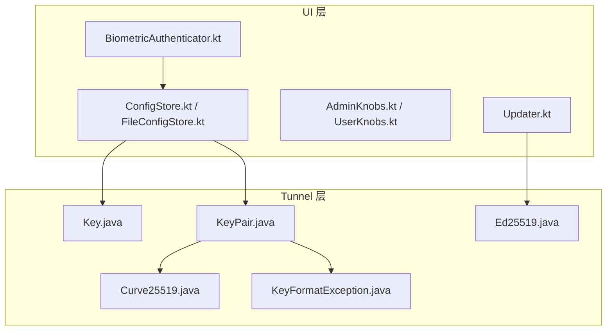
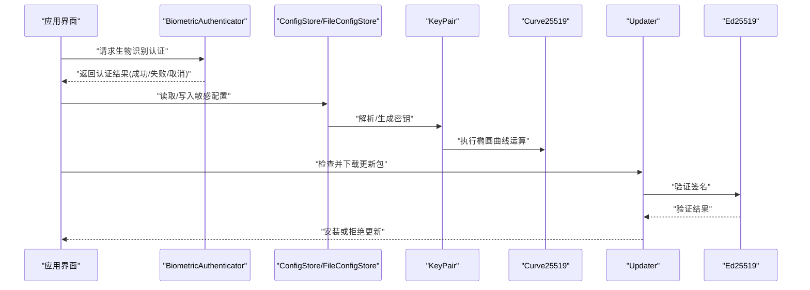
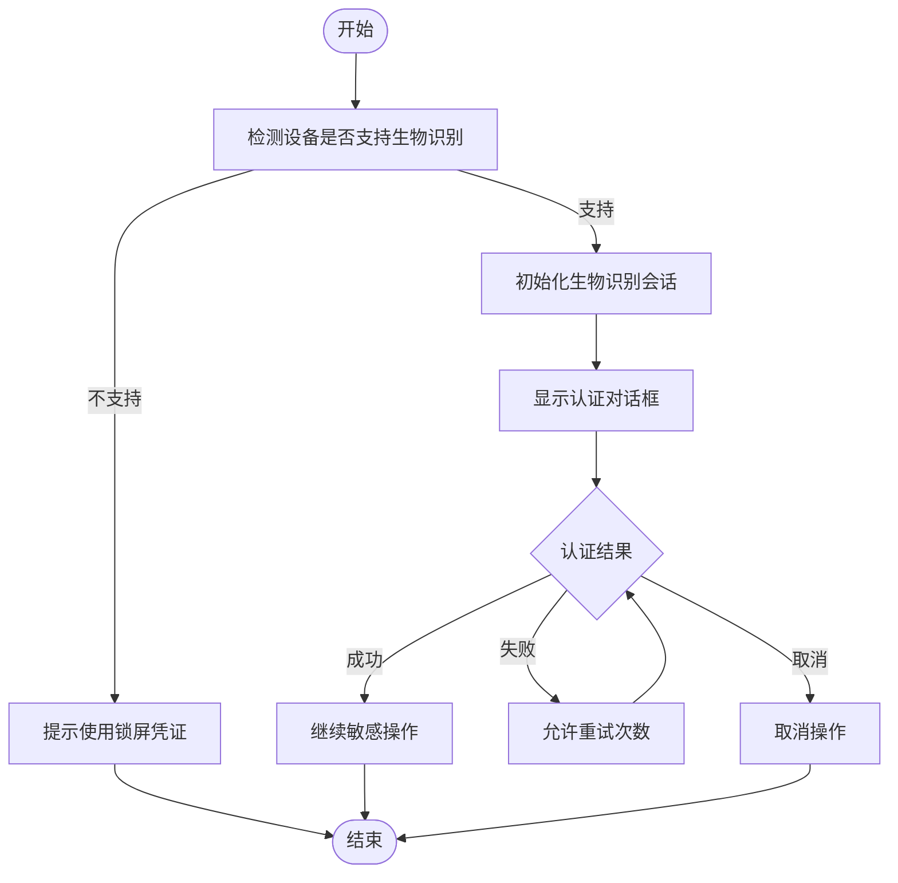
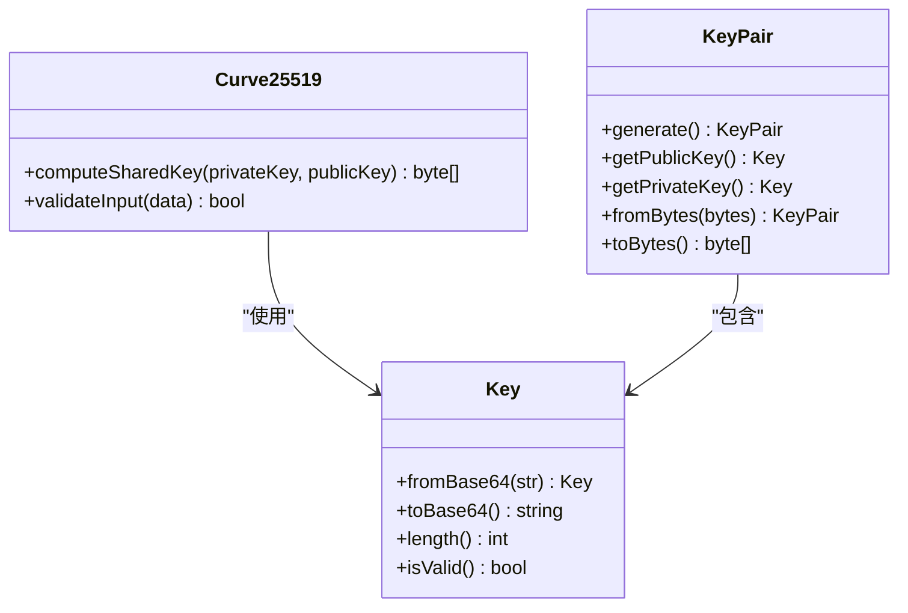
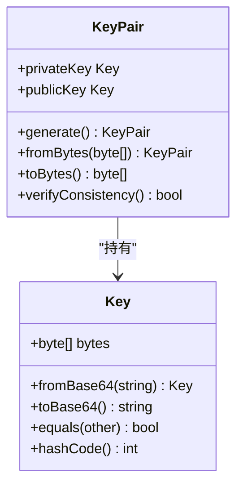
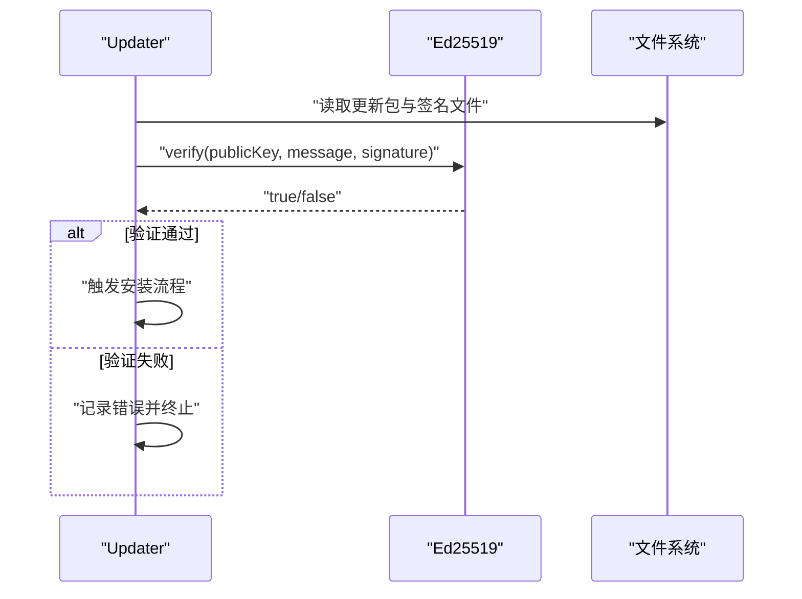
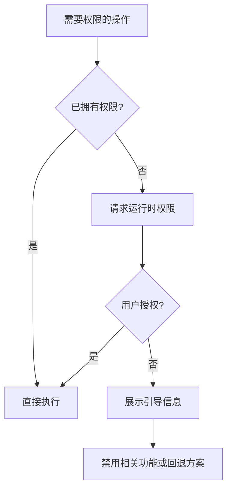
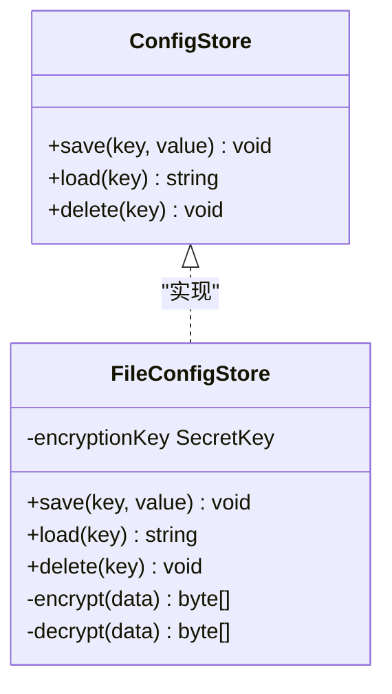
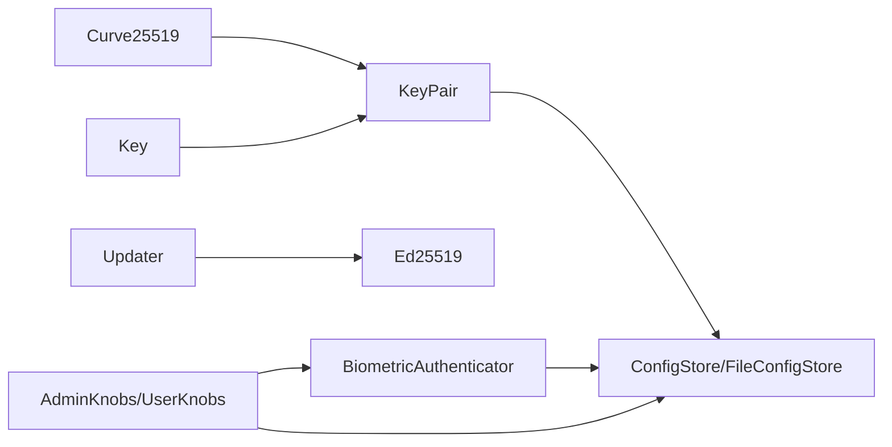

# 安全功能实现

<cite>
**本文引用的文件**
- [Curve25519.java](file://tunnel/src/main/java/com/wireguard/crypto/Curve25519.java)
- [Key.java](file://tunnel/src/main/java/com/wireguard/crypto/Key.java)
- [KeyPair.java](file://tunnel/src/main/java/com/wireguard/crypto/KeyPair.java)
- [KeyFormatException.java](file://tunnel/src/main/java/com/wireguard/crypto/KeyFormatException.java)
- [Ed25519.java](file://ui/src/main/java/com/wireguard/android/updater/Ed25519.java)
- [Updater.kt](file://ui/src/main/java/com/wireguard/android/updater/Updater.kt)
- [BiometricAuthenticator.kt](file://ui/src/main/java/com/wireguard/android/util/BiometricAuthenticator.kt)
- [AdminKnobs.kt](file://ui/src/main/java/com/wireguard/android/util/AdminKnobs.kt)
- [UserKnobs.kt](file://ui/src/main/java/com/wireguard/android/util/UserKnobs.kt)
- [ConfigStore.kt](file://ui/src/main/java/com/wireguard/android/configStore/ConfigStore.kt)
- [FileConfigStore.kt](file://ui/src/main/java/com/wireguard/android/configStore/FileConfigStore.kt)
- [AndroidManifest.xml](file://ui/src/main/AndroidManifest.xml)
</cite>

## 目录
1. [简介](#简介)
2. [项目结构](#项目结构)
3. [核心组件](#核心组件)
4. [架构总览](#架构总览)
5. [详细组件分析](#详细组件分析)
6. [依赖关系分析](#依赖关系分析)
7. [性能考虑](#性能考虑)
8. [故障排查指南](#故障排查指南)
9. [结论](#结论)
10. [附录](#附录)

## 简介
本文件聚焦 WireGuard Android 的安全能力实现，覆盖生物识别认证、密码学工具库（Curve25519、Ed25519）、密钥与密钥对管理、权限管理与用户引导、安全存储机制、算法选择与安全考量、配置最佳实践以及漏洞防护与异常处理。文档以代码级分析为基础，辅以可视化图示，帮助开发者快速理解并正确扩展安全模块。

## 项目结构
安全相关代码主要分布在两个模块：
- tunnel 模块：提供底层密码学原语与密钥模型（Curve25519、Key、KeyPair、KeyFormatException）。
- ui 模块：提供上层安全能力（生物识别认证、应用更新签名验证、权限与用户引导、配置存储等）。

图表来源
- [BiometricAuthenticator.kt](file://ui/src/main/java/com/wireguard/android/util/BiometricAuthenticator.kt)
- [Updater.kt](file://ui/src/main/java/com/wireguard/android/updater/Updater.kt)
- [AdminKnobs.kt](file://ui/src/main/java/com/wireguard/android/util/AdminKnobs.kt)
- [UserKnobs.kt](file://ui/src/main/java/com/wireguard/android/util/UserKnobs.kt)
- [ConfigStore.kt](file://ui/src/main/java/com/wireguard/android/configStore/ConfigStore.kt)
- [FileConfigStore.kt](file://ui/src/main/java/com/wireguard/android/configStore/FileConfigStore.kt)
- [Curve25519.java](file://tunnel/src/main/java/com/wireguard/crypto/Curve25519.java)
- [Key.java](file://tunnel/src/main/java/com/wireguard/crypto/Key.java)
- [KeyPair.java](file://tunnel/src/main/java/com/wireguard/crypto/KeyPair.java)
- [KeyFormatException.java](file://tunnel/src/main/java/com/wireguard/crypto/KeyFormatException.java)
- [Ed25519.java](file://ui/src/main/java/com/wireguard/android/updater/Ed25519.java)

章节来源
- [AndroidManifest.xml](file://ui/src/main/AndroidManifest.xml)

## 核心组件
- Curve25519：椭圆曲线 Diffie-Hellman 密钥协商的原语封装，用于生成共享密钥。
- Key：WireGuard 密钥的抽象表示，负责 Base64/十六进制编解码、长度校验与格式验证。
- KeyPair：私钥与公钥的组合体，支持随机生成、序列化/反序列化和基本校验。
- Ed25519：数字签名算法实现，用于应用更新包签名验证。
- BiometricAuthenticator：生物识别认证入口，统一指纹/面部识别流程与系统权限处理。
- AdminKnobs / UserKnobs：设备管理员策略与用户偏好开关，驱动权限与行为控制。
- ConfigStore / FileConfigStore：配置与敏感数据的持久化接口与文件实现，承载安全存储策略。

章节来源
- [Curve25519.java](file://tunnel/src/main/java/com/wireguard/crypto/Curve25519.java)
- [Key.java](file://tunnel/src/main/java/com/wireguard/crypto/Key.java)
- [KeyPair.java](file://tunnel/src/main/java/com/wireguard/crypto/KeyPair.java)
- [KeyFormatException.java](file://tunnel/src/main/java/com/wireguard/crypto/KeyFormatException.java)
- [Ed25519.java](file://ui/src/main/java/com/wireguard/android/updater/Ed25519.java)
- [BiometricAuthenticator.kt](file://ui/src/main/java/com/wireguard/android/util/BiometricAuthenticator.kt)
- [AdminKnobs.kt](file://ui/src/main/java/com/wireguard/android/util/AdminKnobs.kt)
- [UserKnobs.kt](file://ui/src/main/java/com/wireguard/android/util/UserKnobs.kt)
- [ConfigStore.kt](file://ui/src/main/java/com/wireguard/android/configStore/ConfigStore.kt)
- [FileConfigStore.kt](file://ui/src/main/java/com/wireguard/android/configStore/FileConfigStore.kt)

## 架构总览
整体安全架构分为“密码学原语层”和“业务安全层”。密码学原语层由 tunnel 模块提供稳定、可复用的加密与密钥模型；业务安全层在 ui 模块中组合这些原语，完成生物识别鉴权、更新签名验证、权限治理与安全存储。

图表来源
- [BiometricAuthenticator.kt](file://ui/src/main/java/com/wireguard/android/util/BiometricAuthenticator.kt)
- [ConfigStore.kt](file://ui/src/main/java/com/wireguard/android/configStore/ConfigStore.kt)
- [FileConfigStore.kt](file://ui/src/main/java/com/wireguard/android/configStore/FileConfigStore.kt)
- [KeyPair.java](file://tunnel/src/main/java/com/wireguard/crypto/KeyPair.java)
- [Curve25519.java](file://tunnel/src/main/java/com/wireguard/crypto/Curve25519.java)
- [Updater.kt](file://ui/src/main/java/com/wireguard/android/updater/Updater.kt)
- [Ed25519.java](file://ui/src/main/java/com/wireguard/android/updater/Ed25519.java)

## 详细组件分析

### 生物识别认证系统（指纹/面部）
- 目标：在关键操作前通过系统生物识别框架进行用户身份确认，提升敏感操作安全性。
- 关键点：
  - 使用系统生物识别 API 发起认证流程，支持指纹与面部识别（取决于设备能力）。
  - 处理运行时权限与用户授权状态，必要时引导用户开启锁屏凭证。
  - 将认证结果回调到调用方，确保主流程仅在认证成功时继续。
  - 兼容不同 Android 版本与厂商定制差异，提供降级策略（如回退到 PIN/图案）。

章节来源
- [BiometricAuthenticator.kt](file://ui/src/main/java/com/wireguard/android/util/BiometricAuthenticator.kt)

### 加密工具库（Curve25519）
- 作用：提供基于 Curve25519 的椭圆曲线 Diffie-Hellman 密钥协商，用于生成安全的共享密钥。
- 设计要点：
  - 输入输出为固定长度的字节数组，避免可变长度带来的侧信道风险。
  - 严格校验参数长度与格式，防止无效输入导致未定义行为。
  - 与 Key/KeyPair 协作，确保公私钥与共享密钥的一致性。

图表来源
- [Curve25519.java](file://tunnel/src/main/java/com/wireguard/crypto/Curve25519.java)
- [Key.java](file://tunnel/src/main/java/com/wireguard/crypto/Key.java)
- [KeyPair.java](file://tunnel/src/main/java/com/wireguard/crypto/KeyPair.java)

章节来源
- [Curve25519.java](file://tunnel/src/main/java/com/wireguard/crypto/Curve25519.java)
- [Key.java](file://tunnel/src/main/java/com/wireguard/crypto/Key.java)
- [KeyPair.java](file://tunnel/src/main/java/com/wireguard/crypto/KeyPair.java)

### 密钥与密钥对（Key 与 KeyPair）
- Key：
  - 负责 Base64/十六进制编码转换、长度与格式校验。
  - 提供不可变对象语义，避免意外修改。
- KeyPair：
  - 支持随机生成密钥对，保证熵源质量。
  - 提供序列化/反序列化方法，便于安全存储与传输。
  - 内部校验公私钥一致性，防止错误配对。

图表来源
- [Key.java](file://tunnel/src/main/java/com/wireguard/crypto/Key.java)
- [KeyPair.java](file://tunnel/src/main/java/com/wireguard/crypto/KeyPair.java)

章节来源
- [Key.java](file://tunnel/src/main/java/com/wireguard/crypto/Key.java)
- [KeyPair.java](file://tunnel/src/main/java/com/wireguard/crypto/KeyPair.java)
- [KeyFormatException.java](file://tunnel/src/main/java/com/wireguard/crypto/KeyFormatException.java)

### Ed25519 数字签名（应用更新验证）
- 目标：在下载并安装应用更新前，验证更新包的数字签名，防止篡改与恶意注入。
- 流程：
  - 获取更新包与对应签名文件。
  - 使用 Ed25519 公钥验证签名。
  - 验证通过后进入安装流程，否则拒绝并上报错误。

图表来源
- [Updater.kt](file://ui/src/main/java/com/wireguard/android/updater/Updater.kt)
- [Ed25519.java](file://ui/src/main/java/com/wireguard/android/updater/Ed25519.java)

章节来源
- [Updater.kt](file://ui/src/main/java/com/wireguard/android/updater/Updater.kt)
- [Ed25519.java](file://ui/src/main/java/com/wireguard/android/updater/Ed25519.java)

### 权限管理系统（运行时权限与用户引导）
- 运行时权限：
  - 针对敏感操作（如网络访问、存储读写、生物识别）动态申请权限。
  - 根据用户选择与系统返回结果，决定后续流程。
- 用户引导：
  - 当权限被拒绝或设备不支持某项能力时，提供清晰的引导说明。
  - 结合设备管理员策略（AdminKnobs）与用户偏好（UserKnobs），限制或启用特定功能。

章节来源
- [AdminKnobs.kt](file://ui/src/main/java/com/wireguard/android/util/AdminKnobs.kt)
- [UserKnobs.kt](file://ui/src/main/java/com/wireguard/android/util/UserKnobs.kt)
- [AndroidManifest.xml](file://ui/src/main/AndroidManifest.xml)

### 安全存储机制（敏感数据加密保存与访问控制）
- 存储接口：
  - ConfigStore 定义统一的配置与敏感数据存取接口。
  - FileConfigStore 提供基于文件的实现，结合加密与访问控制。
- 安全要点：
  - 敏感字段（如私钥、令牌）采用加密存储，密钥派生与随机数生成遵循安全规范。
  - 文件权限设置为仅应用可访问，避免其他进程读取。
  - 提供最小权限原则的访问控制，按需解密与使用。

图表来源
- [ConfigStore.kt](file://ui/src/main/java/com/wireguard/android/configStore/ConfigStore.kt)
- [FileConfigStore.kt](file://ui/src/main/java/com/wireguard/android/configStore/FileConfigStore.kt)

章节来源
- [ConfigStore.kt](file://ui/src/main/java/com/wireguard/android/configStore/ConfigStore.kt)
- [FileConfigStore.kt](file://ui/src/main/java/com/wireguard/android/configStore/FileConfigStore.kt)

## 依赖关系分析
- 密码学原语（Curve25519、Ed25519）被上层安全能力复用，形成稳定的基础层。
- Key/KeyPair 作为通用密钥模型，贯穿配置存储、生物识别保护与更新验证。
- 权限与用户引导模块与安全存储协同，确保敏感数据仅在合法场景下被访问。

图表来源
- [Curve25519.java](file://tunnel/src/main/java/com/wireguard/crypto/Curve25519.java)
- [Key.java](file://tunnel/src/main/java/com/wireguard/crypto/Key.java)
- [KeyPair.java](file://tunnel/src/main/java/com/wireguard/crypto/KeyPair.java)
- [ConfigStore.kt](file://ui/src/main/java/com/wireguard/android/configStore/ConfigStore.kt)
- [FileConfigStore.kt](file://ui/src/main/java/com/wireguard/android/configStore/FileConfigStore.kt)
- [BiometricAuthenticator.kt](file://ui/src/main/java/com/wireguard/android/util/BiometricAuthenticator.kt)
- [Updater.kt](file://ui/src/main/java/com/wireguard/android/updater/Updater.kt)
- [Ed25519.java](file://ui/src/main/java/com/wireguard/android/updater/Ed25519.java)
- [AdminKnobs.kt](file://ui/src/main/java/com/wireguard/android/util/AdminKnobs.kt)
- [UserKnobs.kt](file://ui/src/main/java/com/wireguard/android/util/UserKnobs.kt)

章节来源
- [Curve25519.java](file://tunnel/src/main/java/com/wireguard/crypto/Curve25519.java)
- [Key.java](file://tunnel/src/main/java/com/wireguard/crypto/Key.java)
- [KeyPair.java](file://tunnel/src/main/java/com/wireguard/crypto/KeyPair.java)
- [ConfigStore.kt](file://ui/src/main/java/com/wireguard/android/configStore/ConfigStore.kt)
- [FileConfigStore.kt](file://ui/src/main/java/com/wireguard/android/configStore/FileConfigStore.kt)
- [BiometricAuthenticator.kt](file://ui/src/main/java/com/wireguard/android/util/BiometricAuthenticator.kt)
- [Updater.kt](file://ui/src/main/java/com/wireguard/android/updater/Updater.kt)
- [Ed25519.java](file://ui/src/main/java/com/wireguard/android/updater/Ed25519.java)
- [AdminKnobs.kt](file://ui/src/main/java/com/wireguard/android/util/AdminKnobs.kt)
- [UserKnobs.kt](file://ui/src/main/java/com/wireguard/android/util/UserKnobs.kt)

## 性能考虑
- 椭圆曲线运算（Curve25519）具有较高效率，适合移动端频繁密钥协商。
- 生物识别认证由系统框架优化，应避免在主线程阻塞，采用异步回调。
- 加密存储需权衡 I/O 开销，建议批量写入与缓存策略。
- 签名验证应在后台线程执行，避免影响 UI 响应。

[本节为通用指导，不直接分析具体文件]

## 故障排查指南
- 生物识别失败：
  - 检查设备是否支持生物识别与锁屏凭证设置。
  - 确认权限未被用户拒绝，必要时重新引导授权。
- 密钥解析异常：
  - 检查 Base64/十六进制编码是否正确，长度是否符合要求。
  - 捕获 KeyFormatException 并记录上下文以便定位问题。
- 更新签名验证失败：
  - 核对公钥与签名文件是否匹配，确保下载完整且未被篡改。
  - 记录验证错误码与日志，便于追踪上游问题。
- 存储访问受限：
  - 检查文件权限与应用沙箱隔离策略。
  - 确认加密密钥派生一致，避免因环境变化导致解密失败。

章节来源
- [KeyFormatException.java](file://tunnel/src/main/java/com/wireguard/crypto/KeyFormatException.java)
- [BiometricAuthenticator.kt](file://ui/src/main/java/com/wireguard/android/util/BiometricAuthenticator.kt)
- [Updater.kt](file://ui/src/main/java/com/wireguard/android/updater/Updater.kt)
- [FileConfigStore.kt](file://ui/src/main/java/com/wireguard/android/configStore/FileConfigStore.kt)

## 结论
WireGuard Android 的安全功能以稳定的密码学原语为基础，结合生物识别、权限治理与安全存储，构建了端到端的安全体系。通过模块化设计与清晰的职责划分，既保证了安全性，也提升了可维护性与可扩展性。建议在后续迭代中持续强化异常处理、日志审计与性能监控，以应对更复杂的安全威胁。

[本节为总结性内容，不直接分析具体文件]

## 附录
- 安全配置示例与最佳实践：
  - 强制启用生物识别用于敏感操作。
  - 使用强随机数源生成密钥，避免弱熵。
  - 对配置文件中的敏感字段进行加密存储，并限制文件权限。
  - 更新包必须附带有效签名，并在安装前验证。
- 算法选择依据：
  - Curve25519：高效、抗侧信道、广泛支持。
  - Ed25519：短签名、高安全性，适用于软件分发验证。
- 漏洞防护：
  - 输入校验与边界检查，防止越界与溢出。
  - 最小权限原则，减少攻击面。
  - 定期依赖更新与漏洞扫描。

[本节为通用指导，不直接分析具体文件]