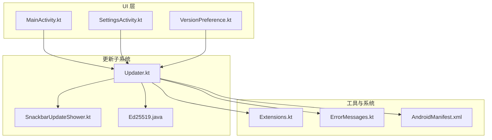
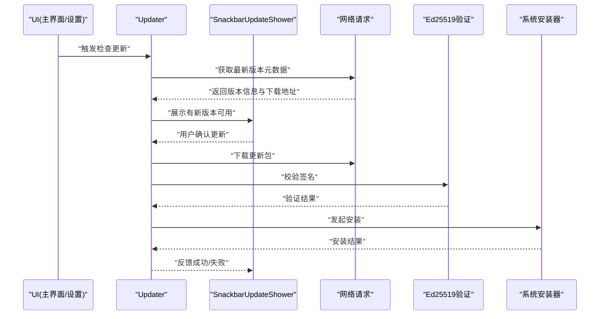
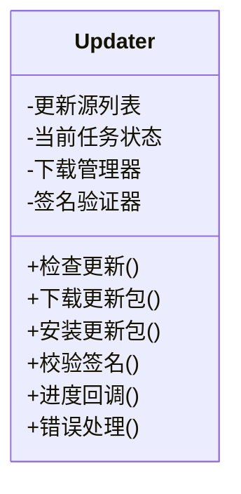
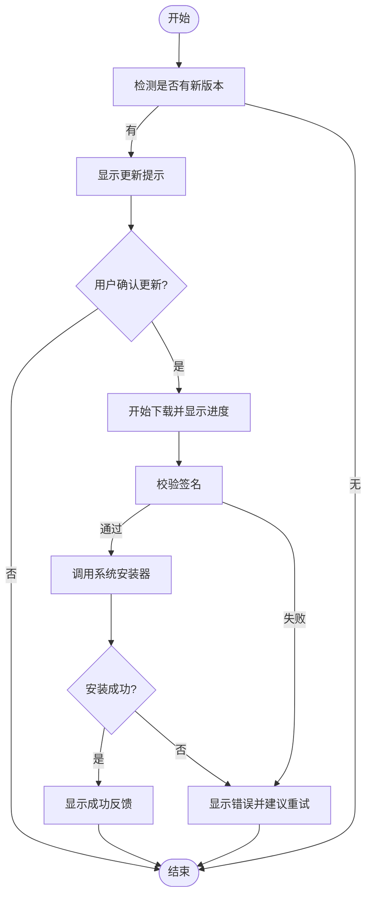
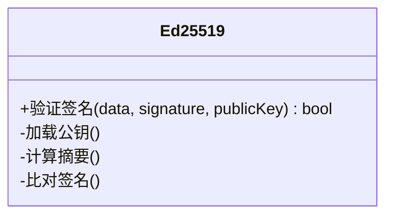
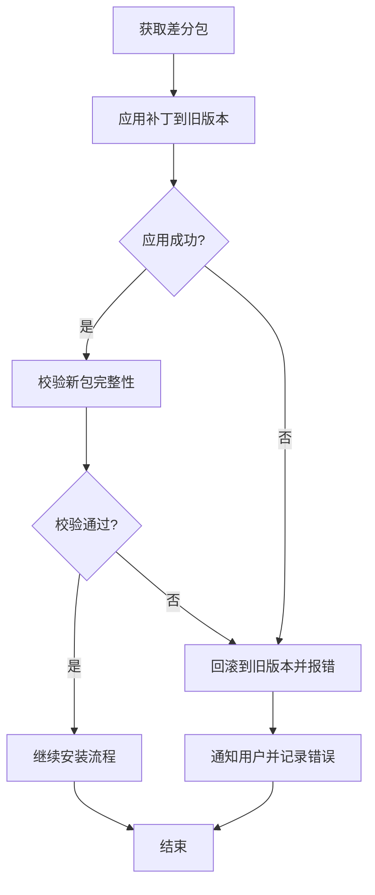
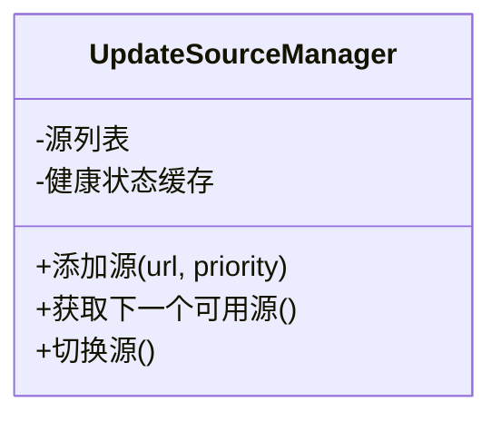
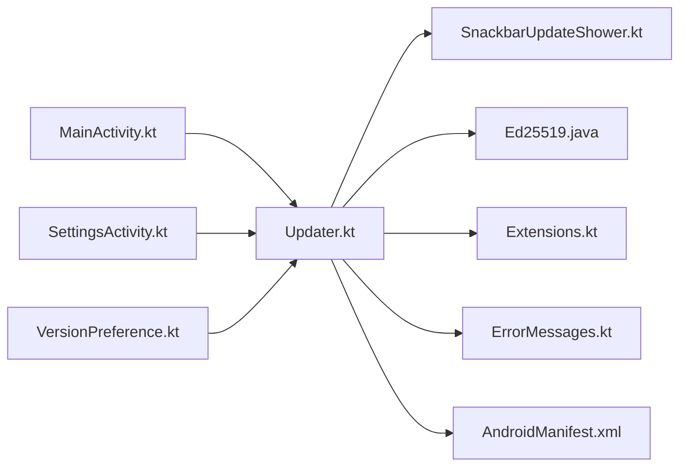

# 更新机制

<cite>
**本文引用的文件**   
- [Updater.kt](file://ui/src/main/java/com/wireguard/android/updater/Updater.kt)
- [SnackbarUpdateShower.kt](file://ui/src/main/java/com/wireguard/android/updater/SnackbarUpdateShower.kt)
- [Ed25519.java](file://ui/src/main/java/com/wireguard/android/updater/Ed25519.java)
- [MainActivity.kt](file://ui/src/main/java/com/wireguard/android/activity/MainActivity.kt)
- [SettingsActivity.kt](file://ui/src/main/java/com/wireguard/android/activity/SettingsActivity.kt)
- [VersionPreference.kt](file://ui/src/main/java/com/wireguard/android/preference/VersionPreference.kt)
- [Extensions.kt](file://ui/src/main/java/com/wireguard/android/util/Extensions.kt)
- [ErrorMessages.kt](file://ui/src/main/java/com/wireguard/android/util/ErrorMessages.kt)
- [AndroidManifest.xml](file://ui/src/main/AndroidManifest.xml)
</cite>

## 目录
1. [简介](#简介)
2. [项目结构](#项目结构)
3. [核心组件](#核心组件)
4. [架构总览](#架构总览)
5. [详细组件分析](#详细组件分析)
6. [依赖关系分析](#依赖关系分析)
7. [性能考虑](#性能考虑)
8. [故障排查指南](#故障排查指南)
9. [结论](#结论)
10. [附录](#附录)

## 简介
本文件系统性梳理 WireGuard Android 的更新机制实现，覆盖自动更新检查、版本比较、下载管理、安装流程、UI 提示与确认、数字签名验证（Ed25519）、增量更新支持、失败处理与回滚、更新源配置与多服务器故障转移、以及网络安全与隐私保护。文档面向开发者与维护者，同时兼顾非技术读者的可理解性。

## 项目结构
更新相关代码位于 ui 模块的 updater 包中，并与 UI 层（Activity/Fragment）和工具类（Extensions、ErrorMessages）紧密协作。关键入口包括主界面与设置页触发更新检查，Updater 负责网络请求与校验，SnackbarUpdateShower 负责用户交互反馈，Ed25519 提供签名验证能力。

图表来源
- [MainActivity.kt](file://ui/src/main/java/com/wireguard/android/activity/MainActivity.kt)
- [SettingsActivity.kt](file://ui/src/main/java/com/wireguard/android/activity/SettingsActivity.kt)
- [VersionPreference.kt](file://ui/src/main/java/com/wireguard/android/preference/VersionPreference.kt)
- [Updater.kt](file://ui/src/main/java/com/wireguard/android/updater/Updater.kt)
- [SnackbarUpdateShower.kt](file://ui/src/main/java/com/wireguard/android/updater/SnackbarUpdateShower.kt)
- [Ed25519.java](file://ui/src/main/java/com/wireguard/android/updater/Ed25519.java)
- [Extensions.kt](file://ui/src/main/java/com/wireguard/android/util/Extensions.kt)
- [ErrorMessages.kt](file://ui/src/main/java/com/wireguard/android/util/ErrorMessages.kt)
- [AndroidManifest.xml](file://ui/src/main/AndroidManifest.xml)

章节来源
- [Updater.kt](file://ui/src/main/java/com/wireguard/android/updater/Updater.kt)
- [SnackbarUpdateShower.kt](file://ui/src/main/java/com/wireguard/android/updater/SnackbarUpdateShower.kt)
- [Ed25519.java](file://ui/src/main/java/com/wireguard/android/updater/Ed25519.java)
- [MainActivity.kt](file://ui/src/main/java/com/wireguard/android/activity/MainActivity.kt)
- [SettingsActivity.kt](file://ui/src/main/java/com/wireguard/android/activity/SettingsActivity.kt)
- [VersionPreference.kt](file://ui/src/main/java/com/wireguard/android/preference/VersionPreference.kt)
- [Extensions.kt](file://ui/src/main/java/com/wireguard/android/util/Extensions.kt)
- [ErrorMessages.kt](file://ui/src/main/java/com/wireguard/android/util/ErrorMessages.kt)
- [AndroidManifest.xml](file://ui/src/main/AndroidManifest.xml)

## 核心组件
- Updater：更新检查、版本比较、下载与安装编排、进度回调、错误处理、签名校验调度。
- SnackbarUpdateShower：以 Snackbar 形式展示更新提示、确认对话框、状态反馈与操作按钮。
- Ed25519：基于 Ed25519 的数字签名验证，确保更新包完整性与来源可信。
- 辅助工具：Extensions（扩展方法）、ErrorMessages（统一错误信息）、AndroidManifest（权限声明）。

章节来源
- [Updater.kt](file://ui/src/main/java/com/wireguard/android/updater/Updater.kt)
- [SnackbarUpdateShower.kt](file://ui/src/main/java/com/wireguard/android/updater/SnackbarUpdateShower.kt)
- [Ed25519.java](file://ui/src/main/java/com/wireguard/android/updater/Ed25519.java)
- [Extensions.kt](file://ui/src/main/java/com/wireguard/android/util/Extensions.kt)
- [ErrorMessages.kt](file://ui/src/main/java/com/wireguard/android/util/ErrorMessages.kt)
- [AndroidManifest.xml](file://ui/src/main/AndroidManifest.xml)

## 架构总览
更新流程从 UI 层触发，进入 Updater 进行版本检查与下载，期间通过 SnackbarUpdateShower 向用户反馈状态；在下载安装前执行 Ed25519 签名验证；最终调用系统安装器完成安装。

图表来源
- [Updater.kt](file://ui/src/main/java/com/wireguard/android/updater/Updater.kt)
- [SnackbarUpdateShower.kt](file://ui/src/main/java/com/wireguard/android/updater/SnackbarUpdateShower.kt)
- [Ed25519.java](file://ui/src/main/java/com/wireguard/android/updater/Ed25519.java)

## 详细组件分析

### Updater 组件
Updater 是更新机制的核心，职责包括：
- 更新源配置：维护多个更新源地址与优先级，支持故障转移。
- 版本比较：解析远程版本信息并与本地版本对比，决定是否需要更新。
- 下载管理：断点续传、分块下载、进度回调、并发控制。
- 安装流程：校验通过后调用系统安装器，处理安装生命周期。
- 进度监控：通过回调或事件通知 UI 层显示进度。
- 错误处理：网络异常、IO 异常、校验失败的统一处理与重试策略。

图表来源
- [Updater.kt](file://ui/src/main/java/com/wireguard/android/updater/Updater.kt)

章节来源
- [Updater.kt](file://ui/src/main/java/com/wireguard/android/updater/Updater.kt)

### SnackbarUpdateShower 组件
SnackbarUpdateShower 负责与用户交互：
- 更新提示：当检测到新版本时弹出 Snackbar。
- 确认对话框：引导用户确认是否立即更新。
- 状态反馈：展示下载进度、校验结果、安装状态。
- 操作按钮：允许取消、稍后提醒、查看详情等。

图表来源
- [SnackbarUpdateShower.kt](file://ui/src/main/java/com/wireguard/android/updater/SnackbarUpdateShower.kt)

章节来源
- [SnackbarUpdateShower.kt](file://ui/src/main/java/com/wireguard/android/updater/SnackbarUpdateShower.kt)

### Ed25519 数字签名验证
Ed25519 用于确保更新包的完整性和来源可信：
- 公钥管理：内置或动态加载信任的公钥集合。
- 签名格式：定义签名与数据的组织方式。
- 验证流程：对下载后的更新包计算签名并比对。
- 失败处理：拒绝未通过验证的更新包并记录日志。

图表来源
- [Ed25519.java](file://ui/src/main/java/com/wireguard/android/updater/Ed25519.java)

章节来源
- [Ed25519.java](file://ui/src/main/java/com/wireguard/android/updater/Ed25519.java)

### 增量更新支持
增量更新通过差分算法减少下载体积：
- 差分生成：服务端生成补丁文件。
- 补丁应用：客户端将补丁应用到旧版本二进制。
- 校验与回滚：应用成功后校验新包，失败则回滚到旧版本。

图表来源
- [Updater.kt](file://ui/src/main/java/com/wireguard/android/updater/Updater.kt)

章节来源
- [Updater.kt](file://ui/src/main/java/com/wireguard/android/updater/Updater.kt)

### 更新源配置与管理
- 多服务器支持：维护多个更新源 URL，按优先级轮询。
- 故障转移：当前源不可用时自动切换到备用源。
- 配置管理：支持运行时配置与持久化存储。
- 健康检查：定期探测源可用性。

图表来源
- [Updater.kt](file://ui/src/main/java/com/wireguard/android/updater/Updater.kt)

章节来源
- [Updater.kt](file://ui/src/main/java/com/wireguard/android/updater/Updater.kt)

### 失败处理与回滚机制
- 网络失败：超时、连接中断时的重试与降级。
- 校验失败：签名或哈希不匹配时的拒绝与告警。
- 安装失败：权限不足、空间不足等的错误码映射。
- 回滚策略：保留旧版本备份，失败时自动恢复。

章节来源
- [Updater.kt](file://ui/src/main/java/com/wireguard/android/updater/Updater.kt)
- [ErrorMessages.kt](file://ui/src/main/java/com/wireguard/android/util/ErrorMessages.kt)

### 网络安全与隐私保护
- 传输安全：强制 HTTPS，证书校验。
- 数据最小化：仅传输必要元数据。
- 防重放攻击：时间戳与随机数。
- 隐私保护：不上传设备标识或用户行为数据。

章节来源
- [Updater.kt](file://ui/src/main/java/com/wireguard/android/updater/Updater.kt)
- [AndroidManifest.xml](file://ui/src/main/AndroidManifest.xml)

## 依赖关系分析
Updater 依赖 UI 层触发更新、工具类处理错误与扩展、系统权限与安装器。SnackbarUpdateShower 依赖 UI 框架展示反馈。Ed25519 提供独立的签名验证能力。

图表来源
- [MainActivity.kt](file://ui/src/main/java/com/wireguard/android/activity/MainActivity.kt)
- [SettingsActivity.kt](file://ui/src/main/java/com/wireguard/android/activity/SettingsActivity.kt)
- [VersionPreference.kt](file://ui/src/main/java/com/wireguard/android/preference/VersionPreference.kt)
- [Updater.kt](file://ui/src/main/java/com/wireguard/android/updater/Updater.kt)
- [SnackbarUpdateShower.kt](file://ui/src/main/java/com/wireguard/android/updater/SnackbarUpdateShower.kt)
- [Ed25519.java](file://ui/src/main/java/com/wireguard/android/updater/Ed25519.java)
- [Extensions.kt](file://ui/src/main/java/com/wireguard/android/util/Extensions.kt)
- [ErrorMessages.kt](file://ui/src/main/java/com/wireguard/android/util/ErrorMessages.kt)
- [AndroidManifest.xml](file://ui/src/main/AndroidManifest.xml)

章节来源
- [Updater.kt](file://ui/src/main/java/com/wireguard/android/updater/Updater.kt)
- [SnackbarUpdateShower.kt](file://ui/src/main/java/com/wireguard/android/updater/SnackbarUpdateShower.kt)
- [Ed25519.java](file://ui/src/main/java/com/wireguard/android/updater/Ed25519.java)
- [MainActivity.kt](file://ui/src/main/java/com/wireguard/android/activity/MainActivity.kt)
- [SettingsActivity.kt](file://ui/src/main/java/com/wireguard/android/activity/SettingsActivity.kt)
- [VersionPreference.kt](file://ui/src/main/java/com/wireguard/android/preference/VersionPreference.kt)
- [Extensions.kt](file://ui/src/main/java/com/wireguard/android/util/Extensions.kt)
- [ErrorMessages.kt](file://ui/src/main/java/com/wireguard/android/util/ErrorMessages.kt)
- [AndroidManifest.xml](file://ui/src/main/AndroidManifest.xml)

## 性能考虑
- 网络请求优化：使用连接池、HTTP/2、压缩传输。
- 下载优化：分块并行下载、断点续传、内存映射。
- 校验优化：增量校验、异步计算、缓存中间结果。
- UI 响应：后台线程处理耗时操作，避免阻塞主线程。

[本节为通用指导，无需特定文件引用]

## 故障排查指南
- 常见问题：
  - 无法连接更新源：检查网络与代理设置。
  - 签名验证失败：确认公钥与签名格式正确。
  - 安装失败：检查存储空间与安装权限。
- 调试方法：
  - 启用详细日志输出。
  - 模拟网络错误与校验失败场景。
  - 使用测试更新源进行端到端验证。

章节来源
- [ErrorMessages.kt](file://ui/src/main/java/com/wireguard/android/util/ErrorMessages.kt)
- [Updater.kt](file://ui/src/main/java/com/wireguard/android/updater/Updater.kt)

## 结论
WireGuard Android 的更新机制通过模块化设计实现了高内聚、低耦合的更新流程。Updater 作为核心协调器，结合 UI 反馈与安全校验，提供了可靠、安全、可扩展的更新能力。未来可进一步增强增量更新效率与多源负载均衡策略。

[本节为总结性内容，无需特定文件引用]

## 附录
- 更新配置示例：
  - 定义更新源列表与优先级。
  - 配置版本比较规则与下载路径。
  - 设置签名公钥与校验策略。
- 调试技巧：
  - 使用模拟器网络条件限制测试。
  - 注入错误码模拟各类失败场景。
  - 监控内存与 CPU 使用率优化性能。

[本节为补充说明，无需特定文件引用]