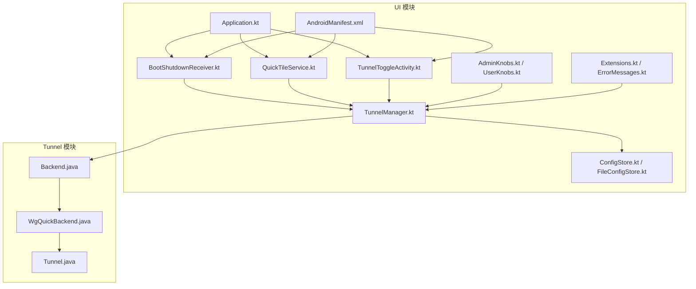
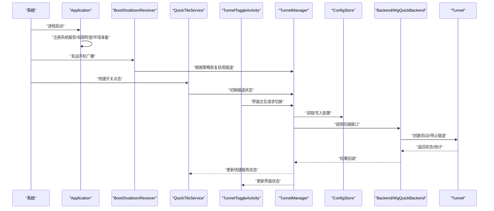
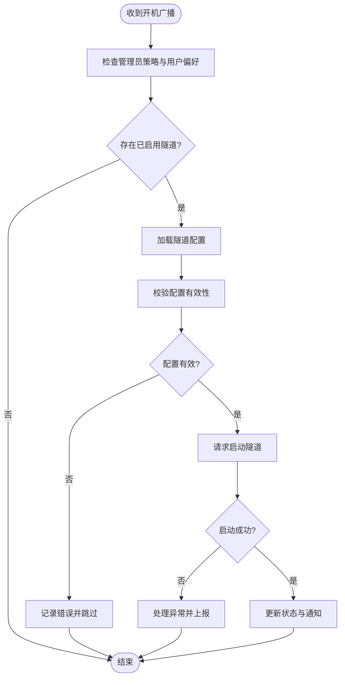
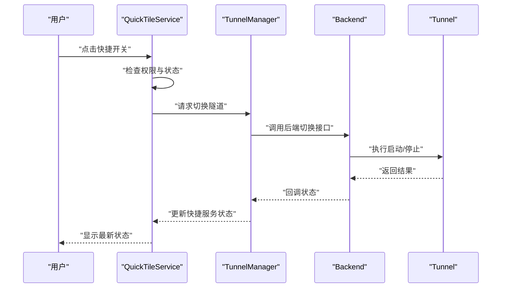
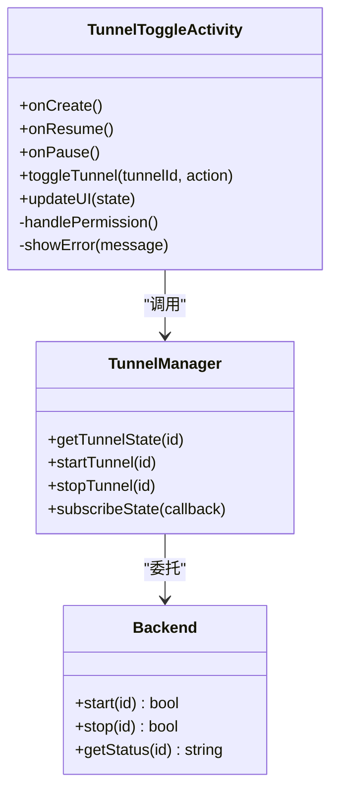
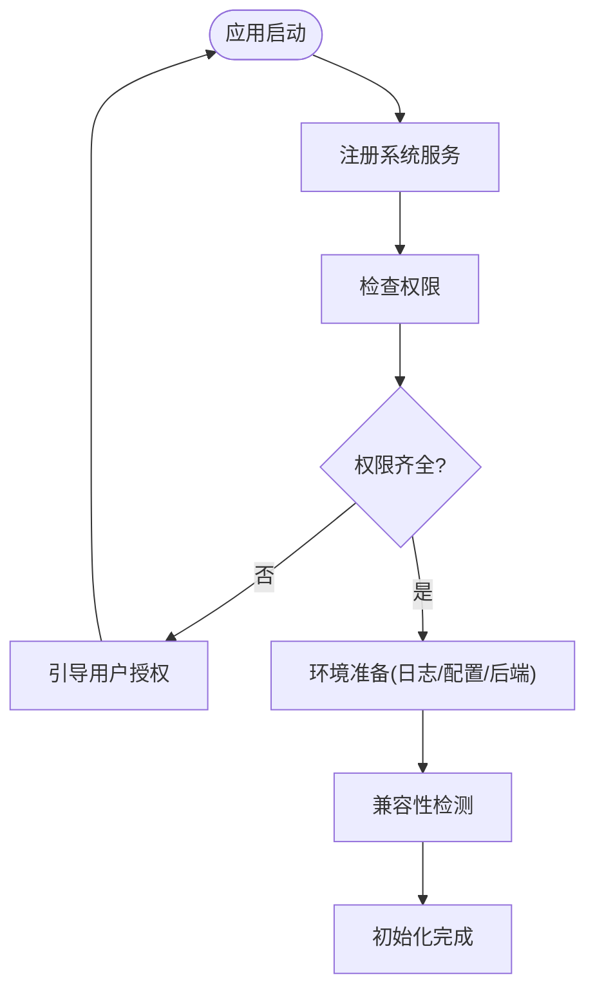
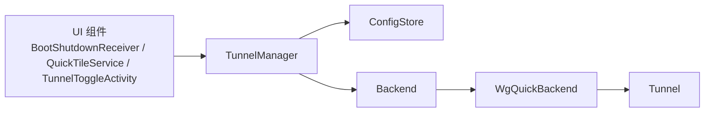

# 系统集成功能

<cite>
**本文引用的文件**   
- [AndroidManifest.xml](file://ui/src/main/AndroidManifest.xml)
- [BootShutdownReceiver.kt](file://ui/src/main/java/com/wireguard/android/BootShutdownReceiver.kt)
- [QuickTileService.kt](file://ui/src/main/java/com/wireguard/android/QuickTileService.kt)
- [TunnelToggleActivity.kt](file://ui/src/main/java/com/wireguard/android/activity/TunnelToggleActivity.kt)
- [Application.kt](file://ui/src/main/java/com/wireguard/android/Application.kt)
- [Backend.java](file://tunnel/src/main/java/com/wireguard/android/backend/Backend.java)
- [WgQuickBackend.java](file://tunnel/src/main/java/com/wireguard/android/backend/WgQuickBackend.java)
- [Tunnel.java](file://tunnel/src/main/java/com/wireguard/android/backend/Tunnel.java)
- [ConfigStore.kt](file://ui/src/main/java/com/wireguard/android/configStore/ConfigStore.kt)
- [FileConfigStore.kt](file://ui/src/main/java/com/wireguard/android/configStore/FileConfigStore.kt)
- [TunnelManager.kt](file://ui/src/main/java/com/wireguard/android/model/TunnelManager.kt)
- [AdminKnobs.kt](file://ui/src/main/java/com/wireguard/android/util/AdminKnobs.kt)
- [UserKnobs.kt](file://ui/src/main/java/com/wireguard/android/util/UserKnobs.kt)
- [Extensions.kt](file://ui/src/main/java/com/wireguard/android/util/Extensions.kt)
- [ErrorMessages.kt](file://ui/src/main/java/com/wireguard/android/util/ErrorMessages.kt)
- [preferences.xml](file://ui/src/main/res/xml/preferences.xml)
</cite>

## 目录
1. [简介](#简介)
2. [项目结构](#项目结构)
3. [核心组件](#核心组件)
4. [架构总览](#架构总览)
5. [详细组件分析](#详细组件分析)
6. [依赖关系分析](#依赖关系分析)
7. [性能考量](#性能考量)
8. [故障排查指南](#故障排查指南)
9. [结论](#结论)
10. [附录](#附录)

## 简介
本文件聚焦 WireGuard Android 的系统集成功能，围绕开机自启动、快捷服务、隧道切换活动与应用初始化流程展开，详细说明与 Android 系统服务的集成方式（网络权限、VPN 服务、通知管理）、电池优化适配（白名单与后台限制处理）、系统事件监听与处理机制，并给出配置选项与调试方法。文档同时涵盖系统兼容性处理与异常恢复机制，帮助读者全面理解该模块的设计与实现。

## 项目结构
WireGuard Android 采用多模块组织：UI 层负责用户交互与系统集成入口，Tunnel 层封装底层后端与配置模型。系统集成的关键入口包括广播接收器、快捷服务、切换活动与应用初始化类；它们通过配置存储与隧道管理器协调 VPN 生命周期与状态同步。

图表来源
- [AndroidManifest.xml](file://ui/src/main/AndroidManifest.xml)
- [Application.kt](file://ui/src/main/java/com/wireguard/android/Application.kt)
- [BootShutdownReceiver.kt](file://ui/src/main/java/com/wireguard/android/BootShutdownReceiver.kt)
- [QuickTileService.kt](file://ui/src/main/java/com/wireguard/android/QuickTileService.kt)
- [TunnelToggleActivity.kt](file://ui/src/main/java/com/wireguard/android/activity/TunnelToggleActivity.kt)
- [ConfigStore.kt](file://ui/src/main/java/com/wireguard/android/configStore/ConfigStore.kt)
- [FileConfigStore.kt](file://ui/src/main/java/com/wireguard/android/configStore/FileConfigStore.kt)
- [TunnelManager.kt](file://ui/src/main/java/com/wireguard/android/model/TunnelManager.kt)
- [Backend.java](file://tunnel/src/main/java/com/wireguard/android/backend/Backend.java)
- [WgQuickBackend.java](file://tunnel/src/main/java/com/wireguard/android/backend/WgQuickBackend.java)
- [Tunnel.java](file://tunnel/src/main/java/com/wireguard/android/backend/Tunnel.java)

章节来源
- [AndroidManifest.xml](file://ui/src/main/AndroidManifest.xml)
- [Application.kt](file://ui/src/main/java/com/wireguard/android/Application.kt)
- [BootShutdownReceiver.kt](file://ui/src/main/java/com/wireguard/android/BootShutdownReceiver.kt)
- [QuickTileService.kt](file://ui/src/main/java/com/wireguard/android/QuickTileService.kt)
- [TunnelToggleActivity.kt](file://ui/src/main/java/com/wireguard/android/activity/TunnelToggleActivity.kt)
- [ConfigStore.kt](file://ui/src/main/java/com/wireguard/android/configStore/ConfigStore.kt)
- [FileConfigStore.kt](file://ui/src/main/java/com/wireguard/android/configStore/FileConfigStore.kt)
- [TunnelManager.kt](file://ui/src/main/java/com/wireguard/android/model/TunnelManager.kt)
- [Backend.java](file://tunnel/src/main/java/com/wireguard/android/backend/Backend.java)
- [WgQuickBackend.java](file://tunnel/src/main/java/com/wireguard/android/backend/WgQuickBackend.java)
- [Tunnel.java](file://tunnel/src/main/java/com/wireguard/android/backend/Tunnel.java)

## 核心组件
- 应用初始化 Application：负责系统服务注册、权限检查与环境准备，确保后续组件可用。
- 开机自启动 BootShutdownReceiver：监听系统开机广播，按策略恢复已启用的隧道。
- 快捷服务 QuickTileService：提供快速开关控制与状态同步，响应系统快捷开关事件。
- 隧道切换活动 TunnelToggleActivity：提供界面交互与状态管理，用于临时切换或展示隧道状态。
- 配置存储 ConfigStore/FileConfigStore：持久化与读取隧道配置。
- 隧道管理器 TunnelManager：协调隧道生命周期、状态与后端操作。
- 后端 Backend/WgQuickBackend/Tunnel：封装底层 VPN 能力与隧道实例。

章节来源
- [Application.kt](file://ui/src/main/java/com/wireguard/android/Application.kt)
- [BootShutdownReceiver.kt](file://ui/src/main/java/com/wireguard/android/BootShutdownReceiver.kt)
- [QuickTileService.kt](file://ui/src/main/java/com/wireguard/android/QuickTileService.kt)
- [TunnelToggleActivity.kt](file://ui/src/main/java/com/wireguard/android/activity/TunnelToggleActivity.kt)
- [ConfigStore.kt](file://ui/src/main/java/com/wireguard/android/configStore/ConfigStore.kt)
- [FileConfigStore.kt](file://ui/src/main/java/com/wireguard/android/configStore/FileConfigStore.kt)
- [TunnelManager.kt](file://ui/src/main/java/com/wireguard/android/model/TunnelManager.kt)
- [Backend.java](file://tunnel/src/main/java/com/wireguard/android/backend/Backend.java)
- [WgQuickBackend.java](file://tunnel/src/main/java/com/wireguard/android/backend/WgQuickBackend.java)
- [Tunnel.java](file://tunnel/src/main/java/com/wireguard/android/backend/Tunnel.java)

## 架构总览
下图展示了系统集成的整体交互：应用初始化后，广播接收器与快捷服务作为系统事件入口，统一交由隧道管理器协调后端执行，并通过配置存储读写配置。

图表来源
- [Application.kt](file://ui/src/main/java/com/wireguard/android/Application.kt)
- [BootShutdownReceiver.kt](file://ui/src/main/java/com/wireguard/android/BootShutdownReceiver.kt)
- [QuickTileService.kt](file://ui/src/main/java/com/wireguard/android/QuickTileService.kt)
- [TunnelToggleActivity.kt](file://ui/src/main/java/com/wireguard/android/activity/TunnelToggleActivity.kt)
- [TunnelManager.kt](file://ui/src/main/java/com/wireguard/android/model/TunnelManager.kt)
- [ConfigStore.kt](file://ui/src/main/java/com/wireguard/android/configStore/ConfigStore.kt)
- [Backend.java](file://tunnel/src/main/java/com/wireguard/android/backend/Backend.java)
- [WgQuickBackend.java](file://tunnel/src/main/java/com/wireguard/android/backend/WgQuickBackend.java)
- [Tunnel.java](file://tunnel/src/main/java/com/wireguard/android/backend/Tunnel.java)

## 详细组件分析

### 开机自启动机制（BootShutdownReceiver）
- 设计目标：在系统启动完成后自动恢复用户已启用的隧道，保证连接可用性。
- 广播接收器注册：通过清单文件声明接收开机广播，避免动态注册导致的遗漏。
- 启动策略：读取配置中“上次启用”的隧道，结合管理员策略与用户偏好决定是否恢复。
- 错误处理：捕获启动失败异常，记录错误信息并降级为不启动，避免影响系统启动流程。
- 兼容性：针对不同 Android 版本的开机广播行为进行兼容处理。

图表来源
- [BootShutdownReceiver.kt](file://ui/src/main/java/com/wireguard/android/BootShutdownReceiver.kt)
- [ConfigStore.kt](file://ui/src/main/java/com/wireguard/android/configStore/ConfigStore.kt)
- [TunnelManager.kt](file://ui/src/main/java/com/wireguard/android/model/TunnelManager.kt)
- [Backend.java](file://tunnel/src/main/java/com/wireguard/android/backend/Backend.java)

章节来源
- [BootShutdownReceiver.kt](file://ui/src/main/java/com/wireguard/android/BootShutdownReceiver.kt)
- [AndroidManifest.xml](file://ui/src/main/AndroidManifest.xml)
- [ConfigStore.kt](file://ui/src/main/java/com/wireguard/android/configStore/ConfigStore.kt)
- [TunnelManager.kt](file://ui/src/main/java/com/wireguard/android/model/TunnelManager.kt)
- [Backend.java](file://tunnel/src/main/java/com/wireguard/android/backend/Backend.java)

### 快捷服务（QuickTileService）
- 功能概述：提供系统快捷开关的快速控制与状态同步，支持一键开启/关闭指定隧道。
- 状态同步：监听隧道状态变化，实时更新快捷图标与提示文本。
- 权限检查：在执行切换前检查必要的系统权限（如 VPN 授权），必要时引导用户完成授权。
- 异常恢复：对启动失败进行重试或回退，确保用户体验稳定。

图表来源
- [QuickTileService.kt](file://ui/src/main/java/com/wireguard/android/QuickTileService.kt)
- [TunnelManager.kt](file://ui/src/main/java/com/wireguard/android/model/TunnelManager.kt)
- [Backend.java](file://tunnel/src/main/java/com/wireguard/android/backend/Backend.java)
- [Tunnel.java](file://tunnel/src/main/java/com/wireguard/android/backend/Tunnel.java)

章节来源
- [QuickTileService.kt](file://ui/src/main/java/com/wireguard/android/QuickTileService.kt)
- [TunnelManager.kt](file://ui/src/main/java/com/wireguard/android/model/TunnelManager.kt)
- [Backend.java](file://tunnel/src/main/java/com/wireguard/android/backend/Backend.java)
- [Tunnel.java](file://tunnel/src/main/java/com/wireguard/android/backend/Tunnel.java)

### 隧道切换活动（TunnelToggleActivity）
- 界面交互：提供可视化的隧道开关按钮与状态指示，支持多隧道选择与批量操作。
- 状态管理：实时订阅隧道状态变更，保持界面与后端一致。
- 权限与引导：当缺少必要权限时，引导用户完成授权流程。
- 错误处理：捕获异常并展示友好提示，支持重试与回退。

图表来源
- [TunnelToggleActivity.kt](file://ui/src/main/java/com/wireguard/android/activity/TunnelToggleActivity.kt)
- [TunnelManager.kt](file://ui/src/main/java/com/wireguard/android/model/TunnelManager.kt)
- [Backend.java](file://tunnel/src/main/java/com/wireguard/android/backend/Backend.java)

章节来源
- [TunnelToggleActivity.kt](file://ui/src/main/java/com/wireguard/android/activity/TunnelToggleActivity.kt)
- [TunnelManager.kt](file://ui/src/main/java/com/wireguard/android/model/TunnelManager.kt)
- [Backend.java](file://tunnel/src/main/java/com/wireguard/android/backend/Backend.java)

### 应用初始化流程（Application）
- 系统服务注册：注册必要的系统服务（如通知、权限、电池优化相关）。
- 权限检查：验证 VPN 权限、悬浮窗权限等，缺失时引导用户授权。
- 环境准备：初始化日志、配置存储、后端库加载与版本兼容性检测。
- 异常恢复：捕获初始化异常，记录诊断信息并提供降级路径。

图表来源
- [Application.kt](file://ui/src/main/java/com/wireguard/android/Application.kt)
- [AdminKnobs.kt](file://ui/src/main/java/com/wireguard/android/util/AdminKnobs.kt)
- [UserKnobs.kt](file://ui/src/main/java/com/wireguard/android/util/UserKnobs.kt)
- [Extensions.kt](file://ui/src/main/java/com/wireguard/android/util/Extensions.kt)

章节来源
- [Application.kt](file://ui/src/main/java/com/wireguard/android/Application.kt)
- [AdminKnobs.kt](file://ui/src/main/java/com/wireguard/android/util/AdminKnobs.kt)
- [UserKnobs.kt](file://ui/src/main/java/com/wireguard/android/util/UserKnobs.kt)
- [Extensions.kt](file://ui/src/main/java/com/wireguard/android/util/Extensions.kt)

### 与 Android 系统服务的集成
- 网络权限：申请并检查网络访问权限，确保隧道可建立网络连接。
- VPN 服务：通过系统 VPN 框架创建与绑定服务，管理生命周期与路由规则。
- 通知管理：创建前台通知以维持服务运行，显示连接状态与统计数据。
- 电池优化：处理 Doze 模式与后台限制，必要时引导加入白名单。

章节来源
- [AndroidManifest.xml](file://ui/src/main/AndroidManifest.xml)
- [Backend.java](file://tunnel/src/main/java/com/wireguard/android/backend/Backend.java)
- [WgQuickBackend.java](file://tunnel/src/main/java/com/wireguard/android/backend/WgQuickBackend.java)
- [Tunnel.java](file://tunnel/src/main/java/com/wireguard/android/backend/Tunnel.java)

### 电池优化适配
- 白名单设置：检测并引导用户将应用加入省电白名单，避免被系统杀死。
- 后台运行限制：针对高版本系统的后台限制，使用前台服务与通知保持活跃。
- 兼容性处理：对不同厂商定制系统进行适配，提升稳定性。

章节来源
- [AdminKnobs.kt](file://ui/src/main/java/com/wireguard/android/util/AdminKnobs.kt)
- [UserKnobs.kt](file://ui/src/main/java/com/wireguard/android/util/UserKnobs.kt)
- [Extensions.kt](file://ui/src/main/java/com/wireguard/android/util/Extensions.kt)

### 系统事件监听与处理机制
- 广播监听：开机、网络状态变化、屏幕开关等事件监听与处理。
- 状态同步：事件触发后更新隧道状态与 UI，保持一致性。
- 异常恢复：对不可恢复的错误进行降级与提示。

章节来源
- [BootShutdownReceiver.kt](file://ui/src/main/java/com/wireguard/android/BootShutdownReceiver.kt)
- [QuickTileService.kt](file://ui/src/main/java/com/wireguard/android/QuickTileService.kt)
- [TunnelToggleActivity.kt](file://ui/src/main/java/com/wireguard/android/activity/TunnelToggleActivity.kt)

### 配置选项与调试方法
- 配置选项：通过 preferences.xml 暴露用户可调参数，如默认隧道、快捷开关行为等。
- 调试方法：启用详细日志、导出配置与日志包、查看错误消息与堆栈。
- 兼容性测试：在不同 Android 版本与设备上验证行为一致性。

章节来源
- [preferences.xml](file://ui/src/main/res/xml/preferences.xml)
- [ErrorMessages.kt](file://ui/src/main/java/com/wireguard/android/util/ErrorMessages.kt)
- [Extensions.kt](file://ui/src/main/java/com/wireguard/android/util/Extensions.kt)

## 依赖关系分析
- 松耦合设计：UI 组件通过 TunnelManager 与后端交互，降低直接依赖。
- 配置解耦：ConfigStore 抽象了配置存取，便于替换实现。
- 后端抽象：Backend 接口统一不同实现（如 WgQuickBackend），提高扩展性。

图表来源
- [TunnelManager.kt](file://ui/src/main/java/com/wireguard/android/model/TunnelManager.kt)
- [ConfigStore.kt](file://ui/src/main/java/com/wireguard/android/configStore/ConfigStore.kt)
- [Backend.java](file://tunnel/src/main/java/com/wireguard/android/backend/Backend.java)
- [WgQuickBackend.java](file://tunnel/src/main/java/com/wireguard/android/backend/WgQuickBackend.java)
- [Tunnel.java](file://tunnel/src/main/java/com/wireguard/android/backend/Tunnel.java)

章节来源
- [TunnelManager.kt](file://ui/src/main/java/com/wireguard/android/model/TunnelManager.kt)
- [ConfigStore.kt](file://ui/src/main/java/com/wireguard/android/configStore/ConfigStore.kt)
- [Backend.java](file://tunnel/src/main/java/com/wireguard/android/backend/Backend.java)
- [WgQuickBackend.java](file://tunnel/src/main/java/com/wireguard/android/backend/WgQuickBackend.java)
- [Tunnel.java](file://tunnel/src/main/java/com/wireguard/android/backend/Tunnel.java)

## 性能考量
- 最小化阻塞：在 UI 线程外执行耗时操作，避免卡顿。
- 状态缓存：合理缓存隧道状态，减少频繁查询。
- 资源释放：及时释放后端资源与通知，防止内存泄漏。
- 日志级别：生产环境降低日志级别，减少 IO 开销。

[本节为通用指导，无需引用具体文件]

## 故障排查指南
- 常见问题：权限不足、VPN 未授权、电池优化导致服务被杀、配置无效。
- 排查步骤：检查权限与授权状态、查看通知与日志、导出诊断包、复现问题。
- 错误消息：利用 ErrorMessages 获取用户友好的提示信息。
- 恢复策略：重试、回退到安全模式、引导用户修复配置。

章节来源
- [ErrorMessages.kt](file://ui/src/main/java/com/wireguard/android/util/ErrorMessages.kt)
- [Extensions.kt](file://ui/src/main/java/com/wireguard/android/util/Extensions.kt)

## 结论
WireGuard Android 的系统集成功能通过广播接收器、快捷服务与切换活动实现了完善的开机自启动与快速控制能力。应用初始化流程确保了系统服务与权限的正确配置，配合配置存储与隧道管理器，形成了稳定的 VPN 生命周期管理。电池优化适配与异常恢复机制提升了在不同系统与设备上的兼容性。通过合理的架构设计与清晰的依赖关系，系统在可扩展性与可维护性方面表现良好。

## 附录
- 术语表：
  - 隧道：VPN 连接的逻辑实体，包含接口与对端配置。
  - 后端：封装底层 VPN 能力的抽象层。
  - 快捷服务：系统快捷开关对应的服务，提供快速控制。
- 参考清单：
  - 权限声明与组件注册见 AndroidManifest.xml。
  - 用户偏好与配置项见 preferences.xml。

[本节为补充说明，无需引用具体文件]