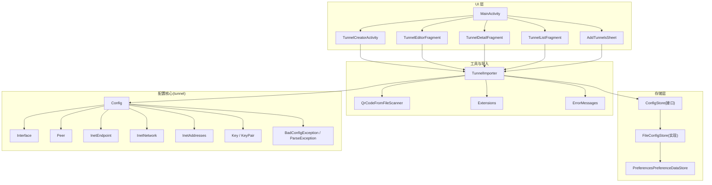
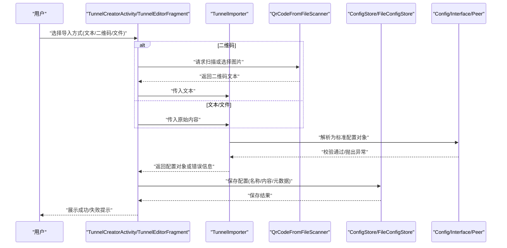
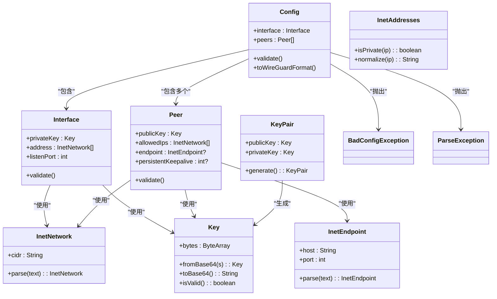
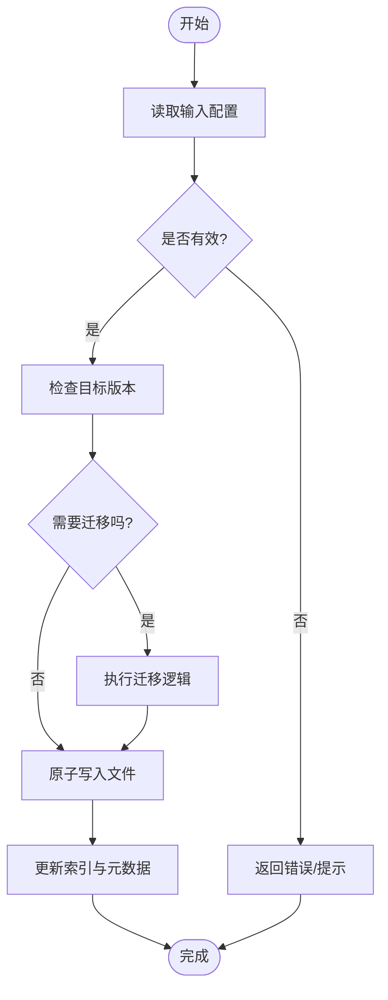
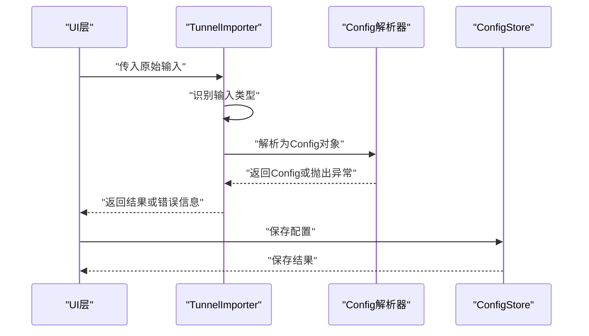
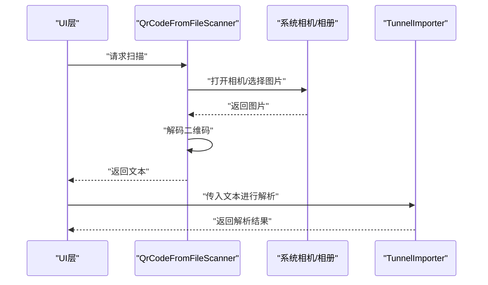
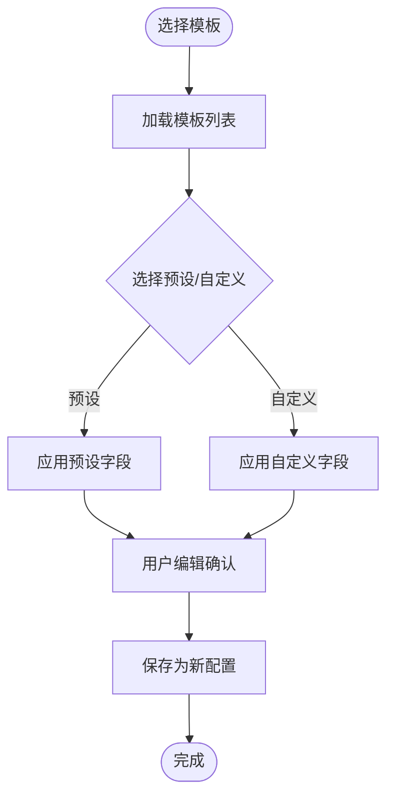
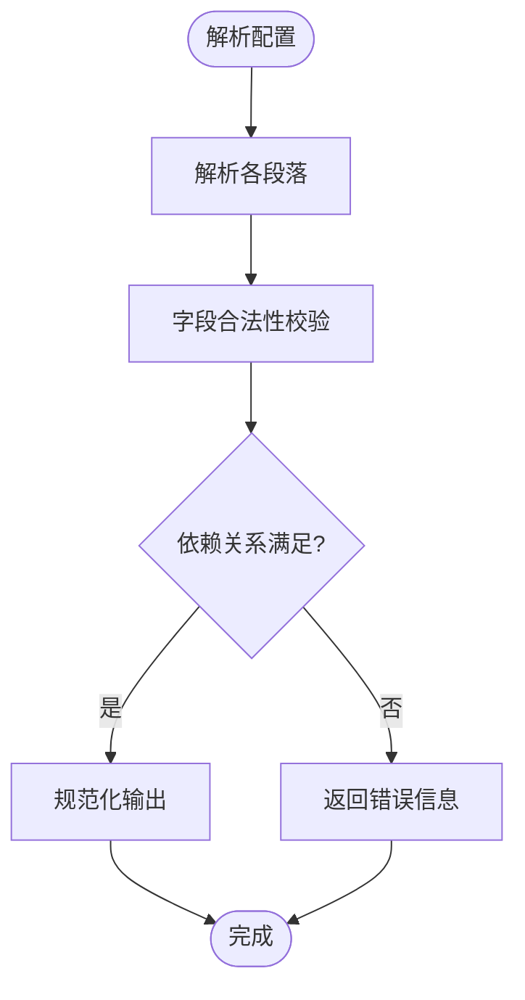
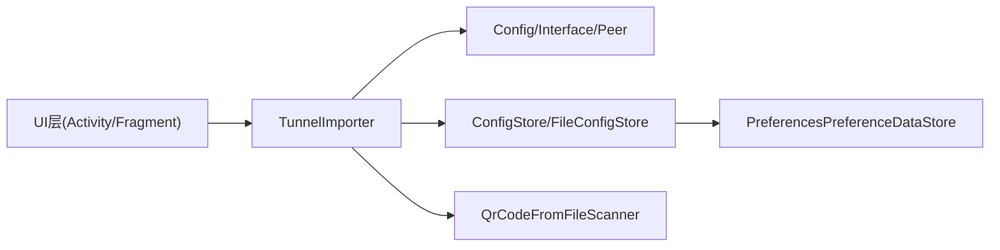

# 配置管理功能

<cite>
**本文档引用的文件**
- [ConfigStore.kt](file://ui/src/main/java/com/wireguard/android/configStore/ConfigStore.kt)
- [FileConfigStore.kt](file://ui/src/main/java/com/wireguard/android/configStore/FileConfigStore.kt)
- [TunnelImporter.kt](file://ui/src/main/java/com/wireguard/android/util/TunnelImporter.kt)
- [QrCodeFromFileScanner.kt](file://ui/src/main/java/com/wireguard/android/util/QrCodeFromFileScanner.kt)
- [Config.java](file://tunnel/src/main/java/com/wireguard/config/Config.java)
- [Interface.java](file://tunnel/src/main/java/com/wireguard/config/Interface.java)
- [Peer.java](file://tunnel/src/main/java/com/wireguard/config/Peer.java)
- [BadConfigException.java](file://tunnel/src/main/java/com/wireguard/config/BadConfigException.java)
- [ParseException.java](file://tunnel/src/main/java/com/wireguard/config/ParseException.java)
- [InetAddresses.java](file://tunnel/src/main/java/com/wireguard/config/InetAddresses.java)
- [InetEndpoint.java](file://tunnel/src/main/java/com/wireguard/config/InetEndpoint.java)
- [InetNetwork.java](file://tunnel/src/main/java/com/wireguard/config/InetNetwork.java)
- [Key.java](file://tunnel/src/main/java/com/wireguard/crypto/Key.java)
- [KeyPair.java](file://tunnel/src/main/java/com/wireguard/crypto/KeyPair.java)
- [KeyFormatException.java](file://tunnel/src/main/java/com/wireguard/crypto/KeyFormatException.java)
- [AddTunnelsSheet.kt](file://ui/src/main/java/com/wireguard/android/fragment/AddTunnelsSheet.kt)
- [TunnelCreatorActivity.kt](file://ui/src/main/java/com/wireguard/android/activity/TunnelCreatorActivity.kt)
- [TunnelEditorFragment.kt](file://ui/src/main/java/com/wireguard/android/fragment/TunnelEditorFragment.kt)
- [TunnelDetailFragment.kt](file://ui/src/main/java/com/wireguard/android/fragment/TunnelDetailFragment.kt)
- [TunnelListFragment.kt](file://ui/src/main/java/com/wireguard/android/fragment/TunnelListFragment.kt)
- [MainActivity.kt](file://ui/src/main/java/com/wireguard/android/activity/MainActivity.kt)
- [PreferencesPreferenceDataStore.kt](file://ui/src/main/java/com/wireguard/android/preference/PreferencesPreferenceDataStore.kt)
- [Extensions.kt](file://ui/src/main/java/com/wireguard/android/util/Extensions.kt)
- [ErrorMessages.kt](file://ui/src/main/java/com/wireguard/android/util/ErrorMessages.kt)
- [working.conf](file://tunnel/src/test/resources/working.conf)
- [broken.conf](file://tunnel/src/test/resources/broken.conf)
</cite>

## 目录
1. [简介](#简介)
2. [项目结构](#项目结构)
3. [核心组件](#核心组件)
4. [架构总览](#架构总览)
5. [详细组件分析](#详细组件分析)
6. [依赖关系分析](#依赖关系分析)
7. [性能考虑](#性能考虑)
8. [故障排查指南](#故障排查指南)
9. [结论](#结论)
10. [附录](#附录)

## 简介
本文件面向 WireGuard Android 的配置管理能力，系统性阐述配置文件导入导出、QR 码支持、文件扫描、存储与持久化、版本管理与迁移、模板系统、字段验证与依赖检查等关键实现。文档以“从接口到实现”的方式展开，帮助读者快速理解 ConfigStore 抽象、FileConfigStore 落地、TunnelImporter 多格式识别与校验、以及 QR 码扫描流程，并提供最佳实践与常见问题排查建议。

## 项目结构
配置管理相关代码主要分布在两个模块：
- tunnel 模块：定义配置模型与解析器（Config、Interface、Peer 等），提供严格的字段校验与错误类型。
- ui 模块：实现配置存储、导入导出、QR 码扫描、UI 交互与模板管理等上层能力。

图表来源
- [MainActivity.kt](file://ui/src/main/java/com/wireguard/android/activity/MainActivity.kt)
- [TunnelCreatorActivity.kt](file://ui/src/main/java/com/wireguard/android/activity/TunnelCreatorActivity.kt)
- [TunnelEditorFragment.kt](file://ui/src/main/java/com/wireguard/android/fragment/TunnelEditorFragment.kt)
- [TunnelDetailFragment.kt](file://ui/src/main/java/com/wireguard/android/fragment/TunnelDetailFragment.kt)
- [TunnelListFragment.kt](file://ui/src/main/java/com/wireguard/android/fragment/TunnelListFragment.kt)
- [AddTunnelsSheet.kt](file://ui/src/main/java/com/wireguard/android/fragment/AddTunnelsSheet.kt)
- [TunnelImporter.kt](file://ui/src/main/java/com/wireguard/android/util/TunnelImporter.kt)
- [QrCodeFromFileScanner.kt](file://ui/src/main/java/com/wireguard/android/util/QrCodeFromFileScanner.kt)
- [Extensions.kt](file://ui/src/main/java/com/wireguard/android/util/Extensions.kt)
- [ErrorMessages.kt](file://ui/src/main/java/com/wireguard/android/util/ErrorMessages.kt)
- [ConfigStore.kt](file://ui/src/main/java/com/wireguard/android/configStore/ConfigStore.kt)
- [FileConfigStore.kt](file://ui/src/main/java/com/wireguard/android/configStore/FileConfigStore.kt)
- [PreferencesPreferenceDataStore.kt](file://ui/src/main/java/com/wireguard/android/preference/PreferencesPreferenceDataStore.kt)
- [Config.java](file://tunnel/src/main/java/com/wireguard/config/Config.java)
- [Interface.java](file://tunnel/src/main/java/com/wireguard/config/Interface.java)
- [Peer.java](file://tunnel/src/main/java/com/wireguard/config/Peer.java)
- [InetEndpoint.java](file://tunnel/src/main/java/com/wireguard/config/InetEndpoint.java)
- [InetNetwork.java](file://tunnel/src/main/java/com/wireguard/config/InetNetwork.java)
- [InetAddresses.java](file://tunnel/src/main/java/com/wireguard/config/InetAddresses.java)
- [Key.java](file://tunnel/src/main/java/com/wireguard/crypto/Key.java)
- [KeyPair.java](file://tunnel/src/main/java/com/wireguard/crypto/KeyPair.java)
- [BadConfigException.java](file://tunnel/src/main/java/com/wireguard/config/BadConfigException.java)
- [ParseException.java](file://tunnel/src/main/java/com/wireguard/config/ParseException.java)

章节来源
- [ConfigStore.kt](file://ui/src/main/java/com/wireguard/android/configStore/ConfigStore.kt)
- [FileConfigStore.kt](file://ui/src/main/java/com/wireguard/android/configStore/FileConfigStore.kt)
- [TunnelImporter.kt](file://ui/src/main/java/com/wireguard/android/util/TunnelImporter.kt)
- [QrCodeFromFileScanner.kt](file://ui/src/main/java/com/wireguard/android/util/QrCodeFromFileScanner.kt)
- [Config.java](file://tunnel/src/main/java/com/wireguard/config/Config.java)
- [Interface.java](file://tunnel/src/main/java/com/wireguard/config/Interface.java)
- [Peer.java](file://tunnel/src/main/java/com/wireguard/config/Peer.java)
- [InetEndpoint.java](file://tunnel/src/main/java/com/wireguard/config/InetEndpoint.java)
- [InetNetwork.java](file://tunnel/src/main/java/com/wireguard/config/InetNetwork.java)
- [InetAddresses.java](file://tunnel/src/main/java/com/wireguard/config/InetAddresses.java)
- [Key.java](file://tunnel/src/main/java/com/wireguard/crypto/Key.java)
- [KeyPair.java](file://tunnel/src/main/java/com/wireguard/crypto/KeyPair.java)
- [BadConfigException.java](file://tunnel/src/main/java/com/wireguard/config/BadConfigException.java)
- [ParseException.java](file://tunnel/src/main/java/com/wireguard/config/ParseException.java)

## 核心组件
- 配置模型与校验（tunnel 模块）
  - Config、Interface、Peer 构成标准 .conf 的核心数据结构；InetEndpoint、InetNetwork、InetAddresses 负责地址与端点解析；Key/KeyPair 处理密钥；BadConfigException/ParseException 统一异常类型。
- 配置存储抽象与实现（ui 模块）
  - ConfigStore 定义配置的增删改查、批量操作与命名空间隔离；FileConfigStore 基于文件系统与偏好设置进行持久化，并负责版本与兼容性处理。
- 导入与多格式识别（ui 模块）
  - TunnelImporter 负责识别多种输入源（文本、二维码、文件、剪贴板等），执行标准化解析与校验，返回可落库的 Config 对象。
- QR 码扫描（ui 模块）
  - QrCodeFromFileScanner 封装图像读取与解码流程，提取二维码中的配置文本，供 TunnelImporter 进一步解析。

章节来源
- [Config.java](file://tunnel/src/main/java/com/wireguard/config/Config.java)
- [Interface.java](file://tunnel/src/main/java/com/wireguard/config/Interface.java)
- [Peer.java](file://tunnel/src/main/java/com/wireguard/config/Peer.java)
- [InetEndpoint.java](file://tunnel/src/main/java/com/wireguard/config/InetEndpoint.java)
- [InetNetwork.java](file://tunnel/src/main/java/com/wireguard/config/InetNetwork.java)
- [InetAddresses.java](file://tunnel/src/main/java/com/wireguard/config/InetAddresses.java)
- [Key.java](file://tunnel/src/main/java/com/wireguard/crypto/Key.java)
- [KeyPair.java](file://tunnel/src/main/java/com/wireguard/crypto/KeyPair.java)
- [BadConfigException.java](file://tunnel/src/main/java/com/wireguard/config/BadConfigException.java)
- [ParseException.java](file://tunnel/src/main/java/com/wireguard/config/ParseException.java)
- [ConfigStore.kt](file://ui/src/main/java/com/wireguard/android/configStore/ConfigStore.kt)
- [FileConfigStore.kt](file://ui/src/main/java/com/wireguard/android/configStore/FileConfigStore.kt)
- [TunnelImporter.kt](file://ui/src/main/java/com/wireguard/android/util/TunnelImporter.kt)
- [QrCodeFromFileScanner.kt](file://ui/src/main/java/com/wireguard/android/util/QrCodeFromFileScanner.kt)

## 架构总览
下图展示了从用户操作到配置落库的关键调用链，涵盖导入、校验、存储与 UI 反馈。

图表来源
- [TunnelCreatorActivity.kt](file://ui/src/main/java/com/wireguard/android/activity/TunnelCreatorActivity.kt)
- [TunnelEditorFragment.kt](file://ui/src/main/java/com/wireguard/android/fragment/TunnelEditorFragment.kt)
- [TunnelImporter.kt](file://ui/src/main/java/com/wireguard/android/util/TunnelImporter.kt)
- [QrCodeFromFileScanner.kt](file://ui/src/main/java/com/wireguard/android/util/QrCodeFromFileScanner.kt)
- [ConfigStore.kt](file://ui/src/main/java/com/wireguard/android/configStore/ConfigStore.kt)
- [FileConfigStore.kt](file://ui/src/main/java/com/wireguard/android/configStore/FileConfigStore.kt)
- [Config.java](file://tunnel/src/main/java/com/wireguard/config/Config.java)
- [Interface.java](file://tunnel/src/main/java/com/wireguard/config/Interface.java)
- [Peer.java](file://tunnel/src/main/java/com/wireguard/config/Peer.java)

## 详细组件分析

### 配置模型与校验（Config/Interface/Peer）
- 数据模型
  - Config：包含 Interface 与 Peer 列表，是 .conf 文件的顶层结构。
  - Interface：描述本地接口属性（如私钥、地址、监听端口等）。
  - Peer：描述对端属性（公钥、允许 IP、端点、持久保持等）。
- 地址与端点
  - InetEndpoint：解析 host:port 形式的端点。
  - InetNetwork：解析 CIDR 网络段。
  - InetAddresses：通用地址工具方法。
- 密钥
  - Key/KeyPair：Base64 编解码、有效性校验、生成等。
- 异常体系
  - BadConfigException：语义性配置错误（如必填缺失、值非法）。
  - ParseException：语法性解析错误（如行格式不正确）。

图表来源
- [Config.java](file://tunnel/src/main/java/com/wireguard/config/Config.java)
- [Interface.java](file://tunnel/src/main/java/com/wireguard/config/Interface.java)
- [Peer.java](file://tunnel/src/main/java/com/wireguard/config/Peer.java)
- [InetEndpoint.java](file://tunnel/src/main/java/com/wireguard/config/InetEndpoint.java)
- [InetNetwork.java](file://tunnel/src/main/java/com/wireguard/config/InetNetwork.java)
- [InetAddresses.java](file://tunnel/src/main/java/com/wireguard/config/InetAddresses.java)
- [Key.java](file://tunnel/src/main/java/com/wireguard/crypto/Key.java)
- [KeyPair.java](file://tunnel/src/main/java/com/wireguard/crypto/KeyPair.java)
- [BadConfigException.java](file://tunnel/src/main/java/com/wireguard/config/BadConfigException.java)
- [ParseException.java](file://tunnel/src/main/java/com/wireguard/config/ParseException.java)

章节来源
- [Config.java](file://tunnel/src/main/java/com/wireguard/config/Config.java)
- [Interface.java](file://tunnel/src/main/java/com/wireguard/config/Interface.java)
- [Peer.java](file://tunnel/src/main/java/com/wireguard/config/Peer.java)
- [InetEndpoint.java](file://tunnel/src/main/java/com/wireguard/config/InetEndpoint.java)
- [InetNetwork.java](file://tunnel/src/main/java/com/wireguard/config/InetNetwork.java)
- [InetAddresses.java](file://tunnel/src/main/java/com/wireguard/config/InetAddresses.java)
- [Key.java](file://tunnel/src/main/java/com/wireguard/crypto/Key.java)
- [KeyPair.java](file://tunnel/src/main/java/com/wireguard/crypto/KeyPair.java)
- [BadConfigException.java](file://tunnel/src/main/java/com/wireguard/config/BadConfigException.java)
- [ParseException.java](file://tunnel/src/main/java/com/wireguard/config/ParseException.java)

### 配置存储接口与实现（ConfigStore 与 FileConfigStore）
- ConfigStore 接口职责
  - 配置的增删改查、按名称检索、批量导入/导出、命名空间隔离、元数据管理。
- FileConfigStore 实现要点
  - 存储策略：每个配置以独立文件形式存放，文件名即配置名；同时维护索引与元数据（如创建时间、版本）。
  - 数据持久化：结合文件系统与 PreferencesPreferenceDataStore 存储轻量级元数据。
  - 版本管理：在写入前进行版本检测与兼容转换，确保旧版配置能平滑升级。
  - 事务与一致性：写入时采用原子替换策略，避免损坏现有配置。

图表来源
- [ConfigStore.kt](file://ui/src/main/java/com/wireguard/android/configStore/ConfigStore.kt)
- [FileConfigStore.kt](file://ui/src/main/java/com/wireguard/android/configStore/FileConfigStore.kt)
- [PreferencesPreferenceDataStore.kt](file://ui/src/main/java/com/wireguard/android/preference/PreferencesPreferenceDataStore.kt)

章节来源
- [ConfigStore.kt](file://ui/src/main/java/com/wireguard/android/configStore/ConfigStore.kt)
- [FileConfigStore.kt](file://ui/src/main/java/com/wireguard/android/configStore/FileConfigStore.kt)
- [PreferencesPreferenceDataStore.kt](file://ui/src/main/java/com/wireguard/android/preference/PreferencesPreferenceDataStore.kt)

### 导入器（TunnelImporter）
- 输入识别
  - 支持纯文本、二维码解码文本、文件内容、剪贴板内容等多种输入源。
  - 自动识别是否为标准 .conf 片段或完整配置。
- 解析与校验
  - 将输入转换为 Config 对象，调用底层解析器进行语法与语义校验。
  - 捕获 BadConfigException/ParseException，转化为友好的错误消息。
- 错误处理
  - 区分语法错误与语义错误，提供定位信息与修复建议。
  - 支持部分失败回滚，保证导入过程的一致性。

图表来源
- [TunnelImporter.kt](file://ui/src/main/java/com/wireguard/android/util/TunnelImporter.kt)
- [Config.java](file://tunnel/src/main/java/com/wireguard/config/Config.java)
- [ConfigStore.kt](file://ui/src/main/java/com/wireguard/android/configStore/ConfigStore.kt)

章节来源
- [TunnelImporter.kt](file://ui/src/main/java/com/wireguard/android/util/TunnelImporter.kt)
- [Config.java](file://tunnel/src/main/java/com/wireguard/config/Config.java)
- [ConfigStore.kt](file://ui/src/main/java/com/wireguard/android/configStore/ConfigStore.kt)

### QR 码扫描（QrCodeFromFileScanner）
- 相机权限处理
  - 在发起扫描前检查并请求必要的相机/存储权限，未授权时给出明确提示。
- 图像识别
  - 支持从相册选择图片或直接拍照，调用系统或第三方库进行二维码解码。
- 配置提取
  - 将解码得到的文本交给 TunnelImporter 进行后续解析与校验。

图表来源
- [QrCodeFromFileScanner.kt](file://ui/src/main/java/com/wireguard/android/util/QrCodeFromFileScanner.kt)
- [TunnelImporter.kt](file://ui/src/main/java/com/wireguard/android/util/TunnelImporter.kt)

章节来源
- [QrCodeFromFileScanner.kt](file://ui/src/main/java/com/wireguard/android/util/QrCodeFromFileScanner.kt)
- [TunnelImporter.kt](file://ui/src/main/java/com/wireguard/android/util/TunnelImporter.kt)

### 配置模板系统
- 预设模板
  - 内置常用模板（如企业 VPN、家庭网关、测试环境），便于快速创建。
- 自定义模板
  - 支持用户编辑与保存自定义模板，模板与配置分离，便于复用。
- 模板应用
  - 在创建隧道时选择模板，填充默认字段，用户再按需修改。

[此图为概念流程图，不直接映射具体源码文件]

### 配置文件组织结构与字段验证
- 组织原则
  - 每个配置文件对应一个隧道，文件名即隧道名；内部包含 Interface 与多个 Peer。
- 字段验证规则
  - 私钥/公钥必须为合法 Base64；地址必须为合法 CIDR；端点必须为 host:port；端口范围合法；保留字段不可重复等。
- 依赖关系检查
  - Interface 的私钥必填；Peer 的公钥必填；AllowedIPs 不能为空；Endpoint 可选但需满足格式。

[此图为概念流程图，不直接映射具体源码文件]

### 使用示例与最佳实践
- 导入步骤
  - 从文件或剪贴板粘贴 .conf 文本，或通过 QR 码扫描导入；若存在语法错误，根据提示修正后重试。
- 导出步骤
  - 在隧道详情页面导出为标准 .conf 文本或分享二维码；用于备份或跨设备迁移。
- 模板使用
  - 首次创建隧道时选择合适模板，减少手动输入；定期清理无用模板。
- 权限与安全
  - 谨慎授予相机与存储权限；避免在公共设备上保存敏感私钥；导出文件注意保密。
- 版本与迁移
  - 遇到旧版配置时，遵循导入器的迁移提示；必要时先备份再升级。

章节来源
- [TunnelCreatorActivity.kt](file://ui/src/main/java/com/wireguard/android/activity/TunnelCreatorActivity.kt)
- [TunnelEditorFragment.kt](file://ui/src/main/java/com/wireguard/android/fragment/TunnelEditorFragment.kt)
- [TunnelDetailFragment.kt](file://ui/src/main/java/com/wireguard/android/fragment/TunnelDetailFragment.kt)
- [TunnelListFragment.kt](file://ui/src/main/java/com/wireguard/android/fragment/TunnelListFragment.kt)
- [AddTunnelsSheet.kt](file://ui/src/main/java/com/wireguard/android/fragment/AddTunnelsSheet.kt)

## 依赖关系分析
- 组件耦合
  - UI 层依赖 TunnelImporter 进行解析，依赖 ConfigStore 进行持久化；TunnelImporter 依赖 tunnel 模块的 Config/Interface/Peer 进行建模与校验。
- 外部依赖
  - 二维码解码可能依赖系统相机/相册或第三方库；偏好设置依赖 PreferencesPreferenceDataStore。
- 潜在循环依赖
  - 当前设计分层清晰，未发现循环依赖；如需扩展，应保持 UI→工具→存储→模型的单向依赖。

图表来源
- [TunnelImporter.kt](file://ui/src/main/java/com/wireguard/android/util/TunnelImporter.kt)
- [ConfigStore.kt](file://ui/src/main/java/com/wireguard/android/configStore/ConfigStore.kt)
- [FileConfigStore.kt](file://ui/src/main/java/com/wireguard/android/configStore/FileConfigStore.kt)
- [PreferencesPreferenceDataStore.kt](file://ui/src/main/java/com/wireguard/android/preference/PreferencesPreferenceDataStore.kt)
- [QrCodeFromFileScanner.kt](file://ui/src/main/java/com/wireguard/android/util/QrCodeFromFileScanner.kt)
- [Config.java](file://tunnel/src/main/java/com/wireguard/config/Config.java)
- [Interface.java](file://tunnel/src/main/java/com/wireguard/config/Interface.java)
- [Peer.java](file://tunnel/src/main/java/com/wireguard/config/Peer.java)

章节来源
- [TunnelImporter.kt](file://ui/src/main/java/com/wireguard/android/util/TunnelImporter.kt)
- [ConfigStore.kt](file://ui/src/main/java/com/wireguard/android/configStore/ConfigStore.kt)
- [FileConfigStore.kt](file://ui/src/main/java/com/wireguard/android/configStore/FileConfigStore.kt)
- [PreferencesPreferenceDataStore.kt](file://ui/src/main/java/com/wireguard/android/preference/PreferencesPreferenceDataStore.kt)
- [QrCodeFromFileScanner.kt](file://ui/src/main/java/com/wireguard/android/util/QrCodeFromFileScanner.kt)
- [Config.java](file://tunnel/src/main/java/com/wireguard/config/Config.java)
- [Interface.java](file://tunnel/src/main/java/com/wireguard/config/Interface.java)
- [Peer.java](file://tunnel/src/main/java/com/wireguard/config/Peer.java)

## 性能考虑
- 解析性能
  - 大文本或高分辨率图片应异步处理，避免阻塞主线程；建议在导入前进行大小限制。
- 存储性能
  - 批量导入时使用事务或批处理写入，减少 IO 次数；索引更新与文件写入分离。
- 内存占用
  - 避免一次性加载过多配置；按需懒加载与分页显示。
- 二维码解码
  - 优先使用系统原生解码能力；对大图进行缩放后再解码以降低开销。

[本节为通用指导，无需特定文件引用]

## 故障排查指南
- 常见错误类型
  - 语法错误：行格式不正确、未知段落或属性。
  - 语义错误：必填字段缺失、值非法（如私钥格式错误、端口越界）。
- 定位方法
  - 查看错误消息与位置提示；对照 working.conf 与 broken.conf 样例对比差异。
- 解决步骤
  - 修正语法后重试；检查依赖关系（如私钥/公钥匹配）；必要时重新生成密钥对。
- 权限问题
  - 确认相机与存储权限已授予；未授权时引导用户开启。

章节来源
- [ErrorMessages.kt](file://ui/src/main/java/com/wireguard/android/util/ErrorMessages.kt)
- [Extensions.kt](file://ui/src/main/java/com/wireguard/android/util/Extensions.kt)
- [working.conf](file://tunnel/src/test/resources/working.conf)
- [broken.conf](file://tunnel/src/test/resources/broken.conf)

## 结论
WireGuard Android 的配置管理以清晰的层次结构与严格的校验机制为核心，实现了从多源导入、QR 码扫描到持久化存储与版本迁移的完整闭环。通过 ConfigStore 抽象与 FileConfigStore 实现，保证了可扩展性与稳定性；TunnelImporter 与 QrCodeFromFileScanner 提升了用户体验与易用性。遵循本文的最佳实践与故障排查建议，可有效提升配置管理的可靠性与效率。

## 附录
- 参考样例
  - working.conf：正确配置样例，可用于比对与学习。
  - broken.conf：错误配置样例，有助于理解常见错误模式。
- 扩展方向
  - 增加更多导入源（如 JSON/YAML 转 .conf）；增强模板系统（变量替换、条件分支）；优化二维码解码性能与容错。

章节来源
- [working.conf](file://tunnel/src/test/resources/working.conf)
- [broken.conf](file://tunnel/src/test/resources/broken.conf)