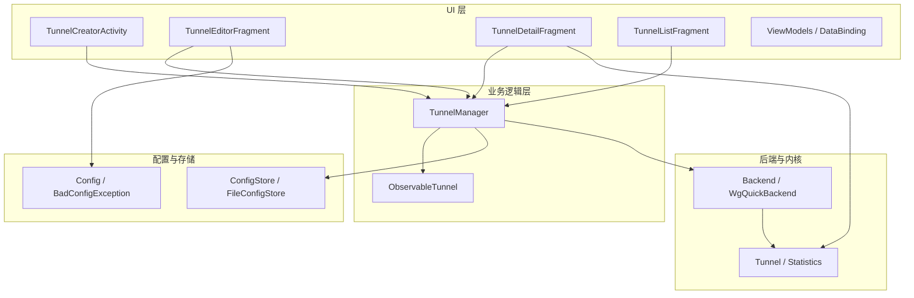
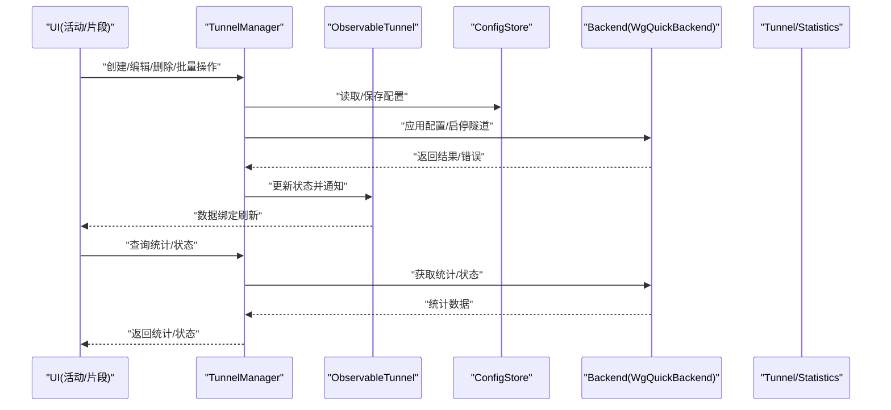
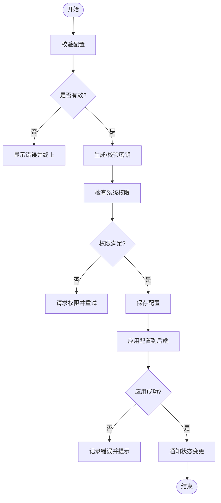
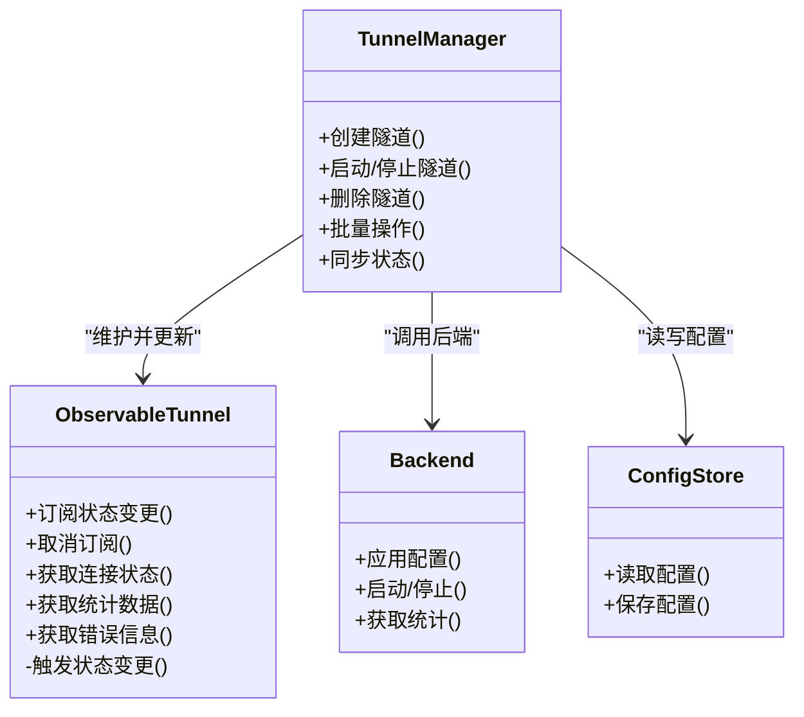
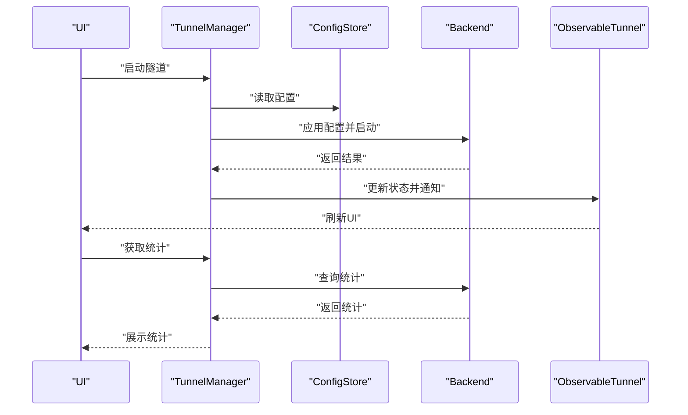
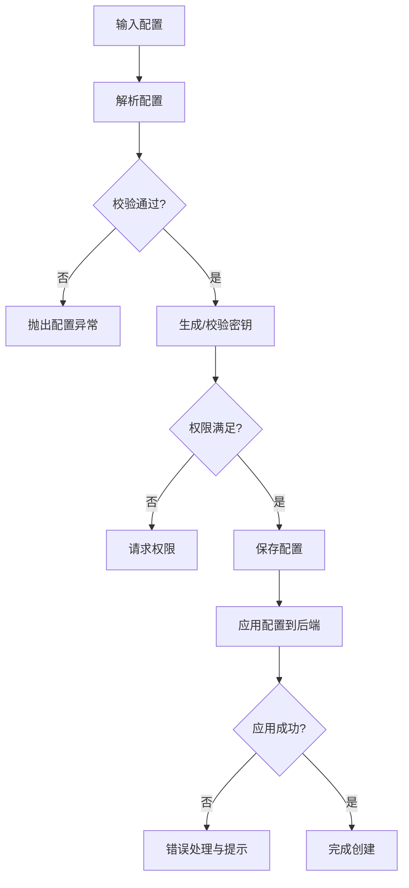
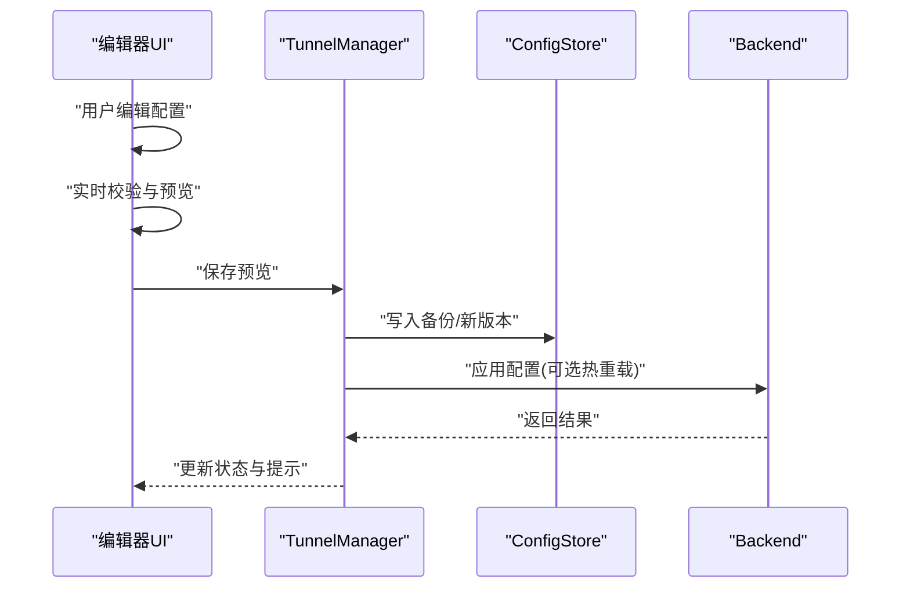
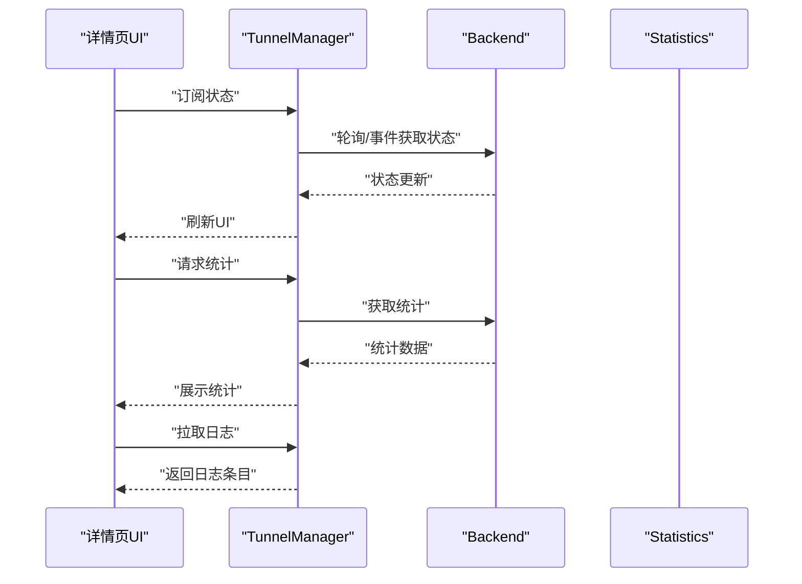
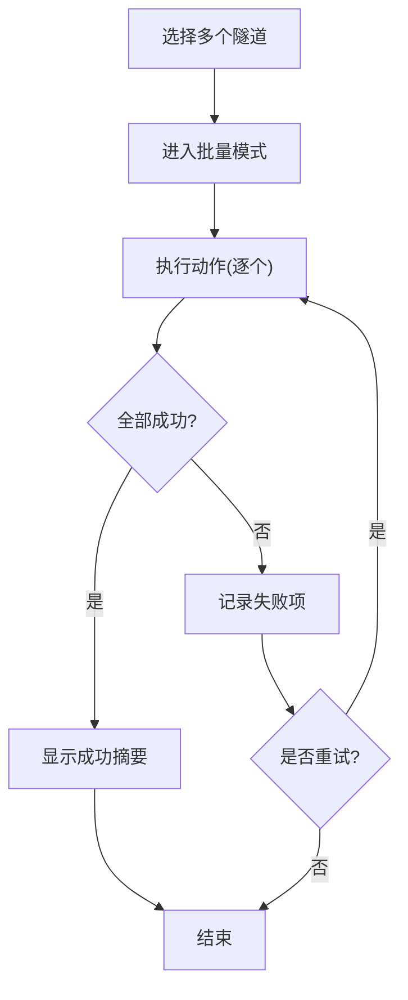
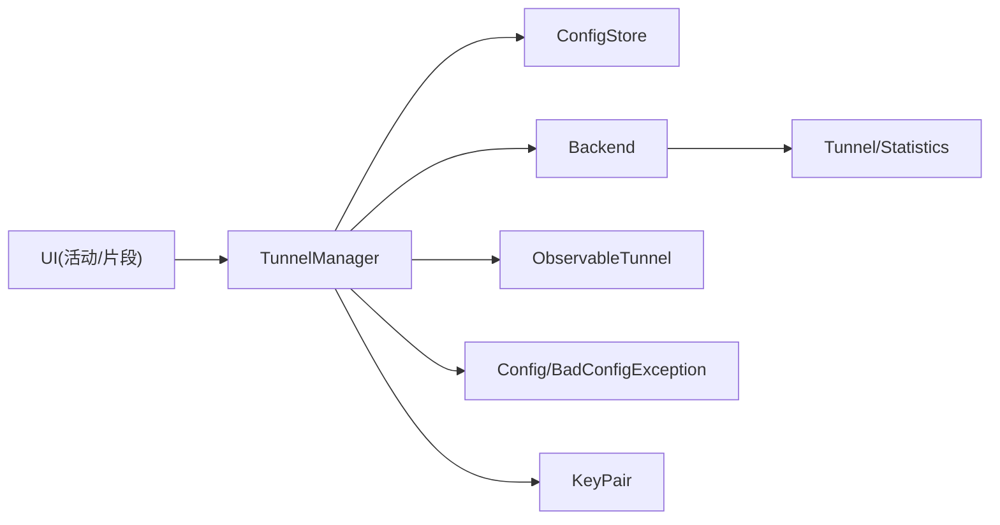

# 隧道管理功能

<cite>
**本文引用的文件**   
- [TunnelManager.kt](file://ui/src/main/java/com/wireguard/android/model/TunnelManager.kt)
- [ObservableTunnel.kt](file://ui/src/main/java/com/wireguard/android/model/ObservableTunnel.kt)
- [TunnelCreatorActivity.kt](file://ui/src/main/java/com/wireguard/android/activity/TunnelCreatorActivity.kt)
- [TunnelEditorFragment.kt](file://ui/src/main/java/com/wireguard/android/fragment/TunnelEditorFragment.kt)
- [TunnelDetailFragment.kt](file://ui/src/main/java/com/wireguard/android/fragment/TunnelDetailFragment.kt)
- [TunnelListFragment.kt](file://ui/src/main/java/com/wireguard/android/fragment/TunnelListFragment.kt)
- [ConfigStore.kt](file://ui/src/main/java/com/wireguard/android/configStore/ConfigStore.kt)
- [FileConfigStore.kt](file://ui/src/main/java/com/wireguard/android/configStore/FileConfigStore.kt)
- [Backend.java](file://tunnel/src/main/java/com/wireguard/android/backend/Backend.java)
- [WgQuickBackend.java](file://tunnel/src/main/java/com/wireguard/android/backend/WgQuickBackend.java)
- [Tunnel.java](file://tunnel/src/main/java/com/wireguard/android/backend/Tunnel.java)
- [Statistics.java](file://tunnel/src/main/java/com/wireguard/android/backend/Statistics.java)
- [Config.java](file://tunnel/src/main/java/com/wireguard/config/Config.java)
- [BadConfigException.java](file://tunnel/src/main/java/com/wireguard/config/BadConfigException.java)
- [KeyPair.java](file://tunnel/src/main/java/com/wireguard/crypto/KeyPair.java)
- [ErrorMessages.kt](file://ui/src/main/java/com/wireguard/android/util/ErrorMessages.kt)
- [Extensions.kt](file://ui/src/main/java/com/wireguard/android/util/Extensions.kt)
</cite>

## 目录
1. [简介](#简介)
2. [项目结构](#项目结构)
3. [核心组件](#核心组件)
4. [架构总览](#架构总览)
5. [详细组件分析](#详细组件分析)
6. [依赖关系分析](#依赖关系分析)
7. [性能考量](#性能考量)
8. [故障排查指南](#故障排查指南)
9. [结论](#结论)
10. [附录](#附录)

## 简介
本文件面向 WireGuard Android 的“隧道管理”能力，系统性梳理并文档化以下关键主题：
- 隧道生命周期管理：创建、编辑、删除与批量操作
- ObservableTunnel 的可观察状态机制：状态变更通知与数据绑定
- TunnelManager 的核心职责：实例管理、状态同步、错误处理
- 隧道创建流程：配置校验、密钥生成、系统权限检查
- 隧道编辑界面：表单验证、实时预览、配置备份
- 隧道详情页面：连接状态监控、统计信息展示、日志查看
- 异常处理与用户反馈机制
- 代码示例与使用模式（以路径引用代替具体代码片段）

## 项目结构
本项目采用分层组织方式：
- UI 层（ui 模块）：负责活动、片段、视图模型、数据绑定与用户交互
- 隧道内核封装（tunnel 模块）：提供后端抽象、配置解析、加密原语与统计
- 配置存储（configStore）：统一接口与基于文件的实现
- 工具与扩展（util）：错误消息、扩展函数、导入导出等

图表来源
- [TunnelCreatorActivity.kt:1-200](file://ui/src/main/java/com/wireguard/android/activity/TunnelCreatorActivity.kt#L1-L200)
- [TunnelEditorFragment.kt:1-200](file://ui/src/main/java/com/wireguard/android/fragment/TunnelEditorFragment.kt#L1-L200)
- [TunnelDetailFragment.kt:1-200](file://ui/src/main/java/com/wireguard/android/fragment/TunnelDetailFragment.kt#L1-L200)
- [TunnelListFragment.kt:1-200](file://ui/src/main/java/com/wireguard/android/fragment/TunnelListFragment.kt#L1-L200)
- [TunnelManager.kt:1-200](file://ui/src/main/java/com/wireguard/android/model/TunnelManager.kt#L1-L200)
- [ObservableTunnel.kt:1-200](file://ui/src/main/java/com/wireguard/android/model/ObservableTunnel.kt#L1-L200)
- [ConfigStore.kt:1-200](file://ui/src/main/java/com/wireguard/android/configStore/ConfigStore.kt#L1-L200)
- [FileConfigStore.kt:1-200](file://ui/src/main/java/com/wireguard/android/configStore/FileConfigStore.kt#L1-L200)
- [Backend.java:1-200](file://tunnel/src/main/java/com/wireguard/android/backend/Backend.java#L1-L200)
- [WgQuickBackend.java:1-200](file://tunnel/src/main/java/com/wireguard/android/backend/WgQuickBackend.java#L1-L200)
- [Tunnel.java:1-200](file://tunnel/src/main/java/com/wireguard/android/backend/Tunnel.java#L1-L200)
- [Statistics.java:1-200](file://tunnel/src/main/java/com/wireguard/android/backend/Statistics.java#L1-L200)
- [Config.java:1-200](file://tunnel/src/main/java/com/wireguard/config/Config.java#L1-L200)
- [BadConfigException.java:1-200](file://tunnel/src/main/java/com/wireguard/config/BadConfigException.java#L1-L200)

章节来源
- [TunnelManager.kt:1-200](file://ui/src/main/java/com/wireguard/android/model/TunnelManager.kt#L1-L200)
- [ObservableTunnel.kt:1-200](file://ui/src/main/java/com/wireguard/android/model/ObservableTunnel.kt#L1-L200)
- [ConfigStore.kt:1-200](file://ui/src/main/java/com/wireguard/android/configStore/ConfigStore.kt#L1-L200)
- [FileConfigStore.kt:1-200](file://ui/src/main/java/com/wireguard/android/configStore/FileConfigStore.kt#L1-L200)
- [Backend.java:1-200](file://tunnel/src/main/java/com/wireguard/android/backend/Backend.java#L1-L200)
- [WgQuickBackend.java:1-200](file://tunnel/src/main/java/com/wireguard/android/backend/WgQuickBackend.java#L1-L200)
- [Tunnel.java:1-200](file://tunnel/src/main/java/com/wireguard/android/backend/Tunnel.java#L1-L200)
- [Statistics.java:1-200](file://tunnel/src/main/java/com/wireguard/android/backend/Statistics.java#L1-L200)
- [Config.java:1-200](file://tunnel/src/main/java/com/wireguard/config/Config.java#L1-L200)
- [BadConfigException.java:1-200](file://tunnel/src/main/java/com/wireguard/config/BadConfigException.java#L1-L200)

## 核心组件
- TunnelManager：集中管理所有隧道实例的生命周期（创建、启动、停止、删除）、状态同步、错误处理与批量操作。对外暴露统一的 API，屏蔽底层后端差异。
- ObservableTunnel：将单个隧道的运行时状态（如连接状态、统计、错误）暴露为可观察对象，支持数据绑定与实时 UI 更新。
- ConfigStore/FileConfigStore：定义配置的持久化接口与基于文件的实现，负责配置的读取、写入与版本兼容。
- Backend/WgQuickBackend：抽象后端接口与 WG Quick 实现，负责与内核/Go 后端交互，执行启停、配置加载与统计获取。
- Config/BadConfigException：配置解析与校验，失败时抛出结构化异常以便上层统一处理。
- KeyPair：用于生成或验证密钥对，支撑隧道创建时的密钥生成流程。

章节来源
- [TunnelManager.kt:1-200](file://ui/src/main/java/com/wireguard/android/model/TunnelManager.kt#L1-L200)
- [ObservableTunnel.kt:1-200](file://ui/src/main/java/com/wireguard/android/model/ObservableTunnel.kt#L1-L200)
- [ConfigStore.kt:1-200](file://ui/src/main/java/com/wireguard/android/configStore/ConfigStore.kt#L1-L200)
- [FileConfigStore.kt:1-200](file://ui/src/main/java/com/wireguard/android/configStore/FileConfigStore.kt#L1-L200)
- [Backend.java:1-200](file://tunnel/src/main/java/com/wireguard/android/backend/Backend.java#L1-L200)
- [WgQuickBackend.java:1-200](file://tunnel/src/main/java/com/wireguard/android/backend/WgQuickBackend.java#L1-L200)
- [Config.java:1-200](file://tunnel/src/main/java/com/wireguard/config/Config.java#L1-L200)
- [BadConfigException.java:1-200](file://tunnel/src/main/java/com/wireguard/config/BadConfigException.java#L1-L200)
- [KeyPair.java:1-200](file://tunnel/src/main/java/com/wireguard/crypto/KeyPair.java#L1-L200)

## 架构总览
下图展示了从 UI 到后端的关键调用链与数据流，涵盖创建、编辑、详情与列表等场景。

图表来源
- [TunnelCreatorActivity.kt:1-200](file://ui/src/main/java/com/wireguard/android/activity/TunnelCreatorActivity.kt#L1-L200)
- [TunnelEditorFragment.kt:1-200](file://ui/src/main/java/com/wireguard/android/fragment/TunnelEditorFragment.kt#L1-L200)
- [TunnelDetailFragment.kt:1-200](file://ui/src/main/java/com/wireguard/android/fragment/TunnelDetailFragment.kt#L1-L200)
- [TunnelListFragment.kt:1-200](file://ui/src/main/java/com/wireguard/android/fragment/TunnelListFragment.kt#L1-L200)
- [TunnelManager.kt:1-200](file://ui/src/main/java/com/wireguard/android/model/TunnelManager.kt#L1-L200)
- [ConfigStore.kt:1-200](file://ui/src/main/java/com/wireguard/android/configStore/ConfigStore.kt#L1-L200)
- [Backend.java:1-200](file://tunnel/src/main/java/com/wireguard/android/backend/Backend.java#L1-L200)
- [WgQuickBackend.java:1-200](file://tunnel/src/main/java/com/wireguard/android/backend/WgQuickBackend.java#L1-L200)
- [Tunnel.java:1-200](file://tunnel/src/main/java/com/wireguard/android/backend/Tunnel.java#L1-L200)
- [Statistics.java:1-200](file://tunnel/src/main/java/com/wireguard/android/backend/Statistics.java#L1-L200)

## 详细组件分析

### 隧道生命周期管理（创建、编辑、删除、批量操作）
- 创建流程要点
  - 配置校验：通过配置解析器进行语法与语义校验，失败抛出结构化异常
  - 密钥生成：必要时生成或校验密钥对，确保安全性
  - 权限检查：根据系统要求检查必要权限（例如网络、后台运行等）
  - 持久化：将有效配置写入存储
  - 后端应用：调用后端应用配置并尝试启动
- 编辑流程要点
  - 增量更新：仅修改变更字段，减少不必要的重启
  - 预览与回滚：在应用前提供预览，失败时可回滚
  - 备份：自动或手动备份当前配置，便于恢复
- 删除流程要点
  - 先停止再删除：确保无残留进程或句柄
  - 清理存储：移除配置文件与缓存
- 批量操作
  - 事务性：批量启停/删除应保证一致性，部分失败需回滚
  - 进度反馈：向 UI 报告进度与结果

图表来源
- [TunnelCreatorActivity.kt:1-200](file://ui/src/main/java/com/wireguard/android/activity/TunnelCreatorActivity.kt#L1-L200)
- [TunnelEditorFragment.kt:1-200](file://ui/src/main/java/com/wireguard/android/fragment/TunnelEditorFragment.kt#L1-L200)
- [TunnelManager.kt:1-200](file://ui/src/main/java/com/wireguard/android/model/TunnelManager.kt#L1-L200)
- [Config.java:1-200](file://tunnel/src/main/java/com/wireguard/config/Config.java#L1-L200)
- [BadConfigException.java:1-200](file://tunnel/src/main/java/com/wireguard/config/BadConfigException.java#L1-L200)
- [KeyPair.java:1-200](file://tunnel/src/main/java/com/wireguard/crypto/KeyPair.java#L1-L200)

章节来源
- [TunnelCreatorActivity.kt:1-200](file://ui/src/main/java/com/wireguard/android/activity/TunnelCreatorActivity.kt#L1-L200)
- [TunnelEditorFragment.kt:1-200](file://ui/src/main/java/com/wireguard/android/fragment/TunnelEditorFragment.kt#L1-L200)
- [TunnelManager.kt:1-200](file://ui/src/main/java/com/wireguard/android/model/TunnelManager.kt#L1-L200)
- [Config.java:1-200](file://tunnel/src/main/java/com/wireguard/config/Config.java#L1-L200)
- [BadConfigException.java:1-200](file://tunnel/src/main/java/com/wireguard/config/BadConfigException.java#L1-L200)
- [KeyPair.java:1-200](file://tunnel/src/main/java/com/wireguard/crypto/KeyPair.java#L1-L200)

### ObservableTunnel 的可观察状态管理
- 设计目标
  - 将隧道状态（连接状态、统计、错误）暴露为可观察对象
  - 支持数据绑定，使 UI 能自动响应状态变化
  - 提供订阅/取消订阅机制，避免内存泄漏
- 关键行为
  - 状态变更事件：当连接状态、统计或错误发生变化时触发
  - 线程安全：状态更新应在合适的线程中发布，避免竞态条件
  - 默认值与空值保护：未初始化或不可用状态下的安全展示
- 使用模式
  - 在 Fragment/Activity 中订阅状态，并在销毁时取消订阅
  - 结合数据绑定表达式直接映射到 UI 控件

图表来源
- [ObservableTunnel.kt:1-200](file://ui/src/main/java/com/wireguard/android/model/ObservableTunnel.kt#L1-L200)
- [TunnelManager.kt:1-200](file://ui/src/main/java/com/wireguard/android/model/TunnelManager.kt#L1-L200)
- [Backend.java:1-200](file://tunnel/src/main/java/com/wireguard/android/backend/Backend.java#L1-L200)
- [ConfigStore.kt:1-200](file://ui/src/main/java/com/wireguard/android/configStore/ConfigStore.kt#L1-L200)

章节来源
- [ObservableTunnel.kt:1-200](file://ui/src/main/java/com/wireguard/android/model/ObservableTunnel.kt#L1-L200)
- [TunnelManager.kt:1-200](file://ui/src/main/java/com/wireguard/android/model/TunnelManager.kt#L1-L200)

### TunnelManager 的核心功能
- 隧道实例管理
  - 创建：接收配置，校验后持久化，并交由后端应用
  - 启动/停止：控制隧道生命周期，处理并发与幂等
  - 删除：停止后清理资源与配置
- 状态同步
  - 定期或事件驱动地拉取后端状态与统计
  - 将状态变化广播给 ObservableTunnel 订阅者
- 错误处理
  - 捕获后端异常与配置错误，转换为友好的用户提示
  - 提供重试与回滚策略

图表来源
- [TunnelManager.kt:1-200](file://ui/src/main/java/com/wireguard/android/model/TunnelManager.kt#L1-L200)
- [ConfigStore.kt:1-200](file://ui/src/main/java/com/wireguard/android/configStore/ConfigStore.kt#L1-L200)
- [Backend.java:1-200](file://tunnel/src/main/java/com/wireguard/android/backend/Backend.java#L1-L200)
- [ObservableTunnel.kt:1-200](file://ui/src/main/java/com/wireguard/android/model/ObservableTunnel.kt#L1-L200)

章节来源
- [TunnelManager.kt:1-200](file://ui/src/main/java/com/wireguard/android/model/TunnelManager.kt#L1-L200)

### 隧道创建流程（配置验证、密钥生成、权限检查）
- 配置验证
  - 解析配置文本，构建配置对象
  - 校验必填字段、格式与约束
  - 失败时抛出 BadConfigException，UI 层捕获并提示
- 密钥生成
  - 若缺少私钥或公钥，则生成新的密钥对
  - 校验密钥长度与编码格式
- 权限检查
  - 检查网络访问、后台运行等权限
  - 未授权时引导用户授权并重试

图表来源
- [TunnelCreatorActivity.kt:1-200](file://ui/src/main/java/com/wireguard/android/activity/TunnelCreatorActivity.kt#L1-L200)
- [Config.java:1-200](file://tunnel/src/main/java/com/wireguard/config/Config.java#L1-L200)
- [BadConfigException.java:1-200](file://tunnel/src/main/java/com/wireguard/config/BadConfigException.java#L1-L200)
- [KeyPair.java:1-200](file://tunnel/src/main/java/com/wireguard/crypto/KeyPair.java#L1-L200)

章节来源
- [TunnelCreatorActivity.kt:1-200](file://ui/src/main/java/com/wireguard/android/activity/TunnelCreatorActivity.kt#L1-L200)
- [Config.java:1-200](file://tunnel/src/main/java/com/wireguard/config/Config.java#L1-L200)
- [BadConfigException.java:1-200](file://tunnel/src/main/java/com/wireguard/config/BadConfigException.java#L1-L200)
- [KeyPair.java:1-200](file://tunnel/src/main/java/com/wireguard/crypto/KeyPair.java#L1-L200)

### 隧道编辑界面（表单验证、实时预览、配置备份）
- 表单验证
  - 实时校验输入项（如 IP、端口、密钥格式）
  - 高亮错误并提供修复建议
- 实时预览
  - 将编辑中的配置即时渲染为可读预览
  - 对比差异，帮助用户理解变更影响
- 配置备份
  - 自动备份当前配置，支持一键恢复
  - 支持导出/导入配置，便于迁移

图表来源
- [TunnelEditorFragment.kt:1-200](file://ui/src/main/java/com/wireguard/android/fragment/TunnelEditorFragment.kt#L1-L200)
- [TunnelManager.kt:1-200](file://ui/src/main/java/com/wireguard/android/model/TunnelManager.kt#L1-L200)
- [ConfigStore.kt:1-200](file://ui/src/main/java/com/wireguard/android/configStore/ConfigStore.kt#L1-L200)
- [Backend.java:1-200](file://tunnel/src/main/java/com/wireguard/android/backend/Backend.java#L1-L200)

章节来源
- [TunnelEditorFragment.kt:1-200](file://ui/src/main/java/com/wireguard/android/fragment/TunnelEditorFragment.kt#L1-L200)
- [TunnelManager.kt:1-200](file://ui/src/main/java/com/wireguard/android/model/TunnelManager.kt#L1-L200)
- [ConfigStore.kt:1-200](file://ui/src/main/java/com/wireguard/android/configStore/ConfigStore.kt#L1-L200)

### 隧道详情页面（连接状态监控、统计信息展示、日志查看）
- 连接状态监控
  - 监听后端状态变化，实时更新 UI
  - 显示连接时间、重连次数等指标
- 统计信息展示
  - 下载/上传字节数、数据包计数
  - 周期性刷新，避免频繁 IO
- 日志查看
  - 收集后端日志条目，分页展示
  - 支持搜索与导出

图表来源
- [TunnelDetailFragment.kt:1-200](file://ui/src/main/java/com/wireguard/android/fragment/TunnelDetailFragment.kt#L1-L200)
- [TunnelManager.kt:1-200](file://ui/src/main/java/com/wireguard/android/model/TunnelManager.kt#L1-L200)
- [Backend.java:1-200](file://tunnel/src/main/java/com/wireguard/android/backend/Backend.java#L1-L200)
- [Statistics.java:1-200](file://tunnel/src/main/java/com/wireguard/android/backend/Statistics.java#L1-L200)

章节来源
- [TunnelDetailFragment.kt:1-200](file://ui/src/main/java/com/wireguard/android/fragment/TunnelDetailFragment.kt#L1-L200)
- [TunnelManager.kt:1-200](file://ui/src/main/java/com/wireguard/android/model/TunnelManager.kt#L1-L200)
- [Statistics.java:1-200](file://tunnel/src/main/java/com/wireguard/android/backend/Statistics.java#L1-L200)

### 批量操作（启用/禁用/删除多个隧道）
- 操作流程
  - 选择多个隧道，进入批量模式
  - 执行统一动作（启用/禁用/删除），逐个调用后端
  - 汇总结果，部分失败时提供回滚或重试
- 用户体验
  - 进度条与结果摘要
  - 失败项单独提示，允许单独重试

图表来源
- [TunnelListFragment.kt:1-200](file://ui/src/main/java/com/wireguard/android/fragment/TunnelListFragment.kt#L1-L200)
- [TunnelManager.kt:1-200](file://ui/src/main/java/com/wireguard/android/model/TunnelManager.kt#L1-L200)

章节来源
- [TunnelListFragment.kt:1-200](file://ui/src/main/java/com/wireguard/android/fragment/TunnelListFragment.kt#L1-L200)
- [TunnelManager.kt:1-200](file://ui/src/main/java/com/wireguard/android/model/TunnelManager.kt#L1-L200)

## 依赖关系分析
- 组件耦合
  - UI 层依赖 TunnelManager 作为唯一入口，降低与后端和存储的直接耦合
  - TunnelManager 依赖 ConfigStore 与 Backend，屏蔽细节
  - ObservableTunnel 由 TunnelManager 维护，UI 仅订阅
- 外部依赖
  - 后端接口（Backend/WgQuickBackend）与内核/Go 后端交互
  - 配置解析与校验（Config/BadConfigException）
  - 加密原语（KeyPair）

图表来源
- [TunnelManager.kt:1-200](file://ui/src/main/java/com/wireguard/android/model/TunnelManager.kt#L1-L200)
- [ConfigStore.kt:1-200](file://ui/src/main/java/com/wireguard/android/configStore/ConfigStore.kt#L1-L200)
- [Backend.java:1-200](file://tunnel/src/main/java/com/wireguard/android/backend/Backend.java#L1-L200)
- [ObservableTunnel.kt:1-200](file://ui/src/main/java/com/wireguard/android/model/ObservableTunnel.kt#L1-L200)
- [Config.java:1-200](file://tunnel/src/main/java/com/wireguard/config/Config.java#L1-L200)
- [BadConfigException.java:1-200](file://tunnel/src/main/java/com/wireguard/config/BadConfigException.java#L1-L200)
- [KeyPair.java:1-200](file://tunnel/src/main/java/com/wireguard/crypto/KeyPair.java#L1-L200)

章节来源
- [TunnelManager.kt:1-200](file://ui/src/main/java/com/wireguard/android/model/TunnelManager.kt#L1-L200)
- [ConfigStore.kt:1-200](file://ui/src/main/java/com/wireguard/android/configStore/ConfigStore.kt#L1-L200)
- [Backend.java:1-200](file://tunnel/src/main/java/com/wireguard/android/backend/Backend.java#L1-L200)
- [ObservableTunnel.kt:1-200](file://ui/src/main/java/com/wireguard/android/model/ObservableTunnel.kt#L1-L200)
- [Config.java:1-200](file://tunnel/src/main/java/com/wireguard/config/Config.java#L1-L200)
- [BadConfigException.java:1-200](file://tunnel/src/main/java/com/wireguard/config/BadConfigException.java#L1-L200)
- [KeyPair.java:1-200](file://tunnel/src/main/java/com/wireguard/crypto/KeyPair.java#L1-L200)

## 性能考量
- 状态刷新频率
  - 统计与状态拉取应节流，避免频繁 IO 与 UI 重绘
  - 使用事件驱动优先于轮询
- 内存管理
  - 及时取消 ObservableTunnel 订阅，防止泄漏
  - 大对象（如日志）分页加载与回收
- 后端交互
  - 合并多次小请求为大请求
  - 失败重试与退避策略

[本节为通用指导，不直接分析具体文件]

## 故障排查指南
- 常见错误类型
  - 配置错误：BadConfigException，提示缺失字段或格式错误
  - 权限不足：引导用户授权，重试操作
  - 后端异常：网络或内核问题，记录日志并提示
- 调试手段
  - 查看后端日志与统计
  - 导出配置与错误信息
  - 逐步回滚变更定位问题

章节来源
- [ErrorMessages.kt:1-200](file://ui/src/main/java/com/wireguard/android/util/ErrorMessages.kt#L1-L200)
- [Extensions.kt:1-200](file://ui/src/main/java/com/wireguard/android/util/Extensions.kt#L1-L200)
- [BadConfigException.java:1-200](file://tunnel/src/main/java/com/wireguard/config/BadConfigException.java#L1-L200)

## 结论
WireGuard Android 的隧道管理通过清晰的层次结构与职责分离，实现了稳健的创建、编辑、删除与批量操作能力。ObservableTunnel 提供了高效的状态同步与数据绑定机制，TunnelManager 作为中枢协调配置存储与后端交互，确保一致的用户体验与可靠的错误处理。遵循本文档的模式与实践，可进一步提升系统的可维护性与可扩展性。

[本节为总结，不直接分析具体文件]

## 附录
- 使用模式示例（路径引用）
  - 创建隧道：参考 [TunnelCreatorActivity.kt:1-200](file://ui/src/main/java/com/wireguard/android/activity/TunnelCreatorActivity.kt#L1-L200)
  - 编辑隧道：参考 [TunnelEditorFragment.kt:1-200](file://ui/src/main/java/com/wireguard/android/fragment/TunnelEditorFragment.kt#L1-L200)
  - 查看详情：参考 [TunnelDetailFragment.kt:1-200](file://ui/src/main/java/com/wireguard/android/fragment/TunnelDetailFragment.kt#L1-L200)
  - 批量操作：参考 [TunnelListFragment.kt:1-200](file://ui/src/main/java/com/wireguard/android/fragment/TunnelListFragment.kt#L1-L200)
  - 状态订阅：参考 [ObservableTunnel.kt:1-200](file://ui/src/main/java/com/wireguard/android/model/ObservableTunnel.kt#L1-L200)
  - 配置存储：参考 [ConfigStore.kt:1-200](file://ui/src/main/java/com/wireguard/android/configStore/ConfigStore.kt#L1-L200)、[FileConfigStore.kt:1-200](file://ui/src/main/java/com/wireguard/android/configStore/FileConfigStore.kt#L1-L200)
  - 后端调用：参考 [Backend.java:1-200](file://tunnel/src/main/java/com/wireguard/android/backend/Backend.java#L1-L200)、[WgQuickBackend.java:1-200](file://tunnel/src/main/java/com/wireguard/android/backend/WgQuickBackend.java#L1-L200)

[本节为附录，不直接分析具体文件]