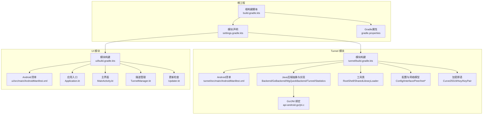
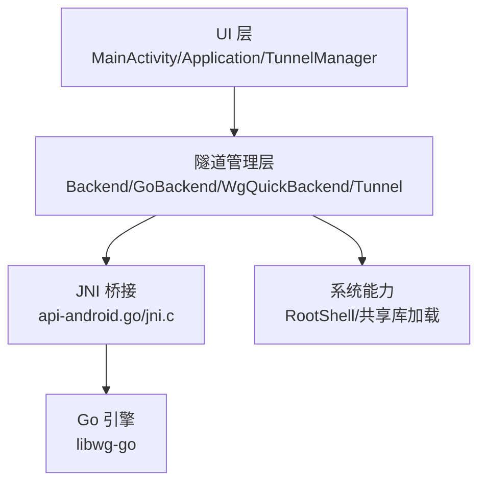
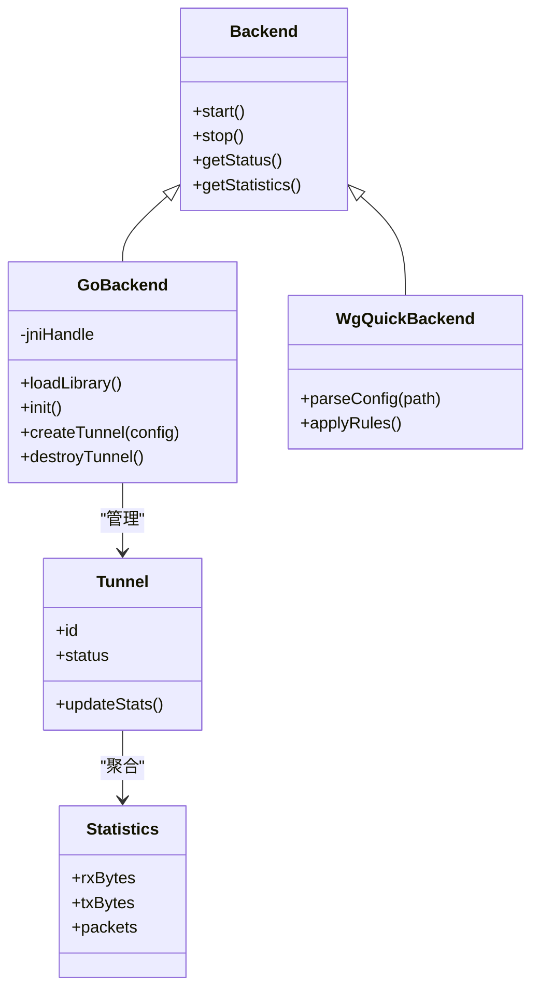
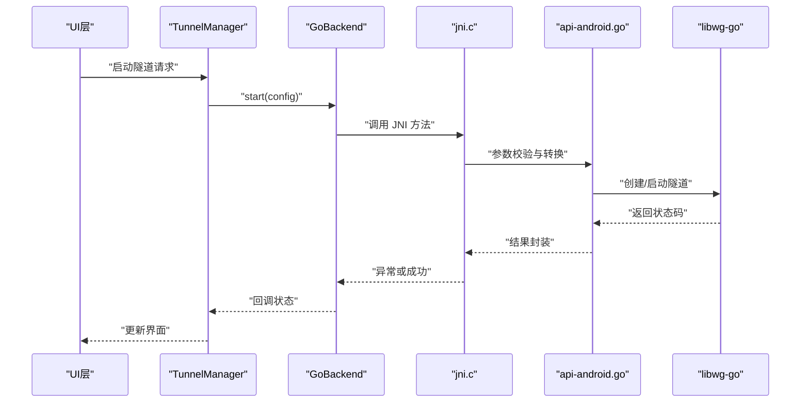
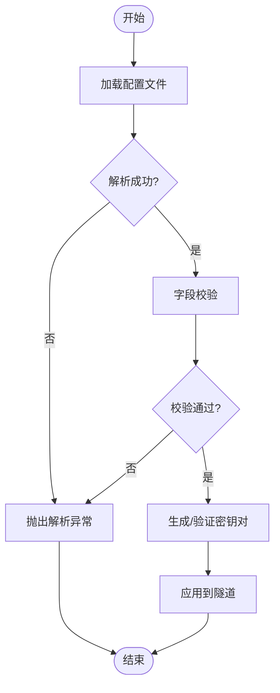
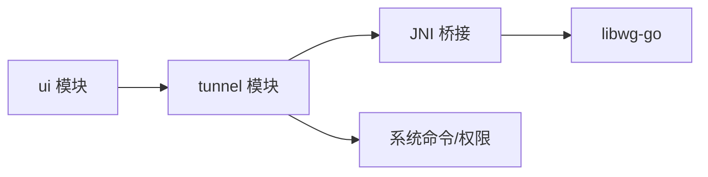

# HarmonyOS迁移指南

<cite>
**本文引用的文件**   
- [README.md](file://README.md)
- [build.gradle.kts](file://build.gradle.kts)
- [settings.gradle.kts](file://settings.gradle.kts)
- [gradle.properties](file://gradle.properties)
- [tunnel/build.gradle.kts](file://tunnel/build.gradle.kts)
- [ui/build.gradle.kts](file://ui/build.gradle.kts)
- [tunnel/src/main/AndroidManifest.xml](file://tunnel/src/main/AndroidManifest.xml)
- [ui/src/main/AndroidManifest.xml](file://ui/src/main/AndroidManifest.xml)
- [tunnel/src/main/java/com/wireguard/android/backend/Backend.java](file://tunnel/src/main/java/com/wireguard/android/backend/Backend.java)
- [tunnel/src/main/java/com/wireguard/android/backend/GoBackend.java](file://tunnel/src/main/java/com/wireguard/android/backend/GoBackend.java)
- [tunnel/src/main/java/com/wireguard/android/backend/WgQuickBackend.java](file://tunnel/src/main/java/com/wireguard/android/backend/WgQuickBackend.java)
- [tunnel/src/main/java/com/wireguard/android/backend/Tunnel.java](file://tunnel/src/main/java/com/wireguard/android/backend/Tunnel.java)
- [tunnel/src/main/java/com/wireguard/android/backend/Statistics.java](file://tunnel/src/main/java/com/wireguard/android/backend/Statistics.java)
- [tunnel/src/main/java/com/wireguard/android/util/RootShell.java](file://tunnel/src/main/java/com/wireguard/android/util/RootShell.java)
- [tunnel/src/main/java/com/wireguard/android/util/SharedLibraryLoader.java](file://tunnel/src/main/java/com/wireguard/android/util/SharedLibraryLoader.java)
- [tunnel/src/main/java/com/wireguard/config/Config.java](file://tunnel/src/main/java/com/wireguard/config/Config.java)
- [tunnel/src/main/java/com/wireguard/crypto/Curve25519.java](file://tunnel/src/main/java/com/wireguard/crypto/Curve25519.java)
- [tunnel/tools/libwg-go/api-android.go](file://tunnel/tools/libwg-go/api-android.go)
- [tunnel/tools/libwg-go/jni.c](file://tunnel/tools/libwg-go/jni.c)
- [ui/src/main/java/com/wireguard/android/Application.kt](file://ui/src/main/java/com/wireguard/android/Application.kt)
- [ui/src/main/java/com/wireguard/android/activity/MainActivity.kt](file://ui/src/main/java/com/wireguard/android/activity/MainActivity.kt)
- [ui/src/main/java/com/wireguard/android/model/TunnelManager.kt](file://ui/src/main/java/com/wireguard/android/model/TunnelManager.kt)
- [ui/src/main/java/com/wireguard/android/updater/Updater.kt](file://ui/src/main/java/com/wireguard/android/updater/Updater.kt)
</cite>

## 更新摘要
**已进行的更改**
- 修正了HarmonyOS迁移文档中的Markdown格式错误
- 将非标准列表符号'->'替换为标准块引用符号'>'
- 提升了文档的可读性和格式规范性

## 目录
1. [简介](#简介)
2. [项目结构](#项目结构)
3. [核心组件](#核心组件)
4. [架构总览](#架构总览)
5. [详细组件分析](#详细组件分析)
6. [依赖关系分析](#依赖关系分析)
7. [性能考量](#性能考量)
8. [故障排查指南](#故障排查指南)
9. [结论](#结论)
10. [附录](#附录)

## 简介
本指南面向希望将 WireGuard Android 应用迁移到 HarmonyOS 的开发者。文档基于仓库现有代码结构与实现，梳理 Android 侧与底层 Go/JNI 的交互方式、UI 层与隧道层的职责边界，并给出在 HarmonyOS 上的适配要点与迁移路径建议。内容涵盖系统架构、关键模块、数据流、错误处理与性能优化方向，帮助读者快速定位改造点并制定可执行的迁移计划。

## 项目结构
项目采用多模块 Gradle 工程组织：
- tunnel 模块：封装 WireGuard 内核态/用户态桥接能力，包含 Java 后端抽象、Go 绑定（JNI）、配置解析与加密原语等。
- ui 模块：Kotlin 编写的 Android UI 与应用逻辑，负责隧道管理、设置、日志查看、更新检查等。
- 根级构建脚本与 Gradle 配置：统一版本管理与模块依赖。

图表来源
- [build.gradle.kts](file://build.gradle.kts)
- [settings.gradle.kts](file://settings.gradle.kts)
- [gradle.properties](file://gradle.properties)
- [tunnel/build.gradle.kts](file://tunnel/build.gradle.kts)
- [ui/build.gradle.kts](file://ui/build.gradle.kts)
- [tunnel/src/main/AndroidManifest.xml](file://tunnel/src/main/AndroidManifest.xml)
- [ui/src/main/AndroidManifest.xml](file://ui/src/main/AndroidManifest.xml)

章节来源
- [build.gradle.kts](file://build.gradle.kts)
- [settings.gradle.kts](file://settings.gradle.kts)
- [gradle.properties](file://gradle.properties)
- [tunnel/build.gradle.kts](file://tunnel/build.gradle.kts)
- [ui/build.gradle.kts](file://ui/build.gradle.kts)
- [tunnel/src/main/AndroidManifest.xml](file://tunnel/src/main/AndroidManifest.xml)
- [ui/src/main/AndroidManifest.xml](file://ui/src/main/AndroidManifest.xml)

## 核心组件
- 后端抽象与实现
  - Backend：定义统一的隧道生命周期与统计接口，作为上层与具体实现的契约。
  - GoBackend：通过 JNI 调用 libwg-go，完成隧道创建、启动、停止与状态查询。
  - WgQuickBackend：兼容 wg-quick 风格的配置文件加载与解析。
  - Tunnel：封装单个隧道的运行时上下文与操作。
  - Statistics：聚合流量统计指标。
- 工具与系统交互
  - RootShell：执行需要高权限的系统命令（如 iptables/nftables）。
  - SharedLibraryLoader：动态加载本地库（libwg-go）。
- 配置与加密
  - Config/Interface/Peer/Inet*：WireGuard 配置模型与地址解析。
  - Curve25519/Key/KeyPair：密钥对生成与曲线运算。
- UI 与应用逻辑
  - Application/MainActivity：应用初始化与主界面。
  - TunnelManager：集中管理隧道实例的生命周期与状态同步。
  - Updater：应用更新检查与提示。

章节来源
- [tunnel/src/main/java/com/wireguard/android/backend/Backend.java](file://tunnel/src/main/java/com/wireguard/android/backend/Backend.java)
- [tunnel/src/main/java/com/wireguard/android/backend/GoBackend.java](file://tunnel/src/main/java/com/wireguard/android/backend/GoBackend.java)
- [tunnel/src/main/java/com/wireguard/android/backend/WgQuickBackend.java](file://tunnel/src/main/java/com/wireguard/android/backend/WgQuickBackend.java)
- [tunnel/src/main/java/com/wireguard/android/backend/Tunnel.java](file://tunnel/src/main/java/com/wireguard/android/backend/Tunnel.java)
- [tunnel/src/main/java/com/wireguard/android/backend/Statistics.java](file://tunnel/src/main/java/com/wireguard/android/backend/Statistics.java)
- [tunnel/src/main/java/com/wireguard/android/util/RootShell.java](file://tunnel/src/main/java/com/wireguard/android/util/RootShell.java)
- [tunnel/src/main/java/com/wireguard/android/util/SharedLibraryLoader.java](file://tunnel/src/main/java/com/wireguard/android/util/SharedLibraryLoader.java)
- [tunnel/src/main/java/com/wireguard/config/Config.java](file://tunnel/src/main/java/com/wireguard/config/Config.java)
- [tunnel/src/main/java/com/wireguard/crypto/Curve25519.java](file://tunnel/src/main/java/com/wireguard/crypto/Curve25519.java)
- [ui/src/main/java/com/wireguard/android/Application.kt](file://ui/src/main/java/com/wireguard/android/Application.kt)
- [ui/src/main/java/com/wireguard/android/activity/MainActivity.kt](file://ui/src/main/java/com/wireguard/android/activity/MainActivity.kt)
- [ui/src/main/java/com/wireguard/android/model/TunnelManager.kt](file://ui/src/main/java/com/wireguard/android/model/TunnelManager.kt)
- [ui/src/main/java/com/wireguard/android/updater/Updater.kt](file://ui/src/main/java/com/wireguard/android/updater/Updater.kt)

## 架构总览
整体架构分为三层：
- UI 层（Kotlin）：负责用户交互、配置编辑、隧道列表与状态展示、设置与更新检查。
- 隧道管理层（Java/Kotlin）：封装隧道生命周期、配置解析、统计上报与系统命令执行。
- 底层引擎（Go/JNI）：通过 JNI 暴露 API，驱动 libwg-go 进行实际的数据面转发与协议栈交互。

图表来源
- [ui/src/main/java/com/wireguard/android/activity/MainActivity.kt](file://ui/src/main/java/com/wireguard/android/activity/MainActivity.kt)
- [ui/src/main/java/com/wireguard/android/model/TunnelManager.kt](file://ui/src/main/java/com/wireguard/android/model/TunnelManager.kt)
- [tunnel/src/main/java/com/wireguard/android/backend/Backend.java](file://tunnel/src/main/java/com/wireguard/android/backend/Backend.java)
- [tunnel/src/main/java/com/wireguard/android/backend/GoBackend.java](file://tunnel/src/main/java/com/wireguard/android/backend/GoBackend.java)
- [tunnel/tools/libwg-go/api-android.go](file://tunnel/tools/libwg-go/api-android.go)
- [tunnel/tools/libwg-go/jni.c](file://tunnel/tools/libwg-go/jni.c)
- [tunnel/src/main/java/com/wireguard/android/util/RootShell.java](file://tunnel/src/main/java/com/wireguard/android/util/RootShell.java)
- [tunnel/src/main/java/com/wireguard/android/util/SharedLibraryLoader.java](file://tunnel/src/main/java/com/wireguard/android/util/SharedLibraryLoader.java)

## 详细组件分析

### 后端抽象与实现（Backend/GoBackend/WgQuickBackend/Tunnel/Statistics）
- 设计要点
  - Backend 提供统一接口，屏蔽不同实现差异；GoBackend 聚焦 JNI 调用；WgQuickBackend 专注配置文件兼容。
  - Tunnel 维护单例或实例化后的运行上下文，配合 Statistics 收集计数。
- 关键流程
  - 启动隧道：UI 触发 -> TunnelManager 调用 Backend.start() -> GoBackend 通过 JNI 调用 api-android.go -> jni.c -> libwg-go。
  - 停止隧道：反向释放资源，清理路由与规则。
  - 统计上报：周期性读取计数器并回传 UI。

图表来源
- [tunnel/src/main/java/com/wireguard/android/backend/Backend.java](file://tunnel/src/main/java/com/wireguard/android/backend/Backend.java)
- [tunnel/src/main/java/com/wireguard/android/backend/GoBackend.java](file://tunnel/src/main/java/com/wireguard/android/backend/GoBackend.java)
- [tunnel/src/main/java/com/wireguard/android/backend/WgQuickBackend.java](file://tunnel/src/main/java/com/wireguard/android/backend/WgQuickBackend.java)
- [tunnel/src/main/java/com/wireguard/android/backend/Tunnel.java](file://tunnel/src/main/java/com/wireguard/android/backend/Tunnel.java)
- [tunnel/src/main/java/com/wireguard/android/backend/Statistics.java](file://tunnel/src/main/java/com/wireguard/android/backend/Statistics.java)

章节来源
- [tunnel/src/main/java/com/wireguard/android/backend/Backend.java](file://tunnel/src/main/java/com/wireguard/android/backend/Backend.java)
- [tunnel/src/main/java/com/wireguard/android/backend/GoBackend.java](file://tunnel/src/main/java/com/wireguard/android/backend/GoBackend.java)
- [tunnel/src/main/java/com/wireguard/android/backend/WgQuickBackend.java](file://tunnel/src/main/java/com/wireguard/android/backend/WgQuickBackend.java)
- [tunnel/src/main/java/com/wireguard/android/backend/Tunnel.java](file://tunnel/src/main/java/com/wireguard/android/backend/Tunnel.java)
- [tunnel/src/main/java/com/wireguard/android/backend/Statistics.java](file://tunnel/src/main/java/com/wireguard/android/backend/Statistics.java)

### JNI 桥接（api-android.go / jni.c）
- 职责
  - api-android.go 暴露给 JNI 的方法签名与参数映射。
  - jni.c 负责 JVM <-> C <-> Go 的调用链与内存拷贝、异常传播。
- 关键点
  - 线程安全：确保 JNI 调用在非 UI 线程执行，避免阻塞。
  - 错误码：统一错误码映射到 Java 异常类型，便于上层捕获。
  - 资源管理：正确释放临时缓冲区与句柄。

图表来源
- [tunnel/tools/libwg-go/api-android.go](file://tunnel/tools/libwg-go/api-android.go)
- [tunnel/tools/libwg-go/jni.c](file://tunnel/tools/libwg-go/jni.c)
- [tunnel/src/main/java/com/wireguard/android/backend/GoBackend.java](file://tunnel/src/main/java/com/wireguard/android/backend/GoBackend.java)
- [ui/src/main/java/com/wireguard/android/model/TunnelManager.kt](file://ui/src/main/java/com/wireguard/android/model/TunnelManager.kt)
- [ui/src/main/java/com/wireguard/android/activity/MainActivity.kt](file://ui/src/main/java/com/wireguard/android/activity/MainActivity.kt)

章节来源
- [tunnel/tools/libwg-go/api-android.go](file://tunnel/tools/libwg-go/api-android.go)
- [tunnel/tools/libwg-go/jni.c](file://tunnel/tools/libwg-go/jni.c)
- [tunnel/src/main/java/com/wireguard/android/backend/GoBackend.java](file://tunnel/src/main/java/com/wireguard/android/backend/GoBackend.java)
- [ui/src/main/java/com/wireguard/android/model/TunnelManager.kt](file://ui/src/main/java/com/wireguard/android/model/TunnelManager.kt)
- [ui/src/main/java/com/wireguard/android/activity/MainActivity.kt](file://ui/src/main/java/com/wireguard/android/activity/MainActivity.kt)

### 配置与加密（Config/Curve25519）
- 配置解析
  - Config/Interface/Peer/Inet* 描述 WireGuard 配置项，包括端点、公钥、允许 IP 等。
  - 解析失败时抛出 BadConfigException/ParseException，需在上层提示用户修正。
- 加密原语
  - Curve25519/Key/KeyPair 用于密钥对生成与协商，保证安全性与性能。

图表来源
- [tunnel/src/main/java/com/wireguard/config/Config.java](file://tunnel/src/main/java/com/wireguard/config/Config.java)
- [tunnel/src/main/java/com/wireguard/crypto/Curve25519.java](file://tunnel/src/main/java/com/wireguard/crypto/Curve25519.java)

章节来源
- [tunnel/src/main/java/com/wireguard/config/Config.java](file://tunnel/src/main/java/com/wireguard/config/Config.java)
- [tunnel/src/main/java/com/wireguard/crypto/Curve25519.java](file://tunnel/src/main/java/com/wireguard/crypto/Curve25519.java)

### 系统交互（RootShell/SharedLibraryLoader）
- RootShell：执行需要 root 权限的命令（如修改路由表、防火墙规则），需严格限制命令白名单与参数校验。
- SharedLibraryLoader：动态加载 libwg-go，需处理库缺失、版本不匹配与加载失败的回退策略。

章节来源
- [tunnel/src/main/java/com/wireguard/android/util/RootShell.java](file://tunnel/src/main/java/com/wireguard/android/util/RootShell.java)
- [tunnel/src/main/java/com/wireguard/android/util/SharedLibraryLoader.java](file://tunnel/src/main/java/com/wireguard/android/util/SharedLibraryLoader.java)

### UI 与应用逻辑（Application/MainActivity/TunnelManager/Updater）
- Application：初始化全局状态、日志框架与权限检查。
- MainActivity：主界面导航、隧道列表展示与基本操作入口。
- TunnelManager：集中管理隧道实例，协调启动/停止、状态同步与统计刷新。
- Updater：检查新版本并引导用户下载更新。

章节来源
- [ui/src/main/java/com/wireguard/android/Application.kt](file://ui/src/main/java/com/wireguard/android/Application.kt)
- [ui/src/main/java/com/wireguard/android/activity/MainActivity.kt](file://ui/src/main/java/com/wireguard/android/activity/MainActivity.kt)
- [ui/src/main/java/com/wireguard/android/model/TunnelManager.kt](file://ui/src/main/java/com/wireguard/android/model/TunnelManager.kt)
- [ui/src/main/java/com/wireguard/android/updater/Updater.kt](file://ui/src/main/java/com/wireguard/android/updater/Updater.kt)

## 依赖关系分析
- 模块依赖
  - ui 依赖 tunnel（通过 AAR/源码引用），两者由 settings.gradle.kts 统一管理。
- 内部依赖
  - GoBackend 依赖 JNI 桥接与共享库加载；TunnelManager 依赖 Backend 抽象；UI 仅依赖高层接口。
- 外部依赖
  - libwg-go（Go 实现）、系统命令（iptables/nftables）、设备权限（root/网络访问）。

图表来源
- [settings.gradle.kts](file://settings.gradle.kts)
- [tunnel/build.gradle.kts](file://tunnel/build.gradle.kts)
- [ui/build.gradle.kts](file://ui/build.gradle.kts)
- [tunnel/src/main/java/com/wireguard/android/backend/GoBackend.java](file://tunnel/src/main/java/com/wireguard/android/backend/GoBackend.java)
- [tunnel/src/main/java/com/wireguard/android/util/RootShell.java](file://tunnel/src/main/java/com/wireguard/android/util/RootShell.java)

章节来源
- [settings.gradle.kts](file://settings.gradle.kts)
- [tunnel/build.gradle.kts](file://tunnel/build.gradle.kts)
- [ui/build.gradle.kts](file://ui/build.gradle.kts)
- [tunnel/src/main/java/com/wireguard/android/backend/GoBackend.java](file://tunnel/src/main/java/com/wireguard/android/backend/GoBackend.java)
- [tunnel/src/main/java/com/wireguard/android/util/RootShell.java](file://tunnel/src/main/java/com/wireguard/android/util/RootShell.java)

## 性能考量
- JNI 调用开销
  - 减少频繁的小对象传递，批量传输统计数据。
  - 避免在 UI 线程执行耗时操作，使用后台线程与回调机制。
- 内存管理
  - 合理分配与释放 JNI 缓冲区，防止内存泄漏。
  - 大对象复用（如字节缓冲池）。
- I/O 与系统调用
  - 合并系统命令执行，降低权限检查与进程创建成本。
  - 使用异步任务与重试机制提升稳定性。
- 统计与刷新
  - 控制统计刷新频率，避免高频 UI 重绘。
  - 增量更新界面，减少全量渲染。

[本节为通用性能指导，无需特定文件来源]

## 故障排查指南
- 常见错误
  - 配置解析失败：检查字段格式、必填项与数值范围。
  - 共享库加载失败：确认库路径、ABI 匹配与权限。
  - 权限不足：授予必要权限或引导用户授权。
  - 启动失败：查看日志输出与错误码，定位具体阶段。
- 调试建议
  - 启用详细日志，记录 JNI 调用参数与返回值。
  - 使用模拟器或真机逐步验证各阶段行为。
  - 隔离问题域（UI/后端/底层）以缩小排查范围。

章节来源
- [tunnel/src/main/java/com/wireguard/config/Config.java](file://tunnel/src/main/java/com/wireguard/config/Config.java)
- [tunnel/src/main/java/com/wireguard/android/util/SharedLibraryLoader.java](file://tunnel/src/main/java/com/wireguard/android/util/SharedLibraryLoader.java)
- [tunnel/src/main/java/com/wireguard/android/util/RootShell.java](file://tunnel/src/main/java/com/wireguard/android/util/RootShell.java)

## 结论
本指南从架构、组件、数据流与性能角度梳理了 WireGuard Android 项目的核心实现，并为迁移至 HarmonyOS 提供了清晰的切入点与实施建议。建议在迁移过程中优先完成 JNI 桥接与系统能力适配，再逐步替换 UI 层与业务逻辑，确保功能稳定与性能达标。

[本节为总结性内容，无需特定文件来源]

## 附录
- 构建与版本管理
  - 根级 build.gradle.kts 与 settings.gradle.kts 定义模块与依赖。
  - gradle.properties 管理全局构建属性。
- 清单与权限
  - tunnel/ui 模块的 AndroidManifest.xml 声明组件与权限。
- 参考文件
  - README.md 提供项目背景与使用说明。

章节来源
- [build.gradle.kts](file://build.gradle.kts)
- [settings.gradle.kts](file://settings.gradle.kts)
- [gradle.properties](file://gradle.properties)
- [tunnel/src/main/AndroidManifest.xml](file://tunnel/src/main/AndroidManifest.xml)
- [ui/src/main/AndroidManifest.xml](file://ui/src/main/AndroidManifest.xml)
- [README.md](file://README.md)