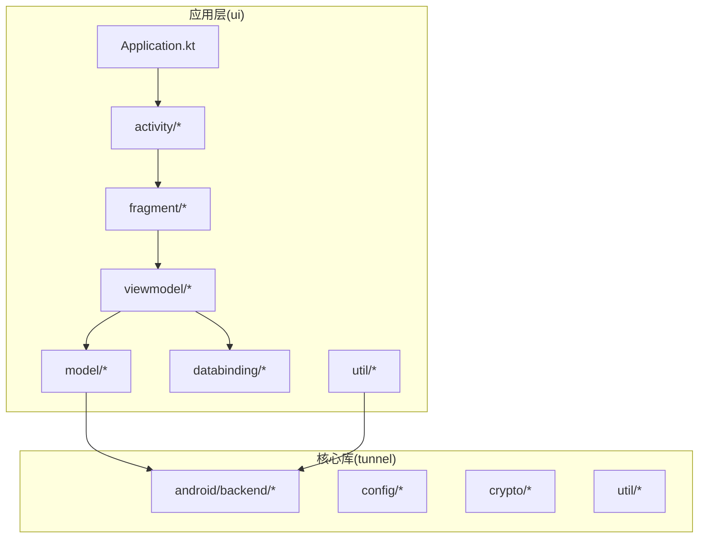
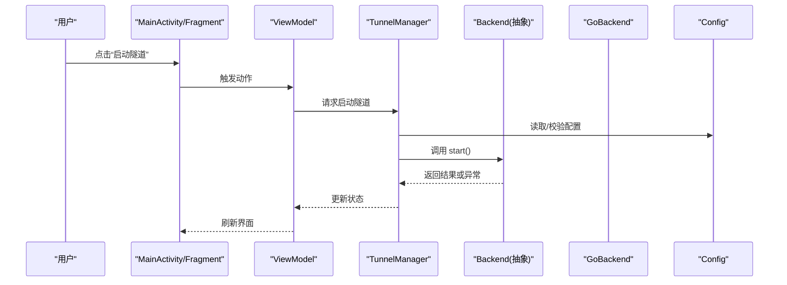
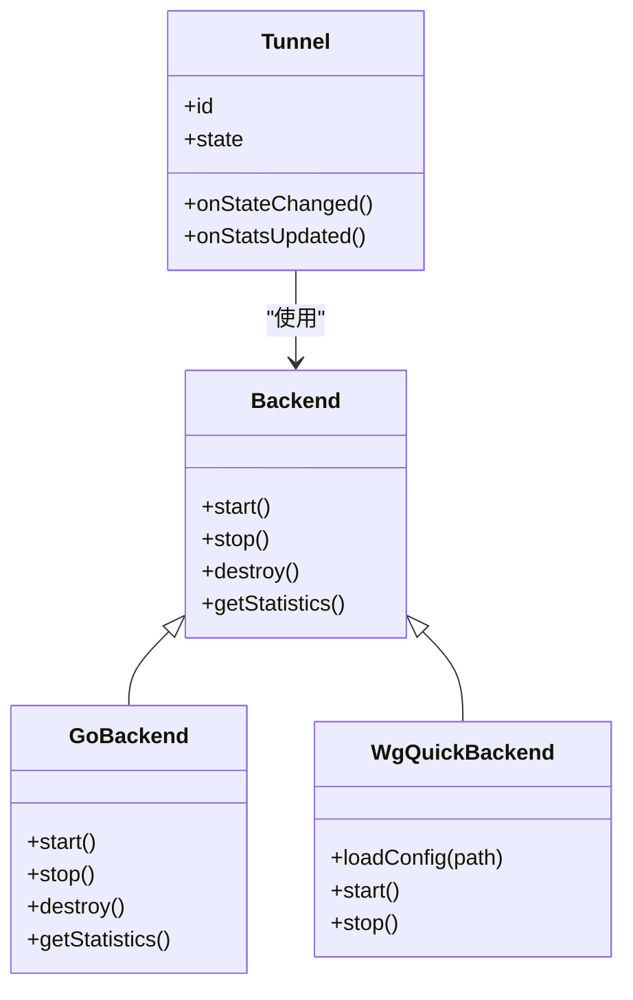
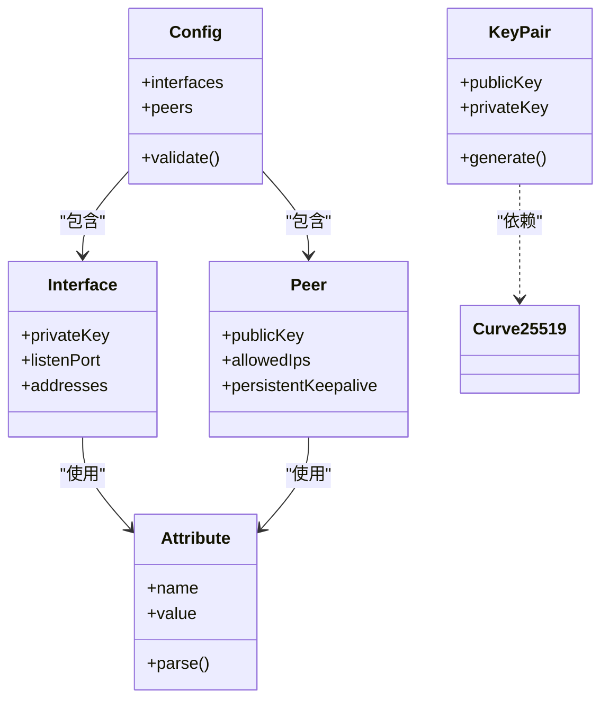
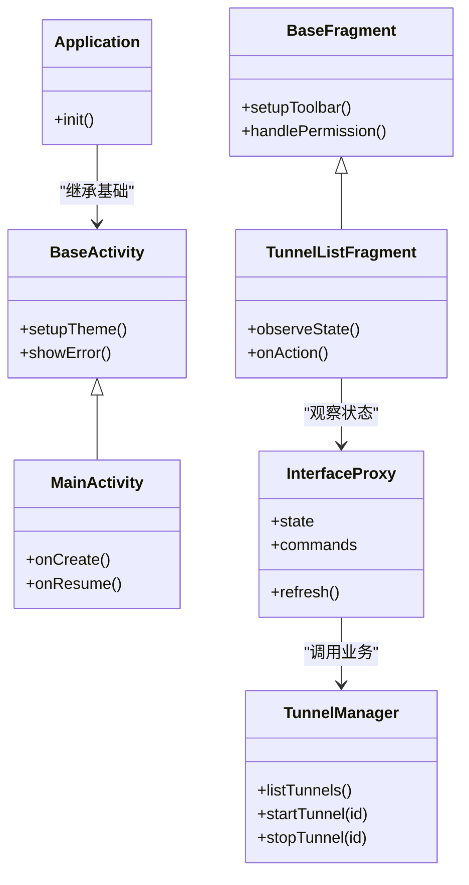
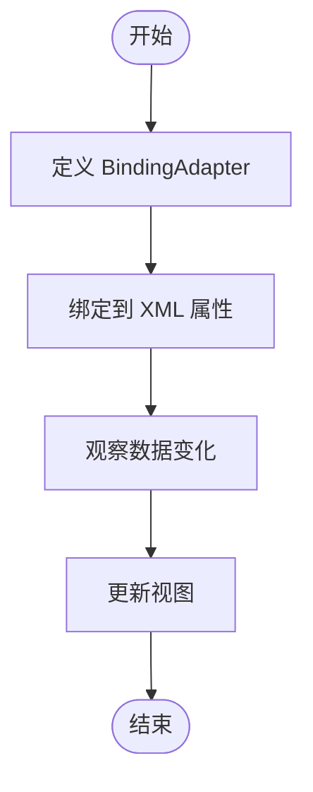
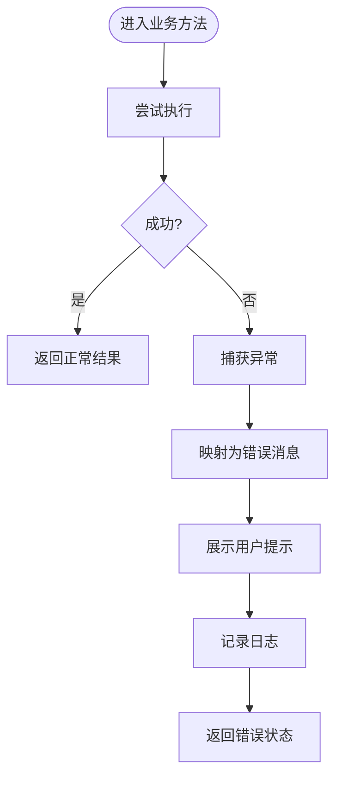
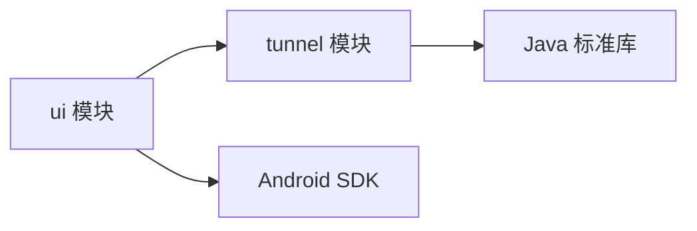

# 代码结构与规范

<cite>
**本文引用的文件**   
- [tunnel/src/main/java/com/wireguard/android/backend/Backend.java](file://tunnel/src/main/java/com/wireguard/android/backend/Backend.java)
- [tunnel/src/main/java/com/wireguard/android/backend/GoBackend.java](file://tunnel/src/main/java/com/wireguard/android/backend/GoBackend.java)
- [tunnel/src/main/java/com/wireguard/android/backend/WgQuickBackend.java](file://tunnel/src/main/java/com/wireguard/android/backend/WgQuickBackend.java)
- [tunnel/src/main/java/com/wireguard/android/backend/Tunnel.java](file://tunnel/src/main/java/com/wireguard/android/backend/Tunnel.java)
- [tunnel/src/main/java/com/wireguard/config/Config.java](file://tunnel/src/main/java/com/wireguard/config/Config.java)
- [tunnel/src/main/java/com/wireguard/crypto/KeyPair.java](file://tunnel/src/main/java/com/wireguard/crypto/KeyPair.java)
- [ui/src/main/java/com/wireguard/android/Application.kt](file://ui/src/main/java/com/wireguard/android/Application.kt)
- [ui/src/main/java/com/wireguard/android/activity/BaseActivity.kt](file://ui/src/main/java/com/wireguard/android/activity/BaseActivity.kt)
- [ui/src/main/java/com/wireguard/android/activity/MainActivity.kt](file://ui/src/main/java/com/wireguard/android/activity/MainActivity.kt)
- [ui/src/main/java/com/wireguard/android/fragment/BaseFragment.kt](file://ui/src/main/java/com/wireguard/android/fragment/BaseFragment.kt)
- [ui/src/main/java/com/wireguard/android/fragment/TunnelListFragment.kt](file://ui/src/main/java/com/wireguard/android/fragment/TunnelListFragment.kt)
- [ui/src/main/java/com/wireguard/android/viewmodel/InterfaceProxy.kt](file://ui/src/main/java/com/wireguard/android/viewmodel/InterfaceProxy.kt)
- [ui/src/main/java/com/wireguard/android/model/TunnelManager.kt](file://ui/src/main/java/com/wireguard/android/model/TunnelManager.kt)
- [ui/src/main/java/com/wireguard/android/databinding/BindingAdapters.kt](file://ui/src/main/java/com/wireguard/android/databinding/BindingAdapters.kt)
- [ui/src/main/java/com/wireguard/android/util/ErrorMessages.kt](file://ui/src/main/java/com/wireguard/android/util/ErrorMessages.kt)
- [ui/src/main/java/com/wireguard/android/util/Extensions.kt](file://ui/src/main/java/com/wireguard/android/util/Extensions.kt)
- [ui/build.gradle.kts](file://ui/build.gradle.kts)
- [tunnel/build.gradle.kts](file://tunnel/build.gradle.kts)
- [settings.gradle.kts](file://settings.gradle.kts)
</cite>

## 目录
1. [简介](#简介)
2. [项目结构](#项目结构)
3. [核心组件](#核心组件)
4. [架构总览](#架构总览)
5. [详细组件分析](#详细组件分析)
6. [依赖关系分析](#依赖关系分析)
7. [性能考量](#性能考量)
8. [故障排查指南](#故障排查指南)
9. [结论](#结论)
10. [附录](#附录)

## 简介
本文件面向 WireGuard Android 项目的开发者与代码审查者，系统性梳理代码组织结构、包命名与目录组织原则，解释 tunnel 核心模块与 ui 用户界面模块的职责边界；总结 Kotlin 与 Java 混合开发的约定（文件命名、类组织、接口设计）；阐述 MVVM 在 UI 层的落地方式（Activity、Fragment、ViewModel 职责分离）；说明数据绑定机制与自定义 BindingAdapter 的开发实践；给出错误处理模式与日志记录规范；并提供代码审查检查清单与常见反模式的避免方法。

## 项目结构
项目采用多模块工程：
- tunnel：纯 Java 实现的隧道核心库，包含后端抽象、配置解析、加密原语等。
- ui：Kotlin 为主的 Android 应用层，基于 MVVM，使用 DataBinding 进行视图绑定。

图表来源
- [settings.gradle.kts](file://settings.gradle.kts)
- [ui/build.gradle.kts](file://ui/build.gradle.kts)
- [tunnel/build.gradle.kts](file://tunnel/build.gradle.kts)

章节来源
- [settings.gradle.kts](file://settings.gradle.kts)
- [ui/build.gradle.kts](file://ui/build.gradle.kts)
- [tunnel/build.gradle.kts](file://tunnel/build.gradle.kts)

## 核心组件
- 后端抽象与实现
  - Backend：定义隧道生命周期与统计的抽象接口。
  - GoBackend：通过 JNI 调用 Go 实现的 WireGuard 内核态驱动。
  - WgQuickBackend：封装 wg-quick 风格的配置文件加载与启动流程。
  - Tunnel：表示一个具体的隧道实例，承载状态与事件。
- 配置模型
  - Config、Interface、Peer、Attribute 等：描述 WireGuard 配置的结构化对象。
- 加密原语
  - KeyPair、Key、Curve25519：提供密钥对生成与曲线运算能力。
- UI 层
  - Application：应用初始化与全局依赖注入点。
  - Activity/Fragment：页面与交互逻辑。
  - ViewModel：UI 状态与业务编排。
  - Model：TunnelManager 等聚合服务。
  - DataBinding：BindingAdapters 扩展属性绑定。
  - Util：通用工具与错误消息。

章节来源
- [tunnel/src/main/java/com/wireguard/android/backend/Backend.java](file://tunnel/src/main/java/com/wireguard/android/backend/Backend.java)
- [tunnel/src/main/java/com/wireguard/android/backend/GoBackend.java](file://tunnel/src/main/java/com/wireguard/android/backend/GoBackend.java)
- [tunnel/src/main/java/com/wireguard/android/backend/WgQuickBackend.java](file://tunnel/src/main/java/com/wireguard/android/backend/WgQuickBackend.java)
- [tunnel/src/main/java/com/wireguard/android/backend/Tunnel.java](file://tunnel/src/main/java/com/wireguard/android/backend/Tunnel.java)
- [tunnel/src/main/java/com/wireguard/config/Config.java](file://tunnel/src/main/java/com/wireguard/config/Config.java)
- [tunnel/src/main/java/com/wireguard/crypto/KeyPair.java](file://tunnel/src/main/java/com/wireguard/crypto/KeyPair.java)
- [ui/src/main/java/com/wireguard/android/Application.kt](file://ui/src/main/java/com/wireguard/android/Application.kt)
- [ui/src/main/java/com/wireguard/android/model/TunnelManager.kt](file://ui/src/main/java/com/wireguard/android/model/TunnelManager.kt)
- [ui/src/main/java/com/wireguard/android/databinding/BindingAdapters.kt](file://ui/src/main/java/com/wireguard/android/databinding/BindingAdapters.kt)

## 架构总览
整体采用分层架构：
- UI 层（Activity/Fragment + ViewModel）负责展示与交互，不直接操作底层。
- 领域层（Model/Service）聚合业务逻辑，如隧道管理、配置持久化。
- 基础设施层（tunnel 库）提供后端抽象、配置解析与加密能力。

图表来源
- [ui/src/main/java/com/wireguard/android/activity/MainActivity.kt](file://ui/src/main/java/com/wireguard/android/activity/MainActivity.kt)
- [ui/src/main/java/com/wireguard/android/fragment/TunnelListFragment.kt](file://ui/src/main/java/com/wireguard/android/fragment/TunnelListFragment.kt)
- [ui/src/main/java/com/wireguard/android/viewmodel/InterfaceProxy.kt](file://ui/src/main/java/com/wireguard/android/viewmodel/InterfaceProxy.kt)
- [ui/src/main/java/com/wireguard/android/model/TunnelManager.kt](file://ui/src/main/java/com/wireguard/android/model/TunnelManager.kt)
- [tunnel/src/main/java/com/wireguard/android/backend/Backend.java](file://tunnel/src/main/java/com/wireguard/android/backend/Backend.java)
- [tunnel/src/main/java/com/wireguard/android/backend/GoBackend.java](file://tunnel/src/main/java/com/wireguard/android/backend/GoBackend.java)
- [tunnel/src/main/java/com/wireguard/config/Config.java](file://tunnel/src/main/java/com/wireguard/config/Config.java)

## 详细组件分析

### 后端抽象与实现（Java）
- Backend：统一抽象了隧道的创建、启动、停止、销毁与统计查询。
- GoBackend：通过 JNI 桥接 Go 实现的 WireGuard，处理系统级网络栈交互。
- WgQuickBackend：将 wg-quick 风格配置转换为内部模型并驱动后端。
- Tunnel：封装单个隧道的运行时状态、事件回调与资源清理。

图表来源
- [tunnel/src/main/java/com/wireguard/android/backend/Backend.java](file://tunnel/src/main/java/com/wireguard/android/backend/Backend.java)
- [tunnel/src/main/java/com/wireguard/android/backend/GoBackend.java](file://tunnel/src/main/java/com/wireguard/android/backend/GoBackend.java)
- [tunnel/src/main/java/com/wireguard/android/backend/WgQuickBackend.java](file://tunnel/src/main/java/com/wireguard/android/backend/WgQuickBackend.java)
- [tunnel/src/main/java/com/wireguard/android/backend/Tunnel.java](file://tunnel/src/main/java/com/wireguard/android/backend/Tunnel.java)

章节来源
- [tunnel/src/main/java/com/wireguard/android/backend/Backend.java](file://tunnel/src/main/java/com/wireguard/android/backend/Backend.java)
- [tunnel/src/main/java/com/wireguard/android/backend/GoBackend.java](file://tunnel/src/main/java/com/wireguard/android/backend/GoBackend.java)
- [tunnel/src/main/java/com/wireguard/android/backend/WgQuickBackend.java](file://tunnel/src/main/java/com/wireguard/android/backend/WgQuickBackend.java)
- [tunnel/src/main/java/com/wireguard/android/backend/Tunnel.java](file://tunnel/src/main/java/com/wireguard/android/backend/Tunnel.java)

### 配置与加密（Java）
- Config/Interface/Peer：结构化描述接口地址、对等端、路由与协议参数。
- Attribute：键值型配置项，支持类型校验与默认值。
- KeyPair/Curve25519：提供密钥对生成与椭圆曲线运算。

图表来源
- [tunnel/src/main/java/com/wireguard/config/Config.java](file://tunnel/src/main/java/com/wireguard/config/Config.java)
- [tunnel/src/main/java/com/wireguard/crypto/KeyPair.java](file://tunnel/src/main/java/com/wireguard/crypto/KeyPair.java)

章节来源
- [tunnel/src/main/java/com/wireguard/config/Config.java](file://tunnel/src/main/java/com/wireguard/config/Config.java)
- [tunnel/src/main/java/com/wireguard/crypto/KeyPair.java](file://tunnel/src/main/java/com/wireguard/crypto/KeyPair.java)

### UI 层与 MVVM（Kotlin）
- Application：应用入口，初始化全局依赖（如日志、偏好设置）。
- BaseActivity/BaseFragment：提供统一的权限、主题、生命周期与错误提示。
- MainActivity/TunnelListFragment：主列表页，展示隧道状态与操作入口。
- ViewModel（InterfaceProxy）：暴露 UI 状态与命令，协调 Model 与后端。
- Model（TunnelManager）：聚合隧道生命周期、配置读写与状态同步。
- DataBinding：BindingAdapters 扩展 View 属性绑定，减少样板代码。

图表来源
- [ui/src/main/java/com/wireguard/android/Application.kt](file://ui/src/main/java/com/wireguard/android/Application.kt)
- [ui/src/main/java/com/wireguard/android/activity/BaseActivity.kt](file://ui/src/main/java/com/wireguard/android/activity/BaseActivity.kt)
- [ui/src/main/java/com/wireguard/android/activity/MainActivity.kt](file://ui/src/main/java/com/wireguard/android/activity/MainActivity.kt)
- [ui/src/main/java/com/wireguard/android/fragment/BaseFragment.kt](file://ui/src/main/java/com/wireguard/android/fragment/BaseFragment.kt)
- [ui/src/main/java/com/wireguard/android/fragment/TunnelListFragment.kt](file://ui/src/main/java/com/wireguard/android/fragment/TunnelListFragment.kt)
- [ui/src/main/java/com/wireguard/android/viewmodel/InterfaceProxy.kt](file://ui/src/main/java/com/wireguard/android/viewmodel/InterfaceProxy.kt)
- [ui/src/main/java/com/wireguard/android/model/TunnelManager.kt](file://ui/src/main/java/com/wireguard/android/model/TunnelManager.kt)

章节来源
- [ui/src/main/java/com/wireguard/android/Application.kt](file://ui/src/main/java/com/wireguard/android/Application.kt)
- [ui/src/main/java/com/wireguard/android/activity/BaseActivity.kt](file://ui/src/main/java/com/wireguard/android/activity/BaseActivity.kt)
- [ui/src/main/java/com/wireguard/android/activity/MainActivity.kt](file://ui/src/main/java/com/wireguard/android/activity/MainActivity.kt)
- [ui/src/main/java/com/wireguard/android/fragment/BaseFragment.kt](file://ui/src/main/java/com/wireguard/android/fragment/BaseFragment.kt)
- [ui/src/main/java/com/wireguard/android/fragment/TunnelListFragment.kt](file://ui/src/main/java/com/wireguard/android/fragment/TunnelListFragment.kt)
- [ui/src/main/java/com/wireguard/android/viewmodel/InterfaceProxy.kt](file://ui/src/main/java/com/wireguard/android/viewmodel/InterfaceProxy.kt)
- [ui/src/main/java/com/wireguard/android/model/TunnelManager.kt](file://ui/src/main/java/com/wireguard/android/model/TunnelManager.kt)

### 数据绑定与自定义 BindingAdapter（Kotlin）
- BindingAdapters：集中定义 View 属性的双向绑定与格式化逻辑，例如开关状态、文本显示、列表适配器绑定等。
- 建议：
  - 每个 Adapter 聚焦单一职责，避免复杂条件分支。
  - 使用可观察集合与 Keyed 列表提升 RecyclerView 性能。
  - 将业务无关的格式转换放入 Adapter，保持 Fragment/ViewModel 简洁。

图表来源
- [ui/src/main/java/com/wireguard/android/databinding/BindingAdapters.kt](file://ui/src/main/java/com/wireguard/android/databinding/BindingAdapters.kt)

章节来源
- [ui/src/main/java/com/wireguard/android/databinding/BindingAdapters.kt](file://ui/src/main/java/com/wireguard/android/databinding/BindingAdapters.kt)

### 错误处理与日志（Kotlin/Java）
- ErrorMessages：集中管理用户可见的错误文案与国际化。
- Extensions：提供通用的错误提示、Toast/Snackbar 封装与空安全扩展。
- 建议：
  - 所有异常在上层统一捕获并转化为友好提示。
  - 关键路径添加结构化日志，便于定位问题。
  - 区分可恢复错误与致命错误，采取不同策略。

图表来源
- [ui/src/main/java/com/wireguard/android/util/ErrorMessages.kt](file://ui/src/main/java/com/wireguard/android/util/ErrorMessages.kt)
- [ui/src/main/java/com/wireguard/android/util/Extensions.kt](file://ui/src/main/java/com/wireguard/android/util/Extensions.kt)

章节来源
- [ui/src/main/java/com/wireguard/android/util/ErrorMessages.kt](file://ui/src/main/java/com/wireguard/android/util/ErrorMessages.kt)
- [ui/src/main/java/com/wireguard/android/util/Extensions.kt](file://ui/src/main/java/com/wireguard/android/util/Extensions.kt)

## 依赖关系分析
- ui 模块依赖 tunnel 模块提供的后端抽象与配置模型。
- 通过 Gradle 多模块管理依赖版本与编译选项。
- 建议：
  - 保持 ui 对 tunnel 的单向依赖，避免反向耦合。
  - 使用接口隔离具体实现，便于替换与测试。

图表来源
- [settings.gradle.kts](file://settings.gradle.kts)
- [ui/build.gradle.kts](file://ui/build.gradle.kts)
- [tunnel/build.gradle.kts](file://tunnel/build.gradle.kts)

章节来源
- [settings.gradle.kts](file://settings.gradle.kts)
- [ui/build.gradle.kts](file://ui/build.gradle.kts)
- [tunnel/build.gradle.kts](file://tunnel/build.gradle.kts)

## 性能考量
- 列表渲染：使用可观察的 Keyed 列表与 Diffing 算法，减少重绘。
- 异步任务：在 ViewModel 中调度后台任务，避免阻塞 UI 线程。
- 内存管理：及时释放监听器与观察者，防止泄漏。
- 网络与 I/O：批量操作与缓存，降低频繁 IO 开销。

## 故障排查指南
- 常见问题
  - 隧道无法启动：检查配置合法性与权限授予。
  - 界面不更新：确认 LiveData/StateFlow 是否正确订阅与发布。
  - 绑定异常：检查 BindingAdapter 的参数类型与空值处理。
- 定位步骤
  - 查看错误消息与日志输出。
  - 复现最小用例，逐步缩小范围。
  - 使用断点与调试器验证数据流。

章节来源
- [ui/src/main/java/com/wireguard/android/util/ErrorMessages.kt](file://ui/src/main/java/com/wireguard/android/util/ErrorMessages.kt)
- [ui/src/main/java/com/wireguard/android/util/Extensions.kt](file://ui/src/main/java/com/wireguard/android/util/Extensions.kt)

## 结论
WireGuard Android 项目通过清晰的分层与模块化设计，实现了 UI 与核心能力的解耦。tunnel 模块专注后端与配置，ui 模块以 MVVM 与 DataBinding 构建可维护的用户界面。遵循本文的命名规范、错误处理与日志规范，以及代码审查清单，有助于提升代码质量与团队协作效率。

## 附录

### 包命名与目录组织原则
- 包命名
  - tunnel：com.wireguard.android.backend / config / crypto / util
  - ui：com.wireguard.android.activity / fragment / viewmodel / model / databinding / util / preference / widget
- 目录组织
  - 按功能域划分包，避免跨层耦合。
  - 资源文件按类型与屏幕密度分组。

### Kotlin 与 Java 混合开发约定
- 文件命名
  - Kotlin 文件使用 .kt，Java 文件使用 .java。
  - 类名与文件名一致，使用大驼峰。
- 类组织
  - 公共 API 放在顶层文件或 companion object。
  - 私有实现放在内部类或文件作用域函数。
- 接口设计
  - 优先使用 interface 与 data class。
  - 使用 sealed class 表达有限状态集。

### MVVM 职责分离
- Activity/Fragment：仅负责 UI 生命周期与用户交互。
- ViewModel：持有 UI 状态与业务编排，不持有 View 引用。
- Model：聚合领域服务与数据源。

### 数据绑定与自定义 BindingAdapter
- 在 BindingAdapters 中集中实现属性绑定。
- 使用 @BindingAdapter 注解声明绑定方法。
- 对于复杂控件，封装专用 Adapter 以提升复用性。

### 错误处理模式与日志规范
- 统一错误映射与提示。
- 关键路径记录结构化日志（上下文、参数、耗时）。
- 区分用户可见错误与内部错误。

### 代码审查检查清单
- 是否遵循包命名与目录组织原则？
- 是否正确使用 MVVM 分层？
- 是否存在跨层耦合或循环依赖？
- 错误处理是否完善且用户友好？
- 日志是否足够定位问题且不泄露敏感信息？
- 是否有不必要的同步阻塞或内存泄漏风险？
- 是否编写必要的单元测试与集成测试？

### 常见反模式与避免方法
- 在 Fragment/Activity 中直接访问后端或数据库。
- 在 BindingAdapter 中编写复杂业务逻辑。
- 使用全局单例保存 UI 状态。
- 忽略空指针与异常，导致崩溃。
- 未释放观察者与监听器，造成内存泄漏。