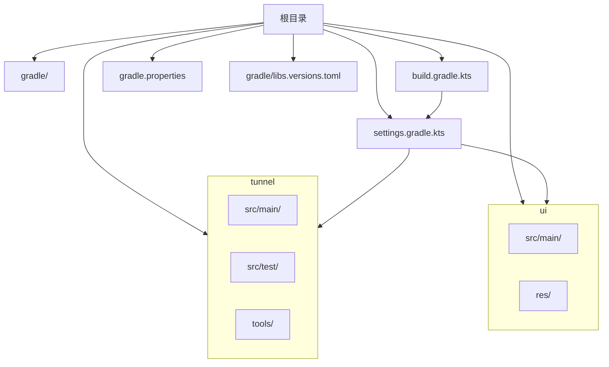
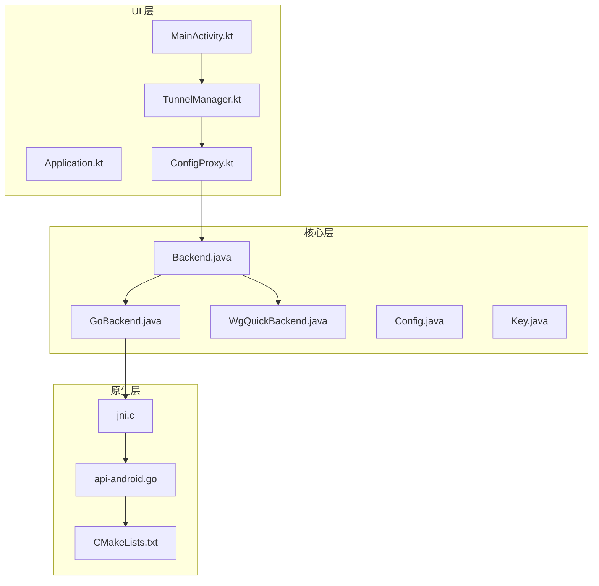
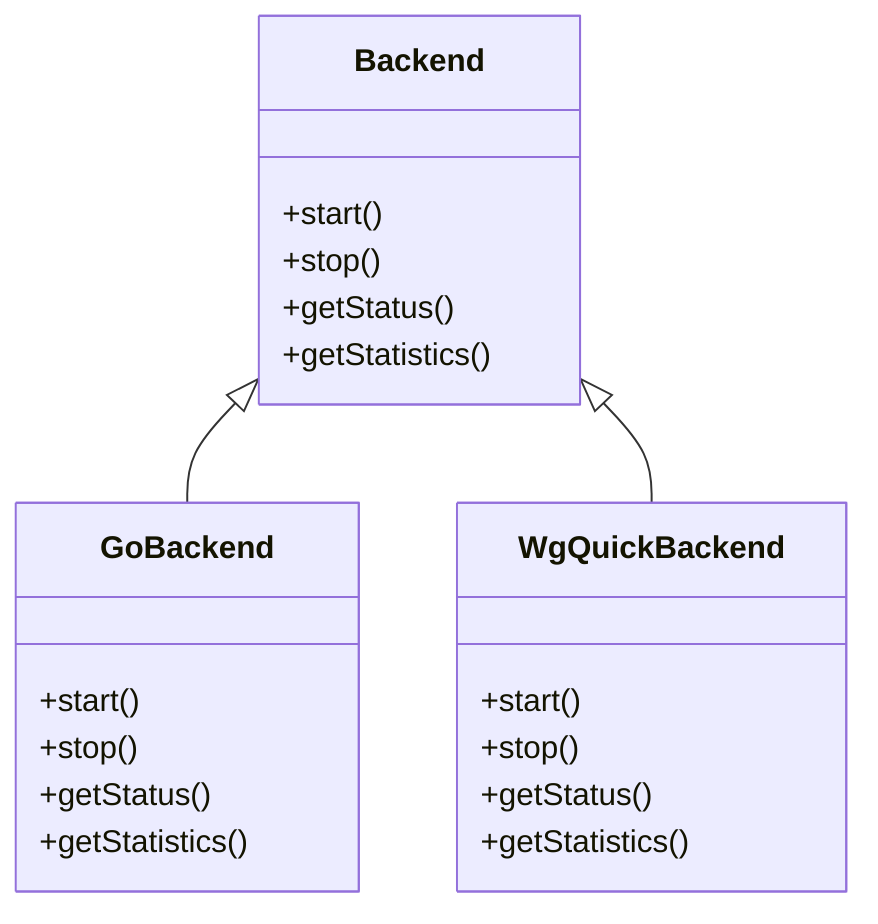
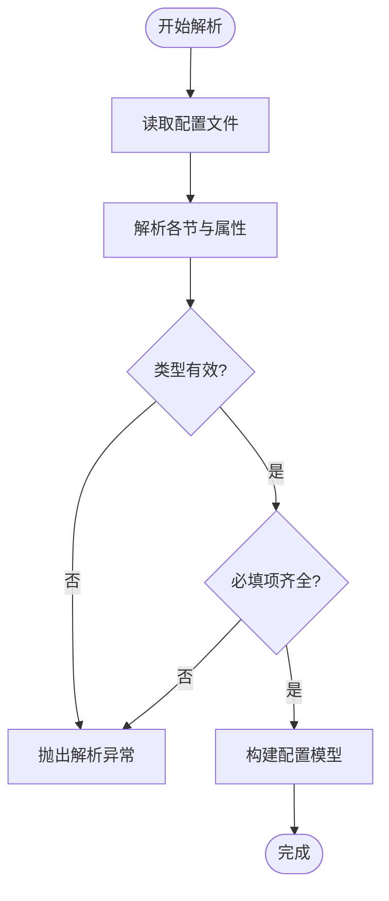
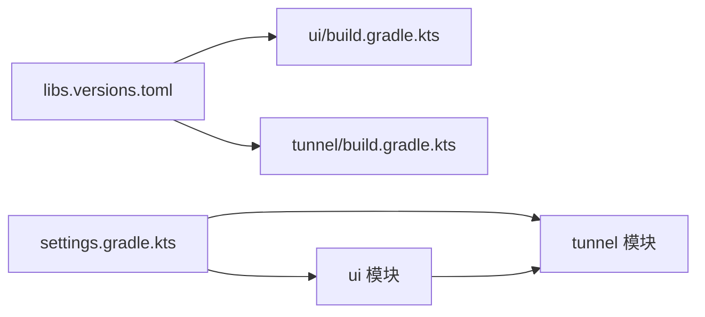

# 开发指南

<cite>
**本文档引用的文件**   
- [README.md](file://README.md)
- [build.gradle.kts](file://build.gradle.kts)
- [settings.gradle.kts](file://settings.gradle.kts)
- [gradle.properties](file://gradle.properties)
- [gradle/libs.versions.toml](file://gradle/libs.versions.toml)
- [tunnel/build.gradle.kts](file://tunnel/build.gradle.kts)
- [ui/build.gradle.kts](file://ui/build.gradle.kts)
- [tunnel/src/main/AndroidManifest.xml](file://tunnel/src/main/AndroidManifest.xml)
- [ui/src/main/AndroidManifest.xml](file://ui/src/main/AndroidManifest.xml)
- [tunnel/src/main/java/com/wireguard/android/backend/Backend.java](file://tunnel/src/main/java/com/wireguard/android/backend/Backend.java)
- [tunnel/src/main/java/com/wireguard/android/backend/GoBackend.java](file://tunnel/src/main/java/com/wireguard/android/backend/GoBackend.java)
- [tunnel/src/main/java/com/wireguard/android/backend/WgQuickBackend.java](file://tunnel/src/main/java/com/wireguard/android/backend/WgQuickBackend.java)
- [tunnel/src/main/java/com/wireguard/config/Config.java](file://tunnel/src/main/java/com/wireguard/config/Config.java)
- [tunnel/src/main/java/com/wireguard/crypto/Key.java](file://tunnel/src/main/java/com/wireguard/crypto/Key.java)
- [tunnel/src/test/java/com/wireguard/config/ConfigTest.java](file://tunnel/src/test/java/com/wireguard/config/ConfigTest.java)
- [ui/src/main/java/com/wireguard/android/Application.kt](file://ui/src/main/java/com/wireguard/android/Application.kt)
- [ui/src/main/java/com/wireguard/android/activity/MainActivity.kt](file://ui/src/main/java/com/wireguard/android/activity/MainActivity.kt)
- [ui/src/main/java/com/wireguard/android/model/TunnelManager.kt](file://ui/src/main/java/com/wireguard/android/model/TunnelManager.kt)
- [ui/src/main/java/com/wireguard/android/viewmodel/ConfigProxy.kt](file://ui/src/main/java/com/wireguard/android/viewmodel/ConfigProxy.kt)
- [ui/src/main/java/com/wireguard/android/util/AdminKnobs.kt](file://ui/src/main/java/com/wireguard/android/util/AdminKnocks.kt)
- [ui/src/main/res/values/strings.xml](file://ui/src/main/res/values/strings.xml)
- [ui/src/main/res/xml/preferences.xml](file://ui/src/main/res/xml/preferences.xml)
- [tunnel/tools/libwg-go/api-android.go](file://tunnel/tools/libwg-go/api-android.go)
- [tunnel/tools/libwg-go/jni.c](file://tunnel/tools/libwg-go/jni.c)
- [tunnel/tools/CMakeLists.txt](file://tunnel/tools/CMakeLists.txt)
</cite>

## 目录
1. [简介](#简介)
2. [项目结构](#项目结构)
3. [核心组件](#核心组件)
4. [架构总览](#架构总览)
5. [详细组件分析](#详细组件分析)
6. [依赖关系分析](#依赖关系分析)
7. [性能考虑](#性能考虑)
8. [故障排除指南](#故障排除指南)
9. [结论](#结论)
10. [附录](#附录)

## 简介
本指南面向希望参与 WireGuard Android 项目的开发者，涵盖开发环境搭建、构建系统配置、代码组织规范、编码风格与最佳实践、调试技巧、测试方法、代码审查流程与提交规范、常见问题排查以及扩展开发（新增后端实现或 UI 组件）等主题。文档内容基于仓库中的实际结构与源码进行分析总结，力求为不同技术背景的读者提供清晰、可操作的指导。

## 项目结构
WireGuard Android 采用多模块结构，主要包含：
- tunnel 模块：核心隧道逻辑、配置解析、加密原语、与 Go 后端的 JNI 桥接、工具链与 CMake 构建脚本。
- ui 模块：Android 应用界面层，包含 Activity/Fragment/ViewModel、资源文件、偏好设置与更新器等。

根级构建与设置文件：
- build.gradle.kts：顶层 Gradle 脚本，统一插件与全局配置。
- settings.gradle.kts：模块声明与版本目录管理入口。
- gradle.properties：Gradle 运行参数与 Android 编译选项。
- gradle/libs.versions.toml：集中化的依赖版本管理。

图表来源
- [build.gradle.kts](file://build.gradle.kts)
- [settings.gradle.kts](file://settings.gradle.kts)
- [gradle/libs.versions.toml](file://gradle/libs.versions.toml)

章节来源
- [build.gradle.kts](file://build.gradle.kts)
- [settings.gradle.kts](file://settings.gradle.kts)
- [gradle.properties](file://gradle.properties)
- [gradle/libs.versions.toml](file://gradle/libs.versions.toml)

## 核心组件
- 后端抽象与实现
  - Backend 接口定义统一的隧道操作契约，GoBackend 与 WgQuickBackend 分别封装 Go 内核与 wg-quick 工作流。
- 配置模型
  - Config、Interface、Peer、Attribute 等类描述 WireGuard 配置的结构与校验规则。
- 加密原语
  - Key、KeyPair、Curve25519 等提供密钥管理与曲线运算能力。
- UI 层
  - Application、MainActivity、TunnelManager、ConfigProxy 等负责应用生命周期、主界面交互、隧道管理与数据代理。

章节来源
- [tunnel/src/main/java/com/wireguard/android/backend/Backend.java](file://tunnel/src/main/java/com/wireguard/android/backend/Backend.java)
- [tunnel/src/main/java/com/wireguard/android/backend/GoBackend.java](file://tunnel/src/main/java/com/wireguard/android/backend/GoBackend.java)
- [tunnel/src/main/java/com/wireguard/android/backend/WgQuickBackend.java](file://tunnel/src/main/java/com/wireguard/android/backend/WgQuickBackend.java)
- [tunnel/src/main/java/com/wireguard/config/Config.java](file://tunnel/src/main/java/com/wireguard/config/Config.java)
- [tunnel/src/main/java/com/wireguard/crypto/Key.java](file://tunnel/src/main/java/com/wireguard/crypto/Key.java)
- [ui/src/main/java/com/wireguard/android/Application.kt](file://ui/src/main/java/com/wireguard/android/Application.kt)
- [ui/src/main/java/com/wireguard/android/activity/MainActivity.kt](file://ui/src/main/java/com/wireguard/android/activity/MainActivity.kt)
- [ui/src/main/java/com/wireguard/android/model/TunnelManager.kt](file://ui/src/main/java/com/wireguard/android/model/TunnelManager.kt)
- [ui/src/main/java/com/wireguard/android/viewmodel/ConfigProxy.kt](file://ui/src/main/java/com/wireguard/android/viewmodel/ConfigProxy.kt)

## 架构总览
整体架构分为三层：UI 层（Kotlin）、核心逻辑层（Java/Kotlin）、后端与原生层（Go/JNI/C）。UI 通过 ViewModel 与数据代理访问 TunnelManager，后者调用 tunnel 模块的后端接口；后端通过 JNI 调用 libwg-go，最终驱动内核态 WireGuard。

图表来源
- [ui/src/main/java/com/wireguard/android/Application.kt](file://ui/src/main/java/com/wireguard/android/Application.kt)
- [ui/src/main/java/com/wireguard/android/activity/MainActivity.kt](file://ui/src/main/java/com/wireguard/android/activity/MainActivity.kt)
- [ui/src/main/java/com/wireguard/android/model/TunnelManager.kt](file://ui/src/main/java/com/wireguard/android/model/TunnelManager.kt)
- [ui/src/main/java/com/wireguard/android/viewmodel/ConfigProxy.kt](file://ui/src/main/java/com/wireguard/android/viewmodel/ConfigProxy.kt)
- [tunnel/src/main/java/com/wireguard/android/backend/Backend.java](file://tunnel/src/main/java/com/wireguard/android/backend/Backend.java)
- [tunnel/src/main/java/com/wireguard/android/backend/GoBackend.java](file://tunnel/src/main/java/com/wireguard/android/backend/GoBackend.java)
- [tunnel/src/main/java/com/wireguard/android/backend/WgQuickBackend.java](file://tunnel/src/main/java/com/wireguard/android/backend/WgQuickBackend.java)
- [tunnel/src/main/java/com/wireguard/config/Config.java](file://tunnel/src/main/java/com/wireguard/config/Config.java)
- [tunnel/src/main/java/com/wireguard/crypto/Key.java](file://tunnel/src/main/java/com/wireguard/crypto/Key.java)
- [tunnel/tools/libwg-go/jni.c](file://tunnel/tools/libwg-go/jni.c)
- [tunnel/tools/libwg-go/api-android.go](file://tunnel/tools/libwg-go/api-android.go)
- [tunnel/tools/CMakeLists.txt](file://tunnel/tools/CMakeLists.txt)

## 详细组件分析

### 后端抽象与实现
- Backend 接口定义了启动、停止、状态查询、统计获取等核心方法，确保不同后端实现的一致性。
- GoBackend 通过 JNI 调用 libwg-go，封装 Go 运行时与内核交互。
- WgQuickBackend 使用 wg-quick 脚本进行配置与应用，适合快速部署场景。

图表来源
- [tunnel/src/main/java/com/wireguard/android/backend/Backend.java](file://tunnel/src/main/java/com/wireguard/android/backend/Backend.java)
- [tunnel/src/main/java/com/wireguard/android/backend/GoBackend.java](file://tunnel/src/main/java/com/wireguard/android/backend/GoBackend.java)
- [tunnel/src/main/java/com/wireguard/android/backend/WgQuickBackend.java](file://tunnel/src/main/java/com/wireguard/android/backend/WgQuickBackend.java)

章节来源
- [tunnel/src/main/java/com/wireguard/android/backend/Backend.java](file://tunnel/src/main/java/com/wireguard/android/backend/Backend.java)
- [tunnel/src/main/java/com/wireguard/android/backend/GoBackend.java](file://tunnel/src/main/java/com/wireguard/android/backend/GoBackend.java)
- [tunnel/src/main/java/com/wireguard/android/backend/WgQuickBackend.java](file://tunnel/src/main/java/com/wireguard/android/backend/WgQuickBackend.java)

### 配置解析与校验
- Config、Interface、Peer、Attribute 等类共同描述 WireGuard 配置文件结构。
- 解析过程包括语法检查、字段类型验证、必填项校验与异常抛出。
- 单元测试覆盖常见错误场景，如缺失属性、非法值、未知节等。

图表来源
- [tunnel/src/main/java/com/wireguard/config/Config.java](file://tunnel/src/main/java/com/wireguard/config/Config.java)
- [tunnel/src/test/java/com/wireguard/config/ConfigTest.java](file://tunnel/src/test/java/com/wireguard/config/ConfigTest.java)

章节来源
- [tunnel/src/main/java/com/wireguard/config/Config.java](file://tunnel/src/main/java/com/wireguard/config/Config.java)
- [tunnel/src/test/java/com/wireguard/config/ConfigTest.java](file://tunnel/src/test/java/com/wireguard/config/ConfigTest.java)

### 加密原语与密钥管理
- Key、KeyPair、Curve25519 提供密钥生成、序列化与椭圆曲线运算。
- 密钥格式校验与转换在导入/导出时尤为重要，避免非法输入导致崩溃。

章节来源
- [tunnel/src/main/java/com/wireguard/crypto/Key.java](file://tunnel/src/main/java/com/wireguard/crypto/Key.java)

### UI 层与数据代理
- Application 初始化全局上下文与偏好设置。
- MainActivity 作为入口，承载主要导航与用户交互。
- TunnelManager 管理隧道实例的生命周期与状态同步。
- ConfigProxy 将 UI 层与后端配置解耦，便于测试与替换实现。

章节来源
- [ui/src/main/java/com/wireguard/android/Application.kt](file://ui/src/main/java/com/wireguard/android/Application.kt)
- [ui/src/main/java/com/wireguard/android/activity/MainActivity.kt](file://ui/src/main/java/com/wireguard/android/activity/MainActivity.kt)
- [ui/src/main/java/com/wireguard/android/model/TunnelManager.kt](file://ui/src/main/java/com/wireguard/android/model/TunnelManager.kt)
- [ui/src/main/java/com/wireguard/android/viewmodel/ConfigProxy.kt](file://ui/src/main/java/com/wireguard/android/viewmodel/ConfigProxy.kt)

### 原生层与 JNI 桥接
- jni.c 暴露 C API 供 Java 调用，处理内存与线程边界。
- api-android.go 定义 Go 侧的导出函数，对接 libwg-go 的核心功能。
- CMakeLists.txt 组织原生库的构建流程，适配 Android NDK。

章节来源
- [tunnel/tools/libwg-go/jni.c](file://tunnel/tools/libwg-go/jni.c)
- [tunnel/tools/libwg-go/api-android.go](file://tunnel/tools/libwg-go/api-android.go)
- [tunnel/tools/CMakeLists.txt](file://tunnel/tools/CMakeLists.txt)

## 依赖关系分析
- 版本管理集中在 gradle/libs.versions.toml，统一 Kotlin、AndroidX、第三方库的版本。
- 模块间依赖通过 settings.gradle.kts 声明，tunnel 与 ui 相互独立但可通过接口协作。
- 原生依赖由 CMake 与 NDK 管理，Go 模块通过 Makefile 与 go.mod 维护。

图表来源
- [gradle/libs.versions.toml](file://gradle/libs.versions.toml)
- [ui/build.gradle.kts](file://ui/build.gradle.kts)
- [tunnel/build.gradle.kts](file://tunnel/build.gradle.kts)
- [settings.gradle.kts](file://settings.gradle.kts)

章节来源
- [gradle/libs.versions.toml](file://gradle/libs.versions.toml)
- [ui/build.gradle.kts](file://ui/build.gradle.kts)
- [tunnel/build.gradle.kts](file://tunnel/build.gradle.kts)
- [settings.gradle.kts](file://settings.gradle.kts)

## 性能考虑
- 避免在主线程执行 I/O 与网络请求，使用协程或后台线程。
- 合理缓存配置与状态，减少重复解析与计算。
- 原生层注意内存分配与释放，避免频繁 GC 触发。
- 日志输出按需分级，生产环境降低冗余日志以提升性能。

[本节为通用建议，不直接分析具体文件]

## 故障排除指南
- 构建失败
  - 检查 JDK 版本与 Android SDK/NDK 路径配置是否正确。
  - 确认 gradle.properties 中相关开关与版本兼容。
- 运行崩溃
  - 查看 Logcat 过滤关键字，定位异常堆栈。
  - 断点调试 UI 与 ViewModel 层，逐步排查数据流。
- 配置解析错误
  - 参考单元测试用例，核对配置文件语法与必填项。
- 原生库加载失败
  - 确认 CMake 与 NDK 安装路径，检查 ABI 支持。
  - 验证 Go 模块编译产物是否生成正确。

章节来源
- [gradle.properties](file://gradle.properties)
- [tunnel/src/test/java/com/wireguard/config/ConfigTest.java](file://tunnel/src/test/java/com/wireguard/config/ConfigTest.java)
- [tunnel/tools/CMakeLists.txt](file://tunnel/tools/CMakeLists.txt)

## 结论
本指南从环境搭建、构建系统、代码组织、编码规范、调试与测试、代码审查到扩展开发等方面提供了全面的开发指导。遵循本文档的建议，有助于提升开发效率与代码质量，保障 WireGuard Android 的稳定与可维护性。

[本节为总结性内容，不直接分析具体文件]

## 附录

### 开发环境搭建要求
- JDK：建议使用与 Android Gradle Plugin 兼容的 JDK 版本（通常为 JDK 11 或更高），并在 Android Studio 中配置对应 SDK。
- Android Studio：安装最新稳定版，启用 Kotlin 与 C++ 支持，配置 NDK 与 CMake。
- 工具链：确保已安装 Android SDK、NDK、CMake、Go 编译器（用于 libwg-go 构建）。

章节来源
- [gradle.properties](file://gradle.properties)
- [tunnel/tools/CMakeLists.txt](file://tunnel/tools/CMakeLists.txt)

### 构建系统与依赖管理
- 顶层 build.gradle.kts 统一插件与全局配置。
- settings.gradle.kts 声明模块与版本目录。
- gradle/libs.versions.toml 集中管理依赖版本。
- 各模块 build.gradle.kts 定义自身依赖与构建选项。

章节来源
- [build.gradle.kts](file://build.gradle.kts)
- [settings.gradle.kts](file://settings.gradle.kts)
- [gradle/libs.versions.toml](file://gradle/libs.versions.toml)
- [ui/build.gradle.kts](file://ui/build.gradle.kts)
- [tunnel/build.gradle.kts](file://tunnel/build.gradle.kts)

### 代码组织与命名规范
- 包命名：按功能域划分，如 com.wireguard.android.backend、com.wireguard.config、com.wireguard.crypto。
- 文件组织：每个类一个文件，资源按类型分组（layout、drawable、values 等）。
- 模块划分：tunnel 为核心逻辑与原生桥接，ui 为界面与交互。

章节来源
- [tunnel/src/main/AndroidManifest.xml](file://tunnel/src/main/AndroidManifest.xml)
- [ui/src/main/AndroidManifest.xml](file://ui/src/main/AndroidManifest.xml)
- [ui/src/main/res/values/strings.xml](file://ui/src/main/res/values/strings.xml)
- [ui/src/main/res/xml/preferences.xml](file://ui/src/main/res/xml/preferences.xml)

### 编码风格与最佳实践
- Kotlin：优先使用不可变数据、协程处理异步、密封类表达状态。
- Java：保持接口简洁、异常明确、注释清晰。
- 资源与字符串：使用资源文件管理文案，避免硬编码。

章节来源
- [ui/src/main/java/com/wireguard/android/util/AdminKnobs.kt](file://ui/src/main/java/com/wireguard/android/util/AdminKnocks.kt)
- [ui/src/main/res/values/strings.xml](file://ui/src/main/res/values/strings.xml)

### 调试技巧
- 日志查看：使用 Logcat 过滤标签与级别，结合自定义日志工具。
- 断点调试：在 Activity/Fragment/ViewModel 关键路径设置断点，观察数据变化。
- 性能分析：使用 Android Profiler 分析 CPU、内存、网络与电池消耗。

章节来源
- [ui/src/main/java/com/wireguard/android/activity/MainActivity.kt](file://ui/src/main/java/com/wireguard/android/activity/MainActivity.kt)
- [ui/src/main/java/com/wireguard/android/viewmodel/ConfigProxy.kt](file://ui/src/main/java/com/wireguard/android/viewmodel/ConfigProxy.kt)

### 测试编写方法
- 单元测试：针对配置解析、加密原语与工具类编写 JUnit 测试。
- 集成测试：模拟后端行为，验证 UI 与数据代理的交互。
- 资源测试：校验字符串与资源完整性。

章节来源
- [tunnel/src/test/java/com/wireguard/config/ConfigTest.java](file://tunnel/src/test/java/com/wireguard/config/ConfigTest.java)

### 代码审查与提交规范
- 代码审查：关注接口设计、异常处理、性能影响与可读性。
- 提交规范：提交信息应清晰描述变更目的与影响范围，附带必要截图或日志。

[本节为通用建议，不直接分析具体文件]

### 扩展开发指导
- 新增后端实现
  - 实现 Backend 接口，封装新的隧道工作方式（如基于其他内核或工具）。
  - 在应用初始化中选择并注册新后端。
- 新增 UI 组件
  - 创建 Fragment/Activity，添加布局与资源，绑定 ViewModel。
  - 在导航与菜单中集成新页面。

章节来源
- [tunnel/src/main/java/com/wireguard/android/backend/Backend.java](file://tunnel/src/main/java/com/wireguard/android/backend/Backend.java)
- [ui/src/main/java/com/wireguard/android/activity/MainActivity.kt](file://ui/src/main/java/com/wireguard/android/activity/MainActivity.kt)
- [ui/src/main/res/menu/main_activity.xml](file://ui/src/main/res/menu/main_activity.xml)