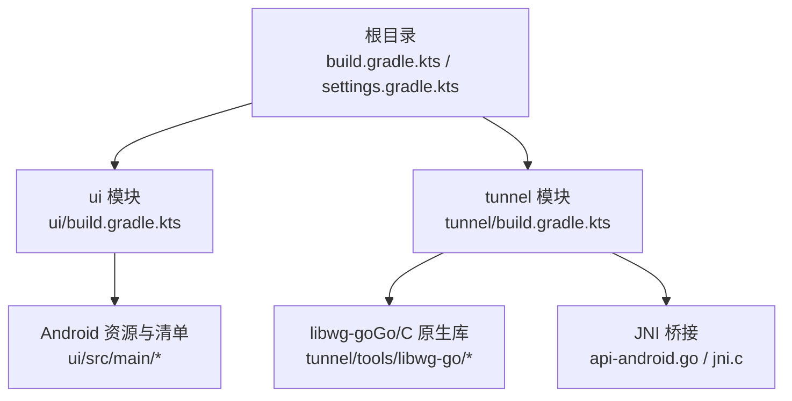
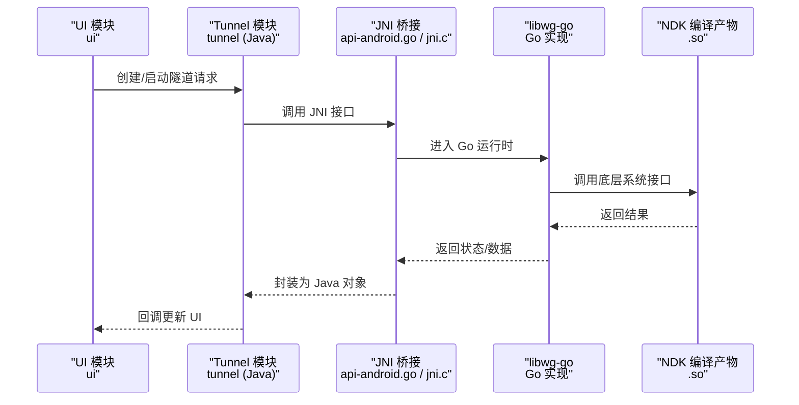
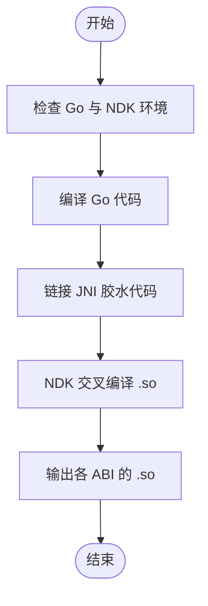
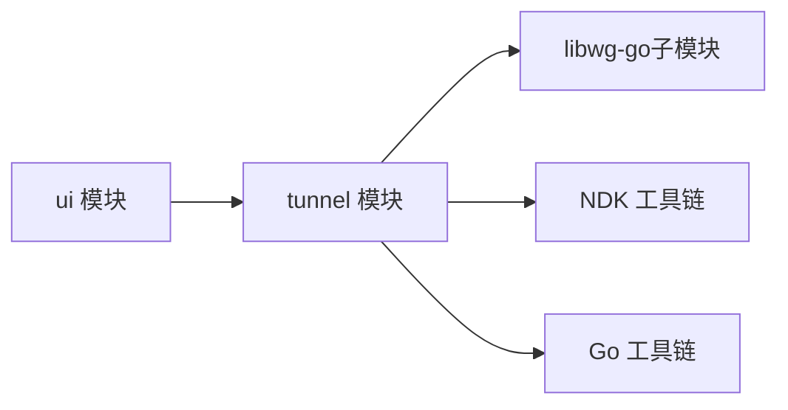

# 开发环境搭建

<cite>
**本文引用的文件**   
- [README.md](file://README.md)
- [.gitmodules](file://.gitmodules)
- [gradle.properties](file://gradle.properties)
- [gradle/libs.versions.toml](file://gradle/libs.versions.toml)
- [build.gradle.kts](file://build.gradle.kts)
- [settings.gradle.kts](file://settings.gradle.kts)
- [tunnel/build.gradle.kts](file://tunnel/build.gradle.kts)
- [ui/build.gradle.kts](file://ui/build.gradle.kts)
- [tunnel/tools/libwg-go/Makefile](file://tunnel/tools/libwg-go/Makefile)
- [tunnel/tools/libwg-go/go.mod](file://tunnel/tools/libwg-go/go.mod)
- [tunnel/tools/libwg-go/api-android.go](file://tunnel/tools/libwg-go/api-android.go)
- [tunnel/tools/libwg-go/jni.c](file://tunnel/tools/libwg-go/jni.c)
</cite>

## 目录
1. [简介](#简介)
2. [项目结构](#项目结构)
3. [核心组件](#核心组件)
4. [架构总览](#架构总览)
5. [详细组件分析](#详细组件分析)
6. [依赖关系分析](#依赖关系分析)
7. [性能注意事项](#性能注意事项)
8. [故障排查指南](#故障排查指南)
9. [结论](#结论)
10. [附录](#附录)

## 简介
本指南面向首次参与 WireGuard Android 项目的开发者，提供从零开始搭建本地开发环境的完整步骤。内容涵盖：
- 开发工具与版本要求（Android Studio、JDK、Android SDK）
- Gradle 构建系统配置与依赖版本管理
- Git 子模块初始化（libwg-go）
- 常见环境问题定位与解决（NDK、Go 环境、网络问题）
- 首次克隆仓库后的初始化流程与验证方法

## 项目结构
WireGuard Android 采用多模块结构，主要包含：
- ui：Android 应用界面层（Kotlin），负责用户交互、设置、隧道管理等
- tunnel：核心功能模块（Java + Go + C），通过 JNI 调用 libwg-go 实现内核态隧道能力
- gradle：集中式依赖版本管理（libs.versions.toml）与 Gradle Wrapper
- 根级构建脚本与设置：统一构建入口、子模块声明、全局属性

图表来源 
- [build.gradle.kts](file://build.gradle.kts)
- [settings.gradle.kts](file://settings.gradle.kts)
- [ui/build.gradle.kts](file://ui/build.gradle.kts)
- [tunnel/build.gradle.kts](file://tunnel/build.gradle.kts)
- [tunnel/tools/libwg-go/api-android.go](file://tunnel/tools/libwg-go/api-android.go)
- [tunnel/tools/libwg-go/jni.c](file://tunnel/tools/libwg-go/jni.c)

章节来源
- [README.md](file://README.md)
- [settings.gradle.kts](file://settings.gradle.kts)
- [build.gradle.kts](file://build.gradle.kts)

## 核心组件
- Android 应用层（ui）：基于 Kotlin 的 MVVM 架构，使用 DataBinding、Fragment、ViewModel 等现代 Android 组件
- 隧道核心（tunnel）：Java 接口封装 + JNI + Go 实现的 WireGuard 协议栈，最终通过 NDK 编译为原生库供 Android 调用
- 构建与依赖：Gradle KTS + Version Catalog（libs.versions.toml）统一管理插件与依赖版本
- 原生库集成：libwg-go 作为 Git 子模块，通过 Makefile 和 NDK 交叉编译生成 .so，再由 Java 侧加载

章节来源
- [ui/build.gradle.kts](file://ui/build.gradle.kts)
- [tunnel/build.gradle.kts](file://tunnel/build.gradle.kts)
- [gradle/libs.versions.toml](file://gradle/libs.versions.toml)

## 架构总览
下图展示了从 Android UI 到原生 WireGuard 的核心调用链与数据流：

图表来源 
- [ui/build.gradle.kts](file://ui/build.gradle.kts)
- [tunnel/build.gradle.kts](file://tunnel/build.gradle.kts)
- [tunnel/tools/libwg-go/api-android.go](file://tunnel/tools/libwg-go/api-android.go)
- [tunnel/tools/libwg-go/jni.c](file://tunnel/tools/libwg-go/jni.c)

## 详细组件分析

### 构建系统与依赖版本管理
- 根级 build.gradle.kts：统一声明 Android/Kotlin/AGP 插件版本与公共配置
- settings.gradle.kts：声明 ui、tunnel 等子模块
- gradle/libs.versions.toml：集中管理所有依赖与插件的版本号，便于升级与维护
- gradle.properties：定义全局构建参数（如 JDK 路径、并行构建、内存等）

建议关注的关键点：
- AGP、Kotlin、Gradle 版本需与 Android Studio 兼容
- libs.versions.toml 中统一维护第三方库版本，避免冲突
- gradle.properties 中合理设置 JVM 内存与并行任务数，提升构建速度

章节来源
- [build.gradle.kts](file://build.gradle.kts)
- [settings.gradle.kts](file://settings.gradle.kts)
- [gradle/libs.versions.toml](file://gradle/libs.versions.toml)
- [gradle.properties](file://gradle.properties)

### Git 子模块与 libwg-go 初始化
- .gitmodules：声明 libwg-go 子模块路径与远程仓库地址
- 首次克隆后需初始化并拉取子模块，否则无法编译原生库
- libwg-go 内部通过 go.mod 管理 Go 依赖，Makefile 负责 NDK 交叉编译

初始化步骤要点：
- 使用 git clone --recurse-submodules 或先 clone 再执行 git submodule update --init --recursive
- 确保 Go 环境可用（版本与 go.mod 兼容）
- 确保 NDK 已安装且路径正确

章节来源
- [.gitmodules](file://.gitmodules)
- [tunnel/tools/libwg-go/go.mod](file://tunnel/tools/libwg-go/go.mod)
- [tunnel/tools/libwg-go/Makefile](file://tunnel/tools/libwg-go/Makefile)

### 原生库构建流程（libwg-go）
libwg-go 通过 JNI 暴露给 Java 层，构建过程涉及：
- Go 代码编译为静态库
- C/JNI 胶水代码链接
- NDK 交叉编译为各 ABI 的 .so

图表来源 
- [tunnel/tools/libwg-go/Makefile](file://tunnel/tools/libwg-go/Makefile)
- [tunnel/tools/libwg-go/api-android.go](file://tunnel/tools/libwg-go/api-android.go)
- [tunnel/tools/libwg-go/jni.c](file://tunnel/tools/libwg-go/jni.c)

章节来源
- [tunnel/tools/libwg-go/Makefile](file://tunnel/tools/libwg-go/Makefile)
- [tunnel/tools/libwg-go/api-android.go](file://tunnel/tools/libwg-go/api-android.go)
- [tunnel/tools/libwg-go/jni.c](file://tunnel/tools/libwg-go/jni.c)

### Android 模块与 JNI 集成
- tunnel 模块通过 Java 接口封装 libwg-go 的能力，并使用 JNI 进行跨语言调用
- ui 模块依赖 tunnel 模块提供的 API 进行隧道管理与状态展示
- 构建脚本中需正确配置 NDK、CMake/NDK 工具链与 ABI 过滤

章节来源
- [tunnel/build.gradle.kts](file://tunnel/build.gradle.kts)
- [ui/build.gradle.kts](file://ui/build.gradle.kts)

## 依赖关系分析
- 模块依赖：ui 依赖 tunnel；tunnel 依赖 libwg-go（子模块）
- 构建依赖：AGP、Kotlin、Gradle 插件由根脚本与版本目录统一管理
- 原生依赖：NDK、Go 工具链、libwg-go 的 Makefile 目标

图表来源 
- [settings.gradle.kts](file://settings.gradle.kts)
- [tunnel/build.gradle.kts](file://tunnel/build.gradle.kts)
- [ui/build.gradle.kts](file://ui/build.gradle.kts)

章节来源
- [settings.gradle.kts](file://settings.gradle.kts)
- [tunnel/build.gradle.kts](file://tunnel/build.gradle.kts)
- [ui/build.gradle.kts](file://ui/build.gradle.kts)

## 性能注意事项
- 启用 Gradle 守护进程与并行构建，合理设置 JVM 堆大小
- 使用增量编译与缓存（包括 NDK 构建缓存）
- 仅构建需要的 ABI，减少不必要的交叉编译时间
- 在 CI 中缓存 Go 依赖与 NDK 工具链，缩短构建时长

[本节为通用指导，不直接分析具体文件]

## 故障排查指南
常见问题与解决方案：
- NDK 未安装或路径错误
  - 确认 Android Studio 已安装 NDK，并在项目中指向正确的 NDK 版本
  - 若使用命令行构建，确保 ANDROID_NDK_HOME 或 ndk.dir 配置正确
- Go 环境缺失或版本不匹配
  - 安装与 go.mod 兼容的 Go 版本，并确保 go 命令可用
  - 首次构建前执行子模块初始化
- 网络连接问题导致依赖下载失败
  - 配置国内镜像源（Maven、Google、Gradle Plugin Portal）
  - 检查代理设置与防火墙规则
- 子模块未初始化
  - 执行 git submodule update --init --recursive
- 构建内存不足
  - 调整 gradle.properties 中的 org.gradle.jvmargs 与并行线程数

章节来源
- [gradle.properties](file://gradle.properties)
- [.gitmodules](file://.gitmodules)
- [tunnel/tools/libwg-go/go.mod](file://tunnel/tools/libwg-go/go.mod)

## 结论
完成上述步骤后，您应能成功在本地构建并运行 WireGuard Android 项目。建议在首次构建时记录关键环境变量与版本信息，以便团队协作与 CI 环境保持一致。遇到问题时优先检查 NDK、Go 环境与子模块状态，其次查看构建日志定位依赖下载与编译错误。

[本节为总结性内容，不直接分析具体文件]

## 附录
- 首次克隆与初始化完整步骤
  - 克隆仓库并初始化子模块
  - 安装 Android Studio、JDK、Android SDK、NDK
  - 打开项目并同步 Gradle
  - 首次构建（可能耗时较长）
  - 验证：运行 ui 模块，检查是否能正常加载隧道模块与原生库
- 常用命令参考
  - 同步与构建：./gradlew assembleDebug
  - 清理构建：./gradlew clean
  - 子模块更新：git submodule update --init --recursive

[本节为补充说明，不直接分析具体文件]