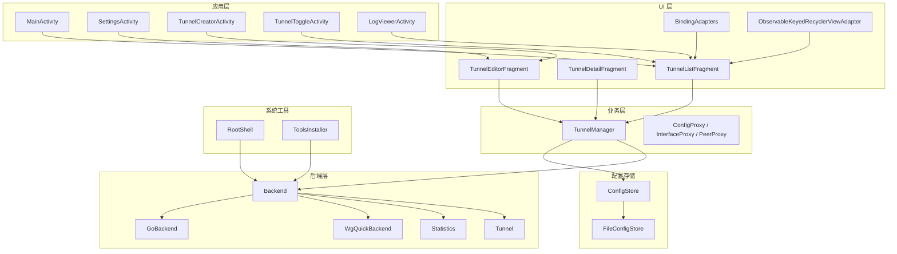
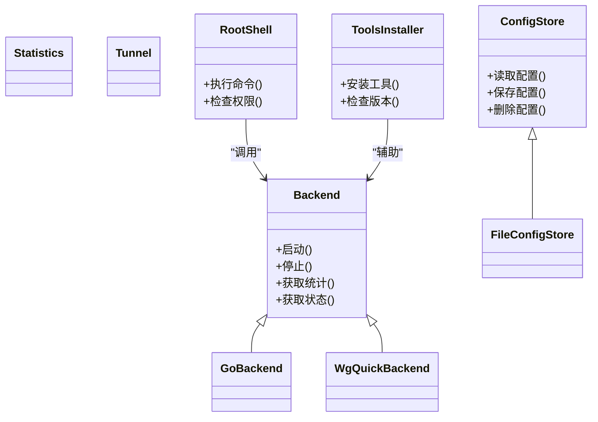
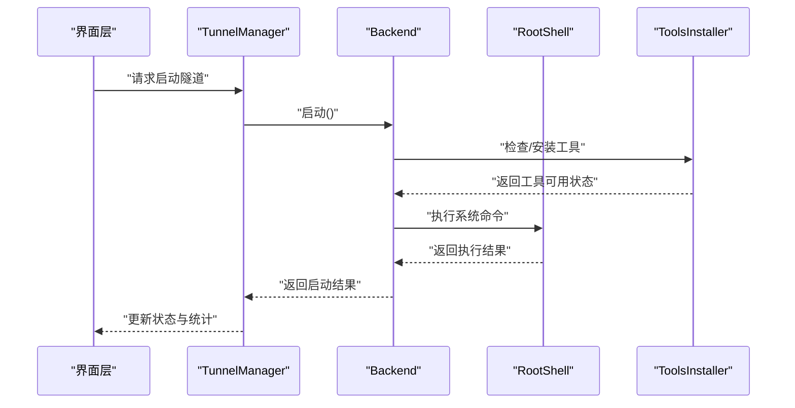
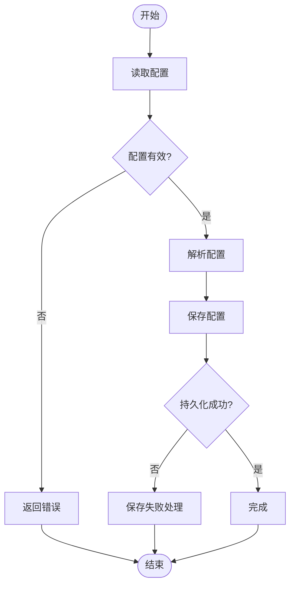
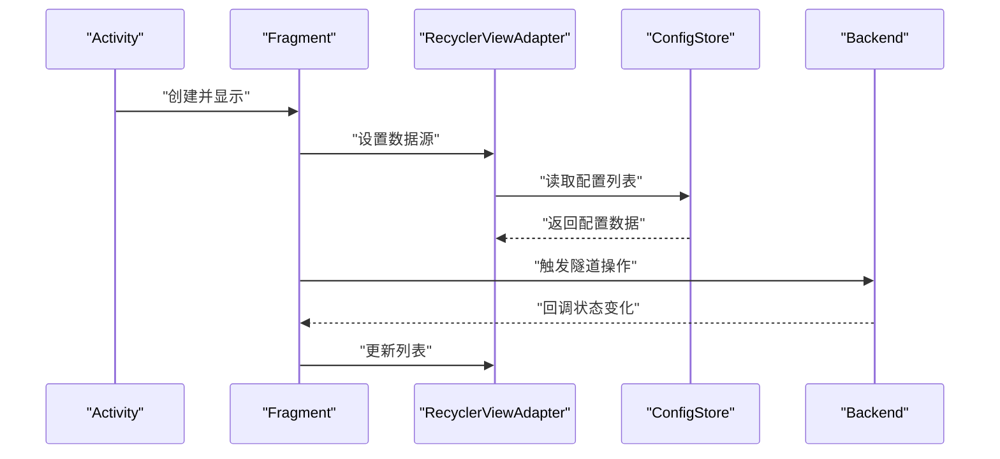
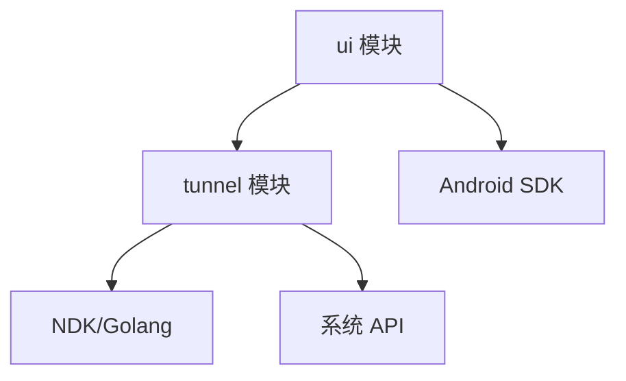

# 扩展开发指南

<cite>
**本文档引用的文件**   
- [Backend.java](file://tunnel/src/main/java/com/wireguard/android/backend/Backend.java)
- [GoBackend.java](file://tunnel/src/main/java/com/wireguard/android/backend/GoBackend.java)
- [WgQuickBackend.java](file://tunnel/src/main/java/com/wireguard/android/backend/WgQuickBackend.java)
- [Statistics.java](file://tunnel/src/main/java/com/wireguard/android/backend/Statistics.java)
- [Tunnel.java](file://tunnel/src/main/java/com/wireguard/android/backend/Tunnel.java)
- [ConfigStore.kt](file://ui/src/main/java/com/wireguard/android/configStore/ConfigStore.kt)
- [FileConfigStore.kt](file://ui/src/main/java/com/wireguard/android/configStore/FileConfigStore.kt)
- [RootShell.java](file://tunnel/src/main/java/com/wireguard/android/util/RootShell.java)
- [ToolsInstaller.java](file://tunnel/src/main/java/com/wireguard/android/util/ToolsInstaller.java)
- [BaseFragment.kt](file://ui/src/main/java/com/wireguard/android/fragment/BaseFragment.kt)
- [TunnelListFragment.kt](file://ui/src/main/java/com/wireguard/android/fragment/TunnelListFragment.kt)
- [TunnelDetailFragment.kt](file://ui/src/main/java/com/wireguard/android/fragment/TunnelDetailFragment.kt)
- [TunnelEditorFragment.kt](file://ui/src/main/java/com/wireguard/android/fragment/TunnelEditorFragment.kt)
- [BindingAdapters.kt](file://ui/src/main/java/com/wireguard/android/databinding/BindingAdapters.kt)
- [ObservableKeyedRecyclerViewAdapter.kt](file://ui/src/main/java/com/wireguard/android/databinding/ObservableKeyedRecyclerViewAdapter.kt)
- [PreferencesPreferenceDataStore.kt](file://ui/src/main/java/com/wireguard/android/preference/PreferencesPreferenceDataStore.kt)
- [ToolsInstallerPreference.kt](file://ui/src/main/java/com/wireguard/android/preference/ToolsInstallerPreference.kt)
- [KernelModuleEnablerPreference.kt](file://ui/src/main/java/com/wireguard/android/preference/KernelModuleEnablerPreference.kt)
- [DonatePreference.kt](file://ui/src/main/java/com/wireguard/android/preference/DonatePreference.kt)
- [VersionPreference.kt](file://ui/src/main/java/com/wireguard/android/preference/VersionPreference.kt)
- [ZipExporterPreference.kt](file://ui/src/main/java/com/wireguard/android/preference/ZipExporterPreference.kt)
- [QuickTilePreference.kt](file://ui/src/main/java/com/wireguard/android/preference/QuickTilePreference.kt)
- [MainActivity.kt](file://ui/src/main/java/com/wireguard/android/activity/MainActivity.kt)
- [SettingsActivity.kt](file://ui/src/main/java/com/wireguard/android/activity/SettingsActivity.kt)
- [TunnelCreatorActivity.kt](file://ui/src/main/java/com/wireguard/android/activity/TunnelCreatorActivity.kt)
- [TunnelToggleActivity.kt](file://ui/src/main/java/com/wireguard/android/activity/TunnelToggleActivity.kt)
- [LogViewerActivity.kt](file://ui/src/main/java/com/wireguard/android/activity/LogViewerActivity.kt)
- [Application.kt](file://ui/src/main/java/com/wireguard/android/Application.kt)
- [BootShutdownReceiver.kt](file://ui/src/main/java/com/wireguard/android/BootShutdownReceiver.kt)
- [QuickTileService.kt](file://ui/src/main/java/com/wireguard/android/QuickTileService.kt)
- [build.gradle.kts](file://build.gradle.kts)
- [settings.gradle.kts](file://settings.gradle.kts)
- [gradle.properties](file://gradle.properties)
- [README.md](file://README.md)
</cite>

## 目录
1. [简介](#简介)
2. [项目结构](#项目结构)
3. [核心组件](#核心组件)
4. [架构总览](#架构总览)
5. [详细组件分析](#详细组件分析)
6. [依赖分析](#依赖分析)
7. [性能考虑](#性能考虑)
8. [故障排查指南](#故障排查指南)
9. [结论](#结论)
10. [附录](#附录)

## 简介
本指南面向希望在 WireGuard Android 项目中添加扩展的开发者，涵盖以下主题：
- 基于 Backend 接口实现新的后端（参考 GoBackend、WgQuickBackend）
- 自定义配置存储（基于 ConfigStore 接口与 FileConfigStore 模式）
- 新增 UI 组件与页面（Fragment 开发与数据绑定）
- 系统集成扩展点（RootShell 命令封装、工具安装器扩展）
- 偏好设置扩展（参考现有 Preference 类）
- 插件化架构建议与最佳实践
- 扩展模块打包与分发方法

## 项目结构
WireGuard Android 采用多模块结构，核心隧道能力位于 tunnel 模块，UI 与交互逻辑位于 ui 模块。关键目录与职责如下：
- tunnel/src/main/java/com/wireguard/android/backend：后端抽象与实现（Backend、GoBackend、WgQuickBackend）、统计信息（Statistics）、隧道模型（Tunnel）
- tunnel/src/main/java/com/wireguard/android/util：系统级工具（RootShell、ToolsInstaller、SharedLibraryLoader）
- ui/src/main/java/com/wireguard/android/configStore：配置持久化抽象与默认实现（ConfigStore、FileConfigStore）
- ui/src/main/java/com/wireguard/android/fragment：页面片段（列表、详情、编辑器等）
- ui/src/main/java/com/wireguard/android/databinding：数据绑定适配器与可观察集合
- ui/src/main/java/com/wireguard/android/preference：偏好设置项与数据源适配
- ui/src/main/java/com/wireguard/android/activity：主要活动入口与流程控制
- ui/src/main/java/com/wireguard/android/model：业务模型与管理器（如 TunnelManager）
- ui/src/main/java/com/wireguard/android/viewmodel：视图模型代理（InterfaceProxy、PeerProxy、ConfigProxy）
- ui/src/main/res：布局、样式、菜单等资源
- gradle 构建脚本：模块与依赖管理

图表来源
- [MainActivity.kt](file://ui/src/main/java/com/wireguard/android/activity/MainActivity.kt)
- [SettingsActivity.kt](file://ui/src/main/java/com/wireguard/android/activity/SettingsActivity.kt)
- [TunnelCreatorActivity.kt](file://ui/src/main/java/com/wireguard/android/activity/TunnelCreatorActivity.kt)
- [TunnelToggleActivity.kt](file://ui/src/main/java/com/wireguard/android/activity/TunnelToggleActivity.kt)
- [LogViewerActivity.kt](file://ui/src/main/java/com/wireguard/android/activity/LogViewerActivity.kt)
- [TunnelListFragment.kt](file://ui/src/main/java/com/wireguard/android/fragment/TunnelListFragment.kt)
- [TunnelDetailFragment.kt](file://ui/src/main/java/com/wireguard/android/fragment/TunnelDetailFragment.kt)
- [TunnelEditorFragment.kt](file://ui/src/main/java/com/wireguard/android/fragment/TunnelEditorFragment.kt)
- [BindingAdapters.kt](file://ui/src/main/java/com/wireguard/android/databinding/BindingAdapters.kt)
- [ObservableKeyedRecyclerViewAdapter.kt](file://ui/src/main/java/com/wireguard/android/databinding/ObservableKeyedRecyclerViewAdapter.kt)
- [ConfigStore.kt](file://ui/src/main/java/com/wireguard/android/configStore/ConfigStore.kt)
- [FileConfigStore.kt](file://ui/src/main/java/com/wireguard/android/configStore/FileConfigStore.kt)
- [Backend.java](file://tunnel/src/main/java/com/wireguard/android/backend/Backend.java)
- [GoBackend.java](file://tunnel/src/main/java/com/wireguard/android/backend/GoBackend.java)
- [WgQuickBackend.java](file://tunnel/src/main/java/com/wireguard/android/backend/WgQuickBackend.java)
- [Statistics.java](file://tunnel/src/main/java/com/wireguard/android/backend/Statistics.java)
- [Tunnel.java](file://tunnel/src/main/java/com/wireguard/android/backend/Tunnel.java)
- [RootShell.java](file://tunnel/src/main/java/com/wireguard/android/util/RootShell.java)
- [ToolsInstaller.java](file://tunnel/src/main/java/com/wireguard/android/util/ToolsInstaller.java)

章节来源
- [README.md](file://README.md)
- [build.gradle.kts](file://build.gradle.kts)
- [settings.gradle.kts](file://settings.gradle.kts)
- [gradle.properties](file://gradle.properties)

## 核心组件
- 后端抽象与实现
  - Backend：定义隧道生命周期与统计接口，供上层统一调用
  - GoBackend：基于 Go 实现的 WireGuard 后端
  - WgQuickBackend：基于 wg-quick 脚本的后端实现
  - Statistics：统计数据结构，用于展示连接状态与流量
  - Tunnel：隧道实体模型，承载配置与运行时状态

- 配置存储
  - ConfigStore：配置持久化抽象接口
  - FileConfigStore：基于文件的默认实现，提供配置的读写与序列化

- UI 与数据绑定
  - Fragment：列表、详情、编辑器等页面片段
  - BindingAdapters：数据绑定适配器，简化视图与数据同步
  - ObservableKeyedRecyclerViewAdapter：支持键控的可观察 RecyclerView 适配器

- 系统工具
  - RootShell：封装 root 权限命令执行
  - ToolsInstaller：工具安装与版本检查

- 偏好设置
  - PreferencesPreferenceDataStore：将 Android Preferences 映射为 DataStore
  - 各类 Preference：快速入口、内核模块启用、工具安装、捐赠、版本信息等

章节来源
- [Backend.java](file://tunnel/src/main/java/com/wireguard/android/backend/Backend.java)
- [GoBackend.java](file://tunnel/src/main/java/com/wireguard/android/backend/GoBackend.java)
- [WgQuickBackend.java](file://tunnel/src/main/java/com/wireguard/android/backend/WgQuickBackend.java)
- [Statistics.java](file://tunnel/src/main/java/com/wireguard/android/backend/Statistics.java)
- [Tunnel.java](file://tunnel/src/main/java/com/wireguard/android/backend/Tunnel.java)
- [ConfigStore.kt](file://ui/src/main/java/com/wireguard/android/configStore/ConfigStore.kt)
- [FileConfigStore.kt](file://ui/src/main/java/com/wireguard/android/configStore/FileConfigStore.kt)
- [BindingAdapters.kt](file://ui/src/main/java/com/wireguard/android/databinding/BindingAdapters.kt)
- [ObservableKeyedRecyclerViewAdapter.kt](file://ui/src/main/java/com/wireguard/android/databinding/ObservableKeyedRecyclerViewAdapter.kt)
- [RootShell.java](file://tunnel/src/main/java/com/wireguard/android/util/RootShell.java)
- [ToolsInstaller.java](file://tunnel/src/main/java/com/wireguard/android/util/ToolsInstaller.java)
- [PreferencesPreferenceDataStore.kt](file://ui/src/main/java/com/wireguard/android/preference/PreferencesPreferenceDataStore.kt)
- [ToolsInstallerPreference.kt](file://ui/src/main/java/com/wireguard/android/preference/ToolsInstallerPreference.kt)
- [KernelModuleEnablerPreference.kt](file://ui/src/main/java/com/wireguard/android/preference/KernelModuleEnablerPreference.kt)
- [DonatePreference.kt](file://ui/src/main/java/com/wireguard/android/preference/DonatePreference.kt)
- [VersionPreference.kt](file://ui/src/main/java/com/wireguard/android/preference/VersionPreference.kt)
- [ZipExporterPreference.kt](file://ui/src/main/java/com/wireguard/android/preference/ZipExporterPreference.kt)
- [QuickTilePreference.kt](file://ui/src/main/java/com/wireguard/android/preference/QuickTilePreference.kt)

## 架构总览
整体架构遵循分层设计：
- 表现层（Activity/Fragment）负责用户交互与页面导航
- 业务层（ViewModel/Model）协调数据与状态
- 配置层（ConfigStore）负责配置的持久化与加载
- 后端层（Backend）抽象底层隧道实现，屏蔽差异
- 系统工具（RootShell、ToolsInstaller）提供平台能力封装

图表来源
- [Backend.java](file://tunnel/src/main/java/com/wireguard/android/backend/Backend.java)
- [GoBackend.java](file://tunnel/src/main/java/com/wireguard/android/backend/GoBackend.java)
- [WgQuickBackend.java](file://tunnel/src/main/java/com/wireguard/android/backend/WgQuickBackend.java)
- [Statistics.java](file://tunnel/src/main/java/com/wireguard/android/backend/Statistics.java)
- [Tunnel.java](file://tunnel/src/main/java/com/wireguard/android/backend/Tunnel.java)
- [ConfigStore.kt](file://ui/src/main/java/com/wireguard/android/configStore/ConfigStore.kt)
- [FileConfigStore.kt](file://ui/src/main/java/com/wireguard/android/configStore/FileConfigStore.kt)
- [RootShell.java](file://tunnel/src/main/java/com/wireguard/android/util/RootShell.java)
- [ToolsInstaller.java](file://tunnel/src/main/java/com/wireguard/android/util/ToolsInstaller.java)

## 详细组件分析

### 后端扩展（Backend 接口）
- 目标：在不侵入上层逻辑的前提下，替换或新增隧道后端实现
- 步骤：
  - 新建类实现 Backend 接口，定义启动、停止、查询统计等方法
  - 在需要选择后端的入口处注册新实现（例如通过工厂或条件判断）
  - 确保与 RootShell 和 ToolsInstaller 的集成方式一致（权限、路径、参数）
- 参考实现：
  - GoBackend：基于 Go 库的 JNI 调用
  - WgQuickBackend：基于 wg-quick 脚本的执行与状态解析

图表来源
- [Backend.java](file://tunnel/src/main/java/com/wireguard/android/backend/Backend.java)
- [GoBackend.java](file://tunnel/src/main/java/com/wireguard/android/backend/GoBackend.java)
- [WgQuickBackend.java](file://tunnel/src/main/java/com/wireguard/android/backend/WgQuickBackend.java)
- [RootShell.java](file://tunnel/src/main/java/com/wireguard/android/util/RootShell.java)
- [ToolsInstaller.java](file://tunnel/src/main/java/com/wireguard/android/util/ToolsInstaller.java)

章节来源
- [Backend.java](file://tunnel/src/main/java/com/wireguard/android/backend/Backend.java)
- [GoBackend.java](file://tunnel/src/main/java/com/wireguard/android/backend/GoBackend.java)
- [WgQuickBackend.java](file://tunnel/src/main/java/com/wireguard/android/backend/WgQuickBackend.java)
- [Statistics.java](file://tunnel/src/main/java/com/wireguard/android/backend/Statistics.java)
- [Tunnel.java](file://tunnel/src/main/java/com/wireguard/android/backend/Tunnel.java)
- [RootShell.java](file://tunnel/src/main/java/com/wireguard/android/util/RootShell.java)
- [ToolsInstaller.java](file://tunnel/src/main/java/com/wireguard/android/util/ToolsInstaller.java)

### 配置存储扩展（ConfigStore 接口）
- 目标：替换默认文件存储，支持云盘、加密存储或其他介质
- 步骤：
  - 新建类实现 ConfigStore 接口，定义读取、保存、删除等方法
  - 选择合适的序列化格式（JSON、Protobuf 等），保证兼容性与安全性
  - 在初始化时注入新的 ConfigStore 实现，替换 FileConfigStore
- 参考实现：
  - FileConfigStore：基于本地文件的读写与校验

图表来源
- [ConfigStore.kt](file://ui/src/main/java/com/wireguard/android/configStore/ConfigStore.kt)
- [FileConfigStore.kt](file://ui/src/main/java/com/wireguard/android/configStore/FileConfigStore.kt)

章节来源
- [ConfigStore.kt](file://ui/src/main/java/com/wireguard/android/configStore/ConfigStore.kt)
- [FileConfigStore.kt](file://ui/src/main/java/com/wireguard/android/configStore/FileConfigStore.kt)

### UI 组件与页面扩展（Fragment 与数据绑定）
- 目标：新增页面或组件，保持与现有 MVVM 和数据绑定风格一致
- 步骤：
  - 新建 Fragment，继承 BaseFragment 或使用现有基类
  - 使用 ViewModel/Model 管理状态，避免在 Fragment 中直接操作数据
  - 通过 BindingAdapters 进行数据绑定，减少样板代码
  - 使用 ObservableKeyedRecyclerViewAdapter 管理列表数据变化
- 参考实现：
  - TunnelListFragment：隧道列表展示与操作
  - TunnelDetailFragment：隧道详情查看
  - TunnelEditorFragment：隧道配置编辑

图表来源
- [TunnelListFragment.kt](file://ui/src/main/java/com/wireguard/android/fragment/TunnelListFragment.kt)
- [TunnelDetailFragment.kt](file://ui/src/main/java/com/wireguard/android/fragment/TunnelDetailFragment.kt)
- [TunnelEditorFragment.kt](file://ui/src/main/java/com/wireguard/android/fragment/TunnelEditorFragment.kt)
- [BindingAdapters.kt](file://ui/src/main/java/com/wireguard/android/databinding/BindingAdapters.kt)
- [ObservableKeyedRecyclerViewAdapter.kt](file://ui/src/main/java/com/wireguard/android/databinding/ObservableKeyedRecyclerViewAdapter.kt)
- [ConfigStore.kt](file://ui/src/main/java/com/wireguard/android/configStore/ConfigStore.kt)
- [Backend.java](file://tunnel/src/main/java/com/wireguard/android/backend/Backend.java)

章节来源
- [BaseFragment.kt](file://ui/src/main/java/com/wireguard/android/fragment/BaseFragment.kt)
- [TunnelListFragment.kt](file://ui/src/main/java/com/wireguard/android/fragment/TunnelListFragment.kt)
- [TunnelDetailFragment.kt](file://ui/src/main/java/com/wireguard/android/fragment/TunnelDetailFragment.kt)
- [TunnelEditorFragment.kt](file://ui/src/main/java/com/wireguard/android/fragment/TunnelEditorFragment.kt)
- [BindingAdapters.kt](file://ui/src/main/java/com/wireguard/android/databinding/BindingAdapters.kt)
- [ObservableKeyedRecyclerViewAdapter.kt](file://ui/src/main/java/com/wireguard/android/databinding/ObservableKeyedRecyclerViewAdapter.kt)

### 系统集成扩展（RootShell 与 ToolsInstaller）
- RootShell：封装 root 权限命令执行，提供统一的命令调用接口
- ToolsInstaller：负责工具的安装、版本检查与路径发现
- 扩展建议：
  - 新增命令封装时，保持与 RootShell 一致的异常处理与日志记录
  - 工具安装器扩展需考虑不同设备与 ROM 的差异，提供回退策略

章节来源
- [RootShell.java](file://tunnel/src/main/java/com/wireguard/android/util/RootShell.java)
- [ToolsInstaller.java](file://tunnel/src/main/java/com/wireguard/android/util/ToolsInstaller.java)

### 偏好设置扩展（Preference）
- 目标：新增或修改偏好设置项，提供用户可配置的能力
- 步骤：
  - 新建 Preference 类，继承现有基类或实现自定义行为
  - 使用 PreferencesPreferenceDataStore 将设置映射为 DataStore
  - 在 SettingsActivity 中注册新的 Preference 项
- 参考实现：
  - ToolsInstallerPreference：工具安装相关设置
  - KernelModuleEnablerPreference：内核模块启用开关
  - DonatePreference、VersionPreference、ZipExporterPreference、QuickTilePreference：功能入口与展示

章节来源
- [PreferencesPreferenceDataStore.kt](file://ui/src/main/java/com/wireguard/android/preference/PreferencesPreferenceDataStore.kt)
- [ToolsInstallerPreference.kt](file://ui/src/main/java/com/wireguard/android/preference/ToolsInstallerPreference.kt)
- [KernelModuleEnablerPreference.kt](file://ui/src/main/java/com/wireguard/android/preference/KernelModuleEnablerPreference.kt)
- [DonatePreference.kt](file://ui/src/main/java/com/wireguard/android/preference/DonatePreference.kt)
- [VersionPreference.kt](file://ui/src/main/java/com/wireguard/android/preference/VersionPreference.kt)
- [ZipExporterPreference.kt](file://ui/src/main/java/com/wireguard/android/preference/ZipExporterPreference.kt)
- [QuickTilePreference.kt](file://ui/src/main/java/com/wireguard/android/preference/QuickTilePreference.kt)
- [SettingsActivity.kt](file://ui/src/main/java/com/wireguard/android/activity/SettingsActivity.kt)

### 插件化架构建议与最佳实践
- 模块化：按功能划分模块（后端、存储、UI、工具），降低耦合
- 接口优先：通过接口定义扩展点，避免直接依赖具体实现
- 依赖注入：使用 DI 框架（如 Hilt/Koin）管理组件生命周期与依赖
- 事件驱动：通过观察者模式或消息总线解耦模块间通信
- 安全与权限：敏感操作（root、网络、存储）需明确权限与用户确认
- 测试覆盖：为扩展点编写单元测试与集成测试，确保稳定性

[本节为概念性内容，不直接分析具体文件]

### 扩展模块打包与分发
- Gradle 构建：使用 build.gradle.kts 定义模块依赖与构建选项
- 产物输出：生成 APK/AAR，便于集成到其他项目或发布到仓库
- 签名与安全：使用密钥签名，确保包完整性与可信度
- 分发渠道：Google Play、私有仓库、GitHub Releases 等

章节来源
- [build.gradle.kts](file://build.gradle.kts)
- [settings.gradle.kts](file://settings.gradle.kts)
- [gradle.properties](file://gradle.properties)

## 依赖分析
- 模块依赖关系：
  - ui 模块依赖 tunnel 模块提供的后端与工具
  - 各 Fragment 依赖 Model/ViewModel 与 ConfigStore
  - Backend 实现依赖 RootShell 与 ToolsInstaller
- 潜在循环依赖：应避免 UI 直接依赖后端实现，通过接口与依赖注入解耦
- 外部依赖：Android 系统 API、NDK（Go 后端）、Gradle 插件

图表来源
- [build.gradle.kts](file://build.gradle.kts)
- [settings.gradle.kts](file://settings.gradle.kts)

章节来源
- [build.gradle.kts](file://build.gradle.kts)
- [settings.gradle.kts](file://settings.gradle.kts)

## 性能考虑
- 后端性能：选择高效的实现（GoBackend 通常优于脚本方式）
- 配置存储：避免频繁 IO，使用缓存与批量写入
- UI 渲染：使用 DiffUtil 或自定义适配器优化列表刷新
- 内存管理：及时释放资源，避免内存泄漏
- 线程模型：后台任务使用协程或线程池，避免阻塞主线程

[本节为通用指导，不直接分析具体文件]

## 故障排查指南
- 常见问题：
  - 权限不足：检查 RootShell 权限与系统限制
  - 工具缺失：使用 ToolsInstaller 检查并安装必要工具
  - 配置错误：验证配置文件格式与字段合法性
  - 崩溃与异常：查看日志与堆栈，定位问题根源
- 调试技巧：
  - 启用详细日志，记录关键步骤
  - 使用模拟器与真机对比，排除环境差异
  - 逐步注释代码，缩小问题范围

章节来源
- [RootShell.java](file://tunnel/src/main/java/com/wireguard/android/util/RootShell.java)
- [ToolsInstaller.java](file://tunnel/src/main/java/com/wireguard/android/util/ToolsInstaller.java)
- [ConfigStore.kt](file://ui/src/main/java/com/wireguard/android/configStore/ConfigStore.kt)
- [FileConfigStore.kt](file://ui/src/main/java/com/wireguard/android/configStore/FileConfigStore.kt)

## 结论
通过本指南，开发者可以系统地扩展 WireGuard Android 项目的后端、配置存储、UI、系统工具与偏好设置。遵循接口优先、模块化与依赖注入原则，结合良好的测试与文档，能够构建稳定、可维护且易于分发的扩展模块。

[本节为总结性内容，不直接分析具体文件]

## 附录
- 相关入口与组件：
  - MainActivity：应用主入口
  - SettingsActivity：设置页面
  - Application：应用初始化
  - BootShutdownReceiver：开机广播接收
  - QuickTileService：快捷服务

章节来源
- [MainActivity.kt](file://ui/src/main/java/com/wireguard/android/activity/MainActivity.kt)
- [SettingsActivity.kt](file://ui/src/main/java/com/wireguard/android/activity/SettingsActivity.kt)
- [Application.kt](file://ui/src/main/java/com/wireguard/android/Application.kt)
- [BootShutdownReceiver.kt](file://ui/src/main/java/com/wireguard/android/BootShutdownReceiver.kt)
- [QuickTileService.kt](file://ui/src/main/java/com/wireguard/android/QuickTileService.kt)