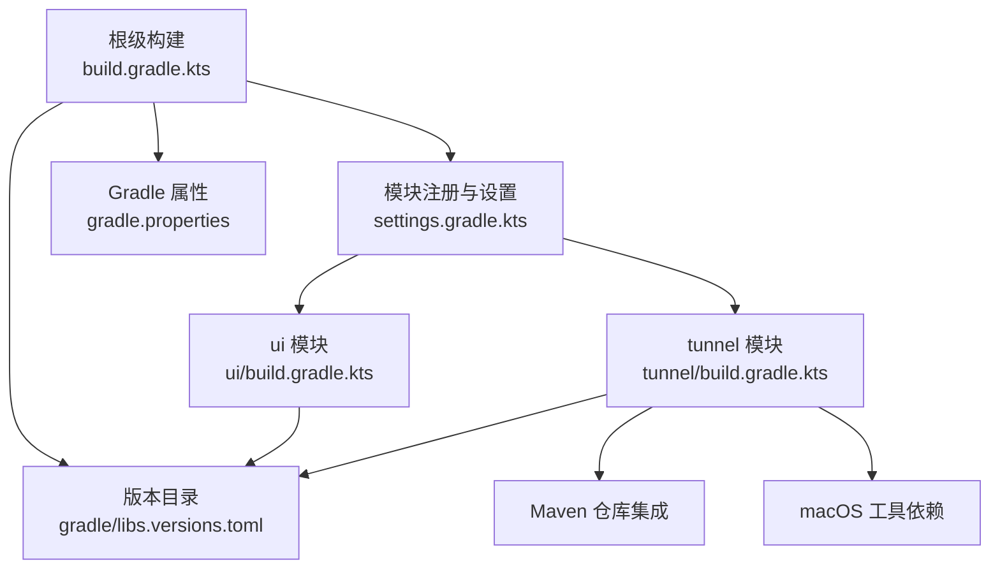
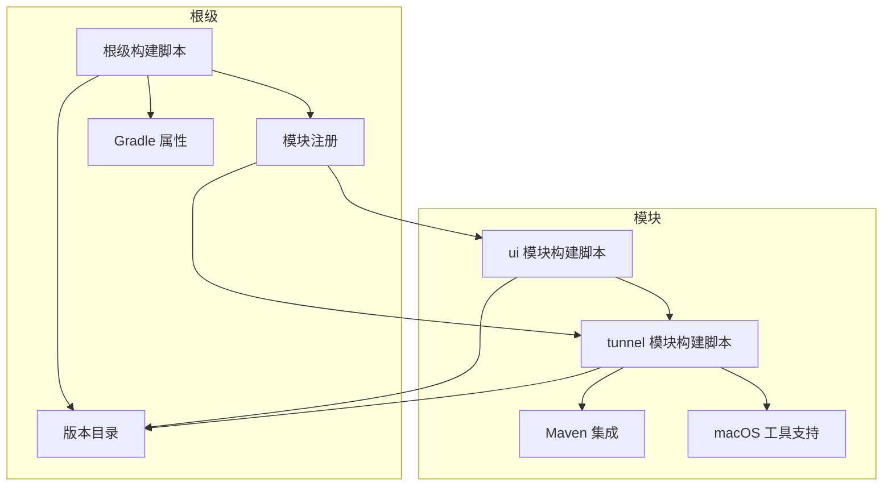
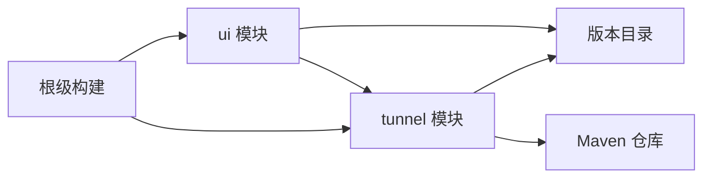

# 构建系统配置

<cite>
**本文引用的文件**   
- [根级 build.gradle.kts](file://build.gradle.kts)
- [settings.gradle.kts](file://settings.gradle.kts)
- [gradle.properties](file://gradle.properties)
- [版本目录 libs.versions.toml](file://gradle/libs.versions.toml)
- [tunnel 模块 build.gradle.kts](file://tunnel/build.gradle.kts)
- [ui 模块 build.gradle.kts](file://ui/build.gradle.kts)
- [ui ProGuard 优化规则](file://ui/proguard-android-optimize.txt)
</cite>

## 更新摘要
**变更内容**   
- 新增 macOS 工具依赖（flock）支持，改善跨平台构建体验
- 添加 tunnel 库的 Maven 集成详情，简化依赖管理
- 更新开发者入门指南，提供更清晰的跨平台构建说明

## 目录
1. [简介](#简介)
2. [项目结构](#项目结构)
3. [核心组件](#核心组件)
4. [架构总览](#架构总览)
5. [详细组件分析](#详细组件分析)
6. [依赖分析](#依赖分析)
7. [性能考虑](#性能考虑)
8. [故障排查指南](#故障排查指南)
9. [结论](#结论)
10. [附录](#附录)

## 简介
本文件系统性说明 WireGuard Android 项目的构建系统架构，重点覆盖：
- 根级构建脚本与模块依赖关系
- tunnel 与 ui 两个核心模块的构建配置（编译选项、资源处理、代码混淆）
- Gradle 版本目录管理（libs.versions.toml）的使用方法与依赖更新流程
- 多 ABI 支持（arm64-v8a、armeabi-v7a、x86_64、x86）的构建配置
- 签名配置、发布变体与调试变体的差异
- 自定义构建任务与优化构建性能的技巧
- **新增** macOS 工具依赖管理与跨平台构建支持
- **新增** tunnel 库的 Maven 集成配置

## 项目结构
项目采用 Gradle Kotlin DSL 的多模块结构，包含应用层 ui 模块与底层隧道能力 tunnel 模块。根级脚本负责统一插件、全局属性与公共依赖版本；各模块通过 settings.gradle.kts 注册并声明依赖关系。

**图表来源** 
- [根级 build.gradle.kts](file://build.gradle.kts)
- [settings.gradle.kts](file://settings.gradle.kts)
- [gradle.properties](file://gradle.properties)
- [版本目录 libs.versions.toml](file://gradle/libs.versions.toml)
- [tunnel 模块 build.gradle.kts](file://tunnel/build.gradle.kts)
- [ui 模块 build.gradle.kts](file://ui/build.gradle.kts)

**章节来源**
- [根级 build.gradle.kts](file://build.gradle.kts)
- [settings.gradle.kts](file://settings.gradle.kts)
- [gradle.properties](file://gradle.properties)
- [版本目录 libs.versions.toml](file://gradle/libs.versions.toml)

## 核心组件
- 根级构建脚本：集中声明 Android/Gradle 插件、全局编译目标与仓库源，为子模块提供统一的构建基线。
- 模块注册：通过 settings.gradle.kts 声明 ui 与 tunnel 模块，并定义模块间依赖。
- 版本目录：在 gradle/libs.versions.toml 中统一管理第三方库与工具链版本，供所有模块引用。
- 模块构建脚本：
  - ui 模块：Android 应用构建，含资源、清单、混淆与多渠道/多变体配置。
  - tunnel 模块：Android 库构建，集成 NDK/CMake 以编译 Go/JNI 原生库，并输出多 ABI 产物。
- **新增** macOS 工具依赖管理：支持 flock 等工具在不同平台的自动安装与使用。
- **新增** Maven 集成：简化 tunnel 库的依赖管理和发布流程。

**章节来源**
- [根级 build.gradle.kts](file://build.gradle.kts)
- [settings.gradle.kts](file://settings.gradle.kts)
- [版本目录 libs.versions.toml](file://gradle/libs.versions.toml)
- [tunnel 模块 build.gradle.kts](file://tunnel/build.gradle.kts)
- [ui 模块 build.gradle.kts](file://ui/build.gradle.kts)

## 架构总览
下图展示构建系统的整体依赖与数据流：根脚本统一插件与版本，settings 注册模块，ui 依赖 tunnel，两者均从版本目录获取依赖版本。

**图表来源** 
- [根级 build.gradle.kts](file://build.gradle.kts)
- [settings.gradle.kts](file://settings.gradle.kts)
- [版本目录 libs.versions.toml](file://gradle/libs.versions.toml)
- [tunnel 模块 build.gradle.kts](file://tunnel/build.gradle.kts)
- [ui 模块 build.gradle.kts](file://ui/build.gradle.kts)

## 详细组件分析

### 根级构建脚本（build.gradle.kts）
职责与要点：
- 统一引入 Android Gradle 插件与 Kotlin 插件，确保全项目一致的编译环境。
- 配置全局仓库源（如 Google、Maven Central），避免在各模块重复声明。
- 设置全局编译目标与语言级别，保证跨模块一致。
- 可选：集中声明常用依赖的版本或插件参数，便于集中维护。

建议检查点：
- 确认插件版本与 AGP/Kotlin 版本兼容。
- 确认仓库源顺序与可用性，避免下载失败。
- 若存在公共依赖，优先在根脚本或版本目录中声明。

**章节来源**
- [根级 build.gradle.kts](file://build.gradle.kts)

### 模块注册与设置（settings.gradle.kts）
职责与要点：
- 声明 ui 与 tunnel 模块路径，使 Gradle 识别多模块工程。
- 可在此处配置 Gradle 缓存、并行构建等全局行为。
- 可通过 includeBuild 或 composite builds 扩展外部构建（本项目未使用）。

**章节来源**
- [settings.gradle.kts](file://settings.gradle.kts)

### 版本目录管理（gradle/libs.versions.toml）
职责与要点：
- 集中管理第三方库与工具链版本，例如 AndroidX、Kotlin、NDK、CMake 等。
- 模块通过版本号别名引用，提升一致性并简化升级流程。
- 推荐命名规范：库名小写+下划线，版本号前缀清晰（如 lib、androidx、kotlin）。

依赖更新流程：
1. 打开 gradle/libs.versions.toml，定位需要更新的版本号。
2. 修改对应版本号后，同步 Gradle 并执行一次完整构建验证。
3. 若有 API 变更，按报错提示调整调用代码。
4. 提交变更并通过 CI 验证。

最佳实践：
- 将不稳定的预览版与稳定版分离，按需切换。
- 对关键依赖（AGP、Kotlin、NDK）进行兼容性矩阵测试。

**章节来源**
- [版本目录 libs.versions.toml](file://gradle/libs.versions.toml)

### Gradle 属性（gradle.properties）
职责与要点：
- 设置 JVM 内存、并行构建、守护进程等构建性能相关参数。
- 可配置 Android 构建选项（如启用增量编译、R8 优化开关）。
- 可注入环境变量或密钥占位符（生产环境建议使用安全方式注入）。

常见优化项：
- org.gradle.jvmargs 调大堆内存，避免 OOM。
- org.gradle.parallel=true 开启并行构建。
- android.enableR8.fullMode=true 启用完整 R8 优化（发布变体）。

**章节来源**
- [gradle.properties](file://gradle.properties)

### tunnel 模块构建配置（tunnel/build.gradle.kts）
职责与要点：
- 声明为 Android Library，暴露 Java/Kotlin API 给 ui 模块。
- 集成 NDK/CMake，编译 Go/JNI 原生库，生成多 ABI 的 .so 文件。
- 配置 CMakeLists 与 JNI 入口，确保不同 ABI 正确链接。
- 可选：添加预编译二进制或本地 AAR 作为依赖。

多 ABI 支持：
- 在 defaultConfig.ndk 中指定支持的 ABI 列表：arm64-v8a、armeabi-v7a、x86_64、x86。
- 确保 CMake 配置与 NDK 工具链匹配，避免链接错误。
- 产物校验：构建后检查各 ABI 目录下是否生成对应 .so。

编译选项建议：
- 启用 LTO（Release）减小体积。
- 合理设置 C++ 标准与优化等级（-O2/-Os）。
- 使用 ndk-build 或 CMake 变量控制调试符号与日志输出。

**新增** Maven 集成：
- 配置 Maven 仓库以支持依赖解析和发布。
- 简化依赖管理流程，提高构建效率。
- 支持版本化依赖管理，便于团队协作。

**新增** macOS 工具依赖：
- 自动检测并安装 flock 等必需工具。
- 提供跨平台构建支持，改善开发者体验。
- 在构建脚本中添加平台特定的工具处理逻辑。

**章节来源**
- [tunnel 模块 build.gradle.kts](file://tunnel/build.gradle.kts)

### ui 模块构建配置（ui/build.gradle.kts）
职责与要点：
- 声明为 Android Application，打包最终 APK/AAB。
- 配置 applicationId、versionCode/versionName、minSdk/targetSdk。
- 资源处理：合并 main/debug/googleplay 等资源目录，支持主题与多语言。
- 代码混淆：启用 R8/ProGuard，使用 ui/proguard-android-optimize.txt 优化规则。
- 变体管理：debug 与 release（或 googleplay）变体，分别配置签名与优化。

资源处理：
- 通过 res.srcDirs 或默认目录结构组织资源。
- 使用 flavor 或 productFlavor 区分渠道（如 googleplay）。
- 动态资源与字符串资源按语言/屏幕密度自动选择。

混淆与优化：
- 启用 minifyEnabled 与 shrinkResources。
- 在 proguard-android-optimize.txt 中添加保留规则（反射、JNI、序列化等）。
- 使用 mapping 文件定位线上崩溃栈。

**章节来源**
- [ui 模块 build.gradle.kts](file://ui/build.gradle.kts)
- [ui ProGuard 优化规则](file://ui/proguard-android-optimize.txt)

### 多 ABI 支持（arm64-v8a, armeabi-v7a, x86_64, x86）
实现要点：
- 在 tunnel 模块的 defaultConfig.ndk.abiFilters 中列出目标 ABI。
- CMake 配置需为每个 ABI 生成对应架构的二进制。
- 构建时可使用 --stacktrace 与 --info 查看具体 ABI 构建日志。
- 产物验证：检查 app 包内 lib 目录是否包含全部 ABI 的 .so。

常见问题：
- ABI 过滤缺失导致运行时找不到符号。
- CMake 工具链版本与 NDK 不匹配导致链接失败。
- 某些设备不支持 x86/x86_64，需在分发策略中取舍。

**章节来源**
- [tunnel 模块 build.gradle.kts](file://tunnel/build.gradle.kts)

### 签名配置与变体差异
签名配置：
- debug 变体：使用 Android 默认调试签名，便于快速安装与调试。
- release/googleplay 变态：使用正式 Keystore，配置 keyAlias/keyPassword/storeFile 等。
- 建议将敏感信息放入 gradle.properties 或环境变量，避免硬编码。

变体差异：
- debug：关闭混淆与资源压缩，启用详细日志，便于开发调试。
- release/googleplay：开启 R8 优化、资源压缩、LTO，减小体积并提升性能。
- 渠道特定清单或资源：通过 src/googleplay 目录覆盖默认配置。

**章节来源**
- [ui 模块 build.gradle.kts](file://ui/build.gradle.kts)

### 自定义构建任务与优化技巧
常见自定义任务：
- 清理原生库：删除 build 目录下的 .so 与中间产物，强制重新编译。
- 版本注入：根据 Git 标签或 CI 环境变量生成 versionName。
- 资源校验：扫描资源引用，检测未使用资源或冲突。

性能优化技巧：
- 启用 Gradle 构建缓存与守护进程。
- 使用 ./gradlew --parallel 并行执行任务。
- 合理划分模块，减少单模块编译规模。
- 使用 Android Studio 的"仅运行受影响模块"功能加速迭代。
- 在 CI 中缓存依赖与构建产物，缩短流水线时间。

**新增** 跨平台构建优化：
- 自动检测构建平台并配置相应的工具链。
- 提供统一的构建接口，屏蔽平台差异。
- 支持 Docker 容器化构建，确保环境一致性。

**章节来源**
- [gradle.properties](file://gradle.properties)
- [tunnel 模块 build.gradle.kts](file://tunnel/build.gradle.kts)
- [ui 模块 build.gradle.kts](file://ui/build.gradle.kts)

## 依赖分析
模块依赖关系如下：
- ui 依赖 tunnel（通过 API 调用后端能力）。
- 两者均通过版本目录引用第三方库，避免版本漂移。
- 根脚本统一插件与仓库源，降低耦合度。
- **新增** tunnel 模块通过 Maven 集成管理依赖，提高可维护性。

**图表来源** 
- [settings.gradle.kts](file://settings.gradle.kts)
- [版本目录 libs.versions.toml](file://gradle/libs.versions.toml)
- [tunnel 模块 build.gradle.kts](file://tunnel/build.gradle.kts)
- [ui 模块 build.gradle.kts](file://ui/build.gradle.kts)

**章节来源**
- [settings.gradle.kts](file://settings.gradle.kts)
- [版本目录 libs.versions.toml](file://gradle/libs.versions.toml)
- [tunnel 模块 build.gradle.kts](file://tunnel/build.gradle.kts)
- [ui 模块 build.gradle.kts](file://ui/build.gradle.kts)

## 性能考虑
- 构建缓存：启用 Gradle 构建缓存与远程缓存（CI 场景）。
- 并行构建：开启 org.gradle.parallel=true，充分利用多核 CPU。
- 增量编译：保持源码与依赖稳定，减少无效重编译。
- 资源压缩：release 变体启用资源压缩与 R8，显著减小包体。
- 原生库优化：启用 LTO、裁剪未用符号，减少 .so 体积。
- 分模块构建：仅构建受影响的模块，缩短反馈周期。
- **新增** 跨平台构建优化：利用平台特定的构建优化策略，提升构建效率。

## 故障排查指南
常见问题与解决思路：
- 依赖解析失败：检查仓库源与网络代理，确认版本目录中的版本号有效。
- NDK/CMake 版本不匹配：对齐 NDK 与 CMake 版本，参考官方兼容性矩阵。
- ABI 缺失符号：确认 abiFilters 与 CMake 输出一致，必要时清理重建。
- 混淆导致崩溃：检查 proguard-android-optimize.txt 保留规则，补充反射/JNI/序列化类。
- 签名错误：核对 keystore 路径、别名与密码，确保 release 变体正确配置。
- **新增** macOS 工具缺失：确保 flock 等工具已正确安装，检查 PATH 环境变量。
- **新增** Maven 连接问题：验证网络连接和仓库配置，检查认证凭据。

定位手段：
- 使用 ./gradlew --stacktrace 查看详细堆栈。
- 使用 ./gradlew --info 查看构建过程日志。
- 检查 app 包内 lib 目录与 META-INF 内容是否符合预期。
- **新增** 检查平台特定的构建日志，确认工具链正确加载。

**章节来源**
- [ui 模块 build.gradle.kts](file://ui/build.gradle.kts)
- [tunnel 模块 build.gradle.kts](file://tunnel/build.gradle.kts)
- [gradle.properties](file://gradle.properties)

## 结论
WireGuard Android 的构建系统以 Gradle Kotlin DSL 为核心，通过根级脚本统一插件与仓库，settings 注册模块，版本目录集中管理依赖版本。ui 与 tunnel 模块职责清晰：ui 负责界面与交互，tunnel 封装底层隧道能力并集成 NDK/CMake 生成多 ABI 原生库。通过合理的变体管理、混淆优化与性能调优，可在保证安全与性能的同时提升开发效率。

**新增改进**：通过添加 macOS 工具依赖支持和 Maven 集成，进一步改善了跨平台构建体验和依赖管理效率，为开发者提供了更友好的构建环境。

## 附录
- 常用命令：
  - 清理构建：./gradlew clean
  - 构建 debug：./gradlew assembleDebug
  - 构建 release：./gradlew assembleRelease
  - 仅构建某模块：./gradlew :ui:assembleDebug
- 建议的 CI 步骤：
  - 拉取代码 → 恢复依赖缓存 → 构建所有变体 → 运行测试 → 归档产物
- **新增** 跨平台构建注意事项：
  - 确保目标平台安装了必要的工具链和依赖。
  - 使用 Docker 容器化构建以确保环境一致性。
  - 在 CI 中配置多平台构建矩阵，验证各平台兼容性。